# Design Amazon

*Worked Example -- 75 min*

---

## Phase 1: Clarify the Problem & Scope *(5--7 min)*

> **Say:** "Let me restate -- we're designing an e-commerce platform like Amazon. Users browse a product catalog, search for items, add them to a cart, and check out. The system needs to manage inventory across warehouses, process orders, and handle fulfillment. Let me scope this down."

### Questions I'd Ask

- **What outcome are we optimizing for?** *-> Purchase conversion rate (session -> order) and customer lifetime value. Secondary: delivery speed (same-day/next-day), selection breadth. This shapes architecture: the browse path must be FAST (every 100ms of latency costs ~1% sales), the buy path must be CORRECT (no overselling), and the delivery promise must be HONEST (showing "delivery by Tuesday" when it's actually Thursday destroys trust).*
- **Marketplace or first-party only?** Do we support third-party sellers, or just our own inventory? *-> Both. Marketplace model with our own warehousing (FBA-like) is most interesting.*
- **Core flow?** Browse -> search -> product detail -> cart -> checkout -> order tracking? *-> Yes, this is the primary flow.*
- **Inventory model?** Single warehouse or distributed? *-> Multi-warehouse. Inventory is distributed across regions.*
- **Payment?** *-> Acknowledge integration with payment provider, don't deep-dive the payment gateway itself.*
- **Recommendations?** *-> Mention as a component, not a deep dive.*
- **Scale?** *-> ~300M active customers, ~500M products in catalog, ~5M orders/day normal, ~50M on peak days (Prime Day, Black Friday).*
- **Flash sales / peak events?** *-> Yes, must handle 10x traffic spikes. This is a critical constraint.*

### Agreed Scope

| In Scope | Out of Scope |
|---|---|
| Product catalog & detail pages | Seller portal / seller onboarding |
| Product search | Recommendation engine internals |
| Shopping cart | Returns & refunds |
| Checkout & inventory reservation | Delivery logistics / last-mile |
| Order processing pipeline | Reviews & ratings |
| Inventory management (multi-warehouse) | Prime membership system |
| Order tracking | Advertising platform |

### Core Use Cases (ranked)

- **UC1:** User browses/searches products -> views product detail page with price, availability, and delivery estimate
- **UC2:** User adds item to cart -> cart persists across sessions
- **UC3:** User checks out -> inventory reserved -> payment processed -> order created
- **UC4:** Order is fulfilled -> user tracks status (placed -> packed -> shipped -> delivered)

### Non-Functional Requirements

- **Inventory accuracy is paramount** -- we must NEVER sell more than we have (overselling). This means strong consistency on the inventory decrement path.
- **Product catalog reads are eventually consistent** -- a product page showing a price that's 30 seconds stale is fine. Availability > freshness for browsing.
- **Checkout must be ACID** -- inventory reservation + order creation is a transaction that must not partially fail.
- **10x spike tolerance** -- must handle Black Friday / Prime Day without degradation. This means the system can't be designed for average load only.
- **Cart is durable** -- users expect their cart to survive app restarts and multi-device access.
- **Catalog is read-heavy** -- 100:1 read:write ratio on product pages. Most users browse, few buy.
- **Global** -- multi-region serving for low latency. Inventory is regional (warehouse-specific).

> **Tip:** The defining tension of this system: product browsing wants availability and speed (eventually consistent, heavily cached), but checkout wants correctness (strongly consistent, transactional). The architecture must cleanly separate these two worlds.

---

## Phase 2: Back-of-the-Envelope Estimation *(3--5 min)*

> **Say:** "Let me run the numbers. I want to separate normal load from peak load since the 10x spike is a first-class design constraint."

| Metric | Value | Detail |
|---|---|---|
| **Product Page Views / Day** | **~5B** | 300M users x ~17 pages/day. ~58K/sec avg, **~500K/sec peak.** |
| **Search Queries / Day** | **~1B** | ~12K/sec avg, ~100K/sec peak. |
| **Cart Updates / Day** | **~200M** | ~2.3K/sec avg, ~20K/sec peak. Add/remove/update quantity. |
| **Orders / Day** | **5M norm / 50M peak** | ~58/sec avg, ~580/sec peak. Each order avg 3 items -> ~1.7K inventory ops/sec peak. |
| **Product Catalog Size** | **500M products** | ~2KB per product record -> ~1TB of structured data. Images: ~50TB total. |
| **Inventory Records** | **~2B rows** | 500M products x avg 4 warehouse locations. ~200GB structured data. |
| **Read:Write Ratio (catalog)** | **~100:1** | 5B page views vs. ~50M catalog updates/day. |
| **Conversion Rate** | **~2-3%** | Of users who browse, few buy. System must optimize for the 97% browsing AND the 3% buying. |

> **Decision:** **Key insight #1:** 500K product page views/sec at peak. The catalog MUST be served from cache/CDN. Hitting the database for every product page is impossible.

> **Decision:** **Key insight #2:** Inventory operations are relatively low volume (~1.7K/sec peak) BUT require strong consistency. This is a correctness problem, not a throughput problem. We can use a traditional relational DB with row-level locking.

> **Decision:** **Key insight #3:** The 10x spike between normal and peak means we need elastic compute and aggressive caching. Designing for peak = overprovisioned 90% of the time. Designing for average = crashing on Black Friday. Solution: auto-scaling + queue-based order processing to absorb spikes.

---

## Phase 3: High-Level Design *(8--12 min)*

> **Say:** "I'll draw the major services and walk through three flows: browsing a product page, the checkout critical path, and order fulfillment."

### Key Architecture Decisions

> **Say:** "Here's WHY I chose each technology -- mapping requirements to tradeoffs. Every choice has a rejected alternative and a consequence."

| Requirement | Decision | Why (and what was rejected) | Consistency |
|---|---|---|---|
| Never oversell inventory (financial integrity) | PostgreSQL with compare-and-swap | UPDATE ... WHERE count > 0 is atomic. Eventual consistency would allow overselling during flash sales. | CP |
| Cart: spiky traffic, simple key-value | DynamoDB (not PostgreSQL) | Single-key lookups, TTL expiration, auto-scaling. No relational joins needed. PostgreSQL would need manual scaling for Black Friday spikes. | AP |
| Product search with facets + filters | Elasticsearch (not PostgreSQL full-text) | Faceted aggregations (brand, price range, ratings) are native in ES. PostgreSQL full-text search can't do facets efficiently. | AP |
| Order state requires ACID | PostgreSQL for orders (sharded by customer_id) | 95% of queries are "my orders" -- single-shard. Order->payment->shipment requires foreign keys + transactions. | CP |
| Fulfillment is async (doesn't block checkout) | Kafka / SQS for order events | Checkout completes in <3s. Warehouse processing takes hours. Queue decouples critical path from async pipeline. | -- |
| Product images at CDN scale | S3 + CDN with content-addressable URLs | URL includes content hash -> zero cache invalidation needed. New image = new URL. Old URLs expire naturally. | -- |

### Major Components

```mermaid
graph TD
    subgraph CLIENTS
        A["Client Apps<br/>Web - iOS - Android"]
    end

    subgraph EDGE / LOAD BALANCING
        B["CDN<br/>product images - static"]
        C["API Gateway<br/>auth - rate limit - route"]
    end

    subgraph APPLICATION SERVICES
        D["Catalog<br/>products - browse"]
        E["Search<br/>Elasticsearch"]
        F["Cart<br/>stateful sessions"]
        G["Inventory<br/>stock count"]
        H["Order/Checkout<br/>critical path"]
        I["Fulfillment<br/>async pipeline"]
    end

    subgraph CACHING
        J["Redis<br/>cart - sessions - catalog"]
    end

    subgraph MESSAGE QUEUE / ASYNC
        K["Kafka / SQS<br/>order events - fulfillment"]
    end

    subgraph DATA STORES
        L["PostgreSQL<br/>orders - users"]
        M["DynamoDB<br/>cart - inventory"]
        N["Elasticsearch<br/>product search"]
        O["S3<br/>images - assets"]
    end

    A --> B
    A --> C
    C --> D
    C --> E
    C --> F
    C --> H
    H --> G
    H --> K
    K --> I
    F --> J
    D --> J
    E --> N
    H --> L
    F --> M
    D -.-> O
end
```

#### Client Apps [CLIENT]

- Web, iOS, Android
- REST API for CRUD, CDN for static assets

#### API Gateway + CDN [EDGE]

- AuthN, rate limiting, routing
- CDN caches product pages, images

#### Product Catalog Service [READ PATH]

- Product details, pricing, images
- Heavily cached (Redis + CDN)
- Seller updates via async pipeline

#### Search Service [READ PATH]

- Full-text search + faceted filtering
- Elasticsearch cluster
- Autocomplete, spell correction

#### Cart Service [STATEFUL]

- Add/remove/update cart items
- Persists across sessions & devices
- DynamoDB or Redis + DB backing

#### Inventory Service [CRITICAL]

- Real-time stock counts per warehouse
- Reserve / release / decrement
- Strong consistency -- the hardest piece

#### Checkout / Order Service [CRITICAL]

- Orchestrates: inventory -> payment -> order creation
- ACID transaction across steps
- Idempotent (retry-safe)

#### Order Fulfillment Service [ASYNC]

- Picks warehouse, generates shipping
- State machine: placed -> packed -> shipped -> delivered
- Integrates with shipping carriers

### Flow 1: Product Browsing (the fast path)

```mermaid
graph TD
    A["Client"] -->|"cache HIT -> return immediately (~5ms)<br/>cache MISS ↓"| B["CDN"]
    B --> C["API Gateway"]
    C -->|"1. check Redis cache<br/>2. miss -> read from Products DB<br/>3. enrich with availability (Inventory cache)<br/>4. populate cache, return"| D["Catalog Service"]
```



### Flow 2: Checkout (the critical path)


### Flow 3: Order Fulfillment (async pipeline)


> **Say:** "The most architecturally interesting challenge is the inventory reservation at checkout -- how do we prevent overselling without creating a bottleneck? That's what I'd like to deep-dive first. Second, the order pipeline is a good saga / state machine discussion."

---

## Phase 4: Deep Dives *(25--30 min)*

### Deep Dive 1: Inventory Management & Checkout (~12 min)

> **Goal:** **The core challenge:** Never oversell. When 1,000 users simultaneously try to buy the last 5 units of a hot item on Black Friday, exactly 5 succeed and 995 get "out of stock." This is a concurrency control problem at the database level.

**Inventory Model: Reserve -> Confirm -> Release**

- **Available stock** = total_stock - reserved_stock - sold_stock
- **Reserve:** At checkout, atomically decrement available_count. Item is "held" for this order.
- **Confirm:** On successful payment, convert reservation to sale (decrement reserved, increment sold).
- **Release:** On failed payment, timeout, or cancellation, release the reservation (increment available back).
- **TTL on reservations:** If payment isn't confirmed within 10 minutes, reservation auto-expires. Background job sweeps expired reservations.

```sql
-- Inventory DB (PostgreSQL, sharded by product_id) --
inventory
  product_id      UUID
  warehouse_id    UUID
  total_stock      INT          // total units in this warehouse
  reserved_stock   INT          // currently held by in-flight checkouts
  sold_stock       INT          // confirmed sold
  -- available = total_stock - reserved_stock - sold_stock
  PRIMARY KEY (product_id, warehouse_id)
  updated_at       TIMESTAMP

reservations
  id              UUID PK
  order_id        UUID
  product_id      UUID
  warehouse_id    UUID
  quantity         INT
  status           ENUM (reserved, confirmed, released, expired)
  expires_at       TIMESTAMP    // 10 min from creation
  created_at       TIMESTAMP
```

**The Critical SQL: Atomic Reservation**

```sql
-- Atomic inventory reservation (no overselling) --

UPDATE inventory
SET reserved_stock = reserved_stock + :quantity
WHERE product_id = :product_id
  AND warehouse_id = :warehouse_id
  AND (total_stock - reserved_stock - sold_stock) >= :quantity;

-- If affected_rows = 0 -> insufficient stock -> return "out of stock"
-- If affected_rows = 1 -> reservation succeeded
-- The WHERE clause + UPDATE is atomic (row-level lock in Postgres)
-- No explicit SELECT FOR UPDATE needed -- the conditional UPDATE is sufficient
```

#### Pessimistic Locking (SELECT FOR UPDATE)

- Lock the row -> read -> check -> update -> release lock
- Simple to reason about
- Locks held during payment processing -> deadlocks under load
- Hot items create lock contention (1000 threads waiting for same row)

**Do not lock during payment -- only during reservation**

#### Conditional UPDATE (our approach)

- Single atomic UPDATE with WHERE guard -> no explicit lock held
- Lock duration is microseconds (just the UPDATE)
- No deadlocks -- single statement
- Hot items handled fine -- Postgres serializes row-level UPDATEs
- Under extreme contention (>1000 concurrent), consider Redis-based counter as a pre-filter

**Default approach -- fast, correct, simple**

> **Decision:** **Why not Redis for inventory counts?** Redis is faster, but inventory is a CORRECTNESS problem. If Redis crashes before persisting, we lose reservation state and risk overselling. A SQL conditional UPDATE gives us ACID + durability + simple recovery. At ~1.7K inventory ops/sec peak, Postgres handles this easily. Tradeoff: higher latency per operation (~5ms vs. Redis ~1ms), but correctness outweighs speed here. Redis IS used as a pre-filter ("approximate availability" check) to reject clearly-out-of-stock requests before hitting the DB.

**Hot Item Strategy (Lightning Deals / Last Unit)**

- **Problem:** 10,000 users try to buy 100 units simultaneously -> 10,000 DB transactions hitting the same row.
- **Pre-filter with Redis:** Maintain an approximate counter in Redis. Requests check Redis first -- if counter says 0, reject immediately without hitting DB. Only let through ~2x the remaining stock.
- **Queue-based checkout for flash sales:** For specific sale events, route checkout requests through an SQS queue. Process sequentially at DB level. Users get "your order is being processed" response and poll for status.
- **Warehouse spreading:** Split hot item inventory across multiple warehouse rows. Reserve from any warehouse with stock. Reduces per-row contention.

> **Tip:** **The two-level architecture:** Approximate availability (Redis, eventually consistent, for product page display) + exact reservation (Postgres, strongly consistent, for checkout). Users see "In Stock" on the page (cached, might be slightly wrong), but actual reservation at checkout is always accurate.

**Checkout Orchestration (Saga Pattern)**

- **Step 1: Reserve inventory** -> on failure: return error, stop.
- **Step 2: Charge payment** -> on failure: RELEASE inventory reservation, return error.
- **Step 3: Create order record** -> on failure: REFUND payment, RELEASE inventory, return error.
- **Step 4: Publish `order.placed` event** -> on failure: order exists but fulfillment retries from event.

> **Decision:** **Orchestration vs. Choreography saga?** Orchestration -- the Order Service is the central coordinator that calls each step and handles compensating actions. With choreography (each service reacts to events), the failure recovery becomes distributed and much harder to debug. At this complexity level, a single orchestrator with clear compensating transactions is simpler. Tradeoff: the Order Service is a single point of coordination (but not a single point of failure -- it's stateless and horizontally scaled, with the order state in the DB).

> **Decision:** **Idempotency:** Every checkout request gets a client-generated `idempotency_key`. Order Service checks if this key already has an order -> returns existing order. This prevents double-charges on retries (network timeout, user double-clicks). Critical for payment safety.

### Deep Dive 2: Order Processing Pipeline (~8 min)

> **Goal:** **The core challenge:** Process 5M orders/day (50M peak) through a multi-step fulfillment pipeline with reliable state tracking. Each order may span multiple warehouses and shipping carriers.

**Order State Machine**


Multi-item orders: if items ship from different warehouses, each creates a separate SHIPMENT. Order status = worst-case of its shipments.

CANCELLED can happen from PLACED or PROCESSING (not after PACKED). On cancel: release inventory, initiate refund.

> **Decision:** **Storage: PostgreSQL for orders.** Same rationale as the Trip Service in the Uber design -- orders are our most critical business records, we need ACID, and the write volume (~580/sec peak) is well within Postgres capacity. Sharded by customer_id for efficient "my orders" queries.

```sql
-- Orders DB (PostgreSQL, sharded by customer_id) --
orders
  id               UUID PK
  customer_id      BIGINT (shard key)
  status            ENUM (placed, processing, packed, shipped, delivered, cancelled)
  total_amount      DECIMAL
  currency          CHAR(3)
  shipping_address  JSONB
  payment_id        UUID (ref to payment provider txn)
  idempotency_key   UUID UNIQUE
  placed_at         TIMESTAMP
  updated_at        TIMESTAMP

order_items
  id               UUID PK
  order_id         UUID FK -> orders
  product_id       UUID
  warehouse_id     UUID
  quantity          INT
  unit_price        DECIMAL (price at time of purchase)
  reservation_id   UUID FK -> reservations

shipments
  id               UUID PK
  order_id         UUID FK -> orders
  warehouse_id     UUID
  carrier           VARCHAR
  tracking_number   VARCHAR
  status            ENUM (pending, picked, packed, shipped, delivered)
  estimated_delivery TIMESTAMP
  shipped_at        TIMESTAMP

-- Indexes: (customer_id, placed_at DESC), (status) for fulfillment queries
```

**Event-Driven Fulfillment**

- **Event flow:** `order.placed` -> Fulfillment Service consumes -> assigns warehouse -> creates shipments -> publishes `shipment.created` -> Warehouse System picks items -> `shipment.packed` -> Carrier integration -> `shipment.shipped` -> Carrier webhook -> `shipment.delivered`.
- **Each state transition:** Update order/shipment status in DB, publish event to Kafka, Notification Service sends email/push to customer.
- **Warehouse selection:** For each item, pick the warehouse that (a) has stock AND (b) is closest to the shipping address. Goal: minimize shipping cost and delivery time. If one warehouse has all items, prefer a single shipment. If not, split into multiple shipments.

> **Decision:** **Why event-driven instead of synchronous orchestration for fulfillment?** Fulfillment is inherently async -- it takes hours to days. Synchronous calls would mean holding connections open or polling. Event-driven lets each stage proceed independently, with Kafka providing durability. If the packing service is temporarily down, events queue up and process when it recovers. Tradeoff: harder to debug end-to-end (need distributed tracing), but the natural async nature of physical fulfillment makes events the right fit.

> **Tip:** **Delivery estimate:** Shown at checkout. Computed by: warehouse selection (distance) + warehouse processing SLA (24h avg) + carrier transit time (carrier API). This is a latency-sensitive calculation done synchronously at checkout but backed by precomputed carrier transit-time tables.

### Deep Dive 3: Product Catalog & Search (~5 min)

> **Goal:** **The core challenge:** Serve 500M products at 500K reads/sec peak with <100ms latency. Index for full-text search with faceted filtering (category, price range, brand, rating).

**Catalog Architecture**

| Layer | Tech | What It Serves | TTL / Freshness |
|---|---|---|---|
| CDN | CloudFront | Product page HTML, images, static data | 5--15 min TTL |
| Application Cache | Redis Cluster | Product objects (structured data for API) | 30s--5 min TTL |
| Primary Store | PostgreSQL (sharded) | Source of truth for product data | Strong |
| Search Index | Elasticsearch | Full-text search, faceted filtering, autocomplete | Near-real-time (seconds lag) |
| Media | S3 + CDN | Product images (multiple sizes) | Immutable (versioned URLs) |

> **Decision:** **Why Elasticsearch for search instead of database full-text?** Postgres full-text search works for simple queries but breaks down at our scale: 500M products with faceted filtering (category AND price range AND brand AND rating AND availability) requires an inverted index purpose-built for this. Elasticsearch gives us relevance scoring, fuzzy matching, autocomplete, and horizontal scaling. Tradeoff: it's not our source of truth -- it's a derived index. Product updates flow through Kafka to an ES indexing consumer. There's a 1-5 second lag between a seller updating a price and the search index reflecting it.

```sql
-- Products DB (PostgreSQL, sharded by product_id) --
products
  id               UUID PK
  seller_id        BIGINT
  title             VARCHAR(500)
  description       TEXT
  category_id       INT
  brand             VARCHAR
  price             DECIMAL
  currency          CHAR(3)
  image_urls        TEXT[] (S3 keys)
  attributes        JSONB (color, size, weight, etc.)
  avg_rating        DECIMAL (denormalized)
  review_count      INT (denormalized)
  status            ENUM (active, inactive, suspended)
  created_at        TIMESTAMP
  updated_at        TIMESTAMP

-- Elasticsearch Index --
products_index
  All fields from products table, PLUS:
  availability      BOOLEAN (approximate, updated periodically)
  search_keywords    TEXT (title + brand + category + attributes, analyzed)
  // Mapping: title -> text (analyzed) + title.keyword (exact match)
  // Facets: category_id, brand, price (range), avg_rating (range)
```

**Catalog Update Pipeline**

- **Seller updates product** -> write to Products DB -> publish `product.updated` to Kafka
- **Consumers:** (1) ES Indexer updates search index, (2) Cache Invalidator deletes Redis + CDN cache entries
- **Price changes** are applied immediately in DB but may take 30s--5 min to propagate through all cache layers. The checkout flow always re-validates price from DB (not cache) to prevent stale-price purchases.

> **Tip:** **Price integrity:** The price shown on the product page (from cache) is a display price. The price charged at checkout is always fetched fresh from the Products DB. If the price changed between browsing and buying, the checkout shows "price has changed" and asks for confirmation. This protects both the customer and the seller.

### Deep Dive 4: Data Model & Storage Summary (~5 min)

| Data | Store | Access Pattern | Consistency |
|---|---|---|---|
| Product Catalog | PostgreSQL (sharded) + Redis + CDN | 500K reads/sec peak (from cache). 50M seller updates/day. | Strong writes, eventual reads |
| Search Index | Elasticsearch (cluster) | 100K search queries/sec peak. Faceted filtering + ranking. | Near-real-time (seconds lag from source) |
| Inventory | PostgreSQL (sharded by product_id) | ~1.7K reservations/sec peak. Conditional UPDATEs. | Strong (ACID) -- non-negotiable |
| Shopping Cart | DynamoDB (or Redis + DB) | ~20K updates/sec peak. Key-value by user_id. | Strong (durable across sessions) |
| Orders | PostgreSQL (sharded by customer_id) | ~580 writes/sec peak. "My orders" query. | Strong (ACID) |
| Shipments | PostgreSQL (same cluster as orders) | Updated by fulfillment pipeline. Query by order_id. | Strong |
| User Profiles | PostgreSQL + Redis cache | Read-heavy, addresses, payment methods. | Strong writes, cached reads |
| Product Images | S3 + CDN | ~50TB total. Immutable (versioned). Served from CDN edge. | Eventual (CDN propagation) |
| Events | Kafka | order.placed, product.updated, shipment.status_changed, etc. | Ordered per partition |

> **Decision:** **Why DynamoDB for cart instead of Redis?** Cart data must be durable (survive app restarts, persist across devices). Redis with persistence (RDB/AOF) can do this, but DynamoDB gives us built-in durability, auto-scaling (critical for 10x spikes), and single-digit ms reads with zero ops burden. The access pattern is simple key-value (user_id -> cart items) which is DynamoDB's sweet spot. Tradeoff: higher per-request cost than Redis, but carts are small (~5KB avg) and the ops simplicity is worth it at scale.

> **Decision:** **Why Postgres for both inventory AND orders?** They're different databases (different shard keys: product_id vs. customer_id), but same technology because both need ACID transactions. The checkout saga coordinates between them. We don't try to do a distributed transaction across them -- instead, we use the saga with compensating actions. If the order write fails after inventory reservation, we release the reservation as compensation.

---

## API Design

### Product Catalog

```http
GET /v1/products/{product_id}
```

Product detail page

Response: `{id, title, description, price, images[], attributes, avg_rating, review_count, availability}`
Heavily cached (CDN + Redis). Availability is approximate.

```http
GET /v1/search?q={query}&category=&price_min=&price_max=&brand=&sort=&cursor=&limit=
```

Backed by Elasticsearch. Response: `{products[], facets: {categories[], brands[], price_ranges[]}, total_count, next_cursor}`

### Shopping Cart

```http
GET /v1/cart
```

Get current user's cart

Response: `{items: [{product_id, quantity, unit_price, product_snapshot}], subtotal}`

```http
POST /v1/cart/items
```

Add item to cart

Request: `{product_id, quantity}`

```http
PUT /v1/cart/items/{product_id}
```

Update quantity

Request: `{quantity}` -- set to 0 to remove

```http
DELETE /v1/cart
```

Clear entire cart

### Checkout & Orders

```http
POST /v1/checkout
```

Process checkout (the critical path)

Request: `{shipping_address_id, payment_method_id, idempotency_key}`
Response: `{order_id, status: "placed", estimated_delivery, total_charged}`
Headers: `Idempotency-Key: {uuid}` -- prevents double charges on retry.

```http
GET /v1/orders?cursor=&limit=20
```

My orders (paginated)

```http
GET /v1/orders/{order_id}
```

Order detail with shipment tracking

Response: `{order, items[], shipments: [{id, status, tracking_number, carrier, estimated_delivery}]}`

```http
POST /v1/orders/{order_id}/cancel
```

Cancel order (if before PACKED)

Triggers: release inventory reservation, initiate refund.

---

## Phase 5: Cross-Cutting Concerns *(10--12 min)*

### Failure Scenarios & Mitigation

| Scenario | Mitigation |
|---|---|
| Inventory DB shard down | Primary-replica failover. During failover (~30s), checkouts for products on that shard queue and retry. Product browsing is unaffected (served from cache). The Redis pre-filter still rejects clearly-out-of-stock requests. |
| Payment provider timeout | Inventory is already reserved with 10-min TTL. Retry payment with exponential backoff. If retries exhausted, release reservation and return error to user. They can retry checkout manually. |
| Double checkout (user clicks twice) | Idempotency key catches this. Second request returns existing order without creating a duplicate or double-charging. |
| Reservation expires before payment | Background sweeper releases expired reservations every 60s. If payment succeeds AFTER reservation expired, the order creation step will attempt to re-reserve -- if stock is gone, refund payment and notify user. |
| Elasticsearch cluster down | Search is degraded but browsing continues (product pages served from cache/DB). Fallback: route search queries to a simpler DB-backed search (slower, less relevant). Alert on-call. |
| Kafka consumer lag (fulfillment) | Orders are placed and recorded in DB. Fulfillment is delayed but not lost. Consumers catch up. Customer sees "processing" slightly longer than usual. |
| CDN origin overloaded | Stale-while-revalidate: CDN serves stale content while fetching fresh in background. Origin has circuit breakers. Even a 5-min stale product page is acceptable. |
| Black Friday 10x spike | Pre-warm CDN and Redis caches for top 10K products. Auto-scale API and checkout services. Queue-based checkout for flash deals. Degrade non-critical features (recommendations, reviews) to protect the purchase path. |

### Scalability Bottlenecks

| At Scale | What Breaks | Mitigation |
|---|---|---|
| 10x (50M orders/day) | Inventory DB row contention on hot products. Single Elasticsearch cluster at query limits. Order DB write throughput. | Redis pre-filter + queue-based checkout for hot items. ES cluster scale-out (add data nodes). Shard Order DB by customer region. |
| 100x (500M orders/day) | Saga orchestration becomes bottleneck -- Order Service coordinating too many steps. Kafka partition throughput. Global inventory coordination. | Move to choreography saga at this scale. Regional Kafka clusters. Per-region inventory with cross-region rebalancing. CQRS: separate order write model from read model. |

### Consistency Model Summary

| Data | Model | Rationale |
|---|---|---|
| Inventory reservation | Strong (ACID) | Overselling is unacceptable. Row-level locks on conditional UPDATE. |
| Order creation | Strong (ACID) | Can't lose or duplicate orders. Financial record. |
| Product page display | Eventual (5 min) | Slightly stale price/description is invisible to users. |
| Availability on product page | Eventual (30s) | Approximate. Real check at checkout. "In Stock" might be wrong briefly. |
| Search results | Eventual (seconds) | ES index lags behind source of truth. Acceptable for discovery. |
| Shopping cart | Strong (durable) | Users expect cart to persist. DynamoDB gives strong consistency on read-after-write. |
| Order status updates | Eventual (seconds) | Event-driven. Slight lag between warehouse scan and user seeing "shipped." |

### Observability

- **Checkout pipeline:** End-to-end latency from "click Buy" to order confirmation. Success rate. Failure breakdown (inventory, payment, system error). Inventory reservation hit rate (% that succeed on first attempt).
- **Business metrics:** Conversion rate (browse-to-buy), cart abandonment rate, average order value, orders/second real-time.
- **Infrastructure:** Inventory DB transaction latency (p99), Redis cache hit ratio (target: >95%), ES query latency, Kafka consumer lag per topic.
- **Alerting:** Checkout error rate >1%, inventory DB p99 >50ms, reservation timeout rate spikes, payment failure rate >5%, Kafka lag >1000 messages.

### Security

- **Price integrity:** Prices are NEVER trusted from the client. Checkout always re-fetches price from DB. Prevents price manipulation attacks.
- **Inventory attacks:** Rate limit cart additions (prevent bots reserving all stock). Reservation TTL ensures held stock is released.
- **Payment security:** PCI compliance -- payment details never touch our servers. Tokenized via payment provider (Stripe, Adyen). Only token stored.
- **Bot protection:** CAPTCHA on checkout during flash sales. Device fingerprinting. Purchase quantity limits per customer per product.
- **Data encryption:** All PII encrypted at rest. TLS in transit. Shipping addresses and payment tokens in separate, access-controlled stores.

---

## Phase 6: Wrap-Up & Evolution *(3--5 min)*

> **Say:** "To summarize: the architecture is built around a clean separation between the browsing path and the buying path. Browsing is eventually consistent, aggressively cached across CDN and Redis, and designed for 500K reads/sec with minimal backend load. Buying is strongly consistent -- inventory reservation uses atomic conditional UPDATEs in PostgreSQL to guarantee no overselling, checkout follows a saga pattern with compensating transactions for each failure mode, and orders are ACID-committed. The bridge between these two worlds is a two-level inventory model: approximate availability for display (Redis, fast, slightly stale) and exact reservation for purchase (Postgres, correct, ACID). For 10x spikes like Black Friday, we use a Redis pre-filter to shed clearly-failed requests before they hit the DB, queue-based checkout for flash sales, and aggressive CDN warming for hot products."

### What I'd Build Next

| Extension | Why It Matters | Architecture Impact |
|---|---|---|
| Recommendation Engine | Drives ~35% of Amazon's revenue | Collaborative filtering + content-based. Precomputed per-user recommendations stored in a feature store. Served at product page and cart. Adds read load but no write-path changes. |
| Reviews & Ratings | Trust signal, conversion driver | Separate service. Write-light, read-heavy (denormalized avg_rating on product). Moderation pipeline (similar to content moderation). |
| Returns & Refunds | Post-purchase experience | Reverse of order pipeline: return requested -> item received -> refund processed -> inventory restocked. Separate state machine. |
| Seller Analytics | Marketplace health | CQRS: read model built from order + inventory events via CDC to a data warehouse. Separate from operational path. |
| Multi-Region Active-Active | Global latency, disaster recovery | Regional inventory DBs (each region owns its warehouse inventory). Catalog replicated read-only. Orders owned by the region closest to customer. Cross-region conflict resolution for shared resources. |
| Dynamic Pricing | Competitive positioning, margin optimization | ML model trained on demand signals, competitor prices, inventory levels. Updates prices asynchronously. Same cache invalidation pipeline. |
| Subscribe & Save | Recurring revenue | Scheduler service that creates orders on cadence. Requires handling out-of-stock, price changes, and payment failures gracefully. |

> **Tip:** **Closing framing:** This design is defined by ONE fundamental tension: the browsing experience demands speed and availability (cached, eventual, optimistic), while the buying experience demands correctness (transactional, consistent, pessimistic about inventory). The architecture resolves this by cleanly separating the two paths and bridging them with a two-level inventory model. Every technology choice -- CDN for catalog, Redis for approximate availability, Postgres for reservations, DynamoDB for cart, Kafka for async fulfillment -- follows from which side of this tension it serves.

---

## Phase 7: Interview Q&A *(Practice)*

> **Say:** "Here are the hardest questions an interviewer would ask about this design, and how to answer them. Each answer demonstrates deep understanding of the tradeoffs, not just surface knowledge."

**Q:** How do you prevent overselling during a flash sale when 100K users click "Buy" simultaneously?

**A:** This is the defining challenge. The inventory decrement MUST be strongly consistent -- we use a compare-and-swap operation: `UPDATE inventory SET count = count - 1 WHERE product_id = X AND count > 0`. If count hits 0, subsequent attempts fail atomically. But hitting a single row in PostgreSQL with 100K concurrent writes would be a disaster. So we use a reservation pattern: (1) when the user clicks "Add to Cart," we don't decrement inventory -- we create a soft reservation in Redis with a 10-minute TTL, (2) Redis DECR is atomic and handles 100K+/sec, (3) the final hard decrement in PostgreSQL only happens at checkout, where traffic is naturally lower (only ~10-20% of carts convert). If the Redis reservation expires (user abandoned cart), the count is restored. This means during a flash sale, Redis absorbs the thundering herd, and PostgreSQL sees a manageable write rate. The tradeoff: a user might see "In Stock" but fail at checkout if all reservations are taken -- which is better than overselling.

**Q:** Why DynamoDB for the cart instead of PostgreSQL?

**A:** Carts are session-scoped, user-specific, and have a simple access pattern: get cart by user_id, add/remove items, expire after 30 days. DynamoDB excels here because: (1) single-key lookups at <5ms regardless of scale, (2) auto-scaling -- cart traffic is extremely spiky (Black Friday), and DynamoDB handles this without provisioning, (3) TTL-based expiration built in -- abandoned carts auto-delete, (4) no schema -- cart items can have variable attributes (gift wrap, custom engraving). PostgreSQL could work, but we'd need to manage connection pools for spiky traffic, handle TTL cleanup ourselves, and the relational model doesn't buy us anything since carts have no joins. The cart is a document, not a relational entity. However, at checkout, we DO copy the final cart into PostgreSQL as an order -- because orders have relational integrity (linked to payments, shipments, invoices).

**Q:** Walk me through what happens when a payment fails after inventory is decremented.

**A:** This is a saga pattern. The checkout flow is: (1) decrement inventory, (2) charge payment, (3) create order. If payment fails after step 1, we need a compensating transaction: re-increment inventory. The Order Service orchestrates this -- each step publishes an event to Kafka. If step 2 fails, the Order Service publishes an `inventory.release` event, and the Inventory Service adds the count back. The order moves to PAYMENT_FAILED state. Key design decisions: (1) we decrement inventory BEFORE charging payment -- not after -- because a payment that succeeds but has no inventory is worse (we'd have to refund), (2) the saga has a timeout -- if the payment gateway doesn't respond in 30 seconds, we release inventory and show an error, (3) each step is idempotent -- retrying an inventory decrement with the same order_id is a no-op if it already succeeded. The Kafka event log gives us an audit trail and the ability to replay failed sagas.

**Q:** How would you design the search service to handle "running shoes under $50" with filtering?

**A:** This is an Elasticsearch problem, not a PostgreSQL problem. Product catalog data is dual-written: PostgreSQL is the source of truth (for orders, inventory), and Elasticsearch is the search index (for discovery). The search query "running shoes under $50" becomes an ES query: `bool: must: [match: "running shoes" on title+description], filter: [range: price < 50, term: category = "shoes"]`. Filters use ES filter context (cached, no scoring), while text matching uses query context (scored by relevance). We add faceted aggregations so the UI can show "Brand: Nike (234), Adidas (189)..." in the sidebar. The index is updated asynchronously -- a product price change in PostgreSQL publishes a Kafka event, which the search indexer consumes and updates ES. This means search results can be ~5 seconds stale, which is acceptable. For price-sensitive queries, the product detail page always reads from PostgreSQL (source of truth), so the user sees the accurate price before buying.

**Q:** What's your CDN invalidation strategy when a product image changes?

**A:** We don't invalidate -- we use content-addressable URLs. Every product image URL includes a hash of the content: `cdn.example.com/images/{hash}.jpg`. When a seller uploads a new image, it gets a new hash, and the product record is updated to point to the new URL. The old URL remains valid in CDN cache until it naturally expires (TTL 30 days), but no one references it anymore. This means: (1) zero cache invalidation needed, (2) browsers cache images aggressively (the URL literally changes when content changes), (3) rollback is trivial (revert the product record to the old hash). The one exception is the product listing page HTML, which references the image URL -- this has a short CDN TTL (5 minutes) so it picks up image URL changes quickly. The images themselves are immutable and cached forever.
