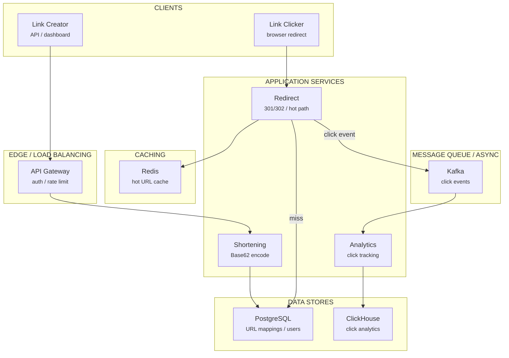
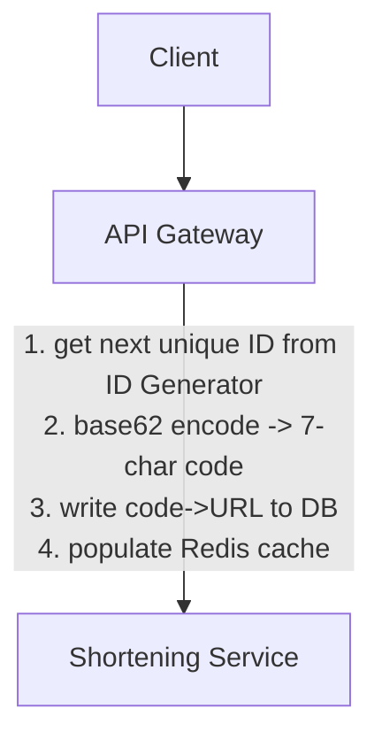
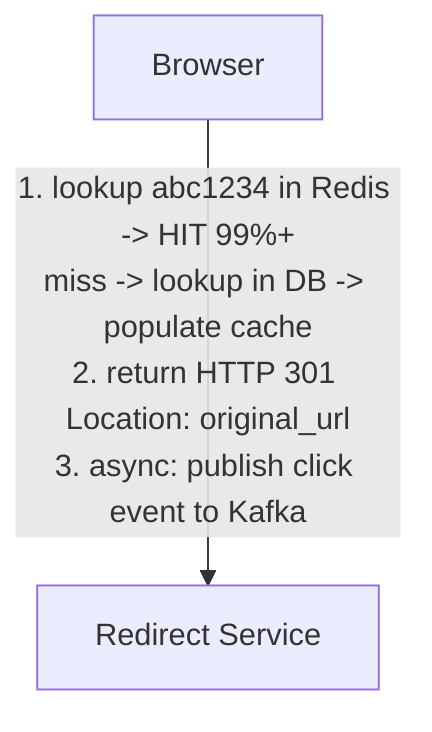

# Design: Bit.ly

> Worked Example -- 75 min

---

## Phase 1: Clarify the Problem & Scope *(5--7 min)*

> **Say:** "We're designing a URL shortening service. Users submit a long URL, get back a short URL. When anyone clicks the short URL, they're redirected to the original. We also want click analytics. Let me scope."

### Questions I'd Ask

- **What outcome are we optimizing for?** *-- Link click-through rate and analytics accuracy. A URL shortener's value isn't the redirect -- it's the DATA about who clicked, when, from where. Secondary: redirect latency (every millisecond matters -- the redirect is in the critical path of user intent). This shapes architecture: the redirect path must be the fastest thing in the system (<10ms), while analytics can be eventually consistent (batch-processed seconds later).*
- **Read:write ratio?** *-- Massively read-heavy. A link is created once but clicked thousands/millions of times. ~100:1 to 1000:1 ratio. Optimize entirely for the redirect hot path.*
- **Link lifetime?** *-- Most clicks happen within 48 hours of creation (social media spike). But links must work forever -- a broken short link destroys trust.*

### Agreed Scope

| In Scope | Out of Scope |
|----------|-------------|
| Shorten a URL -> short code | User accounts / auth (assume API key) |
| Redirect short URL -> original | Link-in-bio pages |
| Custom aliases (vanity URLs) | QR code generation |
| Click analytics (count, geo, device) | A/B testing / link routing |
| Link expiration (optional TTL) | Branded domains |

### Non-Functional Requirements

- **Redirect latency <10ms** -- this is the single most critical path. Every extra ms affects millions of users.
- **Read:write ratio ~100:1** -- links are created once, clicked millions of times. Massively read-heavy.
- **High availability** -- if the redirect service is down, every short link on the internet is broken.
- **Short codes must be unique** -- no collisions. But eventual consistency on analytics is fine.
- **Links are effectively immutable** -- once created, the mapping never changes (unless deleted). This is extremely cache-friendly.

> **Tip:** The immutability insight is the key architectural advantage. Since a short code -> URL mapping never changes, we can cache it aggressively with infinite TTL. Cache invalidation -- the hardest problem in CS -- is mostly eliminated.

---

## Phase 2: Back-of-the-Envelope Estimation *(3--5 min)*

| Metric | Value | Detail |
|--------|-------|--------|
| New URLs / Day | **~100M** | ~1.2K writes/sec avg, ~5K peak |
| Redirects / Day | **~10B** | ~115K reads/sec avg, ~500K peak |
| Read:Write Ratio | **100:1** | Massively read-heavy. Optimize for reads. |
| Total URLs (5 years) | **~180B** | 100M/day x 365 x 5. Need 7-char codes (62^7 = 3.5T capacity). |
| Storage | **~18 TB** | 180B URLs x ~100 bytes/record (code + URL + metadata) |
| Cache (hot set) | **~50 GB** | Top 20% of URLs handle 80% of traffic. 36B x 100 bytes. |

> **Decision:** **Key insight #1:** 7-character base62 codes give us 3.5 trillion unique URLs -- enough for 5+ years. No need for longer codes.

> **Decision:** **Key insight #2:** 500K redirects/sec at peak from cache. The hot set is only ~50GB -- fits easily in a Redis cluster. The DB is a cold fallback, not the hot path.

> **Decision:** **Key insight #3:** Analytics writes are 10B/day -- this is a write-heavy stream that must NOT slow down the redirect path. Async processing via Kafka.

---

## Phase 3: High-Level Design *(8--12 min)*



#### Shortening Service [WRITE]
- Generate unique short code
- Store mapping in DB + cache

#### Redirect Service [HOT PATH]
- Resolve short code -> URL
- 301/302 redirect, <10ms
- Read from cache (Redis), DB fallback

#### Analytics Service [ASYNC]
- Consume click events from Kafka
- Aggregate: clicks, geo, device, referrer
- Store in time-series / OLAP store

#### ID Generator [INFRA]
- Pre-generate unique IDs
- Base62-encode to short code
- No collision, no coordination needed

### Key Architecture Decisions

> **Say:** "Here's WHY I chose each technology -- mapping requirements to tradeoffs. Every choice has a rejected alternative and a consequence."

| Requirement | Decision | Why (and what was rejected) | Consistency |
|-------------|----------|----------------------------|-------------|
| Redirect latency <10ms (the product IS the redirect) | Redis cache-first for URL lookups | 95% cache hit rate. Power law: 1% of URLs get 90% of clicks. Cache miss -> PostgreSQL fallback. Redis GET is <1ms. | AP |
| URL mappings must be durable | PostgreSQL for URL store (not just Redis) | Redis is volatile. URL mappings are permanent records -- a broken link damages customer trust. PostgreSQL provides durability + ACID. | CP |
| 100:1 read-to-write ratio | Separate read path (Redis) from write path (PostgreSQL) | Writes go to PostgreSQL, then populate Redis. Reads never touch PostgreSQL unless cache miss. Each path scales independently. | -- |
| Click analytics at billions of events | Kafka -> ClickHouse (not PostgreSQL) | Append-only event stream. ClickHouse columnar scan for "clicks by country by hour" is 100x faster than PostgreSQL for aggregations. | AP |
| Short codes must be globally unique | Pre-allocated ID ranges per server (Snowflake-style) | No centralized counter bottleneck. Each server has its own range. Base62 encoding produces short strings. Coordination only on range allocation. | -- |

### Flow 1: Create Short URL



### Flow 2: Redirect (the hot path)



> **Say:** "The redirect path is the hottest path -- 500K/sec at peak. I want to deep-dive into how we generate unique codes without collisions, then the caching strategy for redirects."

---

## Phase 4: Deep Dives *(25--30 min)*

### Deep Dive 1: Short Code Generation (~10 min)

> **Goal:** **The core challenge:** Generate 100M unique, short, URL-safe codes per day with no collisions and no coordination bottleneck between application servers.

**Options Compared**

| Approach | How It Works | Pros | Cons |
|----------|-------------|------|------|
| Hash (MD5/SHA) | Hash the long URL, take first 7 chars | Deterministic, same URL -> same code | Collisions guaranteed at scale. Need collision resolution loop -> DB contention. |
| Random | Generate random 7-char base62 string | Simple | Must check for collision in DB. At 180B URLs, collision probability becomes non-trivial. |
| Counter (auto-increment) | Central counter, base62-encode | Zero collisions, sequential | Single point of failure. Sequential codes are predictable (security concern). |
| Range-based (Snowflake-like) | Each server gets a pre-allocated range of IDs. Base62-encode. | Zero collisions, no coordination at write time, horizontally scalable | Slightly more complex setup. Unused IDs if server dies mid-range. |

> **Decision:** **Choice: Range-based ID generation.** A coordination service (ZooKeeper or simple DB table) allocates ranges of 1M IDs to each application server. The server increments locally within its range -- no DB round-trip per code. When the range is exhausted, it requests a new one. Zero collisions by construction. The coordinator is only hit every 1M requests, so it's not a bottleneck. Base62-encode the integer to get the short code. Tradeoff: wasted IDs if a server crashes mid-range (~0.1% waste, acceptable). Rejected: hashing -- collision resolution adds latency and DB contention at our scale.

```sql
-- Range Allocation --
id_ranges
  server_id      VARCHAR
  range_start     BIGINT
  range_end       BIGINT
  allocated_at    TIMESTAMP

-- When server needs new range --
BEGIN;
  SELECT next_available FROM global_counter FOR UPDATE;
  UPDATE global_counter SET next_available = next_available + 1000000;
  INSERT INTO id_ranges (server_id, range_start, range_end) ...;
COMMIT;

-- On server: local counter, no DB call --
local_id = atomic_increment(current_range_counter)
short_code = base62_encode(local_id)  -- e.g., 12345678 -> "dnh3K"
```

**Custom Aliases (Vanity URLs)**

- User provides desired code (e.g., `bit.ly/my-brand`). Check uniqueness in DB. If taken -> error. If free -> insert.
- Custom aliases use a separate namespace -- they don't consume from the ID range. Stored in the same table with a `is_custom` flag.
- Validation: alphanumeric + hyphens, 3--30 chars, no reserved words.

### Deep Dive 2: Redirect Hot Path (~8 min)

> **Goal:** **The core challenge:** Serve 500K redirects/sec at peak with <10ms latency. This is the path that must NEVER go down.

**Caching Strategy**

- **L1: Application-local cache** -- in-process LRU cache (1GB per server). ~1ms. Holds the hottest 10M entries per node. Hit rate: ~70%.
- **L2: Redis Cluster** -- distributed cache. ~3ms. Holds all recently-accessed entries (~50GB). Hit rate: ~99%+ after L1 miss.
- **L3: Database** -- DynamoDB or sharded Postgres. ~10-20ms. Cold fallback. Should handle <1% of traffic.

> **Decision:** **Why two cache levels?** Application-local cache avoids network round-trip entirely -- critical for <10ms target at 500K/sec. Redis handles the tail (L1 miss on one server doesn't mean miss everywhere). Since mappings are immutable, cache invalidation is never needed (except for deleted links, which we handle with a small bloom filter or TTL). Tradeoff: L1 uses ~1GB RAM per server and can serve stale data for deleted links until TTL expires. Acceptable because deletions are rare (<0.01% of lookups).

**301 vs 302 Redirect**

- **301 (Permanent):** Browser caches the redirect. Subsequent clicks never hit our servers. Great for performance, bad for analytics -- we can't count clicks.
- **302 (Temporary):** Browser hits us every time. We can count every click. Slightly worse performance for the end user.
- **Decision:** Default to 302 to enable analytics. Offer 301 as an option for users who don't need analytics and want maximum performance.

> **Decision:** **Why DynamoDB for the URL store?** Access pattern is pure key-value: get URL by short code. DynamoDB handles this at any scale with single-digit ms reads, automatic sharding, and zero ops. At 18TB and 180B records, DynamoDB's partition-key model is perfect. Tradeoff: no complex queries (but we don't need any for the redirect path). Rejected: Cassandra (similar fit but more ops overhead), Postgres (sharding required at this scale).

### Deep Dive 3: Click Analytics Pipeline (~7 min)

> **Goal:** **The core challenge:** Capture 10B click events/day without slowing the redirect path. Aggregate into real-time dashboards (clicks per link, geo breakdown, device breakdown, time series).

- **Capture:** On every redirect, publish a lightweight event to Kafka: `{short_code, timestamp, ip, user_agent, referrer}`. This is fire-and-forget -- doesn't block the 301/302 response.
- **Stream processing:** Kafka -> Flink/Spark Streaming -> aggregate by link_id, time window (1min, 1hr, 1day), geo (IP -> country), device (user-agent parsing).
- **Storage:** Pre-aggregated counters in Redis (real-time) + raw events to ClickHouse/Druid (historical analytics).
- **Query API:** `GET /analytics/{code}?range=7d` -> reads from pre-aggregated data. Response in <200ms.

```sql
-- Kafka Event --
topic: click_events
key: short_code (ensures ordering per link)
value: {
  short_code, original_url, timestamp,
  ip, country, city,  -- geo resolved at ingestion
  device_type, browser, os,  -- parsed from user-agent
  referrer
}

-- Pre-aggregated Counters (Redis) --
HASH key: stats:{short_code}:daily:{date}
  total_clicks: INT
  US: INT, UK: INT, ... -- top countries
  mobile: INT, desktop: INT

-- ClickHouse (historical, columnar) --
clicks
  short_code, timestamp, country, city,
  device_type, browser, os, referrer
  -- Partitioned by date, ordered by short_code
  -- Columnar compression: ~10 bytes/event after compression
```

> **Decision:** **Why ClickHouse for historical analytics?** 10B events/day = ~100GB/day compressed. ClickHouse is purpose-built for high-ingestion columnar analytics -- handles billions of rows with sub-second aggregation queries. Tradeoff: not great for point lookups (use Redis for that), but perfect for "show me clicks over time for link X with geo breakdown." Rejected: Elasticsearch (more expensive at this volume), Postgres (can't handle the ingestion rate).

### Deep Dive 4: Data Model & Storage Summary

| Data | Store | Access Pattern | Consistency |
|------|-------|---------------|-------------|
| URL Mappings | DynamoDB | Key-value by short_code. 500K reads/sec (from cache). | Strong on write, eventual read (cache) |
| Hot URL Cache | Redis Cluster + local LRU | Two-tier: local (~1ms) + Redis (~3ms). 99%+ hit rate. | Eventual (immutable data = no staleness) |
| Real-Time Stats | Redis (counters) | Increment on click. Read for dashboard. | Eventual (seconds) |
| Historical Analytics | ClickHouse | Columnar scan. Aggregate queries over time ranges. | Eventual (Kafka lag, seconds) |
| Click Events | Kafka | 115K events/sec avg. Partitioned by short_code. | Ordered per partition |
| ID Ranges | PostgreSQL (small) | Allocated per server. Accessed every ~1M requests. | Strong (transactional) |

---

## Phase 5: Cross-Cutting Concerns *(10--12 min)*

### Storage Architecture Summary

> **Goal:** **What goes where and why.** Each data store is chosen for its access pattern -- not by default. The question isn't "which database?" but "what are the read/write patterns, consistency requirements, and scale characteristics?"

| Data | Store | Why This Store |
|------|-------|---------------|
| URL mappings | PostgreSQL | short_code -> long_url. Sharded by short_code hash. The core lookup table -- must be fast and durable. |
| Hot URL cache | Redis | 90% of redirects hit <1% of URLs. LRU cache with TTL. Cache miss -> read-through to PostgreSQL. |
| Click events | Kafka -> ClickHouse | Every redirect generates a click event. Kafka for durability. ClickHouse for analytics queries. |
| User accounts & API keys | PostgreSQL | Relational data. API key -> user mapping. Rate limit counters per key. |
| Link metadata | PostgreSQL | Custom aliases, tags, expiration dates, QR codes. Lower traffic than redirect path. |

### Failure Scenarios

| Scenario | Mitigation |
|----------|-----------|
| Redis cluster node down | L1 local cache still serves ~70% of traffic. Redis cluster auto-failover. DB handles the rest. Redirect latency increases from ~5ms to ~15ms temporarily. |
| DynamoDB throttling | DAX (DynamoDB Accelerator) as an intermediate cache. Auto-scaling on DynamoDB table. Cache covers 99%+ -- DB throttling only affects cache misses. |
| ID range coordinator down | Each server has a buffer of ~500K unused IDs. Coordinator being down means no NEW range allocation, but existing servers continue creating links for hours. Fix before buffer exhausted. |
| Kafka down (analytics) | Redirects still work -- analytics events are dropped. Buffer in application memory briefly, log to disk as fallback. Analytics is degraded, not the core redirect path. |
| Abuse (spam links, phishing) | URL scanning on creation (Google Safe Browsing API). Rate limiting per API key. Interstitial warning page for flagged links. Bulk takedown API for abuse team. |

### Scalability

> **Tip:** **Scalability.** The redirect path is the critical scaling dimension: 100:1 read-to-write ratio, with redirects requiring <10ms latency. The Redis cache is the first line of defense -- popular links (which follow a power law distribution) are served entirely from cache. Cache hit rate is typically >95%. For the remaining 5% (cache misses), PostgreSQL reads are fast because the lookup is a simple primary key query on a sharded table. Sharding is by short_code hash, distributing evenly across shards. Write path (link creation) is much less demanding and writes to a single shard. For analytics, the click stream is inherently append-only and scales horizontally in Kafka (partitioned by short_code) and ClickHouse (partitioned by date). The global deployment uses GeoDNS to route users to the nearest redirect endpoint -- a user in Tokyo hits the Tokyo PoP, not a US server. Each PoP maintains its own Redis cache, pre-warmed with globally popular URLs.

### Security

- **Link preview:** Add `+` suffix to any short URL to see destination without redirecting (e.g., `bit.ly/abc1234+`).
- **Malware/phishing scanning:** Check destination URL against Safe Browsing API at creation time. Periodic re-scan for existing links.
- **Rate limiting:** 100 URLs/min per API key for creation. No rate limit on redirects (public).
- **Enumeration protection:** Short codes are base62-encoded integers, but ranges are non-sequential per server. Not easily enumerable. Custom aliases are user-chosen -> not predictable.

### Monitoring & SLOs

> **Tip:** **Monitoring & SLOs.** Core SLOs: redirect latency p99 <50ms (the product IS the redirect), redirect availability 99.99% (broken links damage customer trust), click analytics freshness <60 seconds (enterprise customers track campaigns in real-time). Monitored per PoP: if Tokyo redirect latency degrades, traffic can be rerouted to Osaka. The Redis cache hit rate is a leading indicator -- if it drops below 90%, it signals either a cache sizing issue or a traffic pattern change. Link creation has a separate SLO: p99 <500ms, which is more relaxed since creation is not time-critical. Alerting: (1) redirect error rate >0.1% -> P1, (2) cache hit rate <85% -> P2, (3) analytics pipeline lag >5 minutes -> P3. Error budget is tracked weekly -- each team owns their SLO and can "spend" error budget on risky deploys.

---

## Phase 6: Wrap-Up & Evolution *(3--5 min)*

> **Say:** "To summarize: this system exploits one key property -- URL mappings are immutable. This makes it the most cache-friendly system you can design. The architecture is a two-tier cache (local LRU + Redis) in front of DynamoDB, with range-based ID generation for zero-collision code creation. Analytics is fully decoupled via Kafka -> ClickHouse, so the redirect hot path stays under 10ms. The entire redirect path is stateless and horizontally scalable -- just add more servers behind the load balancer."

| Extension | Architecture Impact |
|-----------|-------------------|
| Link-in-bio pages | New entity type (page -> list of links). Different read pattern (render page vs. redirect). |
| A/B testing (split URLs) | Redirect service needs routing rules per link. Short code maps to multiple destinations with traffic weights. |
| Geo-targeted redirects | IP -> country lookup at redirect time. Route to different URLs per geo. Slight latency increase. |
| Deep link support (mobile) | User-agent detection at redirect. Route to app store or app deep link vs. web URL. |

> **Tip:** **Closing framing:** This design is defined by immutability. URL mappings never change, which eliminates cache invalidation and allows infinite-TTL caching. The entire system is designed around this property: two-tier caching for reads, range-based IDs for writes, and async analytics to avoid polluting the redirect hot path.

---

## Phase 7: Interview Q&A *(Practice)*

> **Say:** "Here are the hardest questions an interviewer would ask about this design, and how to answer them. Each answer demonstrates deep understanding of the tradeoffs, not just surface knowledge."

**Q1: How do you generate globally unique short codes without a centralized counter?**

**A:** We use a combination of techniques depending on the link type. For auto-generated codes: each API server has a pre-allocated range of IDs from a central sequence (similar to Twitter Snowflake). Server A gets IDs 1-1M, Server B gets 1M-2M. Within its range, each server increments locally -- no coordination needed. The ID is Base62-encoded to produce a short string. For custom aliases (vanity URLs like bit.ly/my-brand), we do a uniqueness check against PostgreSQL. This requires a distributed lock or a unique constraint on the short_code column -- we use the DB constraint because custom aliases are rare (maybe 1% of link creations). The pre-allocated range approach means we can create links at high throughput without a centralized bottleneck, and the ranges are large enough that a server running out and needing a new range is infrequent.

**Q2: What's your cache invalidation strategy when a link is edited or deleted?**

**A:** We use a write-through cache pattern: when a link is updated in PostgreSQL (URL changed, link disabled, expiration set), the same API call also updates or invalidates the Redis cache entry. For link deletion/disabling, we set a "tombstone" in Redis: the key still exists but maps to a 404/410 response. This prevents the deleted link from falling through to PostgreSQL (which would also return nothing, but with higher latency). The tombstone has a 24-hour TTL -- after that, requests for the deleted code hit PostgreSQL (which returns nothing) and are not cached (negative caching with short TTL to handle re-creation). For global cache consistency across PoPs: updates are published to a Kafka topic, and each PoP's cache subscriber invalidates locally. This means there's a brief window (typically <2 seconds) where a link edit in one region is stale in another. For the redirect use case, this is acceptable -- a 2-second window of serving the old URL is harmless.
