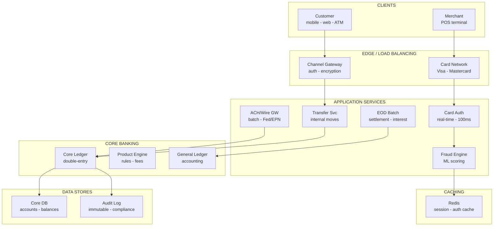
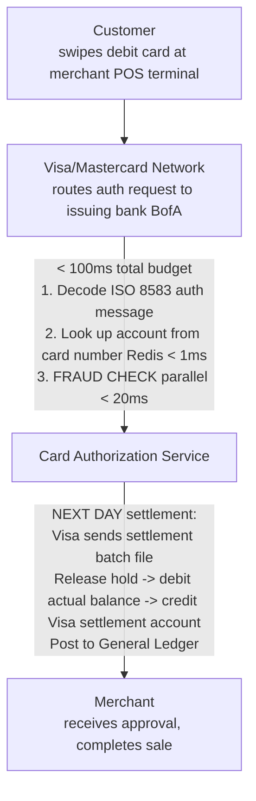
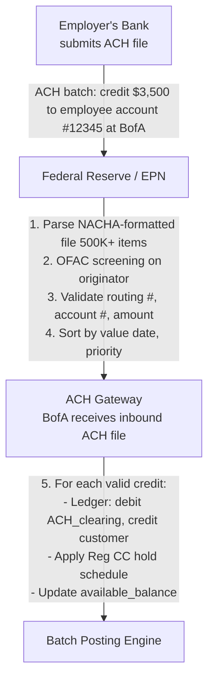
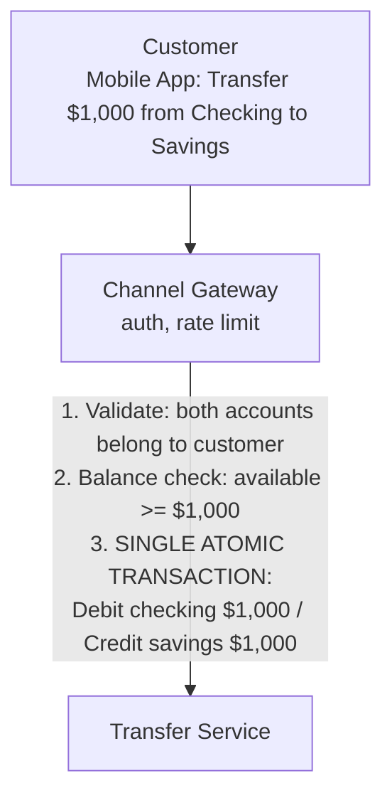

# Design: Bank of America
> Core Banking Platform -- 75 min

---

## Phase 1: Clarify the Problem & Scope *(5--7 min)*

> **Say:** "We're designing the core banking platform for a tier-1 bank like Bank of America. This is NOT a fintech -- it's the foundational system of record that has operated continuously for decades and holds $1.9 trillion in deposits. The core banking system is the LEDGER: it records every account, every transaction, every balance. Everything else -- mobile app, card processing, lending -- depends on this ledger being correct, available, and auditable at all times. The fundamental challenge: the system must operate 24/7 with zero tolerance for financial discrepancies, while simultaneously processing millions of real-time transactions AND massive batch jobs that reconcile the entire bank's position every night."

### Questions I'd Ask

- **What outcome are we optimizing for?** *-> Transaction accuracy: zero financial errors. Every penny must be accounted for, every ledger must balance, every regulatory report must be correct. Secondary: customer experience (card auth in <100ms, mobile deposit in seconds, no false fraud declines). This shapes everything: the ledger is the source of truth, double-entry is non-negotiable, and reconciliation is the immune system that catches what the real-time path misses.*
- **Core products?** *-> Deposit accounts (checking, savings, CD), credit cards, loans (mortgage, auto, personal), payments (ACH, wire, Zelle, bill pay), debit card transactions.*
- **Channels?** *-> Mobile app (~40M active users), web, 3,700 branches, 15,000 ATMs, phone banking, and third-party integrations (payroll providers, billers).*
- **Real-time vs. batch?** *-> BOTH. Customer-facing transactions (transfers, card swipes) must be real-time. But the bank's books close nightly -- interest accrual, fee assessment, regulatory reporting, and reconciliation happen in a massive end-of-day (EOD) batch window.*
- **Scale?** *-> ~68M consumer/small-business clients, ~200M accounts, ~50M+ transactions/day, $1.9T in deposits.*
- **Regulatory?** *-> OCC, Federal Reserve, FDIC, CFPB regulated. Every transaction auditable. Capital adequacy ratios computed daily. BSA/AML compliance mandatory.*

### Agreed Scope

| In Scope | Out of Scope |
|----------|-------------|
| Core ledger (accounts, balances, transactions) | Investment / wealth management (Merrill) |
| Payment processing (ACH, wire, card auth) | Commercial / institutional banking |
| End-of-day batch processing | Mortgage origination workflow |
| Real-time fraud detection | Branch teller system UI |
| Account opening & KYC | Treasury / FX trading desk |
| Interest accrual & fee engine | Mobile app frontend |
| General Ledger (GL) posting | Data warehouse / analytics |

### Core Use Cases

- **UC1 (Deposit/Withdrawal):** Customer deposits $500 at ATM -> system credits account, updates available balance, records transaction, posts to GL. Balance visible immediately across all channels.
- **UC2 (Transfer):** Customer transfers $1,000 from checking to savings -> atomic double-entry: debit checking, credit savings. Both accounts update in the same transaction.
- **UC3 (Card Authorization):** Customer swipes debit card at a store -> card network sends auth request -> system checks balance, places hold, returns approve/decline in <100ms.
- **UC4 (ACH Payment):** Payroll provider sends ACH batch crediting 50,000 employees' accounts -> system processes batch, credits each account, makes funds available per Reg CC schedule.
- **UC5 (End of Day):** At 11 PM ET, batch processing runs: accrue interest on all 200M accounts, assess monthly fees, process pending ACH, generate regulatory reports, reconcile sub-ledgers to GL.

### Non-Functional Requirements

- **Absolute financial integrity:** The ledger must ALWAYS balance. Sum of all debits = sum of all credits across the entire bank. A $0.01 discrepancy triggers investigation.
- **24/7 availability:** Unlike legacy systems that "closed" at 5 PM, modern banking is always on. But batch processing MUST run nightly. The system must handle real-time transactions AND batch processing concurrently without conflicts.
- **Auditability:** Every balance change must be traceable to a source transaction with full provenance: who, what, when, why, which system, which approval.
- **Regulatory deadlines:** EOD processing must complete before market open. Regulatory reports (call reports, stress tests) have hard deadlines with severe penalties for missed filing.
- **Multi-product consistency:** A customer's checking account, savings account, credit card, and loan must all reflect a consistent view -- no partial updates visible across products.

> **Tip:** The defining tension: REAL-TIME TRANSACTIONS coexisting with MASSIVE BATCH PROCESSING. The bank must process a card authorization in <100ms while simultaneously accruing interest on 200M accounts overnight. Legacy systems solved this by shutting down real-time during batch ("stand-in mode"). Modern systems must do BOTH concurrently. This is the hardest architectural challenge in core banking.

---

## Phase 2: Back-of-the-Envelope Estimation *(3--5 min)*

| Metric | Value | Detail |
|--------|-------|--------|
| Customers | ~68M | Consumer + small business. Each with 2-5 accounts on average. |
| Accounts | ~200M | Checking, savings, CD, credit card, mortgage, auto loan, etc. |
| Transactions / Day | ~50M+ | Card auths (~30M), ACH (~10M), internal transfers (~5M), wire (~500K), ATM (~5M). |
| Card Auths / Sec (peak) | ~5K | Each must respond in <100ms. Holiday shopping peaks: 2-3x normal. |
| ACH Batch Volume | ~10M items/day | Processed in batch windows. Payroll credits are time-sensitive (available by 9 AM). |
| EOD Batch Operations | ~200M accounts | Interest accrual, fee assessment, statement generation, GL posting. Must complete in ~4-6 hour window. |
| Deposits (AUM) | ~$1.9T | Every dollar tracked with double-entry precision. FDIC insured up to $250K per depositor. |
| Ledger Entries / Day | ~200M+ | Each transaction generates 2+ ledger entries. EOD batch generates another 200M+ (interest, fees). |

> **Decision:** Key insight #1: The EOD batch is the DEFINING operation. Processing 200M accounts for interest/fees in a 4-6 hour window = ~10K-15K accounts/sec sustained. This is not a real-time workload -- it's a massive parallel computation that touches every account. The architecture must support both the real-time card auth path (5K/sec, <100ms) AND the batch path (15K accts/sec, throughput-optimized) without conflict.

> **Decision:** Key insight #2: A bank has TWO levels of ledger. The SUBLEDGER tracks individual customer accounts (your checking account has $5,000). The GENERAL LEDGER (GL) tracks the bank's aggregate position (total checking deposits = $500B). Every subledger transaction must eventually post to the GL. The GL is what regulators and auditors examine.

> **Decision:** Key insight #3: Unlike Robinhood (one product: brokerage), a bank has MANY products with different rules. A checking account has overdraft logic, minimum balance fees, and Reg D limits. A mortgage has amortization schedules, escrow, and interest rate adjustments. A credit card has revolving balance, minimum payments, and grace periods. The PRODUCT ENGINE must be configurable, not hard-coded.

---

## Phase 3: High-Level Design *(8--12 min)*

> **Say:** "A core banking system is structured in concentric layers: the LEDGER at the center (source of truth), surrounded by the PRODUCT ENGINE (business rules per account type), then the PAYMENT GATEWAYS (connecting to external networks), then the CHANNEL LAYER (mobile, web, ATM, branch). Let me draw this and the key transaction flows."

### Key Architecture Decisions

> **Say:** "Here's WHY I chose each technology -- mapping requirements to tradeoffs. Every choice has a rejected alternative and a consequence."

| Requirement | Decision | Why (and what was rejected) | Consistency |
|-------------|----------|----------------------------|-------------|
| Ledger must balance to the penny | Double-entry bookkeeping in single ACID transaction | Stored procedure inserts debit + credit atomically. CHECK constraint verifies sum = 0. Any other approach risks financial discrepancy. | CP |
| Card authorization in <100ms | Redis for auth cache + inline ML fraud scoring | Visa/Mastercard contractually require <100ms. DB lookup alone = 20ms. Redis cache + pre-loaded fraud model features enable real-time decision. | CP |
| ACH processing in scheduled Fed windows | Batch pipeline (not real-time) | Federal Reserve accepts NACHA files in time windows. ACH is inherently batch. Real-time architecture would add complexity with zero benefit. | -- |
| 40+ years of battle-tested core banking logic | Mainframe for core ledger (wrapped with modern APIs) | COBOL handles every edge case. Rewriting is multi-year, multi-billion risk (TSB UK 2018 disaster). Wrap with REST/gRPC gateway. | -- |
| SOX compliance: immutable audit trail | Append-only audit store (no UPDATE/DELETE allowed) | Every balance change logged with before/after, timestamp, and actor. Cannot be modified -- regulatory requirement. | -- |
| Nightly reconciliation must catch every discrepancy | Independent balance recalculation from ledger entries | Recalculate all balances by summing ledger entries. Compare to cached balances. Any difference = P1 investigation. Belt-and-suspenders. | -- |

### Major Components



#### Core Ledger [HEART]

- Double-entry subledger: every account, every transaction
- Immutable append-only journal
- Materialized balances (current, available, held)
- Source of truth for the entire bank

#### Product Engine [RULES]

- Configurable rules per product type
- Interest calculation (daily accrual, monthly credit)
- Fee assessment (monthly maintenance, overdraft)
- Overdraft / credit limit logic

#### Card Authorization [REAL-TIME]

- Visa/Mastercard network integration
- Auth request -> balance check -> hold -> approve/decline
- Must respond <100ms (network SLA)
- Settlement batch arrives next day

#### ACH / Wire Gateway [PAYMENTS]

- ACH: batch-based, files exchanged with Fed/EPN
- Wire: real-time via Fedwire or SWIFT
- Zelle: real-time P2P via RTP/FedNow
- OFAC screening on every outbound payment

#### EOD Batch Engine [BATCH]

- Nightly processing: interest, fees, statements
- GL aggregation and posting
- Regulatory report generation
- Must complete in 4-6 hour window

#### Fraud Engine [GUARD]

- Real-time scoring on every transaction
- ML model: device, location, amount, velocity
- BSA/AML: suspicious activity detection
- Must not add >20ms to auth latency

#### General Ledger (GL) [ACCOUNTING]

- Bank-level aggregate accounting
- Chart of accounts (assets, liabilities, equity, income, expense)
- Fed from subledger postings
- Source of truth for regulators and auditors

#### Channel Gateway [ACCESS]

- Mobile app, web, ATM, branch, phone
- API layer abstracting core from channels
- Session management, MFA, biometrics
- Consistent view across all channels

### Flow 1: Debit Card Purchase ($50 at a store)



### Flow 2: ACH Direct Deposit (Payroll)



### Flow 3: Internal Transfer (Checking -> Savings, $1,000)



> **Say:** "The deep dives: (1) Core Ledger -- how double-entry works at 200M accounts with multiple balance types. (2) Payments -- how ACH, wire, and card networks each have radically different processing models. (3) EOD batch -- the nightly reconciliation that keeps the bank's books correct. (4) Fraud detection -- real-time ML scoring in <20ms on every transaction."

---

## Phase 4: Deep Dives *(25--30 min)*

### Deep Dive 1: Core Ledger & Double-Entry (~10 min)

> **Goal:** The core challenge: The ledger is the single source of truth for $1.9 trillion. Every cent must be tracked with double-entry precision across 200M accounts, supporting real-time queries (card auth in <100ms) AND batch operations (accrue interest on all accounts nightly). Multiple balance types per account (current, available, held) must be consistent at all times.

**Account Data Model**

```sql
accounts
  account_id       BIGINT PK
  customer_id      BIGINT FK -> customers
  product_id       FK -> product_definitions (checking, savings, CC, mortgage...)
  account_number   VARCHAR (displayed to customer, NOT the PK)
  status           ENUM (active, dormant, frozen, closed)
  currency         CHAR(3) (USD, EUR, etc.)
  opened_at        TIMESTAMP

account_balances  -- materialized, updated atomically with each ledger entry
  account_id       BIGINT PK FK
  balance_type     ENUM:
     CURRENT       -- "book balance" -- all settled transactions
     AVAILABLE     -- current - holds - pending_debits + pending_credits
     HELD          -- card auth holds, Reg CC deposit holds
     PENDING       -- authorized but not yet settled
  amount           DECIMAL(18,2)
  as_of            TIMESTAMP (last updated)

ledger_entries  -- immutable, append-only
  entry_id         BIGINT PK (monotonic)
  transaction_id   UUID (groups debit + credit pair)
  account_id       BIGINT FK
  entry_type       ENUM (debit, credit)
  amount           DECIMAL(18,2)
  balance_type_affected ENUM (current, available, held)
  effective_date   DATE (business date, may differ from posting date)
  posting_date     TIMESTAMP (when actually recorded)
  description      TEXT
  source_system    VARCHAR (ACH, CARD, WIRE, INTERNAL, EOD_BATCH)
  reference_id     VARCHAR (external reference: ACH trace #, auth code, etc.)

INVARIANT: For every transaction_id, SUM(debits) = SUM(credits)
INVARIANT: account_balances.CURRENT = SUM(credits) - SUM(debits) for that account
```

**Multiple Balance Types -- Why It Matters**

| Balance Type | What It Represents | Example |
|-------------|-------------------|---------|
| CURRENT | Settled, "book" balance. All completed transactions. | $5,000 after payroll deposit settled. |
| AVAILABLE | What the customer can actually spend RIGHT NOW. | $4,800 (current - $200 card hold). This is what ATM shows. |
| HELD | Funds reserved but not yet settled. Card auths, deposit holds. | $200 gas station pre-auth hold. |
| PENDING | Transactions in flight -- not yet posted. | ACH credit arriving tomorrow but not yet in current balance. |

> **Decision:** Why materialized balances instead of computing from ledger entries? Computing balance from scratch: `SELECT SUM(CASE WHEN type='credit' THEN amount ELSE -amount END) FROM ledger_entries WHERE account_id=X`. For an account with 10 years of transactions (~50K entries), this is too slow for a <100ms card auth. Materialized balances are updated IN THE SAME transaction as each ledger entry, giving O(1) read performance. The tradeoff: more complex write path (must update both ledger entries AND balance table atomically). But the raw ledger remains the source of truth -- balances can always be recomputed for reconciliation.

**Subledger -> General Ledger Flow**

- **Subledger:** Individual account balances (Customer A's checking has $5,000). This is what the customer sees.
- **General Ledger (GL):** Aggregate bank-level balances. "Total consumer checking deposits = $500B." This is what regulators see.
- **GL posting:** Each subledger transaction maps to GL accounts via a chart of accounts. A deposit: subledger credits customer's checking -> GL debits "Cash & Due from Banks" and credits "Consumer Deposits (liability)."
- **Timing:** Real-time subledger updates. GL postings are batched (accumulated during the day, posted to GL in EOD batch). The GL is always slightly behind the subledger during the day -- reconciled at EOD.

> **Tip:** Suspense accounts: When a transaction can't be immediately classified (e.g., incoming wire with an ambiguous reference), it posts to a suspense account. Suspense accounts must be cleared daily -- an aging suspense balance indicates operational problems. Regulators monitor suspense account levels as a health indicator.

### Deep Dive 2: Payments (ACH / Wire / Card) (~7 min)

> **Goal:** The core challenge: A bank connects to MULTIPLE external payment networks, each with fundamentally different processing models. ACH is batch (files exchanged 5x daily). Wire is real-time (Fedwire settles instantly). Card is two-phase (authorize now, settle later). Each requires different latency, different error handling, and different regulatory compliance.

| Network | Model | Speed | Cost | Reversible? |
|---------|-------|-------|------|-------------|
| ACH | Batch files (NACHA format) | Next day (same-day ACH: hours) | ~$0.25/txn | Yes (returns within 2 days) |
| Wire (Fedwire) | Real-time gross settlement | Minutes (irrevocable once sent) | ~$25/txn | No -- final and irrevocable |
| SWIFT | Message-based (correspondent banking) | 1-3 business days | ~$30-50/txn | Very difficult |
| Card (Visa/MC) | Two-phase: auth -> settlement | Auth: <100ms. Settle: T+1 | Interchange fee (~1-3%) | Chargeback process (60 days) |
| Zelle/RTP | Real-time push payment | Seconds | ~$0.01-0.50 | No -- irrevocable once sent |

```sql
-- ACH Processing Pipeline --

OUTBOUND ACH (BofA customer sends money out):
  1. Customer initiates transfer via app
  2. OFAC screening: check recipient against sanctions lists
  3. Fraud check: unusual amount? new recipient? velocity?
  4. Debit customer's account (ledger entry)
  5. Queue item for next ACH batch window
  6. Assemble NACHA file with all queued items
  7. Submit file to Fed/EPN at scheduled cutoff time
  8. Wait for acknowledgment / return

INBOUND ACH (someone sends money TO a BofA customer):
  1. Receive NACHA file from Fed/EPN
  2. Parse file: validate routing #, account #, amount
  3. OFAC screening on originator
  4. For valid items: credit customer accounts
  5. Apply Reg CC hold schedule:
     - Direct deposit (payroll): next-day availability
     - Regular ACH credit: 1-2 business day hold
     - First-time originator: up to 9 days hold
  6. Return invalid items (wrong account, closed, etc.)

ACH CUTOFF TIMES (Fed operates 5 windows per day):
  Same-day ACH: 10:30 AM, 2:45 PM ET
  Next-day ACH: 2:15 AM ET (overnight batch)
```

> **Decision:** Why does the bank need separate gateways per payment network? Each network has a different protocol (NACHA files vs. ISO 20022 XML vs. ISO 8583 binary), different timing (batch vs. real-time), different settlement mechanics (net vs. gross), and different regulatory requirements (OFAC screening timing, return windows). A single "payments" service would be a god object. Separate gateways allow: independent scaling (card auth needs <100ms, ACH can take minutes), independent deployment (update wire format without touching card auth), and independent failure domains (ACH gateway outage doesn't block card auths).

### Deep Dive 3: End-of-Day & Batch Processing (~5 min)

> **Goal:** The core challenge: Every night, the bank must: accrue interest on 200M accounts, assess fees, generate statements, reconcile sub-ledgers to GL, compute regulatory capital ratios, and generate reports. This must complete in a 4-6 hour window (typically 11 PM -- 5 AM ET) while real-time transaction processing continues.

```sql
-- EOD Batch Sequence --

Phase 1: Day Close (11 PM ET)
  - Set business date to next day for new transactions
  - Freeze the "day's" subledger snapshot for reconciliation
  - Real-time transactions continue posting to the NEW business date

Phase 2: Interest Accrual
  - For every interest-bearing account (savings, CD, loan, mortgage):
    daily_interest = balance x (annual_rate / 365)
  - Accrue: ledger entry crediting interest_accrued (memo, not yet paid)
  - Monthly: pay accrued interest -> credit customer's balance
  - Volume: ~150M interest-bearing accounts, ~25K accounts/sec

Phase 3: Fee Assessment
  - Check each account against product rules:
    Monthly maintenance fee (waived if balance > minimum?)
    Overdraft fees (any overdraft events today?)
    Wire transfer fees
  - Debit customer account, credit bank fee income account

Phase 4: ACH Processing
  - Process overnight ACH files (inbound and outbound)
  - Post credits and debits
  - Generate return files for exceptions

Phase 5: GL Posting
  - Aggregate all day's subledger transactions by GL account code
  - Post summary entries to General Ledger
  - Compute trial balance: total debits must equal total credits
  - ANY IMBALANCE -> CRITICAL ALERT -> investigation before market open

Phase 6: Regulatory Reports
  - Capital adequacy ratios (risk-weighted assets / capital)
  - Liquidity coverage ratio
  - Large transaction reports (>$10K cash transactions -> FinCEN CTR)
  - Suspicious activity reports (SARs)

Phase 7: Statement Generation
  - Generate monthly statements for accounts whose cycle ends today
  - ~7M statements/night (200M accounts / 30 days)
  - PDF generation -> archive -> email/mail delivery

Target completion: 5 AM ET (before market opens)
If batch runs late -> "extended processing" -> some features degraded
```

> **Decision:** How to accrue interest on 150M accounts without blocking real-time transactions? The key technique: SNAPSHOT ISOLATION. At day-close, take a logical snapshot of all account balances. The batch job reads from this snapshot (consistent point-in-time view). Real-time transactions continue writing to the live tables under the new business date. There's no lock contention because the batch reads a frozen snapshot while live traffic writes to current state. At the end of batch, the accrued interest entries are posted as new ledger entries (dated to the closed business day) -- they don't conflict with new-day transactions. This is essentially MVCC (Multi-Version Concurrency Control) at the application level.

### Deep Dive 4: Real-Time Fraud Detection (~5 min)

> **Goal:** The core challenge: Score every card authorization for fraud in <20ms (within the 100ms card auth budget). The model must balance: catching fraud (minimize false negatives -- real fraud slipping through) vs. not blocking legitimate transactions (minimize false positives -- annoying customers). At 5K auths/sec, even a 0.1% false positive rate = 5 wrongly declined transactions per second.

- **Feature vector (computed in <5ms):** Transaction amount, merchant category (MCC), time of day, distance from last transaction, device fingerprint, IP geolocation, transaction velocity (# transactions in last hour), average transaction amount for this customer, whether this merchant is new for this customer.
- **Model:** Gradient-boosted tree (XGBoost/LightGBM) or neural network. Trained on historical labeled fraud data. Updated weekly with new fraud patterns. Inference: <5ms on GPU or optimized CPU.
- **Score -> Action:** Score 0-1000. <300 = approve. 300-700 = step-up auth (SMS code, app notification). >700 = decline. Thresholds tuned by product team balancing fraud loss vs. customer friction.
- **Real-time feature store:** Redis cluster holding per-customer aggregates: last N transactions, running sums, last known location. Updated on every transaction. Read latency: <1ms.
- **Consortium data:** Shared fraud signals across the banking industry. Known compromised cards from Visa/MC alerts. Merchant fraud reports. These feed into the model as additional features.

> **Decision:** Why ML scoring inline (synchronous) rather than async? Async fraud detection (score after approval) catches fraud for future prevention but doesn't STOP the fraudulent transaction in progress. For card-present transactions, once approved, the merchant has delivered goods -- the bank eats the loss. Inline scoring within the auth path is the only way to PREVENT fraud in real-time. Tradeoff: adds ~10-20ms to every auth. But this is within the 100ms budget, and the fraud savings (billions/year industry-wide) vastly outweigh the latency cost.

- **BSA/AML (Anti-Money Laundering):** Separate from card fraud. Analyzes PATTERNS across days/weeks: structuring (multiple deposits just under $10K), unusual international wires, rapid movement of funds. Runs as a batch + streaming hybrid -- not inline. Generates Suspicious Activity Reports (SARs) for FinCEN.
- **Account takeover detection:** Monitors login patterns: new device, unusual time, impossible travel (login from NYC, then London 2 hours later). Triggers step-up authentication or account lock.

---

## Phase 5: Cross-Cutting Concerns *(10--12 min)*

### Storage Architecture Summary

> **Goal:** What goes where and why. Each data store is chosen for its access pattern -- not by default. The question isn't "which database?" but "what are the read/write patterns, consistency requirements, and scale characteristics?"

| Data | Store | Why This Store |
|------|-------|---------------|
| Account balances | Core banking DB (mainframe) | Current balance, available balance, holds. Updated by every transaction. Strong consistency. ACID guaranteed. |
| Transaction ledger | Append-only relational DB | Every debit and credit entry. Immutable. Double-entry: sum of all entries = 0. Partitioned by account + date. |
| General ledger | Relational DB | Aggregated accounting entries per GL code. Updated by EOD batch. Source of truth for regulators and auditors. |
| Card authorization cache | Redis | Recent auth decisions, velocity counters (transactions per card per hour), merchant category caches. Sub-ms lookups. |
| Fraud model features | Feature store + Redis | Real-time features: spending patterns, location history, device fingerprints. Fed into ML scoring engine. |
| ACH/wire files | Secure file storage | NACHA-format batch files sent to/from Federal Reserve. Archived for 7 years (regulatory requirement). |
| Audit trail | Immutable append-only store | Every balance change, every admin action, every policy override. SOX compliance. Cannot be modified or deleted. |

### Failure Scenarios

| Scenario | Mitigation |
|----------|------------|
| Core ledger database failure | Synchronous replication to standby (zero data loss). Automatic failover in <30 seconds. During failover: card auths enter "stand-in" mode -- approve low-risk transactions based on cached balances and historical patterns, queue for posting when ledger recovers. Real-time transfers blocked until recovery. |
| EOD batch fails mid-run | Batch is idempotent and checkpoint-based. On failure: restart from last checkpoint, not from the beginning. If batch can't complete by 5 AM: escalate, extend window, potentially delay market-open features. Regulators notified if regulatory reports are late. |
| ACH file processing error | ACH files have built-in checksums (batch control totals). If file is corrupt: reject entire file, request retransmission from Fed. Individual item errors: return the item with appropriate return reason code (R01=insufficient funds, R02=account closed, etc.). |
| Card network connectivity loss | "Stand-in processing" -- bank approves/declines based on local rules and cached data without network confirmation. Risk: some fraudulent transactions approved. Mitigation: conservative stand-in limits (e.g., max $200 per transaction, $500/day). Reconcile when connectivity restores. |
| Fraud model returns stale/wrong scores | Circuit breaker: if model latency exceeds 50ms or returns errors, fall back to rule-based system (hard-coded velocity limits, amount caps). Rule-based system is less accurate but never adds latency. Model degradation monitored -- alert if false positive rate spikes. |
| GL trial balance doesn't balance | CRITICAL -- the bank's books don't balance. All-hands investigation. Trace: compare subledger totals to GL postings, find the discrepancy. Likely a posting error or a missing batch. Correcting journal entries posted. This must be resolved before any regulatory filing. |
| Customer disputes a transaction | Provisional credit issued immediately (Reg E requirement for debit disputes). Investigation: pull auth log, merchant records, fraud score. If dispute upheld: credit is permanent, bank charges back the merchant. If denied: reverse provisional credit. |

### Scalability

> **Tip:** Banking has a unique scaling pattern: steady-state traffic is predictable, but specific events create concentrated load. Direct deposit day (typically 1st and 15th of the month) generates 10x normal ACH volume. Black Friday generates 5x card authorization volume. The ACH processing pipeline is inherently batch-oriented -- files are submitted to the Federal Reserve in scheduled windows -- so "scaling" means processing larger batches faster, not handling more concurrent requests. The card authorization path IS real-time: <100ms from card swipe to approval. This scales horizontally by adding auth service instances behind a load balancer. Each authorization is independent (reads account balance + fraud score, returns approve/decline), so there's no shared-state bottleneck. The Core Ledger is the one component that doesn't scale horizontally easily -- it maintains strict ACID invariants across all accounts. Large banks address this with mainframe vertical scaling (still the highest-throughput transaction processing available) or sharding by account range with distributed transaction coordination for cross-account transfers.

### Reconciliation (The Bank's Immune System)

- **Internal reconciliation:** Every night, subledger account balances are re-computed from raw ledger entries and compared to materialized balances. Any discrepancy -> alert.
- **Subledger-to-GL:** Sum of all subledger checking accounts must equal the GL "Consumer Checking Deposits" line item. Checked nightly.
- **External reconciliation:** Compare bank's records to: (a) Fed's records (ACH, wire), (b) card network settlement files, (c) correspondent bank statements (Nostro/Vostro accounts). Differences -> suspense account -> investigation.
- **Nostro/Vostro:** BofA holds accounts at other banks (Nostro = "ours at theirs") and other banks hold accounts at BofA (Vostro = "theirs at ours"). These must reconcile daily -- a mismatch means money went somewhere unexpected.

### Disaster Recovery

- **RPO (Recovery Point Objective):** Zero. Synchronous replication -- no committed transaction can be lost.
- **RTO (Recovery Time Objective):** <4 hours for full system, <30 seconds for database failover.
- **Active-active vs. active-passive:** Most tier-1 banks run active-passive for the core ledger (write-primary + read-replicas). Active-active for the core ledger is extremely difficult due to the need for global ordering of transactions affecting the same account. Card auth and read-heavy services can be active-active across data centers.
- **Regulatory requirement:** OCC requires bank to demonstrate ability to resume critical operations within 2 hours of a disaster. Regular DR drills with documented results.

### Security

- **Data at rest:** AES-256 encryption. PCI DSS for card data. Tokenization: card numbers never stored in plain text -- replaced with tokens that map to a secure vault.
- **Data in transit:** TLS 1.3 everywhere. Internal service-to-service: mTLS.
- **Access control:** Role-based (teller vs. manager vs. compliance officer). Least privilege. Dual control for high-risk operations (wire transfers >$1M require two approvals).
- **Data residency:** Customer financial data must stay within US jurisdiction. No cloud region outside US for core banking data.

### Monitoring & SLOs

> **Tip:** Banking monitoring has regulatory requirements beyond standard SRE practices. SLOs: card authorization latency <100ms (p99) -- Visa/Mastercard enforce this contractually; exceeding it risks losing card processing privileges. ACH processing must complete before Federal Reserve deadlines -- a missed window delays millions of direct deposits by a full business day. Reconciliation monitoring: the automated reconciliation engine runs post-EOD and must balance to the penny -- any discrepancy triggers an immediate P1 investigation. Fraud alerting has its own latency SLO: a fraud detection must occur before the authorization response (within the 100ms window). Regulatory reporting: all system availability and incident data is reported to OCC (Office of the Comptroller of the Currency) quarterly. Business metrics monitored alongside technical: daily deposit totals, card transaction volume, ACH failure rates. Every outage requires a written explanation to regulators.

---

## Phase 6: Wrap-Up & Evolution *(3--5 min)*

> **Say:** "To summarize: the core banking system is structured in concentric layers -- the double-entry LEDGER at the center (200M accounts, immutable append-only journal, materialized multi-type balances), surrounded by a configurable PRODUCT ENGINE (interest rules, fee schedules, overdraft logic per product type), connected to PAYMENT GATEWAYS for each external network (ACH batch, Fedwire real-time, Visa/MC card auth, Zelle/RTP), all feeding up to the GENERAL LEDGER which is the bank's aggregate accounting truth for regulators and auditors. The defining architectural challenge -- real-time and batch coexistence -- is solved by snapshot isolation: EOD batch reads a frozen point-in-time snapshot while real-time transactions continue writing under the new business date. Reconciliation is the immune system: internal (subledger re-computation), cross-layer (subledger-to-GL), and external (bank vs. Fed, bank vs. card network, Nostro vs. Vostro) checks run nightly and catch any discrepancy before it compounds. Card fraud is scored inline in <20ms using ML models backed by a real-time feature store, while AML runs as a batch/streaming hybrid for pattern detection across days and weeks."

### What I'd Build Next

| Extension | Architecture Impact |
|-----------|-------------------|
| Real-Time Payments (FedNow) | Instant settlement 24/7/365 -- no more T+1. Eliminates the batch-oriented ACH model for covered transactions. Requires always-on ledger with no maintenance windows. Fundamentally challenges the EOD batch concept. |
| Open Banking (APIs for fintechs) | Expose account data and payment initiation via standardized APIs. Requires consent management (OAuth2), rate limiting, and a new trust model where third parties can read balances and initiate payments with customer permission. |
| Multi-Currency / Cross-Border | Accounts holding multiple currencies. FX conversion on the hot path. SWIFT gpi integration for traceable cross-border payments. Nostro account management becomes critical infrastructure. |
| Event-Driven Architecture (replacing batch) | Move from nightly batch to continuous processing: interest accrues in real-time, fees assessed at the moment the trigger occurs, GL updated continuously. Eliminates the EOD bottleneck but requires massive re-architecture of systems that assume batch timing. |
| AI-Powered Financial Advisor | Analyze transaction patterns -> recommend savings strategies, detect upcoming cash shortfalls, suggest bill payment timing. Requires read-only access to transaction history and ML inference pipeline separate from the core. |

> **Tip:** Closing framing: This system is defined by a truth that sounds simple but has enormous architectural consequences: A BANK IS A LEDGER. Everything else -- mobile apps, card networks, branches, ATMs, fraud detection -- exists to put entries INTO the ledger or read entries OUT of the ledger. The ledger's invariants (debits = credits, materialized balances match raw entries, subledgers reconcile to GL) are not just software constraints -- they are LEGAL requirements. A discrepancy in the ledger is not a bug; it's a regulatory incident. This is why banks have survived for centuries with essentially the same bookkeeping model: double-entry accounting, invented in 1494, remains the most reliable way to track money. The architecture modernizes the TECHNOLOGY around the ledger (real-time processing, ML fraud detection, cloud infrastructure), but the ledger itself is a 500-year-old design pattern that has never been improved upon.

---

## Phase 7: Interview Q&A *(Practice)*

> **Say:** "Here are the hardest questions an interviewer would ask about this design, and how to answer them. Each answer demonstrates deep understanding of the tradeoffs, not just surface knowledge."

**Q1: Why do banks still use mainframes in 2026?**

**A:** Because no other technology matches their transaction throughput with ACID guarantees at scale. A modern IBM zSystem can process 100,000+ transactions per second with sub-millisecond latency, with hardware-level encryption and fault tolerance. More importantly, the core banking software (often COBOL) has been battle-tested over 40+ years. It handles every edge case: leap years, currency conversions, regulatory holds, overdraft protection chains, interest compounding -- all proven correct by decades of operation. Rewriting this in a modern stack is a multi-year, multi-billion-dollar project with enormous risk. Several banks have tried and failed (TSB UK's 2018 migration disaster is a cautionary tale). The pragmatic approach is to wrap the mainframe with modern APIs (REST/gRPC gateway) and build new features in microservices that call the mainframe for core ledger operations. The mainframe does what it's best at (ACID transactions at scale), and modern services handle what it's worst at (mobile UX, real-time notifications, ML-based fraud detection).

**Q2: How does double-entry bookkeeping prevent financial errors?**

**A:** Every financial movement is recorded as exactly two entries: a debit and a credit of equal amounts. When you transfer $100 from checking to savings: debit checking $100, credit savings $100. The invariant: the sum of all entries in the entire ledger must equal zero. This is checked continuously -- any non-zero sum means an error occurred. The beauty is that it's self-auditing: you can't accidentally create money (a credit without a matching debit), and you can't accidentally destroy money (a debit without a matching credit). In code: the stored procedure that creates ledger entries takes (from_account, to_account, amount) and atomically inserts both rows in a single transaction. If either INSERT fails, both are rolled back. There's a CHECK constraint that verifies the sum remains zero. For complex transactions (fee charges, interest accrual), there may be 4-6 entries, but they always sum to zero. The nightly reconciliation independently verifies this by summing the entire ledger.
