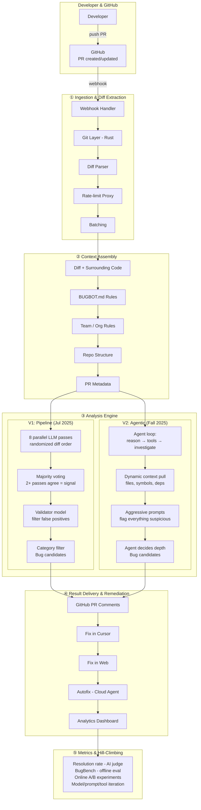
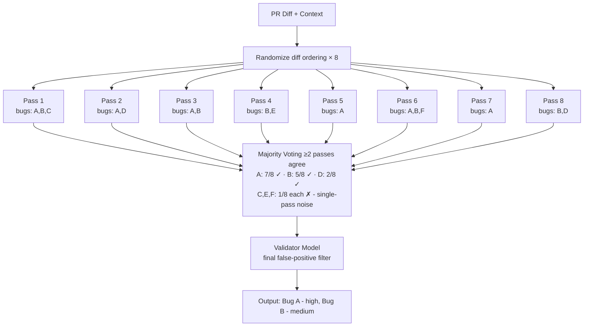
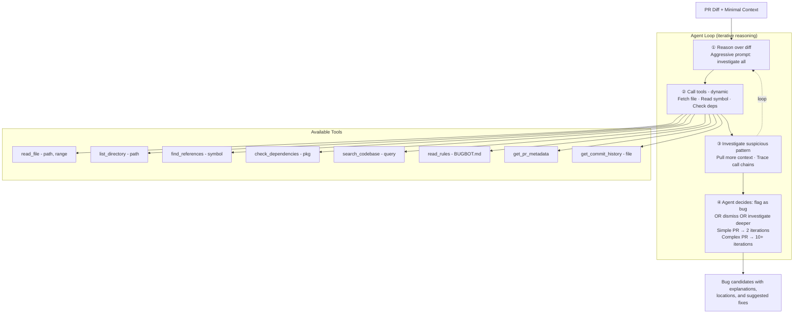
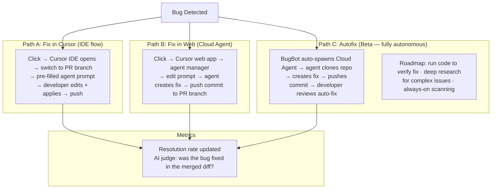

# Design: Cursor BugBot

*AI Code Review · 75 min*

---

## Phase 1: Clarify the Problem & Scope *(5–7 min)*

> **Say:** "We're designing Cursor's BugBot — an AI agent that automatically reviews pull requests for logic bugs, security vulnerabilities, and performance issues before code reaches production. The core challenge: use LLMs to find **real bugs humans would miss**, not stylistic nitpicks. BugBot processes 2M+ PRs per month for Fortune 500 companies, achieves a 70% resolution rate (meaning developers fix 70% of flagged issues), and catches ~0.7 bugs per run. It evolved from a pipeline-based system with majority voting into a fully agentic architecture — one of the most instructive examples of taking an LLM product from prototype to production at scale."

### Questions I'd Ask

- **What does BugBot actually review?** *→ The diff of a pull request: changed files, added/removed lines. It also fetches surrounding context from the repo to understand intent. It focuses on logic bugs, security flaws, and edge cases — not linting, formatting, or style.*
- **How is it triggered?** *→ Automatically on every new PR and PR update via GitHub webhook, or manually with `@cursor review` or `bugbot run`. Results appear as inline comments on the PR, just like a human reviewer.*
- **What's the key metric?** *→ Resolution rate: the fraction of flagged bugs that developers actually fix before merging. This is measured by an AI judge that compares the flagged issue against the final merged diff. Went from 52% → 70% across 40 experiments.*
- **What's the precision/recall trade-off?** *→ Precision is king. A false positive wastes developer attention and erodes trust. BugBot was built to minimize noise: it's better to miss a bug than to cry wolf. The resolution rate metric directly encodes this philosophy.*
- **How does the agentic version differ from V1?** *→ V1 ran 8 parallel LLM passes with randomized diff ordering + majority voting + validator models. V2 is a single agentic loop that reasons over diffs, calls tools dynamically, and decides its own investigation depth. V2 enabled the largest quality gains.*
- **What about remediation?** *→ Each flagged bug has a "Fix in Cursor" button (opens IDE with pre-filled prompt) and "Fix in Web" (spawns a Cloud Agent). BugBot Autofix (beta) automatically spawns agents to fix found bugs.*

### Agreed Scope

| In Scope | Out of Scope |
|----------|-------------|
| PR webhook ingestion & diff extraction | Cursor IDE internals (Tab, Composer model) |
| V1 pipeline: multi-pass + majority voting + validators | Background Agents / general agentic coding |
| V2 agentic loop: tool use, dynamic context | Cursor's code completion / autocomplete |
| Precision/recall optimization & BugBench | Billing / subscription management |
| GitHub integration (rate limits, comment API) | GitLab / Bitbucket support (not yet offered) |
| Custom rules (BUGBOT.md / .cursor files) | Full CI/CD pipeline design |
| Autofix: Cloud Agent remediation loop | Cursor's privacy mode / data retention policies |

### Core Use Cases

- **UC1: Auto-review on PR open** — Developer pushes a PR. GitHub fires webhook. BugBot fetches diff + context, runs analysis, posts inline comments within minutes. Team sees results before human review starts.
- **UC2: Manual trigger** — Developer comments `@cursor review` on an existing PR. BugBot re-runs analysis (useful after force-push or when requesting a fresh review on updated code).
- **UC3: Fix in Cursor** — Developer clicks "Fix in Cursor" on a flagged bug. Cursor IDE opens, switches to the PR branch, and loads a pre-filled agent prompt describing the bug. Developer edits and applies fix.
- **UC4: Autofix (beta)** — BugBot Autofix spawns a Cloud Agent that creates a fix commit for the flagged bug, pushes it to the branch. Developer reviews the auto-generated fix in the PR.
- **UC5: Custom rules enforcement** — Team defines `.cursor/BUGBOT.md` with rules like "never use deprecated API X" or "always bump manifest version when changing extension code." BugBot enforces these on every PR.

> **Tip:** The defining tension in AI code review: **precision vs. coverage**. A tool that flags 50 issues per PR — mostly false positives — will be disabled within a week. A tool that catches 0.7 real bugs per run and is right 70% of the time becomes a required pre-merge check. BugBot's entire architecture is designed around this insight: the cost of a false positive (eroded trust, wasted time) vastly exceeds the cost of a false negative (missed bug that human reviewers might catch anyway).

---

## Phase 2: Back-of-the-Envelope Estimation *(3–5 min)*

| Metric | Value | Detail |
|--------|-------|--------|
| **PRs Reviewed / Month** | **2M+** | ~70K PRs/day. Fortune 500 enterprises + indie devs. Burst on Mon-Fri 9am-5pm per timezone. |
| **Resolution Rate** | **70%** | Up from 52% at launch. 40 experiments. Key metric: fraction of flagged bugs actually fixed by developer at merge. |
| **Bugs Flagged / Run** | **~0.7** | Up from 0.4 at launch. Resolved bugs per PR: ~0.5 (0.7 × 70%). Intentionally conservative to minimize noise. |
| **Bugs Found (Beta)** | **1.5M+** | Over 1M PRs in beta, 1.5M potential bugs flagged. 50%+ fixed before merge = ~750K real bugs caught. |
| **LLM Calls / PR (V1)** | **8–16** | 8 parallel bug-finding passes + validator model calls + majority voting computation. Heavy token usage. |
| **LLM Calls / PR (V2)** | **Variable** | Agentic loop: agent decides depth. Simple PRs: 2-3 calls. Complex PRs: 10+ calls with tool use. More efficient overall. |
| **Review Latency Target** | **<5 min** | Must finish before human review starts. Large PRs may take longer. Webhook → comment posted in minutes. |
| **GitHub API Budget** | **Critical** | 5K req/hr per installation. Rate-limit monitoring, request batching, proxy infra. Rebuilt Git layer in Rust. |

> **Tip:** Key cost insight: at 2M PRs/month and ~8 LLM calls per PR (V1), that's **16M LLM inference calls per month** — a massive and expensive workload. The transition to agentic architecture wasn't just about quality: by letting the agent decide investigation depth, simple PRs use fewer calls while complex ones get deeper analysis. This is more cost-efficient overall while producing better results.

---

## Phase 3: High-Level Design *(8–12 min)*

> **Say:** "The system has four stages: (1) GitHub event ingestion and diff extraction, (2) context assembly — gathering the diff plus surrounding code, project rules, and repo structure, (3) the analysis engine — either V1 multi-pass pipeline or V2 agentic loop — which produces bug candidates, and (4) result delivery — posting inline comments on the PR with fix links. A separate metrics pipeline tracks resolution rates to hill-climb on quality."



### Key Architectural Decisions

| Decision | Choice | Why Not Alternative |
|----------|--------|-------------------|
| Analysis style | Agentic loop (V2) | Fixed pipeline (V1) couldn't adapt depth per PR; wasted tokens on simple PRs, under-investigated complex ones |
| Key metric | Resolution rate (AI-judged) | Precision/recall too abstract; resolution rate directly measures "did the developer value this?" Signal is real. |
| Diff ordering | Randomized per pass (V1) | LLMs show positional bias; randomizing diff order produces diverse reasoning across passes |
| False positive filter | Majority voting + validator | Single-pass flagging had too many false positives; multiple passes agreeing = stronger signal |
| Git integration | Custom Rust layer | Shell-out to git CLI too slow and unreliable at 2M PRs/month; Rust for speed + reliability |
| GitHub interaction | Proxy + batching + rate monitor | Raw GitHub API hits rate limits fast at scale; proxy layer manages quotas across installations |
| Custom rules | BUGBOT.md in repo | Hardcoded checks can't adapt to diverse codebases; natural-language rules are flexible and team-specific |

---

## Phase 4: Deep Dives *(25–30 min)*

### Deep Dive 1: V1 Pipeline — Majority Voting (7 min)

> **Goal:** Understand the original multi-pass architecture, why randomized diff ordering matters, and how majority voting filters false positives.



- **Why randomize diff order?** LLMs exhibit positional bias — they attend more to text at the beginning and end of the context window. By shuffling which files/hunks appear first in each pass, different passes "notice" different code sections. This produces diverse reasoning without changing the model or prompt.
- **Majority voting threshold:** A bug found by only 1 out of 8 passes is likely a hallucination or noise. A bug found by 5+ passes is almost certainly real. The threshold (≥2) balances catching genuine issues against filtering noise.
- **Validator model:** A separate LLM call that receives the bug candidate + context and decides "is this actually a bug?" This second opinion catches false positives that slipped past majority voting — things that look like bugs but aren't (intentional patterns, documented exceptions).
- **Weaknesses of V1:** Fixed 8-pass cost regardless of PR complexity. No ability to investigate deeper when something looks suspicious. All context must be loaded upfront — the model can't go fetch more files. These limitations motivated V2.

### Deep Dive 2: V2 Agentic Architecture (8 min)

> **Goal:** Understand why the shift to agentic design produced "the largest quality gains" and how the agent loop works.



- **Key shift: aggressive prompting.** V1 restrained models to minimize false positives. V2 does the opposite: the agent is prompted to investigate every suspicious pattern and err on the side of flagging. The agentic loop's iterative verification catches the false positives that aggressive prompting creates — better to over-investigate than under-investigate.
- **Dynamic vs. static context:** V1 loaded all context upfront (diff + surrounding files). V2 starts with minimal context and the agent pulls in additional files at runtime. The model "consistently pulled in the additional context it needed" without requiring everything provided ahead of time — more efficient and more targeted.
- **Tool design = behavior design:** Because the agent's behavior is shaped by the tools it can call, even small changes in tool design or availability had an outsized impact on outcomes. Adding a `find_references` tool, for example, let the agent trace call chains across files — something V1 couldn't do.
- **Experimentation surface:** The agentic architecture opened up a richer surface for experimentation. The team could vary how much upfront context the model received, which tools were available, how prompts were structured — all independently. This made the 40-experiment hill-climbing process much more productive.

### Deep Dive 3: Precision vs. Recall Optimization (5 min)

> **Goal:** Understand how BugBot measures quality and why the resolution rate metric was a breakthrough.

- **The resolution rate metric:** An AI judge examines each bug BugBot flagged, then checks the final merged diff. If the developer fixed the issue (even if not exactly as BugBot suggested), the bug is marked "resolved." Resolution rate = resolved / total flagged. This measures real-world developer value, not abstract accuracy.
- **Why not precision/recall?** Precision requires labeling ground truth for every PR — impossibly expensive at 2M PRs/month. Resolution rate is a proxy that can be computed automatically: if the developer fixed it, it was probably a real bug. If they ignored it, it was probably noise. Not perfect, but scalable and actionable.
- **BugBench (offline eval):** A curated benchmark of real code diffs with human-annotated bugs. Used for offline evaluation before deploying changes. Prevents regressions that online A/B testing would catch too late. The combination of BugBench (offline) + resolution rate (online) gives both fast iteration and real-world signal.
- **Surprising regressions:** Many changes that seemed intuitively better actually regressed metrics. The team found that early qualitative judgments were often correct. This is a common lesson in ML systems: iterate with data, not intuition, but respect the baseline.
- **Category filtering:** Not all bug types are equally valuable. BugBot filters out categories where false positive rates are high (e.g., style suggestions) and focuses on categories where resolution rates are high (logic bugs, null pointer dereferences, race conditions, security vulnerabilities).
- **The 52% → 70% journey:** V1 launched at 52% resolution rate. 40 experiments later (models, prompts, iteration counts, validators, context management, category filtering, agentic design), V2 reached 70%. The agentic switch was the single largest improvement. Each experiment was evaluated both on BugBench and on live resolution rates.

### Deep Dive 4: Autofix & Remediation Loop (5 min)

> **Goal:** Understand the full remediation pipeline from bug detection to automated fix.



- **"Fix in Cursor" is the killer feature.** It bridges detection and remediation with one click. The IDE opens, switches branches, and presents a pre-filled prompt that describes the bug and its context. The developer edits the prompt if needed, the agent generates a fix, and the developer pushes. This is why BugBot has a 70% resolution rate — the friction to fix is near zero.
- **Autofix roadmap:** The team is building toward BugBot that can run code to verify its own bug reports (not just flag, but prove the bug exists), deep research for complex issues (trace through dependency chains, read documentation), and always-on scanning that monitors the codebase continuously rather than waiting for PRs.
- **Cloud Agents for remediation:** The "Fix in Web" and Autofix paths spawn Cloud Agents — remote environments that clone the repo, make changes on a separate branch, and push. These share the same security considerations as Cursor's Background Agents: read-write repo access, auto-run commands, potential for prompt injection from malicious content in the codebase.

---

## Phase 5: Cross-Cutting Concerns *(10–12 min)*

### Failure Scenarios

| Scenario | Mitigation |
|----------|-----------|
| False positive flood | Majority voting (V1), agentic self-verification (V2), validator models, category filtering. Resolution rate metric detects regressions. Rollback to previous version if rate drops. |
| GitHub rate limits hit | Proxy-based infrastructure with rate-limit monitoring. Request batching. Rebuilt Git layer in Rust minimizes API calls. Per-installation quota tracking. Graceful degradation: queue PRs and process when quota refreshes. |
| Large PR overwhelms context | V2 agent pulls context dynamically rather than loading everything upfront. Chunking strategies for very large diffs. Prioritize changed files with highest complexity/risk signals. |
| LLM provider outage | Multi-model support. Fall back to alternate provider. Queue reviews for retry. Users can manually re-trigger with `@cursor review` when service recovers. |
| Prompt injection via code | Malicious code in the PR could manipulate the LLM into ignoring bugs or generating harmful output. Sandbox the agent's tool access. Separate analysis from remediation. Human review of agent-generated commits. |
| Review too slow (>10 min) | Agent loop has iteration limits. Timeout and report partial results. V2's variable depth means most simple PRs finish in 1-2 minutes; only complex ones take longer. |
| Sensitive code exposure | Code sent to LLM APIs. Cursor offers Privacy Mode (zero retention). Enterprise SSO/SCIM. SOC 2 compliance. No training on customer code (per Cursor policy). |

### Data Model

```sql
// Core entities for BugBot's review pipeline

review_runs {
  run_id           UUID           -- unique per BugBot execution
  installation_id  BIGINT         -- GitHub App installation
  repo_id          BIGINT         -- GitHub repo
  pr_number        INT            -- PR that triggered review
  trigger          ENUM           -- AUTO | MANUAL | RERUN
  head_sha         VARCHAR(40)    -- commit SHA at review time
  architecture     ENUM           -- PIPELINE_V1 | AGENTIC_V2
  status           ENUM           -- PENDING | RUNNING | COMPLETE | FAILED
  started_at       TIMESTAMPTZ
  completed_at     TIMESTAMPTZ
  model_config     JSONB          -- model, prompt version, tool set
  tokens_used      INT            -- total LLM tokens consumed
}

bug_findings {
  finding_id       UUID
  run_id           UUID
  file_path        TEXT           -- e.g., "src/auth/handler.ts"
  line_start       INT
  line_end         INT
  severity         ENUM           -- CRITICAL | HIGH | MEDIUM | LOW
  category         ENUM           -- LOGIC | SECURITY | PERF | EDGE_CASE
  title            TEXT           -- one-line summary
  explanation      TEXT           -- detailed markdown explanation
  suggested_fix    TEXT           -- code suggestion
  confidence       FLOAT          -- V1: majority vote fraction; V2: agent confidence
  gh_comment_id    BIGINT         -- GitHub comment ID (for updates)
  resolution       ENUM           -- PENDING | RESOLVED | DISMISSED | IGNORED
  resolved_at      TIMESTAMPTZ
}

custom_rules {
  rule_id          UUID
  repo_id          BIGINT
  scope            ENUM           -- REPO | TEAM | ORG
  source_file      TEXT           -- e.g., ".cursor/BUGBOT.md"
  rule_text        TEXT           -- natural language rule
  created_at       TIMESTAMPTZ
}

experiments {
  experiment_id    UUID
  name             TEXT           -- "agentic_v2_aggressive_prompt"
  config_diff      JSONB          -- what changed vs. baseline
  traffic_pct      FLOAT          -- % of PRs receiving this variant
  resolution_rate  FLOAT          -- observed resolution rate
  bugbench_score   FLOAT          -- offline benchmark score
  started_at       TIMESTAMPTZ
  concluded_at     TIMESTAMPTZ
  promoted         BOOLEAN        -- did this become the new default?
}
```

### Competitive Landscape

| Dimension | Cursor BugBot | CodeRabbit | GitHub Copilot | Greptile |
|-----------|--------------|------------|----------------|----------|
| Focus | Logic bugs, security, edge cases | Comprehensive review (bugs + style + docs) | Inline completion + PR summaries | Deep codebase understanding |
| Architecture | Agentic loop with tool use | AST analysis + LLM | Copilot X / code review | Codebase indexing + LLM |
| Bug Detection | ~42% (benchmark), 0.7 bugs/run | ~46% (benchmark) | ~35% (benchmark) | ~82% (self-reported) |
| Precision Focus | Very high (70% resolution rate) | Moderate (more verbose) | Moderate | Lower (more false positives) |
| IDE Integration | "Fix in Cursor" (killer feature) | VS Code extension | Native in VS Code/GitHub | IDE plugins |
| Platforms | GitHub only | GitHub, GitLab, Bitbucket, Azure | GitHub | GitHub |
| Pricing | $40/user/month | $15-30/user/month | Included in Copilot | $79/user/month |
| Adoption | 2M PRs/month, Fortune 500 | 2M repos, 13M PRs reviewed | Massive (GitHub native) | Smaller, technical niche |

### GitHub Integration Challenges at Scale

- **Rate limits:** GitHub API allows 5,000 requests/hour per installation. At 2M PRs/month, BugBot needs to fetch diffs, read files, post comments, and update statuses — easily hundreds of thousands of API calls daily. The proxy layer monitors quotas across all installations and batches requests.
- **Rust Git layer:** Cursor rebuilt their Git integration in Rust specifically for BugBot. The goals: minimize data fetch operations (only fetch the files actually needed, not entire repo checkouts), ensure reliability at scale, and handle edge cases like binary files, submodules, and very large repos.
- **Webhook reliability:** GitHub webhooks can be delayed, duplicated, or dropped. BugBot needs idempotent processing (same PR event → same review, not duplicate reviews), webhook verification (HMAC signatures), and a dead-letter queue for failed processing.
- **Comment threading:** BugBot posts inline comments on the exact lines where bugs are found, just like a human reviewer. On PR updates, it needs to update or resolve previous comments, avoid duplicate reports, and handle force-pushes where line numbers change.

---

## Phase 6: Wrap-Up & Evolution *(3–5 min)*

### Evolution Timeline

- **Early 2025:** Cursor team builds BugBot internally for their own code review. "As coding agents became more capable, we found ourselves spending more time on review." BugBot was built to solve their own problem first.
- **Spring 2025:** Internal qualitative iteration. Multiple configurations of models, pipelines, filters, and context strategies. Team polls engineers internally — "if one configuration had fewer false positives, we adopted it."
- **June 2025:** Cursor 1.0 releases. BugBot announced in preview alongside Background Agents and Memories. Requires Max mode (Pro subscription).
- **July 2025:** BugBot V1 exits beta. Pipeline architecture: 8 parallel passes, majority voting, validator models. Resolution rate: 52%. 1M+ PRs reviewed in beta, 1.5M bugs flagged, 50%+ fixed before merge.
- **Summer-Fall 2025:** 40 experiments. Resolution rate metric defined. BugBench benchmark created. Models, prompts, validators, context management all iterated. Many "intuitive improvements" regressed metrics.
- **Fall 2025:** V2 agentic architecture deployed. "The largest quality gains to date." Resolution rate jumps to 70%. Aggressive prompting replaces cautious prompting. Dynamic context replaces static loading.
- **Sept 2025:** Cursor 1.7 adds Team Rules, Bugbot Rules honored at org level. Custom rules via `.cursor/BUGBOT.md` become a major feature.
- **Late 2025:** Bugbot pricing: $40/user/month. Pooled cap of 200 PRs/month per license. Fortune 500 adoption: Rippling, Discord, Samsara, Airtable, Sierra AI. 2M+ PRs/month.
- **Jan 2026:** BugBot Autofix in beta. Cloud Agents auto-fix found bugs. Roadmap: code execution for verification, deep research, always-on scanning mode. Version 11 shipped (from V1 in July).

### The Generator-Verifier Gap

> **Tip:** BugBot exists because of a fundamental asymmetry in AI-assisted development: **generating code is easier than verifying it**. As AI tools (Cursor Agent, Copilot, Claude Code) generate more code faster, the review burden on humans increases. BugBot is the verification counterpart to the generation wave. As Sierra's Vijay Iyengar put it: "The generator-verifier gap is real, and Bugbot is incredibly strong at reviewing AI-generated code." This positions BugBot not as a nice-to-have but as an essential counterbalance to the explosion of AI-generated code.

---

## Interview Q&A — Practice

### Q1: Why did Cursor transition from a pipeline to an agentic architecture?

> **Say:** "The pipeline architecture had a fundamental limitation: it was one-size-fits-all. Every PR got exactly 8 LLM passes regardless of complexity. A one-line typo fix consumed the same resources as a 500-line refactor of authentication logic. The agentic approach lets the system adapt. The agent reasons about the diff, identifies suspicious patterns, and decides how deep to investigate. For simple PRs, it might finish in 2-3 tool calls. For complex ones, it might trace call chains across 10 files. This produces better results at lower average cost. The second insight was about context. V1 loaded all context upfront — you had to guess what the model would need. V2 starts minimal and the agent pulls in context dynamically, only fetching files it actually needs to investigate a specific pattern. This is both more efficient and more targeted. The third shift was prompting: V1 used conservative prompts to minimize false positives. V2 uses aggressive prompts that flag everything suspicious, then relies on the iterative loop to verify or dismiss. This catches more real bugs while maintaining precision."

### Q2: How would you measure the quality of an AI code review system?

> **Say:** "The metric that unlocked BugBot's improvement was resolution rate: what fraction of flagged bugs do developers actually fix before merging? This is brilliant because it's a proxy for 'was this useful?' — if a developer took the time to fix the issue, it was probably a real bug. If they ignored it, it was probably noise. It's computed by an AI judge that compares flagged issues against the final merged diff, so it scales to millions of PRs without human annotation. For offline evaluation, they use BugBench — a curated set of real diffs with human-labeled bugs. This gives fast iteration without waiting for production data. The combination is key: BugBench prevents shipping regressions quickly, while resolution rate measures actual real-world value. I'd also track false positive rate (via developer dismissals), time-to-review (minutes from webhook to first comment), and adoption metrics (what % of teams make BugBot a required check)."

### Q3: Why is randomized diff ordering effective for LLM-based code review?

> **Say:** "LLMs have well-documented positional biases. Content at the beginning and end of the context window gets disproportionate attention, while content in the middle can be under-attended. In code review, this means the model might scrutinize the first few files closely and skim the last ones. By randomizing the order of diff hunks across 8 passes, each pass 'notices' different sections of the code. A bug buried in the middle of a large diff might be missed in 7 out of 8 passes, but the one pass where that code appears near the beginning catches it. Majority voting then aggregates: if 2+ passes flag the same issue, it's likely real regardless of which pass caught it. This is essentially an ensemble technique that exploits the stochastic nature of LLM attention to achieve broader coverage than any single pass."

### Q4: What's the hardest part of running BugBot at 2M PRs/month?

> **Say:** "GitHub rate limits. Every PR requires multiple API calls: fetch the diff, read surrounding files for context, post inline comments, update check statuses. At 2M PRs/month, that's potentially hundreds of millions of API calls against GitHub's 5,000/hour per-installation limit. Cursor rebuilt their Git layer in Rust specifically for this — minimizing data fetches and making every API call count. They added a proxy layer that monitors rate limits across all installations, batches requests, and queues work when quotas are close to exhaustion. The second challenge is cost. V1's 8-pass architecture meant ~16M LLM inference calls per month. At frontier model pricing, that's an enormous bill. The agentic architecture helps by letting simple PRs use fewer calls, but you still need careful model selection — using the most powerful model for investigation, cheaper models for validation, and routing based on PR complexity."

### Q5: How would you handle the security implications of BugBot Autofix?

> **Say:** "Autofix creates a fundamentally different threat model from review-only BugBot. When BugBot only posts comments, the worst case is bad advice that a human ignores. When Autofix spawns a Cloud Agent that clones repos, writes code, and pushes commits, you have: (1) prompt injection risk — malicious code in the PR could manipulate the agent into introducing vulnerabilities or exfiltrating secrets; (2) supply chain risk — the agent has write access to the repo and could modify dependencies; (3) infrastructure risk — the agent runs on Cursor's servers with access to customer code. Mitigations: sandbox the agent's environment (no network access except to the repo), diff-review before merge (auto-generated commits should be clearly labeled and require human approval), limit the scope of changes (the agent should only modify files related to the flagged bug), and rate-limit auto-generated commits per PR. Cursor acknowledges this explicitly: their docs warn about prompt injection and note their infra hasn't been audited by third parties yet."

### Q6: What's the generator-verifier gap, and why does it matter for BugBot?

> **Say:** "As AI coding tools — Cursor Agent, GitHub Copilot, Claude Code — get better at generating code, they produce more code faster than humans can review. This creates a gap: generation throughput is skyrocketing while verification throughput (human code review) remains roughly constant. The result is either a review bottleneck that slows everything down, or reviews get rushed and bugs slip through. BugBot closes this gap by applying AI to the verification side. It's the natural counterpart to AI code generation. Interestingly, BugBot is especially strong at reviewing AI-generated code because AI-generated code tends to have predictable failure modes: it's syntactically correct but may miss edge cases, use deprecated APIs, or introduce subtle logic errors that a pattern-matching review catches. This makes BugBot not just useful but increasingly necessary as the fraction of AI-generated code in production grows — reportedly 41% of code is now AI-generated."
