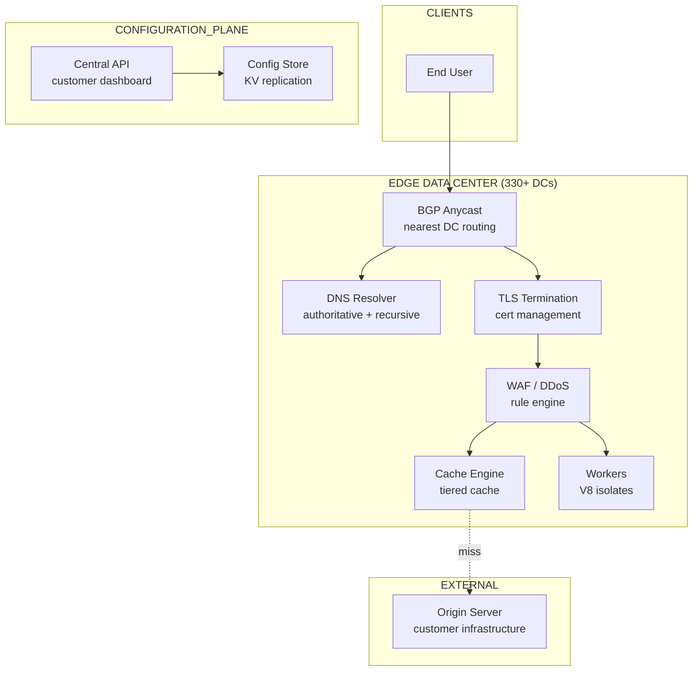
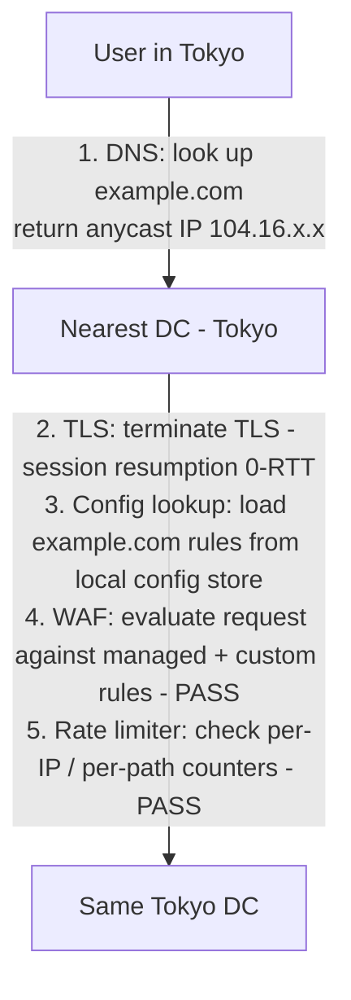
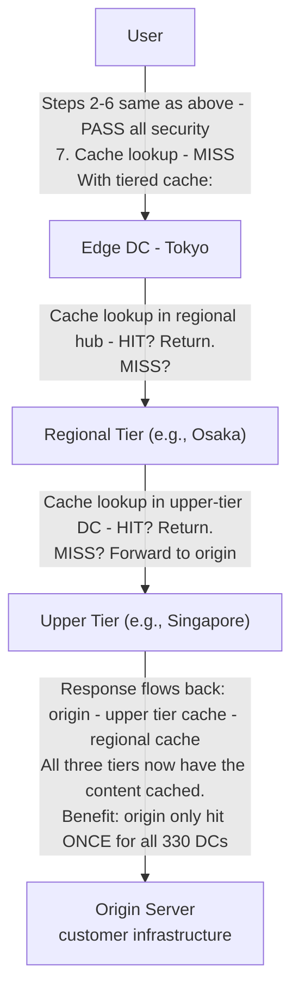
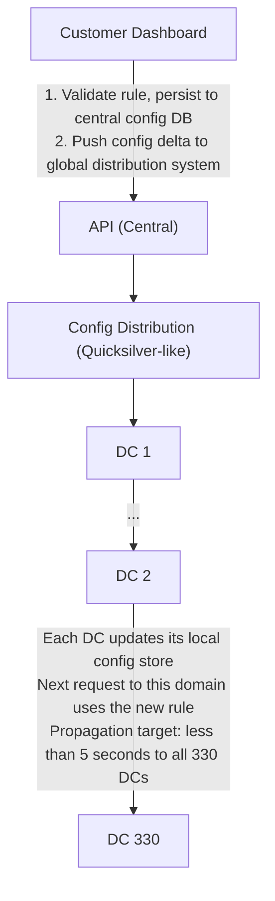

# Design: Cloudflare
*CDN / Edge / Security -- 75 min*

---

## Phase 1: Clarify the Problem & Scope *(5--7 min)*

> **Say:** "We're designing a global reverse-proxy platform like Cloudflare. When a user visits a customer's website, the request hits our edge network first -- the nearest data center resolves DNS, terminates TLS, applies security rules (WAF, DDoS protection, bot management), serves cached content if possible, and only forwards to the origin server on a cache miss. This is an INFRASTRUCTURE system that sits between every user and every origin -- a transparent proxy for the entire web."

### Questions I'd Ask

- **What outcome are we optimizing for?** *-- For CDN: cache hit ratio (% of requests served from edge without hitting origin). For security: attack mitigation rate (% of malicious requests blocked). For both: latency reduction vs. direct-to-origin. This tells us the system's value is KEEPING TRAFFIC AT THE EDGE -- every request that reaches the origin is a partial failure. Architecture must minimize origin touches.*
- **Core product?** CDN only, or also DNS, security, and edge compute? *-- Full stack: DNS + CDN + WAF + DDoS + edge compute (Workers). All run on the same edge infrastructure.*
- **Deployment model?** *-- Every service runs on every server in every data center. NOT specialized clusters per function.*
- **How do customers onboard?** *-- Change DNS nameservers to Cloudflare. We become the authoritative DNS AND the reverse proxy. All traffic flows through us.*
- **Scale?** *-- 330+ data centers globally, ~50M HTTP requests/sec, ~25M DNS queries/sec, protecting ~25M customer domains.*
- **DDoS scale?** *-- Must absorb multi-Tbps attacks without impacting other customers.*

### Agreed Scope

| In Scope | Out of Scope |
|---|---|
| DNS resolution (authoritative) | Domain registrar |
| Anycast request routing | Email routing internals |
| TLS termination at edge | Certificate authority operations |
| CDN caching (+ tiered cache) | Object storage (R2) internals |
| WAF / DDoS protection | Zero Trust / SASE product |
| Edge compute (Workers) | Billing / customer dashboard |
| Origin connection (Tunnels) | Stream video product |

### Core Use Cases

- **UC1:** User in Tokyo requests `example.com/image.png` -- DNS resolves to nearest DC via anycast -- edge cache HIT -- served in <50ms. Origin never touched.
- **UC2:** Cache MISS -- edge forwards to origin (or tiered cache parent) -- response cached at edge -- served to user. Subsequent requests from that region served from cache.
- **UC3:** DDoS attack sends 5 Tbps of traffic at a customer -- anycast distributes across 330 DCs -- each DC absorbs its share -- attack mitigated at the edge, origin unaffected.
- **UC4:** Customer deploys a Cloudflare Worker -- user request executes custom JavaScript at the edge DC closest to the user -- sub-millisecond cold start, no origin needed.

### Non-Functional Requirements

- **Latency:** <50ms for cached content (edge -- user). Within 50ms of ~95% of the world's Internet-connected population.
- **Availability:** If one DC goes down, anycast automatically routes traffic to the next nearest DC. Zero customer-visible downtime.
- **Multi-tenancy:** Millions of customers share the same infrastructure. One customer's DDoS attack must not impact another customer's performance.
- **Homogeneous edge:** Every service runs on every server. No specialized "cache servers" vs "WAF servers." This is a fundamental architectural principle.
- **Configuration propagation:** When a customer changes a WAF rule, it must propagate to all 330 DCs within seconds.

> **Tip:** The defining insight of this system: it's NOT a traditional application. It's a NETWORK-LAYER PROXY that sits in the data path of the entire Internet. The architecture is dominated by BGP anycast routing, edge-local processing (no centralized anything on the hot path), and the challenge of distributing configuration globally in near-real-time.

---

## Phase 2: Back-of-the-Envelope Estimation *(3--5 min)*

| Metric | Value | Detail |
|---|---|---|
| **Data Centers** | **330+** | Located at IXPs globally. Each DC: hundreds to thousands of servers. |
| **HTTP Requests / Sec** | **~50M** | ~4.3T requests/day. Per-DC avg: ~150K req/sec. Large DCs: millions/sec. |
| **DNS Queries / Sec** | **~25M** | Authoritative DNS for ~25M domains. Must respond <10ms. |
| **Bandwidth** | **~200+ Tbps capacity** | Network capacity to absorb largest DDoS attacks. Normal traffic: ~50 Tbps. |
| **Customer Domains** | **~25M** | Each with unique config: cache rules, WAF rules, DNS records, Workers. |
| **Config Data Per Domain** | **~10-50 KB** | 25M x 50KB = ~1.25 TB of config. Must be replicated to every DC. |
| **Cache Storage Per DC** | **~50-500 TB** | SSD-backed. Varies by DC size. Hot content cached locally. |
| **TLS Handshakes / Sec** | **~10M** | Every HTTPS request needs TLS. Session resumption critical for performance. |

> **Decision:** **Key insight #1:** 50M HTTP req/sec is impossible to serve from ANY centralized system. Every request MUST be handled entirely at the edge DC. The hot path (DNS -- TLS -- WAF -- Cache -- response) touches ZERO centralized infrastructure. This is the defining architectural constraint.

> **Decision:** **Key insight #2:** 1.25 TB of customer config must exist at ALL 330 DCs. Config propagation is a distributed systems problem: changes must reach every DC in seconds, but the system must be eventually consistent (a few-second delay is acceptable).

> **Decision:** **Key insight #3:** DDoS attacks are absorbed by the network topology itself. Anycast means attack traffic is automatically distributed across all 330 DCs. Each DC only sees 1/330th of the attack. This is defense BY ARCHITECTURE, not by firewall rules.

---

## Phase 3: High-Level Design *(8--12 min)*

> **Say:** "The key architectural principle is: every service runs on every server. There are no specialized roles. A single request flows through a pipeline of services -- DNS, TLS, WAF, cache, Workers -- all on the same machine. Let me walk through the full request lifecycle."

### Key Architecture Decisions

> **Say:** "Here's WHY I chose each technology -- mapping requirements to tradeoffs. Every choice has a rejected alternative and a consequence."

| Requirement | Decision | Why (and what was rejected) | Consistency |
|---|---|---|---|
| Survive any single DC failure | BGP Anycast across 330+ DCs | Dead DC stops announcing BGP route -- traffic auto-routes to next nearest DC. No DNS change, no failover script. | AP |
| Edge compute with multi-tenant isolation | V8 isolates (not containers) | 5ms cold start, <1MB memory. Containers: 500ms start, 50MB. At 10K tenants/server, containers are 100x more expensive. | -- |
| DDoS mitigation at Tbps scale | Distributed across all DCs (not centralized scrubbing) | 1Tbps attack / 330 DCs = 3Gbps per DC -- manageable. Centralized scrubbing creates a bottleneck and single point of failure. | AP |
| Config changes to 330 DCs in <5 seconds | Custom KV distribution (not database replication) | Purpose-built push system over persistent TCP. Database consensus across 330 nodes would take minutes, not seconds. | AP (eventual, <5s) |
| Cache must serve during origin failure | Serve stale on origin error | Better to show a 5-minute-old page than an error page. Cache-Control: stale-while-revalidate pattern. | AP |
| Every request inspected for attacks | WAF in hot path (compiled Lua/Rust rules) | Rule evaluation must add <1ms latency. Interpreted regex would add 10-50ms. Compiled rules are pre-optimized at deploy time. | -- |

### Edge Data Center Architecture (per DC)



#### BGP Anycast Router [NETWORK]
- Announces same IP from all 330 DCs
- BGP routing sends traffic to nearest DC
- Layer 3/4 DDoS mitigation (hardware)

#### DNS Resolver [EDGE]
- Authoritative DNS for customer domains
- Returns anycast IP for customer's site
- DNSSEC signing, GeoDNS

#### TLS Termination [EDGE]
- Terminate TLS at edge (not origin)
- Session resumption, 0-RTT
- Automatic certificate management (Let's Encrypt)

#### WAF / Security Pipeline [EDGE]
- Managed rulesets + custom rules
- Rate limiting, bot management
- Layer 7 DDoS detection

#### Cache Engine [EDGE]
- SSD-backed content cache
- Cache rules per customer domain
- Tiered cache (edge -- regional -- origin)

#### Workers Runtime [EDGE]
- V8 isolates (not containers)
- Execute customer JS at the edge
- Sub-ms cold start, per-request isolation

#### Origin Connector [EDGE]
- HTTP/2 connection pooling to origins
- Cloudflare Tunnel (encrypted tunnels)
- Argo Smart Routing (fastest path)

#### Config Store (local) [EDGE]
- Local replica of all customer configs
- Updated via global config propagation
- In-memory + SSD. Hot-path lookups <1ms.

### Flow 1: Full Request Lifecycle (cache HIT)



### Flow 2: Cache MISS with Tiered Cache



### Control Plane (NOT on the hot path)



> **Say:** "The most architecturally interesting pieces: (1) How anycast + BGP gives us automatic failover and DDoS absorption. (2) How tiered caching dramatically reduces origin load. (3) How the WAF pipeline processes 50M req/sec with per-customer rules. (4) How Workers runs arbitrary customer code at the edge safely."

---

## Phase 4: Deep Dives *(25--30 min)*

### Deep Dive 1: Anycast & Request Routing (~8 min)

> **Goal:** The core challenge: Route every request to the nearest data center with zero client-side configuration. Handle DC failures transparently. Distribute DDoS attack traffic evenly.

**How Anycast Works**

- **Same IP, everywhere:** Every Cloudflare DC announces the SAME IP prefix (e.g., 104.16.0.0/12) via BGP to all upstream ISPs. When a user sends a packet to 104.16.x.x, BGP routing naturally delivers it to the topologically nearest DC.
- **No client configuration:** The user's ISP's routing table picks the best path. No DNS tricks, no client-side logic. Works at the IP layer.
- **Automatic failover:** If a DC goes offline, it stops announcing its BGP routes. Within seconds (~30-90s for BGP convergence), all traffic is re-routed to the next nearest DC. No customer impact beyond brief increased latency.
- **DDoS by architecture:** A 5 Tbps attack aimed at one IP gets distributed across all DCs announcing that IP. Each DC absorbs ~15 Gbps (5Tbps / 330 DCs) -- well within capacity. No single DC is overwhelmed.

> **Decision:** **Why anycast over GeoDNS?** GeoDNS (returning different IPs per region) works but has major flaws: (1) DNS TTLs mean failover takes minutes, not seconds. (2) Client DNS resolvers may not be near the client (e.g., Google 8.8.8.8). (3) DNS-based routing can't split TCP connections mid-flow. Anycast operates at the IP layer -- failover is handled by BGP, not DNS TTLs. Tradeoff: anycast can cause "flapping" (traffic bouncing between DCs during BGP changes) and doesn't handle TCP connection migration gracefully. Mitigated with Anycast TCP stabilization techniques (ECMP hashing, flow pinning).

**Onboarding: How a Customer Joins**

```sql
-- Customer Onboarding Flow --

1. Customer adds example.com to Cloudflare
2. Cloudflare scans existing DNS records, imports them
3. Customer changes their domain's nameservers to:
     ns1.cloudflare.com  /  ns2.cloudflare.com
4. Now ALL DNS queries for example.com are resolved by Cloudflare
5. Cloudflare returns its own anycast IPs as A/AAAA records
6. ALL HTTP traffic to example.com flows through Cloudflare
7. Cloudflare proxies to the customer's origin server

Result: Cloudflare is now the reverse proxy for all of example.com's traffic.
Customer's origin IP is hidden from the public Internet.
```

### Deep Dive 2: Caching & Tiered Cache (~8 min)

> **Goal:** The core challenge: Cache content at 330 DCs to serve 50M req/sec, while respecting per-customer cache rules (TTL, cache keys, purge) and minimizing origin load. A popular website shouldn't need its origin hit 330 times for the same asset.

**Cache Architecture**

| Layer | Location | Purpose | Cache Hit Rate |
|---|---|---|---|
| L1: Hot (RAM) | Each server | Most frequently accessed objects. Latency: <1ms. | ~40-60% |
| L2: Warm (SSD) | Each server | Larger working set. Latency: ~1-5ms. | +20-30% |
| L3: Tiered Cache | Regional hub DC | Shared cache for a region's edge DCs. Avoid hitting origin. | +10-15% |
| L4: Cache Reserve | R2 (object store) | Persistent cache. Survives eviction. Eliminates origin egress. | +5% |
| MISS | Origin server | Only reached on full cache miss through all tiers. | ~5-10% of requests |

**Tiered Cache Topologies**

- **Standard (flat):** Each DC acts as a direct reverse proxy. Cache miss -- origin. Simple but origin gets hammered (up to 330 concurrent requests for the same asset).
- **Smart Tiered Cache:** Cloudflare automatically selects regional "parent" DCs based on latency. Cache miss at edge -- check parent -- check upper tier -- origin. Origin hit only ONCE, then content fans out through the hierarchy.
- **Custom topology:** Enterprise customers can define their own tier structure (e.g., "always check Singapore before hitting my origin in US-East").

> **Decision:** **Why tiered cache, not just longer TTLs?** Long TTLs reduce origin hits but make purging slow and stale content more visible. Tiered cache gives the same origin-protection benefit while keeping TTLs short at the edge. A 5-second edge TTL with tiered cache is better than a 1-hour edge TTL without it: you get freshness AND origin protection. Tradeoff: tiered cache adds one network hop (edge -- parent DC), adding ~10-50ms latency on the FIRST miss. Subsequent requests are served from parent cache at edge speeds.

**Cache Purge**

- **Single URL purge:** Customer sends API call -- purge propagated to all 330 DCs via config distribution -- each DC evicts that URL from local cache. Takes <5 seconds globally.
- **Purge by tag/prefix:** Customer tags cached objects (e.g., `Cache-Tag: product-123`). Purge by tag evicts all objects with that tag across all DCs.
- **Purge everything:** Nuclear option. Evicts ALL cached content for a domain. Origin hit rate spikes to 100% temporarily -- must handle the thundering herd.
- **Thundering herd mitigation (coalescing):** When a popular object is purged and 1,000 concurrent requests arrive, only ONE request goes to origin. The rest wait for the first response, which is then served to all waiting requests. Critical for preventing origin overload after purge.

> **Tip:** **Cache key:** By default: scheme + host + path + query string. Customers can customize: include/exclude query params, include headers (e.g., `Accept-Language` for localized content), include cookies. Custom cache keys enable powerful caching strategies (e.g., cache different versions for mobile vs. desktop).

### Deep Dive 3: WAF & DDoS Mitigation (~5 min)

> **Goal:** The core challenge: Evaluate every HTTP request against security rules at 50M req/sec. Detect and mitigate DDoS attacks at both the network layer (L3/4) and application layer (L7). Multi-tenant: one customer's attack must not impact another.

**Security Pipeline (per request)**

```sql
-- Security evaluation order (per request, <1ms total) --

1. IP reputation check    -> known bad IP? block immediately.
2. L7 DDoS fingerprint    -> matches known attack pattern? challenge/block.
3. Rate limiting           -> exceeds per-IP/per-path threshold? 429.
4. Bot management         -> classify: verified bot / likely bot / human.
                              JS challenge, CAPTCHA, or allow.
5. Managed WAF rules      -> OWASP top 10: SQLi, XSS, SSRF, etc.
                              ~200 rules evaluated via compiled ruleset.
6. Custom WAF rules       -> customer's rules (Wireshark-like expression language).
7. Transform rules        -> URL rewrites, header modifications.

All steps run in-process, in-memory. No network calls.
Managed rules are pre-compiled into an optimized matching engine
(not evaluated rule-by-rule -- that would be too slow at 50M req/sec).
```

**DDoS Mitigation Architecture**

| Layer | Attack Type | Mitigation |
|---|---|---|
| L3/4 (Network) | SYN floods, UDP floods, amplification | Hardware-level filtering at edge routers (XDP/eBPF on Linux kernel). Drops packets BEFORE they reach application layer. Anycast distributes volume. |
| L7 (Application) | HTTP floods, slowloris, credential stuffing | Behavioral analysis: requests/sec per IP, request patterns, JS challenges. Machine learning on traffic patterns across all customers (collective intelligence). |
| DNS | DNS amplification, query floods | Anycast DNS infrastructure. Rate limiting per source IP. Response rate limiting (RRL). |

> **Decision:** **Why collective intelligence (cross-customer signals)?** If an IP is attacking one customer, it's likely malicious for others too. Every request to every customer updates a global threat model. An IP flagged as attacking site A is pre-emptively rate-limited on site B. This is a massive advantage of multi-tenancy: 25M domains contribute to a shared defense. Tradeoff: false positives (an IP blocked for one site might be legitimate for another). Mitigated with per-customer override rules and graduated responses (challenge before block).

### Deep Dive 4: Edge Compute -- Workers (~5 min)

> **Goal:** The core challenge: Execute arbitrary customer JavaScript at the edge with sub-millisecond cold starts, per-request isolation between customers, and no shared state contamination. At 50M req/sec, we can't afford container-based isolation.

**V8 Isolate Architecture**

- **NOT containers:** Containers have ~50-500ms cold start. Unacceptable for edge latency targets. Instead, use V8 isolates -- the same technology that creates separate contexts in Chrome tabs.
- **Per-request isolation:** Each Worker invocation runs in its own V8 isolate. Memory is not shared between customers. An isolate for Customer A cannot access Customer B's data.
- **Cold start: <5ms.** V8 isolates spin up 100x faster than containers. Many are pre-warmed (kept alive between requests to the same Worker).
- **Resource limits:** CPU time: 50ms per request (free tier), 30s (paid). Memory: 128MB per isolate. No filesystem access. Network: only outbound fetch().
- **Execution model:** Worker intercepts request BEFORE cache lookup. Can rewrite request, generate response, or pass through to cache/origin. This makes Workers a programmable proxy layer.

> **Decision:** **Why V8 isolates over containers or VMs?** At 50M req/sec across millions of Workers, we need microsecond-level isolation switching. Containers need full OS-level isolation (cgroups, namespaces) -- heavy. VMs even heavier. V8 isolates share a single process but have strong memory isolation within V8's sandbox. Tradeoff: limited to JavaScript/WASM (no arbitrary binaries), constrained resource limits (no filesystem, limited CPU). For most edge use cases (request routing, header modification, A/B testing, auth), this is sufficient.

```sql
-- Where Workers Fit in the Request Pipeline --

Request arrives -> TLS -> Config lookup -> Worker executes -> WAF -> Cache -> Origin
                                         |
                  Worker can:
                  * return response (skip cache + origin entirely)
                  * modify request (rewrite URL, add headers) -> continue pipeline
                  * fetch() sub-requests (to origin, other APIs, or other Workers)
                  * read/write KV (global key-value store, eventually consistent)
                  * read/write Durable Objects (strongly consistent, single-writer)
```

---

## Phase 5: Cross-Cutting Concerns *(10--12 min)*

### Storage Architecture Summary

> **Goal:** What goes where and why. Each data store is chosen for its access pattern -- not by default. The question isn't "which database?" but "what are the read/write patterns, consistency requirements, and scale characteristics?"

| Data | Store | Why This Store |
|---|---|---|
| Cached content | Local SSD (per DC) | LRU cache of HTTP responses. Key = URL + Vary headers. Tiered: hot (memory) -- warm (SSD). Eviction under memory pressure. |
| Configuration | KV Store (replicated) | Customer rules, DNS zones, WAF policies. Replicated to all 330+ DCs within seconds via Quicksilver-like system. |
| Workers KV | Distributed KV | Key-value store accessible from Workers. Eventually consistent globally. Used by customers for edge state. |
| DNS zones | In-memory per DC | Authoritative DNS records loaded at startup and updated via config push. Must be in memory for sub-ms response. |
| Analytics & logs | ClickHouse (central) | Request logs aggregated centrally. Not on hot path -- shipped async. Powers the customer analytics dashboard. |
| TLS certificates | Local disk per DC | Customer SSL certs cached locally. Fetched from central store on first request and cached. Auto-renewed. |

### Failure Scenarios

| Scenario | Mitigation |
|---|---|
| Entire DC goes offline | DC stops announcing BGP routes. Within 30-90 seconds, all traffic re-routes to next nearest DC via BGP convergence. Users experience brief latency increase, not outage. Cache is cold at the new DC -- origin load spikes temporarily. |
| Origin server goes down | "Always Online" mode: serve stale cached content with a warning header. For uncached paths, return a custom error page. Cloudflare Tunnel health checks detect origin failure within seconds. |
| Config propagation failure | DC continues serving with its LAST KNOWN config. Eventually consistent -- customer's new rule might take longer to apply at this DC. Alert on propagation delay. Doesn't break serving. |
| Cache poisoning attempt | Cache keys are normalized (lowercase, sorted query params). Host header validation prevents cross-domain poisoning. Vary header support ensures correct content per variant. Cache-Tag purging enables surgical cleanup if poisoning detected. |
| 5 Tbps DDoS attack | Anycast distributes: 5Tbps / 330 DCs = ~15 Gbps per DC. L3/4 mitigation (XDP/eBPF) drops flood packets at kernel level. L7 fingerprinting blocks application-layer floods. Cross-customer threat intelligence blocks known-bad IPs proactively. |
| Worker script has a bug (infinite loop) | CPU time limit enforced (50ms/request). V8 terminates isolate on timeout. Request falls back to default behavior (pass to cache/origin). Customer notified via dashboard. |
| Thundering herd after purge | Request coalescing: first miss triggers origin fetch, all concurrent requests for the same key wait for that single response. Stale-while-revalidate: serve stale content while fetching fresh in background. |

### Scalability

> **Tip:** Cloudflare's scaling model is fundamentally different from traditional backends: instead of scaling up a centralized service, they replicate the ENTIRE stack to 330+ data centers worldwide. Every DC runs the full pipeline (DNS, TLS, WAF, cache, Workers). This means: (1) capacity scales with the number of DCs, not the size of individual DCs, (2) no single point of failure -- each DC is autonomous, (3) latency is determined by geographic proximity, not server capacity. Within a DC, the scaling unit is the server -- each server runs all services (no microservice decomposition at the edge). This "shared nothing per DC" architecture means adding capacity is as simple as deploying more servers in a DC or opening a new DC. The tiered cache hierarchy (edge -- regional -- upper-tier -- origin) reduces origin load exponentially: a popular asset might be fetched from origin once and served from cache millions of times. The real scaling bottleneck is configuration distribution: pushing a customer's rule change to 330+ DCs within seconds requires a purpose-built replication system (Quicksilver), not a traditional database.

### Configuration Propagation

- **System:** A global KV distribution system (similar to Cloudflare's internal "Quicksilver") pushes config changes to all 330 DCs.
- **Mechanism:** Central API writes config delta -- publishes to distribution layer -- each DC subscribes and applies locally. NOT a database replicated globally -- it's a purpose-built eventually-consistent config store.
- **Target:** <5 seconds from API call to config live at every DC worldwide.
- **Volume:** 25M domains x average 1 change/day = ~300 config changes/second globally. Small payloads (deltas, not full configs).
- **Consistency:** Eventually consistent. Brief window where some DCs have old rules, others have new. Acceptable for WAF rules (a few seconds of old rules is fine). NOT acceptable for certificate rotation (must be atomic -- separate mechanism).

### Multi-Tenancy & Isolation

- **Shared-nothing per request:** Every request is processed independently. No shared state between customers on the hot path. Customer A's DDoS attack doesn't consume resources for Customer B because DDoS is mitigated at L3/4 before reaching the application layer.
- **Fair resource allocation:** Per-customer rate limits on API calls. Per-domain CPU budget for Workers. Per-domain cache eviction based on hit rate (cold content evicted before hot content regardless of customer).
- **Blast radius:** A misconfigured WAF rule for Customer A only affects Customer A's traffic. Other customers' traffic flows through a completely independent rule evaluation (different config lookup).

### Observability

- **Per-customer analytics:** Request count, bandwidth, cache hit ratio, threat events, Worker CPU time -- all available via dashboard and GraphQL API.
- **Per-DC health:** Request throughput, error rate, cache hit ratio, DDoS mitigation events, BGP route stability.
- **Global:** Config propagation latency, inter-DC connectivity, origin reachability per customer.

### Security & Access Control

> **Decision:** Security IS Cloudflare's product, so it's deeply architectural. DDoS mitigation operates at three layers: (1) L3/L4: BGP Anycast distributes volumetric attacks across all DCs -- a 1Tbps attack hitting 330 DCs is ~3Gbps per DC, manageable; (2) L4: SYN flood protection via SYN cookies -- the server doesn't allocate state until the TCP handshake completes; (3) L7: the WAF inspects HTTP requests against OWASP rules + custom rules. The WAF runs in the hot path so it must be fast -- rule evaluation uses a compiled Lua/Rust engine, not interpreted regex. Bot management uses JavaScript challenges and behavioral analysis. For customer isolation in a multi-tenant environment: each request is processed in an isolated context, Workers run in V8 isolates (not containers) with strict memory limits and CPU time limits. A misbehaving Worker in one customer's zone cannot affect another customer. TLS private keys are stored in a Keyless SSL architecture for enterprise customers -- the key never leaves the customer's HSM.

---

## Phase 6: Wrap-Up & Evolution *(3--5 min)*

> **Say:** "To summarize: the architecture is defined by ONE principle -- every service runs on every server at every edge DC. There is no centralized hot path. Anycast BGP routing automatically sends users to the nearest DC and provides failover and DDoS absorption by network topology alone. Each request flows through a pipeline -- DNS -- TLS -- WAF -- cache -- Workers -- origin -- all on the same machine with <1ms of security evaluation overhead. Tiered caching creates a hierarchy (edge -- regional -- upper tier -- origin) that protects origin servers from being hit 330 times for the same asset. Configuration is distributed globally via an eventually-consistent propagation system that delivers customer changes to all 330 DCs in <5 seconds. Edge compute uses V8 isolates for sub-millisecond cold starts and per-request isolation at 50M req/sec -- 100x faster than containers."

### What I'd Build Next

| Extension | Architecture Impact |
|---|---|
| Durable Objects (strongly consistent edge state) | Single-writer per object, colocated with the user. Enables real-time collaboration, game state, counters at the edge. Fundamentally different from KV (eventually consistent). |
| AI inference at the edge | Run ML models in Workers. Requires GPU resources at edge DCs. Scheduling challenge: which DCs have GPU capacity? |
| Zero Trust / SASE | Corporate traffic routed through Cloudflare (not just web traffic). Identity-based access policies. Extends from "protect websites" to "protect corporate networks." |
| R2 (S3-compatible object storage) | Leverages edge network for delivery but needs centralized (or regionally replicated) storage for persistence. Different consistency model from cache. |

> **Tip:** **Closing framing:** This system is fundamentally different from every other design in this series. It's not an application -- it's the NETWORK ITSELF. The architecture is defined by BGP anycast, not by databases. Failure tolerance comes from network topology, not from replicated state machines. Scale comes from edge locality, not from horizontal scaling of centralized services. The defining tension is: ZERO centralized anything on the hot path, while still delivering consistent configuration and security policies across 330 independent data centers worldwide.

---

## Phase 7: Interview Q&A *(Practice)*

> **Say:** "Here are the hardest questions an interviewer would ask about this design, and how to answer them. Each answer demonstrates deep understanding of the tradeoffs, not just surface knowledge."

**Q:** How does Anycast handle a data center going offline?

**A:** Anycast is a BGP routing protocol where multiple DCs announce the same IP address. Routers on the internet choose the "nearest" DC based on BGP path length. If a DC goes offline, it stops announcing the BGP route -- within 30-90 seconds, all internet routers converge and traffic automatically flows to the next nearest DC. There's no DNS change, no failover script, no manual intervention. The elegance is that this works at the network layer, below any application logic. The 30-90 second convergence time is the main limitation -- during this window, some users might experience timeouts as their packets route to the dead DC. To mitigate this, Cloudflare does health-checking within DCs: if a server is unhealthy, the DC's internal load balancer removes it before it affects BGP. The DC only withdraws its BGP route if the ENTIRE DC is unreachable (power failure, network cut). For individual server failures, the impact is absorbed internally.

**Q:** How do you push a configuration change to 330 data centers in under 5 seconds?

**A:** This is the Quicksilver problem. Traditional approaches fail: database replication is too slow (consensus across 330 nodes), and CDN cache invalidation is eventually consistent with unknown latency. Cloudflare built a purpose-built KV distribution system. The architecture: (1) a customer makes a change via the API (central), (2) the change is written to a central store and assigned a monotonic sequence number, (3) every DC maintains a persistent connection to the central distribution layer, (4) changes are pushed to all DCs in parallel (not serially), (5) each DC applies changes in sequence-number order, ensuring consistency. The system is optimized for small, frequent writes (rule changes, DNS updates) rather than bulk data. It uses a custom binary protocol over persistent TCP connections. The 5-second target is p95 -- most changes propagate in <2 seconds. DCs that are temporarily unreachable queue changes and catch up on reconnection. This is eventually consistent by design -- two DCs might briefly disagree on a config, which is acceptable because the window is <5 seconds.

**Q:** Why V8 isolates instead of containers for Workers?

**A:** Startup time and density. A container (even a lightweight one) takes 50-500ms to cold start and uses 10-50MB of memory. A V8 isolate starts in <5ms and uses <1MB. On an edge server handling 10,000 requests/second across 100 different customer Workers, containers would need 100 containers consuming 1-5GB of memory. V8 isolates for the same workload use <100MB. The tradeoff: V8 isolates only support JavaScript/WASM (no arbitrary binaries), and they have strict limits (128MB memory, 50ms CPU per request for free tier). But for the edge computing use case -- lightweight request transformation, A/B routing, header manipulation, simple API responses -- these limits are rarely hit. Security isolation comes from V8's sandbox: each isolate has its own heap and cannot access another isolate's memory. This is the same isolation model Chrome uses between tabs. It's not as strong as container/VM isolation (no kernel separation), but it's sufficient for the threat model (customer code manipulating HTTP requests, not running untrusted binaries).
