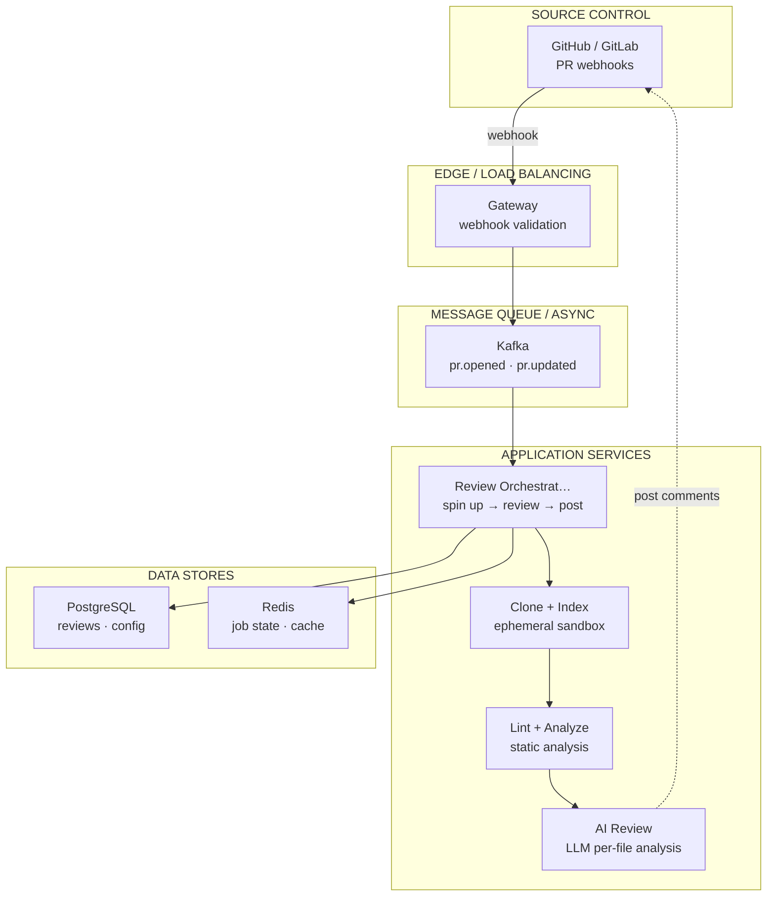
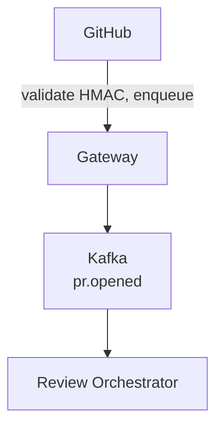
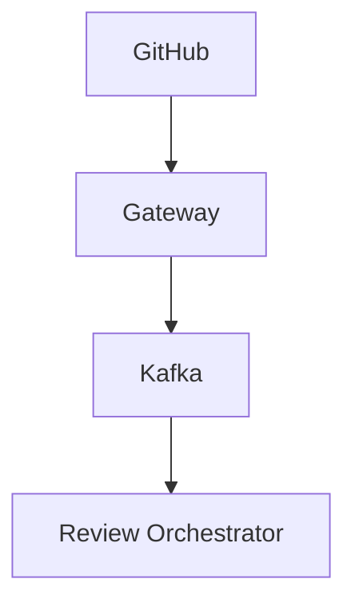

# Design CodeRabbit
*AI Code Review Platform · 75 min*

## Phase 01: Clarify the Problem & Scope *(5–7 min)*

> **Say:** "We're designing an AI-powered code review platform like CodeRabbit. When a developer opens a pull request on GitHub or GitLab, our system automatically reviews the code changes — providing a summary, file-by-file analysis, bug detection, security checks, and inline suggestions — then posts the review as PR comments. The system must understand the FULL codebase context, not just the diff, and learn from team feedback over time."

### Questions I'd Ask

- **What outcome matters most?** *→ Review quality (bugs caught before merge / total bugs) balanced against false positive rate. A tool that flags real bugs is invaluable. A tool that floods PRs with noise gets disabled. Secondary: time-to-first-review (developers shouldn't wait for human reviewer when AI can start immediately). This shapes the model cascade: prefer precision over recall — it's better to miss a minor issue than to cry wolf.*
- **Trigger mechanism?** PR creation/update only, or also IDE and CLI? *→ PR webhook is primary. IDE and CLI as secondary surfaces.*
- **Platforms?** GitHub, GitLab, Bitbucket? *→ All three. Abstracted behind a platform adapter layer.*
- **What does "context-aware" mean specifically?** *→ The review should understand: the diff, the full codebase (dependencies, call graph), linked issues (Jira/Linear), past PRs, team coding standards, and previous feedback from this team.*
- **Static analysis too, or just LLM?** *→ Both. 40+ linters/SAST tools run alongside LLM review. Results synthesized into unified feedback.*
- **Interactive?** Can devs reply to review comments? *→ Yes — conversational. Dev replies, AI responds, and can learn from feedback.*
- **Scale?** *→ ~100K repositories, ~500K PRs/day, ~2M review comments posted/day.*

### Agreed Scope

| In Scope | Out of Scope |
| --- | --- |
| Webhook ingestion (GitHub/GitLab/Bitbucket) | IDE inline review (mention as extension) |
| Codebase cloning & context assembly | Code fix auto-application |
| LLM-powered code review pipeline | CI/CD pipeline integration |
| Static analysis tool orchestration (40+ linters) | LLM training / fine-tuning |
| PR comment posting (summary + inline) | Billing / subscription |
| Conversational follow-up in PR threads | Code generation / auto-fix PRs |
| Learning from team feedback |  |
| Code graph / dependency analysis |  |

### Core Use Cases

- **UC1:** Dev opens PR → within 90 seconds, CodeRabbit posts a review: summary of changes, walkthrough, architecture diagram, file-by-file comments with inline suggestions.
- **UC2:** Dev pushes new commits to PR → incremental review of only the new changes, referencing the prior review context.
- **UC3:** Dev replies to a CodeRabbit comment "we prefer 2-space indentation" → system learns this preference, applies to all future reviews for this repo.
- **UC4:** CodeRabbit detects a race condition by analyzing the dependency graph, not just the diff — something a diff-only reviewer would miss.

### Non-Functional Requirements

- **Latency:** Full review posted within 90 seconds of PR event. First comment (summary) within 30s.
- **Accuracy > speed:** False positives erode trust fast. Better to post fewer, high-quality comments than flood the PR with noise.
- **Security:** Customer code is cloned into an ephemeral sandbox, processed, then destroyed. Zero persistence after review. No code used for model training.
- **Scalability:** Handle PR spike during business hours (8am–6pm per timezone = rolling peak).
- **Reliability:** Webhook must ACK within 50ms. Actual review processing is async. GitHub will retry if we timeout.

> **Tip:** The defining tension of this system: the review must understand the ENTIRE codebase (not just the diff), but must complete within 90 seconds. Context assembly — deciding what to include and what to skip — is the hardest problem. More context = better review but slower + more expensive. The architecture is a CONTEXT ENGINEERING problem.

## Phase 02: Back-of-the-Envelope Estimation *(3–5 min)*

| Metric | Value | Detail |
| --- | --- | --- |
| Repositories | ~100K | Active repos with CodeRabbit installed |
| PRs / Day | ~500K | ~6/sec avg, ~50/sec peak (business hours) |
| Webhook Events / Day | ~2M | PRs + pushes + comments + replies. ~23/sec avg, ~200/sec peak. |
| Review Processing Time | 60–90 sec | Clone + context assembly + linters + LLM + post comments |
| Concurrent Reviews | ~500–3K | 50 PRs/sec × 90s processing = ~4,500 concurrent at peak |
| LLM Calls / Review | ~5–15 | Summary + per-file reviews (batched) + verification pass. ~5M LLM calls/day. |
| Linter Executions / Review | ~10–20 | 40+ tools, but only relevant ones per language. ~5M linter runs/day. |
| Code Cloned / Day | ~50 TB transient | 500K PRs × avg 100MB repo. Ephemeral — destroyed after review. |

> **Decision:** **Key insight #1:** 4,500 concurrent reviews at peak, each needing an isolated sandbox with a cloned repo. This is a compute orchestration problem. Serverless / container-per-review is the natural fit — spin up, process, tear down.

> **Decision:** **Key insight #2:** The webhook gateway must ACK in 50ms, but reviews take 90 seconds. This FORCES an event-driven architecture — immediate ACK, async processing via queue.

> **Decision:** **Key insight #3:** 5M LLM calls/day is the cost bottleneck. Not every file needs the most expensive model. A MODEL CASCADE (cheap model for simple files, expensive model for complex logic) can cut costs 5-10× without quality loss.

## Phase 03: High-Level Design *(8–12 min)*

> **Say:** "The architecture has three distinct layers: a thin webhook gateway that ACKs immediately, a message queue that buffers reviews, and a fleet of sandboxed review workers that do the actual analysis. Let me draw the full flow."

### Key Architecture Decisions

> **Say:** "Here's WHY I chose each technology — mapping requirements to tradeoffs. Every choice has a rejected alternative and a consequence."

| Requirement | Decision | Why (and what was rejected) | Consistency |
| --- | --- | --- | --- |
| Review posted within 90 seconds of PR | Async pipeline: Kafka → clone → analyze → post | Webhook triggers async flow. Clone + static analysis + AI review parallelized where possible. Synchronous webhook processing would timeout. | — |
| Customer code security: never persisted | Ephemeral sandboxes, destroyed after review | Code cloned into ephemeral container, deleted after review completes. No persistent storage of customer code reduces breach blast radius. | — |
| False positive rate must decrease over time | Feedback loop: developer reactions → per-repo tuning | Thumbs up/down on comments feed into per-repo learned preferences. Comment patterns consistently dismissed get suppressed. | — |
| Multi-language: Python, JS, Go, Rust, etc. | LLM-based review (not language-specific rules) | LLM understands all languages. Rule-based approach requires per-language rule sets — doesn't scale to 20+ languages. | — |
| Context beyond the diff: understand the whole codebase | Vector embeddings of repository (LanceDB) | Index existing codebase for semantic search. Review comments reference patterns elsewhere in the repo, not just the changed lines. | — |

### Major Components



#### Webhook Gateway [INGESTION]
- Receives GitHub/GitLab/Bitbucket webhooks
- HMAC signature validation
- ACK in <50ms, enqueue event
- Deliberately "dumb" — no business logic

#### Event Queue [BUFFER]
- Kafka / Redpanda
- Decouples ingestion from processing
- Absorbs spikes (shock absorber)
- Ordered per-repo for consistency

#### Review Orchestrator [CORE]
- Consumes events from queue
- Spins up sandbox per review
- Coordinates: clone → context → lint → LLM → post
- Manages model cascade routing

#### Sandbox (Cloud Run) [EPHEMERAL]
- Isolated container per review
- Clones repo, runs linters, executes AI scripts
- Double-sandboxed: container + jailkit
- Destroyed after review completes

#### Context Engine [CORE]
- Builds "case file" for the review
- Code graph (dependencies, call sites)
- Linked issues (Jira/Linear/GitHub)
- Past PRs, team learnings, coding guidelines
- Vector search via LanceDB

#### Linter Orchestrator [ANALYSIS]
- 40+ static analysis tools (ESLint, Rubocop, etc.)
- Auto-detects language → runs relevant linters
- Results fed to LLM for synthesis
- Runs in sandbox alongside code

#### LLM Review Engine [AI]
- Model cascade: fast model → complex model
- Summary generation, file-by-file review
- Verification pass (reduce hallucinations)
- Conversational replies in PR threads

#### Platform Adapter [OUTPUT]
- Posts review comments back to PR
- Abstracts GitHub/GitLab/Bitbucket APIs
- Summary comment + inline file comments
- Handles rate limits per platform

### Flow 1: PR Opened → Full Review



### Flow 2: Dev Replies to Comment



> **Say:** "The most architecturally interesting piece is the Context Engine — how we assemble the 'case file' that makes reviews codebase-aware rather than diff-only. That's what I'd like to deep-dive first. Second, the sandboxed execution model for running untrusted code safely."

## Phase 04: Deep Dives *(25–30 min)*

### Deep Dive 1: Review Pipeline & Context Engine (~12 min)

> **Goal:** **The core challenge:** A diff without context is noise. "Line 42 changed" means nothing unless you know it's called by 15 other files, the linked Jira ticket asked for something different, and the team's convention is to handle errors a specific way. Assembling the RIGHT context — not all context — within 90 seconds is the hardest problem.

**Context Layers (assembled in parallel)**

| Layer | Source | What It Provides | Retrieval Method |
| --- | --- | --- | --- |
| Diff | Git | What changed: added/removed/modified lines per file | git diff (in sandbox) |
| Code Graph | AST Parser | Who calls this function? What depends on this module? Downstream impact. | Build lightweight dependency graph on clone. Tree-sitter for multi-language AST. |
| Co-change History | Git log | Files that historically change together with the modified files. | git log --follow analysis |
| Linked Issues | Jira/Linear/GitHub | The "why" — what was the developer trying to accomplish? | Parse PR description for issue refs, fetch via API |
| Past PRs | LanceDB | Similar changes, past review feedback on related code. | Semantic search over PR embeddings |
| Team Learnings | LanceDB | Preferences from past feedback ("we use 2-space indent", "always check null here"). | Filtered by repo_id, semantic match to current diff |
| Coding Guidelines | .coderabbit.yaml | Explicit rules: naming conventions, error handling, API patterns. | Direct config load |
| Linter Results | 40+ tools | Static analysis findings: type errors, security issues, style violations. | Run in sandbox, parse output |

> **Decision:** **Why LanceDB for vector search?** We need to search over millions of PR interactions across 100K repos — past reviews, learnings, similar code patterns. LanceDB is an embedded vector DB that can run inside the sandbox or on the worker node, avoiding network round-trips to a centralized vector DB. It supports massive tables with fast upsert for real-time ingestion. Tradeoff: not as feature-rich as Pinecone/Weaviate, but the embedding + search happening co-located with the review worker minimizes latency.

**Model Cascade Strategy**

```sql
── Step 1: File Classification (fast model, ~2 sec) ──
For each changed file, classify:
  TRIVIAL   → config changes, formatting, comments-only
              → skip LLM review OR one-liner ("looks good")
  MODERATE  → standard logic, well-tested patterns
              → review with fast model (Haiku/Sonnet)
  COMPLEX   → security-sensitive, concurrency, architectural
              → review with premium model (Opus/Sonnet)

── Step 2: Batched Review (parallel, ~30-60 sec) ──
Each file group reviewed in parallel:
  Context = diff + code graph neighbors + linter results + guidelines
  Prompt = "Review this change. Consider: [context]. Team prefers: [learnings]."

── Step 3: Verification (agent, ~15-30 sec) ──
For each non-trivial finding, verification agent:
  Generates a shell script to check the claim
  e.g., "Is function X really unused?" → grep -r "functionX" --include="*.ts"
  Runs script in sandbox → confirm or retract
  This step cuts false positives by ~40%
── Cost Savings ──
Without cascade: all files → premium model = ~$0.15/review
With cascade: 40% trivial + 40% fast + 20% premium = ~$0.02/review
~7.5× cost reduction
```

> **Decision:** **Why a verification pass instead of just better prompting?** LLMs hallucinate. A model might say "this function is never called" when it actually IS called from a file not included in context. The verification agent PROVES claims by running actual code analysis (grep, ast-grep) in the sandbox. This is the difference between "AI opinion" and "verified finding." Tradeoff: adds 15-30 seconds to review time, but dramatically improves trust and accuracy.

> **Tip:** **The Gatekeeper Pattern:** ~40% of webhook events are noise — merge commits, bot PRs (Dependabot), auto-generated files (package-lock.json), and CI re-runs. The gatekeeper filters these BEFORE spinning up a sandbox, saving ~40% of compute. Rules are configurable per repo in `.coderabbit.yaml` (path filters, ignore patterns).

### Deep Dive 2: Sandboxed Code Execution (~8 min)

> **Goal:** **The core challenge:** We're cloning and executing code from customer repositories. This code is untrusted — it could be buggy, incomplete, or malicious. The linters might run untrusted plugins (ESLint configs). The verification agent generates and executes scripts. All of this must be completely isolated.

**Sandbox Architecture (Cloud Run)**

- **Layer 1: Cloud Run container** — each review gets its own container instance. Auto-scaled based on queue depth. Torn down after review completes. Minimal IAM permissions (no access to other customer data).
- **Layer 2: gVisor microVM** — Cloud Run's second-gen execution environment provides hardware-level isolation. Each container runs in its own microVM.
- **Layer 3: Jailkit + cgroups** — within the container, linter and script execution runs in a jailed process with restricted filesystem access (only the cloned repo) and CPU/memory limits via cgroups.
- **Network:** Outbound network is blocked by default. Only allowlisted domains (package registries for linter plugin install, issue tracker APIs) are permitted.
- **Lifetime:** Container exists for the duration of the review (60-90 seconds). All data destroyed on termination. No persistent storage.

> **Decision:** **Why Cloud Run over Kubernetes or Firecracker?** Cloud Run gives us per-request container scaling with zero idle cost, built-in gVisor isolation, and managed infrastructure. Kubernetes would require managing our own node pool and scaling logic. Firecracker (like AWS Lambda) is more isolated but less flexible (no arbitrary binaries for linters). Tradeoff: Cloud Run has cold-start latency (~2-5s for first container), but we keep a minimum instance count to mitigate this during business hours.

```sql
── Sandbox Lifecycle ──

1. Spin up: Cloud Run instance starts (~2s warm, ~5s cold)
2. Clone:  git clone --depth=1 --branch= (~3-10s)
              + git fetch origin  --depth=1
3. Index:  Build code graph with tree-sitter AST parsing (~2-5s)
4. Lint:   Run relevant linters in jailed process (~5-15s)
5. Review: LLM calls with assembled context (~30-60s)
6. Verify: AI-generated scripts run in jail (~10-20s)
7. Post:   Comments posted to PR via platform API (~2s)
8. Destroy: Container terminated, all data gone

Total: 60-90 seconds end-to-end
```

### Deep Dive 3: Learning & Feedback Loop (~5 min)

> **Goal:** **The core challenge:** CodeRabbit must get SMARTER over time for each team. If a dev says "we always handle errors with Result types, not exceptions," every future review should know this. This is a per-repo memory system.

**Learning Sources**

| Source | How It's Captured | How It's Applied |
| --- | --- | --- |
| Chat Feedback | Dev replies to review comment with correction/preference. NLP classifies as "learning." | Stored in LanceDB as an embedding. Retrieved via semantic search when similar code is reviewed. |
| .coderabbit.yaml | Explicit rules: "enforce 2-space indent," "flag any use of eval()." | Injected directly into review prompt. Deterministic, always applied. |
| Coding Agent Rules | Import from Cursor/Copilot rules files (.cursorrules, etc.) | Parsed and included as coding guidelines. |
| Review Outcomes | Track which comments get resolved vs. dismissed by developers. | Down-weight comment patterns that are frequently dismissed. |

```sql
── LanceDB: Learnings Table ──
learnings
id UUID
repo_id UUID
org_id UUID (learnings can be org-wide or repo-specific)
  content          TEXT ("We prefer Result types over exceptions")
  embedding        VECTOR(1536)
  source           ENUM (chat_feedback, yaml_import, auto_inferred)
  confidence       FLOAT (0-1, increases with repeated confirmation)
  created_at       TIMESTAMP
  last_applied_at  TIMESTAMP
── At review time: ──
1. Embed the current diff
2. Query learnings WHERE repo_id=X, top 10 by semantic similarity
3. Inject into review prompt as "Team preferences"
```

> **Decision:** **Why not fine-tune a per-customer model?** Fine-tuning is expensive, slow (hours per update), and doesn't adapt in real-time. A retrieval-based approach (embed learnings → inject at review time) updates instantly when a developer gives feedback, costs nothing to maintain, and works across model upgrades. Tradeoff: retrieval can miss relevant learnings if the embedding doesn't capture the relationship. We mitigate this with explicit yaml rules as a deterministic fallback.

### Deep Dive 4: Data Model & Storage Summary (~5 min)

| Data | Store | Access Pattern | Retention |
| --- | --- | --- | --- |
| Webhook Events | Kafka | Ordered per-repo. Consumed by review workers. | 7 days (replay window) |
| Review Results | PostgreSQL | Per PR: summary, comments, status. Query by repo+PR. | Permanent (customer data) |
| Learnings | LanceDB | Semantic search by repo_id + embedding similarity. | Permanent (grows over time) |
| Code Graph Cache | Redis | Per-repo dependency graph. Invalidated on new PR. | TTL: 1 hour |
| Repo Metadata | PostgreSQL | Installation config, .coderabbit.yaml, connected integrations. | Permanent |
| Customer Code | EPHEMERAL (sandbox) | Cloned on demand, destroyed after review. | 0 — never persisted |
| Linter Results | In-memory (sandbox) | Generated and consumed within single review. | 0 — destroyed with sandbox |
| PR Embeddings | LanceDB | Semantic search for "similar past PRs." | 90 days rolling |

> **Decision:** **The critical security property:** Customer source code is NEVER stored persistently. It exists only in the ephemeral sandbox container for the duration of the review (60-90 seconds), then is destroyed. LLM queries are in-memory only with zero retention. Only review RESULTS (comments, summaries) and LEARNINGS (preferences) are persisted. This is the core trust proposition.

## Phase 05: Cross-Cutting Concerns *(10–12 min)*

### Failure Scenarios

| Scenario | Mitigation |
| --- | --- |
| GitHub rate limits our comment posting | Exponential backoff with jitter. Batch comments into fewer API calls (one review comment with multiple inline notes vs. separate calls). Cache auth tokens, use GitHub App installation tokens (higher rate limit than OAuth). |
| LLM provider is down/slow | Multi-provider fallback: primary → secondary LLM. If all providers down, post partial review (linter results only) with "AI review pending" note. Retry from queue when provider recovers. |
| Sandbox OOM (huge repo) | Memory limits per container (4GB). Shallow clone with depth=1. If repo exceeds limit, review only changed files without full code graph. Degrade gracefully: diff-only review is still useful. |
| Malicious code in repo | Triple sandbox isolation (Cloud Run + gVisor + jailkit). No outbound network. CPU/memory cgroups. Even if code exploits a linter, it can't escape the sandbox or access other customers' data. |
| Webhook replay storm (GitHub retries) | Idempotency: each webhook has a delivery ID. Deduplicate in the gateway using a Redis set with 1h TTL. If we see the same delivery ID twice, ACK without re-enqueuing. |
| Review is wrong (false positive) | Developer replies "this is incorrect." Learning system captures the correction. Verification agent reduces future false positives. Review quality metrics track dismissal rate per comment type. |

### Scalability

| At Scale | What Breaks | Mitigation |
| --- | --- | --- |
| 10× (5M PRs/day) | Cloud Run concurrent container limit. LanceDB index size per customer. Kafka throughput. | Multi-region Cloud Run pools. Shard LanceDB by org_id. Kafka partition per top-100 active repos. |
| 100× (50M PRs/day) | LLM API rate limits become binding constraint. Code graph building at scale. Cost per review must decrease. | Self-hosted model inference for cost control. Incremental code graph updates (don't rebuild from scratch). Aggressive model cascade — push 60%+ to cheapest tier. |

### Security & Compliance

- **SOC 2 Type II & GDPR:** Customer code never persisted. LLM queries zero-retention. Audit log of all data access.
- **Webhook HMAC:** Every webhook validated against shared secret. Invalid signatures rejected at gateway (403).
- **Tenant isolation:** Each review runs in its own container. No shared filesystem. No cross-customer data leakage possible — even in memory.
- **No training on customer code:** Contractual and technical guarantee. LLM providers configured with zero data retention agreements.

### Observability

- **Review pipeline:** End-to-end latency (webhook → comments posted). Stage breakdown (clone, lint, LLM, post). Error rate by stage.
- **Quality metrics:** Comment dismissal rate, learning adoption rate, false positive rate (tracked via dev reactions).
- **Cost:** LLM tokens per review, model cascade distribution (% trivial/moderate/complex), cost per review trending.
- **Alerting:** Review latency p99 > 120s, webhook queue depth > 10K, sandbox OOM rate > 1%, comment posting error rate > 5%.

## Phase 06: Wrap-Up & Evolution *(3–5 min)*

> **Say:** "To summarize: the architecture is an event-driven pipeline with three layers — a thin webhook gateway that ACKs in 50ms, a Kafka buffer that absorbs traffic spikes, and a fleet of ephemeral Cloud Run sandboxes that execute reviews in isolation. The core intellectual property is the Context Engine, which assembles a multi-layered 'case file' for each review: diff + code graph + linked issues + past PRs + team learnings + linter results. A model cascade routes files to the appropriate LLM tier (trivial → skip, moderate → fast model, complex → premium model), cutting costs ~7.5× without quality loss. A verification agent proves claims by running actual code analysis in the sandbox, reducing false positives by ~40%. The learning system captures team feedback via LanceDB embeddings and applies it to future reviews, making the system smarter over time. Customer code is never persisted — it exists only in the ephemeral sandbox for 60-90 seconds."

### What I'd Build Next

| Extension | Why It Matters | Architecture Impact |
| --- | --- | --- |
| Auto-Fix PRs | Don't just comment — create a fix PR with one click | Agent generates code changes in sandbox. Creates branch + commits via GitHub API. Requires higher trust bar — verified fixes only. |
| IDE Integration (deep) | Review before PR is even opened | Local LSP-like service running lightweight version of the review pipeline. No sandbox needed — code is already local. |
| Cross-PR Impact Analysis | Detect architectural drift across many PRs over weeks | Longitudinal analysis over PR embeddings. Weekly "codebase health" reports. Requires persistent code graph (beyond ephemeral). |
| Custom Model Fine-Tuning | Enterprise customers with unique codebases | Fine-tune smaller model on customer's past reviews. Serve from dedicated inference endpoint. Higher accuracy, lower latency. |
| Security-Focused Tier | Deep security analysis (SAST/DAST level) | Longer review budget (5 min instead of 90s). Run dynamic analysis (actually execute tests). Requires beefier sandbox with network simulation. |

> **Tip:** **Closing framing:** This design is defined by ONE principle: context is everything. A diff without context is noise; a diff with the right context is a senior engineer's review. Every architectural decision — the context engine, the code graph, the learning system, the verification agent — exists to give the LLM the information a human reviewer would have after years on the team. The model cascade and ephemeral sandboxes make it economically viable and secure. The result: reviews that understand your codebase, not just your diff.

## Phase 07: Interview Q&A *(Practice)*

> **Say:** "Here are the hardest questions an interviewer would ask about this design, and how to answer them. Each answer demonstrates deep understanding of the tradeoffs, not just surface knowledge."

**Q:** How do you handle the cold start problem for the first PR in a new repository?

**A:** Without repository context, the first review would be generic — flagging style issues and obvious bugs but missing domain-specific patterns. We mitigate this with: (1) language and framework detection during clone — if it's a Rails app, we apply Ruby/Rails-specific review rules, (2) analysis of existing code patterns — even on the first PR, we index the existing codebase to understand naming conventions, test patterns, and architecture, (3) README and config file analysis — understanding the project's stated conventions, (4) diff-only focus — we review what changed, not the entire codebase, so the review is scoped to the PR's intent. By the 10th PR, the system has learned from developer responses (thumbs up/down on comments, which suggestions were accepted) and the reviews become significantly more relevant. The key metric: false positive rate on the first PR is ~30% (acceptable), dropping to ~10% by the 20th PR.

**Q:** What happens if the AI review hallucinates a bug that doesn't exist?

**A:** False positives are the biggest threat to adoption — if developers dismiss reviews as noise, the tool is worthless. Our mitigation is multi-layered: (1) Static analysis FIRST — linting and type checking run before the AI review. If the linter passes, the AI is less likely to flag syntax issues. (2) Confidence scoring — each comment includes an internal confidence score. Below a threshold, we either suppress the comment or soften the language ("Consider whether..." vs. "Bug: this will crash"). (3) Verification step — after the AI generates review comments, a separate validation pass checks whether the flagged code actually exists in the diff and whether the concern is logically consistent. (4) Feedback loop — developer reactions (resolve/dismiss) feed back into per-repository fine-tuning. A comment pattern that's consistently dismissed gets suppressed. The honest answer: hallucinations still happen, which is why the review is always advisory (no blocking PRs on AI review) and every comment links to the specific code line for easy verification.
