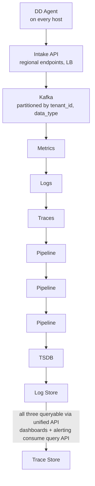
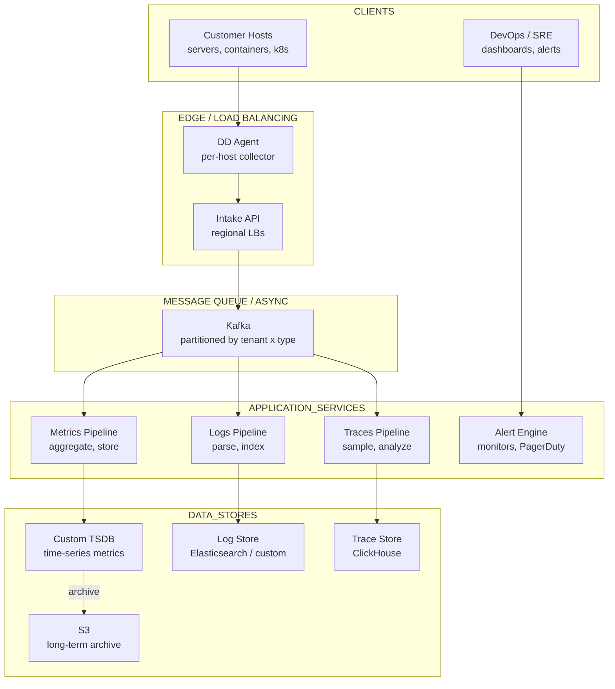

# Design: Datadog
*Worked Example -- 75 min*

---

## Phase 1: Clarify the Problem & Scope *(5--7 min)*

> **Say:** "We're designing a cloud monitoring and observability platform. It ingests three pillars of observability data -- metrics, logs, and traces -- from customers' infrastructure. Users build dashboards, set alerts, and search logs to debug production issues."

### Questions I'd Ask

- **What outcome are we optimizing for?** *-- Customer Mean Time to Detect (MTTD) and Mean Time to Resolve (MTTR). Datadog exists to make incidents shorter. This means: ingestion lag must be minimal (stale data = late alerts = longer MTTD), dashboards must load fast (slow dashboards = slower diagnosis = longer MTTR), and alerts must be reliable (false positive fatigue -- engineers ignore alerts -- longer MTTD). The architecture optimizes for FRESHNESS and QUERYABILITY of observability data.*
- **Which pillars?** *-- Three pillars of observability: metrics (time-series numerical data), logs (unstructured text events), traces (distributed request tracking). Each has fundamentally different storage and query patterns.*
- **Multi-tenant?** *-- Yes, thousands of customers sharing infrastructure. Noisy-neighbor isolation is critical -- one customer's traffic spike can't degrade another's dashboards.*

### Agreed Scope

| In Scope | Out of Scope |
|---|---|
| Metrics ingestion & time-series storage | APM / distributed tracing deep dive |
| Log aggregation & search | Synthetics / browser testing |
| Dashboards & visualization | Security monitoring (SIEM) |
| Alerting & notification | CI/CD integration |
| Agent-based collection | Network monitoring |

### Non-Functional Requirements

- **Ingestion latency <30s** -- metric data points should be queryable within 30 seconds of emission.
- **MASSIVELY write-heavy** -- millions of data points per second. Writes dominate reads 100:1.
- **Multi-tenant** -- thousands of customers sharing infrastructure. Strict tenant isolation. Noisy neighbor prevention.
- **Alerting must be reliable** -- missing an alert during an outage is the worst possible failure. Alert evaluation must be near-real-time (<60s latency).
- **Query flexibility** -- users query by arbitrary tag combinations: `avg(cpu.usage){env:prod, service:api, region:us-east}`. Tags are high-cardinality.
- **Retention tiering** -- full resolution for 15 days, downsampled for 15 months, aggregated for 5 years.

> **Tip:** The defining tension: ingestion must handle millions of data points/sec (write-optimized, append-only), while queries need sub-second aggregation across arbitrary tag combinations (read-optimized, indexed). Time-series databases exist specifically to resolve this tension.

---

## Phase 2: Back-of-the-Envelope Estimation *(3--5 min)*

| Metric | Value | Detail |
|---|---|---|
| **Metric Data Points / Sec** | **~10M** | 50K customers x avg 200 hosts x ~1000 metrics/host / 10s interval |
| **Unique Time Series** | **~1B** | Each unique {metric_name + tag_set} = one series. High cardinality. |
| **Metrics Storage / Day** | **~8 TB** | 10M pts/sec x 86,400 sec x 8 bytes/point (compressed) |
| **Log Events / Sec** | **~5M** | Avg 1KB per log line -- ~5 GB/sec -- ~430 TB/day raw |
| **Dashboard Queries / Sec** | **~50K** | Each dashboard has ~20 widgets, each widget = 1 query. ~2,500 dashboards viewed/sec. |
| **Active Alerts** | **~5M** | 50K customers x avg 100 alert rules. Each evaluated every 30-60s. |

> **Decision:** **Key insight #1:** 10M metric writes/sec is the primary throughput challenge. This requires a purpose-built time-series storage engine -- no general-purpose DB can handle this.

> **Decision:** **Key insight #2:** 5M alert evaluations every 30-60s = ~100K-170K queries/sec just for alerting. This is MORE traffic than user dashboards. The alerting engine is a bigger consumer of the query tier than humans are.

> **Decision:** **Key insight #3:** Logs at 430 TB/day dwarf metrics in raw volume. Different storage strategy needed (append-only, columnar, compressed, full-text indexed).

---

## Phase 3: High-Level Design *(8--12 min)*

### Key Architecture Decisions

> **Say:** "Here's WHY I chose each technology -- mapping requirements to tradeoffs. Every choice has a rejected alternative and a consequence."

| Requirement | Decision | Why (and what was rejected) | Consistency |
|---|---|---|---|
| Millions of metrics/sec across thousands of tenants | Custom TSDB (not Prometheus/InfluxDB) | Multi-tenant by design. Per-tenant quotas, dynamic tag cardinality, pre-aggregation at write. Single-tenant tools (Prometheus) can't do per-tenant isolation. | -- |
| Metrics, logs, and traces are different workloads | Independent pipelines per data type | Metrics pipeline scales independently from logs pipeline. A log volume spike doesn't affect metrics latency. Shared pipeline would create noisy neighbor issues. | -- |
| Noisy neighbor isolation | Per-tenant rate limits + quotas at every layer | Ingestion (Kafka partitioned by tenant_id), processing (per-tenant CPU quotas), query (per-tenant concurrency limits). One customer can't degrade service for others. | -- |
| 15-month metric retention | Pre-aggregation rollups: 1s -- 10s -- 60s -- 5m | Raw 1s data for recent queries. Rolled up to 5m for old data. 300x storage reduction over 15 months. | -- |
| Logs: full-text search + structured queries | Custom columnar log store (not Elasticsearch) | Columnar compression 10x better than ES for structured logs. Full-text index for search. ES struggles at Datadog's ingestion volume. | -- |

### Unified Ingestion Pipeline



### High-Level Architecture



#### DD Agent [EDGE]
- Runs on every customer host
- Collects OS/container/app metrics
- Tails log files, forwards
- Batches + compresses for efficiency

#### Intake API [INGESTION]
- Regional endpoints (US, EU, AP)
- AuthN via API key
- Rate limiting per tenant
- Route: metrics -- Kafka topic, logs -- Kafka topic

#### Metrics TSDB [HOT PATH]
- Custom time-series engine
- Inverted index on tags
- Columnar, compressed storage
- Rollup / downsampling

#### Log Store [VOLUME]
- Full-text search + structured fields
- 430 TB/day ingestion
- ClickHouse or custom columnar

#### Alerting Engine [CRITICAL]
- Evaluates 5M rules every 30-60s
- Queries TSDB, evaluates threshold
- Sends PagerDuty, Slack, email

#### Dashboard Service [READ]
- Users compose dashboards with widgets
- Each widget = a TSDB query
- Auto-refresh every 30s

---

## Phase 4: Deep Dives *(25--30 min)*

### Deep Dive 1: Metrics Ingestion & TSDB (~12 min)

> **Goal:** The core challenge: Ingest 10M data points/sec with arbitrary tag combinations, store for 15 days at full resolution, and query with sub-second aggregation across any tag filter.

```sql
-- Metric Data Point --
{
  metric: "cpu.usage",
  value: 72.5,
  timestamp: 1707890400,
  tags: {
    host: "web-prod-42",
    env: "production",
    service: "api-gateway",
    region: "us-east-1",
    container_id: "abc123"   // high cardinality!
  },
  tenant_id: "customer_xyz"
}

-- Unique time series = metric_name x unique tag_set
-- "cpu.usage{host=web-42,env=prod}" is ONE time series
-- A customer with 1000 hosts x 500 metrics = 500K unique series
```

**TSDB Architecture (inspired by Gorilla + Prometheus)**

- **Write path:** Kafka -- Metrics Consumer -- writes to in-memory buffer (WAL-backed). When buffer fills (every 2 hours), flush to compressed on-disk block. Each block: sorted by series ID, delta-of-delta timestamp encoding, XOR float compression. Achieves ~1.4 bytes/data point.
- **Tag index:** Inverted index mapping tag-value -- set of series IDs. `env:prod -> {series_1, series_5, series_99, ...}`. Stored alongside TSDB blocks. Enables fast filter: "give me all series where env=prod AND service=api".
- **Query path:** Parse query -- resolve tag filters via inverted index -- fetch matching series' data blocks -- decompress -- aggregate (avg, sum, max, p99) over requested time range -- return.
- **Sharding:** By tenant_id + metric_name hash. Each shard handles a subset of time series. Replicated for HA.

> **Decision:** **Why custom TSDB over InfluxDB/TimescaleDB?** At 10M pts/sec across 1B unique series, off-the-shelf TSDBs hit limits in ingestion throughput and tag cardinality. A custom engine (like Datadog's actual backend, or VictoriaMetrics/Thanos-style) gives control over compression, indexing, and multi-tenancy. Tradeoff: massive engineering investment. In an interview, acknowledge this and say "at smaller scale, I'd use InfluxDB or TimescaleDB."

**Retention & Downsampling**

- **0--15 days:** Full resolution (10s intervals). Stored in hot tier (SSD).
- **15 days--15 months:** Downsampled to 5-min intervals. Background job aggregates (avg, min, max, count, sum). Stored in warm tier (HDD/S3).
- **15 months--5 years:** 1-hour intervals. Cold tier (S3).
- Downsampling reduces storage by ~30x for the 15d-15mo tier and another 12x for the 15mo-5y tier.

### Deep Dive 2: Log Aggregation (~8 min)

> **Goal:** The core challenge: Ingest 5M log events/sec (430 TB/day), enable full-text search and structured field filtering, and return results in <5 seconds even over large time ranges.

- **Ingestion:** Kafka -- Log Pipeline -- parse structured fields (JSON, key-value) -- extract log level, service, timestamp -- index -- store.
- **Processing:** Log Pipeline applies customer-defined processing rules: grok parsing (extract fields from unstructured logs), remapping attributes, filtering (drop debug-level logs to save cost), enrichment (add geo data from IP).
- **Storage:** ClickHouse (columnar, compressed). Each log line stored with: timestamp, message (full text), parsed attributes (service, level, host, etc.), tenant_id. Partitioned by day and tenant. Full-text indexed on the message field.
- **Query:** Hybrid: structured field filters (ClickHouse columnar scan) + full-text search (inverted index on message). The combination is what makes log search powerful: `service:api-gateway level:error "timeout exceeded"`.

> **Decision:** **Why ClickHouse for logs over Elasticsearch?** At 430 TB/day, Elasticsearch's indexing overhead becomes prohibitively expensive (RAM for inverted indexes, JVM GC pressure). ClickHouse ingests at higher throughput with lower resource usage due to columnar compression. Tradeoff: ClickHouse's full-text search is less mature than ES's, so we build a lightweight inverted index (bloom filters per column partition) on top. For customers who need heavy full-text search, consider a hybrid with ES for a smaller retention window.

### Deep Dive 3: Alerting Engine (~5 min)

> **Goal:** The core challenge: Evaluate 5M alert rules every 30-60s. Each rule = a TSDB query + threshold condition. Missing an alert during a customer's outage is catastrophic for our business.

- **Architecture:** Alert rules are distributed across a fleet of alert evaluator workers. Each worker owns a partition of rules (sharded by tenant_id). Every 30s, each worker evaluates its rules by querying the TSDB.
- **Evaluation:** Rule: `avg(cpu.usage){env:prod} > 90% for 5 min`. Worker queries TSDB for the last 5 min of data, computes avg, compares to threshold. If breached -- fire alert. If recovered -- resolve alert.
- **State management:** Each alert has state: OK, WARN, ALERT, NO_DATA. State transitions stored in PostgreSQL. Prevents duplicate notifications (only notify on state change).
- **Notification:** On state change -- publish to notification queue -- fan-out to configured channels: PagerDuty, Slack, email, webhook. Retry on failure.

> **Decision:** **Why not stream processing (Flink) for alerting?** Streaming would give lower latency (process each data point as it arrives). But 5M rules x 10M data points/sec creates an explosion of evaluations. Batch evaluation every 30s is more efficient -- one query covers all data points in the window. Tradeoff: worst-case 30s alerting latency, which is acceptable for most use cases. For ultra-low-latency alerting (<5s), offer a premium tier that uses stream processing for a subset of rules.

### Deep Dive 4: Data Model & Storage Summary

| Data | Store | Scale | Access Pattern |
|---|---|---|---|
| Metrics (hot) | Custom TSDB (SSD) | 10M pts/sec write, 1B series, 15d retention | Write-heavy, aggregation queries by tags |
| Metrics (warm/cold) | S3 + query engine | Downsampled. Years of retention. | Read-only historical queries |
| Logs | ClickHouse | 5M events/sec, 430 TB/day | Full-text search + structured filters |
| Alert Rules & State | PostgreSQL | 5M rules. Low write frequency. | Read rules for evaluation, write state changes |
| Dashboard Definitions | PostgreSQL | ~1M dashboards. User-configured. | CRUD by user. Read on page load. |
| Ingestion Buffer | Kafka | 10M+ events/sec combined | Decouple agents from storage. Absorb spikes. |
| Tenant Metadata | PostgreSQL + cache | 50K tenants. API keys, rate limits, config. | Read at auth time. Cached. |

---

## Phase 5: Cross-Cutting Concerns *(10--12 min)*

### Multi-Tenancy & Noisy Neighbor

- **Per-tenant rate limiting:** At the Intake API, enforce ingestion limits per API key. Excess data -- queued, then dropped with warning.
- **Query isolation:** All queries include tenant_id in the filter. TSDB sharding by tenant ensures one customer's heavy query doesn't starve others.
- **Fair scheduling:** Alert evaluator and query engine use per-tenant quotas. Large tenants get proportionally more resources but can't monopolize.

### Storage Architecture Summary

> **Goal:** What goes where and why. Each data store is chosen for its access pattern -- not by default. The question isn't "which database?" but "what are the read/write patterns, consistency requirements, and scale characteristics?"

| Data | Store | Why This Store |
|---|---|---|
| Metrics (time-series) | Custom TSDB | Purpose-built for high cardinality. Tag-based indexing. Rollup: 1s -- 10s -- 60s -- 5m over retention. |
| Logs | Custom log store | Columnar storage with full-text index. Retention tiers: online (15 days) -- archive (S3, years). |
| Traces (APM) | ClickHouse | Distributed traces with spans. Sampled at ingestion (keep 100% of errors, sample OK traces). |
| Alert state | PostgreSQL | Monitor definitions, alert history, notification routing. Transactional for state machine. |
| Long-term archive | S3 | Metrics, logs, and traces archived for compliance. Rehydratable on demand. |
| Ingestion pipeline | Kafka | Partitioned by {tenant_id, data_type}. Decouples intake from processing. Backpressure handling. |

### Failure Scenarios

| Scenario | Mitigation |
|---|---|
| TSDB shard down | Replica takes over reads. WAL replayed on recovery. Ingestion buffered in Kafka (hours of retention). Metrics delayed but not lost. |
| Kafka partition lag | Consumers behind -- metrics delayed. Alerts may evaluate stale data -- better to alert on stale data than not alert at all. Dashboard shows "data may be delayed" warning. |
| Customer sends 100x normal volume | Rate limiter at Intake API caps ingestion. Excess dropped. Customer notified. Other tenants unaffected. |
| Alert evaluator fleet overloaded | Alert evaluation falls behind schedule. PRIORITY: critical alerts evaluated first. Best-effort for info/warning severity. Auto-scale evaluator fleet. |

### Security & Access Control

> **Decision:** Multi-tenant isolation is the primary security concern: thousands of customers share infrastructure, and a metric from Company A must never be visible to Company B. Isolation is enforced at every layer: (1) Kafka partitions include tenant_id -- consumers only read their tenant's partitions, (2) TSDB queries inject tenant_id as a mandatory filter (enforced at the query engine level, not the application), (3) API keys are scoped to a specific org -- an API key can only submit data to and query from its org, (4) customer data can be configured to stay in specific regions (EU-only for GDPR). The Datadog Agent running on customer hosts is open-source and auditable -- customers can verify it only sends the metrics they configure. For enterprise customers: SAML SSO, audit logs of all query access, and RBAC on dashboards/monitors (an SRE can see infrastructure metrics but not application-level PII in logs). SOC 2 Type II and HIPAA BAA available. Data retention policies are configurable per customer.

### Scalability

> **Tip:** Datadog ingests millions of data points per second across all tenants. The key scaling patterns: (1) Kafka-first architecture: all data hits Kafka before any processing, providing a durable buffer that absorbs traffic spikes. Partitioning by tenant_id ensures tenant data is processed in-order. (2) Horizontal pipeline scaling: metrics, logs, and traces have independent processing pipelines that scale independently. A customer sending 10x more logs doesn't affect metrics pipeline performance. (3) Multi-tenant storage: the custom TSDB is designed for high cardinality (millions of unique tag combinations per tenant). Metrics are pre-aggregated at ingestion: raw 1-second data points are rolled up to 10s, then 60s, then 5m as they age, reducing storage 300x over 15 months. (4) Query scaling: dashboards often have 50+ widgets, each a separate query. These are parallelized across the TSDB cluster. The noisy neighbor problem is addressed via per-tenant query quotas -- a single customer running an expensive query can't slow down the cluster for others.

### Monitoring & SLOs

> **Tip:** Key SLOs: metrics queryable within 30 seconds of emission (ingestion freshness), dashboard render time p95 <2s, alert evaluation lag <60 seconds. Per-tenant health monitoring: each customer has a health score based on ingestion rate, query error rate, and alert trigger reliability. Anomaly detection on ingestion volume -- if a customer's metric volume drops 50% unexpectedly, a system health alert fires (possible agent misconfiguration). Internal dogfooding: Datadog monitors itself with Datadog -- every internal service emits metrics and traces through the same pipeline. Incident management: automated runbooks for common failures (Kafka consumer lag, TSDB compaction storms, query timeout spikes). Error budget tracked per service.

---

## Phase 6: Wrap-Up & Evolution *(3--5 min)*

> **Say:** "This system is defined by WRITE-HEAVY ingestion across three distinct data types -- metrics, logs, traces -- each with different storage and query characteristics. The architecture unifies ingestion through Kafka, then splits into specialized storage engines: a custom TSDB for metrics (optimized for tag-based aggregation), ClickHouse for logs (optimized for columnar scan + text search), and the alerting engine as the most critical consumer -- evaluating 5M rules every 30s against the TSDB. Multi-tenancy is enforced at every layer through rate limiting, query isolation, and fair scheduling."

| Extension | Architecture Impact |
|---|---|
| APM / Distributed Tracing | Third storage backend optimized for trace spans. Span -- trace assembly. Service dependency map derived from trace data. |
| Anomaly Detection | ML models trained per time series. Run alongside alerting engine. Detect deviations without user-configured thresholds. |
| Log-to-Metrics | Generate metric time series from log patterns (e.g., count ERROR logs per service). Reduces log storage costs while preserving signal. |
| Notebooks / Investigations | Collaborative debugging tool. Combines metrics, logs, traces in a single timeline. Reads from all three storage backends. |

> **Tip:** **Closing framing:** Datadog is defined by the tension between write-optimized ingestion (append-only, high throughput, multi-tenant) and read-optimized querying (arbitrary tag filtering, aggregation, sub-second response). The TSDB resolves this with an inverted tag index (for reads) combined with columnar, compressed storage (for write throughput). The alerting engine -- not humans -- is the system's biggest query consumer.

---

## Phase 7: Interview Q&A *(Practice)*

> **Say:** "Here are the hardest questions an interviewer would ask about this design, and how to answer them. Each answer demonstrates deep understanding of the tradeoffs, not just surface knowledge."

**Q:** Why build a custom TSDB instead of using Prometheus or InfluxDB?

**A:** Scale and multi-tenancy. Prometheus is designed for single-tenant, pull-based monitoring. It works beautifully for one organization's metrics, but it doesn't have: (1) multi-tenant isolation with per-tenant quotas, (2) push-based ingestion at millions of points/second across thousands of tenants, (3) dynamic tag-based queries across arbitrary time ranges (Prometheus PromQL is great but the storage engine struggles above ~10M active time series). InfluxDB has similar single-tenant limitations. Datadog's custom TSDB is optimized for: high cardinality (millions of unique tag combinations), multi-tenant storage with per-tenant compaction, pre-aggregation at write time (reducing query-time work), and configurable retention tiers. The tradeoff: building a custom TSDB is a massive engineering investment (team of 50+ engineers). It only makes sense at Datadog's scale (trillions of data points). For smaller deployments, Prometheus or InfluxDB are the right choice.

**Q:** How do you handle the noisy neighbor problem in a multi-tenant system?

**A:** At every layer with isolation mechanisms. Ingestion: per-tenant rate limits on the Intake API -- if a customer suddenly sends 10x their normal volume, excess data is buffered in Kafka (not dropped) but processed at a throttled rate. This prevents one tenant's spike from consuming all Kafka consumer capacity. Processing: per-tenant resource quotas in the pipeline workers -- each tenant gets a fair share of CPU/memory. If tenant A's custom log parsing rules are expensive, it slows down tenant A's processing, not tenant B's. Query: per-tenant query concurrency limits and execution time limits. A dashboard with 100 widgets (each a query) from one customer doesn't monopolize the TSDB query workers. Alert evaluation: monitors are distributed across an evaluation cluster -- each evaluator handles a fixed number of monitors, and monitors from different tenants are interleaved to prevent hotspots. The key insight: noisy neighbor is not one problem but many problems at different layers, each requiring its own isolation mechanism.
