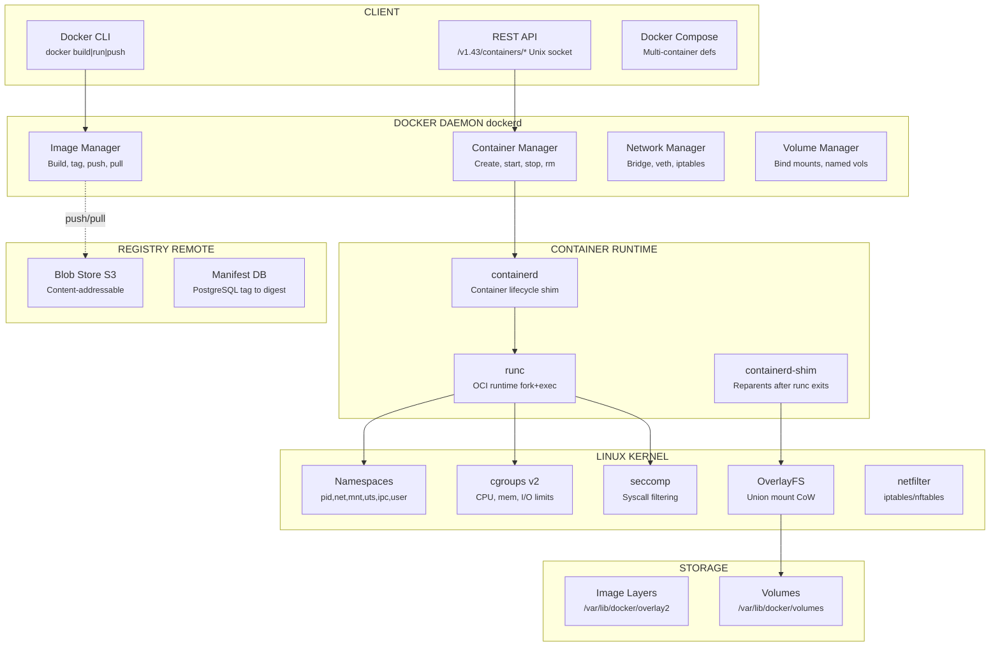
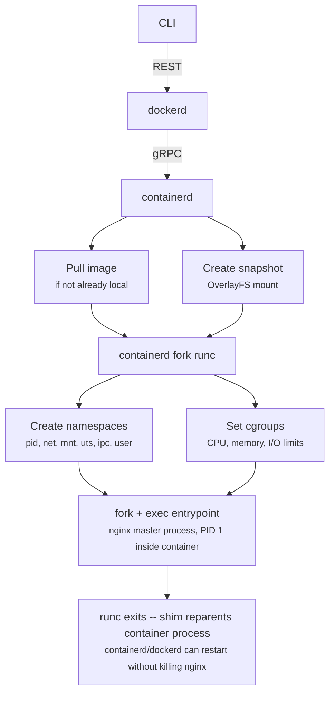
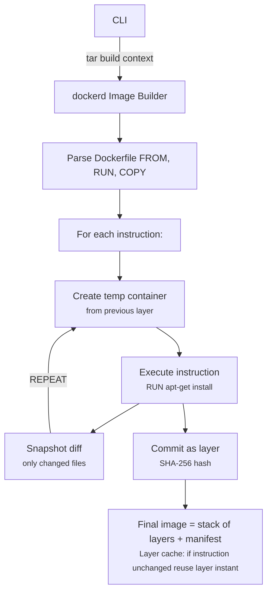
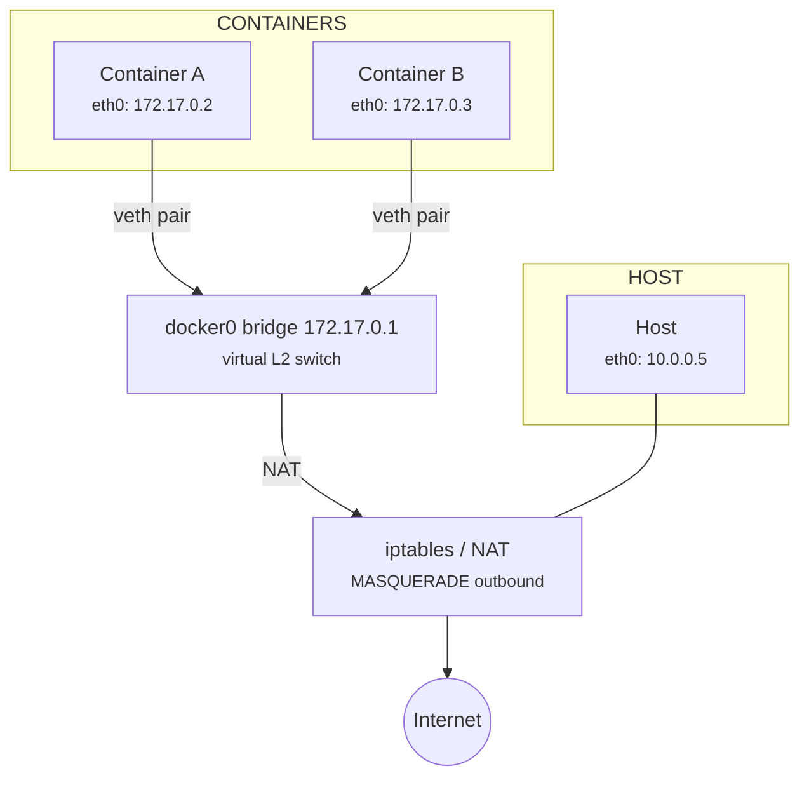
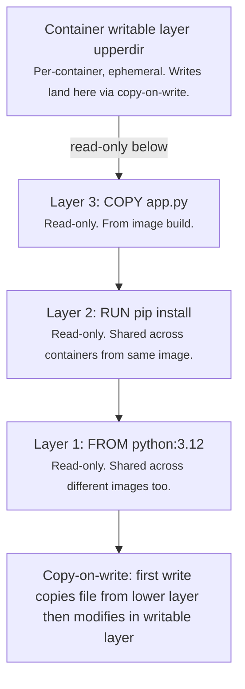

# Design: Docker

> Worked Example -- 75 min

---

## Phase 1: Clarify the Problem & Scope *(5--7 min)*

> **Say:** "We're designing a container platform like Docker -- the system that builds, distributes, and runs containers. That spans three distinct subsystems: a runtime that isolates and executes processes, a registry that stores and distributes images, and a CLI/API that ties them together. Let me scope this."

### Questions I'd Ask

- **Single-host or orchestrated?** Just `docker run` on one machine, or multi-host orchestration (Swarm/K8s)? *-- Focus on single-host runtime + registry. Mention orchestration as evolution.*
- **Build, ship, or run -- all three?** *-- All three: docker build (image creation), docker push/pull (registry), docker run (container lifecycle).*
- **Container type?** Linux containers (namespaces/cgroups), Windows containers, or VMs? *-- Linux containers. The core isolation primitives.*
- **Registry: self-hosted (Docker Registry) or cloud (Docker Hub)?** *-- Design both: the storage backend and the distribution protocol.*
- **Security model?** Root vs rootless, image signing, vulnerability scanning? *-- In scope: namespace isolation, image trust. Out of scope: deep CVE scanning.*
- **Scale?** How many images, how many running containers per host? *-- Registry: millions of images, billions of pulls/day. Runtime: ~100-500 containers per host.*

### Agreed Scope

| In Scope | Out of Scope |
|----------|-------------|
| Container runtime (create, start, stop, exec) | Multi-host orchestration (Kubernetes) |
| Image building (Dockerfile -> image) | CI/CD pipeline integration |
| Image registry (push, pull, storage) | CVE / vulnerability scanning |
| Container networking (bridge, host, overlay basics) | Service mesh (Istio, Linkerd) |
| Storage: volumes, layers, copy-on-write | Windows containers |
| Security: namespaces, cgroups, seccomp, image trust | Kubernetes CRI integration details |

### Core Use Cases

- **UC1: docker build** -- Developer writes a Dockerfile -> system produces an immutable, layered image
- **UC2: docker push / pull** -- Image is uploaded to a registry and distributed to any host
- **UC3: docker run** -- Host creates an isolated process with its own filesystem, network, and resource limits
- **UC4: docker exec** -- Attach to a running container for debugging
- **UC5: docker stop / rm** -- Graceful shutdown with SIGTERM -> SIGKILL, cleanup resources

### Non-Functional Requirements

- **Container startup <1 second:** Containers must start near-instantly compared to VMs (minutes). This is the core value proposition -- lightweight process isolation.
- **Image layer deduplication:** 1000 containers sharing the same base image (Ubuntu 22.04) should NOT store 1000 copies. Copy-on-write (CoW) filesystem is essential.
- **Hard isolation between containers:** A compromised container must NOT be able to access another container's filesystem, network, or processes. Security boundary = defense in depth.
- **Registry pull latency:** Cold pull of a 500MB image should complete in <30 seconds. Incremental pull (only missing layers) in <5 seconds.
- **Registry availability:** If the registry is down, already-pulled images can still run. Registry is on the critical path for deployment, not for runtime.
- **Resource limits must be enforced:** A container configured for 512MB RAM must be OOM-killed if it exceeds this. No noisy neighbor -- cgroups must be hard limits.

> **Tip:** The key architectural insight: Docker is NOT a virtual machine. It's process isolation using Linux kernel primitives (namespaces for isolation, cgroups for resource limits, union filesystems for layered storage). The container IS a Linux process -- just one that thinks it's the only process on the machine.

---

## Phase 2: Back-of-the-Envelope Estimation *(3--5 min)*

> **Say:** "Let me estimate the scale for both the runtime (per-host) and the registry (global)."

| Metric | Value | Detail |
|--------|-------|--------|
| Containers / Host | **100--500** | K8s node: 110 pods default max. Dense hosting: 500+ |
| Container Startup | **<500ms** | Create namespace + cgroup + mount layers + exec. No kernel boot. |
| Image Size (avg) | **~200 MB** | Alpine: 5MB, Ubuntu: 80MB, Python app: 300MB, Java: 500MB+ |
| Image Layers (avg) | **~8-15 layers** | Base OS + package install + app copy + entrypoint |
| Registry: Total Images | **~15M+ repos** | Docker Hub: 15M+ repositories, billions of tags |
| Registry: Pulls / Day | **~1B+** | Docker Hub: billions of pulls/day. CI/CD drives majority. |

> **Decision:** **Key insight #1:** The copy-on-write filesystem is what makes Docker practical. 500 containers from the same image share ONE copy of the base layers on disk. Without CoW, 500 containers x 200MB = 100GB. With CoW: 200MB shared + 500 x ~5MB writable layers = ~2.7GB. A 37x storage reduction.

> **Decision:** **Key insight #2:** Registry bandwidth dominates cost. A 200MB image pulled 1B times/day = 200 PB/day of transfer. Content-addressable storage + CDN + layer deduplication are essential -- most pulls share 80% of layers with an existing local image.

> **Decision:** **Key insight #3:** Container startup is fast because there's NO OS boot. The kernel is already running (it's the host kernel). We're just creating a new process with isolated namespaces. Compare: VM boot (30-60 seconds, boot kernel) vs container start (<1 second, fork + exec).

---

## Phase 3: High-Level Design *(8--12 min)*

> **Say:** "Docker has three planes: the CLI/API client, the daemon that manages containers on a single host, and the registry that stores and distributes images. Let me walk through each."

### Key Architecture Decisions

> **Say:** "Here's WHY I chose each technology -- mapping requirements to tradeoffs. Every choice has a rejected alternative and a consequence."

| Requirement | Decision | Why (and what was rejected) | Consistency |
|-------------|----------|----------------------------|-------------|
| Sub-second container start | Linux namespaces + cgroups (not VMs) | No kernel boot. Process isolation via kernel primitives. VMs require hypervisor + guest OS boot (30-60s). Trade: weaker isolation (shared kernel). | -- |
| 500 containers share one base image | OverlayFS (copy-on-write layers) | Layers are immutable and shared. Only writes create new data. AUFS is legacy, devicemapper is slow on metadata. OverlayFS is mainline kernel. | -- |
| Image identity must be tamper-proof | Content-addressable storage (SHA-256) | Image ID = hash of content. Changing 1 byte changes the hash. Tag-based identity is mutable ("latest" can point to anything). Hash-based is immutable. | CP |
| Registry must serve billions of pulls/day | Blob storage (S3) + CDN + layer dedup | Layers stored once in S3 regardless of how many images reference them. CDN caches popular layers at edge. DB-stored blobs can't scale to petabytes. | AP |
| Containers need isolated networking | Network namespaces + veth pairs + bridge | Each container gets its own IP, routing table, iptables. Bridge connects containers on same host. Shared host networking leaks isolation. | -- |
| Resource limits must be hard (no noisy neighbor) | cgroups v2 for CPU, memory, I/O | Kernel-enforced limits. OOM killer fires if memory exceeded. CPU shares for fair scheduling. Userspace enforcement is bypassable. | -- |

### Major Components



#### Docker CLI [CLIENT]
- Parses commands, sends REST calls to daemon via Unix socket
- Handles build context (tar + send to daemon)
- Streams logs, attach, exec via HTTP hijack

#### Docker Daemon (dockerd) [DAEMON]
- REST API server on Unix socket /var/run/docker.sock
- Manages images, containers, networks, volumes
- Delegates container lifecycle to containerd

#### containerd [RUNTIME]
- Container lifecycle management (create, start, stop)
- Image pull, unpack, snapshot management
- gRPC API -- Kubernetes CRI-compatible

#### runc [OCI RUNTIME]
- Creates namespaces, cgroups, mounts
- Forks container init process, then exits
- OCI Runtime Spec compliant (replaceable: crun, gVisor, Kata)

#### containerd-shim [SHIM]
- Reparents container process after runc exits
- Keeps STDIO open for logs and exec
- Allows containerd/dockerd restart without killing containers

#### Registry [DISTRIBUTION]
- OCI Distribution Spec: manifest + blob storage
- Content-addressable: blobs keyed by SHA-256
- S3 backend for blobs, PostgreSQL for tag->digest mapping

### Flow 1: docker run nginx (the happy path)



### Flow 2: docker build (Dockerfile to Image)



---

## Phase 4: Deep Dives *(25--30 min)*

### Deep Dive 1: Container Runtime -- Linux Primitives (~12 min)

> **Goal:** **The core question: How does a container actually work?** A container is NOT a VM. It's a regular Linux process that's been isolated using kernel features. Three primitives make it work: namespaces (isolation), cgroups (resource limits), and union filesystems (layered storage).

| Namespace | What It Isolates | Why It Matters |
|-----------|-----------------|----------------|
| PID | Process tree | Container sees only its own processes. PID 1 inside = entrypoint. Host PID might be 48291. |
| NET | Network stack | Container gets its own IP, routing table, iptables. Can't see host interfaces. |
| MNT | Filesystem mounts | Container has its own root filesystem (from image layers). Can't see host /etc/passwd. |
| UTS | Hostname | Container has its own hostname. `hostname` returns container ID, not host. |
| IPC | System V IPC, POSIX MQ | Shared memory segments are per-container. Prevents cross-container IPC leakage. |
| USER | UID/GID mapping | Root inside container (UID 0) maps to unprivileged user on host (UID 100000). Rootless containers. |

> **Decision:** **Why not VMs?** VMs provide stronger isolation (hardware-level via hypervisor) but at massive cost: each VM boots a full kernel (30-60s), consumes 200MB+ RAM for the guest OS, and can't share filesystem layers. Containers trade some isolation (shared kernel) for speed (<1s start), density (500 per host vs 50 VMs), and efficiency (shared base layers). For multi-tenant isolation where tenants don't trust each other, VMs are still better (or gVisor/Kata Containers which use a lightweight VM per container).

> **Tip:** The `docker exec` command works by calling `setns()` to join an existing container's namespaces. It doesn't create a new container -- it attaches a new process to the same isolation boundary. This is why exec'd processes see the same filesystem and network as the container's main process.

```sql
-- Container creation pseudocode (what runc does)

fn create_container(config: OCI_Spec) {
  -- 1. Create namespaces
  pid_ns  = unshare(CLONE_NEWPID);
  net_ns  = unshare(CLONE_NEWNET);
  mnt_ns  = unshare(CLONE_NEWNS);
  uts_ns  = unshare(CLONE_NEWUTS);
  ipc_ns  = unshare(CLONE_NEWIPC);
  user_ns = unshare(CLONE_NEWUSER);

  -- 2. Set cgroup limits
  cgroup = create_cgroup("/sys/fs/cgroup/docker/{container_id}");
  write(cgroup + "/memory.max", config.memory_limit);  -- e.g., "512m"
  write(cgroup + "/cpu.max", config.cpu_quota);         -- e.g., "100000 100000" = 1 CPU

  -- 3. Mount filesystem (OverlayFS)
  mount("overlay", rootfs, "overlay",
    lowerdir=image_layers,   -- read-only, shared
    upperdir=container_rw,   -- per-container writable layer
    workdir=work_dir);

  -- 4. Apply security profiles
  apply_seccomp(config.seccomp_profile);  -- block dangerous syscalls
  apply_apparmor(config.apparmor_profile);
  drop_capabilities(config.cap_drop);     -- e.g., drop CAP_SYS_ADMIN

  -- 5. Fork and exec entrypoint
  child = fork();
  if child == 0 {
    exec(config.entrypoint, config.args);  -- becomes PID 1 inside container
  }
  -- runc exits. containerd-shim becomes parent of the container process.
}
```

### Deep Dive 2: Image Build & Registry (~10 min)

> **Goal:** **Images are the distribution unit.** An image is a stack of read-only layers, each representing a Dockerfile instruction. The content-addressable storage model (every blob keyed by SHA-256) enables deduplication, integrity verification, and efficient distribution.

| Concept | What It Is | Key Property |
|---------|-----------|--------------|
| Layer | Filesystem diff (tar.gz) from one instruction | Immutable, content-addressed (SHA-256). Shared across images. |
| Image Manifest | JSON listing layer digests + config | The "recipe" -- tells the runtime which layers to stack in what order. |
| Image Config | JSON with env vars, entrypoint, exposed ports | Runtime metadata. Not a layer -- doesn't contain filesystem data. |
| Tag | Human-readable pointer (e.g., "nginx:1.25") | MUTABLE -- "latest" can point to different digests over time. Not trustworthy for pinning. |
| Digest | SHA-256 of the manifest (e.g., sha256:abc123...) | IMMUTABLE -- changing 1 byte changes the digest. Use for production pinning. |

> **Decision:** **Why content-addressable storage?** If two Dockerfiles both start with `FROM ubuntu:22.04`, the Ubuntu base layer is stored ONCE in the registry, regardless of how many images reference it. The layer's address IS its content hash -- deduplication is automatic. This is what makes Docker Hub viable: billions of pulls but most are fetching layers that are already locally cached. A `docker pull` first downloads the manifest (small JSON), then checks each layer against the local store. Only missing layers are downloaded.

```json
// Image manifest structure (OCI Image Spec)
{
  "schemaVersion": 2,
  "mediaType": "application/vnd.oci.image.manifest.v1+json",
  "config": {
    "digest": "sha256:a1b2c3...",
    "size": 7023
  },
  "layers": [
    { "digest": "sha256:d4e5f6...", "size": 32654321 },
    { "digest": "sha256:g7h8i9...", "size": 1847291 },
    { "digest": "sha256:j0k1l2...", "size": 4521 }
  ]
}
```

> **Decision:** **Build cache is layer-granular.** When rebuilding an image, Docker checks: "has this instruction changed?" If `RUN apt-get install nginx` hasn't changed AND its parent layer is the same, the cached layer is reused. This is why Dockerfiles should order instructions by change frequency: base OS first (changes rarely), dependencies next (changes weekly), application code last (changes every commit). A well-ordered Dockerfile rebuilds in seconds because only the final COPY layer is new.

### Deep Dive 3: Container Networking (~8 min)

> **Goal:** **Each container needs an isolated network that can still communicate with the outside world.** Docker creates a virtual Ethernet pair (veth) -- one end inside the container's network namespace, one end on the host's bridge. The bridge acts like a virtual switch connecting all containers.



| Network Mode | How It Works | Use Case |
|-------------|-------------|----------|
| bridge (default) | Container on docker0 bridge, NAT to host. Each gets 172.17.0.x IP. | Standard isolation. Containers communicate via bridge, reach internet via NAT. |
| host | No network namespace. Container shares host's network stack directly. | Maximum network performance (no NAT overhead). Zero isolation. |
| none | No networking. Only loopback interface. | Batch processing, security-sensitive workloads that should never access network. |
| overlay | VXLAN tunnels between hosts. Containers on different hosts get same virtual network. | Docker Swarm / multi-host networking. Containers on different machines communicate as if local. |
| macvlan | Container gets its own MAC address on physical network. | Legacy apps that need to appear as physical devices on the LAN. |

> **Decision:** **Port mapping (-p 8080:80) uses iptables DNAT.** When you publish a port, Docker adds an iptables rule: traffic hitting host:8080 is destination-NAT'd to container_ip:80. This is why published ports are visible to the entire network (not just localhost). For production, a reverse proxy (Nginx, Traefik) in front is preferred over raw port mapping -- it handles TLS, routing, and load balancing.

### Deep Dive 4: Data Model & Storage (~5 min)

> **Goal:** **OverlayFS is the key innovation.** It stacks multiple read-only layers (from the image) and adds one writable layer on top. Reads fall through layers until the file is found. Writes go to the top layer only (copy-on-write). This means 500 containers from the same image share all base layers -- massive space savings.



> **Decision:** **Why OverlayFS over device-mapper or AUFS?** OverlayFS is in the mainline Linux kernel (since 3.18), requires no special setup, and has the best performance for the Docker workload (many small reads, few writes). AUFS was Docker's original choice but was never merged into mainline (requires a patched kernel). Device-mapper works but has higher metadata overhead and slower container startup for large images. Btrfs and ZFS offer snapshots but require formatting the entire disk. OverlayFS works on any ext4/xfs filesystem -- zero prerequisites.

> **Tip:** **Volumes vs bind mounts:** Container writable layers are EPHEMERAL -- they're deleted with the container. For persistent data (databases, uploads), use volumes. A Docker volume is a directory on the host (`/var/lib/docker/volumes/{name}/_data`) mounted directly into the container, bypassing OverlayFS. This means: (1) I/O goes directly to the host filesystem (no CoW overhead), (2) data survives container deletion, (3) volumes can be shared between containers. Bind mounts are similar but mount an arbitrary host path -- useful for development (mount source code into container).

---

## Phase 5: Cross-Cutting Concerns *(10--12 min)*

### Storage Architecture Summary

> **Goal:** **What goes where and why.** Each data store is chosen for its access pattern -- not by default.

| Data | Store | Why This Store |
|------|-------|---------------|
| Image layers | OverlayFS (/var/lib/docker/overlay2) | Read-only, content-addressed by SHA-256. Shared across containers. Deduped on disk automatically. |
| Container writable layer | OverlayFS (upperdir, per-container) | Ephemeral. Copy-on-write. Deleted with container. Not for persistent data. |
| Volumes | Host filesystem (direct mount) | Persistent data (DBs, uploads). Bypasses OverlayFS for native I/O performance. Survives container lifecycle. |
| Registry blobs | S3 / object storage | Petabyte scale, content-addressed. CDN-friendly. Layer blobs are immutable -- perfect for object storage. |
| Registry metadata | PostgreSQL | Tag -> digest mapping, repository permissions, user accounts. Relational with ACID for tag updates. |
| Container state | JSON on disk + containerd DB (bbolt) | Container config, status, restart policy. Local to host. Low volume -- no distributed DB needed. |

### Failure Scenarios

| Scenario | Mitigation |
|----------|-----------|
| Docker daemon (dockerd) crashes | Containers keep running -- containerd-shim reparented them from dockerd. This is the entire purpose of the shim architecture: daemon restarts (upgrades, crashes) don't kill running containers. Containerd manages lifecycle independently. |
| Container OOM (exceeds memory limit) | Linux OOM killer terminates the container's processes. Cgroup memory.max is a hard limit. Docker reports OOM exit code (137). Restart policy (--restart=on-failure) can auto-restart. Root cause: application memory leak or insufficient limit. |
| Disk full (image layers consume all space) | `docker system prune` removes unused images, containers, networks, and build cache. In production, set storage limits and monitor /var/lib/docker disk usage. Dangling images (untagged) are the biggest offender. |
| Registry unavailable during deploy | Containers already running are unaffected (images are cached locally). New deployments fail. Mitigation: pre-pull images, use local registry mirrors, or Harbor as a pull-through cache. The runtime never phones home to the registry. |
| Container escape (attacker breaks out of namespace) | Defense in depth: (1) seccomp profile blocks dangerous syscalls (300+ blocked by default), (2) AppArmor/SELinux restricts filesystem access, (3) USER namespace maps root to unprivileged host user, (4) drop capabilities (CAP_SYS_ADMIN, CAP_NET_RAW). If all fail, the shared kernel is the weak point -- use gVisor or Kata for untrusted workloads. |
| Image supply chain attack (malicious base image) | Docker Content Trust (DCT) uses Notary for image signing. Only signed images can be pulled when DCT is enabled. Pin images by digest (sha256:...) not tag. Scan images with Trivy/Grype before deployment. Use minimal base images (distroless, Alpine) to reduce attack surface. |

### Security Architecture

> **Decision:** **Security & Access Control.** Container security is defense in depth -- no single layer is sufficient. Namespaces provide visibility isolation (container can't see host processes). Cgroups provide resource isolation (container can't consume all host RAM). Seccomp filters block 300+ dangerous syscalls by default (no kernel module loading, no rebooting, no raw disk access). Capabilities are dropped: even root inside the container can't do most privileged operations. AppArmor/SELinux provides mandatory access control -- a container can only access paths in its profile. The USER namespace maps container root (UID 0) to an unprivileged host user (UID 100000+), so even a container escape lands as a non-root user. For truly untrusted workloads (multi-tenant SaaS), use gVisor (user-space kernel that intercepts syscalls) or Kata Containers (lightweight VM per container) for hardware-level isolation.

### Scalability

> **Tip:** **Scalability.** Per-host scaling: a single Linux host can run 500+ containers with proper resource limits. The bottleneck is typically I/O (OverlayFS metadata for many layers) and network (iptables rules scale O(n) with containers -- at 1000+ containers, use ipvs instead). Memory overhead per container is near-zero (shared kernel, shared image layers) -- only the application's memory footprint matters. Registry scaling: S3 blob storage scales infinitely. The metadata DB (PostgreSQL) is the bottleneck -- sharded by repository namespace. CDN handles read amplification. Docker Hub processes billions of pulls by serving layer blobs directly from CDN edge, with PostgreSQL only handling manifest lookups and authentication.

### Monitoring & SLOs

> **Tip:** **Monitoring & SLOs.** Per-container metrics via cgroups: CPU usage (cpu.stat), memory usage (memory.current vs memory.max), I/O bytes (io.stat), network bytes (from /proc/net/dev inside net namespace). Docker exposes these via the stats API. Key SLOs: container startup p99 <2 seconds, image pull p95 <30 seconds (cold, 500MB), registry availability 99.95%. Alerting: OOM kills (indicates undersized limits or memory leaks), disk usage >80% on /var/lib/docker, container restart loops (CrashLoopBackOff indicates application bugs). For orchestrated environments, cAdvisor exports metrics to Prometheus, and kubelet enforces pod-level resource quotas.

---

## Phase 6: Wrap-Up & Evolution *(3--5 min)*

### What I'd Build Next

- **Multi-host orchestration (Kubernetes):** Scheduling containers across a cluster. Pod abstraction (co-located containers), service discovery, rolling deploys, auto-scaling based on metrics.
- **Image build optimization (BuildKit):** Parallel layer builds (independent RUN commands execute concurrently), cache mounts (reuse pip/npm cache across builds), multi-stage builds to minimize final image size.
- **Rootless containers:** Run the entire Docker daemon as a non-root user. User namespaces map container root to unprivileged host UID. Eliminates the biggest attack vector (Docker socket = root access).
- **WebAssembly (WASM) containers:** WASM runtimes (WasmEdge) as an alternative to Linux containers. Microsecond startup, 1MB memory footprint, sandbox-by-default. Ideal for edge computing and serverless.
- **Image streaming (lazy pulling):** Start the container before the full image is downloaded. Pull layers on-demand as files are accessed (eStargz, Nydus). Reduces cold-start from 30 seconds to <2 seconds for large images.
- **Supply chain security (SBOM + attestation):** Every image includes a Software Bill of Materials listing every package. Signed attestations prove the image was built from a specific commit by a specific CI pipeline. SLSA framework compliance.

> **Say:** "The core Docker design -- namespaces for isolation, cgroups for limits, OverlayFS for layered storage, content-addressable registry for distribution -- has been remarkably stable. The evolution is happening at the edges: better security (rootless, gVisor), faster startup (WASM, lazy pulling), and stronger supply chain guarantees (SBOM, Sigstore)."

---

## Phase 7: Interview Q&A *(Practice)*

> **Say:** "Here are the hardest questions an interviewer would ask about this design, and how to answer them. Each answer demonstrates deep understanding of the tradeoffs, not just surface knowledge."

**Q1: What's the difference between a container and a VM? When would you still choose a VM?**

**A:** A container is a process isolated by kernel namespaces, sharing the host kernel. A VM runs a complete guest kernel on a hypervisor, with hardware-level isolation. Containers win on: startup speed (<1s vs 30-60s), density (500/host vs 50), image size (MBs vs GBs), and resource efficiency (shared kernel, shared base layers). VMs win on: isolation strength (hardware boundary -- a kernel exploit in a container escapes to the host, in a VM it doesn't), running different OSes (Windows on Linux host), and regulatory compliance (some security standards require hardware isolation). The practical rule: containers for your own code running in a trusted environment, VMs for untrusted multi-tenant workloads or when you need a different kernel version. The middle ground is Kata Containers or Firecracker -- lightweight VMs that boot in <1 second, giving VM-level isolation with near-container performance.

**Q2: Why does Docker need containerd AND runc? Why not just have the daemon create containers directly?**

**A:** This is separation of concerns driven by hard operational requirements. Original Docker (pre-1.11) was monolithic -- the daemon did everything. Problem: restarting the daemon (for upgrades) killed ALL running containers. Splitting into layers solved this: (1) runc creates the container process and exits -- it's a short-lived CLI tool, not a daemon. (2) containerd-shim reparents the container process, so it survives daemon restarts. (3) containerd manages the lifecycle and talks to the shim via gRPC. (4) dockerd provides the user-facing API and builds on top of containerd. The result: you can upgrade dockerd without touching running containers. Kubernetes also benefits -- it talks to containerd directly (CRI), bypassing dockerd entirely. This is why Docker "removed" Dockershim from Kubernetes: K8s never needed dockerd, just containerd.

**Q3: How does copy-on-write work in OverlayFS, and what are its performance implications?**

**A:** OverlayFS has two directories: lowerdir (read-only image layers, stacked) and upperdir (writable, per-container). On read: the kernel checks upperdir first, then falls through lower layers until the file is found. On write: if the file exists in a lower layer, it's copied up to upperdir first (copy-on-write), then modified in upperdir. New files go directly to upperdir. On delete: a "whiteout" file is created in upperdir that hides the lower layer file. Performance implications: reads are fast (kernel caches the lookup path). First write to an existing file is slow (must copy the entire file up, even if modifying 1 byte -- this is per-file, not per-block). Subsequent writes to the same file are fast (already in upperdir). This means: containers that read heavily are great. Containers that modify large files repeatedly (databases) should use volumes, not the container filesystem. For databases, always use a Docker volume -- it bypasses OverlayFS entirely for native filesystem performance.

**Q4: How would you design Docker Hub to handle billions of image pulls per day?**

**A:** The key insight is that a "pull" is mostly blob (layer) downloads, and blobs are immutable content-addressed data -- perfect for CDN. Architecture: (1) Client requests manifest from API server (PostgreSQL lookup: tag -> digest -> manifest). (2) Manifest lists layer digests. Client checks local cache -- usually 80% of layers are already present. (3) Missing layers are fetched via CDN (CloudFront/Cloudflare). The CDN key IS the SHA-256 digest -- same layer, same key, regardless of which image references it. (4) S3 stores all blobs. CDN cache hit rate is extremely high because popular base images (python, node, ubuntu) are pulled millions of times. The PostgreSQL metadata DB is the bottleneck -- sharded by repository name. Rate limiting per user/IP prevents CI systems from overwhelming the registry. The massive deduplication (ubuntu:22.04 base layer stored once, referenced by millions of images) is what makes the economics work.

**Q5: A container running as root inside -- is it root on the host? How do you secure this?**

**A:** By default, yes -- root in the container IS root on the host (UID 0). If a container escape exploit exists, the attacker has root on the host machine. This is Docker's biggest security criticism. Mitigations, in order of impact: (1) USER namespace remapping: configure Docker to map container UID 0 to host UID 100000. Now even a container escape lands as an unprivileged user. This is "rootless Docker" and is the single most effective security control. (2) Don't run as root in the container: Dockerfile should include `USER nonroot`. Most applications don't need root. (3) Drop capabilities: Docker drops most Linux capabilities by default (CAP_SYS_ADMIN, CAP_NET_RAW, etc.). Even root inside can't load kernel modules or access raw sockets. (4) Seccomp profile: blocks 300+ dangerous syscalls. (5) Read-only filesystem (--read-only): prevents writing to container filesystem at all. (6) For truly untrusted code: use gVisor (intercepts all syscalls in userspace) or Kata (lightweight VM). The defense-in-depth approach means a container escape requires bypassing ALL of these layers.
