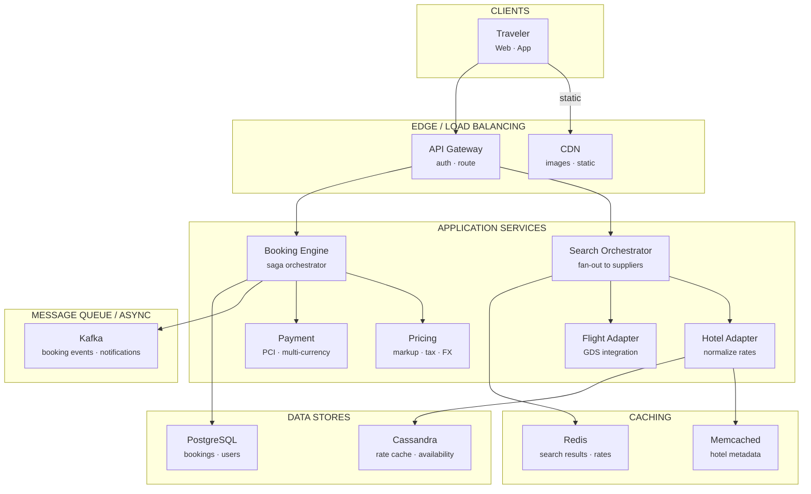
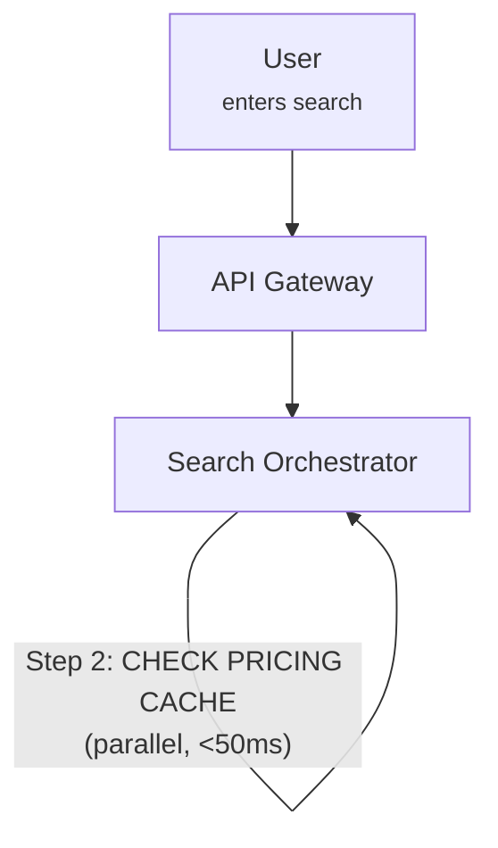
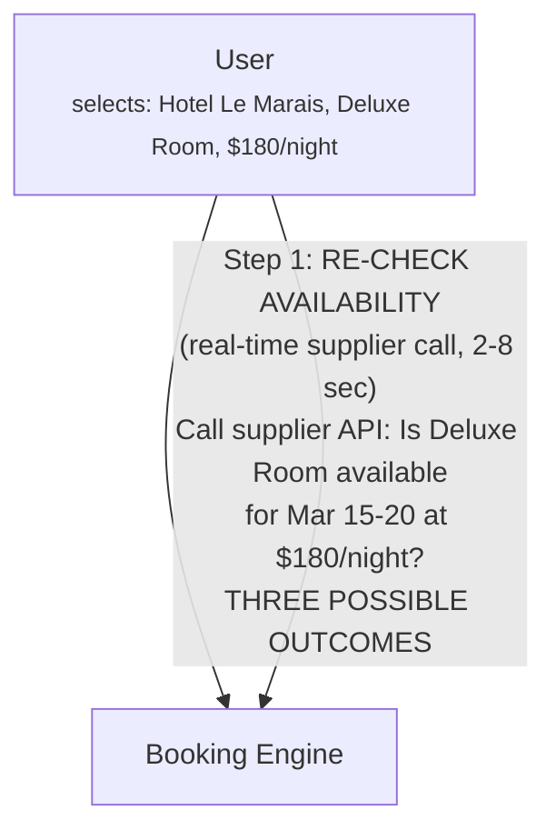

# Design Expedia

Online Travel Agency · 75 min

---

## Phase 1: Clarify the Problem & Scope *(5–7 min)*

> **Say:** "We're designing an Online Travel Agency like Expedia. The critical thing to understand up front: Expedia OWNS NO INVENTORY. It doesn't own a single hotel room, airplane seat, or rental car. It's an AGGREGATOR — it connects to hundreds of external suppliers (airlines, hotel chains, GDS systems, car rental companies), queries their inventory in real time, presents unified search results to the user, and then books through those suppliers on the user's behalf. This makes it fundamentally different from Amazon (which has a warehouse) or Robinhood (which connects to a few market makers). Expedia's core challenge is: aggregate inventory from hundreds of slow, unreliable, heterogeneous external systems and present it as a fast, unified shopping experience."

### Questions I'd Ask

- **What outcome are we optimizing for?** — *Booking conversion rate: searches that result in a completed booking. Secondary: revenue per search (RPS), which factors in both conversion rate and booking value. A 0.1% improvement in conversion on 600M searches/month = massive revenue. This shapes architecture: search must be FAST (slow search → user abandons → lost booking), prices must be ACCURATE at checkout (price change → user abandons → lost booking), and ranking must surface the MOST BOOKABLE results, not just the cheapest.*
- **Products?** — *Flights, hotels (700K+ properties), car rentals, vacation packages (flight + hotel bundle), activities/experiences, cruises. We'll focus on flights + hotels as the core.*
- **Where does inventory come from?** — *Hotels: direct connections (Marriott, Hilton APIs), hotel switches (Derbysoft, SiteMinder), channel managers. Flights: GDS (Amadeus, Sabre, Travelport), direct airline connections (NDC). Car: Hertz, Avis APIs directly.*
- **Revenue model?** — *Hotel: merchant model (Expedia buys wholesale, sells at markup) or agency model (takes commission). Flights: primarily booking fees + ancillary revenue. Packages: bundle discount funded by margin.*
- **Scale?** — *~70M monthly visitors, ~600M searches/month, ~30M bookings/year across all brands (Expedia, Hotels.com, Vrbo, Orbitz).*
- **Latency?** — *Search results must appear in <3 seconds. But suppliers can take 5-15 seconds to respond. This is the fundamental tension.*

### Agreed Scope

| In Scope | Out of Scope |
|----------|-------------|
| Hotel search & booking | Vrbo / vacation rental specifics |
| Flight search & booking | Cruise booking |
| Multi-supplier aggregation | Loyalty/rewards program |
| Pricing & availability caching | Content management (photos, reviews) |
| Package bundling (flight + hotel) | Advertising platform |
| Booking state machine & confirmation | Customer service / call center |
| Supplier integration layer | SEO / marketing infrastructure |

### Core Use Cases

- **UC1 (Hotel Search):** User searches "Hotels in Paris, Mar 15-20, 2 adults" → system queries multiple suppliers in parallel → merges, deduplicates, ranks → shows 200+ hotels with prices in <3 seconds.
- **UC2 (Flight Search):** "NYC → London, Mar 15, round trip, 1 adult" → fan out to GDS + direct airline APIs → aggregate hundreds of itineraries → sort by price/duration/stops → show results in <3 seconds.
- **UC3 (Hotel Booking):** User selects a hotel, enters details, pays → system re-checks availability with supplier (price may have changed!) → if available, confirms booking → sends confirmation email + itinerary.
- **UC4 (Package Booking):** "Flight + Hotel to Paris" → book flight with airline + hotel with hotel supplier → BOTH must succeed → if hotel fails after flight succeeds, must handle partial failure gracefully.
- **UC5 (Price Change at Checkout):** User searched 20 minutes ago, price was $150/night. At checkout, re-query shows $165/night. Must display price change transparently and let user decide.

### Non-Functional Requirements

- **Search speed <3 seconds:** Despite querying 10+ external suppliers that may each take 5-15 seconds. This REQUIRES caching and progressive loading ("show what we have, keep loading more").
- **High availability:** Downtime during peak booking season (holidays, summer) is directly lost revenue. Target: 99.99%.
- **Price accuracy at booking time:** The price shown to the user MUST match what's charged. If it changes between search and booking, the user must be notified. This is a legal (consumer protection) requirement.
- **Eventual consistency for search:** Search results can show slightly stale pricing/availability. It's OK if a hotel shows "available" but is actually sold out — the error is caught at booking time. This tradeoff enables caching.
- **Multi-currency, multi-language:** 70+ countries, 35+ languages, 40+ currencies. Prices must be converted and displayed correctly.

> **Tip:** The defining tension: SEARCH SPEED vs. INVENTORY FRESHNESS. Suppliers are slow (5-15 seconds), unreliable (timeouts, errors), and heterogeneous (different APIs, formats, protocols). Users expect results in <3 seconds. The only way to bridge this gap: AGGRESSIVE CACHING of availability/pricing + REAL-TIME VERIFICATION at booking time. The cache makes search fast but introduces staleness. The booking-time re-check ensures correctness. The architecture is designed around this two-phase model: fast-but-approximate SEARCH → slow-but-exact BOOKING.

---

## Phase 2: Back-of-the-Envelope Estimation *(3–5 min)*

| Metric | Value | Detail |
|--------|-------|--------|
| Monthly Visitors | ~70M | Across all Expedia Group brands. Strong seasonality: summer and holiday peaks. |
| Searches / Month | ~600M | ~20M/day, ~230/sec average, ~1K/sec peak. Each search fans out to multiple suppliers. |
| Supplier Queries / Search | ~10-30 | Each user search → fan-out to 10-30 supplier endpoints. Peak: 30K supplier calls/sec. |
| Bookings / Year | ~30M | ~100K/day, ~1.2/sec average. Conversion rate: ~5% of sessions result in a booking. |
| Hotel Properties | ~700K+ | Across 250K destinations. Each has 5-50 room types × 365 future dates = massive price matrix. |
| Flight Itineraries / Search | ~500-2,000 | A single route can return hundreds of itineraries. Must sort, filter, and rank in milliseconds. |
| Price Cache Size | ~50-100 TB | 700K hotels × ~20 room types × 365 dates × multiple suppliers = billions of rate entries. |
| Gross Bookings | ~$100B+ / year | Expedia Group total. Revenue ~$13B (commission/markup on bookings). |

> **Decision:** **Key insight #1 — The fan-out amplification problem:** 1 user search = 10-30 external API calls. At 1K user searches/sec peak = 30K supplier calls/sec. Suppliers are slow (2-15 second response) and rate-limited. Without caching, this is unsustainable. The availability cache exists primarily to reduce supplier fan-out, not just for speed.

> **Decision:** **Key insight #2 — The search:book ratio is ~200:1.** 600M searches/month but only 2.5M bookings/month. This means: optimizing SEARCH performance matters 200x more than optimizing BOOKING performance. Search must be fast (cached). Booking can be slow (real-time supplier call) because it happens 200x less often and the user is committed.

> **Decision:** **Key insight #3 — Hotels and flights are COMPLETELY DIFFERENT inventory models.** Hotels: static properties with dynamic rates/availability per night. Flights: dynamic itineraries constructed from flight segments with complex fare rules. The search/caching strategy must be different for each. Don't design a generic "travel search" — design hotel search and flight search separately.

---

## Phase 3: High-Level Design *(8–12 min)*

> **Say:** "I'll organize this around the two-phase model: SEARCH (fast, cached, approximate) and BOOKING (slow, real-time, exact). Between them is the PRICING CACHE that bridges the speed gap. And underneath everything is the SUPPLIER INTEGRATION LAYER that normalizes the chaos of hundreds of different external APIs."

### Key Architecture Decisions

> **Say:** "Here's WHY I chose each technology — mapping requirements to tradeoffs. Every choice has a rejected alternative and a consequence."

| Requirement | Decision | Why (and what was rejected) | Consistency |
|------------|----------|----------------------------|-------------|
| Suppliers take 5-15s, user expects <3s | Aggressive caching + progressive loading | Cache popular searches in Redis. Show cached results immediately, live rates as they arrive. Waiting for all suppliers = 15s page load. | AP for search |
| Booking must be ACID (charge + reserve atomically) | PostgreSQL for bookings + saga pattern | Payment charge and supplier reservation must be coordinated. Failure at any step triggers compensating transactions (refund, release). | CP |
| Rates change every few minutes | Cassandra for rate cache (TTL-based expiration) | High write volume from supplier feeds. TTL auto-expires stale rates. Cassandra handles write-heavy workloads better than PostgreSQL. | AP (stale rates acceptable for search) |
| Multiple suppliers return different formats | Adapter-per-supplier (not generic parser) | Marriott XML ≠ Booking.com JSON ≠ Amadeus EDIFACT. Each adapter normalizes to internal schema. Generic parser would be brittle. | — |
| Supplier confirmation can fail after payment | Saga with compensating transactions | If supplier rejects after payment: auto-refund. If payment fails after reservation: release hold. Event-driven with Kafka for audit trail. | — |
| PCI compliance for payments | Tokenized payment vault (booking service never sees card numbers) | Card tokenized at edge. Only the vault + PSP see raw numbers. Reduces PCI scope from entire system to one component. | — |

### Major Components



#### Search Orchestrator [SEARCH]

- Receives user search request
- Decides: cache hit? Or fan-out to suppliers?
- Merges, deduplicates, ranks results
- Returns progressive results (<3 sec)

#### Pricing & Availability Cache [CACHE]

- Pre-fetched hotel rates for popular searches
- TTL-based staleness (15 min - 2 hours)
- Billions of rate entries (hotel × room × date)
- The bridge between fast search and slow suppliers

#### Hotel Service [VERTICAL]

- Hotel content (descriptions, photos, amenities)
- Rate plans, room types, cancellation policies
- Geo-spatial search (hotels near X)
- Review aggregation

#### Flight Service [VERTICAL]

- Itinerary construction from segments
- Fare rules, baggage policies
- GDS integration (Amadeus, Sabre)
- Direct airline (NDC) connections

#### Booking Engine [WRITE PATH]

- Re-verifies price & availability with supplier
- Handles price changes at checkout
- Coordinates multi-supplier bookings
- State machine: pending → confirmed → ticketed

#### Supplier Integration Layer [ADAPTERS]

- Adapters for 100+ supplier APIs
- Normalizes heterogeneous formats (XML, JSON, EDIFACT)
- Connection pooling, rate limiting, circuit breakers
- Retry logic, timeout handling per supplier

#### Payment Service [FINANCE]

- PCI-compliant card processing
- Merchant model: Expedia charges customer
- Agency model: supplier charges customer
- Multi-currency, FX conversion

#### Ranking & Personalization [ML]

- Sort results by relevance, not just price
- Personalized based on user history
- Sponsored listings (hotel bidding for placement)
- Conversion-optimized ranking

### Flow 1: Hotel Search ("Paris, Mar 15-20, 2 adults")



### Flow 2: Hotel Booking (User selects a hotel and pays)



> **Say:** "The deep dives: (1) Search & aggregation — the fan-out pattern and how to handle slow suppliers. (2) Pricing cache — how to cache billions of rates with acceptable staleness. (3) Multi-supplier booking — handling partial failures in flight + hotel packages. (4) Supplier integration layer — normalizing the chaos of 100+ different APIs."

---

## Phase 4: Deep Dives *(25–30 min)*

### Deep Dive 1: Search & Aggregation (~8 min)

> **Goal:** **The core challenge:** A user search for "Hotels in Paris" must query dozens of suppliers, each with different response times (500ms to 15 seconds), different data formats, and different reliability. Results must be merged, deduplicated (same hotel from multiple suppliers), normalized (tax-inclusive vs. exclusive, per-night vs. total), ranked, and returned in <3 seconds. The search orchestrator is the hardest piece of the system.

**The Scatter-Gather Pattern**

```sql
-- Search Orchestrator: Scatter-Gather --

1. SCATTER (fan-out to suppliers in parallel)
  For each applicable supplier for this destination:
    - Spawn async request with TIMEOUT (3 sec hard limit)
    - Each request goes through the Supplier Integration Layer
    - Supplier adapter translates to supplier's API format

  Optimization: DON'T query all 100+ suppliers for every search.
  Supplier Selection Engine picks the 10-20 relevant suppliers:
    - Which suppliers have hotels in Paris?
    - Which suppliers are healthy (not in circuit-breaker state)?
    - Which suppliers have responded fast recently?
    - Which suppliers have the best conversion rates for this market?

2. GATHER (collect responses as they arrive)
  Use a completion-based model, NOT wait-for-all:
    - As each supplier response arrives → parse, normalize, add to result set
    - After 2 seconds: return whatever we have (early return)
    - Continue collecting in background for 1 more second
    - After 3 seconds: hard cutoff, discard late responses
    - Straggling supplier responses update the cache for NEXT search

  Result: User sees results in 2 seconds even if 5 suppliers are slow.
  Tradeoff: Might miss some results from slow suppliers.
  Mitigation: Cache has their rates from a recent prior query.

3. MERGE & DEDUPLICATE
  Same hotel from multiple suppliers? How to know?
    - Property Mapping Table: maps supplier-specific hotel IDs to
      Expedia's canonical property_id.
    - "Marriott Paris Le Marais" from Supplier A = property_id 88421
    - "Paris Le Marais Marriott" from Supplier B = property_id 88421
    - This mapping is maintained by a content team + ML matching.

  For duplicate properties: pick the supplier offering best rate for the user.
  Factor in: price, cancellation policy, Expedia margin, supplier reliability.
```

**Hotel Search vs. Flight Search — Why They're Different**

| Dimension | Hotel Search | Flight Search |
|-----------|-------------|---------------|
| Inventory | Static properties with dynamic rates per night | Dynamic itineraries constructed from flight segments |
| Cacheability | HIGH — rates change slowly (hours). Same hotel, same dates = same rate. | LOW — fares change constantly, seat-level availability is volatile. |
| Search space | Bounded: hotels in [city] for [dates]. Typically 50-5,000 properties. | Combinatorial: segments × connections × fare classes. Thousands of itineraries. |
| Suppliers | Many small suppliers + hotel switches | 3 major GDS (Amadeus, Sabre, Travelport) + airline NDC |
| Dedup | Same hotel from multiple suppliers → property mapping | Same itinerary from GDS + airline direct → itinerary fingerprint |
| Pricing | Rate per night × number of nights. Relatively simple. | Complex fare rules: advance purchase, min stay, Saturday night, fare class availability. |

> **Decision:** **Why scatter-gather with early return instead of waiting for all suppliers?** A single slow supplier (15 sec response) would delay the entire search to 15 seconds — unacceptable. With early return at 2 seconds: we show ~80% of results immediately. The missing results from slow suppliers are either (a) already in the cache from a previous search, or (b) genuinely missing but the user likely won't notice among 200+ results. The completion-based model also naturally handles supplier outages — a down supplier is equivalent to a slow one (it times out and is skipped).

### Deep Dive 2: Pricing & Availability Cache (~7 min)

> **Goal:** **The core challenge:** 700K hotels × ~20 room types × 365 future dates = ~5 billion rate cells. Each cell: (price, availability, cancellation_policy, supplier_id). This is a massive, constantly-changing matrix. We need to cache it aggressively for search speed, but stale prices lead to poor user experience at booking time ("price changed!"). How to balance freshness vs. performance?

```sql
-- Pricing Cache Architecture --

Cache Key Structure:
  hotel:{property_id}:room:{room_type_id}:date:{YYYY-MM-DD}:supplier:{supplier_id}

Cache Value:
  {
    rate: 180.00,           // nightly rate in supplier's currency
    currency: "EUR",
    availability: true,
    rate_plan_id: "BAR_FLEX",
    cancellation: "free_until_72h",
    meal_plan: "breakfast_included",
    tax_inclusive: true,
    fetched_at: "2026-02-14T10:30:00Z",
    ttl_seconds: 3600       // varies by demand
  }

Cache Population Strategies:

  1. ON-DEMAND (reactive)
     User searches → cache miss → query supplier → cache result
     Good for: long-tail destinations, unusual date ranges
     Problem: first search is slow (has to wait for supplier)

  2. PRE-FETCH (proactive)
     Background job continuously queries suppliers for popular routes.
     Prioritized by: search volume, booking revenue, upcoming dates.
     "Paris hotels for next 90 days" pre-fetched every 30 minutes.
     Good for: popular destinations, drives cache hit rate to 80%+
     Cost: generates massive supplier API traffic → rate limit concerns

  3. PUSH FROM SUPPLIER
     Some suppliers push rate changes to Expedia in near-real-time.
     "Marriott Paris Le Marais updated rate for Mar 15: $195"
     Best freshness, lowest Expedia API cost.
     Problem: only sophisticated suppliers support this.

TTL Strategy (adaptive staleness):
  High demand (Paris in summer):      TTL = 15-30 minutes
  Medium demand (Nashville in March):  TTL = 1-2 hours
  Low demand (rural Idaho in winter):  TTL = 6-24 hours
  Close dates (checking in tomorrow):  TTL = 5-15 minutes
  Far dates (6 months out):            TTL = 4-12 hours

Principle: The more volatile the rate, the shorter the TTL.
Close-in dates + high demand = rates change fast → short TTL.
Far-out dates + low demand = rates stable → long TTL.
```

> **Decision:** **What happens when cache is stale and user tries to book?** This is the "price change at checkout" problem. User sees $150/night from cache. They click "Book." Booking engine re-queries supplier in real time: actual rate is $165/night. Three strategies: (1) SHOW PRICE CHANGE — transparent, legally safe, but frustrating. ~5-10% of bookings hit this. (2) HONOR CACHED PRICE — eat the $15 difference. Good UX but erodes margin. Some OTAs do this for small differences (<5%). (3) PRE-BOOK PRICE LOCK — when user adds to cart, immediately re-verify and hold the rate for 15 minutes. Best UX but doubles supplier API calls. Expedia's real approach: a blend — honor small differences, show large ones, and use price-lock for high-value bookings.

**Cache Technology Choice**

- **Redis Cluster** — for hot data (next 30 days, popular destinations). In-memory, <1ms reads. ~5-10 TB.
- **Distributed cache (Memcached / custom)** — for warm data (30-180 days out). Larger capacity, slightly slower.
- **Database (Cassandra)** — for cold data (180+ days out, long-tail). Query on cache miss, backfill to Redis on access.
- **Cache invalidation:** TTL-based (automatic expiry) + event-based (supplier pushes rate change → invalidate specific key). No manual purging needed — stale data simply expires.

### Deep Dive 3: Multi-Supplier Booking (~6 min)

> **Goal:** **The core challenge:** A vacation package = flight (from airline via GDS) + hotel (from hotel supplier) + car rental (from Hertz). THREE separate suppliers, THREE separate booking calls. What if the flight books successfully but the hotel is sold out? We can't leave the customer with half a package. This is a distributed transaction across systems we DON'T control.

```sql
-- Package Booking: Saga Pattern --

The Problem:
  We cannot use traditional 2PC (two-phase commit) because:
  - Suppliers are EXTERNAL — they don't participate in our transactions
  - Each supplier has different cancellation policies and timing
  - We don't control their APIs or reliability

Solution: SAGA with compensating transactions

  Step 1: Book Flight (highest cancellation cost → book first)
    → Call airline/GDS → receive PNR (booking reference)
    → State: FLIGHT_BOOKED
    → Compensation: cancel PNR (usually free within 24 hours for flights)

  Step 2: Book Hotel
    → Call hotel supplier → receive confirmation number
    → State: HOTEL_BOOKED
    → Compensation: cancel hotel booking (per cancellation policy)

  Step 3: Book Car (if applicable)
    → Call car rental API → receive confirmation
    → State: CAR_BOOKED
    → Compensation: cancel car rental (usually free)

  Step 4: Charge Payment
    → Capture pre-auth → finalize total charge
    → State: PAYMENT_CAPTURED

  Step 5: Confirm Package
    → State: PACKAGE_CONFIRMED
    → Send unified confirmation email with all components

FAILURE HANDLING:

  If Step 2 (hotel) fails after Step 1 (flight) succeeded:
    → Cancel flight (compensating transaction)
    → Release payment pre-auth
    → Show user: "Hotel no longer available. Would you like to choose another?"
    → Suggest alternative hotels that ARE available

  If Step 4 (payment) fails after Steps 1-3 succeeded:
    → Cancel car, cancel hotel, cancel flight (reverse order)
    → Show user: "Payment failed. Please try another card."

Order of booking matters: book the HARDEST-TO-CANCEL component first.
Flights: 24-hour free cancellation (DOT rule). Book first.
Hotels: varies. Free cancellation hotels booked before non-refundable.
Cars: almost always free cancellation. Book last.
```

> **Decision:** **Why the saga pattern over synchronous all-or-nothing?** We can't do an all-or-nothing atomic transaction because: (1) Suppliers are external — no distributed transaction protocol spans Amadeus + Marriott + Hertz. (2) Booking calls take 2-10 seconds each — holding all three in a single blocking transaction would take 30+ seconds and risk timeouts. (3) Suppliers don't support "reserve without booking" (no prepare phase). The saga pattern trades atomicity for availability: we book sequentially, and if a later step fails, we COMPENSATE by cancelling earlier steps. This occasionally results in "phantom bookings" (a booking that exists for 30 seconds before being cancelled), which is an acceptable tradeoff for the industry.

### Deep Dive 4: Supplier Integration Layer (~5 min)

> **Goal:** **The core challenge:** Expedia connects to 100+ suppliers, each with a different API. Marriott uses REST/JSON. Amadeus GDS uses EDIFACT (a 1980s message format). Some hotel switches use XML/SOAP. Each supplier has different rate structures, cancellation policies, error codes, and quirks. The integration layer must present a UNIFIED INTERFACE to Expedia's internal services while handling all this heterogeneity underneath.

```sql
-- Supplier Integration Layer --

Architecture: Adapter Pattern

  Internal services use a canonical API:
    searchAvailability(destination, checkin, checkout, guests) → [RateOffer]
    bookRoom(property_id, room_type, rate_plan, guest_details) → Confirmation
    cancelBooking(confirmation_id) → CancellationResult

  Each supplier has a dedicated Adapter that implements this interface:

  ┌──────────────────────────────────────────────────────┐
  │  Canonical API  (what internal services call)         │
  └────────────────────────┬─────────────────────────────┘
                           │
  ┌────────────────────────▼─────────────────────────────┐
  │  Adapter Registry  (route to correct adapter)         │
  └──┬──────────┬──────────┬──────────┬──────────────────┘
     │          │          │          │
  ┌──▼──┐   ┌──▼──┐   ┌──▼──┐   ┌──▼──────┐
  │Marriott  │Amadeus  │Derbysoft  │Hilton  │  ... 100+ adapters
  │REST/JSON │EDIFACT  │XML/SOAP   │REST    │
  └─────┘   └─────┘   └──────┘   └────────┘

Each adapter handles:
  - Protocol translation (REST, SOAP, EDIFACT, proprietary)
  - Data mapping (supplier room types → canonical room types)
  - Rate normalization (tax-inclusive vs. exclusive, per-night vs. total)
  - Currency conversion
  - Error code mapping (supplier-specific → canonical errors)
  - Authentication (API keys, OAuth, certificates)
  - Rate limiting (respect supplier's API limits)
  - Retry logic (supplier-specific: some are idempotent, some aren't)

Resilience per supplier:
  - Circuit breaker: If supplier fails 5x in 60 sec → trip circuit
    → Skip this supplier for 30 sec → probe with test request → close circuit
  - Timeout: Per-supplier configured (Marriott: 3 sec, small hotel chain: 8 sec)
  - Fallback: If supplier down → serve from pricing cache (stale but available)
  - Bulkhead: Each supplier gets its own thread pool / connection pool
    → Slow Supplier A can't exhaust connections needed for Supplier B
```

- **Property mapping:** The most under-appreciated problem. Supplier A calls it "Marriott Paris Opera." Supplier B calls it "Paris Marriott Hotel." Same hotel, different names, different IDs. A PROPERTY MAPPING TABLE (maintained by content team + ML matching) maps every supplier's hotel ID to Expedia's canonical property_id. Errors here → duplicate listings or missed inventory.
- **Rate parity:** Hotels often require that OTAs show the same rate as the hotel's own website ("rate parity clause"). The integration layer must track which rates are "parity" and which are "opaque" (discounted but hidden behind a bundle).
- **Connectivity monitoring:** Dashboard showing real-time health of each supplier connection: response time, error rate, availability. Alerts when a supplier degrades. Some suppliers have scheduled maintenance windows — the system must handle these gracefully.

> **Decision:** **Why one adapter per supplier instead of a generic XML/JSON parser?** Because each supplier's API is an order of magnitude more quirky than it appears. Marriott returns rates including resort fees but excluding taxes. Hilton returns rates excluding both. Amadeus returns fares in a currency that may differ from the request currency. One supplier uses "0" for available and another uses "true." A supplier's "Deluxe King" room might map to another's "Superior Room with King Bed." These semantic differences CANNOT be handled by a generic parser — each adapter encodes deep supplier-specific knowledge built up over years of integration. The adapter is the organizational boundary: the supplier integration team for Marriott owns the Marriott adapter end-to-end.

---

## Phase 5: Cross-Cutting Concerns *(10–12 min)*

### Storage Architecture Summary

> **Goal:** **What goes where and why.** Each data store is chosen for its access pattern — not by default. The question isn't "which database?" but "what are the read/write patterns, consistency requirements, and scale characteristics?"

| Data | Store | Why This Store |
|------|-------|---------------|
| Search results cache | Redis + Cassandra | Redis for hot queries (same search repeated). Cassandra for warm cache (rates < 15 min old). Avoids re-querying slow suppliers. |
| Booking records | PostgreSQL | ACID for payment and reservation. Order ID, guest details, payment tokens, confirmation numbers. Sharded by booking_id. |
| Hotel/flight metadata | PostgreSQL + Memcached | Property descriptions, photos, amenities. Heavily cached — metadata changes infrequently. Memcached reduces DB load 10x. |
| Rate availability | Cassandra | Supplier rates by (hotel_id, date_range, room_type). High write volume from supplier feeds. TTL-based expiration for stale rates. |
| Booking events | Kafka | booking.initiated, booking.confirmed, booking.cancelled. Consumed by notifications, analytics, supplier reconciliation. |
| Supplier API responses | S3 | Raw XML/JSON responses archived for dispute resolution. Retained for 2 years per contract. |

### Failure Scenarios

| Scenario | Mitigation |
|----------|-----------|
| Major supplier goes down (e.g., Marriott API outage) | Circuit breaker trips within 30 seconds. All Marriott properties served from pricing cache (stale but available). Search results still include Marriott hotels with cached rates. Booking attempts for Marriott → show "temporarily unavailable, try again later." Other suppliers completely unaffected (bulkhead isolation). |
| GDS (Amadeus) outage — no flight inventory | Fall back to direct airline connections (NDC) where available. For airlines only on Amadeus: flight search shows partial results with disclaimer "some airlines temporarily unavailable." Hotel search completely unaffected. Monitor GDS status page, auto-recover when GDS comes back. |
| Price change between search and booking | Booking engine always re-verifies price with supplier before charging. If price increased >5%: show user transparently "Price changed from $150 to $165." User decides. If price decreased: book at lower price (good UX, builds trust). Track "price change rate" per supplier as a quality metric. |
| Package booking: hotel fails after flight booked | Saga compensating transaction: cancel the flight (free within 24h per DOT rule). Notify user: "Hotel no longer available." Offer: (1) alternative hotels at similar price, (2) book flight-only, (3) cancel entirely. No charge to customer for the cancelled flight. |
| Payment failure after supplier confirmed booking | We now have a "confirmed but unpaid" booking. Retry payment with stored card. If retry fails: attempt to cancel with supplier (cancellation may incur fee if policy is strict). If supplier won't cancel: Expedia eats the cost. This is rare (<0.1% of bookings) but tracked as a loss metric. |
| Cache poisoning — wrong rates cached | A supplier API returns malformed data (e.g., $0/night instead of $200/night). Validation layer in the adapter catches: reject rates below cost floor or above ceiling. If bad data enters cache: caught at booking time when re-verification shows vastly different price. Alert triggered, cache key invalidated, supplier team investigates. |
| Holiday traffic spike (10x normal search volume) | Search is read-heavy → scales horizontally (add more search orchestrator instances). Cache absorbs most load (no extra supplier calls). Supplier fan-out is the bottleneck — reduce fan-out by relying more on cache, increase timeout thresholds. Booking volume increases proportionally but is 200x less than search → not the bottleneck. |

### Scalability

> **Tip:** The search path is the scaling bottleneck: a single hotel search ("Paris, 5 nights, 2 adults") fans out to 10+ suppliers, each returning 50-500 results. Without caching, every search would trigger 10 external API calls taking 5-15 seconds each. The caching strategy is multi-layered: (1) Redis caches exact query matches for 5 minutes (same destination, dates, guests), (2) Cassandra caches individual supplier responses by hotel_id + date range for 15 minutes, (3) pre-fetched rates for popular destinations are refreshed every 10 minutes by a background job. For the booking path, traffic is ~100x lower than search (only ~2% of searches convert), so PostgreSQL handles it without sharding for most scenarios. Scaling challenges specific to travel: seasonality (10x traffic during holiday booking periods) requires auto-scaling, and supplier APIs are the ultimate bottleneck — we cannot make them faster, only cache more aggressively and degrade gracefully when they're slow (show cached results with "prices from" instead of live rates).

### Ranking & Personalization

- **Default sort:** ML-ranked by predicted conversion probability. Features: price competitiveness, hotel quality score, review rating, distance to city center, user's booking history, device type.
- **Sponsored placements:** Hotels bid for premium placement (top of results, "Recommended" badge). This is a significant revenue stream. Blended with organic results — marked as "Ad" per FTC guidelines.
- **Personalization signals:** Past bookings (prefers 4-star hotels), search history (always picks free cancellation), loyalty status, price sensitivity (clicks on sorted-by-price vs. recommended).
- **A/B testing:** Ranking models are constantly A/B tested. Metric: booking conversion rate (CVR) and revenue per search (RPS). A 0.1% CVR improvement on 600M searches/month = significant revenue.

### Reconciliation & Finance

- **Merchant model:** Expedia charges customer $200/night. Pays hotel $160/night. Margin: $40/night. Expedia is the merchant of record — handles chargebacks, refunds.
- **Agency model:** Customer pays hotel directly. Hotel pays Expedia 15-25% commission. Less financial risk for Expedia but less control over pricing.
- **Reconciliation:** For every booking, reconcile: (1) what we charged the customer, (2) what the supplier confirms, (3) what the supplier invoices us. Discrepancies → dispute with supplier. Run nightly batch matching booking records to supplier invoices.
- **Refunds/cancellations:** Each booking component has its own cancellation policy. "Free cancellation until 48h before check-in" → refund full amount. Non-refundable → no refund. Partial cancellation of a package → recalculate bundle pricing.

### Content & Property Data

- **Property content:** 700K properties × (description, 50+ photos, amenities, location, star rating, policies). Stored in a content service separate from pricing. Updated infrequently (weeks/months). CDN-cached aggressively.
- **Reviews:** Millions of verified guest reviews. Aggregated across Expedia Group brands. Review scores factor into search ranking. Fraud detection on fake reviews (ML model).
- **Photo quality:** Professional photography program for top properties. AI-based photo scoring to surface the best images. Photos are the #1 factor in hotel conversion — more impactful than price for many travelers.

### Security & Access Control

> **Decision:** PCI DSS compliance is mandatory: payment card data is tokenized immediately and stored in a PCI-compliant vault. The booking service never sees raw card numbers — only tokenized references. Guest PII (passport numbers, addresses) is encrypted at rest and access-logged. GDPR compliance: right-to-erasure implemented via a PII anonymization pipeline that can purge a guest's data across all systems within 72 hours. API security: OAuth 2.0 for partner APIs, API keys with per-partner rate limits for supplier integrations. Fraud detection: ML model scores each booking for fraud signals (mismatched billing/guest country, last-minute high-value bookings, velocity checks). High-risk bookings are held for manual review before supplier confirmation, preventing chargeback losses.

### Monitoring & SLOs

> **Tip:** SLOs: search results in <3 seconds (p95, despite supplier latency), booking confirmation in <10 seconds, search availability 99.95%. Supplier health is monitored per-integration: if Marriott's API degrades (latency >5s or error rate >5%), the search orchestrator marks it as "slow" and either (1) returns cached results for Marriott properties or (2) extends the timeout but shows results from fast suppliers immediately ("more results loading..."). Booking pipeline has end-to-end tracing from user click through supplier confirmation, with alerting on: (1) booking failure rate >2% (normal is <0.5%), (2) supplier timeout rate >10%, (3) payment decline rate spike. Revenue-impacting metrics (search-to-book conversion rate, average booking value) are dashboarded alongside technical metrics — a latency increase that doesn't affect conversion is lower priority than one that does.

---

## Phase 6: Wrap-Up & Evolution *(3–5 min)*

> **Say:** "To summarize: Expedia's architecture is built around a fundamental two-phase model — fast-but-approximate SEARCH and slow-but-exact BOOKING — bridged by an aggressive PRICING CACHE. Search uses scatter-gather with early return: fan out to 10-20 suppliers in parallel, return results as they arrive within 2-3 seconds, skip slow suppliers. The pricing cache holds billions of rate entries (700K hotels × room types × dates) with adaptive TTLs (15 minutes for hot inventory, hours for cold). At booking time, the system re-verifies the EXACT price and availability with the supplier, handling the inevitable price changes transparently. Multi-supplier packages use a saga pattern with compensating transactions — if the hotel fails after the flight books, cancel the flight. Underneath it all, the Supplier Integration Layer's 100+ adapters normalize the chaos of different APIs, protocols, and data formats into a canonical interface. The adapters encode years of supplier-specific knowledge and are the true competitive moat — they're why building an OTA is so hard."

### What I'd Build Next

| Extension | Architecture Impact |
|-----------|-------------------|
| AI Trip Planner | LLM-powered conversational search: "Plan a romantic week in Italy for under $3K." Requires multi-step reasoning across flights, hotels, activities. Generates itineraries by combining search results with knowledge of destinations. Very different UX from the traditional form-based search. |
| Dynamic Packaging Engine | Algorithmically construct the optimal flight + hotel + car bundle price. The bundle price must be cheaper than booking individually (otherwise why bundle?). Requires real-time optimization across supplier margins and inventory. The "opaque" rate model: show discounted rate only in bundle, hiding the per-component price. |
| Fintech (Buy Now Pay Later) | Let users split a $2,000 vacation into 4 monthly payments. Requires credit risk assessment, payment scheduling, collections for missed payments. Partnership with BNPL providers (Affirm, Klarna) or build in-house. Booking must be confirmed immediately but payment collected over time. |
| Real-Time Price Alerts | User saves a search → monitor prices continuously → notify when price drops. Requires a massive background price-monitoring pipeline: millions of saved searches × periodic re-evaluation. Streaming architecture (Kafka + Flink) to compare cached rates against user thresholds. |
| Supplier Yield Management | Help hotels dynamically price rooms based on demand, competitor pricing, and events. Build a B2B analytics platform that surfaces insights to hotel partners. Aligns Expedia's interests (more bookings) with hotels' interests (higher revenue per room). |

> **Tip:** **Closing framing:** What makes Expedia architecturally unique among the systems we've designed is that it OWNS NOTHING. No inventory, no rooms, no seats. Its entire value comes from AGGREGATION — connecting slow, heterogeneous, unreliable external systems and presenting them as a fast, unified shopping experience. The search:book ratio of 200:1 tells you where to invest engineering effort: make SEARCH blazing fast (caching, scatter-gather, early return) and make BOOKING correct (re-verify, saga pattern, compensating transactions). The supplier integration layer — those 100+ adapters with years of supplier-specific knowledge baked in — is the true moat. Anyone can build a search UI. Almost nobody can build and maintain reliable connections to hundreds of travel suppliers simultaneously. That's why OTAs are a consolidating market: the integration complexity creates an enormous barrier to entry.

---

## Phase 7: Interview Q&A *(Practice)*

> **Say:** "Here are the hardest questions an interviewer would ask about this design, and how to answer them. Each answer demonstrates deep understanding of the tradeoffs, not just surface knowledge."

**Q:** How do you return search results in 3 seconds when suppliers take 5-15 seconds?

**A:** Three techniques combined: (1) aggressive caching — for popular queries (Paris hotels, NYC flights), we have pre-fetched cached results that can be returned instantly while fresh supplier queries run in the background. (2) Progressive loading — we show cached results immediately with a "prices from $X" label, then replace with live rates as suppliers respond. The UI shows a loading indicator per supplier. (3) Timeout with partial results — we set a 3-second deadline. Whatever suppliers have responded by then, we show. Slow suppliers get their results dropped or shown as "check availability." The ranking algorithm actually helps here: the most popular hotels tend to be from the fastest suppliers (Booking.com, Expedia's own inventory), so the first results shown are usually the most relevant. The key UX insight: showing 80% of results in 2 seconds is better than showing 100% in 12 seconds.

**Q:** What happens when a booking fails after the payment is charged?

**A:** This is a distributed saga with compensating transactions. The booking flow is: (1) reserve inventory with supplier (hold), (2) charge payment, (3) confirm with supplier. If step 3 fails (supplier rejects the confirmation — maybe the room was booked by someone else in the race condition window), we execute compensations in reverse: (3b) refund payment → (2b) release hold. The refund is automatic and immediate for card payments. For step 1 failures (supplier hold fails), we never reach payment — the user sees "this option is no longer available." The trickiest failure is the "phantom booking" — supplier confirmation succeeds but our system crashes before recording it. For this, we run a reconciliation job every hour: fetch booking status from each supplier and compare against our records. Mismatches create cases for operations. Suppliers also send daily reconciliation files (similar to bank settlement), which is the final catch-all.
