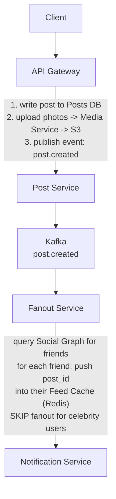
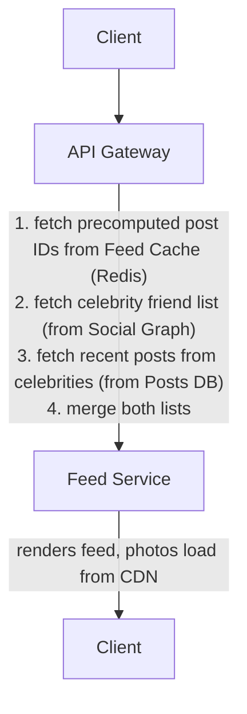
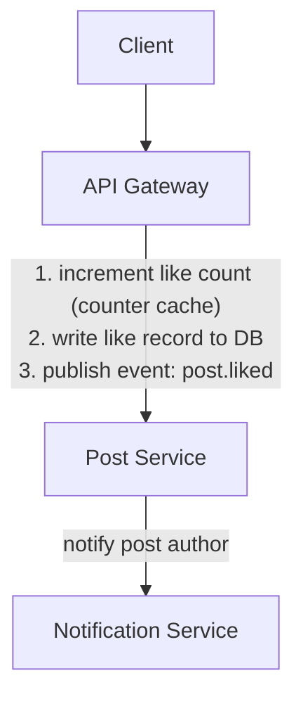

# Design Facebook

*Worked Example -- 75 min*

---

## Phase 1: Clarify the Problem & Scope *(5--7 min)*

> **Say:** "Let me restate the problem. We're designing a social network like Facebook -- users create profiles, connect as friends, publish posts with text and media, and consume a personalized news feed of content from their connections. Let me scope this down."

### Questions I'd Ask

- **What outcome is the product optimizing for?** *-> "Meaningful social interactions" (MSI) -- not raw engagement time. After 2018, Facebook shifted from maximizing time-on-site to prioritizing interactions between friends over passive content consumption. This shapes feed ranking: a friend's post with 2 comments outranks a viral video with 10K views. The architecture must support re-ranking by interaction quality, not just click-through rate.*
- **Core features?** Profiles, friend connections, posting, news feed? Or also groups, pages, marketplace, stories, events? *-> Focus on the core social graph + news feed. Mention others as extensions.*
- **Feed type?** Chronological or ranked/algorithmic? *-> Ranked feed is more interesting to design. Chrono as fallback.*
- **Content types?** Text, photos, videos, links? *-> Text + photos in scope. Video as extension (different pipeline).*
- **Notifications?** In scope? *-> Acknowledge but keep out of deep dive. Similar pattern to feed fanout.*
- **Scale?** *-> ~2 billion registered users, ~500M DAU. Average user has ~300 friends.*
- **Geography?** *-> Global. Multi-region is in scope for discussion.*

### Agreed Scope

| In Scope | Out of Scope |
|---|---|
| User profiles & auth | Messenger / real-time chat |
| Social graph (friends) | Groups & pages |
| Create posts (text + photos) | Video upload & streaming |
| News feed (ranked) | Stories, Reels |
| Likes & comments | Marketplace, Events, Ads |
| Media storage & serving | Search (beyond friend lookup) |

### Core Use Cases (ranked)

- **UC1:** User opens app -> sees personalized, ranked news feed of posts from friends
- **UC2:** User creates a post (text + optional photos) -> post appears in friends' feeds
- **UC3:** User likes or comments on a post -> visible to post author and other viewers
- **UC4:** User sends/accepts friend request -> bidirectional connection established

### Non-Functional Requirements

- **Feed latency** -- <500ms to render first screen of feed. Stale content (seconds old) is acceptable.
- **Availability > consistency for feed** -- it's better to show a slightly stale feed than to show nothing.
- **Post creation must be durable** -- once a user hits "Post," we must not lose it. Strongly consistent write.
- **Social graph must be strongly consistent** -- if I unfriend someone, they should not see my posts. Eventual is not acceptable here.
- **Read-heavy** -- feed reads vastly outnumber post writes. Most users consume, few produce.
- **Global** -- users everywhere. Latency-sensitive reads need to be served from nearby regions.

> **Tip:** Notice the asymmetry: most users are readers, not writers. The average user might create 1 post/week but scroll through their feed 10+ times/day. This read-heavy pattern is THE defining constraint.

---

## Phase 2: Back-of-the-Envelope Estimation *(3--5 min)*

> **Say:** "Let me work out the numbers that will drive the design."

| Metric | Value | Detail |
|---|---|---|
| **Daily Active Users** | **500M** | 2B registered, ~25% DAU |
| **New Posts / Day** | **~300M** | ~60% of DAU post at least once. ~3.5K posts/sec avg, ~10K peak. |
| **Feed Reads / Day** | **~5B** | 500M users x ~10 feed loads/day. ~58K reads/sec avg, ~150K peak. |
| **Read:Write Ratio** | **~17:1** | 5B reads / 300M writes. System is massively read-heavy. |
| **Photo Storage / Day** | **~150 TB** | ~50% of posts have photos. 150M x 2 photos x 500KB avg (multiple sizes). |
| **Social Graph Edges** | **~300B** | 2B users x avg 300 friends / 2 (bidirectional). In-memory: ~2.4TB at 8 bytes/edge pair. |
| **Fanout on Write** | **~90B feed inserts/day** | 300M posts x avg 300 friends. ~1M inserts/sec into feed caches. |
| **Feed Cache Size** | **~25 TB** | 500M active users x ~500 post IDs cached x 100 bytes per entry |

> **Decision:** **Key insight #1:** 150K feed reads/sec at peak is the hottest path. Feeds MUST be precomputed or cached -- assembling them at read time from scratch (query friends -> fetch their posts -> rank -> return) would be catastrophically slow.

> **Decision:** **Key insight #2:** Fanout on write generates ~1M feed cache inserts/sec. This is feasible but expensive. Celebrity users with millions of followers would cause write amplification. This drives us toward a HYBRID fanout strategy.

> **Decision:** **Key insight #3:** 150TB/day of photos means media storage and serving is a first-class concern. CDN is essential.

---

## Phase 3: High-Level Design *(8--12 min)*

> **Say:** "Let me draw the major components. I'll walk through two flows: publishing a post, and loading the news feed."

### Key Architecture Decisions

> **Say:** "Here's WHY I chose each technology -- mapping requirements to tradeoffs. Every choice has a rejected alternative and a consequence."

| Requirement | Decision | Why (and what was rejected) | Consistency |
|---|---|---|---|
| Feed reads at 150K QPS, <500ms | Hybrid fanout (write for normal, read for celebrities) | Fanout-on-write for 500 friends = 500 Redis writes. For 50M followers, write storm is unacceptable -> pull at read time. | AP |
| Posts must never be lost | PostgreSQL for posts (ACID) | User-generated content is irreplaceable. Redis cache is reconstructable; posts are not. | CP |
| Social graph at millions of QPS | PostgreSQL + Memcached (not Neo4j) | Adjacency list handles complex queries. Memcached absorbs 95% of reads. Neo4j doesn't scale horizontally. | AP |
| Media at petabyte scale | S3 + CDN (not database BLOBs) | Blobs don't belong in relational DBs. S3 = infinite scale, CDN = edge caching. 95% of media reads served from CDN. | -- |
| Async fanout, notifications, analytics | Kafka (not synchronous calls) | Post.created event consumed independently by fanout, notification, and analytics services. Decoupled failure domains. | -- |
| Feed staleness < 30s acceptable | Eventual consistency for feed reads | Showing a 30-second-stale feed is infinitely better than showing nothing during a partition. | AP |

### Major Components

```mermaid
graph TD
    subgraph CLIENTS
        A["Client Apps<br/>iOS - Android - Web"]
    end

    subgraph EDGE / LOAD BALANCING
        B["API Gateway + LB"]
        C["CDN<br/>images - video - static"]
    end

    subgraph APPLICATION SERVICES
        D["Post Service<br/>write path"]
        E["Feed Service<br/>hot path - fanout-on-read"]
        F["Fanout Service<br/>async write"]
        G["Social Graph<br/>friends - followers"]
        H["Media Service<br/>upload - resize"]
        I["Notifications<br/>push - email"]
    end

    subgraph CACHING
        J["Redis<br/>feed cache - sessions"]
        K["Memcached<br/>social graph lookups"]
    end

    subgraph MESSAGE QUEUE / ASYNC
        L["Kafka<br/>post.created - fanout events"]
    end

    subgraph DATA STORES
        M["PostgreSQL<br/>posts - users - graph"]
        N["S3<br/>images - video - media"]
    end

    A --> B
    A --> C
    B --> D
    B --> E
    D --> L
    L --> F
    L --> I
    E --> J
    E --> G
    F --> J
    G --> K
    H --> N
    D --> M
    F --> J
end
```

#### Client Apps [CLIENT]

- Web, iOS, Android
- REST API for CRUD, polling/long-poll for feed refresh

#### API Gateway + LB [EDGE]

- AuthN (JWT), rate limiting, routing
- SSL termination, geographic routing

#### Post Service [WRITE PATH]

- Create / edit / delete posts
- Store in Posts DB, publish event to fanout

#### Feed Service [HOT PATH]

- Serve precomputed feed from cache
- Merge with celebrity posts at read time
- Apply ranking model

#### Fanout Service [ASYNC]

- On new post -> push post ID into friends' feed caches
- Hybrid: fanout-on-write for normal users, skip for celebrities

#### Social Graph Service [CORE]

- Friend requests, accept/reject, unfriend
- "Get friends of user X" -- used by fanout

#### Media Service [MEDIA]

- Upload photos -> S3/blob store
- Async resize/compress -> multiple sizes
- Serve via CDN

#### Notification Service [ASYNC]

- Consumes events: likes, comments, friend accepts
- Push notifications, in-app badge counts

### Flow 1: User Creates a Post



### Flow 2: User Loads News Feed



### Flow 3: Like / Comment



> **Say:** "The most architecturally interesting piece is the feed generation -- specifically the fanout strategy. That's what I'd like to deep-dive first. The second most interesting is the social graph at this scale. Sound good?"

---

## Phase 4: Deep Dives *(25--30 min)*

### Deep Dive 1: News Feed Generation (~12 min)

> **Goal:** **The core challenge:** Serve a personalized, ranked feed to 500M DAU at 150K reads/sec with <500ms latency. The fundamental tradeoff is WHEN you do the work: at write time (fanout-on-write) or at read time (fanout-on-read).

#### Fanout-on-Write (Push Model)

- When user posts -> immediately push post_id into every friend's feed cache
- Feed reads are instant -- just fetch from precomputed cache
- Read latency: ~10ms (cache hit)
- Write amplification: 1 post -> 300 cache writes (avg)
- Celebrity problem: 1 post from a user with 10M friends -> 10M cache writes
- Wasted work: pushing to inactive users who never read

**Best for: normal users (<=10K friends)**

#### Fanout-on-Read (Pull Model)

- When user loads feed -> query all friends' recent posts, merge, rank, return
- No write amplification -- posts stored once
- No wasted work -- only computed when user actually opens feed
- Slow reads: must query 300+ friends' posts, merge, rank at request time
- At 150K reads/sec, this creates enormous DB load

**Best for: celebrity users (>10K friends)**

> **Decision:** **Hybrid approach -- the principal-level answer.** Use fanout-on-write for normal users (the vast majority) and fanout-on-read for celebrity users. At read time, merge the precomputed cache with a small number of celebrity pull queries. This gives us O(1) reads for 99% of content and limits write amplification for the top 0.1% of users.

**Feed Cache Architecture**

```sql
-- Redis: Per-user Feed Cache --
SORTED SET  key: feed:{user_id}
              member: post_id
              score: timestamp (or ranking score)
              max size: ~500 entries (capped with ZREMRANGEBYRANK)

-- When user opens feed --
1. ZREVRANGE feed:{user_id} 0 19        // top 20 post IDs from cache
2. Query celebrity_friends of user        // small set, ~5-20 celebrities
3. Fetch recent posts from each celebrity // from Posts cache or DB
4. Merge both lists by score
5. Hydrate: MGET post:{post_id} ...      // fetch full post objects
6. Apply ranking model
7. Return top 20
```

**Fanout Service Design**

- **Triggered by:** Kafka event `post.created`
- **Step 1:** Check author's friend count. If >10K -> mark as celebrity, skip fanout, add author to `celebrity_users` set.
- **Step 2:** Query Social Graph for author's friend list.
- **Step 3:** Filter to only active users (logged in within 30 days) -- don't waste writes on dormant accounts.
- **Step 4:** For each active friend, ZADD post_id to their `feed:{friend_id}` sorted set in Redis.
- **Step 5:** Batch the writes. Process in chunks of 1000 friends with pipelining.
- **Throughput:** With 300M posts/day and avg 200 active friends (after filtering), that's ~60B feed inserts/day or ~700K/sec. A Redis cluster with 20-30 shards handles this.

> **Decision:** **Why threshold at 10K friends?** At 300 friends, fanout cost is trivial (300 Redis writes). At 10K, it's still manageable. At 1M+, a single post causes 1M writes -- this dominates the pipeline. The 10K threshold means we push-model for ~99.9% of users and pull-model for ~0.1%. The tradeoff is slightly higher read latency for users who follow many celebrities (extra pull queries), but that's bounded by the number of celebrities they follow (typically <20).

**Feed Ranking**

- **Lightweight ranking model** applied at read time after merging. Not a full ML inference per request (too slow at 150K/sec).
- **Pre-computed features stored on each post:** engagement_score (likes + comments + shares, decayed by time), author_affinity_score (how much the reader interacts with this author), content_type_weight (photos rank higher than text-only).
- **Ranking formula:** `score = engagement x affinity x recency_decay x content_weight`
- **Affinity scores** are precomputed offline (batch job) and cached per user-pair. Updated daily.

> **Tip:** **Pagination:** Cursor-based, not offset. The cursor is the score of the last item returned. Client sends `?cursor=1707890400&limit=20`. This is stable even as new posts are inserted (unlike offset which shifts).

### Deep Dive 2: Social Graph (~8 min)

> **Goal:** **The core challenge:** Store 300B edges (friendships), support "get all friends of X" queries for fanout, handle friend/unfriend with strong consistency, and answer "are X and Y friends?" in <10ms.

**Storage Choice**

> **Decision:** **Why not a graph database (Neo4j)?** Graph DBs excel at multi-hop traversals (friends-of-friends, shortest path). But our primary queries are single-hop: "get friends of X" and "are X and Y friends?" These are efficiently served by a simple adjacency list. Neo4j would add operational complexity without benefit for our access pattern. Tradeoff: if we later need 2-hop queries (friend recommendations), we'd build a separate service rather than migrate the whole graph.

> **Decision:** **Choice: MySQL (or PostgreSQL) with an adjacency list table, plus Redis cache for hot reads.** Facebook famously uses MySQL + TAO (their custom graph cache). The write volume for friendship changes is low (~millions/day, not billions), so a relational DB handles it. The read volume is high (fanout queries) but is served from cache.

```sql
-- MySQL: Friendships (adjacency list) --
friendships
  user_id_1     BIGINT     // always the smaller ID (canonical ordering)
  user_id_2     BIGINT     // always the larger ID
  status         ENUM (pending, accepted, blocked)
  created_at     TIMESTAMP
  PRIMARY KEY (user_id_1, user_id_2)

-- For "get all friends of X" we need BOTH directions --
INDEX (user_id_1, status)  -> finds friends where X is user_id_1
INDEX (user_id_2, status)  -> finds friends where X is user_id_2
-- OR: store two rows per friendship (one per direction) for simpler queries

-- Redis: Friend List Cache --
SET  key: friends:{user_id}
     members: [friend_id_1, friend_id_2, ...]
     // Invalidated on friend/unfriend

STRING  key: friendship:{min_id}:{max_id}
        value: "accepted" | "pending" | "blocked" | null
        // For "are X and Y friends?" checks -- O(1) lookup
```

**Sharding Strategy**

- **Shard by user_id** -- all of a user's friendships live on the same shard. This makes "get all friends of X" a single-shard query.
- **Dual-write approach:** Store two rows per friendship (A->B and B->A), each on its respective user's shard. This means "get all friends of X" only hits X's shard.
- **Tradeoff:** Friendship creation/deletion requires a distributed write (two shards). We use a two-phase approach: write to both shards, if one fails -> retry from a dead-letter queue. Brief inconsistency window (ms) is acceptable for friend list display but we must ensure the unfriend path is strongly consistent for privacy.

> **Decision:** **Why dual-write over single-row + two indexes?** With a single row, "get friends of X" requires querying TWO indexes (where user_id_1=X OR user_id_2=X) which could span two different shards. Dual-write doubles storage but guarantees single-shard reads, which matters at 700K friend-list lookups/sec from the fanout service.

### Deep Dive 3: Post Creation & Media Pipeline (~5 min)

> **Goal:** **The core challenge:** Durably store 300M posts/day. Handle photo uploads (150TB/day) without blocking the write path. Serve images globally with low latency.

**Post Write Path**

- **Step 1:** Client uploads photo(s) directly to Media Service via presigned S3 URL -> returns `media_id`. This decouples large file upload from the post creation API.
- **Step 2:** Client sends `POST /posts` with text + `[media_ids]`. Post Service writes to Posts DB (PostgreSQL).
- **Step 3:** Post Service publishes `post.created` event to Kafka.
- **Step 4:** Async consumers: Fanout Service (feed), Media Processing (resize/compress), Notification Service.

> **Decision:** **Why presigned upload, not proxy through API?** At 150TB/day, proxying through our API servers would consume enormous bandwidth and CPU. Presigned URLs let clients upload directly to S3, then we just store the reference. Tradeoff: slightly more complex client logic, but massive reduction in server load.

**Media Processing Pipeline**

- **Trigger:** Kafka event `media.uploaded`
- **Processing:** Generate 4 sizes (thumbnail 150px, small 320px, medium 720px, large 1080px). Strip EXIF for privacy. Apply content moderation (async ML scan).
- **Storage:** All sizes to S3. CDN pulls from S3 origin.
- **Serving:** Client receives CDN URL pattern: `cdn.fb.com/{media_id}/{size}.jpg`. Client picks size based on viewport.

```sql
-- Posts DB (PostgreSQL, sharded by user_id) --
posts
  id            UUID PK
  author_id     BIGINT FK -> users (shard key)
  content        TEXT (max 63,206 chars)
  media_ids      UUID[] (references to media objects)
  like_count     INT (denormalized counter)
  comment_count  INT (denormalized counter)
  visibility     ENUM (public, friends, only_me)
  created_at     TIMESTAMP
  updated_at     TIMESTAMP

-- Index: (author_id, created_at DESC) for profile page
-- Posts are also cached in Redis: post:{post_id} -> serialized post

media
  id            UUID PK
  uploader_id   BIGINT
  s3_key         VARCHAR
  content_type   VARCHAR (image/jpeg, image/png)
  sizes          JSONB ({thumbnail: "...", small: "...", ...})
  status         ENUM (processing, ready, flagged)
  created_at     TIMESTAMP

likes
  post_id       UUID
  user_id       BIGINT
  created_at     TIMESTAMP
  PRIMARY KEY (post_id, user_id)  -- prevents double-likes

comments
  id            UUID PK
  post_id       UUID FK -> posts
  author_id     BIGINT
  content        TEXT
  created_at     TIMESTAMP
  -- Index: (post_id, created_at) for loading comments
```

> **Tip:** **Like/Comment counts:** Denormalized on the post record (updated via Redis counter cache, periodically flushed to DB). Don't COUNT(*) from the likes table for every feed render -- at 150K reads/sec that would be catastrophic. Accept slight count inaccuracy (few seconds stale) for read performance.

### Deep Dive 4: Data Model & Storage Summary (~5 min)

| Data | Store | Access Pattern | Consistency |
|---|---|---|---|
| User Profiles | PostgreSQL + Redis cache | Read by user_id, low write freq | Strong |
| Social Graph | MySQL (sharded) + Redis cache | Get friends, check friendship. 700K reads/sec from fanout | Strong for unfriend, eventual for display |
| Posts | PostgreSQL (sharded by author_id) | Write ~3.5K/sec, read by post_id (cache-backed) | Strong writes, eventual reads from cache |
| Feed Cache | Redis Cluster (~25TB) | Sorted set per user. 700K writes/sec (fanout), 150K reads/sec | Eventual (best-effort) |
| Post Cache | Redis / Memcached | Hydrate feed: MGET 20 posts per feed load | Eventual (TTL: 5 min) |
| Like/Comment Counts | Redis (counter cache) -> flush to Postgres | Increment on action, read on feed render | Eventual (seconds stale) |
| Photos / Media | S3 + CDN | Write 150TB/day. Read from CDN edge. | Eventual (CDN TTL) |
| Events | Kafka | post.created, post.liked, friend.accepted, etc. | Ordered per partition |
| Affinity Scores | Precomputed (Spark) -> Redis | Read at feed ranking time. Batch updated daily. | Stale by design (daily batch) |

> **Decision:** **Why this many stores?** Same rationale as Uber: access patterns are radically different. Feed cache needs 700K sorted-set writes/sec -- only Redis handles this. Posts need ACID -- Redis doesn't. Photos are blobs -- S3's sweet spot. Social graph needs strong consistency for privacy -- relational DB with a cache layer. Each store is matched to its access pattern and consistency requirement.

---

## API Design

### Feed

```http
GET /v1/feed?cursor={score}&limit=20
```

Load personalized news feed

Response: `{posts: [{id, author, content, media_urls, like_count, comment_count, created_at}], next_cursor}`

### Posts

```http
POST /v1/posts
```

Create a new post

Request: `{content, media_ids[], visibility}`
Response: `{post_id, created_at}`

```http
GET /v1/users/{user_id}/posts?cursor&limit
```

User's profile / timeline

```http
DELETE /v1/posts/{post_id}
```

Delete a post (soft delete)

### Interactions

```http
POST /v1/posts/{post_id}/likes
```

Like a post (idempotent)

```http
DELETE /v1/posts/{post_id}/likes
```

Unlike a post

```http
POST /v1/posts/{post_id}/comments
```

Add a comment

Request: `{content}`

```http
GET /v1/posts/{post_id}/comments?cursor&limit
```

Load comments (paginated)

### Social Graph

```http
POST /v1/friends/requests
```

Send friend request

Request: `{target_user_id}`

```http
PUT /v1/friends/requests/{request_id}
```

Accept / reject friend request

Request: `{action: "accept" | "reject"}`

```http
DELETE /v1/friends/{user_id}
```

Unfriend

```http
GET /v1/users/{user_id}/friends?cursor&limit
```

Get friend list (paginated)

### Media

```http
POST /v1/media/upload-url
```

Get presigned S3 upload URL

Request: `{content_type, file_size}`
Response: `{upload_url, media_id}` -- client PUTs file directly to S3

---

## Phase 5: Cross-Cutting Concerns *(10--12 min)*

### Storage Architecture Summary

> **Goal:** **What goes where and why.** Each data store is chosen for its access pattern -- not by default. The question isn't "which database?" but "what are the read/write patterns, consistency requirements, and scale characteristics?"

| Data | Store | Why This Store |
|---|---|---|
| Posts & comments | PostgreSQL (sharded) | Sharded by user_id. Post creation requires ACID. Write-once, read-many. Eventual consistency acceptable for reads. |
| Social graph | PostgreSQL + Memcached | Adjacency list in DB, heavily cached. "Friends of X" is the hottest query. Graph traversal uses TAO-like cache layer. |
| News feed cache | Redis | Precomputed feed per user (fanout-on-write for normal users). List of post_ids, ~500 entries. TTL-based invalidation. |
| Media (images/video) | S3 + CDN | Original -> S3. Resized variants generated async. CDN serves 95%+ of media requests. Origin fallback for cold content. |
| Session & auth tokens | Redis | Short-lived tokens with TTL. Distributed across regions. Invalidated on password change. |
| Event stream | Kafka | post.created, post.liked, comment.added. Consumed by fanout service, notifications, analytics, ad targeting. |

### Failure Scenarios & Mitigation

| Scenario | Mitigation |
|---|---|
| Feed cache (Redis) node dies | Redis Cluster auto-failover to replica. User sees slightly stale feed or triggers a cold rebuild (fanout-on-read fallback for that user). Feed is non-critical -- degraded experience, not data loss. |
| Fanout Service backlog | Posts are still stored in Posts DB (durable). Feed caches are stale but functional. Fanout consumers catch up from Kafka. New posts appear in feeds with delay, not lost. |
| Posts DB shard down | Primary-replica failover. Writes to that shard's users are blocked briefly. Reads served from cache. If cache miss, return partial feed (skip posts from affected shard). |
| S3 / CDN outage | Text posts still render. Photos show placeholder. Multi-region S3 with cross-region replication. CDN has multiple origins configured for failover. |
| Celebrity posts missing from feed | Pull-at-read model means celebrity posts are fetched live. If Posts cache is cold, user sees slightly older celebrity content until cache warms. Can fall back to showing cached celebrity post IDs from a separate precomputed list. |
| Kafka partition leader down | Kafka auto-elects new partition leader. Producers retry. Fanout briefly pauses and resumes. Events are durable (replication factor 3). |

### Scalability Bottlenecks

| At Scale | What Breaks | Mitigation |
|---|---|---|
| 10x (5B DAU) | Feed cache size explodes (~250TB Redis). Fanout throughput needs 7M/sec writes. Social graph DB shards become hot. | Tiered caching: only cache feeds for active users (opened app in 7 days). Shard Redis by user_id hash. Move social graph to TAO-like custom cache layer. |
| 100x current | Single Kafka cluster can't handle event volume. Ranking model inference becomes bottleneck. Cross-region latency for global users. | Regional Kafka clusters. Pre-score posts during fanout (embed ranking features on write). Full multi-region deployment with independent feed services per region. |

### Consistency Model Summary

| Data | Model | Rationale |
|---|---|---|
| Post creation | Strong | User expects to see their own post immediately. Read-your-writes consistency. |
| Feed content | Eventual (seconds) | Slightly stale feed is invisible to users. Availability > freshness. |
| Friendship state | Strong for unfriend/block | Privacy: unfriended user must not see new posts. Eventual for display (friend list). |
| Like/comment counts | Eventual (seconds) | Approximate counts are fine. Denormalized counters flushed periodically. |
| Celebrity feed merge | Eventual (minutes) | Pull-at-read caches celebrity posts for 1-2 min TTL. |

### Observability

- **Golden signals per service:** Feed Service p99 latency, Fanout lag (time from post.created to last feed cache write), Post write success rate.
- **Business metrics:** Feed engagement rate (likes/impressions), feed freshness (age of newest post at load time), fanout completion rate within 5s.
- **Distributed tracing:** Trace from post creation -> Kafka -> fanout -> feed cache write. Trace from feed load -> cache read -> hydration -> ranking -> response.
- **Alerting:** Fanout lag > 30s, feed p99 > 1s, Post DB replication lag > 2s, CDN hit ratio drops below 95%.

### Security & Privacy

- **Visibility enforcement:** Feed Service checks post visibility (public/friends/only_me) against the viewer's relationship to the author. This check happens AFTER hydration, before returning to client.
- **Unfriend/block is synchronous:** On unfriend, immediately invalidate the ex-friend's feed cache entries from this user. On block, add to a block list checked at feed render time.
- **Photo privacy:** EXIF stripping on upload. Photo URLs are not guessable (UUID-based paths). Can add signed URLs with expiration for extra protection.
- **Rate limiting:** Post creation: 50/day per user. Likes: 500/hour. Friend requests: 100/day. Prevents spam and abuse.

---

## Phase 6: Wrap-Up & Evolution *(3--5 min)*

> **Say:** "To summarize: the system is built around a hybrid fanout strategy for the news feed -- push-on-write for the 99.9% of normal users, pull-on-read for celebrities -- giving us O(1) feed reads for the vast majority of traffic. Posts are durably stored in sharded PostgreSQL with ACID guarantees, while the feed itself is a precomputed sorted set in Redis that trades freshness for read performance. The social graph uses a dual-write adjacency list in MySQL with Redis caching, prioritizing strong consistency on the unfriend/block path for privacy. Media flows through presigned S3 uploads with async processing and CDN serving to handle 150TB/day without burdening the API tier."

### What I'd Build Next

| Extension | Why It Matters | Architecture Impact |
|---|---|---|
| Groups & Pages | Content beyond friend graph | New entity types in feed. Group membership is a separate graph. Fanout becomes topic-based (group subscribers), not just friend-based. |
| Video | Highest engagement content | Completely separate pipeline: transcoding (FFmpeg farm), adaptive bitrate (HLS/DASH), dedicated video CDN. Much more expensive than photos. |
| Stories | Ephemeral, high-engagement format | Separate from feed. TTL-based storage (24h auto-delete). Ring-based UI means different access pattern than infinite scroll feed. |
| Real-Time Notifications | Engagement & retention driver | WebSocket/SSE connection layer. Fan-out similar to feed but smaller (notify post author, not all friends). Priority queue for different notification types. |
| Full ML Ranking | Dramatically improves feed quality | Feature store (precomputed user/post features). Lightweight model served at read time. A/B testing infrastructure to measure engagement impact. |
| Content Moderation | Policy compliance, safety | Async ML pipeline on post.created events. Flag/remove before fanout completes. Separate review queue for borderline content. |
| Multi-Region | Global latency | Regional feed caches and CDN. Cross-region replication for social graph. Posts replicated async. User routed to nearest region. |

> **Tip:** **Closing framing:** This design is centered on ONE key insight -- the read:write asymmetry (17:1). Everything follows from that: precomputing feeds on write, caching aggressively, denormalizing counters, and using a hybrid fanout to handle the celebrity edge case. The architecture is optimized for the 99% case (normal users consuming feed) while gracefully handling the 1% (celebrity posts, cache misses, cold starts).

---

## Phase 7: Interview Q&A *(Practice)*

> **Say:** "Here are the hardest questions an interviewer would ask about this design, and how to answer them. Each answer demonstrates deep understanding of the tradeoffs, not just surface knowledge."

**Q:** Why fanout-on-write for regular users but fanout-on-read for celebrities?

**A:** It's a cost tradeoff driven by follower count. When a regular user with 500 friends posts, fanout-on-write means we push that post_id into 500 feed caches -- 500 Redis writes, done in <100ms via pipeline. The reader path is trivial: read their precomputed feed from Redis. But when a celebrity with 50M followers posts, fanout-on-write would mean 50M Redis writes -- that could take minutes and create a massive write spike. So for celebrities, we don't write to anyone's feed. Instead, when a user loads their feed, the Feed Service merges their precomputed feed (from regular friends) with a real-time pull of recent posts from celebrities they follow. The threshold (say, >500K followers) is tunable. This hybrid approach means 99% of users get instant feed reads, and the 0.01% who are celebrities don't cause write storms.

**Q:** How would you handle a post that goes viral -- 10M likes in an hour?

**A:** The like counter is the bottleneck, not the like event itself. If we increment a counter in PostgreSQL for every like, that single row becomes a write hotspot. The solution is multi-layered: (1) likes are published to Kafka immediately -- the event is durably captured, (2) a counter service aggregates likes in Redis using INCR (which is atomic and handles thousands of increments/sec), (3) periodically (every 30s), the Redis counter is flushed back to PostgreSQL as a batch update. The user sees a "fuzzy" count that's accurate within 30 seconds -- which is fine because Facebook already shows "10M" not "10,247,391." For the post author's notification, we don't send 10M individual notifications -- we batch: "Your post received 1M new likes" every hour. The Kafka stream also feeds the ranking algorithm to boost the post's visibility.

**Q:** What's your strategy for cache invalidation on the social graph?

**A:** This is one of the hardest problems. The social graph cache is a TAO-like layer where "friends of user X" is cached in Memcached. Invalidation happens on writes: when user A unfriends user B, we invalidate both A's and B's friend lists. The tricky case is transitivity: if A's privacy settings say "friends of friends can see my posts," then unfriending B potentially changes visibility for all of B's friends -- but we do NOT eagerly invalidate all of those. Instead, we use a short TTL (5 minutes) on graph cache entries and accept that for up to 5 minutes, someone might see a post they technically shouldn't. This is a deliberate consistency tradeoff: real-time graph consistency at scale would require invalidating millions of cache entries on every friend/unfriend action, which happens thousands of times per second globally. The 5-minute staleness window is acceptable for the social use case.

**Q:** How do you prevent a single user's data from being spread across too many shards?

**A:** We shard by user_id, which means ALL of a user's data (posts, friends, settings) lives on the same shard. This is critical because the most common query pattern is "load user X's profile and recent posts" -- a single-shard query. The risk is hot shards: a celebrity's shard handles more reads. We mitigate this with: (1) read replicas per shard -- the celebrity's shard might have 5 replicas while a quiet shard has 2, (2) the Memcached layer absorbs most reads so the DB only sees cache misses, and (3) we can split a hot shard by moving ranges of user_ids to a new shard (this is a background operation). What we explicitly avoid is cross-shard queries -- things like "find all posts mentioning keyword X" go through a separate search index (Elasticsearch), not a scatter query across all user shards.

**Q:** If you had to choose between losing a post and showing a duplicate post, which and why?

**A:** Show the duplicate. The user can scroll past a duplicate, but a lost post (especially one with sentimental value -- a birth announcement, a memorial) is unrecoverable. This is why post creation uses write-ahead logging to Kafka before acknowledging to the user -- even if the database write fails, the event is in Kafka and can be replayed. The duplicate scenario happens when the client retries after a timeout: the post was actually written, but the acknowledgment was lost. We use client-generated idempotency keys (UUID per post attempt) to detect and suppress duplicates at the API layer. If the dedup check fails (Redis with the idempotency key is down), we accept the duplicate and rely on a background dedup job that scans for identical content from the same user within a 60-second window. Availability and durability over perfect consistency.
