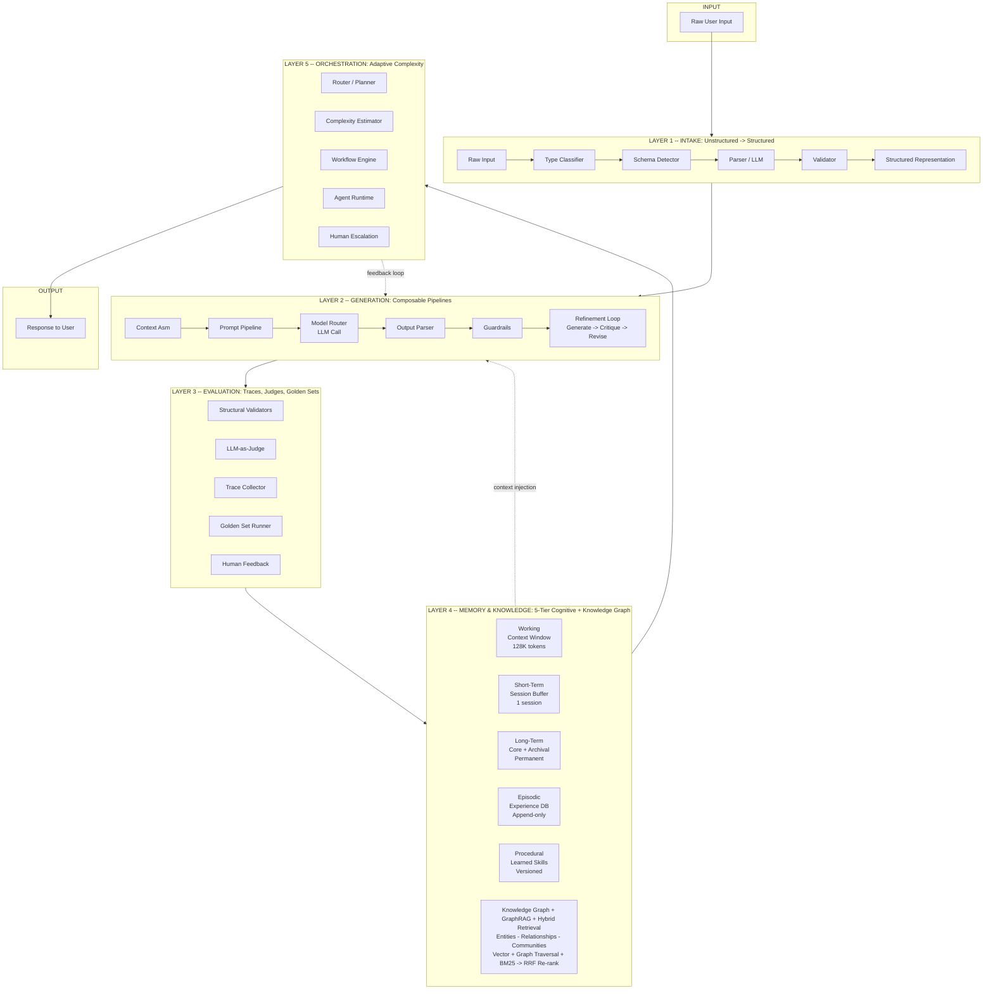
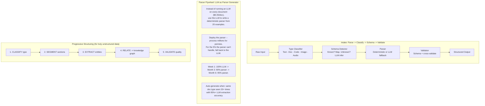
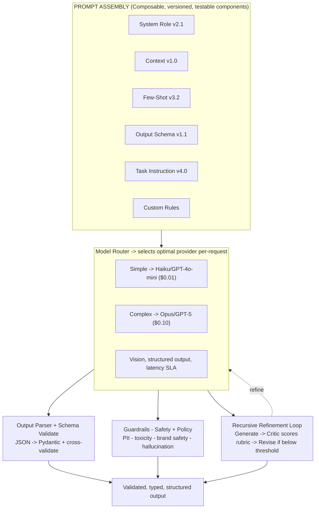
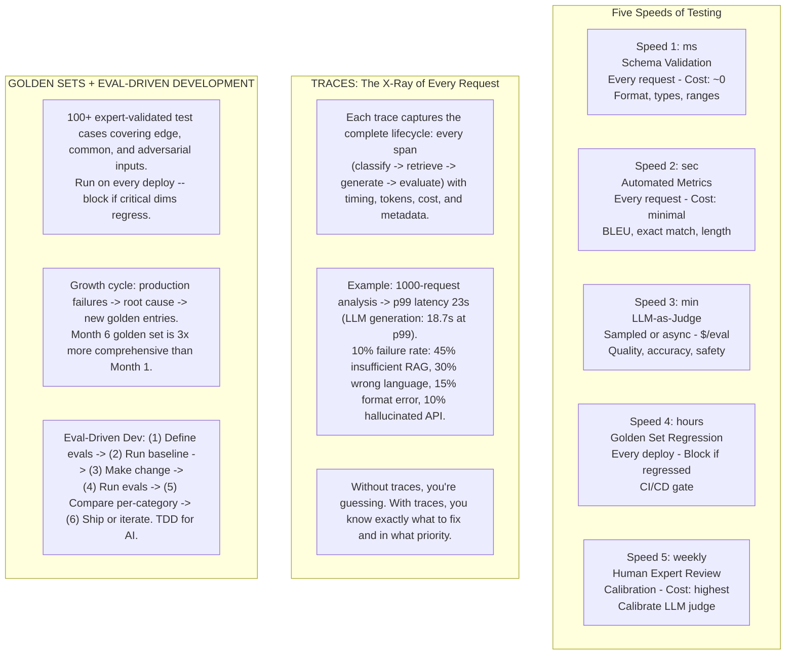

# Design: Production GenAI Architecture

*Universal 5-Layer Blueprint -- 75 min*

---

## Phase 1: Clarify the Problem & Scope *(5--7 min)*

> **Say:** "We're designing a **universal, future-proof architecture for production GenAI systems**. The core insight: every production LLM system is a data transformation pipeline with an LLM as one component -- not a magic box you throw problems at. The architecture has five layers -- Intake, Generation, Evaluation, Memory & Learning, and Orchestration -- each independently swappable. The system must handle structured intake from any modality, composable prompt pipelines, multi-speed evaluation with LLM-as-Judge, five-tier cognitive memory, knowledge graphs with GraphRAG, hybrid retrieval, and adaptive agent orchestration. The architecture survives model changes; the components evolve."

> **Tip:** The hospital analogy: no hospital lets a single doctor handle intake, diagnosis, treatment, quality assurance, and record-keeping simultaneously. **Layer 1** is triage (unstructured -> structured). **Layer 2** is the doctor (LLM diagnosis). **Layer 3** is the second opinion (evaluation). **Layer 4** is the patient chart (memory). **Layer 5** is the administrator routing complex cases (orchestration).

### The Three Laws of Future-Proof GenAI

- **Law 1 -- Separate Concerns:** The LLM is a reasoning engine, not the whole system. Retrieval, evaluation, memory, and orchestration are independent, swappable layers.
- **Law 2 -- Measure Everything:** If you can't evaluate it, you can't improve it. Traces, evals, and golden sets are first-class citizens.
- **Law 3 -- Design for Replacement:** Any model, any prompt, any component should be replaceable without rewriting the system.

### Questions I'd Ask

- **What domain?** — Domain-agnostic reference architecture. We'll use code review, document intelligence, and customer support as concrete instantiations.
- **Input modalities?** — All: text, PDFs, images, code diffs, audio. The Intake Layer normalizes chaos into structured representations before any LLM call.
- **How do we handle model changes?** — Model Abstraction Layer: never call a model directly. A router selects the optimal model per-request based on complexity, latency, cost, and features.
- **How does the system improve over time?** — Experience Database records every strategy + outcome. Episodic memory recalls what worked. Weekly self-improvement cycles auto-fix weak spots.
- **What about retrieval?** — Hybrid: vector search (semantic) + knowledge graph traversal (relationships) + keyword/BM25 (exact match). Reciprocal Rank Fusion merges results. GraphRAG for local entity queries and global thematic analysis.
- **How do we evaluate at scale?** — Five speeds: (1) schema validation on every request, (2) automated metrics, (3) LLM-as-Judge on samples, (4) golden set regression on every deploy, (5) human expert review weekly.

### Agreed Scope

| In Scope | Out of Scope |
|----------|-------------|
| 5-layer universal architecture blueprint | Specific model training / fine-tuning |
| Intake: unstructured -> structured + parser flywheel | MLOps / model deployment infrastructure |
| Generation: composable prompts + model router | Specific vector DB product selection |
| Evaluation: traces + LLM-as-Judge + golden sets | Prompt engineering details per domain |
| 5-tier cognitive memory architecture | RLHF / preference optimization |
| Knowledge Graphs + GraphRAG + hybrid retrieval | Compliance/regulatory frameworks |
| Orchestration: adaptive complexity + agents | Frontend/UX design |

> **Decision:** The defining tension: **flexibility vs. complexity**. A future-proof system requires abstraction layers, eval infrastructure, memory tiers, and observability from day one. But you must ship incrementally -- Week 1 is "prompt -> LLM -> validate -> output." The architecture has slots for all components; the implementation fills them progressively.

---

## Phase 2: Back-of-the-Envelope Estimation *(3--5 min)*

> **Say:** "Numbers for a mid-scale production GenAI system -- say a code review or document intelligence platform. I'll estimate per-request costs, latency budgets, and storage for memory and knowledge graph layers."

| Metric | Value | Detail |
|--------|-------|--------|
| **Requests / Day** | **10K--500K** | Internal tool: ~10K. SaaS platform: ~500K. Burst patterns during business hours. |
| **Latency Budget / Request** | **2--10s** | Intake: ~200ms. Retrieval: ~300ms. LLM: 1--6s (dominates). Evaluation: ~200ms. Total p50: ~2.5s. |
| **Cost / Request** | **$0.01--0.10** | Simple (cheap model): $0.01. Complex (frontier + RAG + refinement): $0.05--0.10. Agent loops: $0.20+. |
| **Context Window Budget** | **128K tokens** | System prompt ~2K. Core memory ~2K. Conversation ~8K. Retrieved context ~20K. Response ~20K. Buffer: ~76K. |
| **Memory Store / User / Year** | **~1 GB** | Core memory: ~2KB always loaded. Archival: ~10KB/session x 250/yr. Episodic: ~5KB x 1K episodes. KG: varies. |
| **Knowledge Graph** | **100K--10M nodes** | Enterprise codebase: ~100K entities. Document corpus: ~1M. Community summaries: 100--500 clusters x 3 hierarchy levels. |
| **Golden Set Size** | **100--1000 cases** | Cover edge, common, adversarial cases. Expert-validated. Run on every deploy. Grows from production failures. |
| **Eval Cost / Deploy** | **$5--50** | 100 cases x $0.05 LLM-as-Judge = $5. 1000 cases = $50. Cheap insurance against regressions. |

> **Tip:** **Parser Flywheel economics:** Week 1: 100% LLM-parsed ($0.05/doc). Month 3: 90% deterministic parser ($0.0001/doc), 10% LLM fallback. Month 6: 95%/5%. The more you process, the cheaper it gets.

---

## Phase 3: High-Level Design *(8--12 min)*

> **Say:** "Every GenAI system maps to five layers. They communicate through typed schemas -- never raw strings. Each layer is independently deployable, testable, and replaceable. Data flows bottom-up with a feedback loop from orchestration back to generation and from memory into context assembly."



### The Abstraction Sandwich

```sql
// The architecture that protects you from model churn

┌──────────────────────────────────────────────┐
│  APPLICATION LOGIC (Yours forever)              │
│  Business rules, workflows, domain knowledge │
├──────────────────────────────────────────────┤
│  ABSTRACTION LAYER (Your insurance)               │
│  Model router, prompt assembler, eval runner │
├──────────────────────────────────────────────┤
│  FOUNDATION LAYER (Will change)                  │
│  Specific models, APIs, embedding services   │
└──────────────────────────────────────────────┘
```

### Key Architectural Decisions

| Decision | Choice | Why Not Alternative |
|----------|--------|-------------------|
| Model coupling | Abstraction Layer (never call directly) | Direct API calls -> vendor lock-in; model deprecations break production |
| Prompt management | Composable versioned components | Monolithic prompts are untestable; can't identify which piece regressed |
| Output format | Schema-first (Pydantic/JSON Schema) | Free-form text is unparseable; format varies by model version |
| Retrieval | Hybrid (vector + graph + keyword) | Vector-only misses exact matches and relationships; keyword-only misses semantics |
| Memory | 5-tier cognitive model | Flat store can't differentiate critical facts from stale trivia |
| Memory control | Self-managed (LLM decides via tools) | External-only management misses semantic nuance of what's worth remembering |
| Evaluation | Multi-speed (schema -> metrics -> judge -> golden -> human) | Single eval is either too slow or misses quality issues |
| Orchestration | Adaptive complexity escalation | Always-agent wastes cost on simple queries; always-pipeline under-serves complex ones |

---

## Phase 4: Deep Dives *(25--30 min)*

### Deep Dive 1 -- Intake Layer & Parser Flywheel (6 min)

> **Goal:** Transform raw chaos (PDFs, code diffs, images, audio) into typed, validated, structured representations before any LLM call.



- **Schema-First Extraction:** Define your output schema (Pydantic model) BEFORE writing the prompt. Use JSON Schema constraints in the LLM call. Parse and validate with the schema. Cross-validate (e.g., line items sum = subtotal). This eliminates format drift across model versions.
- **Parser Flywheel economics:** 10,000 invoices/day x $0.05/LLM parse = $500/day. After the flywheel generates deterministic parsers: 9,500 x $0.0001 + 500 x $0.05 = $25.95/day. A 20x cost reduction that accelerates over time.
- **Real-world use case -- legal contracts:** 500+ contracts/day. LLM classifies contract type, tries deterministic parser first, falls back to LLM extraction with schema enforcement. When a doc type accumulates 20+ examples, an LLM auto-generates a new parser, tests it, registers if >=95% accurate.

### Deep Dive 2 -- Generation Engine: Composable Pipelines (7 min)

> **Goal:** Build a generation layer that's model-agnostic, prompt-versionable, and self-refining.



- **Composable Prompts:** Each prompt component (system role, context, few-shot, output schema, task instruction) is a named, versioned, testable unit. When you switch from GPT-4 to Claude, you change the generation call -- not the prompt assembly. When output requirements change, update the schema component. Each piece iterates independently.
- **Model Abstraction Layer:** Never call `openai.chat.completions.create()` directly. Go through `ModelRouter.route()` which selects provider based on: task complexity (cheap model for simple, frontier for complex), latency SLA, cost budget, feature needs (vision, structured output). When a model is deprecated: change one config line.
- **Recursive Refinement:** Generate -> Critique -> Revise loop. A critic LLM evaluates the draft against a rubric (multi-dimensional: accuracy, actionability, completeness, tone). If score < threshold and iterations remain, revise. Each iteration traced. Typically converges in 1-2 iterations. Max iterations -> flag for human review.

### Deep Dive 3 -- Evaluation Layer: Traces, Judges, Golden Sets (7 min)

> **Goal:** Build the "immune system" -- detect degradation, prove improvement, build trust. This is where most teams fail.



- **LLM-as-Judge:** A separate LLM call evaluates output against a multi-dimensional rubric: accuracy (weight 0.3), security (0.25), actionability (0.25), completeness (0.1), tone (0.1). Scores 1-5 per criterion with specific evidence and suggestions. Returns structured JSON. Judge is calibrated weekly against human expert ratings.
- **Experience Database -> Self-Improvement:** Every request's strategy + outcome is recorded. Weekly: identify weak categories (score < threshold), analyze failure patterns, generate fixes, test against golden set, commit if improved, rollback if not. The system gets better every week without manual intervention.

### Deep Dive 4 -- Memory, Knowledge Graphs & GraphRAG (10 min)

> **Goal:** Solve the amnesia problem. Every LLM call starts from zero. We need a hierarchical, multi-tier memory architecture inspired by cognitive science, plus knowledge graphs for relational reasoning that vector search can't do.

```mermaid
graph TD
    subgraph MEMORY_TIERS["5-Tier Cognitive Memory Architecture"]
        T1M["TIER 1: Working Memory (Context Window = RAM)<br/>System prompt ~2K | Core memory ~2K | Conversation ~8K | RAG results ~20K | Response ~20K<br/>Lifespan: 1 LLM call | Cost: highest (per-token) | Capacity: 128K tokens"]
        T2M["TIER 2: Short-Term (Session Buffer)<br/>Full conversation | Scratchpad notes-to-self | Accumulated state | Tool cache<br/>Lifespan: 1 session. On end -> consolidate: extract facts, record episode, archive raw session."]
        T3M["TIER 3: Long-Term (Core + Archival)<br/>Core: ~2KB always in context (user prefs, key facts). LLM edits via tools.<br/>Archival: unlimited, searched on demand. Vector + keyword + graph. Temporal decay for stale entries."]
        T4M["TIER 4: Episodic (Experience Database)<br/>Situation -> Action -> Outcome chains. 'Have I seen something like this before?'<br/>Enables learning WITHOUT retraining. Recall similar episodes -> inject lessons into prompt."]
        T5M["TIER 5: Procedural (Learned Skills)<br/>Distilled from successful episodes. 'Best known way to do X.' Prompt templates, tool sequences.<br/>Codified when consolidation finds 5+ similar successful episodes with confidence > 0.9."]
    end

    subgraph MEMORY_CONTROLLER["MEMORY CONTROLLER (Orchestrates All Tiers)"]
        MC1["Before every LLM call:"]
        MC2["1. Core memory (always in context) -> 2. Search archival (relevant facts)"]
        MC3["3. Recall episodes (similar experiences) -> 4. Find procedure (learned skills)"]
        MC4["5. Assemble context window (page in, respect token budget)"]
        MC5["After every response: extract facts -> record episode -> update short-term"]
        MC6["Background: consolidation (hourly), procedure learning (weekly), decay (daily)"]
    end

    subgraph KNOWLEDGE_GRAPH["KNOWLEDGE GRAPH + GraphRAG"]
        KG1["Entities (nodes) + Relationships (edges) + Community Summaries (clusters)."]
        KG2["Vector search finds similar text. KG finds connected facts."]
        KG3["LOCAL SEARCH: entity queries<br/>'Who owns auth-service?' -> entity lookup -> traverse neighbors 1-2 hops -> chunks"]
        KG4["GLOBAL SEARCH: thematic queries<br/>'What are the main risks?' -> community summaries -> map-reduce synthesis"]
        KG5["HYBRID RETRIEVAL: Vector + Graph + BM25 -> Reciprocal Rank Fusion<br/>Adaptive weights: tech IDs -> 0.8 keyword. Relationships -> 0.7 graph. Broad -> 0.5 vector."]
        KG6["Temporal KG: bi-temporal model (valid time + system time). Point-in-time + range queries."]
    end

    MEMORY_TIERS -.-> MEMORY_CONTROLLER
    MEMORY_CONTROLLER -.-> KNOWLEDGE_GRAPH
```



- **Context Window = RAM:** Fixed budget. You page in from lower tiers via the Memory Controller, which predicts relevance. Recent conversation kept verbatim; older turns progressively summarized. Core memory (~2KB) always loaded. Archival results paged in per-query. Think: desk (context window) vs. filing cabinet (long-term memory).
- **Self-Managed Memory:** The LLM itself manages its memory via tool calls (`core_memory_update`, `archival_memory_search`, `memory_consolidate`). The LLM has the semantic understanding to decide what's important, relevant, and contradictory. Application code enforces policies (limits, privacy, retention).
- **Temporal Knowledge Graph:** Bi-temporal model tracks when facts were true in the real world (valid time) AND when the system learned about them (system time). Old facts are never deleted -- they're closed and a new version created. Enables: "Who leads auth now?" (current), "Who led auth in Q1?" (point-in-time), "How has auth leadership changed?" (timeline).
- **Community Detection for Global Search:** Leiden algorithm clusters the KG into hierarchical communities (Level 1: 5-10 major themes, Level 2: 20-50 sub-themes, Level 3: 100+ specific topics). Each community gets a pre-computed LLM summary. Global queries read 10-20 summaries and synthesize, instead of scanning every document.
- **Consolidation = Sleep:** Background process clusters related memories, synthesizes higher-level insights, promotes high-confidence insights to core memory, prunes redundant entries, and applies temporal decay (5%/month confidence loss for unaccessed, non-pinned memories). Memories below 0.1 confidence move to cold storage.

### Deep Dive 5 -- Agent Orchestration & Adaptive Complexity (6 min)

> **Goal:** When simple pipelines aren't enough, route requests dynamically. Start with the cheapest approach. Escalate only when quality demands it. Record what works for future routing.

```mermaid
graph TD
    UR[User Request] --> RP2[Router / Planner<br/>Complexity Estimator]
    RP2 --> L1[L1: Direct<br/>1 LLM call - $0.01]
    RP2 --> L2[L2: RAG<br/>Retrieve + Gen - $0.03]
    RP2 --> L3[L3: Pipeline<br/>Multi-step - $0.05]
    RP2 --> L4[L4: Refinement<br/>Gen->Crit->Rev - $0.08]
    RP2 --> L5[L5: Agent<br/>Autonomous - $0.15]
    RP2 --> L6[L6: Multi-Agent<br/>Specialists - $0.30]
    RP2 --> HU[Human]

    L1 --> EVAL[EVALUATION: Score >= threshold?<br/>YES -> return result | NO and budget remains -> escalate to next level | NO and max -> human]
    L2 --> EVAL
    L3 --> EVAL
    L4 --> EVAL
    L5 --> EVAL
    L6 --> EVAL

    EVAL -.->|escalate| L6
    EVAL --> EDB[EXPERIENCE DATABASE: Record strategy + outcome<br/>Over time, router learns to skip directly to the right level for each input type]
    EDB --> SIC[WEEKLY SELF-IMPROVEMENT: Identify weak categories -> Analyze failure patterns -> Generate fixes -> Test against golden set -> Commit if improved, rollback if not]
```

- **Adaptive Escalation:** The complexity estimator routes simple queries (L1-L2) to cheap models, complex multi-step tasks (L3-L4) to pipelines, and open-ended autonomous tasks (L5-L6) to agents. When a level's quality score is insufficient and cost budget remains, the system escalates to the next level. The Experience Database records which level succeeds for which input type, so over time the router skips directly to the optimal level.
- **Multi-Agent Collaboration:** For the most complex tasks, specialized agents (e.g., code reviewer, security auditor, test coverage analyzer) work under an orchestrator agent. Each agent has its own prompt, tools, and evaluation criteria. The orchestrator decomposes the task, assigns sub-tasks, resolves conflicts between agents, and synthesizes the final output.
- **Human-in-the-Loop Escalation:** When automated quality is low and confidence is low, escalate to a human expert with a context summary. The human's corrections feed back into the Experience DB and golden sets, improving the system for similar future inputs.
- **Self-Improvement Cycle:** Weekly: (1) identify weak categories from Experience DB, (2) cluster failure patterns, (3) for each pattern generate a fix (new prompt, new RAG config, new golden entries), (4) test fix against golden set, (5) commit if improved, rollback if regressed. The system gets better every week without manual intervention.

---

## Phase 5: Cross-Cutting Concerns *(10--12 min)*

### Observability: Design for Visibility from Day 1

> **Say:** "Every component must emit standard signals: component name, operation, latency, success/fail, model used, tokens consumed, cost, quality score, confidence, and trace ID. If you can't see it, you can't fix it. Traces reveal exactly what to fix and in what priority."

```sql
AdaptiveOrchestrator.COMPLEXITY_LEVELS

Level 1: direct       Single LLM call, no retrieval                     -> $0.01
Level 2: rag          LLM + retrieval-augmented generation               -> $0.03
Level 3: pipeline     Multi-step decomposition pipeline                  -> $0.05
Level 4: refinement   Generate -> Critique -> Revise loop                  -> $0.08
Level 5: agent        Autonomous agent with tool use                     -> $0.15
Level 6: multi_agent  Multiple specialized agents                        -> $0.30
Level 7: human        Escalate to human expert                           -> $$$

// For each level: execute -> evaluate quality -> if score >= threshold: return
// If score < threshold AND cost < budget: escalate to next level
// Experience DB records which level succeeded for which input type
// Over time, the router learns to skip directly to the right level
```

### Failure Scenarios

| Scenario | Mitigation |
|----------|-----------|
| Model deprecated overnight | Abstraction Layer -> change provider config. Model Router auto-routes to next-best. Golden set regression test validates no quality loss before production traffic. |
| LLM halluccinates output | Schema validation catches format errors. Cross-validation catches arithmetic errors. LLM-as-Judge catches factual errors. Guardrails catch safety issues. Low confidence -> human queue. |
| RAG retrieves irrelevant context | Traces reveal retrieval quality per-request. Hybrid retrieval (vector + graph + BM25) covers different failure modes. Re-ranker cross-encoder scores relevance. Golden set tests retrieval quality. |
| Memory contradiction | Consolidation process detects contradictions. Resolution: newer info wins (default), store both + flag (uncertain), user correction always wins (highest trust). Audit trail for all changes. |
| Context window overflow | Context Window Manager enforces token budgets per section. Older conversation progressively summarized. Retrieved context ranked and truncated. Core memory always fits (~2KB). |
| Knowledge graph entity resolution error | Fuzzy matching + embedding similarity for dedup. Confidence scores on all relationships. Provenance tracking (which source, when extracted). Graph cleanup during consolidation. |
| Cost spike (agent loop runaway) | Per-request cost budget in orchestrator. Max iterations on refinement loops. Adaptive complexity only escalates when quality demands it. Experience DB learns optimal starting level per input type. |
| Eval drift (LLM judge becomes unreliable) | Weekly human expert calibration against LLM judge scores. Track judge-human agreement rate. Re-calibrate judge prompt when agreement drops below threshold. |

### Anti-Patterns: What Goes Wrong

| Anti-Pattern | What Breaks | Correct Approach |
|-------------|------------|-----------------|
| Stuff everything in context | Token budget exceeded, important info pushed out, cost explodes | Tiered memory with intelligent paging via Memory Controller |
| No memory consolidation | Memory grows forever, contradictions accumulate, retrieval degrades | Periodic consolidation: synthesize, prune, decay (5%/month unaccessed) |
| Treat all memories equally | Critical preferences buried under trivia | Tiered importance: core (always loaded ~2KB) vs archival (searched) |
| No temporal awareness | Old facts override new ones, or vice versa, silently | Bi-temporal model: track valid time + system time. Never delete; close + version |
| No forgetting mechanism | System remembers stale, irrelevant info forever | Confidence decay + archival for unaccessed memories below 0.1 threshold |
| External-only memory mgmt | App code decides what to store; misses semantic nuance | Self-managed: LLM decides what's worth remembering via tool calls |
| Extract everything as entities | Noisy graph, slow traversal, low precision | Focused ontology: define entity and relationship types upfront |
| No entity resolution | Same entity appears as multiple nodes in KG | Fuzzy matching + embedding similarity for deduplication |
| Graph without vector search | Can't handle novel queries or semantic matching | Hybrid retrieval: always combine graph + vector + keyword search |
| No community summaries | Global queries require scanning entire graph | Pre-compute hierarchical community summaries via Leiden algorithm |
| Ignoring provenance | Can't trace why system believes something | Track source document, extraction confidence, timestamp for every fact |
| Monolithic prompts | Untestable, can't identify which piece regressed | Composable versioned prompt components, each iterates independently |

### Core Data Schemas

```sql
Trace
  trace_id          UUID
  spans[]            Span[]        -- name, start/end, input/output, metadata, status, error
  total_duration_ms  float
  total_cost_usd     float
  total_tokens       int

GoldenSetEntry
  id                 UUID
  version            string
  input_data         dict
  expected_output    string | null
  evaluation_criteria dict[]
  metadata           dict          -- tags, difficulty, category, source
  created_by         string        -- which expert validated

Experience
  experience_id      UUID
  input_hash         string        -- stable hash of input features
  input_category     string        -- "code_review", "contract_analysis"
  strategy           dict          -- model, prompt version, RAG config
  eval_scores        dict
  outcome            string        -- "success", "partial", "failure"
  lessons            string[]

Episode
  episode_id         UUID
  situation          string        -- what was happening
  strategy           dict          -- what approach was used
  eval_scores        dict          -- how it turned out
  lesson             string        -- what to learn from this
  embedding          float[]       -- for similarity search

TemporalFact
  entity_id          string
  predicate          string        -- "leads", "depends_on", "has_vulnerability"
  object_id          string
  valid_from         datetime      -- when true in real world
  valid_to           datetime?     -- null = still true
  system_from        datetime      -- when system learned this
  source             string
  confidence         float
```

### Complete Pattern Catalog

| Category | Pattern | What It Does |
|----------|---------|-------------|
| Intake | Schema-First Extraction | Define output schema before prompting. Pydantic + JSON Schema constraints. |
| Intake | LLM-as-Parser-Generator | LLM writes deterministic parser code from examples. Deploy parser, save 20x cost. |
| Intake | Progressive Structuring | Classify -> Segment -> Extract -> Relate -> Validate. For truly unstructured data. |
| Intake | Parser Flywheel | Auto-generate parsers as doc types accumulate. 100% LLM -> 5% LLM over 6 months. |
| Generation | Composable Prompts | Versioned, testable prompt components. Each iterates independently. |
| Generation | Model Abstraction Layer | Never call a model directly. Router selects optimal provider per-request. |
| Generation | Recursive Refinement | Generate -> Critique -> Revise loop. Typically converges in 1-2 iterations. |
| Evaluation | LLM-as-Judge | Scalable quality assessment. Multi-dimensional rubric, structured JSON output. |
| Evaluation | Golden Sets | Expert-validated test suites. CI/CD gate. Grows from production failures. |
| Evaluation | Multi-Speed Testing | Schema -> Metrics -> Judge -> Golden -> Human. Five speeds, five cost levels. |
| Memory | 5-Tier Cognitive Model | Working -> Short-Term -> Long-Term -> Episodic -> Procedural. Paging architecture. |
| Memory | Self-Managed Memory | LLM decides what to store/retrieve via tool calls. App enforces policies. |
| Memory | Memory Consolidation | Background: cluster, synthesize, prune, decay. Like brain during sleep. |
| Knowledge | Knowledge Graph | Entities + relationships. Entity resolution via fuzzy match + embedding. |
| Knowledge | GraphRAG (Local) | Entity -> traverse neighbors -> connected chunks. For specific entity queries. |
| Knowledge | GraphRAG (Global) | Community summaries -> map-reduce synthesis. For broad thematic queries. |
| Knowledge | Hybrid Retrieval | Vector + Graph + BM25 -> Reciprocal Rank Fusion -> cross-encoder re-rank. |
| Knowledge | Temporal KG | Bi-temporal facts (valid time + system time). Point-in-time + range queries. |
| Orchestration | Adaptive Escalation | Direct -> RAG -> Pipeline -> Agent -> Human. Start cheap, escalate when needed. |
| Architecture | Abstraction Sandwich | App Logic / Abstraction / Foundation. Foundation changes; app logic doesn't. |
| Architecture | Schema-First Design | Typed contracts between all components. Pydantic models, not raw strings. |
| Architecture | Progressive Enhancement | Ship Week 1, add capability each week. System always production-ready. |

---

## Phase 6: Wrap-Up -- Progressive Enhancement Timeline *(3--5 min)*

### Build Incrementally -- Never Big-Bang

- **Week 1:** Prompt -> LLM -> Output + Schema validation + Basic logging. Production-ready for simple use cases.
- **Week 2:** + RAG retrieval + LLM-as-Judge eval + Trace collection. Now you can measure quality.
- **Week 3:** + Golden set tests + Experience database + Model routing (cheap vs. expensive). Cost optimization begins.
- **Week 4:** + Recursive refinement + Confidence-based escalation + Human-in-the-loop. Quality ceiling rises.
- **Month 2:** + Multi-step pipelines + Parser generation flywheel + Automated improvement cycles. Self-improving system.
- **Month 3:** + Agent orchestration + Knowledge graph + Memory tiers. Full cognitive architecture.
- **Month 4:** + GraphRAG (local + global search) + Community detection + Temporal KG. Enterprise-grade knowledge system.

> **Tip:** At each stage, the system is production-ready. Each addition is validated against evals before shipping. The architecture has slots for all components; the implementation fills them progressively. **Design must be complete from day one -- because retrofitting memory onto a stateless system is 10x harder than building in the extension points.**

### Real-World Instantiations

| Domain | Intake | Generation | Evaluation | Memory |
|--------|--------|-----------|------------|--------|
| Code Review | AST-level diff parsing. Classify: bug fix, feature, refactor. | Structured CodeReview schema. Confidence-scored findings. | Resolution rate (did dev fix it?). BugBench golden set. | Experience DB: winning model/prompt per language. KG: service dependencies. |
| Legal Documents | Parser Flywheel for 500+ contracts/day. 95% deterministic by Month 6. | Clause extraction, risk assessment, template comparison. | Lawyer reviews + corrections. Risk accuracy golden set. | Contract KG: parties, obligations, dependencies. Temporal: terms change over time. |
| Customer Support | Intent classification + sentiment analysis. | RAG over knowledge base + past tickets. Confidence-based routing. | CSAT surveys + agent edits of AI drafts. | Weekly self-improvement cycle: failure analysis -> prompt refinement -> golden set growth. |

### The Final Insight

> **Say:** "Models come and go. Prompts get rewritten. APIs change. The patterns -- intake, generation, evaluation, memory, orchestration -- those are permanent. Build the architecture once. Build it right. Everything else is configuration. When someone asks you to build a second GenAI system, you reuse 70-80% of the architecture. The patterns are durable. The implementations evolve."

---

## Interview Q&A -- Practice

**Q: Why shouldn't you just send everything to the LLM and parse the output?**

**A:** "Three reasons. First, cost: running an LLM on every document at $0.05 each adds up to $500/day for 10K documents. The Parser Flywheel pattern generates deterministic parsers from examples, reducing cost to $0.0001/doc for 90-95% of inputs within months. Second, reliability: LLM outputs are nondeterministic -- the same invoice might parse differently on Tuesday than Monday, or differently after a model update. Schema-first extraction with Pydantic validation catches format drift. Cross-validation catches arithmetic errors. Third, speed: a deterministic parser runs in milliseconds; an LLM call takes seconds. The insight is: you don't need the LLM to read every document -- you need it to teach you how to read documents."

**Q: How does the 5-tier memory architecture differ from just using RAG?**

**A:** "RAG is one retrieval mechanism. The 5-tier cognitive model is a complete memory system. Working Memory is the context window -- your most precious, expensive resource. Short-Term Memory holds the full session state including scratchpad notes and accumulated reasoning, then consolidates durable knowledge at session end. Long-Term Memory has two stores: Core Memory (~2KB always in context -- user preferences, key facts) and Archival Memory (unlimited, searched on demand). Episodic Memory stores situation-action-outcome chains -- 'last time I saw a similar PR, what worked?' -- enabling learning without retraining. Procedural Memory stores codified skills distilled from successful episodes. The key design choice: the LLM itself manages its memory through tool calls, because it has the semantic understanding to decide what's important. RAG is just one retrieval modality feeding into the working memory. The full system also uses graph traversal, keyword search, and re-ranking."

**Q: When would you use GraphRAG versus pure vector search?**

**A:** "Vector search finds semantically similar text. It's great for 'find me documents about authentication' but fails at 'how does the auth service connect to billing?' -- that requires traversing relationships. GraphRAG adds a knowledge graph with entity resolution and community detection. For local queries -- specific entity questions like 'who owns the auth service?' -- you look up the entity, traverse 1-2 hops of relationships, and retrieve connected source chunks. For global queries -- broad themes like 'what are the main risks across our platform?' -- you can't answer by retrieving a few chunks. Instead, you use pre-computed community summaries: the Leiden algorithm clusters the graph hierarchically, each cluster gets an LLM summary, and global queries read 10-20 summaries and synthesize. The temporal knowledge graph adds a bi-temporal model so you can query point-in-time facts. In production, you always combine all three: vector + graph + BM25 keyword, merged via Reciprocal Rank Fusion, then re-ranked with a cross-encoder."

**Q: How do you prevent evaluation drift -- the LLM judge becoming unreliable?**

**A:** "The multi-speed testing architecture handles this. Speed 1-2 (schema validation, automated metrics) are deterministic -- they never drift. Speed 3 (LLM-as-Judge) is the one that can drift: the judge model may be updated, the rubric may not cover new failure modes, or the judge may develop blind spots. The countermeasure is Speed 5: weekly human expert calibration. Domain experts score a sample of outputs independently, then we compare judge scores against human scores. If agreement drops below threshold, we recalibrate the judge prompt -- usually by adding new failure examples or adjusting criteria weights. Speed 4 (golden sets) provides the safety net: even if the judge drifts, the golden set regression tests catch it because golden sets are anchored to expert-validated ground truth, not to the judge. The key insight: every evaluation method has failure modes, so you layer them. Schema validation catches format errors. Automated metrics catch obvious regressions. LLM-as-Judge catches quality issues. Golden sets catch systematic drift. Humans calibrate everything."

**Q: How do you make this architecture cost-effective when frontier models charge $0.01-0.10 per request?**

**A:** "Four strategies working together. First, Adaptive Complexity Escalation: start with the cheapest approach (single LLM call, small model) and only escalate when the evaluation layer reports insufficient quality. The Experience Database learns which complexity level succeeds for which input type, so over time the router skips directly to the right level instead of always starting at Level 1. Second, Model Routing: simple tasks go to cheap models (Haiku, GPT-4o-mini at $0.001/request), only complex tasks go to frontier models (Opus at $0.10/request). The router learns from the Experience DB which model works best for each input category. Third, the Parser Flywheel: document processing costs drop 20x over 6 months as deterministic parsers replace LLM calls. Fourth, caching and reuse: if the Experience DB has a high-quality response for a very similar input, skip generation entirely. In Alice's code review system, the average cost settled at $0.04/review with 94% developer satisfaction -- because most TypeScript PRs use a mid-tier model, only complex multi-file refactors get the frontier model."

**Q: What's the hardest thing about adding memory to a production LLM system?**

**A:** "Contradiction resolution and memory bloat. Without consolidation, memory grows forever: every session adds facts, many of which are redundant or contradictory. In March the system learns 'Alice leads auth.' In July, 'Bob leads auth.' A naive system keeps both, or overwrites without history. The bi-temporal model solves this for facts: it tracks when something was true (valid time) and when the system learned it (system time). The consolidation process -- inspired by how the brain consolidates during sleep -- runs periodically to cluster related memories, synthesize higher-level insights, prune redundant entries, and apply temporal decay to unaccessed memories. The hardest design decision is self-managed vs. external memory management. We chose self-managed: the LLM calls memory tools because it has the semantic understanding to decide what's worth remembering. But you must enforce policies -- storage limits, privacy rules, retention periods -- in the application layer. The LLM drives content decisions; the infrastructure enforces constraints. Getting this boundary right is the hardest part."

**Q: Walk me through how the system handles a query that requires both local entity lookup and broad thematic analysis.**

**A:** "Consider: 'What risks does the auth service face based on patterns across our platform?' This is a hybrid query -- it needs local search (auth service entity and its neighborhood) AND global search (risk patterns across communities). The query analyzer detects both intents. Path 1: entity lookup finds 'auth-service' in the knowledge graph, traverses 1-2 hops to find dependencies, owners, recent PRs, and vulnerabilities. Path 2: community summaries for risk-related clusters are retrieved -- the Leiden algorithm has already clustered the graph into themes like 'authentication & security,' 'billing & payments,' 'infrastructure.' Each community has a pre-computed LLM summary. The system reads the relevant community summaries and runs a map-reduce synthesis. Both paths run in parallel. Results are merged via Reciprocal Rank Fusion -- each result gets a score of weight/(k + rank) and documents appearing in both lists get boosted. A cross-encoder re-ranks the final set. The context assembly step fits everything into the token budget: graph-structured context for the entity neighborhood, plus synthesized community insights for the thematic patterns. The LLM generates an answer grounded in both specific facts about auth-service and broad patterns across the platform."

**Q: How does this architecture compare to just using a framework like LangChain or LangGraph?**

**A:** "Frameworks are implementations; this is architecture. LangChain gives you chains and agents. LangGraph gives you graph-based state machines. CrewAI gives you multi-agent collaboration. But none of them give you the complete production architecture: intake normalization, composable versioned prompts, multi-speed evaluation with golden sets, five-tier cognitive memory, knowledge graphs with GraphRAG, temporal facts, or the experience database that enables self-improvement. Frameworks handle Layer 2 (generation) and parts of Layer 5 (orchestration). The architecture handles all five layers plus the cross-cutting concerns: traces, evaluation, memory management, and the feedback loops that make the system improve over time. In practice, you'd use a framework as one component inside this architecture. LangGraph might power your agent runtime in the orchestration layer. But the intake layer, evaluation layer, memory controller, knowledge graph, and experience database -- those are yours. The framework is the doctor's stethoscope; this architecture is the hospital."
