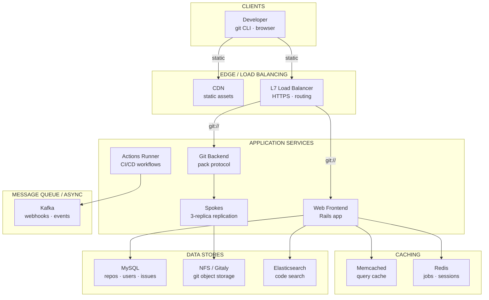
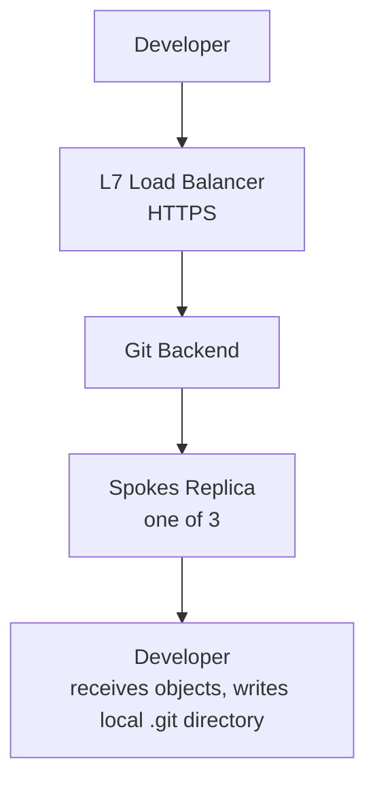
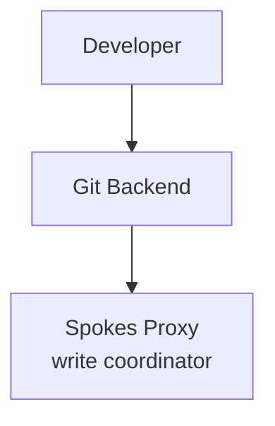
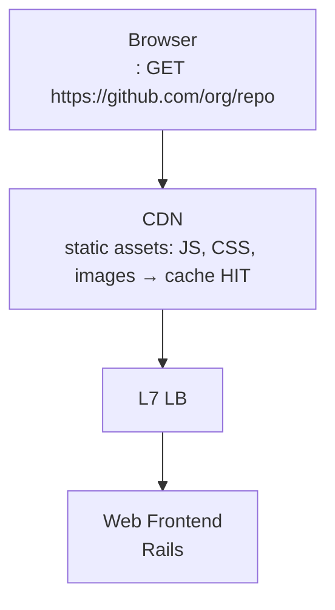

# Design GitHub
*Code Hosting & Collaboration · 75 min*

## Phase 01: Clarify the Problem & Scope *(5–7 min)*

> **Say:** "We're designing a code hosting and collaboration platform like GitHub. Developers push code via Git over HTTPS/SSH, browse repositories through a web UI, collaborate via pull requests with code review, track work with issues, search across billions of files, and run CI/CD workflows. The fundamental challenge: Git is a DISTRIBUTED version control system designed for local use — we must host 400M+ repositories centrally while maintaining Git's semantics, ensuring zero data loss, and serving a massive read-heavy traffic pattern."

### Questions I'd Ask

- **What outcome is the platform optimizing for?** *→ Developer velocity: code-to-production cycle time. How fast can a developer go from idea → commit → PR → review → merge → deploy? Secondary: collaboration quality (PR review turnaround, code review coverage). This shapes architecture: git push must be fast, PR creation instant, CI integration seamless. Any friction in the inner loop multiplies across millions of developers.*
- **Core operations?** *→ git push, git clone/fetch/pull (the hot path), web UI browsing (file tree, diff, blame), Pull Requests (create, review, merge), Issues, Search, Actions/CI.*
- **Protocols?** *→ Git over HTTPS (majority of traffic) and Git over SSH. Web API (REST + GraphQL). WebSockets for real-time updates.*
- **Read:write ratio for Git ops?** *→ Extremely read-heavy. ~50:1 or higher. Clones and fetches dominate. Pushes are relatively rare.*
- **Scale?** *→ ~150M developers, ~420M repositories, ~3B files indexed for search, ~100M pull requests/year.*
- **Data durability requirement?** *→ Absolute. Losing a repository's data is catastrophic. Three replicas minimum.*

### Agreed Scope

| In Scope | Out of Scope |
| --- | --- |
| Git hosting (push/clone/fetch over HTTPS+SSH) | GitHub Copilot / AI features |
| Repository storage & replication (Spokes) | GitHub Packages (registry) |
| Web UI (file browsing, diffs, blame) | GitHub Pages (static hosting) |
| Pull Request workflow (review, merge) | GitHub Mobile (client app) |
| Code search across all repos | Billing / marketplace |
| CI/CD (Actions) — high level | GitHub Codespaces (cloud IDE) |
| Webhooks & notifications | Enterprise Server (on-prem) |

### Core Use Cases

- **UC1 (Clone/Fetch):** Developer runs `git clone https://github.com/org/repo` → system locates repo replica, streams packfile to client. Must handle repos from 1 KB to 100 GB.
- **UC2 (Push):** Developer runs `git push` → system receives new objects, updates refs, replicates to all replicas atomically, fires webhooks, triggers Actions.
- **UC3 (Pull Request):** Developer opens PR → system computes diff, runs merge checks, enables code review (inline comments, approvals), and merges when ready.
- **UC4 (Browse):** User visits `github.com/org/repo` → system renders file tree, README, commit history. Most visited page on GitHub. Must be sub-second.
- **UC5 (Search):** Developer searches `"handleAuth" language:typescript` → system searches across 3B+ files and returns results in seconds.

### Non-Functional Requirements

- **Durability:** Zero repository data loss. Every push is replicated to 3 independent servers before being acknowledged.
- **Availability:** Git reads (clone/fetch) must remain available even if a replica server fails. 99.99% target.
- **Latency:** Web UI page load <500ms. Git clone of medium repo (<1GB) starts streaming within 1-2s.
- **Consistency:** After a successful `git push`, all subsequent reads (from any replica) must see the new refs. Strong consistency for writes.
- **Isolation:** A "hot" repository (millions of clones) must not degrade performance for other repos sharing the same server ("fate sharing" avoidance).

> **Tip:** The defining tension: Git is a CONTENT-ADDRESSED OBJECT STORE where every object is identified by its SHA hash. This gives us automatic deduplication and integrity checking, but makes sharding non-trivial — a repository is a DAG of objects that must be colocated. The architecture must replicate ENTIRE REPOSITORIES (not individual objects) across servers while maintaining strong consistency on ref updates (branch pointers).

## Phase 02: Back-of-the-Envelope Estimation *(3–5 min)*

| Metric | Value | Detail |
| --- | --- | --- |
| Repositories | ~420M | From tiny 1-file repos to monorepos with 100GB+. Long tail distribution. |
| Developers | ~150M | ~30M DAU. Peak concurrent: ~5M. |
| Git Operations / Day | ~500M | ~400M reads (clone/fetch), ~100M writes (push). ~50:1 read:write ratio. |
| Git Reads / Sec (peak) | ~10K | Each read streams a packfile. Heavy I/O — megabytes per request. |
| Git Pushes / Sec (peak) | ~2K | Each push: receive objects + update refs + replicate to 3 servers. |
| Web/API Requests / Sec | ~200K | File browsing, PR pages, API calls. Mostly cacheable. CDN-served for assets. |
| Total Git Object Storage | ~100+ PB | 420M repos × avg ~250MB compressed. 3 replicas = ~300 PB raw. Deduplication (forks share objects) reduces significantly. |
| PR Merges / Day | ~2M | Each merge: compute merge commit, update refs, trigger webhooks + Actions. |

> **Decision:** **Key insight #1:** Git operations are I/O-heavy, not compute-heavy. A `git clone` of a 500MB repo requires streaming 500MB of packfile from disk to network. The bottleneck is disk throughput and network bandwidth, not CPU. This means the storage layer design dominates everything.

> **Decision:** **Key insight #2:** 420M repos can't fit on one server. But repos are independent — they don't reference each other (except forks). This makes SHARDING straightforward: partition repos across storage servers. Each repo lives on exactly one set of 3 replica servers. The routing layer maps repo → server set.

> **Decision:** **Key insight #3:** The 50:1 read:write ratio means we can serve reads from ANY of the 3 replicas (load balancing), but writes must be serialized and replicated to ALL 3 (strong consistency). This is the classic "reads scale, writes are the bottleneck" pattern.

## Phase 03: High-Level Design *(8–12 min)*

> **Say:** "The architecture has TWO distinct traffic paths: (1) Git protocol traffic (clone/fetch/push over HTTPS and SSH) — heavy I/O, streams packfiles, hits the storage layer directly. (2) Web/API traffic — renders UI pages, handles PRs, issues, search — backed by MySQL + caches. Let me draw both."

### Key Architecture Decisions

> **Say:** "Here's WHY I chose each technology — mapping requirements to tradeoffs. Every choice has a rejected alternative and a consequence."

| Requirement | Decision | Why (and what was rejected) | Consistency |
| --- | --- | --- | --- |
| Zero repository data loss | Spokes: 3-replica synchronous replication | Push not acknowledged until all 3 replicas confirm. Git-level replication understands packfile semantics. Disk-level (DRBD) doesn't. | CP |
| Repository data is filesystem, not relational | NFS/Gitaly (not MySQL for git objects) | Git objects are a DAG of files. Storing packfiles in a relational DB adds overhead with zero benefit. Filesystem is the natural fit. | — |
| Metadata: repos, issues, PRs need joins | MySQL sharded by repo_id (Vitess) | Most queries are repo-scoped. Vitess manages shard routing. All repo data co-located for single-shard queries. | CP |
| Code search across 200M repos | Custom trigram index (not Elasticsearch) | Trigram index enables regex search. ES can't do arbitrary regex. Trigram pre-filtering reduces search space 99.99%. | — |
| Massive read amplification on web UI | Memcached for query result caching | A single repo page triggers dozens of DB queries. Memcached reduces DB load 10x. Simple GET/SET — no data structures needed. | — |
| CI: ephemeral, untrusted code execution | Ephemeral VMs (not containers) | Hardware-level isolation. Container escape = game over for shared kernel. VMs destroyed after each workflow run. | — |

### Major Components



#### Load Balancers [INGRESS]
- L7 (HTTPS): web UI, API, git-over-HTTPS
- L4 (TCP): git-over-SSH (long-lived connections)
- Separate LBs — different traffic profiles

#### Web Frontend [APP]
- Ruby on Rails application
- Renders pages: file tree, PRs, issues, diffs
- REST API + GraphQL API
- Stateless — scales horizontally

#### SSH Gateway [AUTH]
- Terminates SSH, authenticates public keys
- Maps SSH key → user account → repo permissions
- Proxies Git protocol to Git Backend

#### Git Backend (RPC) [CORE]
- Stateless workers that execute Git operations
- git-upload-pack (for clone/fetch)
- git-receive-pack (for push)
- Talks to Spokes for storage layer access

#### Spokes (Git Storage) [STORAGE]
- 3 replicas per repo on 3 independent servers
- Three-phase commit for writes
- Reads load-balanced across replicas
- Federated filesystem (bare metal, ext4)

#### MySQL (Metadata) [DATA]
- Users, orgs, permissions, repo metadata
- PRs, issues, comments, reviews
- Sharded by repo_id / org_id
- Strong consistency for permissions

#### Search Service [SEARCH]
- Code search across 3B+ files
- Custom search engine (not Elasticsearch)
- Indexes trigrams for substring matching
- Async re-index on push events

#### Actions (CI/CD) [COMPUTE]
- Event-driven: triggered by push, PR, schedule
- Job queue → runner pool (ephemeral VMs)
- Artifacts stored in object storage (S3/Azure Blob)

### Flow 1: git clone (read path)



### Flow 2: git push (write path)



### Flow 3: Web UI (browse repository)



> **Say:** "I want to deep-dive: (1) Spokes — the Git storage and replication system that's the heart of GitHub. (2) The Pull Request workflow — how diffs, reviews, and merges work at scale. (3) Code search across 3B files. (4) Actions/CI pipeline architecture."

## Phase 04: Deep Dives *(25–30 min)*

### Deep Dive 1: Git Storage & Spokes Replication (~10 min)

> **Goal:** **The core challenge:** Store 420M Git repositories on distributed servers with 3× replication, strong consistency on writes, load-balanced reads, and zero data loss — while handling the extreme diversity from tiny repos to 100GB+ monorepos.

**How Git Stores Data (quick primer)**

```sql
── Git Object Model ──

Git stores everything as content-addressed objects in a DAG:

blob     → file contents (SHA-1 of content)
tree     → directory listing (references blobs and other trees)
commit   → snapshot (references a tree + parent commit(s) + metadata)
tag      → named pointer to a commit

refs (branches, tags) → human-readable pointers to commit SHAs
  e.g., refs/heads/main → abc123def456

A "repository" = a collection of objects + refs.
Objects are immutable and content-addressed.
Refs are mutable pointers (the ONLY mutable state in Git).
For storage efficiency, objects are packed into "packfiles"
which use delta compression (store diffs between similar objects).
```

**Spokes Architecture**

- **Three replicas per repo:** Every repo is stored as a bare Git repository on 3 independently chosen file servers. Servers are bare metal machines with ext4 filesystems and large SSDs.
- **Routing table:** A mapping from `repo_id → [server_A, server_B, server_C]`. Stored in MySQL, cached aggressively. The Git Backend looks up this table to find where a repo lives.
- **Reads:** Served from ANY of the 3 replicas. Load-balanced for performance. If one replica is busy or down, reads route to another.
- **Writes:** Coordinated by a Spokes proxy via three-phase commit across all 3 replicas. Write succeeds only if ALL 3 replicas confirm.

**Three-Phase Commit (Write Path)**

```sql
── Spokes Write Protocol ──
Phase 1: PREPARE
  Spokes proxy sends new Git objects (packfile) to all 3 replicas.
  Each replica receives and stores objects locally (quarantine area).
  Replica responds: "objects received, ready to update refs."

Phase 2: LOCK
  Proxy instructs all replicas to lock the affected refs.
  Each replica verifies preconditions:
    - Is the ref still pointing where the client expects? (no concurrent push)
    - Are all required objects present?
  Replica responds: "refs locked, preconditions verified."
  If ANY replica fails → ABORT (release locks, discard objects).

Phase 3: COMMIT
  Proxy instructs all replicas to atomically update refs.
  Each replica: move refs to new SHA, release locks.
  Proxy waits for all 3 confirmations → ACK success to client.

Why 3-phase, not 2-phase?
The LOCK phase ensures all replicas can commit BEFORE any does.
This prevents a state where 1 replica commits but another can't
(e.g., due to concurrent push conflict), leaving replicas inconsistent.
```

> **Decision:** **Why replicate at the Git application layer, not the disk layer (DRBD/RAID)?** Disk-level replication treats repos as opaque bytes — it can't understand Git semantics (ref updates, object integrity). Application-level replication leverages Git's own protocol: send packfiles, update refs transactionally. This gives us: (1) replica-level consistency checks (SHA verification), (2) the ability to route repos to ANY 3 servers (not fixed pairs), (3) re-replication to any new server on failure (just `git clone` internally). Tradeoff: more complex protocol than DRBD, but dramatically more flexible and reliable.

**Handling Hot Repos & Fate Sharing**

- **Problem:** A viral repo (millions of clones) on Server A degrades performance for ALL other repos on Server A.
- **Solution:** Monitor per-server I/O load. If a repo becomes "hot," Spokes can add additional read replicas (temporarily increase from 3 to 5+) and rebalance the routing table. The hot repo's reads spread across more servers.
- **Fork deduplication:** When a repo is forked, the fork initially shares the same object store (objects are content-addressed, identical). Only new objects from the fork are stored separately. This saves enormous storage — a repo with 10K forks doesn't store 10K copies of the same objects.

> **Tip:** **Checksums for replica consistency:** Spokes computes incremental checksums of each replica's refs. If replicas' checksums diverge (indicating inconsistency), a repair process kicks in — compares refs, identifies the divergence, and re-syncs. This is cheap to compute incrementally (updated on every ref change) rather than requiring a full scan.

### Deep Dive 2: Pull Request Workflow (~7 min)

> **Goal:** **The core challenge:** PRs are GitHub's killer feature. A PR combines: diff computation (potentially huge), code review (inline comments, threads, approvals), status checks (CI results), merge conflict detection, and the merge itself — all backed by Git operations but presented as a web collaboration workflow.

**PR Data Model**

```sql
pull_requests
id BIGINT PK
repo_id BIGINT FK → repositories
  number           INT (per-repo sequential: PR #42)
author_id BIGINT FK → users
  head_ref         VARCHAR (source branch: "feature/auth")
  head_sha         CHAR(40) (current HEAD of source branch)
  base_ref         VARCHAR (target branch: "main")
  base_sha         CHAR(40) (target branch HEAD at PR creation)
  merge_commit_sha CHAR(40) NULL (set after merge)
  state            ENUM (open, closed, merged)
  mergeable        ENUM (mergeable, conflicting, checking, unknown)
  title            TEXT
  body             TEXT (markdown)
  created_at       TIMESTAMP
reviews
id, pr_id, reviewer_id, state (approved/changes_requested/commented), body

review_comments
id, review_id, pr_id, path, line, side (left/right), body

status_checks
id, pr_id, sha, context ("CI/build"), state (pending/success/failure), target_url
```

**Diff Computation**

- **What:** The diff between `base_sha` (target branch) and `head_sha` (source branch). Actually a three-way diff: find the merge base, then diff base→head and base→target.
- **Where:** Computed on the Git Backend by calling `git diff` on the Spokes replica. For large diffs (thousands of files), this is expensive.
- **Caching:** Diffs are cached by the key `(base_sha, head_sha)`. Since SHAs are immutable, this cache NEVER needs invalidation. A new push to the PR branch changes `head_sha` → new cache key → new diff computed. Old cache entries still valid (for viewing old versions of the PR).
- **Mergeability check:** Async background job runs `git merge --no-commit` to test if the PR can merge cleanly. Result stored in `mergeable` field. Re-computed when either branch changes.

> **Decision:** **Why cache diffs by SHA pair, not by PR ID?** A PR's diff changes every time someone pushes to the head branch or the base branch advances. SHA pairs are immutable — the diff between two specific commits never changes. This gives us a perfectly content-addressed cache with no invalidation logic. Tradeoff: storage (many diff caches per PR as it evolves), but diffs compress well and old ones are evicted by LRU.

**Merge Strategies**

| Strategy | Git Command | Result |
| --- | --- | --- |
| Merge commit | git merge --no-ff | Creates a merge commit with two parents. Preserves full branch history. |
| Squash and merge | git merge --squash | Combines all PR commits into a single commit on the target branch. Clean history. |
| Rebase and merge | git rebase + fast-forward | Replays PR commits on top of target. Linear history. No merge commit. |

- Merge operation is a `git push` under the hood — goes through the full Spokes three-phase commit.
- Branch protection rules checked server-side BEFORE the merge: required reviewers? required status checks passed? no force-push?
- Merge queue (for busy repos): PRs lined up and merged sequentially, each tested against the latest base. Prevents "merge skew" where two PRs that individually pass CI break when combined.

### Deep Dive 3: Code Search (~5 min)

> **Goal:** **The core challenge:** Search across 3B+ files in 420M repos for arbitrary code patterns. Must support: exact string match, regex, language filtering, file path filtering, and return results in seconds.

- **Index structure:** Trigram index. Every 3-character subsequence of every file is indexed. Query `"handleAuth"` → look up trigrams `han, and, ndl, dle, leA, eAu, Aut, uth` → intersect posting lists → candidate files → verify with full-text scan.
- **Index size:** ~150 TB for 3B files. Distributed across a cluster of search nodes. Sharded by repository.
- **Indexing pipeline:** Push event → Kafka → search indexer reads new/changed files from Spokes replica → updates trigram index. Near-real-time: new code searchable within ~30 seconds of push.
- **Ranking:** Results ranked by: repo popularity (stars, forks), file path relevance, number of matches, language match. Not just "first match found."
- **Scope:** User can scope to a single repo, an org, or all of GitHub. Single-repo search uses the repo's own index partition → very fast. Global search fans out across all partitions → slower but still seconds.

> **Decision:** **Why a custom search engine, not Elasticsearch?** Code search has unique requirements: trigram matching (not word tokenization), regex support, language-aware parsing, and extreme scale (3B files). Elasticsearch's inverted index is designed for natural language text, not code. A custom trigram-based engine gives better precision for code patterns (e.g., `func.*Auth` regex) and can be optimized for the specific query patterns developers use. Tradeoff: massive engineering investment to build and maintain a custom search engine.

### Deep Dive 4: Actions / CI Pipeline (~5 min)

> **Goal:** **The core challenge:** Every push and PR can trigger CI workflows — build, test, lint, deploy. This is COMPUTE-HEAVY, UNPREDICTABLE, and must scale independently of the Git hosting layer.

```sql
── Actions Architecture ──
Event Trigger:
  git push / PR open / schedule / manual dispatch
      │
▼
Event Dispatcher:
  Matches event against all .github/workflows/*.yml in the repo
  Creates job graph (workflow → jobs → steps, with dependencies)
      │
▼
Job Queue:  (persistent, durable — no job lost)
  Jobs queued by priority: paid accounts > free tier
  Queued jobs wait for a runner to become available
      │
▼
Runner Pool:
GitHub-hosted: ephemeral VMs (Linux, macOS, Windows)
    - Fresh VM per job. No state leakage between jobs.
    - Destroyed after job completes.
    - Auto-scaled based on queue depth.
  Self-hosted: customer's own machines registered as runners
      │
▼
Execution:
  Runner clones repo (from Spokes), executes workflow steps
  Logs streamed in real-time to GitHub (stored in blob storage)
  Artifacts uploaded to object storage (S3/Azure Blob)
  Status checks posted back to the PR
```

> **Decision:** **Why ephemeral VMs, not containers?** Security is paramount — workflows run UNTRUSTED code (any contributor can modify a workflow file). Containers share a kernel with the host — a kernel exploit could escape. Ephemeral VMs provide hardware-level isolation via hypervisor. Each job gets a fresh VM, and it's destroyed after completion. Tradeoff: VMs have longer startup time (~20-40s) than containers (~2s), and are more expensive. For self-hosted runners, customers CAN use containers — but they accept the security tradeoff.

## Phase 05: Cross-Cutting Concerns *(10–12 min)*

### Storage Architecture Summary

> **Goal:** **What goes where and why.** Each data store is chosen for its access pattern — not by default. The question isn't "which database?" but "what are the read/write patterns, consistency requirements, and scale characteristics?"

| Data | Store | Why This Store |
| --- | --- | --- |
| Repository metadata | MySQL (sharded) | Repos, issues, PRs, users. Sharded by repo_id. Vitess for shard management. Heavy read load from web UI. |
| Git objects (packfiles) | NFS → Gitaly | Actual git data. 3-replica Spokes replication. Append-only (git objects are immutable). ~200M repos. |
| Code search index | Elasticsearch | Source code indexed for full-text search. Updated on push via Kafka event. Trigram index for regex search. |
| Background jobs | Redis | Sidekiq job queue for webhooks, notifications, CI triggers. Job state and dedup keys. |
| Session & cache | Memcached | Page fragment caching. User sessions. DB query result caching. Massive read amplification reduction. |
| Webhook events | Kafka | push, pull_request, issues events. Consumed by Actions, external integrations, analytics. |
| CI artifacts & logs | S3 | Actions workflow logs, build artifacts. Lifecycle policy for retention (90 days default). |

### Failure Scenarios

| Scenario | Mitigation |
| --- | --- |
| Spokes replica server dies | 2 surviving replicas continue serving reads immediately. Writes degrade: Spokes proxy detects failure, can operate in 2-of-3 mode (reduced durability) or fail writes until a replacement replica is provisioned. Background process re-replicates affected repos to a new server. Zero data loss as long as 1 replica survives. |
| Concurrent pushes to same branch | Spokes lock prevents concurrent ref updates. Second push fails with "non-fast-forward" error (standard Git behavior). Developer must pull first. This is by design — Git's concurrency model is optimistic locking on refs. |
| 100 GB monorepo clone hammers storage | Git protocol supports partial clone (--filter=blob:none) and shallow clone (--depth=1) to reduce data transfer. Server-side: packfile generation is the bottleneck — rate-limited per-repo to prevent one clone from saturating the server. Large repos can have pre-computed packfiles cached. |
| DDoS on popular repo (millions of clones) | CDN caches packfiles for popular repos (especially release archives). Spokes adds temporary read replicas for hot repos. Rate limiting per-IP. Git smart HTTP allows conditional fetches (only send new objects since last fetch). |
| MySQL metadata DB failure | MySQL is replicated (primary + replicas). Read replicas for web UI queries. Failover to replica on primary failure. Git operations (clone/push) can continue if Spokes routing table is cached — Git storage is independent of MySQL. |
| Search index falls behind | Search indexing is async (Kafka-backed). If indexing lags, recently pushed code isn't searchable yet — but existing search works. Backlog clears as indexers catch up. Users see "results may not include very recent changes." |
| Actions runner pool exhausted | Jobs queue (not dropped). Auto-scaling spins up more VMs. Free-tier jobs deprioritized behind paid. Users see "Queued — waiting for a runner." Self-hosted runners unaffected (customer's own capacity). |

### Scalability

> **Tip:** **Scalability.** Git's scaling challenge is unique: repositories vary from 1KB to 100GB+ (monorepos). The "git clone" hot path must serve packfiles efficiently — Spokes replication ensures any of 3 replicas can serve a read, and a proxy layer routes to the least-loaded replica. For the web UI, Memcached absorbs the read amplification: a single repo page triggers dozens of queries (files, commits, contributors, README render), all cached. MySQL sharding uses Vitess with repo_id as shard key — this means all data for a single repo (issues, PRs, commits) is co-located on the same shard. The write scaling challenge is "git push" — it's a single-writer operation per repo (Spokes designates one primary), which is fine because concurrent pushes to the same repo are rare and serialized by git itself. GitHub Actions is the fastest-growing workload: ephemeral VMs spin up per workflow, which is a cluster scheduling problem (similar to k8s) rather than a database scaling problem.

### Webhooks & Event Bus

- **Every push, PR, issue change fires webhooks** to configured URLs. At scale: ~10M webhook deliveries/day.
- **Internal event bus (Kafka):** All state changes published as events. Consumed by: search indexer, notification system, Actions dispatcher, analytics, audit log.
- **Webhook delivery:** At-least-once delivery with exponential backoff retries. If endpoint is down, retry for up to 3 days. Event payload includes a delivery ID for deduplication.
- **Fan-out for notifications:** A push to a popular repo (10K watchers) generates 10K notifications. Fan-out handled asynchronously via the event bus. Notifications delivered via email, web UI badge, and mobile push.

### Security

- **Authentication:** SSH public keys (mapped to users), personal access tokens, OAuth apps, GitHub Apps (per-repo scoped). Two-factor authentication.
- **Authorization:** Role-based: owner, admin, write, triage, read. Per-repo, per-org, per-team. Checked on EVERY Git operation and API call.
- **Branch protection:** Server-side enforcement. Cannot be bypassed by client. Checks: required reviews, required status checks, prevent force-push, require signed commits.
- **Secret scanning:** Every push is scanned for accidentally committed secrets (API keys, tokens). If found, the secret provider is notified for revocation.
- **Audit log:** Enterprise feature — every action logged: who pushed what, who changed permissions, who accessed what repo.

### Caching Strategy

| What | Cache Layer | Invalidation |
| --- | --- | --- |
| Repo metadata (stars, description) | Memcached (TTL 60s) | Cache-aside, TTL-based |
| File tree rendering | Memcached (keyed by tree SHA) | Never — SHAs are immutable |
| README render (markdown→HTML) | Memcached (keyed by blob SHA) | Never — SHAs are immutable |
| Diff computation | Dedicated diff cache (keyed by base_sha+head_sha) | Never — SHAs are immutable |
| Spokes routing table | In-memory (Git Backend) | Event-driven on repo move |
| User permissions | Redis (TTL 30s) | Event-driven on permission change |

> **Tip:** **Git's content-addressing is a caching superpower.** Because objects and trees are identified by SHA, any rendering keyed by SHA is eternally valid. This eliminates the hardest caching problem (invalidation) for the majority of GitHub's read traffic. The ONLY mutable state is refs (branch pointers), and those are small/fast to re-read.

## Phase 06: Wrap-Up & Evolution *(3–5 min)*

> **Say:** "To summarize: GitHub's architecture splits into two traffic paths — Git protocol (I/O-heavy, streaming packfiles) and Web/API (metadata + rendered views). The heart of the system is Spokes, a custom replication layer that stores 3 copies of every repository on independent servers using a three-phase commit protocol for write consistency. Reads are load-balanced across replicas (50:1 read:write ratio), while writes are serialized through a distributed lock. Git's content-addressed object model is a massive architectural advantage: objects identified by SHA are immutable, making caching trivial (key by SHA = no invalidation ever). The Pull Request workflow layers collaboration semantics on top of Git operations, with diffs cached by SHA pairs and mergeability checked asynchronously. Code search uses a custom trigram index across 3B+ files, updated near-real-time via an async indexing pipeline. Actions/CI runs in ephemeral VMs for security isolation, triggered by the same event bus that drives webhooks and notifications."

### What I'd Build Next

| Extension | Architecture Impact |
| --- | --- |
| Copilot / AI Code Review | LLM inference pipeline triggered on PR events. Needs access to diff + full codebase context. Adds latency-sensitive AI inference to the PR workflow. Model serving infrastructure separate from Git storage. |
| Codespaces (Cloud IDE) | Persistent dev containers linked to repos. Requires compute orchestration (Kubernetes), persistent volumes, and low-latency Git access from the container to Spokes. Different scaling model — long-running stateful workloads vs. short request-response. |
| Multi-region Spokes | Geo-replicate repos across data centers for lower latency. Writes still go to primary DC (consistency). Reads served from nearest geo-replica. Cross-DC replication adds latency to the three-phase commit — must optimize for WAN. |
| Git LFS at Scale | Large files (videos, datasets) stored in object storage (S3), not in Git objects. LFS pointer files in the repo reference blobs in S3. Separate storage path, separate CDN delivery, separate billing. |
| Merge Queue Improvements | For monorepos with 100+ PRs/day: speculative merging (test multiple PRs combined), bisection on failure (find which PR broke the build), priority ordering. |

> **Tip:** **Closing framing:** GitHub is defined by ONE foundational property of Git itself: content-addressing via SHA hashes. This cascades through everything: objects are immutable (caching is trivial), repositories are self-contained DAGs (sharding is natural), replicas can be verified by comparing checksums (consistency is checkable), and forks share objects (deduplication is free). Spokes leverages ALL of these properties — it's not a generic distributed storage system, it's a Git-aware replication layer that speaks Git's own protocol. The architecture is simple precisely because Git's data model is so well-suited to distributed storage. The complexity lives in the collaboration layer (PRs, reviews, Actions) built ON TOP of this foundation.

## Phase 07: Interview Q&A *(Practice)*

> **Say:** "Here are the hardest questions an interviewer would ask about this design, and how to answer them. Each answer demonstrates deep understanding of the tradeoffs, not just surface knowledge."

**Q:** How does Spokes replication work and why not just use database replication?

**A:** Git is a filesystem-level data structure, not a database. A git repository is a directed acyclic graph of objects (blobs, trees, commits) stored as files on disk. Database replication doesn't understand this structure. Spokes replication works at the git level: when a user pushes to a repository, the primary Spokes server receives the packfile, writes it to local disk, then replicates the packfile to 2 other servers. The replication is synchronous — the push isn't acknowledged until all 3 copies confirm. Each replica is a full, independent git repository that can serve reads directly. The key advantage over filesystem-level replication (like DRBD): Spokes understands git semantics, so it can optimize — for example, if two pushes happen in quick succession, it can send just the delta rather than re-syncing the entire repository. It also handles split-brain correctly by using the primary as the source of truth for write ordering.

**Q:** What happens during a "git push" to a repository with thousands of CI workflows?

**A:** The push itself is synchronous and fast: git objects are written to the primary Spokes server and replicated. But the push ALSO triggers a cascade of asynchronous events via Kafka: (1) a `push` webhook event is published, (2) the Actions scheduler evaluates all workflow files in `.github/workflows/` against the push event (branch, path filters), (3) matching workflows are queued as jobs. With thousands of workflows, the scheduler might queue hundreds of CI jobs simultaneously. Each job needs an ephemeral VM — this is where the real scaling happens. The Actions infrastructure maintains pools of pre-warmed VMs by runner type (ubuntu-latest, windows-latest). Jobs are assigned to VMs via a scheduler that considers: queue priority (paid plans get priority), runner availability, and geographic locality. If the pool is exhausted, jobs wait in queue. The push author doesn't wait for any of this — they get their push acknowledgment in seconds. CI status updates flow back via the Checks API.

**Q:** How would you design the code search feature to handle regex across 200M repositories?

**A:** This is actually one of GitHub's hardest problems. Naive approach: Elasticsearch with full-text indexing — works for keyword search but can't handle regex. GitHub's solution (Blackbird) uses a trigram index: every 3-character sequence in every file is indexed. A regex like `func.*Handler` is decomposed into trigrams: "fun", "unc", "Han", "and", "ndl", "dle", "ler" — the index finds files containing ALL these trigrams (fast intersection), then the actual regex is applied to only those candidate files (slow but on a small set). The index is sharded by repository and built incrementally: on each push, only changed files are re-indexed. For 200M repos, the index is ~100TB. Search queries are scatter-gathered across shards with a timeout — if some shards are slow, we return partial results. The UX shows "Results from X repositories" and allows filtering by language, org, or repo. The key insight: the trigram index reduces the search space by 99.99%, making regex tractable at scale.
