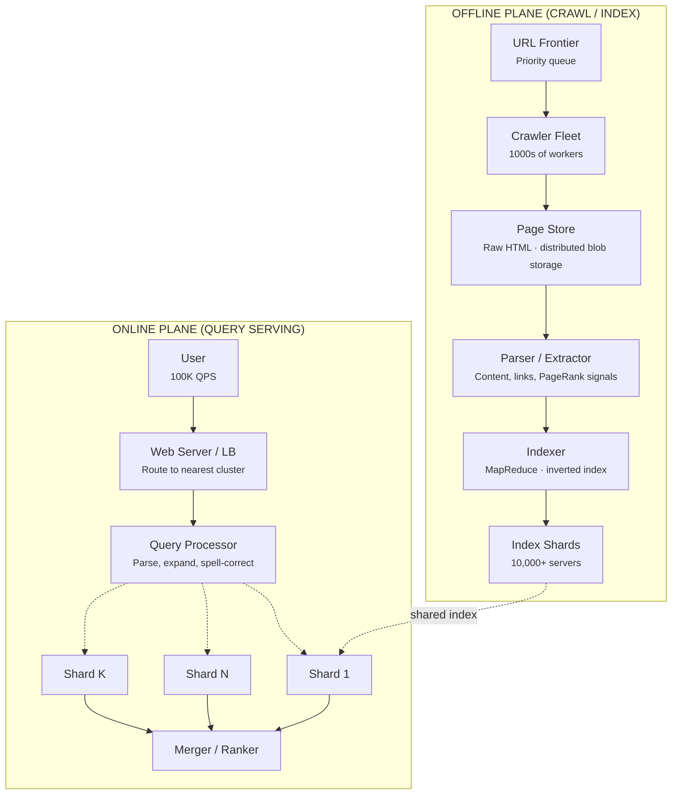
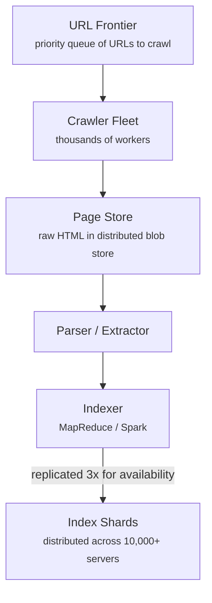
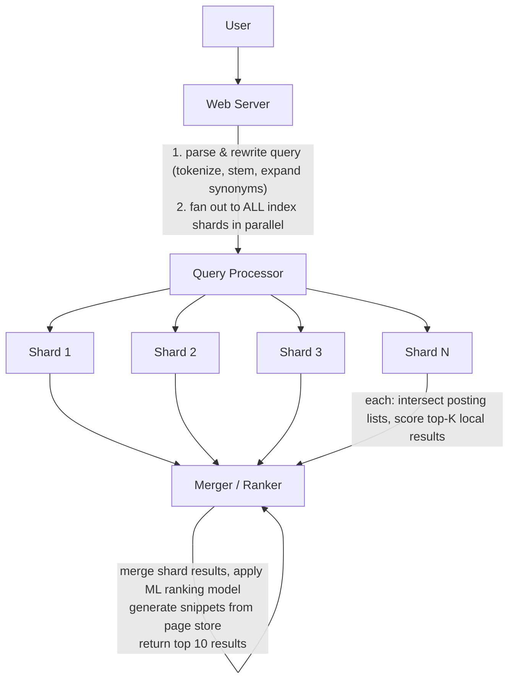

# Design Google Search

Worked Example · 75 min

---

## Phase 1: Clarify the Problem & Scope *(5–7 min)*

> **Say:** "We're designing a web search engine. There are THREE major subsystems: (1) a web crawler that discovers and fetches pages, (2) an indexer that builds a searchable inverted index, and (3) a query serving system that takes a user's query, finds matching documents, ranks them, and returns results in <500ms."

### Questions I'd Ask

- **What outcome are we optimizing for?** — *Query satisfaction: did the user find what they were looking for? Measured by: click-through rate on results, absence of "pogo-sticking" (clicking result → immediately returning to search), and query abandonment rate. Secondary: time-to-answer (zero-click results like featured snippets resolve the query without a click). This shapes ranking: relevance IS the product, not a feature. Every architectural decision (index freshness, crawl frequency, serving latency) exists to improve result quality.*
- **Scope of web?** — *Billions of pages. The crawler discovers and indexes the web continuously. But not all pages are equally important — PageRank and freshness determine crawl priority.*
- **Query types?** — *Navigational ("facebook login"), informational ("how to make pasta"), transactional ("buy running shoes"). Each has different ranking signals and result formats.*

### Agreed Scope

| In Scope | Out of Scope |
|----------|-------------|
| Web crawling & page fetching | Ads / auction system |
| Inverted index construction | Image / video search |
| Query serving & ranking | Knowledge panels / featured snippets |
| Autocomplete / query suggestions | Personalization (search history) |
| Snippet generation | Safe search filtering |

### Non-Functional Requirements

- **Query latency <500ms p99** — users expect near-instant results.
- **Index freshness** — news pages recrawled within minutes; average pages within days-weeks.
- **Index completeness** — crawl billions of pages. Prioritize by importance (PageRank-like).
- **High availability** — search must never be down. Replicated serving tier.
- **The system is TWO separate planes:** the OFFLINE plane (crawl + index, batch/streaming) and the ONLINE plane (query serving, real-time). They share the index as the interface.

> **Tip:** The defining tension: the OFFLINE plane is a massive batch system that processes billions of pages (hours-days latency acceptable), while the ONLINE plane must respond in <500ms. The inverted index is the bridge — built offline, served online.

---

## Phase 2: Back-of-the-Envelope Estimation *(3–5 min)*

| Metric | Value | Detail |
|--------|-------|--------|
| Indexed Pages | ~100B | ~100 billion web pages in the index. |
| Queries / Day | ~8.5B | ~100K queries/sec avg, ~300K/sec peak. |
| Pages Crawled / Day | ~10B | ~115K pages/sec. Mix of new + recrawled pages. |
| Index Size | ~100+ PB | 100B docs × avg 1KB compressed inverted index entry. |
| Raw Page Store | ~5+ PB | 100B pages × avg 50KB compressed HTML → stored for snippet generation. |
| Unique Terms | ~1 Trillion | Across 100B pages. Inverted index has ~1T term → posting list mappings. |

> **Decision:** **Key insight #1:** The index (100+ PB) cannot fit on a single machine. It must be SHARDED across thousands of machines. Each shard holds a subset of documents. A query fans out to all shards in parallel, each returns its top-K results, then a merger selects the global top-K.

> **Decision:** **Key insight #2:** At 300K queries/sec, each touching thousands of index shards, the total internal fan-out is billions of sub-queries/sec. This requires a custom distributed serving infrastructure, not off-the-shelf databases.

---

## Phase 3: High-Level Design *(8–12 min)*

### Key Architecture Decisions

> **Say:** "Here's WHY I chose each technology — mapping requirements to tradeoffs. Every choice has a rejected alternative and a consequence."

| Requirement | Decision | Why (and what was rejected) | Consistency |
|------------|----------|----------------------------|-------------|
| Query latency <500ms at 100K QPS | Sharded inverted index (scatter-gather) | Index split across 10K+ servers. Query fans out to shards in parallel. Each shard returns top-K in <200ms. Merge in <100ms. | — |
| Offline crawl/index decoupled from online serving | Separate offline and online planes | Crawling is batch/continuous. Serving is real-time. Different scaling characteristics. Coupling them would make both worse. | — |
| Index freshness for breaking news | Incremental delta index (not full rebuild) | Small in-memory delta index merged with main index at query time. New content searchable in minutes without rebuilding petabyte-scale main index. | — |
| Rank quality over raw speed | Two-phase ranking: fast retrieval → ML re-ranking | Phase 1: inverted index retrieves top 1000 candidates (fast). Phase 2: ML model re-ranks with 100s of signals (slow but only on 1000 docs). | — |
| Crawl billions of pages with priorities | Custom URL frontier (not Kafka/SQS) | Priority queue by PageRank + freshness + change frequency. Standard queues lack per-URL priority and deduplication at billion-scale. | — |

### Offline Plane: Crawl → Index





### Online Plane: Query Serving



> **Say:** "The most interesting deep dives are: (1) how the crawler manages billions of URLs without re-crawling excessively, (2) how the inverted index is structured and sharded, and (3) how we serve queries in <500ms across 10,000 shards."

---

## Phase 4: Deep Dives *(25–30 min)*

### Deep Dive 1: Web Crawler (~10 min)

> **Goal:** **The core challenge:** Crawl 10B pages/day. Prioritize important/fresh pages. Don't overwhelm any single website. Don't recrawl unchanged pages. Discover new pages efficiently.

- **URL Frontier:** A priority queue of URLs to crawl. Priority based on: PageRank of the domain, freshness (how stale is our copy?), change frequency (news sites recrawled hourly, static sites monthly). Implemented as a distributed priority queue (custom, sharded by domain hash).
- **Politeness:** Per-domain rate limiting. Max 1 request/sec per domain. Respect `robots.txt` and `Crawl-delay`. This means the frontier must be domain-aware — dequeue URLs from different domains to maximize parallelism while respecting per-domain limits.
- **Deduplication:** Before adding a discovered URL to the frontier, check if we've already crawled it recently. Use a Bloom filter (space-efficient) for fast "probably seen" checks. For content dedup (same page, different URL), hash the page content (simhash for near-duplicate detection).
- **Crawl workers:** Thousands of stateless workers. Each: dequeue URL → DNS resolve (cached) → fetch with timeout → store HTML → extract links → add new URLs to frontier.

> **Decision:** **Why a custom URL frontier over Kafka/SQS?** The frontier needs priority ordering (not FIFO), per-domain rate limiting, and deduplication — none of which standard queues provide. It's essentially a priority queue with fairness constraints. Typically implemented as a two-level system: a priority scheduler that selects which URLs are ready, and per-domain FIFO queues for politeness. Tradeoff: more complex to build, but gives us precise control over crawl behavior.

> **Decision:** **Incremental vs. full recrawl?** Incremental. We track `last_crawled_at` and `estimated_change_frequency` per URL. Pages that change often (news homepages) get recrawled every few minutes. Stable pages (Wikipedia articles) get recrawled every few weeks. This maximizes index freshness per crawl budget. Full recrawl would waste 90%+ of resources on unchanged pages.

### Deep Dive 2: Inverted Index (~10 min)

> **Goal:** **The core challenge:** Build and serve an index mapping ~1 trillion unique terms to their posting lists (which documents contain this term, at what position, how frequently). The index is 100+ PB and must support sub-second query serving.

```sql
-- Inverted Index Structure --

Term Dictionary (sorted, in-memory or SSD)
  "pizza"  → pointer to posting list on disk
  "best"   → pointer to posting list on disk
  "nyc"    → pointer to posting list on disk

Posting List for "pizza":
  [doc_17: freq=5, positions=[3,15,42,88,102],
   doc_42: freq=2, positions=[7,34],
   doc_99: freq=1, positions=[21],
   ... millions of entries ...]

  // Sorted by doc_id for efficient intersection
  // Compressed with variable-byte / PForDelta encoding
  // Stores: doc_id, term frequency, positions

Document Store (for snippet generation):
  doc_17 → {url, title, cached_html_snippet, PageRank, ...}
```

- **Sharding:** The 100B documents are divided across ~10,000 shards (document-based sharding). Each shard holds ~10M documents and their complete inverted index. A query is sent to ALL shards in parallel; each returns its local top-K.
- **Replication:** Each shard is replicated 3x for availability and load distribution. At 300K queries/sec fan-out to 10K shards = 3B sub-queries/sec. With 3 replicas, each replica handles ~1B sub-queries/sec / 10K shards = ~100K per shard per sec.
- **Query execution on a single shard:** (1) Look up each query term in the term dictionary. (2) Fetch posting lists. (3) Intersect posting lists (for AND queries) or union (for OR). (4) Score each matching document using BM25 + PageRank + hundreds of other signals. (5) Return top-K with scores.
- **Posting list intersection:** Use skip pointers (jump ahead in sorted lists) to avoid scanning every entry. For a 2-term AND query, start with the shorter posting list and skip through the longer one. This turns O(n+m) into O(min(n,m) x log(max(n,m))).

> **Decision:** **Why document-based sharding over term-based sharding?** With term-based sharding, each term's posting list lives on one shard. A multi-term query must gather from multiple shards then intersect — expensive cross-shard joins. With document-based sharding, each shard has a complete mini-index for its documents. Intersection happens locally on each shard — no cross-shard data movement. The merger just picks the best results from each shard. Tradeoff: every query hits all shards (fan-out), but each shard responds fast and independently.

### Deep Dive 3: Query Serving & Ranking (~5 min)

> **Goal:** **The core challenge:** Rank results by relevance. Combine hundreds of signals in <500ms total.

- **Two-phase ranking:** (1) On each shard, use a fast scoring function (BM25 + static PageRank) to get top-1000 candidates. (2) At the merger, apply a heavier ML-based re-ranker on the top ~200 global candidates to produce the final top 10.
- **Ranking signals:** BM25 (term frequency / inverse document frequency), PageRank (link authority), domain authority, title match, URL match, content freshness, page speed, mobile-friendliness, user engagement signals (click-through rate from past queries).
- **Snippet generation:** For each top-10 result, extract the most relevant passage from the cached page that contains the query terms. Highlight matching terms. Done at the merger stage.
- **Autocomplete:** Separate system. Trie-based prefix search over the most popular queries (precomputed from query logs). Served from in-memory cache. <50ms latency. Fires on every keystroke.

> **Decision:** **Why two-phase ranking?** Running a heavy ML model on every candidate across all shards would be too slow. The fast first phase (BM25 + PageRank) is cheap enough to run on thousands of candidates per shard. The expensive ML model only runs on ~200 candidates at the merger. Tradeoff: we might miss some relevant documents that scored low in phase 1 but would have ranked high in phase 2. Acceptable because phase 1 captures the vast majority of relevant results.

### Deep Dive 4: Data Model & Storage Summary

| Data | Store | Scale | Access Pattern |
|------|-------|-------|---------------|
| Inverted Index | Custom (SSTable-like on SSD) | 100+ PB, 10K shards x 3 replicas | Read at query time. Written in batch by indexer. |
| Page Store | Bigtable / custom blob store | 5+ PB compressed HTML | Read for snippet generation. Written by crawler. |
| URL Frontier | Custom distributed priority queue | ~100B URLs tracked | Dequeue by priority + domain fairness. |
| Link Graph | Custom (adjacency list, sharded) | ~1T edges | Batch read for PageRank computation. |
| Query Logs | Kafka → data warehouse | 8.5B queries/day | For autocomplete, ranking model training, analytics. |
| Autocomplete | In-memory trie (replicated) | ~100M popular queries | Prefix lookup per keystroke. <50ms. |

---

## Phase 5: Cross-Cutting Concerns *(10–12 min)*

### Storage Architecture Summary

> **Goal:** **What goes where and why.** Each data store is chosen for its access pattern — not by default. The question isn't "which database?" but "what are the read/write patterns, consistency requirements, and scale characteristics?"

| Data | Store | Why This Store |
|------|-------|---------------|
| Raw crawled pages | Distributed blob store (Bigtable-like) | Compressed HTML of billions of pages. Key = URL hash. Used by indexer and for cache/snippet generation. |
| Inverted index | Custom sharded index | Term → posting lists (doc_ids + positions). Sharded across 10,000+ servers. The core data structure for query serving. |
| URL frontier | Distributed priority queue | URLs to crawl, prioritized by PageRank and freshness. Deduplication via URL hash. Billions of entries. |
| PageRank scores | Distributed KV store | Pre-computed per-URL importance scores. Updated in batch (MapReduce). Used by ranking at query time. |
| Knowledge Graph | Graph database | Entities, relationships, attributes. Powers info boxes and structured answers. Billions of facts. |
| Serving index (per DC) | In-memory + SSD | Hot subset of the full index, replicated per data center. Memory-mapped for sub-ms term lookups. |

### Failure Scenarios

| Scenario | Mitigation |
|----------|-----------|
| Index shard replica down | Two other replicas serve traffic. Auto-heal by rebuilding from the index pipeline. Query quality unaffected. |
| Slow shard (straggler) | Query processor sets timeout per shard (50ms). If a shard doesn't respond, proceed without it — results are slightly less complete but still good. Hedged requests: send to 2 replicas, take first response. |
| Crawler flood / hostile site | Per-domain rate limiting. Respect robots.txt. Timeout on fetch (10s). Skip and deprioritize consistently slow/hostile domains. |
| Index corruption | Indexes are built offline and deployed atomically. If a new index build is corrupted, roll back to the previous version. Canary deployment: new index served to 1% of traffic first. |
| Spam / SEO manipulation | Spam classifier in the indexing pipeline. Penalize link farms. Use click-through signals (real users) to validate ranking quality. |

### Scalability

> **Tip:** Google Search operates at two fundamentally different scales: (1) Offline: crawling and indexing the entire web — billions of pages, petabytes of data, processed continuously by MapReduce/Spark pipelines. This scales by adding more crawler workers and indexing nodes — it's a batch processing problem. (2) Online: serving 100K+ queries per second with sub-500ms latency. This scales via sharding the inverted index across 10,000+ servers. A single query fans out to many shards (each holding a subset of the index), each returns its top-K results, and a merger combines and re-ranks them. The number of shards determines throughput — more shards = more parallelism. Within each shard, the index is memory-mapped for microsecond-level term lookups. The key scaling insight: the offline and online planes are decoupled. The indexer writes new index segments, and the serving infrastructure atomically swaps them in — queries never see a partially-updated index. This means the crawl/index rate (how fast you update) and the query rate (how fast you serve) scale independently.

### Index Freshness Strategy

- **Base index:** Full rebuild weekly (batch MapReduce over entire page store → new index shards). Atomic swap.
- **Real-time layer:** For breaking news, a separate fast-update index ingests recently crawled pages within seconds. Query serving merges base index results with real-time index results.
- **Priority recrawl:** News sites, social media, high-PageRank sites recrawled every few minutes. Feeds into the real-time layer.

### Security & Access Control

> **Decision:** Search security operates at multiple levels: (1) Crawl-side: the crawler respects robots.txt (ethical crawling), and the indexer filters known malware/phishing sites using Safe Browsing lists — these are flagged in search results with warnings. (2) Query-side: SafeSearch filtering removes explicit content from results (enabled by default for minors). (3) Privacy: search queries are logged for quality improvement but anonymized after 18 months. Users can delete their search history. In the EU, right-to-be-forgotten requests remove specific URLs from results. (4) Index integrity: the index must not be manipulated by SEO spam. The ranking algorithm includes hundreds of signals specifically to detect and demote artificially boosted content (link farms, keyword stuffing, cloaked pages). (5) Infrastructure: each data center runs the full search stack independently — no single DC compromise affects others. Internal access to the index and query logs requires strong authentication and is audit-logged.

### Monitoring & SLOs

> **Tip:** Core SLOs: query latency p99 <500ms, availability 99.999% (about 5 minutes downtime per year), index freshness <5 minutes for breaking news. Query latency is decomposed: query parsing (<10ms), shard scatter (<50ms network), per-shard search (<200ms), merge/rank (<100ms), rendering (<50ms). Each stage has its own SLO. Index freshness is monitored by "canary URLs" — known pages are modified, and the time until the change appears in search results is measured. The crawl pipeline has throughput SLOs: X new pages crawled per hour, Y pages re-crawled per hour. Each data center reports independent health metrics. If a DC's query latency degrades, traffic is shed to neighboring DCs via load balancing. Quality monitoring goes beyond latency: human raters continuously evaluate search result quality, and automated metrics (click-through rate on top results, pogo-sticking rate) serve as proxies for relevance. A ranking algorithm change that improves latency but hurts relevance would be rolled back.

---

## Phase 6: Wrap-Up & Evolution *(3–5 min)*

> **Say:** "This system is defined by the separation of the offline and online planes. The offline plane — crawling, parsing, indexing, PageRank — operates over hours to days and processes the entire web. The online plane — query parsing, fan-out to 10,000 shards, merge, rank — operates in <500ms. The inverted index is the bridge: built offline, served online. The key architectural decisions are document-based sharding (enables local intersection), two-phase ranking (cheap first pass + expensive re-rank), and a custom URL frontier with priority + politeness for the crawler."

### What I'd Build Next

| Extension | Architecture Impact |
|-----------|-------------------|
| Semantic / Vector Search | Embedding-based retrieval alongside inverted index. ANN (approximate nearest neighbor) index for dense vectors. Hybrid scoring: BM25 + vector similarity. |
| AI Overviews (LLM answers) | Top-K retrieval → feed results as context to an LLM → generate summary. Adds ~2-5s latency. Shown alongside traditional results. |
| Personalization | User search history → user embedding → personalized ranking signal. Privacy-sensitive — can be done on-device or with federated learning. |
| Image / Video Search | Separate index per media type. Vision models for content understanding. Cross-modal retrieval (text query → image results). |

> **Tip:** **Closing framing:** Google Search is defined by SCALE of indexing. 100B documents, 1T terms, 10K shards — everything is a distributed systems problem. The key insight is that the offline and online planes have fundamentally different latency requirements, connected by the inverted index as a shared data structure built for read-optimized serving.

---

## Phase 7: Interview Q&A *(Practice)*

> **Say:** "Here are the hardest questions an interviewer would ask about this design, and how to answer them. Each answer demonstrates deep understanding of the tradeoffs, not just surface knowledge."

**Q:** How does the inverted index handle a query like "Barack Obama birthday"?

**A:** The query is processed in stages. First, the query processor tokenizes and normalizes: "barack", "obama", "birthday". It may also expand with synonyms or correct spelling. Then, the query is sent to the index shards. Each shard looks up the posting lists for each term — a posting list is a sorted array of document IDs that contain that term. For "barack" there might be 500M documents, "obama" 800M, "birthday" 2B. The intersection of these three lists gives documents containing all three terms. The intersection is computed efficiently using skip lists — since posting lists are sorted, you can skip ahead when IDs don't match. After intersection, each matching document is scored using hundreds of ranking signals: term frequency, document PageRank, freshness, user location, and many more. The top ~1000 results per shard are returned to the merger, which combines results from all shards and re-ranks globally. For this particular query, the Knowledge Graph would also fire, returning a direct answer panel ("August 4, 1961") alongside the organic results.

**Q:** How do you handle index freshness for breaking news?

**A:** The crawler has a priority system. Most of the web is crawled on a days-to-weeks schedule based on PageRank and change frequency. But news sites (CNN, NYT, Reuters, etc.) are in a "real-time" crawl tier — checked every few minutes. When a breaking story is detected (via trending queries, social signals, or crawler discovering new URLs on news sites), the pipeline accelerates: (1) the URL is fast-tracked through crawl, parse, and index within 2-5 minutes, (2) the serving index can do "incremental updates" — instead of waiting for a full index rebuild, a small delta index is merged with the main index at query time. This delta is in memory and can be updated in seconds. (3) For truly breaking events, Google may also surface results from Twitter/social media or its own news aggregation. The tradeoff: fast-indexed pages have less ranking signal (no PageRank computed yet, no link analysis), so Google applies a "freshness boost" — newer content from trusted sources is ranked higher than the steady-state algorithm would suggest.
