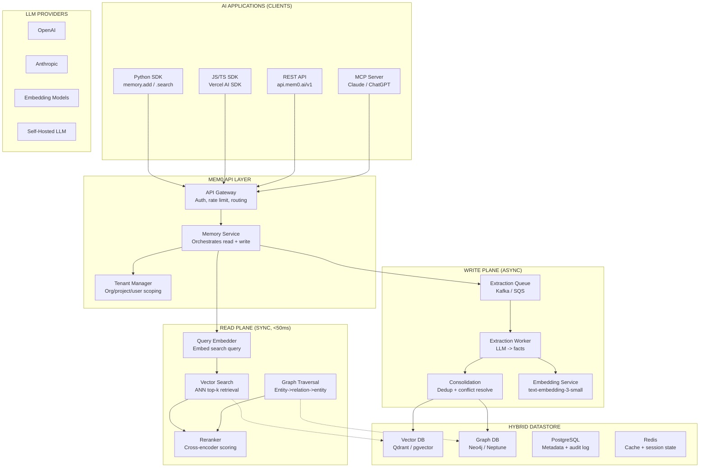
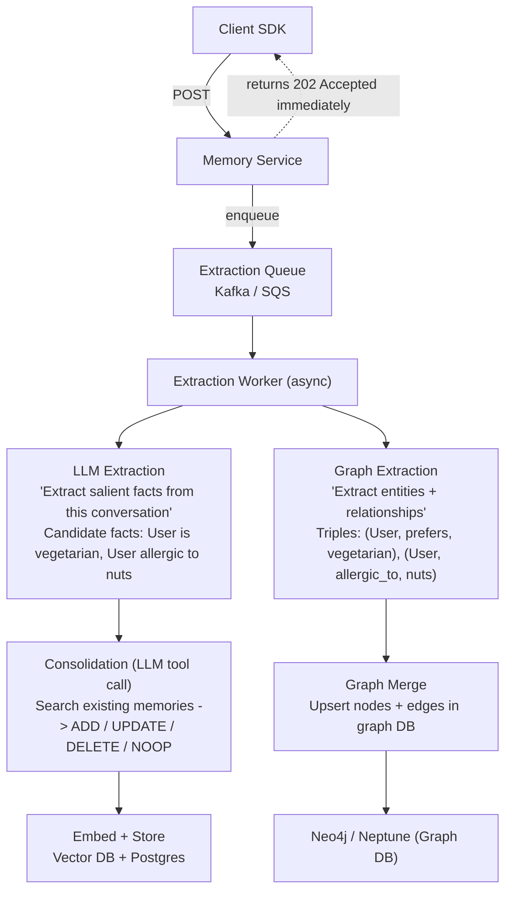
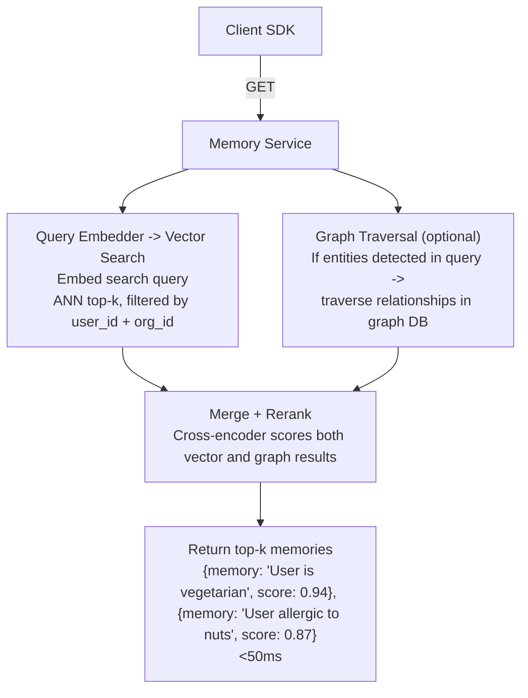
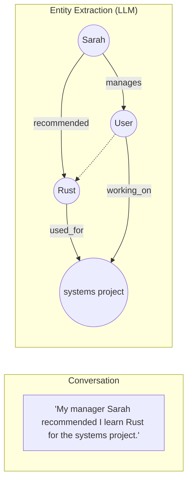

# Design: Mem0

*Worked Example · 75 min*

---

## Phase 1: Clarify the Problem & Scope *(5–7 min)*

> **Say:** "We're designing Mem0 — an intelligent memory layer for AI agents and LLM applications. The core problem: LLMs are stateless. Every conversation starts from scratch. Mem0 extracts, stores, and retrieves user-specific facts across sessions so AI agents can personalize without stuffing entire chat histories into every prompt. It's not RAG over documents — it's memory over relationships."

### Questions I'd Ask

- **What kind of memory?** Short-term (within session), long-term (across sessions), or both? -- Focus on long-term cross-session memory. Session context is the LLM's job; Mem0 handles what persists after.
- **What's the unit of memory?** Raw chat chunks (RAG-style), or extracted facts? -- Extracted facts: "User is vegetarian," not "User said 'I don't eat meat' on Jan 5." This is the key difference from RAG.
- **Multi-tenant?** Multiple apps, each with their own users? -- Yes. Scoped by org -> project -> user/agent/session.
- **Graph memory in scope?** -- Yes — the graph variant (Mem0g) stores entity-relationship triples for relational reasoning.
- **Self-hosted or managed?** -- Both. Open-source (BYO vector DB + graph DB) and managed platform (fully hosted).
- **Scale?** -- Millions of users across thousands of tenants. Billions of memories total. Sub-50ms retrieval latency.

### Agreed Scope

| In Scope | Out of Scope |
|---|---|
| Memory extraction from conversations (LLM-based) | The LLM serving layer itself (OpenAI, Claude) |
| Memory CRUD: add, search, update, delete | Full RAG pipeline (document ingestion, chunking) |
| Hybrid store: vector + graph + key-value | Prompt engineering / agent orchestration |
| Multi-tenant isolation (org/project/user/agent/session) | Fine-tuning models per user |
| Graph memory (entity-relationship extraction) | Multimodal memory (images, audio) |
| Memory consolidation (dedup, conflict resolution) | Real-time streaming conversations |

### Core Use Cases

- **UC1: memory.add(messages, user_id)** — After a conversation turn, extract salient facts and store them. Deduplicate against existing memories. Resolve conflicts (user changed preference).
- **UC2: memory.search(query, user_id)** — Before generating a response, retrieve relevant memories to inject into the system prompt. Must return in <50ms.
- **UC3: memory.update(memory_id, data)** — Explicitly modify a stored memory (admin correction, user request to forget).
- **UC4: memory.delete(user_id)** — GDPR right-to-be-forgotten. Delete all memories for a user across all stores.
- **UC5: Graph traversal** — "What does this user know about Python?" -> traverse entity graph: User -> knows -> Python -> related_to -> Django, Flask.

### Non-Functional Requirements

- **Memory retrieval <50ms p95:** Memory lookup is on the hot path of every LLM call. 200ms retrieval + 2s LLM = unacceptable. Must be fast enough that adding memory doesn't noticeably increase response time.
- **Memory extraction is async and can tolerate latency:** Extracting facts from a conversation takes 1-3s (LLM call). This happens AFTER the response is sent to the user — not on the critical path.
- **Multi-tenant isolation is non-negotiable:** Tenant A's memories must NEVER leak to Tenant B. User X's memories must NEVER leak to User Y. This is PHI/PII data (medical history, dietary preferences, financial info).
- **SOC 2 / HIPAA compliance:** Audit logs, encryption at rest, encryption in transit, BYOK (bring your own encryption key).
- **Eventual consistency for memory writes is acceptable:** A memory extracted 2 seconds ago doesn't need to be immediately searchable. 5-second propagation delay is fine.
- **Memory quality > memory quantity:** 10 precise, deduplicated facts are better than 500 raw chat chunks. The extraction LLM must be ruthlessly selective.

> **Tip:** The fundamental insight: Mem0 is NOT RAG. RAG retrieves chunks of existing documents. Mem0 uses an LLM to EXTRACT facts from conversations, CONSOLIDATE them against existing knowledge, and RETRIEVE them semantically. It's closer to how human memory works: you don't remember the exact words of every conversation — you remember the important facts, updated when you learn something new.

---

## Phase 2: Back-of-the-Envelope Estimation *(3–5 min)*

> **Say:** "Let me estimate the two planes: write-path (extraction + storage) and read-path (retrieval)."

| Metric | Value | Detail |
|---|---|---|
| **Conversations / Day** | **~50M** | Thousands of tenants x millions of users x multiple sessions |
| **Memories Extracted / Conversation** | **~2-5 facts** | LLM extracts only salient info. Most turns yield 0-3 new facts. |
| **Memory Searches / Day** | **~200M** | Every LLM call triggers a memory search. 4x write volume. |
| **Total Memories Stored** | **~10B+** | Millions of users x hundreds of facts each, accumulated over months |
| **Vector Embedding Size** | **~6 KB / memory** | 1536-dim float32 embedding = 6KB. Plus ~500B text + metadata. |
| **Total Vector Storage** | **~60 TB** | 10B memories x 6KB = 60TB of embeddings alone |

> **Decision:** **Key insight #1:** The read:write ratio is ~4:1 (200M searches vs 50M extractions). But the write path is far more expensive per operation: each write triggers an LLM call (extraction), an embedding computation, a vector similarity search (dedup check), and potentially a graph update. Read is just: embed query -> vector search -> return top-k.

> **Decision:** **Key insight #2:** Memory extraction is the most expensive operation — it requires an LLM call (1-3 seconds, $0.001-0.01 per call). At 50M extractions/day, that's $50K-500K/day in LLM costs alone. This is why extraction must be smart: only extract when new salient information exists, not on every message.

> **Decision:** **Key insight #3:** The search path must be <50ms. A vector similarity search across 10B vectors is too slow for a single index. We need per-tenant or per-user partitioning: a user with 500 memories searches 500 vectors, not 10B. Tenant isolation naturally solves the scale problem.

---

## Phase 3: High-Level Design *(8–12 min)*

> **Say:** "Mem0 has two async planes: a write plane (extract + consolidate memories from conversations) and a read plane (retrieve relevant memories for a query). The write plane is LLM-intensive but off the critical path. The read plane is latency-sensitive and must be fast."

### Key Architecture Decisions

> **Say:** "Here's WHY I chose each technology — mapping requirements to tradeoffs."

| Requirement | Decision | Why (and what was rejected) | Consistency |
|---|---|---|---|
| Semantic search over facts (<50ms) | Vector DB (Qdrant / pgvector) | Embedding-based similarity search returns semantically relevant memories, not just keyword matches. Full-text search can't find "vegetarian" when query is "dinner suggestions." | AP |
| Relational reasoning ("who knows whom") | Graph DB (Neo4j / Neptune) | Entity-relationship triples enable multi-hop traversal. Vector search can't answer "what topics is the user's manager interested in?" — requires graph path traversal. | AP |
| Memory metadata: CRUD, TTL, audit trail | PostgreSQL for metadata | Memory records need ACID: created_at, updated_at, version history, tenant isolation. Vector DBs lack rich querying and transactions. | CP |
| Memory extraction from conversations | LLM with tool-calling (not regex/NER) | LLM understands context: "I stopped eating meat" -> UPDATE existing memory "User eats chicken" to "User is vegetarian." NER/regex can't do conflict resolution. | -- |
| Multi-tenant isolation (PHI/PII) | Namespace partitioning (not DB-per-tenant) | Every query includes mandatory tenant_id + user_id filter. Row-level security in PostgreSQL, namespace filtering in vector DB. Separate DBs don't scale to 10K+ tenants. | -- |
| Extraction latency off critical path | Async write pipeline (Kafka/SQS) | memory.add() returns immediately. Extraction happens async. User never waits for the LLM extraction call — it fires after the response is sent. | Eventual |

### Major Components



### Flow 1: memory.add(messages, user_id) — Write Path



### Flow 2: memory.search(query, user_id) — Read Path



---

## Phase 4: Deep Dives *(25–30 min)*

### Deep Dive 1: Memory Extraction & Consolidation Pipeline (~12 min)

> **Goal:** The core innovation: Mem0 doesn't store raw chat chunks (that's RAG). It uses an LLM to extract atomic facts, then consolidates them against existing memories using a four-operation tool-calling interface: ADD, UPDATE, DELETE, NOOP.

> **Decision:** **Why LLM-based extraction over heuristics?** Consider: "I stopped eating meat last month after watching that documentary." A regex/NER approach extracts entities: "meat," "last month," "documentary." But it misses the semantic meaning: this is an UPDATE — the user's dietary preference changed from whatever it was to vegetarian. The LLM understands: (1) extract fact: "User is now vegetarian," (2) search existing memories -> find "User enjoys chicken wings," (3) tool call: UPDATE memory to "User is vegetarian (changed recently, was previously a meat eater)." No rule-based system can do this kind of contextual consolidation.

| Operation | When | Example |
|---|---|---|
| ADD | New fact, no existing similar memory | "User has a 3-year-old daughter named Emma" — first mention, no related memory exists. |
| UPDATE | New info augments or modifies existing memory | Existing: "User lives in NYC." New: "User moved to SF last week." -> UPDATE to "User lives in SF (moved from NYC recently)." |
| DELETE | New info contradicts existing memory entirely | Existing: "User is single." New: "I just got married!" -> DELETE old memory, ADD new one. |
| NOOP | Fact already captured or not worth storing | "Nice weather today" — not a persistent user fact. Or "I'm vegetarian" when memory already says "User is vegetarian." |

```sql
// Extraction phase: LLM prompt structure

System prompt = """
You are a memory extraction agent. Given a conversation,
extract ONLY salient, persistent facts about the user.

DO extract: preferences, biographical facts, goals, constraints
DO NOT extract: transient info, pleasantries, generic knowledge

Context: {conversation_summary}
Recent messages: {last_10_messages}

Output format: list of facts, each a concise statement.
"""

// Consolidation phase: LLM tool-calling prompt

System prompt = """
You are a memory manager. For each new fact, compare against
existing similar memories and decide which operation to apply.

New fact: "{extracted_fact}"
Existing similar memories:
  1. "{memory_1}" (similarity: 0.87)
  2. "{memory_2}" (similarity: 0.72)

Available tools:
  - add_memory(text): Store as new memory
  - update_memory(id, new_text): Modify existing memory
  - delete_memory(id): Remove contradicted memory
  - noop(): No action needed
"""
```

> **Tip:** The extraction + consolidation is a two-LLM-call process: Call 1 extracts candidate facts. Call 2 (per fact) decides the operation by comparing against similar existing memories retrieved via vector search. This is why the write path is expensive ($0.001-0.01 per memory operation) but is off the critical path — it runs asynchronously after the user's response is already sent.

### Deep Dive 2: Hybrid Datastore Architecture (~8 min)

> **Goal:** Three stores, three access patterns. Vector DB for semantic search (find similar memories). Graph DB for relational traversal (navigate entity relationships). PostgreSQL for metadata, audit, and CRUD operations. Each optimized for its workload.

| Store | What It Holds | Access Pattern | Why This Store |
|---|---|---|---|
| Vector DB (Qdrant) | Memory text + 1536-dim embedding | ANN search: "find memories similar to this query" | Semantic similarity at sub-10ms. Can't do this with PostgreSQL full-text search — "dinner suggestions" wouldn't match "vegetarian." |
| Graph DB (Neo4j) | Entity nodes + relationship edges | Traversal: "User -> knows -> Python -> related_to -> ?" | Multi-hop reasoning. Vector search returns isolated facts; graph connects them relationally. |
| PostgreSQL | Memory metadata, tenants, audit log | CRUD: list all memories, filter by date, version history | ACID transactions for tenant management. Rich filtering (created_at > X AND user_id = Y). Audit trail for compliance. |
| Redis | Recent memory cache, rate limit counters | Hot path cache for frequently accessed user memories | Sub-ms reads for users with active sessions. Avoids vector DB round-trip for recent memories. |

> **Decision:** **Why not just a vector DB?** Vector search finds semantically similar memories but can't answer relational queries. "What does the user know about their manager's preferences?" requires: (1) find "manager" entity in graph, (2) traverse "manages" edge to the user, (3) find preferences linked to the manager entity. Vector search would return the user's own preferences (semantically similar to "preferences"), not the manager's. The graph captures structure that embeddings flatten.

> **Decision:** **Why not just a graph DB?** Graph traversal requires knowing the starting node. For open-ended queries like "anything relevant about food?" there's no clear entity to start from. Vector search handles fuzzy, semantic matching where graph traversal needs a precise starting point. The hybrid approach: vector search for open-ended relevance, graph traversal for structured relational queries, merged and reranked.

### Deep Dive 3: Graph Memory (Mem0g) (~5 min)

> **Goal:** Mem0g extends the base architecture with entity-relationship triples. Each conversation message is processed not just for facts (vector memory) but for entities and their relationships. The graph enables multi-hop reasoning that vector search alone can't support.



**Graph Query: "What did Sarah suggest?"**

Traversal: (Sarah) --recommended--> (Rust) --used_for--> (project)

Answer: "Sarah recommended learning Rust for the systems project."

**Why vector search fails here:** Vector search for "What did Sarah suggest?" returns memories semantically similar to "suggestions" — might return user's own preferences, not Sarah's recommendation.

> The graph captures WHO recommended WHAT — structure that embedding similarity cannot express.

> **Tip:** Graph memory shines for multi-hop questions: "What programming languages are relevant to the project my manager recommended?" requires traversing: manager -> recommended -> language -> project. On the LOCOMO benchmark, Mem0g scores ~2% higher than base Mem0, with the largest gains on multi-hop questions specifically.

### Deep Dive 4: Data Model & APIs (~5 min)

```sql
memories
  id              UUID          -- Primary key
  org_id          UUID          -- Tenant isolation (mandatory in every query)
  project_id      UUID          -- Project within org
  user_id         TEXT          -- User scope (who this memory belongs to)
  agent_id        TEXT          -- Agent scope (optional, for per-agent memory)
  session_id      TEXT          -- Session scope (optional, ephemeral within session)
  memory          TEXT          -- "User is vegetarian and avoids dairy"
  hash            TEXT          -- SHA-256 of memory text (dedup key)
  metadata        JSONB         -- Custom tags, source_conversation_id, etc.
  created_at      TIMESTAMPTZ   -- First extracted
  updated_at      TIMESTAMPTZ   -- Last modified
  expires_at      TIMESTAMPTZ   -- TTL for session-scoped memories
  version         INT           -- Incremented on UPDATE (audit trail)

memory_versions -- Append-only audit log (SOC 2 / HIPAA)
  id              UUID
  memory_id       UUID
  operation       TEXT          -- ADD, UPDATE, DELETE
  old_value       TEXT          -- Previous memory text (null for ADD)
  new_value       TEXT          -- New memory text (null for DELETE)
  created_at      TIMESTAMPTZ

graph_entities -- Node table (also stored in Neo4j)
  id              UUID
  org_id          UUID
  user_id         TEXT
  name            TEXT          -- "Sarah", "Rust", "systems project"
  entity_type     TEXT          -- PERSON, TECHNOLOGY, PROJECT, PREFERENCE

graph_relations -- Edge table
  id              UUID
  source_id       UUID          -- FK -> graph_entities
  target_id       UUID
  relation        TEXT          -- "manages", "recommended", "allergic_to"
  created_at      TIMESTAMPTZ
```

### API Design

```http
POST /v1/memories
```
Add memories from conversation.
Body: `{ messages: [...], user_id, agent_id?, session_id?, metadata? }`
Returns: 202 Accepted + `{ extraction_id }` — async, fires extraction pipeline

```http
GET /v1/memories/search?q=...&user_id=...
```
Search memories semantically.
Query params: q (query text), user_id, agent_id?, limit?, filters?
Returns: `[{ id, memory, score, created_at, metadata }]` — <50ms

```http
GET /v1/memories?user_id=...
```
List all memories for a user.
Paginated list with cursor. Filterable by metadata, date range. Used for admin dashboards and debugging.

```http
PUT /v1/memories/{id}
```
Update a specific memory.
Body: `{ memory: "updated text" }`. Creates new version in audit log. Re-embeds and updates vector DB.

```http
DELETE /v1/memories?user_id=...
```
Delete all user memories (GDPR).
Deletes from all three stores: vector DB, graph DB, PostgreSQL. Audit log entry created. Irreversible.

---

## Phase 5: Cross-Cutting Concerns *(10–12 min)*

### Storage Architecture Summary

| Data | Store | Why This Store |
|---|---|---|
| Memory embeddings | Qdrant / pgvector | ANN search at <10ms. Filtered by user_id namespace. HNSW index for approximate nearest neighbor. |
| Entity-relationship graph | Neo4j / Neptune | Cypher queries for multi-hop traversal. Property graph model. Indexed by entity name + user_id. |
| Memory metadata + audit | PostgreSQL | ACID for CRUD, version history, tenant management. Rich SQL filtering for admin dashboards. |
| Hot memory cache | Redis (with TTL) | Recently accessed user memories cached for sub-ms reads. Invalidated on memory update. |
| Extraction queue | Kafka / SQS | Async write path. Decouples API response from expensive LLM extraction. At-least-once delivery. |
| Conversation context | Redis (session-scoped TTL) | Recent 10 messages for extraction context. Expires with session. Not durable — reconstructable. |

### Failure Scenarios

| Scenario | Mitigation |
|---|---|
| LLM extraction fails (timeout, rate limit) | Extraction queue retries with exponential backoff (3 retries, max 30s). Dead letter queue for persistent failures. Memory is not lost — the conversation is reprocessed when the LLM recovers. User never sees this failure (extraction is async). |
| Vector DB down during search | Graceful degradation: return empty memory list. The LLM responds without personalization — suboptimal but functional. Health check triggers alerts. Redis cache serves recently accessed memories as fallback. |
| Memory hallucination (LLM extracts wrong fact) | Confidence scoring: extraction LLM assigns confidence per fact. Low-confidence facts stored with a flag. User-facing "memory dashboard" shows stored memories with edit/delete controls. Feedback loop: user corrections improve extraction quality over time. |
| Memory conflict (user provides contradictory info) | Consolidation LLM resolves conflicts using recency and context. "I'm vegetarian" + later "I ate steak last night" -> UPDATE: "User was vegetarian but may have changed. Recently ate steak." Timestamp metadata provides temporal ordering. |
| Tenant data leak (user A's memories returned to user B) | Defense in depth: (1) mandatory user_id + org_id filter on every query (enforced at API gateway, not just application code), (2) row-level security in PostgreSQL, (3) namespace isolation in vector DB (separate collections per org), (4) integration tests that verify cross-tenant queries return empty. |
| GDPR deletion request | Coordinated delete across all stores: PostgreSQL (memories + audit log, except deletion audit entry), vector DB (delete all vectors for user_id), graph DB (delete all nodes + edges for user_id), Redis (invalidate cache). Confirmation webhook to the requesting application. Deletion is verified by a background job that searches for any remaining traces. |

### Security Architecture

> **Decision:** **Security & Access Control.** Memories contain PHI/PII (medical preferences, dietary restrictions, financial info). SOC 2 Type II compliance: all data encrypted at rest (AES-256) and in transit (TLS 1.3). BYOK: enterprise customers bring their own encryption keys — Mem0 never holds the master key. API authentication via org-scoped API keys with project-level permissions. Audit log captures every memory operation (who, what, when) in an append-only table — required for HIPAA. For self-hosted deployments: all data stays in the customer's infrastructure. The managed platform runs in isolated VPCs per enterprise customer. Memory content is never used for training Mem0's own models (contractual guarantee).

### Scalability

> **Tip:** **Scalability.** Read path scales horizontally: vector DB sharded by org_id. Each org's memories are co-located for efficient search. Redis cache absorbs hot-path reads for active users. Write path scales via Kafka partitions: one partition per org ensures ordering within a tenant. Extraction workers auto-scale based on queue depth. The LLM provider (OpenAI, etc.) is the actual bottleneck on the write path — rate limits cap extraction throughput. Mitigation: batch extraction (process 10 conversation turns in one LLM call instead of 10 separate calls), model routing (use cheaper models for simple extractions, expensive models for complex consolidation).

### Monitoring & SLOs

> **Tip:** **Monitoring & SLOs.** Key SLOs: search p95 <50ms, extraction queue lag <30 seconds, memory accuracy (human eval sample) >90%. Metrics: memories per user (growth rate, detect bloat), extraction precision/recall (sampled evaluation), search latency histogram (p50, p95, p99), LLM cost per extraction ($), queue depth (lag = extraction workers falling behind). Alerting: queue depth >10K (workers need scaling), search latency p95 >100ms (vector DB overloaded), extraction error rate >5% (LLM issues), cross-tenant query detected (security incident).

---

## Phase 6: Wrap-Up & Evolution *(3–5 min)*

### What I'd Build Next

- **Memory decay & relevance scoring:** Memories accessed frequently retain high relevance. Memories not accessed in 6 months decay in ranking. Analogous to human forgetting curve — keeps the memory store lean and relevant.
- **Multimodal memory:** Extract facts from images ("User shared a photo of their golden retriever named Max") and audio. Store visual embeddings alongside text embeddings for cross-modal retrieval.
- **Hierarchical memory (episodic -> semantic):** Short-term: raw conversation events (episodic). Long-term: consolidated facts (semantic). Procedural: learned task patterns ("User always wants code in Python"). Mirrors human memory taxonomy.
- **On-device memory:** Privacy-sensitive use cases: memories stored on-device (phone, laptop), never sent to cloud. Smaller embedding models (384-dim) for edge inference. Syncs with cloud store when user opts in.
- **Memory-aware fine-tuning:** Use accumulated memories as training data to fine-tune a per-user LoRA adapter. The model itself learns the user's style and preferences, not just the prompt. Orders of magnitude more efficient than injecting 100 memories into every prompt.
- **Collaborative memory:** Team-level memories shared across an organization. "Our team uses Next.js for frontend" — shared fact available to all team members' AI agents. Conflict resolution when team members provide contradictory information.

> **Say:** "Mem0 solves the fundamental problem of LLM statelessness: it extracts, consolidates, and retrieves memories using a hybrid vector + graph architecture. The key tradeoffs: LLM-based extraction is expensive but produces high-quality, deduplicated facts. The async write path keeps extraction off the critical path. The hybrid datastore combines semantic search (vector) with relational reasoning (graph). Multi-tenant isolation is enforced at every layer. The result: AI agents that remember, adapt, and personalize — without stuffing entire chat histories into every prompt."

---

## Phase 7: Interview Q&A *(Practice)*

**Q1: How is Mem0 different from RAG? When would you use each?**

**A:** RAG retrieves chunks of existing documents — it's stateless. You ingest a PDF, chunk it, embed the chunks, and retrieve relevant passages. The documents don't change based on user interaction. Mem0 is stateful: it extracts facts FROM conversations, consolidates them (dedup, conflict resolution), and builds a persistent knowledge base PER USER that evolves over time. The key difference: RAG answers "what does this document say?" Mem0 answers "what do I know about this user?" Use RAG for: knowledge bases, documentation search, customer support with fixed answers. Use Mem0 for: personalization, remembering user preferences, multi-session context, AI assistants that improve over time. They're complementary — a healthcare agent might use RAG for medical literature and Mem0 for patient history.

**Q2: Why use an LLM for extraction instead of just embedding raw conversation chunks?**

**A:** Three reasons: (1) Compression: a 20-turn conversation about dinner preferences compresses to "User is vegetarian, avoids dairy, loves Italian food" — 3 atomic facts instead of 20 raw chunks. This means 90%+ token savings when injecting memories into prompts. (2) Deduplication: if the user mentions being vegetarian in 10 different conversations, embedding raw chunks gives you 10 near-duplicate vectors. The LLM recognizes it's the same fact and stores it once. (3) Conflict resolution: raw chunks can't resolve "I love steak" from January and "I became vegetarian" from March. The LLM understands temporal ordering and updates the memory. The cost: $0.001-0.01 per extraction call. But the savings — fewer tokens per prompt, cleaner retrieval, no duplicates — more than compensate at scale. The paper shows 90% token cost reduction vs. full-context approaches.

**Q3: What happens if the LLM hallucinates during extraction — stores a fact the user never said?**

**A:** This is the biggest risk in the architecture. Mitigations: (1) Extraction prompt engineering: instruct the LLM to only extract explicitly stated facts, never infer. "User mentioned they have a dog" is valid; "User probably likes dogs" is not. (2) Confidence scoring: the extraction LLM assigns a confidence score per fact. Low-confidence facts are stored but flagged — they're deprioritized in retrieval scoring. (3) Source linking: every memory stores the source_conversation_id. On retrieval, the application can verify the memory against the original conversation. (4) User memory dashboard: users can view, edit, and delete their memories. This is both a product feature and a hallucination correction mechanism. (5) Feedback loop: when a user corrects or deletes a memory, that signal feeds back into extraction quality metrics. The honest answer: hallucinated memories will occasionally happen. The system is designed to make them discoverable, correctable, and low-impact (ranked lower than high-confidence memories).

**Q4: How do you handle memory search at 10B+ memories without every query scanning the entire vector index?**

**A:** Tenant-scoped partitioning eliminates the 10B problem entirely. Every query includes a mandatory user_id + org_id. In Qdrant, each org gets its own collection (or partition). A user with 500 memories searches 500 vectors — an HNSW lookup over 500 points is microseconds, not milliseconds. The 10B total is distributed across millions of users. Even the largest individual user (say, a power user with 10K memories) searches 10K vectors — still sub-10ms. The only time cross-user search is needed is for admin analytics ("how many users mention competitor X?"), which is a batch job, not a real-time query. For the managed platform: Qdrant clusters are sharded by org_id. Large enterprise tenants get dedicated shards. Small tenants are co-located with namespace isolation. The scaling unit is the tenant, not the total memory count.

**Q5: Why do you need both a vector DB and a graph DB? Can't you just use one?**

**A:** They solve different retrieval problems. Vector search answers: "find memories semantically similar to this query." It's great for fuzzy, open-ended retrieval — "anything about food preferences?" returns dietary memories even if the word "food" never appears in them. Graph traversal answers: "navigate relationships between entities." It's great for structured queries — "what did my manager recommend?" requires following the edge (manager)->recommended->(thing). Vector search would return YOUR recommendations (semantically similar to "recommend"), not your manager's. You could use only vector — that's what base Mem0 does, and it works well. Graph adds ~2% accuracy on the LOCOMO benchmark, with the biggest gains on multi-hop questions. For simple use cases (chatbot personalization), vector-only is sufficient. For complex agent workflows (enterprise assistants that model org relationships), graph memory is essential. The architecture supports both: graph is optional and can be enabled per project.
