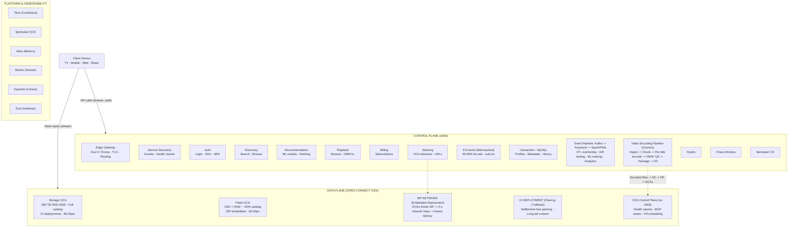
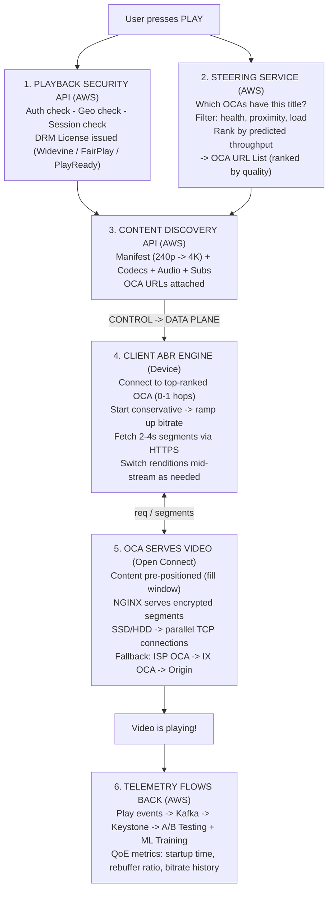

# Design Netflix

*Global Video Streaming -- 75 min*

---

## Phase 1: Clarify the Problem & Scope *(5--7 min)*

> **Say:** "We're designing Netflix -- a global video streaming platform serving 300M+ subscribers across 190 countries. The architecture fundamentally splits into two planes: a **Control Plane** on AWS handling everything before you press play (browsing, recommendations, account management), and a **Data Plane** via Open Connect, Netflix's proprietary CDN, handling everything after (video delivery). This separation is the single most important architectural decision -- each plane can be optimized independently for its unique requirements."

### Questions I'd Ask

- **What's the scale?** *-- 300M+ subscribers, 190 countries. ~15% of global downstream internet traffic. 94+ billion hours streamed per six months. Peak concurrent streams: ~20M+. 1000+ microservices. Trillions of events ingested per day.*
- **What does the client-server split look like?** *-- Netflix tightly controls clients (TV, mobile, web apps). The backend is 100% on AWS. Video delivery is 100% on Open Connect (Netflix's own CDN). AWS handles zero video bytes -- that's critical for cost.*
- **Upload vs. viewing ratio?** *-- Extremely write-rare, read-heavy. Netflix publishes thousands of titles per year but streams billions of hours. Unlike YouTube (user-generated uploads), Netflix controls the entire content pipeline: ingest -> encode -> distribute -> stream.*
- **How does content get to users?** *-- Open Connect Appliances (OCAs) -- custom servers placed inside ISPs and at Internet Exchange Points. ~95% of traffic is served from OCAs embedded directly in ISP networks. Content is pre-positioned during off-peak hours ("fill windows").*
- **How does personalization work?** *-- Everything you see is personalized: the rows on the homepage, the order of titles within rows, the artwork displayed for each title, and even which trailer plays. ML models run across the entire catalog for each member.*
- **What about DRM and piracy?** *-- Widevine (Android, Chrome), FairPlay (Apple), PlayReady (Windows). Content encrypted at rest and in transit. Dynamic watermarking ties pirated copies back to specific accounts.*

### Agreed Scope

| In Scope | Out of Scope |
|----------|-------------|
| Open Connect CDN: OCA deployment, fill, steering | Content licensing & studio production |
| Video encoding pipeline: ingest, transcode, per-title | Payment processing internals |
| Playback architecture: ABR streaming, DRM | Netflix gaming platform |
| Control plane: API gateway, microservices, data layer | Netflix Ads tier ad-serving engine |
| Recommendation engine: personalization, A/B testing | Content moderation / rating boards |
| Resilience: Chaos Engineering, Hystrix, failover | Internal studio tools (Prodicle etc.) |

### Core Design Principles

- **Control Plane / Data Plane separation:** AWS handles transactional logic (browsing, auth, recommendations). Open Connect handles bulk data (video bytes). They never mix -- AWS never serves video, OCAs never run business logic. This lets each plane scale independently with completely different optimization strategies.
- **Everything fails, all the time:** Netflix's engineering culture assumes failure is constant. Chaos Monkey randomly kills instances. Chaos Kong simulates entire region failures. The system must degrade gracefully -- never crash entirely. This philosophy produced Hystrix (circuit breaker), Eureka (service discovery), and Zuul (API gateway), all open-sourced.
- **Proactive caching, not reactive:** Open Connect doesn't cache on demand. Content is pre-positioned to OCAs during off-peak fill windows based on predicted demand. When a user presses play, the content is already local. This is fundamentally different from traditional CDNs.
- **Personalization is the product:** Netflix isn't a catalog you browse -- it's a recommendation engine with a play button. Every pixel of the UI is ML-driven: row selection, title ranking, artwork selection, synopsis generation. The goal: reduce time-to-play.
- **A/B test everything:** Netflix runs thousands of concurrent A/B tests. Every UI change, algorithm tweak, and encoding decision is validated through statistically rigorous experimentation before rollout.

> **Tip:** The central tension in Netflix's architecture: **browsing latency vs. streaming quality.** Users expect sub-200ms API responses when browsing (control plane), and zero-rebuffer 4K video when streaming (data plane). These are fundamentally different workloads requiring different infrastructure. The control plane needs low-latency transactional databases (EVCache, Cassandra). The data plane needs massive throughput from edge-local storage (OCAs with SSDs serving 96 Gbps each). Netflix's genius is cleanly separating these concerns.

---

## Phase 2: Back-of-the-Envelope Estimation *(3--5 min)*

| Metric | Value | Detail |
|--------|-------|--------|
| Peak Concurrent Streams | ~20M+ | 300M subscribers. ~10% daily active. Peak hour: ~20M concurrent at 3-4 Mbps avg. |
| Edge Egress (Peak) | ~73 Tbps | 20M concurrent x 3.65 Mbps avg ~ 73 Tbps from OCAs. Origin sees ~2% (1.46 Tbps) due to ~98% cache hit rate. |
| API RPS (Control Plane) | ~1.25M RPS | 50M active users x 15 API calls / 10 min ~ 1.25M RPS burst. EVCache absorbs 95-99% before hitting DBs. |
| Content Library | ~17K+ titles | Each title encoded into ~1,200 files (resolutions x bitrates x codecs x audio tracks x subtitles). Total: ~20M+ files. |
| Storage (Source + Encoded) | Petabytes | Source masters: ~100 GB each (4K HDR). Encoded output: ~10-20 PB across all renditions. Each OCA: 100-360 TB. |
| Events Ingested | ~1T+ / day | Play events, pause, seek, rebuffer, error, UI interactions. Kafka + Keystone pipeline. Powers ML, A/B testing, analytics. |

> **Decision:** **Key insight #1: The CDN is the product.** At 73 Tbps peak egress, Netflix can't rely on third-party CDNs -- the cost would be astronomical and the quality uncontrollable. Building Open Connect (proprietary CDN with ISP-embedded servers) was an existential decision. The ~98% edge cache hit rate means AWS origin serves almost no video bytes. This inverts the traditional CDN model: instead of caching reactively, Netflix proactively pushes content to OCAs during off-peak windows.

> **Decision:** **Key insight #2: Encoding is a one-time cost, streaming is perpetual.** Each title is encoded once into ~1,200 renditions (per-title optimized ABR ladders x codecs x audio x subtitles). This encoding is expensive but amortized over millions of views. The strategy: spend more compute on encoding quality to save bandwidth (and therefore CDN cost) on every single stream. Netflix's per-title encoding saves 20-50% bandwidth vs. fixed ladders.

> **Decision:** **Key insight #3: The EVCache layer is the control plane's backbone.** At 1.25M API RPS, hitting Cassandra/MySQL directly would be ruinous. EVCache (Netflix's memcached fork) achieves 95-99% hit rates, meaning databases see only 12K-62K RPS -- manageable. The entire browsing experience is effectively served from in-memory cache, with databases as the durable source of truth.

---

## Phase 3: High-Level Design *(8--12 min)*

> **Say:** "Netflix splits into two planes: the Control Plane on AWS handles browsing, auth, recommendations, and playback session setup. The Data Plane via Open Connect serves 100% of video bytes from OCAs embedded at ISPs and IXPs. Between them: a video encoding pipeline transforms source masters into thousands of optimized renditions, and a steering service dynamically routes clients to the best OCA based on health, proximity, and content availability."

### Key Architecture Decisions

| Requirement | Decision | Why (and what was rejected) | Consistency |
|-------------|----------|---------------------------|-------------|
| Serve 73 Tbps of video globally | Open Connect: proprietary CDN with ISP-embedded OCAs | Third-party CDNs (Akamai, CloudFront) couldn't match cost or quality at Netflix scale. OCAs inside ISP networks reduce hops to 0-1, eliminating backbone congestion. Netflix provides hardware free; ISPs provide power/space/connectivity. Win-win: ISPs reduce transit costs, Netflix controls quality. | Eventual |
| Low-latency browsing experience | EVCache (memcached fork) + Cassandra + microservices | EVCache provides sub-ms reads at 95-99% hit rate. Cassandra for durable writes (tunable consistency). 1000+ microservices on AWS, each owning its data. Rejected: single relational DB (can't scale to 1.25M RPS), shared cache (blast radius too large). | Eventual |
| Optimize bandwidth per title | Per-title, shot-based encoding with VMAF | Instead of one encoding ladder for all content, analyze each title's complexity and create custom bitrate ladders. Animated content needs less bandwidth than action. Shot-based encoding goes further: each scene gets its own optimal settings. VMAF (perceptual quality metric) replaces PSNR for quality assessment. Saves 20-50% bandwidth at same perceived quality. | -- |
| Never let the system fully fail | Chaos Engineering + circuit breakers (Hystrix) | Chaos Monkey kills random instances in production. Chaos Kong simulates full-region outages. Hystrix wraps every service call with circuit breaker, fallback, and bulkhead isolation. If recommendations fail, show cached popular content -- never a blank screen. Rejected: "test in staging" (can't replicate production chaos). | -- |
| Every user sees a unique homepage | ML-driven personalization across every surface | Rows, ranking within rows, artwork, synopsis -- all personalized per member. Offline models (batch, Spark) generate candidate sets. Online models (real-time, serving layer) re-rank based on session context. A/B testing framework validates every change with statistical rigor. | Eventual |
| Protect content from piracy | Multi-DRM (Widevine, FairPlay, PlayReady) + watermarking | Content encrypted with AES-128. Device-specific DRM licenses issued per session. Dynamic watermarking embeds invisible per-session identifiers -- leaked content can be traced to exact account + device + time. License server enforces concurrent stream limits. | Strong |

### System Architecture



### Flow: What Happens When You Press Play



---

## Phase 4: Deep Dives *(25--30 min)*

> **Goal:** **The four deepest architectural questions:** (1) How does Open Connect deliver 73 Tbps with near-zero rebuffering? (2) How does the encoding pipeline produce ~1,200 files per title at optimal quality? (3) How does adaptive bitrate streaming work end-to-end? (4) How does the recommendation engine personalize every pixel?

### Deep Dive 1: Open Connect CDN (~8 min)

> **Goal:** **Open Connect is Netflix's purpose-built CDN serving 100% of video traffic.** Unlike traditional CDNs that cache reactively, Open Connect proactively pushes content to servers embedded inside ISP networks. ~95% of traffic is served from OCAs within the viewer's own ISP -- 0-1 network hops.

| Component | What | Scale |
|-----------|------|-------|
| OCA (Flash) | SSD + RAM based. Top ~60% of catalog by popularity. Deployed inside ISP data centers. 2U, ~270W, up to 120 TB storage, ~18 Gbps throughput. | Most common deployment worldwide |
| OCA (Storage) | HDD + flash mix. Full catalog. Deployed at IX locations. 2U, ~650W, up to 360 TB, ~96 Gbps with 6x10GE or 2x100GE ports. | Major IXPs globally |
| Fill Process | During off-peak hours ("fill windows"), new/updated content is pushed from S3 origin to OCAs. Predictive: Netflix knows what users will watch before they watch it. Fills avoid read/write contention on disks. | Nightly for each region |
| Steering Service | AWS-hosted. Receives OCA health reports, BGP routes, content availability. Selects optimal OCAs for each playback session. Generates ranked URL list for client. | Evaluates every play request |
| BGP Routing | OCAs are "directed-cache" -- they only serve IP prefixes explicitly advertised via BGP. ISPs control which customers route to embedded OCAs. Full ISP control over traffic. | Per-OCA BGP sessions |
| Fallback Chain | Embedded OCA -> IX OCA -> Peering -> Transit -> Origin (S3). Each level is a fallback. Client holds multiple OCA URLs and switches on failure. | ~98% served from edge |

> **Decision:** **Why build a proprietary CDN instead of using Akamai/CloudFront?** Three reasons: (1) **Cost** -- at 73 Tbps, third-party CDN costs would be billions/year. Open Connect's model (Netflix provides hardware, ISP provides power/space) has dramatically lower per-bit cost. (2) **Quality control** -- Netflix can tune every aspect of the OCA stack: FreeBSD OS, NGINX configs, TCP optimizations, disk I/O scheduling. Third-party CDNs serve many customers and can't be customized. (3) **Proactive caching** -- Netflix knows its catalog and can predict demand. Traditional CDNs cache reactively (cache misses on first request). Open Connect pre-fills content, so the first play request is always a cache hit.

> **Tip:** **The OCA software stack.** OCAs run FreeBSD (not Linux) with heavily tuned kernel parameters. Content is served via NGINX. Netflix has optimized the entire stack from network card drivers to disk I/O scheduling to minimize latency and maximize throughput. A single 2U flash OCA can saturate 100 Gbps of network. The software is automatically updated by the Open Connect control plane -- ISPs don't manage it.

### Deep Dive 2: Video Encoding Pipeline (~8 min)

> **Goal:** **Each title goes through a three-stage microservices pipeline (Cosmos): Ingest -> Process -> Distribute.** The key innovation is per-title, shot-based encoding: instead of a fixed bitrate ladder, Netflix analyzes each title's visual complexity and creates a custom encoding ladder that minimizes bandwidth while maintaining perceptual quality measured by VMAF.

```sql
// Encoding Pipeline: Cosmos Platform

Stage 1: INGEST
  Source master received (4K HDR, ProRes/JPEG2000, ~100 GB)
  +-- Validate: format, resolution, frame rate, color space
  +-- Quality checks: detect artifacts, dropped frames, audio sync
  +-- Store source in S3 (immutable, versioned)

Stage 2: PROCESS
  Split into chunks (scene-aligned, ~2-6 sec each)
  +-- Per-title analysis: compute complexity curve (motion, detail, grain)
  +-- For each chunk, for each target resolution:
  |   +-- Encode with multiple bitrate candidates
  |   +-- Score each with VMAF (perceptual quality, 0-100)
  |   +-- Find convex hull: minimum bitrate for target VMAF score
  |   +-- Select optimal bitrate for this chunk at this resolution
  +-- Codecs: H.264 (legacy), H.265/HEVC, VP9, AV1 (newest, best compression)
  +-- Parallel execution: hundreds of EC2 instances per title
  +-- Audio: Dolby Digital Plus, Dolby Atmos, stereo fallback

Stage 3: DISTRIBUTE
  Package into streaming format (CMAF: HLS + DASH compatible)
  +-- Encrypt with DRM keys (Widevine, FairPlay, PlayReady)
  +-- Generate manifest files (MPD/M3U8) per title per device class
  +-- Upload to S3 origin
  +-- Trigger fill to OCAs worldwide (off-peak window)
```

> **Decision:** **Per-title encoding saves 20-50% bandwidth.** Consider: an animated film like "Klaus" has simple, flat colors -- it looks great at 1.5 Mbps. A live-action thriller like "Extraction" has complex motion, explosions, and detail -- it needs 4 Mbps for the same perceived quality. A fixed encoding ladder wastes bandwidth on simple content and under-serves complex content. Shot-based encoding goes further: a quiet dialogue scene within an action film gets a lower bitrate than the subsequent chase scene. VMAF (Video Multimethod Assessment Fusion) is Netflix's open-source perceptual quality metric that correlates with human perception far better than traditional PSNR. Each encode is scored by VMAF, and only encodes meeting the quality threshold are promoted.

### Deep Dive 3: Playback & Adaptive Bitrate (~7 min)

> **Goal:** **Adaptive Bitrate (ABR) streaming adjusts video quality in real-time based on network conditions.** Netflix streams in 2-4 second segments. Before each segment, the client decides which bitrate/resolution to request based on buffer level, estimated throughput, and device capabilities. The goal: maximize quality while preventing rebuffering.

| Concept | How It Works | Why It Matters |
|---------|-------------|----------------|
| ABR Ladder | Per-title set of renditions: e.g., 240p@235kbps, 480p@750kbps, 720p@2.35Mbps, 1080p@4.5Mbps, 4K@16Mbps. Custom per title via per-title encoding. | User gets the best quality their bandwidth supports without manual selection |
| Segment Size | 2-4 second video chunks. Client requests one at a time. Can switch quality between segments seamlessly. | Short segments = faster adaptation. Too short = more HTTP overhead + seek overhead |
| Buffer Model | Client maintains a playback buffer (~30-60 seconds ahead). ABR algorithm targets a buffer level that balances quality vs. rebuffer risk. | More buffer = safer from rebuffer but slower quality ramp-up |
| Throughput Estimation | Measure download time of each segment. Weighted average of recent measurements. Conservative: better to under-estimate than over-estimate (rebuffer is worse than lower quality). | Accurate estimation = better bitrate selection = better user experience |
| Multi-OCA Fallback | Client receives multiple OCA URLs. If primary OCA stalls, switch to backup OCA mid-stream without user-visible interruption. Parallel TCP connections for resilience. | ISP-level OCA failures don't cause rebuffering for the user |
| DRM Enforcement | Content decrypted in hardware (when available) or software DRM sandbox. License refresh per session. Concurrent stream limits enforced server-side. | Content protection without noticeable latency. Hardware DRM enables higher quality tiers (L1 Widevine = 4K). |

> **Tip:** **Netflix's ABR algorithm is ML-driven.** Earlier ABR algorithms used simple heuristics (e.g., "if throughput > 2x current bitrate, switch up"). Netflix's production algorithm uses predictive models trained on billions of streaming sessions. It accounts for: device type, network type (WiFi vs. cellular), time of day, ISP characteristics, and historical rebuffer patterns for this user. The result: higher average bitrate with fewer rebuffers than any heuristic approach.

### Deep Dive 4: Recommendation Engine (~7 min)

> **Goal:** **Netflix's recommendation system is the product.** It determines everything: which rows appear on the homepage, which titles appear in each row, the order of titles, which artwork to display, and which trailer to autoplay. The goal is minimizing time-to-play -- getting users watching content they'll enjoy as fast as possible.

#### Offline Pipeline [BATCH]
- Spark/Flink jobs on billions of viewing events
- Train collaborative filtering models (matrix factorization)
- Generate candidate sets per member (~1000 titles)
- Compute title similarity embeddings
- Pre-compute personalized row contents
- Retrained daily or on schedule

#### Online Serving [REAL-TIME]
- Re-rank candidates based on session context
- Factor in: time of day, device, recent watches
- Artwork personalization: select which image per title
- Row assembly: pick rows + rank titles within each
- Sub-100ms response time from EVCache + model serving
- Personalized even for new profiles (cold-start models)

#### A/B Testing Framework [EXPERIMENT]
- Thousands of concurrent experiments
- Statistically rigorous: control vs. treatment groups
- Metric: retention, engagement, satisfaction
- Every ML model change is A/B tested
- Kayenta for automated canary analysis
- Results feed back into model training

#### Artwork Personalization [VISUAL]
- Each title has dozens of artwork variants
- Different users see different images for same title
- Based on genre preferences, actor preferences
- Contextual bandit algorithm selects artwork
- Significantly increases click-through rate
- A/B tested against random selection baseline

> **Decision:** **Cold-start problem.** A brand-new user has no viewing history. Netflix solves this in layers: (1) During signup, ask for 3 titles you've enjoyed -- seed the model. (2) Use demographic/geographic priors (what's popular in your region). (3) Apply "popularity with diversity" -- show trending titles across genres. (4) As the user watches even 1-2 titles, collaborative filtering kicks in and personalizes rapidly. The first 3 sessions are critical for retention -- the recommendations must be good enough to hook the user.

---

## Phase 5: Cross-Cutting Concerns *(10--12 min)*

### Failure Scenarios

| Scenario | Mitigation |
|----------|-----------|
| AWS region goes down | Multi-region active-active on AWS. Zuul routes traffic to healthy region. Cassandra cross-region replication provides data availability. Open Connect continues serving video independently -- video delivery is decoupled from AWS. Chaos Kong regularly simulates full-region failures to validate failover. The user might see stale recommendations but video keeps playing. |
| OCA failure (ISP-embedded) | Client holds multiple OCA URLs. If primary OCA returns errors or stalls, client seamlessly switches to next-ranked OCA (may be at IX or different ISP location). OCA health reporting to AWS control plane updates steering within minutes. Failed OCA is deprioritized for new sessions. ISP-level redundancy: multiple OCAs per site. |
| Recommendation service fails | Hystrix circuit breaker trips. Fallback: serve cached popular/trending content from EVCache. Users see a generic homepage rather than a blank screen. The "Top 10" rows are pre-computed and cached. Degraded but functional. Netflix principle: "always show something watchable." |
| Massive traffic spike (new season premiere) | Open Connect pre-positions content to OCAs days before release. Staggered global release by timezone distributes the spike. Auto-scaling on AWS for control plane. OCAs absorb the bandwidth -- AWS origin traffic stays minimal. Netflix can predict premiere demand and pre-scale specific regions. |
| EVCache cluster failure | EVCache runs in replicated clusters across AZs. On failure: requests fall through to Cassandra (higher latency, but functional). Cassandra handles the burst with eventual consistency. EVCache auto-recovers and warms from DB. The browsing experience may be slower (200ms -> 500ms) but never fails. |
| Encoding pipeline produces bad quality | Every encode is scored by VMAF. Encodes below the quality threshold are rejected and re-encoded. QA team reviews representative samples. If bad content reaches OCAs, the asset can be pulled and re-encoded. Content versioning in S3 enables rollback. OCAs can be re-filled with corrected assets during next fill window. |

### Netflix vs. YouTube -- Architectural Comparison

| Dimension | Netflix | YouTube |
|-----------|---------|---------|
| Content Model | Curated: Netflix controls all content. Thousands of premium titles. | User-generated: anyone can upload. Billions of videos. |
| Upload:View Ratio | Extreme read-heavy. ~17K titles, billions of viewing hours. | High upload volume: 500+ hours uploaded per minute. |
| CDN | Proprietary: Open Connect with ISP-embedded OCAs. ~98% edge cache hit. | Google's global edge network (same infra as Search, Gmail). |
| Encoding | Per-title, shot-based with VMAF. Invest heavily in encoding quality since each title is viewed millions of times. | Fast encoding (real-time for live). Simpler per-category ladders. Volume demands speed over per-title optimization. |
| Personalization | Everything personalized: rows, ranking, artwork, trailers. Member-level customization. | Algorithm-driven recommendations + search. Personalized but competing with freshness (recency matters more). |
| Monetization | Subscription (+ ad-supported tier). No per-view economics. | Ad-supported (primary) + Premium. Revenue per impression matters. |
| Latency Priority | Startup time + rebuffer rate. Quality over speed-of-upload. | Upload processing speed + search indexing. Freshness matters. |
| DRM | Heavy: multi-DRM + watermarking. Premium content requires strong protection. | Lighter: Content ID for copyright. Most content is free/ad-supported. |

### Chaos Engineering & Resilience

#### Chaos Monkey [INSTANCE]
- Randomly terminates EC2 instances in production
- Validates that services auto-recover
- Runs during business hours (engineers available)
- Foundational: every Netflix service must survive it

#### Chaos Kong [REGION]
- Simulates entire AWS region failure
- Validates cross-region failover
- Traffic reroutes to surviving regions
- Open Connect continues independently

#### Hystrix [CIRCUIT]
- Circuit breaker on every inter-service call
- Fallback function returns degraded response
- Bulkhead isolation: failure in one service can't cascade
- Real-time monitoring dashboard

#### FIT / ChAP [TARGETED]
- FIT: inject precise failures (specific service, specific error)
- ChAP: automated, guarded chaos experiments
- Compare experiment group (with failure) vs. control
- Auto-abort if user impact exceeds threshold

### Data Layer Architecture

| Store | Use Case | Why This Store |
|-------|----------|---------------|
| EVCache | Session data, API responses, recommendations cache | Sub-ms reads. Netflix's memcached fork with replication + zone-awareness. 95-99% hit rate shields databases. |
| Cassandra | User profiles, viewing history, preferences, metadata | Tunable consistency. Cross-region replication. Handles massive write throughput. AP system for availability. |
| MySQL (RDS) | Billing, subscriptions, content licensing metadata | Strong consistency for financial data. Lower write volume. Familiar tooling. |
| S3 | Video assets (source + encoded), logs, ML model artifacts | Infinite storage. 11 nines durability. Cost-effective for bulk data. Origin for OCA fills. |
| Kafka | Event streaming: play events, telemetry, inter-service messaging | 1T+ events/day ingestion. Durable, ordered, replayable. Feeds Keystone, Spark, Flink. |
| Elasticsearch | Search: title search, genre browse, content discovery | Full-text search with relevance scoring. Handles typos, synonyms, multi-language. |

---

## Phase 6: Wrap-Up & Evolution *(3--5 min)*

> **Say:** "Netflix's architecture splits cleanly into a Control Plane (AWS) for browsing, auth, recommendations, and playback session setup, and a Data Plane (Open Connect) for video delivery via ISP-embedded OCAs. The encoding pipeline transforms each title into ~1,200 per-title-optimized renditions scored by VMAF. Adaptive bitrate streaming adjusts quality in real-time across 2-4 second segments. The recommendation engine personalizes every pixel of the UI via offline batch ML + online real-time re-ranking. Resilience is baked in via Chaos Engineering -- the system assumes everything fails, all the time. The result: 300M+ subscribers, 190 countries, ~15% of global internet traffic, near-zero rebuffering."

### Evolution

| Era | What Changed | Why |
|-----|-------------|-----|
| 2007 | DVD -> Streaming. Monolithic app, data center. | DVD-by-mail couldn't scale. Streaming was the future. |
| 2008 | Major DB corruption -> 3-day outage. | Triggered migration to AWS and microservices. "Never again." |
| 2008-2016 | 8-year migration: monolith -> 1000+ microservices on AWS. | Incremental decomposition. Each service owns its data. Independent deployment. |
| 2011 | Open Connect launched. OCAs deployed at ISPs and IXPs. | Third-party CDNs couldn't handle Netflix's scale or quality needs. |
| 2012 | Chaos Monkey, Hystrix, Eureka open-sourced. | Netflix's resilience patterns became industry standards. |
| 2015 | Per-title encoding introduced. | Fixed encoding ladders waste bandwidth. Custom ladders save 20%+ per title. |
| 2018 | Spring Boot as primary Java framework. Titus for containers. Shot-based encoding. | Modernized backend. Finer-grained encoding for even more bandwidth savings. |
| 2020 | AV1 codec streaming on supported TVs. | ~30% better compression than VP9. Netflix co-developed AV1 in the Alliance for Open Media. |
| 2022 | Ad-supported tier launched. | New revenue stream. Required new ad-serving infrastructure alongside existing streaming. |
| 2025+ | Multi-task AI foundation model for recommendations. Envoy service mesh. GraphQL (DGS) replacing Falcor. | Unified personalization. Simplified service communication. More efficient data fetching. |

> **Tip:** **Netflix's open-source legacy.** Netflix didn't just build great infrastructure -- they open-sourced it: Eureka (service discovery), Zuul (API gateway), Hystrix (circuit breaker), Ribbon (client-side load balancing), Spinnaker (continuous delivery), Titus (container platform), VMAF (perceptual quality metric), Chaos Monkey (chaos engineering), Atlas (telemetry), Mantis (stream processing), and Kayenta (canary analysis). These tools became the foundation of the modern cloud-native ecosystem and influenced Kubernetes, Istio, and every major microservices framework.

---

## Phase 7: Interview Q&A -- Practice Questions *(Practice)*

**Q: Why did Netflix build its own CDN instead of using a third party?**

> **A:** "Three reasons: cost, quality, and caching model. At 73 Tbps peak, third-party CDN costs would be unsustainable. By providing hardware free to ISPs (who provide power/space), Netflix dramatically lowers per-bit cost. Quality: Netflix can tune the entire OCA stack -- FreeBSD kernel, NGINX, disk I/O -- for video-specific workloads. Third-party CDNs serve heterogeneous traffic and can't be customized. Caching model: Open Connect is proactive, not reactive. Netflix pre-fills OCAs with content during off-peak windows based on predicted demand. Traditional CDNs cache on first request, meaning the first viewer always gets a cache miss. With Open Connect, even the first play request hits warm cache."

**Q: What is per-title encoding and why is it significant?**

> **A:** "Traditional encoding uses a fixed bitrate ladder -- every title gets the same set of bitrate/resolution pairs. But an animated film with flat colors looks great at 1.5 Mbps, while an action movie with complex motion needs 4 Mbps for the same perceived quality. Per-title encoding analyzes each title's visual complexity and creates a custom ABR ladder. Shot-based encoding goes further: each scene within a title gets its own optimal settings. The quality is measured by VMAF, Netflix's perceptual metric that correlates with human perception. Result: 20-50% bandwidth savings at the same perceived quality. Since encoding is a one-time cost but streaming is perpetual, investing in better encoding directly reduces CDN costs on every future stream."

**Q: How does Netflix handle a full AWS region failure?**

> **A:** "Two key facts: video delivery is independent of AWS (Open Connect serves from ISP-embedded OCAs), and the control plane runs active-active across multiple AWS regions. On region failure: Zuul re-routes API traffic to surviving regions. Cassandra's cross-region replication ensures data availability. EVCache warms from Cassandra in the surviving region. Users might see slightly stale recommendations (eventual consistency), but video playback continues uninterrupted because OCAs operate independently. Netflix validates this regularly with Chaos Kong -- simulated full-region failures in production."

**Q: How does the recommendation engine handle the cold-start problem?**

> **A:** "In layers: during signup, Netflix asks for 2-3 titles you've enjoyed -- this seeds the collaborative filtering model. For the first sessions, the system uses geographic and demographic priors (what's popular in your region, similar age cohorts). It shows 'popularity with diversity' -- trending titles across genres to explore the user's taste space. After even 1-2 viewing sessions, collaborative filtering has enough signal to personalize meaningfully. The critical window is the first 3 sessions: if recommendations are bad, the user churns. Netflix invests heavily in cold-start models specifically because retention in the first week predicts lifetime value."

**Q: What's the relationship between EVCache and Cassandra?**

> **A:** "EVCache is the read-through cache layer; Cassandra is the durable store. At 1.25M API RPS, hitting Cassandra directly would be ruinous -- so EVCache (Netflix's memcached fork) sits in front with 95-99% hit rates. Cassandra sees only 1-5% of read traffic. Writes go to both: Cassandra for durability, EVCache for immediate read-after-write consistency in the common case. EVCache is replicated across availability zones for resilience. If an EVCache cluster fails, reads fall through to Cassandra -- latency increases from sub-ms to low-ms, but the system stays functional. This layered approach lets the browsing experience feel instant while Cassandra handles the durability and cross-region replication."

**Q: How would you evolve Netflix's architecture for interactive content (games, choose-your-own-adventure)?**

> **A:** "Interactive content breaks the pre-positioning model because user choices create branching paths -- you can't pre-fill every possible path to every OCA. The approach: pre-position all branches (manageable for choose-your-own-adventure with 5-10 branch points, each a few minutes of content). The client prefetches the next 2-3 branches while the current segment plays. For games: they require a fundamentally different architecture with server-side rendering or thin-client streaming, moving compute closer to the edge rather than just storage."
