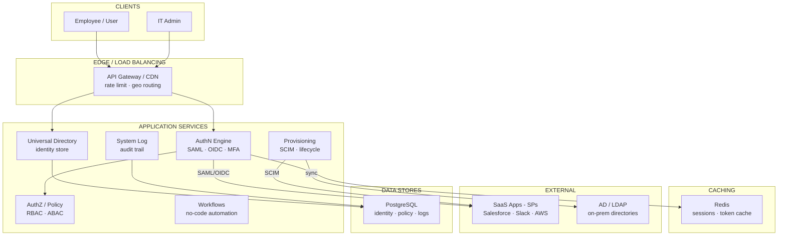
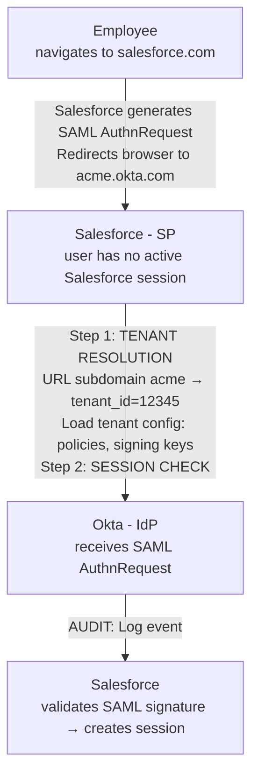
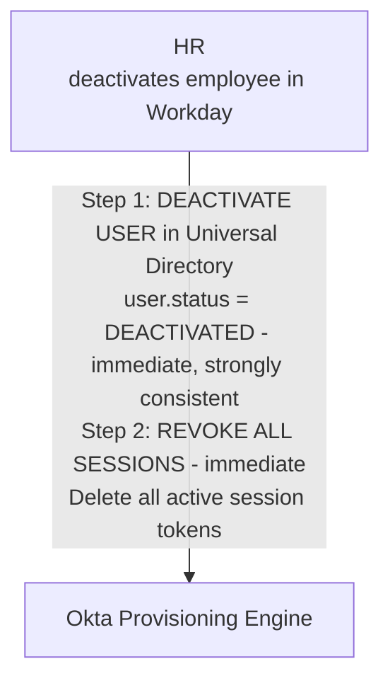

# Design: Okta

*Identity & Access Management · 75 min*

---

## Phase 1: Clarify the Problem & Scope *(5–7 min)*

> **Say:** "We're designing a cloud Identity-as-a-Service (IDaaS) platform like Okta. Okta is fundamentally different from every other system we've designed: it is a TRUST PLATFORM. When Okta says 'this user is who they claim to be,' thousands of downstream applications grant access based on that assertion. A false positive (authenticating an attacker) is a catastrophic security breach affecting EVERY connected application. A false negative (locking out a legitimate user) blocks that person from ALL their work tools. And downtime means nobody at thousands of companies can log in to ANYTHING. The system sits on the critical path of every employee at every customer — it's the front door to the modern enterprise."

### Questions I'd Ask

- **What outcome are we optimizing for?** — *Legitimate-user auth success rate (authorized users can log in, every time, fast) WHILE maintaining zero unauthorized access. These are competing: tighter security → more friction → more legitimate failures. Secondary: time-to-productivity for new employees (onboarding speed) and time-to-lockout for departing employees (deprovisioning speed). This shapes the policy engine — it must be expressive enough to distinguish "unusual but legitimate" from "compromised account" without blocking real users.*
- **Core capabilities?** — *Single Sign-On (SSO), Multi-Factor Authentication (MFA), Universal Directory (user/group management), Lifecycle Management (provisioning/deprovisioning), API Access Management (OAuth2/OIDC tokens).*
- **Who are the tenants?** — *~19,000+ customer organizations, from 50-person startups to Fortune 500 enterprises. Each tenant is completely isolated. Tenant data MUST NEVER cross boundaries.*
- **Federation protocols?** — *SAML 2.0 (still dominant for enterprise), OpenID Connect/OAuth 2.0 (modern apps), WS-Federation (Microsoft legacy), SCIM (user provisioning).*
- **Integration catalog?** — *Okta Integration Network (OIN): 7,500+ pre-built integrations (Salesforce, Slack, AWS, Office 365, etc.) with SSO and provisioning.*
- **On-prem connectivity?** — *Okta AD Agent: lightweight agent installed in customer's network that bridges on-prem Active Directory / LDAP to cloud Okta. Outbound-only connections (no inbound firewall holes).*
- **Scale?** — *Hundreds of millions of authentications per day across all tenants. Sub-200ms auth latency. 99.99% availability SLA.*

### Agreed Scope

| In Scope | Out of Scope |
|---|---|
| Authentication pipeline (login flow) | Okta Privileged Access (PAM) |
| SSO (SAML + OIDC) federation | Identity Governance & Admin (IGA) |
| Multi-factor authentication (MFA) | Advanced Threat Detection analytics |
| Multi-tenant data isolation | Customer Identity (CIAM) specifics |
| Universal Directory & user store | Passwordless / FIDO2 protocol details |
| Directory sync (AD/LDAP agents) | Admin console UI |
| Token issuance (OAuth2/OIDC) | Pricing / billing system |

### Core Use Cases

- **UC1 (Employee SSO Login):** Employee at Acme Corp opens Salesforce → redirected to Okta (acme.okta.com) → enters username/password → Okta verifies credentials → MFA challenge (push to Okta Verify app) → user approves → Okta issues SAML assertion → Salesforce grants access. Total: <5 seconds including MFA.
- **UC2 (Session-based SSO):** Same employee, 10 minutes later, opens Slack → redirected to Okta → Okta recognizes EXISTING session (cookie) → no password prompt → issues SAML assertion for Slack → Slack grants access. Total: <1 second (transparent redirect).
- **UC3 (New Employee Onboarding):** HR creates user in Workday → SCIM provisioning triggers in Okta → Okta creates user, assigns to groups based on department → auto-provisions accounts in Salesforce, Slack, GitHub, AWS (each via SCIM or API) → employee has access to all apps from day one.
- **UC4 (Employee Offboarding):** HR deactivates user in Workday → Okta deactivates user → IMMEDIATELY revokes all active sessions → deprovisions from all connected apps → within minutes, employee is locked out of EVERYTHING. This is the most security-critical lifecycle event.
- **UC5 (Suspicious Login):** Login attempt from unusual location (user normally in NYC, attempt from Eastern Europe) → Okta's adaptive MFA policy triggers additional factor → user can't produce the factor → access denied → security event logged → admin alerted.

### Non-Functional Requirements

- **Availability: 99.99% (52 min downtime/year max):** If Okta is down, employees at 19,000+ companies can't log in to ANY of their applications. Okta downtime = enterprise-wide work stoppage for customers.
- **Latency: <200ms for auth decisions:** Authentication sits on the critical path of every login. A slow Okta makes every SaaS app feel slow. Users blame the app, not the identity provider.
- **Security: zero data leakage between tenants:** Acme Corp's user directory must NEVER be visible to Beta Corp. This is contractual, regulatory, and existential — a cross-tenant leak would destroy trust in the platform.
- **Auditability:** Every authentication, MFA challenge, token issuance, provisioning action, admin change logged with immutable audit trail per tenant. Required for SOC 2, FedRAMP, HIPAA compliance.
- **Consistency:** Strong consistency for auth decisions. If a user is deactivated at T=0, no authentication should succeed at T=0+1ms. Stale reads here = security vulnerability.

> **Tip:** The defining tension: ABSOLUTE SECURITY with MAXIMUM AVAILABILITY. Most systems can trade security for availability or vice versa. Okta cannot. Wrongly authenticating an attacker is a breach. Failing to authenticate a legitimate user is a business disruption. Downtime is a disruption for ALL customers. The system must be secure AND available AND fast AND consistent — simultaneously. This is why identity platforms are among the hardest systems to build and why there are only a few major providers.

---

## Phase 2: Back-of-the-Envelope Estimation *(3–5 min)*

| Metric | Value | Detail |
|---|---|---|
| **Customer Tenants** | **~19,000+** | Each tenant: own user directory, own policies, own app integrations. Complete isolation. |
| **Managed Identities** | **~hundreds of millions** | Workforce + customer identities across all tenants. Largest tenants: millions of users each. |
| **Authentications / Day** | **~hundreds of millions** | Peak: Monday 9 AM across US time zones. Every employee logging into work = auth spike. |
| **Auth Latency Target** | **<200ms** | Credential verification + policy evaluation + token issuance. Excluding MFA user interaction time. |
| **OIN Integrations** | **7,500+** | Pre-built SSO + provisioning connectors. Each with SAML/OIDC metadata and SCIM endpoints. |
| **Token Issuance Rate** | **~50K+ / sec peak** | Each SSO redirect = token/assertion issuance. Crypto operations (sign JWT/SAML) on every request. |
| **Active Sessions** | **tens of millions** | Each authenticated user has an active Okta session. Session state must be queryable in <5ms. |
| **Audit Events / Day** | **~billions** | Every login, MFA challenge, token issue, admin action, provisioning event. Immutable. 1-year retention minimum. |

> **Decision:** **Key insight #1 — Authentication is CRYPTO-INTENSIVE:** Every SAML assertion must be XML-signed (RSA-2048). Every JWT/OIDC token must be signed (RS256 or ES256). Every password must be verified (bcrypt/scrypt, deliberately slow: ~100ms per hash). At 50K tokens/sec peak, this is a massive crypto workload. Dedicated signing infrastructure (HSMs or crypto-optimized nodes) is required.

> **Decision:** **Key insight #2 — The "Monday 9 AM" problem:** Traffic is extremely spiky. At 9 AM Eastern, millions of US workers log in to start their day. By 9:05, traffic normalizes. This 5-minute spike can be 5-10x the steady-state load. The system must handle this without pre-warming or auto-scaling delays — capacity must be PRE-PROVISIONED for the Monday morning peak.

> **Decision:** **Key insight #3 — Tenant size varies by 10,000x:** A 50-person startup and a 500,000-employee enterprise share the same platform. The enterprise generates 10,000x more auth traffic. The architecture must prevent a "noisy neighbor" — one large tenant's traffic spike must not degrade authentication for smaller tenants. This requires per-tenant rate limiting and resource isolation.

---

## Phase 3: High-Level Design *(8–12 min)*

> **Say:** "I'll organize Okta's architecture around the AUTHENTICATION PIPELINE — the sequence of steps that happen when a user tries to log in. This is the hot path that must be fast, secure, and always available. Around this pipeline sit the supporting systems: the Universal Directory (user store), the Policy Engine (who can access what, and what factors are required), the Token Service (issuing SAML/OIDC assertions), and the Provisioning Engine (lifecycle management)."

### Key Architecture Decisions

> **Say:** "Here's WHY I chose each technology — mapping requirements to tradeoffs. Every choice has a rejected alternative and a consequence."

| Requirement | Decision | Why (and what was rejected) | Consistency |
|---|---|---|---|
| 99.99% availability — downtime = enterprise work stoppage | Multi-region active-active | Each region independently serves auth requests. If one region fails, others absorb traffic. Single-region = 53 min downtime/year max. | AP for routing, CP for auth decisions |
| Auth decisions must be consistent (deprovisioned = blocked) | Strong consistency for sessions + auth | A deprovisioned user must be blocked within 30 seconds globally. Eventual consistency could allow fired employees to access systems. | CP |
| 19,000 tenants, strict data isolation | Shared DB sharded by org_id (not DB-per-tenant) | 19K databases = 19K to patch, back up, monitor. Shared DB + mandatory org_id filter + Row-Level Security. Tradeoff: isolation depends on app correctness. | — |
| <200ms auth latency including MFA | Redis for session tokens (not DB lookup) | Session validation is the hottest path. Redis <1ms vs PostgreSQL 5-20ms. 10x latency reduction on every authenticated request. | — |
| SAML/OIDC tokens must be cryptographically signed | Per-tenant signing keys in HSM | Hardware Security Module: private keys never leave the HSM. Even Okta engineers can't extract them. Required for enterprise trust. | — |
| Federated with 200+ SaaS apps | Standard protocols (SAML, OIDC, SCIM) not custom APIs | Standards mean any compliant SP works without custom integration. Custom APIs would require per-SP adapters — doesn't scale to 200+ apps. | — |

### Major Components



#### Authentication Pipeline [HOT PATH]
- Credential verification (password, delegated auth)
- MFA orchestration (push, TOTP, SMS, WebAuthn)
- Adaptive risk scoring (location, device, behavior)
- Session creation and management

#### Universal Directory [STORE]
- User profiles, credentials, group memberships
- Per-tenant isolated data store
- Custom attributes / schema per tenant
- Mastered by: Okta, AD, LDAP, HR system, or SCIM

#### Policy Engine [RULES]
- Sign-on policies (which factors, when)
- App-level access policies
- Network zones (trusted IPs / VPN)
- Adaptive MFA rules (risk-based)

#### Token / Assertion Service [CRYPTO]
- SAML 2.0 assertion generation & signing
- OAuth2 / OIDC token issuance (access, ID, refresh)
- Per-tenant signing keys (RSA/EC key pairs)
- Token introspection & revocation

#### Provisioning Engine [LIFECYCLE]
- User create/update/deactivate across apps
- SCIM 2.0 protocol for app provisioning
- Group push (Okta group → app role)
- Import from HR systems (Workday, BambooHR)

#### Agent Gateway [HYBRID]
- Connects on-prem AD/LDAP to cloud Okta
- Outbound-only (no inbound firewall rules)
- Delegated auth: Okta forwards to AD via agent
- Real-time sync: AD changes → Okta within minutes

#### Audit & System Log [AUDIT]
- Every auth event, admin action, provisioning event
- Immutable append-only log per tenant
- Streaming to customer SIEM (Splunk, etc.)
- SOC 2, FedRAMP, HIPAA compliance

#### Threat Detection [GUARD]
- Credential stuffing detection
- Bot detection (CAPTCHAs, device fingerprint)
- Impossible travel detection
- Brute-force rate limiting per user & IP

### Flow 1: SP-Initiated SSO (Employee opens Salesforce)



### Flow 2: User Deprovisioning (Employee Fired)



> **Say:** "Deep dives: (1) The authentication pipeline — how every login is processed with credential verification, MFA, policy evaluation, and token issuance. (2) Multi-tenant isolation — the hardest architecture problem: ensuring absolute data separation while sharing infrastructure. (3) SSO federation protocols — how SAML and OIDC actually work at the protocol level. (4) Directory integration — how the AD Agent bridges on-prem directories to the cloud."

---

## Phase 4: Deep Dives *(25–30 min)*

### Deep Dive 1: Authentication Pipeline (~8 min)

> **Goal:** **The core challenge:** Every login traverses a pipeline: tenant resolution → credential verification → MFA orchestration → policy evaluation → token issuance. Each step has different performance characteristics (bcrypt is deliberately slow, policy evaluation must be fast, SAML signing is CPU-intensive). The pipeline must complete in <200ms (excluding user interaction time for MFA) while being absolutely secure — a bug in any step can expose every customer's data.

**Credential Verification Modes**

| Mode | How It Works | Latency | When Used |
|---|---|---|---|
| Okta-mastered | User's password hash stored in Okta's directory. Bcrypt comparison on login. | 50-150ms (bcrypt is deliberately slow to resist brute-force) | Cloud-native orgs with no on-prem AD |
| Delegated to AD | Okta forwards credentials to on-prem AD Agent → agent authenticates against AD → returns result. | 200-500ms (network round-trip to customer's data center) | Enterprises with existing AD infrastructure |
| Delegated to LDAP | Similar to AD but via LDAP bind. | 200-500ms | Non-Microsoft directory environments |
| Social / External IdP | Redirect to Google/Azure AD/etc. They verify credentials. Okta receives assertion. | 1-3 seconds (browser redirects) | Customer identity (CIAM), B2B federation |
| Passwordless | Email magic link, Okta Verify biometric, or FIDO2 WebAuthn. No password involved. | Varies (user interaction) | Modern security-conscious orgs |

**MFA Orchestration**

```sql
── MFA Factor Challenge Flow ──

Policy determines WHICH factors and WHEN:
  "Always require MFA for Salesforce"
  "Require MFA only from untrusted networks"
  "Require hardware key for AWS Console access"

Factor selection (if multiple enrolled):
  Prefer: Okta Verify Push > WebAuthn > TOTP > SMS
  (ranked by security strength, not user preference)
  User can choose a different enrolled factor.

Factor challenge flows:

  Okta Verify Push (most common):
    Okta → push notification to user's phone app
    User sees: "Login to Salesforce from Chrome on Windows"
    User taps "Approve" → app sends signed approval to Okta
    Timeout: 60 seconds. If no response → fall back to TOTP.
    Anti-phishing: Number matching ("Enter the number shown: 42")

  TOTP (Google Authenticator, etc.):
    User opens authenticator app → reads 6-digit code → enters it
    Okta validates: HMAC-SHA1(shared_secret, floor(time/30))
    Clock skew tolerance: ±1 window (±30 seconds)

  WebAuthn / FIDO2:
    Browser prompts: "Touch your security key" or "Use fingerprint"
    Public key cryptography: challenge signed by device's private key
    Phishing-resistant: origin (domain) is bound into the signature

  SMS / Voice (lowest security, regulatory fallback):
    Okta sends 6-digit code via SMS/voice to registered phone
    Known vulnerabilities: SIM swapping, SS7 interception
    Many orgs are disabling SMS MFA in favor of push/WebAuthn
```

**Session Management**

- **Okta session:** After successful authentication, Okta creates a session identified by a secure cookie (`sid`) on the `acme.okta.com` domain. Subsequent SSO redirects check this cookie — if valid session exists, no re-authentication needed.
- **Session lifetime:** Configured per tenant policy: "Session expires after 12 hours" or "Session expires after 30 minutes of inactivity." Admins balance security (short sessions) vs. UX (fewer re-auth prompts).
- **Session storage:** Distributed cache (Redis cluster) for <5ms lookup. Session data: user_id, tenant_id, auth_time, factors_used, device_info. Must be strongly consistent — session revocation must propagate immediately.
- **Global session revocation:** When user is deactivated → delete ALL session records for that user → ANY subsequent SSO redirect finds no session → re-auth required → credentials invalid → access denied. This must happen in milliseconds, not minutes.

> **Decision:** **Why strong consistency for sessions but not for user profiles?** User profile updates (changing a phone number, updating a name) can tolerate seconds of propagation delay — it's a minor UX glitch. But session state must be IMMEDIATELY consistent: if an admin revokes a session, the very next request MUST see the revocation. Otherwise, a terminated employee retains access for the replication lag duration. This is a security requirement, not a performance optimization. We use a strongly consistent session store (single-leader or consensus-based) even though it's more expensive than an eventually consistent cache.

### Deep Dive 2: Multi-Tenant Isolation (~8 min)

> **Goal:** **The core challenge:** 19,000+ tenants share the same physical infrastructure. Each tenant's data (users, credentials, policies, audit logs) must be COMPLETELY invisible to every other tenant. A bug, query error, or vulnerability must never allow cross-tenant data access. This is the #1 architectural concern — a cross-tenant breach would be an extinction-level event for an identity provider.

```sql
── Multi-Tenant Data Isolation Strategy ──

Approach: Shared infrastructure, logically isolated data

  NOT: one database per tenant (operational nightmare at 19K tenants)
  NOT: one cluster per tenant (too expensive, slow provisioning)
  YES: shared database clusters with tenant_id on EVERY table/query

Data Layer Isolation:

  Level 1: Schema-level isolation
    Every table has tenant_id as a REQUIRED column.
    Every query includes WHERE tenant_id = ? as a MANDATORY filter.
    Database-level row security policies enforce this (PostgreSQL RLS).

    users
      tenant_id    BIGINT NOT NULL  ← ALWAYS first in composite PK
      user_id      BIGINT NOT NULL
      email          VARCHAR
      password_hash  VARCHAR
      status         ENUM (active, deactivated, suspended)
      ...

    All indexes are prefixed with tenant_id:
      INDEX (tenant_id, email)       ← user lookup
      INDEX (tenant_id, user_id)     ← primary access
      INDEX (tenant_id, status)      ← lifecycle queries

  Level 2: Application-level enforcement
    Every API call includes tenant context (from URL subdomain or token).
    Middleware extracts tenant_id and INJECTS it into every DB query.
    IMPOSSIBLE for application code to accidentally omit tenant filter.
    Code review rule: any raw SQL without tenant_id filter is rejected.

  Level 3: Crypto isolation
    Each tenant has its OWN signing key pair (RSA-2048 or EC P-256).
    Tenant A's SAML assertions are signed with Tenant A's key.
    Even if assertion data leaked, it can't be used against Tenant B
    (signature won't validate with Tenant B's public key).
    Keys stored in HSM (Hardware Security Module), never exported.

  Level 4: Network isolation
    Tenant admin APIs are authenticated with tenant-scoped API tokens.
    OAuth tokens include tenant_id in the audience claim.
    Rate limiting is per-tenant (not global).

Sharding for large tenants:
  Most tenants: co-located in shared database shards.
  Largest tenants (500K+ users): dedicated database shard(s).
  Shard mapping: tenant_id → shard_id (cached in routing layer).
  Prevents noisy-neighbor: large tenant's query load doesn't slow small tenants.
```

> **Decision:** **Why not a database-per-tenant model?** At 19,000 tenants, database-per-tenant means 19,000 databases to manage: patch, back up, monitor, scale individually. Operational cost is prohibitive. Shared databases with tenant_id isolation offer: (1) efficient resource utilization (small tenants share database pages), (2) uniform operations (one schema migration updates all tenants), (3) fast tenant provisioning (insert config rows, not create databases). The tradeoff: isolation depends on APPLICATION correctness (never forgetting the tenant filter) rather than DATABASE boundaries. Mitigated by: mandatory framework-level tenant injection (middleware that ALWAYS appends tenant_id), PostgreSQL Row-Level Security as a second layer, and extensive testing with multi-tenant test scenarios.

- **Tenant provisioning:** New customer signs up → create tenant_id, insert into config table, generate signing key pair, create admin user. Total time: <30 seconds. No database creation needed.
- **Tenant deletion (rare):** Cascade-delete all rows with matching tenant_id across all tables. Revoke all signing keys. Purge from all caches. This is a dangerous operation — double-confirmed, audit-logged, and irreversible.
- **Compliance isolation:** Some tenants (government, healthcare) require data residency guarantees. These tenants are assigned to region-specific database shards (e.g., US-only, EU-only). The routing layer ensures their data never leaves the designated region.

### Deep Dive 3: SSO & Federation Protocols (~6 min)

> **Goal:** **The core challenge:** Okta must speak EVERY identity protocol because it connects to EVERY enterprise application. SAML 2.0 (XML-based, 2005-era but still dominant in enterprise), OIDC/OAuth 2.0 (JSON-based, modern apps), WS-Federation (Microsoft legacy), and SWA (form-fill for apps with no federation support). Each protocol has different security properties, different token formats, and different vulnerability surfaces.

| Protocol | Token Format | When Used | Key Security Property |
|---|---|---|---|
| SAML 2.0 | XML, RSA-signed | Enterprise SaaS (Salesforce, Workday, ServiceNow) | Assertion signed with tenant's private key. SP verifies with Okta's public cert. Replay protection via NotOnOrAfter + InResponseTo. |
| OIDC | JWT (JSON), RS256-signed | Modern apps, SPAs, mobile apps | ID token is a signed JWT. Access token for API access. Refresh token for long-lived sessions. PKCE for public clients. |
| OAuth 2.0 | Opaque or JWT access token | API authorization (machine-to-machine) | Scoped access (read:users vs. write:users). Short-lived access tokens (1 hour). Client credentials for service accounts. |
| WS-Fed | XML / SAML-like | Microsoft ecosystem (older O365, ADFS) | Being deprecated in favor of OIDC. Still needed for legacy Windows environments. |
| SWA | N/A (form fill) | Legacy apps with no federation | Okta browser plugin auto-fills username/password. Least secure but only option for non-federated apps. |

```sql
── SAML 2.0 Assertion Structure (what Okta generates) ──

<saml:Assertion>
  <saml:Issuer>https://acme.okta.com</saml:Issuer>

  <ds:Signature>
    // RSA-SHA256 signature over the assertion
    // Signed with Okta's private key for tenant "acme"
    // Salesforce verifies with Okta's public certificate
  </ds:Signature>

  <saml:Subject>
    <saml:NameID>john.doe@acme.com</saml:NameID>
    <SubjectConfirmation>
      Recipient="https://login.salesforce.com/saml/SSO"
      NotOnOrAfter="2026-02-14T10:05:00Z"  // 5 min validity
      InResponseTo="_abc123"  // ties to original AuthnRequest
    </SubjectConfirmation>
  </saml:Subject>

  <saml:Conditions>
    NotBefore="2026-02-14T10:00:00Z"
    NotOnOrAfter="2026-02-14T10:05:00Z"
    <AudienceRestriction>
      <Audience>https://salesforce.com</Audience>
    </AudienceRestriction>
  </saml:Conditions>

  <saml:AttributeStatement>
    // Custom attributes mapped per-app-per-tenant
    firstName = "John"
    lastName  = "Doe"
    groups    = ["Sales", "US-West"]
    role      = "Standard User"
  </saml:AttributeStatement>
</saml:Assertion>

Security guarantees:
  1. Signature: assertion hasn't been tampered with
  2. NotOnOrAfter: can't be replayed after 5 minutes
  3. InResponseTo: can't be used out of context
  4. Audience: can't be forwarded to a different SP
```

> **Decision:** **Why does Okta need per-tenant signing keys?** If all tenants shared ONE signing key: a compromise of that key would let an attacker forge assertions for EVERY tenant — catastrophic. Per-tenant keys mean: a key compromise affects only one tenant. Key rotation affects only one tenant. Each tenant can have independent key lifecycle (rotate every 90 days, emergency rotation after incident). Keys are generated and stored in HSMs — the private key never leaves the hardware. Even Okta operators cannot extract the private keys.

### Deep Dive 4: Directory Integration & Sync (~5 min)

> **Goal:** **The core challenge:** Most enterprises have Active Directory (AD) as their on-prem source of truth for employee identities. Okta must: (1) import users from AD into Okta's Universal Directory, (2) keep them synchronized in near-real-time (employee changes in AD → reflected in Okta within minutes), and (3) optionally delegate authentication TO AD (Okta forwards the password to AD for verification). All of this without requiring the customer to open inbound firewall ports.

```sql
── Okta AD Agent Architecture ──

The Problem:
  Active Directory sits inside the corporate firewall.
  Okta is in the cloud.
  Enterprises will NOT open inbound firewall ports (security policy).
  So Okta can't directly query or connect to AD.

Solution: Outbound-only agent

  ┌─────────────────────────────────┐
  │  Customer's Corporate Network    │
  │                                  │
  │  ┌───────────┐   ┌──────────┐  │
  │  │ Active    │   │ Okta AD  │  │
  │  │ Directory │◄──│ Agent    │  │
  │  └───────────┘   └────┬─────┘  │
  │                       │         │
  │  (LDAP queries)       │ OUTBOUND ONLY (HTTPS)
  │                       │         │
  └───────────────────────┼─────────┘
                          │ (no inbound firewall rules needed)
                          ▼
  ┌─────────────────────────────────┐
  │  Okta Cloud                      │
  │                                  │
  │  ┌──────────────┐               │
  │  │ Agent Gateway │               │
  │  │ Service       │               │
  │  └──────┬───────┘               │
  │         │                        │
  │         ▼                        │
  │  ┌──────────────┐               │
  │  │ Universal    │               │
  │  │ Directory    │               │
  │  └──────────────┘               │
  └─────────────────────────────────┘

Agent responsibilities:

  1. User Import (scheduled, every 30-60 min)
     Agent queries AD for all users in configured OUs.
     Compares with last sync state.
     Sends new/changed/deleted users to Okta via HTTPS.
     Okta creates/updates/deactivates corresponding users.

  2. Real-Time Sync (event-driven)
     Agent registers for AD change notifications (DirSync control).
     When a user is created/modified/disabled in AD:
     Agent detects change → pushes to Okta within ~2-5 minutes.
     Critical for: immediate deactivation when AD account disabled.

  3. Delegated Authentication
     User logs into Okta → enters password.
     Okta does NOT store the user's AD password.
     Instead: Okta sends (encrypted) credential to AD Agent.
     Agent performs LDAP bind against AD with the credential.
     Result (success/failure) returned to Okta.
     Latency: ~200-500ms (round trip to customer's DC).

  4. Agent Clustering (high availability)
     Install 2+ agents on different servers.
     Okta distributes commands round-robin across agents.
     If one agent goes offline → auto-removed from rotation.
     Agent reconnects with exponential backoff (capped at 1 min).
```

> **Decision:** **Why outbound-only architecture instead of VPN or direct connect?** VPN/direct-connect creates a persistent network path FROM Okta's cloud INTO the customer's network — a massive security surface area. If Okta is compromised, the attacker has a tunnel into every customer's AD. Outbound-only architecture inverts this: the agent initiates connections TO Okta. The customer's firewall only allows outbound HTTPS (port 443), which is already universally permitted. There is no inbound path. Even if Okta's cloud is compromised, the attacker cannot initiate connections to customer networks — they can only respond to requests the agent makes. This is a fundamental security architecture choice that makes Okta safer for enterprises to adopt.

---

## Phase 5: Cross-Cutting Concerns *(10–12 min)*

### Storage Architecture Summary

> **Goal:** **What goes where and why.** Each data store is chosen for its access pattern — not by default. The question isn't "which database?" but "what are the read/write patterns, consistency requirements, and scale characteristics?"

| Data | Store | Why This Store |
|---|---|---|
| Identity records | PostgreSQL (sharded) | User profiles, credentials, group memberships. Sharded by org_id for tenant isolation. Encrypted at rest. |
| Policy rules | PostgreSQL | Authentication policies, MFA rules, conditional access. Read-heavy — cached aggressively. Versioned for audit. |
| Session tokens | Redis (clustered) | Active SSO sessions. TTL-based expiration. Distributed across regions for low-latency validation. |
| Audit logs | Append-only store | Every authentication event, admin action, policy change. Immutable. 90-day online retention, 7-year archive. |
| SAML/OIDC metadata | PostgreSQL + cache | SP certificates, redirect URIs, signing keys. Cached per-org. Invalidated on admin changes. |
| Directory sync state | PostgreSQL | Last sync cursor per AD/LDAP connection. Conflict resolution for bidirectional sync. |

### Failure Scenarios

| Scenario | Mitigation |
|---|---|
| Okta experiences full outage | THIS IS THE NIGHTMARE SCENARIO. Nobody at 19,000+ companies can log in to anything. Mitigations: (1) Multi-region active-active deployment with automatic failover. (2) DNS-based routing to healthy region. (3) Session cache replication — users with existing sessions can continue working even if the auth pipeline is degraded. (4) Many SPs cache their own sessions (Salesforce session survives Okta outage if already logged in). (5) Emergency break-glass procedures: enterprises have local admin accounts that bypass SSO. |
| AD Agent goes offline (customer's DC issue) | Delegated authentication to AD fails. Fallback: (1) If Okta has cached the user's password hash from a previous successful auth (opt-in feature), authenticate against cached hash. (2) If no cached credentials: user cannot log in with password, but can use passwordless MFA (WebAuthn, Okta Verify). (3) Alert tenant admin that AD agent is unreachable. Multiple agents in a cluster provide HA — single agent failure is seamless. |
| Credential stuffing attack (millions of login attempts) | Attacker tries breached username/password pairs from other services. Mitigations: (1) Per-IP rate limiting (progressive: CAPTCHA → block). (2) Per-user lockout after N failures (configurable per tenant). (3) Bot detection: device fingerprinting, impossible speed patterns. (4) Breached password detection: compare submitted passwords against known breach databases (HaveIBeenPwned-style). (5) Notify tenant admins of anomalous failure rates. |
| Signing key compromise (tenant's private key leaked) | Attacker can forge SAML assertions for that tenant's applications. Response: (1) Emergency key rotation — generate new key pair, publish new certificate to all SPs. (2) Revoke old key immediately. (3) All existing assertions signed with old key become invalid. (4) Per-tenant isolation means: ONLY this tenant is affected, not others. (5) Incident response: audit log review, determine scope of compromise. |
| Cross-tenant data leak (bug exposes Tenant B's data to Tenant A) | Existential threat. Mitigations: (1) Row-Level Security in database as defense-in-depth. (2) Framework-level mandatory tenant_id injection. (3) Automated tests: every API endpoint tested with cross-tenant access attempts. (4) Penetration testing by third parties. (5) Bug bounty program. (6) If detected: immediate incident response, affected tenant notification, regulatory disclosure. This scenario is why multi-tenant isolation is the #1 architectural concern. |
| Monday 9 AM traffic spike (5-10x normal) | Pre-provisioned capacity for 10x steady state — NO auto-scaling on the auth hot path (too slow to react). Auth pipeline is stateless and horizontally scaled behind load balancers. Session cache is the bottleneck — pre-warmed Redis cluster with sufficient memory for peak active sessions. Crypto operations (SAML signing) distributed across multiple nodes with pre-loaded keys. |

### Scalability

> **Tip:** **Scalability.** Okta's scaling challenge is unique: authentication is a latency-sensitive, globally distributed, multi-tenant service where downtime means 19,000+ companies can't log in to anything. The architecture is sharded by org_id (customer), so each customer's identity data is co-located. Auth requests are routed to the nearest region via GeoDNS. Within a region, the auth pipeline is stateless — any server can handle any org's request by reading from the org's shard. Session tokens are validated against Redis, not the database, for sub-ms checks. The scaling bottleneck is token validation during "Monday morning login storms" when entire enterprises authenticate simultaneously. This is handled by: (1) session persistence — users don't re-authenticate if they have a valid session, (2) Redis cluster scales reads linearly, (3) the most expensive operation (password hash verification via bcrypt) is CPU-bound and scales with server count. For enterprise SSO, the bottleneck shifts to the SP side — Okta processes the SAML assertion in <50ms, but the SP might take seconds to create its local session.

### Security Architecture

- **Defense in depth:** Every layer independently enforces tenant isolation. Even if the application layer has a bug, database RLS prevents cross-tenant reads. Even if the database is compromised, per-tenant encryption keys limit blast radius.
- **HSM for signing keys:** Tenant signing keys stored in FIPS 140-2 Level 3 Hardware Security Modules. Private keys never leave the HSM — signing operations are performed INSIDE the HSM. Even Okta engineers cannot extract key material.
- **Password storage:** Bcrypt with cost factor 12 (or scrypt/argon2). Never stored in plaintext, never logged, never transmitted except to the hashing function. Database compromise reveals only hashes — each hash requires ~100ms to brute-force ONE guess.
- **Zero standing access:** Okta engineers don't have permanent access to production systems or customer data. Access is granted just-in-time via approval workflow, time-limited, and fully audit-logged. Access to customer data requires customer consent.
- **SOC 2 Type II, FedRAMP, ISO 27001:** Regular third-party audits of security controls. Audit reports available to customers. Certifications are a contractual requirement for enterprise sales.

### Observability

- **Per-tenant metrics:** Auth success rate, auth latency (p50/p95/p99), MFA challenge rate, factor success rate. A sudden drop in auth success rate for one tenant = possible attack or configuration error.
- **Global metrics:** Total auth/sec, session count, token issuance rate, agent connectivity status. These drive capacity planning and incident detection.
- **System Log (per tenant):** Every event: login success/failure, MFA challenge, token issuance, admin change, provisioning action. Structured JSON, queryable via API, streamable to customer's SIEM. Retention: 90 days in Okta, longer via SIEM integration.
- **Status page:** Public status page (status.okta.com) with per-service health. Enterprise customers subscribe to real-time incident notifications. Transparency in outages builds trust — hiding issues destroys it.

---

## Phase 6: Wrap-Up & Evolution *(3–5 min)*

> **Say:** "To summarize: Okta is a TRUST PLATFORM where every architectural decision is filtered through the question 'what happens if this is wrong and an attacker gets through?' The AUTHENTICATION PIPELINE processes every login through: tenant resolution (URL subdomain → tenant config), credential verification (Okta-mastered bcrypt or delegated to on-prem AD via outbound-only agents), MFA orchestration (push, TOTP, WebAuthn — policy-driven), policy evaluation (app access rules, network zones, device trust), and token/assertion issuance (SAML/OIDC signed with per-tenant keys stored in HSMs). MULTI-TENANT ISOLATION is enforced at four layers: schema-level (tenant_id on every table + row-level security), application-level (mandatory middleware injection), crypto-level (per-tenant signing keys), and network-level (tenant-scoped API tokens and rate limits). The OUTBOUND-ONLY AGENT ARCHITECTURE is a fundamental security design: Okta cannot initiate connections into customer networks, eliminating an entire class of supply-chain attack vectors. Sessions are stored in a strongly consistent distributed cache — revocation must propagate IMMEDIATELY because a deactivated user must be locked out within milliseconds, not minutes."

### What I'd Build Next

| Extension | Architecture Impact |
|---|---|
| Continuous Access Evaluation | Instead of "authenticate once, trust for 8 hours," continuously re-evaluate risk signals during a session: device posture changes, impossible travel detected, IP reputation drops. Requires a streaming risk-scoring pipeline that consumes signals from endpoints, network, and cloud apps — and can revoke sessions mid-flight. |
| Passkey / FIDO2 Everywhere | Eliminate passwords entirely. Users authenticate with biometrics (Face ID, Touch ID) or security keys. Requires: WebAuthn credential storage per-user-per-device, cross-device sync (Apple/Google passkey sync), and a migration path from password-based to passwordless for existing tenants. |
| Identity Threat Detection (ITDR) | ML-based detection of compromised identities: token replay, session hijacking, lateral movement. Requires: behavioral baselining per-user (normal login times, locations, apps), anomaly detection model, real-time alerting, and automated response (lock account, terminate sessions, require re-auth). |
| Decentralized Identity (Verifiable Credentials) | Users hold cryptographic credentials in a digital wallet (W3C Verifiable Credentials). Present proof of identity without revealing all attributes ("prove I'm over 21 without revealing my birthdate"). Requires: new trust model (issuer → holder → verifier), wallet integration, and selective disclosure crypto. |
| Fine-Grained Authorization (Zanzibar-style) | Move beyond "can this user access this app?" to "can this user edit this specific document?" Relationship-based access control at the resource level, like Google's Zanzibar. Requires: a policy evaluation engine that can handle millions of authorization checks per second with sub-10ms latency, plus a graph database for relationship storage. |

> **Tip:** **Closing framing:** Okta occupies a unique position among the systems we've designed: it is INFRASTRUCTURE FOR TRUST. Every other system we've designed — Salesforce, Slack, AWS, GitHub — depends on an identity provider to answer the question "is this user who they claim to be?" If the identity provider answers wrong, ALL downstream systems are compromised. This asymmetry of impact shapes every decision: per-tenant signing keys (breach isolation), outbound-only agents (eliminate supply-chain attack surface), HSM-stored keys (even Okta operators can't extract them), strong session consistency (revocation in milliseconds), and multi-layer tenant isolation (defense in depth against the one bug that would be existential). The priority ordering is unique: SECURITY > AVAILABILITY > CONSISTENCY > LATENCY. In most systems you trade security for speed. In an identity platform, you trade speed for security — and then engineer your way back to fast.

---

## Phase 7: Interview Q&A *(Practice)*

> **Say:** "Here are the hardest questions an interviewer would ask about this design, and how to answer them. Each answer demonstrates deep understanding of the tradeoffs, not just surface knowledge."

**Q:** What happens if Okta goes down? How do you achieve 99.99% availability?

**A:** If Okta goes down, employees at 19,000+ companies can't log in to any of their cloud applications — it's an enterprise-wide work stoppage. 99.99% means <53 minutes of downtime per year. We achieve this through: (1) multi-region active-active deployment — each region can independently serve auth requests, (2) session persistence — if the auth service is briefly unavailable, users with existing sessions continue working (sessions are validated against Redis, not the auth DB), (3) SAML/OIDC responses are signed with keys cached at the SP side, so SPs can validate tokens even during brief Okta outages. The most critical failover scenario is database failure: we use synchronous replication to a standby with automatic failover (<30 seconds). During those 30 seconds, new logins fail but existing sessions work. For planned maintenance, we do rolling deploys with zero-downtime migrations. The honest answer: achieving 99.99% is as much about operational discipline (change management, runbooks, chaos testing) as it is about architecture.

**Q:** How do you prevent a compromised password at one SP from affecting others?

**A:** This is a core benefit of SSO — the user's password is ONLY stored and verified by Okta, never by individual SPs. When a user logs into Salesforce via Okta SSO, Salesforce never sees the password. It receives a signed SAML assertion saying "Okta verified this user at this time." If Salesforce is compromised, the attacker gets Salesforce data but NOT the user's Okta password. They can't use the breach to access Slack, AWS, or any other SP. Conversely, if the user's Okta password is compromised, the blast radius IS every SP — which is why Okta enforces MFA, credential stuffing detection, and password policy enforcement at the IdP layer. The security model is: centralize the high-value target (credentials) in a purpose-built, hardened system rather than distributing it across dozens of SPs with varying security postures.

**Q:** How does user deprovisioning work across 200+ connected applications?

**A:** When HR deactivates an employee in the source directory (Workday, AD), Okta's provisioning engine must propagate that change to every connected application. The pipeline is: (1) directory sync detects the change (via SCIM webhook from Workday, or polling AD every 5 minutes), (2) Okta marks the user as "deactivated" in the Universal Directory, (3) ALL active sessions for that user are immediately revoked (delete from Redis), (4) for each connected SP that supports SCIM, Okta sends a SCIM PATCH to deactivate the user account, (5) for SPs without SCIM (legacy apps), Okta can disable via API or flag for manual review. Steps 4-5 are asynchronous and may take 5-60 seconds per SP. The SLA we guarantee: session revocation (step 3) within 30 seconds, SCIM deprovisioning within 5 minutes. The risk window is the time between deactivation and SCIM propagation — during this window, the user can't START new sessions (Okta blocks auth) but EXISTING sessions at SPs might still be valid until they expire or the SP processes the SCIM request.

**Q:** How do you handle multi-tenant isolation in a shared infrastructure?

**A:** Every query includes org_id as a mandatory filter — there is no code path that can accidentally return data across organizations. This is enforced at multiple layers: (1) database: sharded by org_id, so a query physically cannot scan another org's data, (2) application: middleware injects org_id from the authenticated session into every DB query — developers can't forget it, (3) API: every API endpoint validates that the requested resource belongs to the caller's org, (4) cache: Redis keys are prefixed with org_id, so cache poisoning across tenants is impossible. For noisy neighbor protection: rate limits are per-org, so one organization running a bulk user import can't degrade auth latency for other orgs. CPU-intensive operations (bcrypt hashing) run in isolated thread pools per org. We regularly run penetration tests specifically targeting cross-tenant data leakage — it's the highest-severity finding category.
