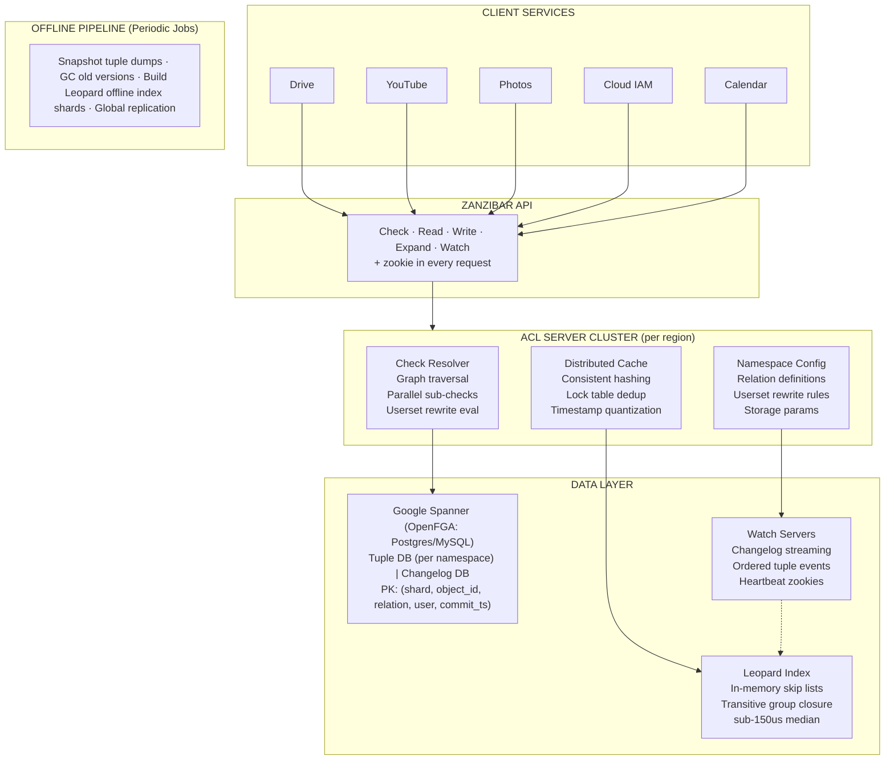
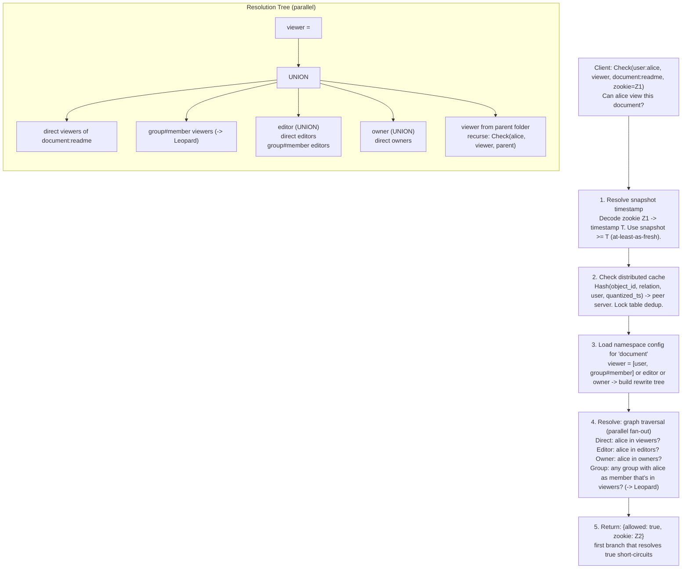
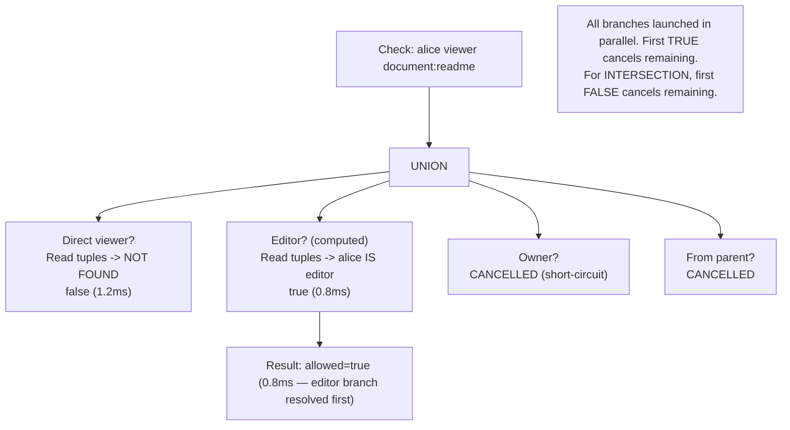
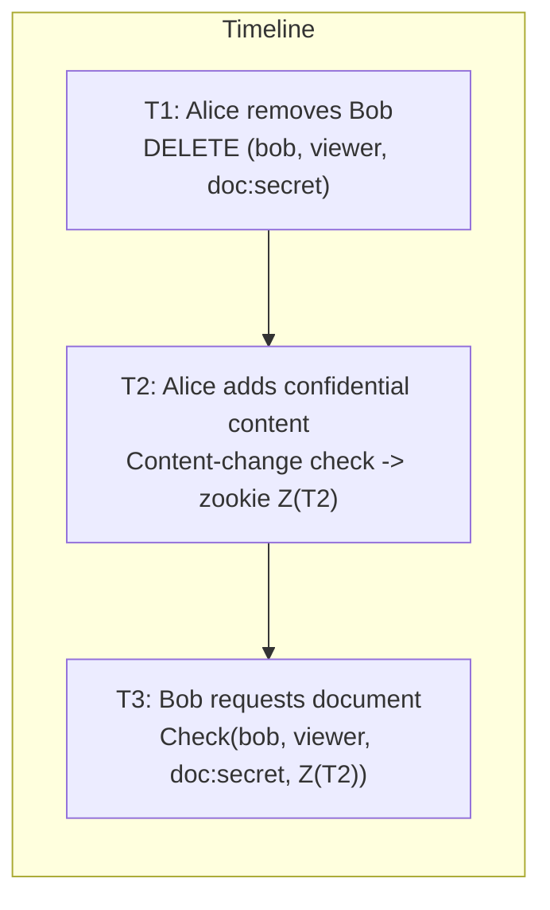
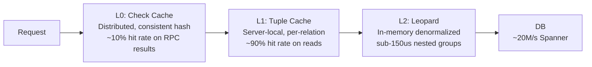

# Design: OpenFGA / Zanzibar

*Authorization · 75 min*

---

## Phase 1: Clarify the Problem & Scope *(5–7 min)*

> **Say:** "We're designing a Zanzibar-style global authorization system — the engine behind 'can user X do action Y on resource Z?' at massive scale. Google's Zanzibar handles 10M+ checks/second for Drive, YouTube, Photos, Calendar, and Cloud with <10ms p95 latency and 99.999% availability. OpenFGA is its open-source descendant. The core insight: model all authorization as **relationships between objects** (ReBAC), store them as tuples, and resolve permission checks via graph traversal — unifying ACLs, RBAC, and ABAC into one system."

### Questions I'd Ask

- **What's the core abstraction?** -- Relationship tuples: (user, relation, object). Example: (user:alice, editor, document:readme). Authorization = "does a path exist in the relationship graph from user to object via the given relation?"
- **What authorization models must it support?** -- Direct grants (ACLs), role-based (RBAC), relationship-based (ReBAC with group nesting), and attribute-based (ABAC via conditions). All expressed through the same tuple + config language.
- **What APIs are needed?** -- Check ("can user do this?"), Read (fetch stored tuples), Write (add/delete tuples), Expand (show userset tree), ListObjects ("what can user access?"), ListUsers ("who can access this?"), Watch (stream changes).
- **What does the consistency model look like?** -- Must solve the "new enemy" problem: when you revoke access then add content, the system must never serve the revoked user the new content using stale permissions. Zookies (opaque consistency tokens) ensure causal ordering.
- **How deep can permission graphs get?** -- Very deep. Org -> team -> sub-team -> project -> folder -> document -> user. Plus computed relations (editors are also viewers). The Leopard indexing system precomputes transitive closures for deeply nested groups.
- **Scale targets?** -- Zanzibar: trillions of tuples, billions of users, 10M+ checks/second, <10ms p95 latency, 99.999% availability over 3 years. OpenFGA targets similar model at smaller scale with PostgreSQL/MySQL backends.

### Agreed Scope

| In Scope | Out of Scope |
|---|---|
| Relationship tuple data model & namespace config | Authentication (who the user is) |
| Check API resolution algorithm (graph traversal) | Application-level policy languages (OPA/Rego) |
| Zookie consistency protocol (new enemy prevention) | Network-level authorization (firewalls, mTLS) |
| Leopard indexing for nested groups | Fine-grained data masking / column-level |
| Caching & hotspot management | Detailed Spanner internals |
| ListObjects / ListUsers reverse queries | Full ABAC condition evaluation engine |
| Watch API for change streams | UI / admin console design |

### 5 Core Design Principles

- **Relationships, not roles:** Model all authorization as edges in a graph. Roles, groups, hierarchies are all just relationship patterns. This unifies ACLs, RBAC, and ABAC into one engine.
- **Causal consistency:** The "new enemy" problem is the fundamental correctness threat. Zookies ensure permission checks respect the ordering of ACL and content changes.
- **Normalized storage, denormalized serving:** Store tuples in normalized form for correctness; build indexes (Leopard, distributed caches) for performance. Correctness must never be sacrificed for speed.
- **Schema separation:** Namespace configurations (the "model") are separate from relationship tuples (the "data"). Models evolve without migrating data.
- **Application-agnostic:** One authorization engine serves hundreds of diverse services. Each service defines its own namespace config but shares the infrastructure, consistency guarantees, and API.

> **Tip:** The central tension in authorization systems: **consistency vs. latency**. Reading the latest permissions from a globally distributed database on every check would be correct but slow. Reading from a local cache is fast but potentially stale. Zanzibar's genius is the zookie protocol — it lets applications specify *exactly how fresh* they need permissions to be, giving the system freedom to optimize every other check for speed.

---

## Phase 2: Back-of-the-Envelope Estimation *(3–5 min)*

| Metric | Value | Detail |
|---|---|---|
| **Check RPS (Zanzibar)** | **>10M/sec** | Millions of authorization decisions per second across all Google services. Each user action may trigger 10-100 checks. |
| **Stored Tuples** | **Trillions** | Every shared document, group membership, folder ACL across all Google products = trillions of relationship tuples. |
| **Check Latency (p95)** | **<10ms** | Authorization is on the critical path of every user interaction. Search results may need 10-100 checks in parallel. |
| **Availability** | **99.999%** | <2 min global downtime per quarter. Auth must be more available than the services it protects. |
| **Spanner Reads** | **~20M/sec** | In-memory caches absorb ~90% of reads. Remaining 20M/sec hit Spanner, at 0.5ms median latency. |
| **Leopard QPS** | **~1.5M/sec** | Specialized index for nested group resolution. Sub-150us median. Served entirely from memory. |
| **Global Clusters** | **30+ regions** | 10,000+ servers across dozens of clusters worldwide. Data replicated to all regions via Spanner. |
| **Write Volume** | **~100K/sec** | Writes are rare relative to reads (1:100+ ratio). Every write requires Spanner distributed coordination. |

> **Tip:** Key insight: **authorization is overwhelmingly read-heavy**. For every permission change (a write), there may be thousands of checks (reads). This extreme read:write ratio justifies aggressive caching, eventual consistency for most reads, and investing heavily in read-path optimization. Writes can afford to be slower because they're infrequent and must coordinate for correctness.

---

## Phase 3: High-Level Design *(8–12 min)*

> **Say:** "The architecture has five major layers: client applications submit requests to ACL server clusters, which resolve permissions via graph traversal using tuple data stored in Spanner, with the Leopard index handling deep group nesting and a distributed cache layer managing hot spots. A separate Watch server cluster streams changes for secondary indexes."



### Zanzibar Data Model: Tuples & Namespace Configs

```sql
// === Relationship Tuple (the core unit of authorization data) ===
tuple = (user, relation, object)

// Examples:
(user:alice,      editor,   document:readme)     // direct grant
(group:eng#member, viewer,   document:design)     // group grant (userset)
(document:readme,  parent,   folder:root)         // object hierarchy
(user:bob,         member,   group:eng)           // group membership

// === Namespace Configuration (the "schema" / authorization model) ===
type document
  relations
    define owner:   [user]
    define editor:  [user, group#member]
    define viewer:  [user, group#member] or editor or owner  // userset rewrite
    define parent:  [folder]

type folder
  relations
    define owner:   [user]
    define viewer:  [user, group#member] or viewer from parent  // inheritance
    define parent:  [folder]

type group
  relations
    define member:  [user, group#member]  // nested groups
```

### Key Architectural Decisions

| Decision | Choice | Why Not Alternative |
|---|---|---|
| Data Model | Relationship tuples (ReBAC) | RBAC can't express hierarchies; ABAC too slow at scale for real-time checks |
| Storage | Spanner (Zanzibar) / PostgreSQL (OpenFGA) | Need external consistency for zookies; NoSQL lacks transaction ordering |
| Consistency | Zookies (opaque tokens) | Strong consistency everywhere = too slow; eventual = new enemy problem |
| Check Algorithm | Graph traversal with parallel fan-out | Precomputing all permissions = too much storage; on-demand = flexible |
| Group Indexing | Leopard (in-memory transitive closure) | Recursive DB queries too slow for deeply nested groups (10+ levels) |
| Caching | Distributed cache with consistent hashing | Local-only cache = poor hit rates; centralized = single point of failure |
| Schema Evolution | Immutable model versions | Mutable models risk inconsistency during rollout across regions |

### Check API: End-to-End Flow



---

## Phase 4: Deep Dives *(25–30 min)*

### Deep Dive 1: Check Resolution Algorithm (8 min)

> **Goal:** Understand how Zanzibar evaluates "can user X do Y on object Z?" by traversing the relationship graph, applying userset rewrite rules, and parallelizing sub-checks.

- **Userset rewrite rules** are the heart of the schema. They express *computed relations*: "all editors are also viewers" becomes `define viewer: [user] or editor`. The Check resolver expands these rules into a tree of sub-problems, each resolved independently.
- **Three operators:** `union` (any branch true -> true), `intersection` (all branches true -> true), `exclusion` (base true AND subtracted false -> true). Union is by far the most common — "viewers = direct viewers OR editors OR owners".
- **Parallel fan-out:** For union operations, all branches are evaluated concurrently. The first branch that returns `true` short-circuits the entire check — no need to wait for slower branches. This is critical for latency.
- **Tuple-to-userset:** Expressions like `viewer from parent` first read the parent tuple for the object, then recursively check the viewer relation on the parent. This enables folder -> document inheritance without duplicating tuples.
- **Computed userset:** `or editor` means "also check the editor relation on the same object." Doesn't require any tuple reads — it's a lateral move in the graph.
- **Recursive resolution:** Group membership can be nested: `group:eng` contains `group:backend#member`, which contains `user:alice`. Each level requires another round of tuple reads. Without Leopard, this is O(depth) serial reads to Spanner — unacceptable for deep hierarchies.
- **Request forwarding:** Within a cluster, sub-checks are forwarded to the peer server that "owns" the relevant cache key (via consistent hashing on object_id). This concentrates cache hits and minimizes duplicate work.



### Deep Dive 2: Zookie Consistency Protocol (8 min)

> **Goal:** Understand how zookies prevent the "new enemy" problem while still allowing most reads to use fast, locally cached data.

- **The "new enemy" problem:** Alice removes Bob from a document's access list. Alice then adds confidential content. If the permission check for Bob uses stale data (before the removal), Bob sees the confidential content. This is the fundamental correctness bug in distributed authorization.
- **Zookie lifecycle:** When a client modifies content, it asks Zanzibar for a *content-change check*. Zanzibar returns a zookie encoding the current Spanner timestamp. The client stores this zookie atomically with the content. On subsequent access checks, the client sends the zookie -> Zanzibar uses a snapshot >= that timestamp.
- **At-least-as-fresh semantics:** Zookies specify a *minimum* freshness, not an exact timestamp. Zanzibar can use any snapshot >= the zookie's timestamp. This freedom is crucial — it allows Zanzibar to serve from locally replicated data and quantize timestamps for cache efficiency.
- **Timestamp quantization:** Instead of using exact timestamps (which would make every request unique and uncacheable), Zanzibar rounds timestamps to coarser intervals (e.g., every 5-10 seconds). All requests within the same window share cache entries, dramatically improving hit rates.
- **Default staleness:** When no zookie is provided, Zanzibar chooses a "reasonably recent" snapshot (typically a few seconds old). This is fine for most UI rendering — showing a file list with 5-second-stale permissions is acceptable. Only content-change checks need fresh data.
- **Spanner's TrueTime:** The zookie protocol works because Spanner provides *external consistency*: if event A happens before event B in real time, their timestamps reflect that ordering globally. Without this, zookies couldn't guarantee causal ordering across data centers.
- **OpenFGA equivalent:** OpenFGA provides `consistency_preference` on requests: `MINIMIZE_LATENCY` (default, allow stale), `NO_CONSISTENCY` (fastest), `HIGHER_CONSISTENCY` (route to primary DB). SpiceDB uses "ZedTokens" as its zookie analog.



**WITHOUT Zookies:**
Check uses stale snapshot from before T1. Bob still appears as viewer -> allowed: true. **Bob sees confidential content! -- NEW ENEMY.** ACL removal at T1 not yet replicated to local datacenter.

**WITH Zookies:**
Check uses snapshot >= T2 (from zookie). T2 > T1, so removal at T1 is visible. **Bob correctly denied -> allowed: false.** Zookie guarantees causal ordering is respected.

**The Protocol:**
1. Content modification -> request zookie from Zanzibar (encodes current Spanner timestamp T2)
2. Store zookie Z(T2) atomically with content -> all ACL changes before T2 will be visible on future checks

| Check Type | Behavior |
|---|---|
| Most checks (no zookie) | Use default staleness (few seconds). Fast, served from local cache. Fine for UI rendering, listing files, etc. |
| Content-change checks (with zookie) | Use at-least-as-fresh semantics. May need fresher replica. Required when protecting newly modified content. |

### Deep Dive 3: Leopard Indexing System (7 min)

> **Goal:** Understand how Zanzibar resolves deeply nested group memberships efficiently using a specialized in-memory index.

- **The problem:** Recursive pointer chasing through deeply nested groups requires serial reads to Spanner: "Is alice in group:eng?" -> read members -> "group:backend is a member" -> read backend members -> "group:infra is a member" -> ... Each hop is a database round-trip. For 10+ levels, this is 5-20ms per hop — far exceeding the <10ms budget.
- **Leopard's solution:** Pre-compute the *transitive closure* of group membership. For every group, maintain a denormalized set of all users who are directly or indirectly members. Querying "is alice in group:eng?" becomes a single in-memory set lookup.
- **Data structure:** Leopard stores index entries as ordered lists of integer user IDs in skip-list structures. Set operations (union, intersection) run in O(min(|A|,|B|)) skip-list seeks. The index is sharded by element IDs across multiple servers, served entirely from memory.
- **Three-part architecture:** (1) **Offline index builder** — periodically snapshots all tuples, expands the group graph, produces index shards, replicates globally. (2) **Online incremental layer** — watches the changelog via Watch API, transforms tuple modifications into Leopard index updates in real-time. (3) **Serving layer** — merges offline index + incremental updates at query time, responds in sub-150us median.
- **Amplification problem:** A single Zanzibar tuple change (e.g., adding a user to a top-level group) can cascade to tens of thousands of Leopard index updates because it affects every sub-group. The incremental indexer must handle this write amplification efficiently.
- **Leopard stats:** ~1.5M QPS at median, sub-150us median latency, sub-1ms at p99. Online layer writes ~500 index updates/second median, ~1,500/second at p99.
- **OpenFGA equivalent:** OpenFGA doesn't have a Leopard analog yet. SpiceDB has an open proposal for "Tiger cache" which would serve a similar function. Currently, OpenFGA relies on recursive DB queries with query-level caching.

### Deep Dive 4: Caching & Hot Spot Management (7 min)

> **Goal:** Understand Zanzibar's multi-layer caching strategy and why hot spot handling is "the most critical frontier" for low latency.

- **Why hot spots are critical:** Normalized storage means common groups (like "all-employees") are read by every check that touches them. A single popular group can receive millions of reads/second, overwhelming the Spanner shard that stores it. The paper states: "We found the handling of hot spots to be the most critical frontier in our pursuit of low latency and high availability."
- **Layer 1 — Distributed check cache:** ACL servers in each cluster form a peer-to-peer distributed cache using consistent hashing. Cache keys include (object_id, relation, user, quantized_timestamp). Sub-checks are forwarded to the peer that owns the relevant key. This concentrates identical requests on one server, maximizing hit rates.
- **Timestamp quantization:** Instead of using exact microsecond timestamps (which make every request unique), Zanzibar rounds timestamps to intervals (e.g., 5-10 seconds). All requests within the same quantum share the same cache key. The at-least-as-fresh zookie semantics make this safe — any timestamp >= the zookie is valid.
- **Lock table (stampede prevention):** Each server maintains a lock table tracking outstanding requests. When multiple requests arrive for the same cache key, only one actually executes — the others wait and share the result. This prevents "thundering herd" on cache misses.
- **Layer 2 — Relationship cache:** Frequently accessed tuples are cached at the ACL server level. Hit rate: ~90% for tuple lookups, reducing Spanner reads from ~200M/sec (in-memory hits) to ~20M/sec (Spanner hits).
- **Layer 3 — Leopard (denormalized):** In-memory transitive closure index. Eliminates recursive group lookups entirely for covered namespaces.
- **Request hedging:** When calls to Spanner or Leopard are slow (above a dynamically computed percentile threshold), Zanzibar sends the same request to a second replica. First response wins, other is cancelled. Limits additional traffic to a small fraction while dramatically reducing tail latency. ~1% of Spanner reads (200K/sec) benefit from hedging.
- **Forwarding key optimization:** For most namespaces, the forwarding key is computed from object_id alone. Since checking `document:readme#viewer` often requires checking `document:readme#editor` and `document:readme#owner`, keeping all checks for the same object on the same server maximizes local cache hits.



| Layer | Hit Rate / Volume | Savings |
|---|---|---|
| L0: Check Cache | ~10% RPC hit rate | ~1M checks/sec |
| L1: Tuple Cache | ~90% tuple hit rate | ~180M reads/sec |
| L2: Leopard | ~1.5M group QPS | Eliminates recursive lookups |
| DB (Spanner) | ~20M/s | Final source of truth |

> **Timestamp Quantization (enables cache sharing):** Requests at T=1000.001 and T=1000.004 both round to T=1000 -> same cache key -> single evaluation serves both.

> **Request Hedging:** If Spanner/Leopard slow -> send duplicate to 2nd replica -> first response wins -> ~1% of reads benefit.

---

## Phase 5: Cross-Cutting Concerns *(10–12 min)*

### Failure Scenarios

| Scenario | Mitigation |
|---|---|
| Spanner region outage | Multi-region replication. Local replicas serve reads from recent snapshots. Writes fail over to other regions. Zookie semantics allow serving from any replica >= requested freshness. |
| Leopard index stale | Leopard falls back to Spanner for freshness-critical checks. Watch API lag monitored. If incremental layer falls behind, offline snapshot rebuild triggered. |
| Hot group overwhelms cache | Timestamp quantization spreads load. Lock table prevents stampedes. Request forwarding concentrates computation on one peer. Extreme case: manual cache warming or prefetching. |
| Slow check (deep nesting) | Request hedging to secondary replicas. Check depth limits to prevent infinite recursion. Leopard handles the deepest namespaces. Circuit breaker on max fan-out. |
| Stale permission served | By design, only content-change checks with zookies have freshness guarantees. Normal checks accept bounded staleness. The system is correct when protocol is followed. |
| Write conflict (optimistic) | Zanzibar uses "touch" writes with preconditions (CAS). If a concurrent write modifies the lock tuple, the write is rejected and retried. Idempotent via tuple dedup. |

### Zanzibar vs. OpenFGA vs. SpiceDB

| Dimension | Google Zanzibar | OpenFGA (CNCF) | SpiceDB (AuthZed) |
|---|---|---|---|
| Origin | Google internal (2016), paper 2019 | Auth0/Okta (2021), now CNCF project | AuthZed (2020), open-source |
| Storage | Google Spanner (global) | PostgreSQL, MySQL, SQLite | CockroachDB, Spanner, PostgreSQL, MySQL |
| Consistency | Zookies + TrueTime + external consistency | Consistency preference flag (minimize latency / higher consistency) | ZedTokens (faithful zookie implementation) |
| Group Index | Leopard (in-memory transitive closure) | Recursive DB queries + query cache | Dispatch cache (Tiger cache proposed) |
| Schema Language | Protocol buffers (namespace config) | FGA DSL (model schema 1.1) | Zed schema language |
| APIs | Check, Read, Write, Expand, Watch | Check, Read, Write, ListObjects, ListUsers, Expand | Check, Read, Write, Expand, Watch, LookupResources/Subjects |
| Scale | Trillions of tuples, 10M+ checks/sec | Moderate scale (single-region typical) | Designed for multi-region, millions of tuples |
| Conditions (ABAC) | Limited (via namespace config) | Conditions with CEL expressions | Caveats with CEL expressions |

### Data Model (Spanner / PostgreSQL)

```sql
// === Zanzibar: Tuple DB in Spanner (one database per namespace) ===
relation_tuples {
  shard_id        INT           -- client-controlled sharding
  object_id       STRING        -- e.g., "document:readme"
  relation        STRING        -- e.g., "viewer", "editor"
  user            STRING        -- e.g., "user:alice" or "group:eng#member"
  commit_ts       TIMESTAMP     -- Spanner commit timestamp (versioned rows)
  PRIMARY KEY (shard_id, object_id, relation, user, commit_ts)
}

changelog {
  changelog_shard INT           -- randomly selected per write
  timestamp       TIMESTAMP     -- Spanner commit timestamp
  update_id       INT           -- unique within timestamp
  namespace       STRING        -- which namespace changed
  operation       ENUM          -- WRITE or DELETE
  tuple           BYTES         -- serialized tuple
  PRIMARY KEY (changelog_shard, timestamp, update_id)
}

// === OpenFGA: Equivalent in PostgreSQL ===
tuple {
  store           VARCHAR(26)   -- ULID (multi-tenant store isolation)
  object_type     VARCHAR(256)
  object_id       VARCHAR(256)
  relation        VARCHAR(50)
  _user           VARCHAR(512)  -- user:alice or group:eng#member
  ulid            VARCHAR(26)   -- unique tuple ID
  inserted_at     TIMESTAMPTZ
  condition_name  VARCHAR(256)  -- optional: for ABAC conditions
  condition_ctx   JSONB         -- condition context (ip_address, time, etc.)
}
```

### Client Isolation & Multi-Tenancy

- **Namespace-level isolation:** Each Google service (Drive, YouTube, etc.) gets its own namespace with separate tuple databases. This prevents one service's traffic from impacting another.
- **Resource quotas:** Each client has CPU-second quotas per RPC. Zanzibar measures cost generically and enforces limits. Overuse triggers throttling, not failure.
- **Separate Spanner read limits:** Per-(object, client) and per-client read limits on each Spanner server prevent one client from monopolizing database resources.
- **Different lock table keys per client:** Prevents one client's Spanner throttling from causing cache misses for other clients sharing the same ACL server.
- **Outstanding RPC limits:** Each server limits concurrent RPCs to control memory usage. Prevents runaway requests from one client from exhausting server resources.
- **OpenFGA: Store-level isolation:** Multi-tenant by design — each application gets a "store" with its own authorization model and tuples. API calls scoped to store_id.

---

## Phase 6: Wrap-Up & Evolution *(3–5 min)*

### Timeline

- **2010s:** Google team formed to unify authorization across products. Previous systems were per-product — inconsistent semantics, duplicated effort, security gaps.
- **~2016:** Zanzibar deployed internally at Google. Named after the spice trading port (project was internally called "Spice" — "the ACLs must flow").
- **2019:** Zanzibar paper published at USENIX ATC. Immediately sparked open-source implementations.
- **2020:** AuthZed founded, begins building SpiceDB as an open-source Zanzibar implementation.
- **2021:** Auth0 launches FGA (Fine-Grained Authorization) based on Zanzibar principles. Used in production since December 2021.
- **2022:** OpenFGA open-sourced by Okta/Auth0. Community grows rapidly.
- **2023-2024:** OpenFGA joins CNCF as an incubating project. SpiceDB matures with CockroachDB backend, ZedTokens. Airbnb's Himeji (internal Zanzibar) becomes known.
- **2025:** OpenFGA adopted by Auth0, Grafana Labs, Canonical, Docker, Agicap. Conditions/ABAC support added. Ecosystem includes Terraform provider, VS Code extension, Helm charts, SDKs for 5+ languages.

### The Zanzibar Ecosystem

- **SpiceDB (AuthZed):** Most faithful open-source Zanzibar implementation. CockroachDB/Spanner backend for global consistency. ZedTokens. Zed schema language.
- **OpenFGA (CNCF):** Developer-friendly Zanzibar-inspired engine. PostgreSQL/MySQL backend. FGA DSL. Focus on ease of deployment over global scale.
- **Ory Keto:** Early Zanzibar-inspired project. Part of the Ory ecosystem alongside Hydra (OAuth) and Kratos (identity).
- **Permify:** Open-source, Zanzibar-based authorization with gRPC API and schema language.
- **Airbnb Himeji:** Internal Zanzibar system built by co-creator Abhishek Parmar. Powers Airbnb's authorization.
- **Carta, Netflix, others:** Multiple companies have built internal Zanzibar-style systems after the paper's publication.

> **Tip:** The Zanzibar paper's impact extends far beyond Google. By demonstrating that relationship-based access control can unify ACLs, RBAC, and ABAC into one system — and operate at planetary scale — it shifted the industry's approach to authorization. Broken access control is now #1 on the OWASP Top 10, and ReBAC (as pioneered by Zanzibar) has become the recommended approach for building correct authorization systems.

---

## Phase 7: Interview Q&A *(Practice)*

### Q1: Why did Google build Zanzibar instead of using per-service authorization?

> **Say:** "Before Zanzibar, each Google product maintained its own authorization logic. This created three problems: (1) inconsistent semantics — what 'viewer' meant in Drive was different from YouTube, making cross-product features like sharing a Calendar event with a Drive link nearly impossible to reason about correctly; (2) duplicated engineering effort — every team reimplemented caching, consistency, group resolution; (3) security gaps — per-service systems had different levels of correctness, and a bug in one service's authorization was an isolated problem to debug. Zanzibar unified this into one system with a single data model, one consistency guarantee, and shared infrastructure. The cost was centralizing all authorization data, but the benefit was that any service could express its authorization model through namespace configs while getting global consistency, <10ms latency, and 99.999% availability for free."

### Q2: Explain the new enemy problem and how zookies solve it.

> **Say:** "The new enemy problem occurs when authorization changes and content changes happen in sequence but the system evaluates permissions using stale data. Classic example: Alice removes Bob from a document, then adds confidential content. If Bob's next access check uses a cached permission snapshot from before the removal, he sees the confidential content. Zookies solve this by encoding a Spanner timestamp when content is modified. The client stores this zookie atomically with the content. On future checks, the zookie ensures the evaluation uses a snapshot at least as fresh as the content modification — guaranteeing all prior ACL changes are visible. The 'at-least-as-fresh' semantics are the key insight: Zanzibar doesn't need the exact timestamp, just any snapshot newer than it, which gives the system freedom to use locally cached data and quantize timestamps for efficiency."

### Q3: How would you handle a Google Search results page that needs 100 authorization checks?

> **Say:** "Search is the hardest Zanzibar use case because of high fan-out and strict latency requirements. First, all 100 checks are issued in parallel to the nearest ACL server cluster. The distributed cache handles hot resources (popular documents that many users check). Timestamp quantization means all 100 checks likely share the same cache partition. The union short-circuit optimization means checks resolve as soon as any branch is true — most checks resolve in <1ms from cache. For the long tail, request hedging sends slow requests to backup replicas. The Leopard index handles group-based checks in sub-150us. The key trade-off: Search uses 'safe' (slightly stale) checks without zookies, accepting a few seconds of staleness for dramatically better performance. Content-change checks with zookies are only needed when modifying content, not when reading search results."

### Q4: How does OpenFGA compare to Zanzibar for a startup?

> **Say:** "OpenFGA is an excellent choice for startups because it captures Zanzibar's core insight — relationship-based authorization — without requiring Google-scale infrastructure. You get the same tuple data model, userset rewrite rules, Check/ListObjects/ListUsers APIs, and schema language, backed by PostgreSQL instead of Spanner. The trade-offs: OpenFGA doesn't have Leopard (so deeply nested groups are slower), uses simpler consistency controls (flag-based rather than zookies), and is designed for single-region deployment. For most startups, this is fine — you probably don't need 10M checks/second or global consistency across 30 regions. Start with OpenFGA on PostgreSQL, model your authorization as relationships from day one, and you'll have a clean upgrade path if you later need SpiceDB (with CockroachDB) or even a managed Zanzibar-like service."

### Q5: Why use ReBAC over traditional RBAC?

> **Say:** "RBAC answers 'does this user have this role?' ReBAC answers 'does a relationship path exist between this user and this resource?' The difference becomes critical in real applications. Consider Google Drive: a user might have access because they own the file, OR they're an editor, OR they're in a group that's a viewer, OR they have access to the parent folder which contains the file. RBAC can't express this naturally — you'd need to precompute roles for every resource, which doesn't scale. ReBAC models it as a graph: user -> group -> folder -> document, where each edge has a relation type. Check becomes graph reachability. The namespace config defines how relations compose — 'editors are also viewers,' 'folder viewers are document viewers.' This is why Zanzibar uses ReBAC: it naturally unifies ACLs (direct grants), RBAC (roles as group membership), and hierarchy (folder inheritance) into one model."

### Q6: What's the hardest operational challenge in running Zanzibar?

> **Say:** "Hot spots. The paper explicitly calls this out as 'the most critical frontier.' The problem: normalized storage means common entities — the 'all-employees' group, a widely-shared document, a top-level organization — become extreme hot spots. Every permission check that involves 'all-employees' reads the same Spanner rows. The mitigations are layered: (1) distributed cache with consistent hashing concentrates requests on one server per cache key; (2) lock tables prevent thundering herd on cache misses; (3) timestamp quantization lets multiple requests share the same cache entry; (4) Leopard precomputes group membership to avoid repeated reads entirely; (5) request hedging handles when cached data is evicted. Even with all of this, the Zanzibar team hand-tunes hot spots — for instance, enabling cache prefetching for known popular groups. It's a continuous operational effort, not a one-time solution."
