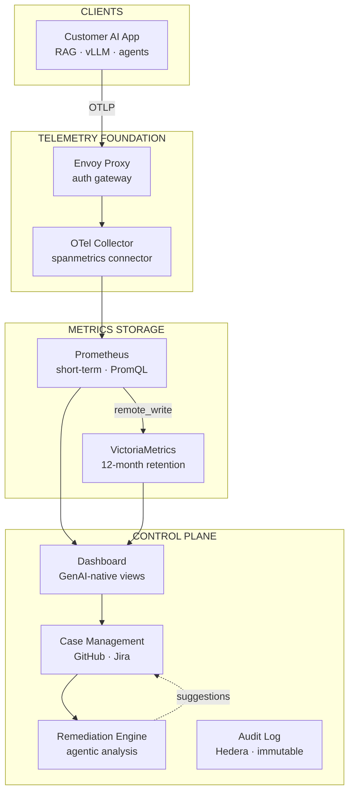
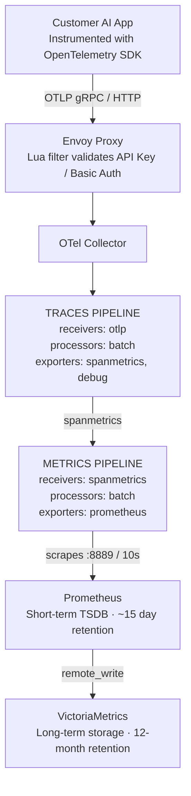
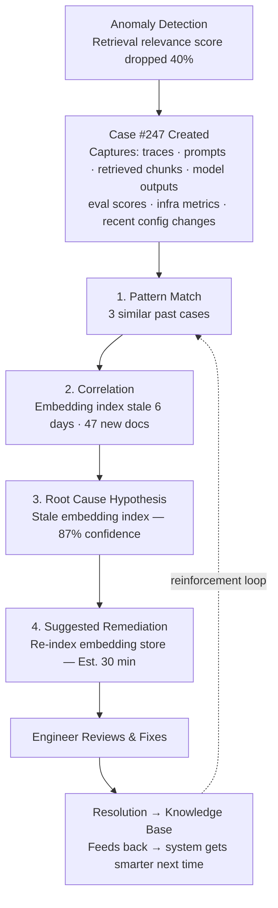
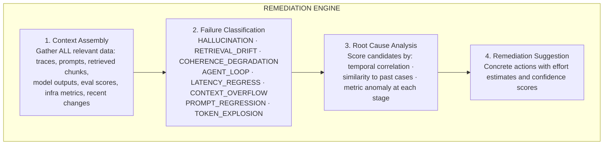

# Design: Prove AI

*GenAI Observability & Remediation · 75 min*

---

## Phase 1: Clarify the Problem & Scope *(5–7 min)*

> **Say:** "We're designing an observability and remediation platform purpose-built for generative AI systems. The fundamental insight: GenAI systems are NONDETERMINISTIC. The same input can produce different outputs. This breaks the testing and monitoring assumptions that every existing observability tool (Datadog, Splunk, Grafana) was built on. Those tools can tell you latency, throughput, and error rates — but they can't tell you WHY your RAG pipeline started returning irrelevant context, or WHAT changed when your model outputs became less coherent. Prove AI bridges this gap with a two-layer architecture: an open-source telemetry foundation (OTel Collector + Prometheus + VictoriaMetrics) that teams self-host on their own infrastructure, and a proprietary control plane that turns those traces into guided diagnosis and remediation. The open-source layer collects; the proprietary layer thinks."

### Questions I'd Ask

- **What outcome are we optimizing for?** — *Mean Time to Remediate (MTTR) for GenAI-specific failures: hallucinations, retrieval drift, coherence degradation, agent loops. Current state: teams spend dozens of engineer-hours per incident manually correlating traces across 3-5 dashboards. Target state: guided diagnosis in minutes, not days. Secondary: time-to-first-metric (how fast can a team go from "no observability" to "seeing useful data"). This shapes the two-phase product: v0.1 solves time-to-first-metric, v1.0 solves MTTR.*
- **Why can't Datadog/Splunk solve this?** — *Three reasons: (1) They track infrastructure metrics (latency, throughput) but not AI-specific quality signals (hallucination rate, retrieval relevance, coherence). (2) GenAI telemetry contains prompts and model outputs — sensitive data that many enterprises CAN'T send to third-party SaaS without compliance violations. (3) GenAI failures are nondeterministic — the same trace pattern can have different root causes, and the same root cause can produce different trace patterns. Traditional alerting rules don't work.*
- **What AI workloads does this cover?** — *LLM inference (vLLM, Ollama), RAG pipelines, agentic AI systems (multi-agent orchestration), fine-tuned models, embedding services. Any system that produces OTLP-compatible traces. Not limited to one framework — it's protocol-level (OpenTelemetry), not SDK-level.*
- **Deployment model?** — *SELF-HOSTED FIRST. The telemetry pipeline runs entirely in the customer's VPC/infrastructure. Data never leaves. This is a hard requirement for enterprises dealing with regulated AI workloads. The Prove AI control plane (dashboard, case management, remediation) can be SaaS or self-hosted depending on customer tier.*
- **What's the open-source vs. proprietary split?** — *Open source: OTel Collector + Prometheus + VictoriaMetrics + Envoy auth proxy = telemetry collection and storage. Proprietary: control plane dashboard, case management, guided troubleshooting, agentic remediation engine, GitHub/Jira integration, audit logging. The open-source layer is the "on-ramp" — it earns trust and adoption. The proprietary layer is the revenue engine.*

### Agreed Scope

| In Scope | Out of Scope |
|---|---|
| Telemetry ingestion (OTLP traces + metrics) | Model training / fine-tuning infrastructure |
| Trace-to-metric conversion (spanmetrics) | LLM hosting (vLLM/Ollama are external) |
| Self-hosted storage (Prometheus + VictoriaMetrics) | Prompt engineering / prompt management |
| Auth gateway (Envoy proxy) | Model evaluation benchmarks (e.g., MMLU) |
| Control plane: dashboard, case management | Data labeling / annotation tooling |
| Agentic remediation engine (v1.0) | Cost optimization for LLM API spend |
| Data sovereignty architecture | Multi-cloud orchestration of models |

### Core Use Cases

- **UC1 (Instrument Once, Observe Twice):** Team instruments their RAG pipeline with standard OpenTelemetry SDK → sends traces to Prove AI's OTel Collector → spanmetrics connector automatically derives Prometheus metrics (calls_total, latency histograms) → team sees request rate, error rate, and latency in Prometheus within 10 seconds — WITHOUT writing any metrics instrumentation. Traces and metrics from a single instrumentation path.
- **UC2 (Hallucination Detection):** RAG pipeline starts returning irrelevant context. Traditional monitoring shows: latency normal, error rate zero, throughput normal — everything looks "green." But output quality has degraded. Prove AI's control plane captures the full execution chain: prompt → retrieved chunks → model output → evaluation score. The remediation engine traces the failure back to a stale embedding index that wasn't refreshed after a document update.
- **UC3 (Agentic Workflow Debugging):** Multi-agent system: Planning Agent delegates to Research Agent and Synthesis Agent. Research Agent enters a loop (calls the same API 50 times). Traditional tracing shows a long trace with repeated spans — but doesn't tell you WHETHER this is a problem or HOW to fix it. Prove AI's case management creates a case, the remediation engine identifies the loop pattern, correlates it with a recent prompt template change, and suggests reverting the template.
- **UC4 (Compliance Audit):** Enterprise needs to prove to auditors that their AI system's outputs meet quality thresholds, that failures are detected and remediated within SLA, and that all telemetry is stored in their infrastructure. Prove AI's audit log provides an immutable trail: what happened, when, what was the quality score, who investigated, what was the fix, and when was it verified.
- **UC5 (Zero-to-Dashboard):** New team, no existing observability. They run `docker compose --profile full up -d` → send a test trace with `otel-cli` → see their first metric in Prometheus within 15 seconds. Total setup time: under 5 minutes. This is the "time-to-first-metric" experience that the v0.1 open-source stack is built for.

### Non-Functional Requirements

- **Data sovereignty:** ALL telemetry data stays in the customer's infrastructure. No phone-home, no cloud dependencies at runtime. Container images pulled at build time; after that, the stack runs air-gapped. GenAI telemetry can contain prompts and model outputs — this is PII-adjacent data that cannot leave the customer's environment.
- **Time-to-first-metric: <5 minutes:** From `git clone` to seeing live metrics. This is the open-source on-ramp that drives adoption. If setup takes days, teams will defer observability (which is exactly the problem Prove AI exists to solve).
- **Ingestion latency: <30 seconds:** From trace emission to queryable metric. Prometheus scrapes every 10 seconds. Total pipeline latency: trace → OTel Collector → spanmetrics → Prometheus scrape → queryable. Must be fast enough for near-real-time dashboards.
- **12-month retention:** VictoriaMetrics stores metrics for 12 months. Essential for trend analysis, seasonal pattern detection, and compliance audits. Prometheus handles short-term (~15 days) for real-time queries.
- **Zero lock-in:** OTLP protocol, Prometheus exposition format, standard TSDB storage. If a customer leaves, their instrumentation code and historical data are fully portable. No proprietary data formats anywhere in the telemetry path.

> **Tip:** The defining tension: OBSERVING nondeterminism vs. REMEDIATING it. Traditional observability tells you WHAT happened and WHEN. For deterministic software, that's often enough — the same error pattern has the same root cause. For GenAI, the same symptom (hallucinated output) can have completely different root causes (stale embeddings, prompt drift, model degradation, retrieval failure, context window overflow). And the same root cause can produce different symptoms. Observation alone is insufficient — the system must actively REASON about failure patterns, correlate across the full execution chain, and guide the engineer to the specific point where the pipeline broke. This is why the product is two-phase: v0.1 solves observation (the prerequisite), v1.0 solves remediation (the actual value).

---

## Phase 2: Back-of-the-Envelope Estimation *(3–5 min)*

| Metric | Value | Detail |
|---|---|---|
| **Traces per Customer per Day** | **~1M–100M** | Highly variable. A single vLLM instance handles ~1K req/sec = ~86M spans/day. A small RAG pipeline: ~100K spans/day. |
| **Span Size (avg)** | **~1-5 KB** | Standard span: ~500B. GenAI span with prompt/output capture: 2-5KB+ (prompts can be large). This is why self-hosting matters — telemetry volume is MUCH higher than traditional apps. |
| **Derived Metrics / Span** | **2** | Spanmetrics generates: 1 counter (calls_total) + 1 histogram (latency_bucket with 9 buckets). Per unique label combination. |
| **Prometheus Scrape Interval** | **10 sec** | Collector exposes metrics on :8889. Prometheus scrapes every 10 seconds. This determines the minimum granularity of time-series data. |
| **Storage (1 year, 1 customer)** | **~50-500 GB** | VictoriaMetrics with 12-month retention. Highly compressed time-series. A busy customer: ~500GB. Small deployment: ~50GB. |
| **Remediation Cases / Week** | **~5-50** | v1.0 metric. Per customer: ~5-50 GenAI-specific incidents per week requiring investigation. Each case: dozens of engineer-hours without tooling, minutes with guided remediation. |
| **Setup Time Target** | **<5 min** | docker compose --profile full up -d --build. 4 containers: Envoy, OTel Collector, Prometheus, VictoriaMetrics. All preconfigured. |
| **GenAI Pilot-to-Production Rate** | **<5%** | Industry-wide. The market pain. >95% of GenAI pilots never reach production — most fail due to the "hard 20%": observability, governance, debugging. |

> **Decision:** **Key insight #1 — GenAI telemetry is MUCH larger than traditional app telemetry.** A standard web request span: ~500 bytes. A GenAI span with captured prompt + retrieved context + model output: 5-50 KB. At scale, this means 10-100x more data volume than equivalent traditional workloads. This is why sending GenAI telemetry to Datadog/Splunk is prohibitively expensive (they charge per GB ingested), and why self-hosting is a requirement, not a preference. The architecture must handle high-volume ingestion while keeping storage costs manageable (hence VictoriaMetrics's aggressive compression).

> **Decision:** **Key insight #2 — The observation:remediation ratio is inverted from traditional ops.** In traditional ops, 80% of the effort is observation (building dashboards, configuring alerts) and 20% is remediation (the fix is usually obvious once you see the data). In GenAI ops, it's the opposite: teams can observe the failure quickly (the output is obviously wrong) but spend 80% of their time figuring out WHY and HOW TO FIX IT. Mile-long traces show what happened without telling you whether it matters, whether it'll repeat, or whether the fix is a 30-minute tweak or a two-week investigation. This inverted ratio is why the remediation engine (v1.0) is the real product — the telemetry stack (v0.1) is the prerequisite.

> **Decision:** **Key insight #3 — "Instrument once, observe twice" is the wedge.** The trace-to-metric conversion via the spanmetrics connector is the architectural insight that reduces adoption friction to near-zero. Teams instrument with the OTel SDK (one SDK, one config) and get both traces AND derived metrics. No dual instrumentation. This is especially powerful for GenAI workloads where teams are already overwhelmed — asking them to instrument twice (tracing SDK + metrics SDK) is a non-starter.

---

## Phase 3: High-Level Design *(8–12 min)*

> **Say:** "I'll organize this around the two-layer architecture: the TELEMETRY FOUNDATION (open source, self-hosted, customer VPC) and the CONTROL PLANE (proprietary, the intelligence layer). The telemetry foundation collects and stores data. The control plane turns that data into understanding and action. Between them is the key interface: the control plane READS from the telemetry foundation but the telemetry foundation has ZERO dependency on the control plane. This is what makes the open-source layer standalone and the proprietary layer additive."

### Key Architecture Decisions

> **Say:** "Here's WHY I chose each technology — mapping requirements to tradeoffs. Every choice has a rejected alternative and a consequence."

| Requirement | Decision | Why (and what was rejected) | Consistency |
|---|---|---|---|
| All telemetry stays in customer infrastructure | Self-hosted Docker Compose (not SaaS) | GenAI traces contain prompts, model outputs — potentially proprietary IP. Zero data egress by design. Control plane reads metrics only (aggregated, not raw). | — |
| Instrument once, observe twice | OTel spanmetrics connector (not dual instrumentation) | Single OTLP trace SDK produces both traces AND derived Prometheus metrics automatically. Dual instrumentation doubles maintenance burden and adoption friction. | — |
| Remediation needs structured reasoning, not just alerts | Agentic LLM analysis (not rule-based) | 8 GenAI failure types require contextual reasoning (prompt regression vs context overflow). Rules can detect anomalies but can't diagnose root cause across failure types. | — |
| Audit trail must be tamper-evident | Append-only log anchored to Hedera (distributed ledger) | SOC 2 / HIPAA require immutable audit trail. Hedera provides cryptographic proof that records haven't been modified. | CP |
| Customers may already have Prometheus/Grafana | Modular deployment profiles (BYO components) | Deployment profiles allow excluding components. "BYO Prometheus" profile skips bundled Prometheus. Reduces footprint and avoids conflicts. | — |

### Architecture Overview

```mermaid
graph TD
    subgraph YOUR AI APPLICATIONS
        A1[LLM Runners]
        A2[RAG Pipelines]
        A3[Agentic Systems]
        A4[Fine-tuned Models]
    end

    subgraph TELEMETRY FOUNDATION — OPEN SOURCE
        B1[Envoy<br/>Auth Gateway]
        B2[OTel Collector<br/>spanmetrics connector]
        B3[Prometheus<br/>Query engine]
        B4[VictoriaMetrics<br/>Long-term storage]
    end

    subgraph CONTROL PLANE — PROPRIETARY
        C1[Dashboard<br/>GenAI-native views]
        C2[Case Management<br/>GitHub / Jira integration]
        C3[Remediation Engine<br/>Agentic root-cause analysis]
        C4[Audit Logging<br/>Immutable trail - SQL+Hedera]
    end

    A1 & A2 & A3 & A4 -->|OTLP traces & metrics| B1
    B1 --> B2
    B2 --> B3
    B3 --> B4
    B3 --> C1
    B4 --> C1
    C1 --> C2
    C2 --> C3
    C3 -.->|suggestions| C2
```

### Major Components



#### Envoy Auth Proxy [GATEWAY]
- All external traffic enters here
- API Key or Basic Auth (Lua filter)
- 4 listeners: gRPC :4317, HTTP :4318, Prometheus :9090, VM :8428
- Internal traffic unauthenticated (Docker network)

#### OTel Collector [INGEST]
- Receives OTLP traces (gRPC + HTTP)
- Batch processor for efficiency
- spanmetrics connector (traces → metrics)
- Prometheus exporter on :8889

#### Prometheus [SHORT-TERM]
- Scrapes Collector :8889 every 10 sec
- PromQL query engine for dashboards
- Remote-writes to VictoriaMetrics
- ~15 day TSDB retention

#### VictoriaMetrics [LONG-TERM]
- 12-month metric retention
- Prometheus-compatible API on :8428
- Aggressive compression (10-20x vs. raw)
- Receives via Prometheus remote_write

#### Remediation Engine [v1.0 CORE]
- Agentic root-cause analysis
- Pattern matching across historical failures
- Full execution chain reconstruction
- Suggested fix paths + confidence scores

#### Case Management [WORKFLOW]
- Automatic case creation on anomaly detection
- Full context: prompts, embeddings, outputs, scores
- GitHub/Jira integration for ticket creation
- Resolution tracking → knowledge base feedback

#### Dashboard & UI [CONTROL PLANE]
- Pre-built GenAI dashboards (token throughput, TTFT, latency)
- Unified view: infra metrics + AI quality signals
- Custom metric definition per customer
- Reads from Prometheus/VM via PromQL

#### Audit Logging [COMPLIANCE]
- Immutable event log (SQL + optional Hedera)
- Every detection, investigation, remediation
- SOC 2, HIPAA-compatible audit trail
- Proves AI governance to auditors

### Flow 1: Telemetry Ingestion (Trace → Metric)



### Flow 2: Remediation Workflow (v1.0)



> **Say:** "Deep dives: (1) Trace-to-metric conversion — how the spanmetrics connector works and why it's the architectural wedge for GenAI observability. (2) The agentic remediation engine — how to reason about nondeterministic failures. (3) Data sovereignty architecture — why self-hosting is a requirement, not a feature, and how the deployment profiles work. (4) Case management and the knowledge base — how resolved cases create a reinforcement loop that makes the system smarter over time."

---

## Phase 4: Deep Dives *(25–30 min)*

### Deep Dive 1: Trace-to-Metric Conversion (~8 min)

> **Goal:** **The core challenge:** GenAI teams are already overwhelmed. Asking them to instrument twice (tracing SDK for traces, metrics SDK for metrics) is a non-starter. The spanmetrics connector solves this: a single OTLP trace instrumentation path that AUTOMATICALLY derives Prometheus-format metrics. This is the "instrument once, observe twice" principle. Understanding how this connector works — and its limitations — is essential to understanding the entire platform's value proposition.

```sql
── The spanmetrics Connector: How It Works ──

Architecture position:
  The spanmetrics connector is unique in the OTel Collector:
  It acts as BOTH an exporter (in the traces pipeline)
  AND a receiver (in the metrics pipeline).
  Traces flow in one side. Metrics come out the other.

  traces pipeline:
    receivers: [otlp]
    processors: [batch]
    exporters: [spanmetrics, debug]    ← trace data flows INTO spanmetrics

  metrics pipeline:
    receivers: [otlp, spanmetrics]     ← metric data flows OUT of spanmetrics
    processors: [batch]
    exporters: [prometheus, debug]

Per-span processing:

  INPUT: a single OTLP span
    {
      service_name: "rag-pipeline",
      span_name: "retrieve_context",
      span_kind: SPAN_KIND_CLIENT,
      duration: 145ms,
      status_code: STATUS_CODE_OK,
      attributes: {
        env: "prod",
        component: "vector_db",
        model: "text-embedding-3-large"
      }
    }

  EXTRACT automatically:
    • service_name  (from resource)
    • span_name     (from span)
    • span_kind     (from span)
    • status_code   (from span)

  EXTRACT from configured dimensions:
    • env           (from span attributes)
    • component     (from span attributes)
    • model         (from span attributes)

  GENERATE two metrics:

    llm_traces_span_metrics_calls_total{
      service_name="rag-pipeline",
      span_name="retrieve_context",
      span_kind="SPAN_KIND_CLIENT",
      status_code="STATUS_CODE_OK",
      env="prod",
      component="vector_db",
      model="text-embedding-3-large"
    } += 1

    llm_traces_span_metrics_latency_bucket{
      le="0.05",  ...labels...
    } += 0    // 145ms > 50ms, doesn't fit in this bucket

    llm_traces_span_metrics_latency_bucket{
      le="0.5",   ...labels...
    } += 1    // 145ms < 500ms, fits in this bucket

    ... (across all configured buckets)

Histogram buckets (configurable):
  Default: [0.001, 0.005, 0.01, 0.05, 0.1, 0.5, 1, 5, 10]
           1ms    5ms    10ms   50ms   100ms 500ms 1s  5s  10s

  For GenAI workloads (LLM inference can take seconds to minutes):
  Recommended: [0.1, 0.5, 1, 5, 10, 30, 60, 120, 300]
               100ms 500ms 1s  5s  10s  30s  1m   2m   5m

The "llm" namespace prefix:
  Comes from the Prometheus exporter config:
    exporters:
      prometheus:
        endpoint: "0.0.0.0:8889"
        namespace: "llm"     ← this prefix

  All derived metrics get this namespace:
    llm_traces_span_metrics_calls_total
    llm_traces_span_metrics_latency_bucket
```

**What You Can Derive Without Custom Instrumentation**

| Metric | PromQL Query | What It Tells You |
|---|---|---|
| Request rate | rate(llm_traces_span_metrics_calls_total[5m]) | Requests per second by service/operation |
| Error rate | rate(...{status_code="ERROR"}[5m]) / rate(...[5m]) | % of requests failing, broken down by service/operation |
| p50/p95/p99 latency | histogram_quantile(0.95, rate(llm_..._latency_bucket[5m])) | Latency distribution — critical for LLM TTFT monitoring |
| Per-model throughput | rate(...{model="gpt-4"}[5m]) | If model is a span attribute, derived automatically |
| Per-agent calls | rate(...{service_name="research-agent"}[5m]) | In agentic systems: call rate per agent |

> **Decision:** **Why not skip traces entirely and just do metrics?** Because traces provide the EXECUTION CHAIN that metrics cannot. A metric tells you "p95 latency spiked to 5 seconds." A trace tells you "the latency spike was in the embedding retrieval step, specifically the call to Pinecone, which timed out because of a batch-too-large request." The spanmetrics connector gives you BOTH from a single instrumentation: metrics for dashboards and alerting (what happened, when), traces for diagnosis (why, and where in the chain). This duality is what makes the remediation engine possible — it needs traces for root-cause analysis but metrics for anomaly detection.

### Deep Dive 2: Agentic Remediation Engine (v1.0) (~8 min)

> **Goal:** **The core challenge:** Traditional alerting rule: "IF error_rate > 5% THEN page engineer." This works for deterministic systems where the same error pattern has the same root cause. GenAI breaks this: a hallucinated output might be caused by stale embeddings, a prompt template regression, a model version change, context window overflow, or a retrieval relevance drop — and the trace pattern can look DIFFERENT each time for the SAME root cause. The remediation engine must REASON about failures, not just pattern-match.



> **Decision:** **Why agentic reasoning, not rule-based alerts?** Rule-based systems work when failure modes are enumerable and stable. GenAI failures are COMBINATORIAL — the interaction between prompt, retrieval, model, and context creates a failure space too large for hand-written rules. The remediation engine uses an LLM-based reasoning loop (itself a GenAI system!) that can: (1) read and understand trace data in natural language, (2) correlate across multiple data sources (metrics + traces + config changes), (3) leverage the knowledge base of past resolutions, and (4) generate human-readable hypotheses and suggestions. The irony: using GenAI to debug GenAI. But the remediation engine operates on STRUCTURED telemetry (not open-ended generation), which constrains nondeterminism. And it suggests — it doesn't autonomously fix.

### Deep Dive 3: Data Sovereignty Architecture (~5 min)

> **Goal:** **The core challenge:** GenAI telemetry is fundamentally different from traditional application logs. A trace from a customer support chatbot contains: the customer's question (PII), the retrieved knowledge base chunks (proprietary), the model's response (potentially containing customer data), and evaluation scores. Sending this to a third-party SaaS observability platform violates most enterprise security policies. The entire telemetry foundation MUST run in the customer's infrastructure with zero data egress.

```mermaid
graph TD
    subgraph CUSTOMER VPC / ON-PREM INFRASTRUCTURE
        subgraph DOCKER COMPOSE · observability network
            A[Envoy<br/>Auth Gateway<br/>:4317 :4318 :9090 :8428]
            B[OTel Collector<br/>spanmetrics<br/>traces → metrics]
            C[Prometheus<br/>Short-term query engine<br/>~15 day retention]
            D[VictoriaMetrics<br/>Long-term storage<br/>12-month retention]
        end
        E[NO DATA EGRESS<br/>No phone-home · No cloud dependencies<br/>Images pulled at build · Runs air-gapped]
    end

    A --> B
    B --> C
    C -->|remote_write| D
```

**Deployment Profiles (mutually exclusive):**
- **full** — All 4 containers
- **no-prometheus** — BYO Prometheus
- **no-vm** — BYO VictoriaMetrics
- **no-collector** — BYO Collector
- **vm-only** — Storage only
- **prom-only** — Prom only

> **Decision:** **Why self-hosted instead of SaaS?** Three reasons, each sufficient alone: (1) DATA SENSITIVITY: GenAI traces contain prompts and outputs. A customer support chatbot's traces contain customer PII. A legal AI's traces contain privileged documents. Sending this to ANY third party — even encrypted — is a non-starter for most enterprises. (2) COST: GenAI spans are 10-100x larger than traditional spans (prompt + context + output). At Datadog's per-GB pricing, a busy vLLM instance would cost $50K+/year just for trace ingestion. Self-hosted cost: a single EC2 instance. (3) COMPLIANCE: SOC 2, HIPAA, FedRAMP all have data residency requirements. Self-hosted satisfies them automatically. The deployment profiles (no-prometheus, vm-only, etc.) exist because many enterprises ALREADY have parts of the observability stack — forcing them to replace working infrastructure would increase friction, which is the opposite of the product's purpose.

### Deep Dive 4: Case Management & Knowledge Base (~6 min)

> **Goal:** **The core challenge:** Observation without action is just expensive logging. The case management system is the bridge between "we see a problem" and "we fixed the problem." More importantly, each RESOLVED case feeds back into the knowledge base, making the remediation engine smarter over time. This is the reinforcement loop that creates compounding value — the system improves with every incident it helps resolve.

```sql
── Case Lifecycle ──

Case creation triggers:
  1. Automatic: anomaly detection fires on metric threshold breach
  2. Automatic: quality evaluation score drops below baseline
  3. Manual: engineer creates case from suspicious trace
  4. Proactive: drift detection identifies slow degradation trend

Case states:
  DETECTED → TRIAGED → INVESTIGATING → REMEDIATION_SUGGESTED →
  FIX_APPLIED → VERIFYING → RESOLVED

Case payload (what gets captured):
  {
    case_id: "CASE-247",
    created_at: "2026-02-14T10:30:00Z",
    trigger: "anomaly_detection",
    failure_class: "RETRIEVAL_DRIFT",

    context_snapshot: {
      traces: [...],           // full spans from failure window
      prompts: [...],          // actual prompts sent to model
      retrieved_chunks: [...], // what the retriever returned
      model_outputs: [...],    // what the model generated
      eval_scores: {           // quality metrics at time of failure
        relevance: 0.42,       // normally 0.85+
        coherence: 0.78,
        groundedness: 0.51
      },
      infra_metrics: {
        latency_p95: "2.3s",
        gpu_utilization: "73%",
        cache_hit_rate: "0.61"
      }
    },

    recent_changes: [
      {type: "config", detail: "embedding_index last refreshed 6 days ago"},
      {type: "deploy", detail: "prompt template v3.4 deployed 2 days ago"},
      {type: "data",   detail: "47 new documents added to knowledge base"}
    ],

    remediation_suggestions: [
      {hypothesis: "Stale embedding index", confidence: 0.87,
       action: "Re-index with new documents", effort: "30 min",
       similar_case: "CASE-198"},
      {hypothesis: "Prompt template regression", confidence: 0.34,
       action: "Revert to template v3.3", effort: "5 min",
       similar_case: null}
    ],

    resolution: {  // filled by engineer after fix
      root_cause: "Stale embedding index",
      fix_applied: "Re-indexed with 47 new documents",
      verified_at: "2026-02-14T11:15:00Z",
      verification_query: "avg(retrieval_relevance_score) > 0.80",
      time_to_remediate: "45 minutes"
    }
  }

Knowledge base feedback loop:

  Resolved case → extract:
    (failure_signature, root_cause, successful_remediation)

  Store as embedding in knowledge base.

  Next time a similar failure signature appears:
    → Remediation engine retrieves this past case
    → Suggests the same fix with higher confidence
    → Links to past case for engineer reference

  Over time: the knowledge base becomes a bespoke, customer-specific
  "playbook" of GenAI failure modes and proven fixes.
  This is the compounding value — the system gets smarter with each incident.
```

> **Decision:** **Why capture the full execution state, not just metrics?** Metrics tell you WHAT happened (relevance score dropped). Traces tell you WHERE in the chain it happened (the retrieval step). But to know WHY, you need the actual DATA: what prompt was sent, what chunks were retrieved, what the model output. For traditional software, you rarely need the actual request/response payload to debug — the error code and stack trace are sufficient. For GenAI, the payload IS the bug. A hallucination isn't a stack trace error — it's a semantically wrong output that looks correct to the computer. You can only diagnose it by reading the actual prompt, context, and output. This is why the case captures the full state — and it's why data sovereignty is non-negotiable (this captured state is extraordinarily sensitive).

---

## Phase 5: Cross-Cutting Concerns *(10–12 min)*

### Storage Architecture Summary

> **Goal:** **What goes where and why.** Each data store is chosen for its access pattern — not by default. The question isn't "which database?" but "what are the read/write patterns, consistency requirements, and scale characteristics?"

| Data | Store | Why This Store |
|---|---|---|
| Raw traces (spans) | OTel Collector → export | OTLP traces stored via configured exporter. 1-5KB per span (10-100x traditional due to prompts/outputs). Retained per policy. |
| Derived metrics | Prometheus → VictoriaMetrics | Auto-generated by spanmetrics connector. calls_total counter + latency histogram. Prometheus 15-day hot, VM 12-month cold. |
| Case data | PostgreSQL (control plane) | Full case lifecycle: context snapshots, remediation suggestions, resolution details. Linked to trace IDs. |
| Knowledge base | Vector DB (control plane) | Resolved case embeddings. (failure_signature, root_cause, fix) tuples. Searched by cosine similarity for new incidents. |
| Audit trail | Append-only store + Hedera | Every case action, every remediation suggestion, every fix applied. Immutable. Anchored to Hedera for tamper evidence. |
| Configuration | Docker Compose .env | API keys, endpoints, profile selection. Template-generated at startup. Lives in customer infrastructure. |

### Failure Scenarios

| Scenario | Mitigation |
|---|---|
| OTel Collector crashes mid-ingestion | The Collector does NOT persist data. Traces being processed at the time of crash are LOST. This is documented and accepted — the Collector is stateless by design. Mitigation: (1) After restart, new traces flow normally within seconds. (2) Prometheus has its own TSDB — metrics already scraped are safe. (3) VictoriaMetrics has remote-written data safe. (4) For high-reliability needs: run multiple Collector instances behind a load balancer. The gap in metrics will appear as a brief flat line in Prometheus graphs. |
| VictoriaMetrics disk fills (12 months of data) | VictoriaMetrics compresses aggressively (10-20x vs. raw), but at high cardinality (many unique label combinations), storage grows faster. Mitigation: (1) Monitor disk usage via Collector internal metrics. (2) Adjust -retentionPeriod flag (reduce from 12 to 6 months). (3) Use recording rules in Prometheus to pre-aggregate high-cardinality metrics before remote-writing. (4) Reduce custom dimensions on the spanmetrics connector (fewer labels = lower cardinality). |
| Cardinality explosion in spanmetrics | If a span attribute used as a dimension has unbounded values (e.g., user_id with millions of unique values), the number of unique time series explodes → Prometheus OOM. This is the most common operational issue. Mitigation: (1) Only configure LOW-CARDINALITY dimensions (env, component, model — not user_id, request_id). (2) Monitor otelcol_exporter_sent_metric_points for abnormal growth. (3) Document cardinality guidance prominently. |
| Remediation engine suggests wrong fix | The engine SUGGESTS — it does not auto-apply. The engineer reviews and decides. If a suggestion is wrong: (1) engineer marks it as "not helpful" in the case, (2) this negative signal feeds back into the knowledge base (reduces confidence for this pattern), (3) the engineer's actual resolution becomes the new ground truth. The system learns from both correct AND incorrect suggestions. |
| Customer's existing Prometheus conflicts with Prove AI's | This is exactly why deployment profiles exist. If the customer already runs Prometheus: use no-prometheus profile (deploy only Envoy + Collector + VictoriaMetrics). Point customer's existing Prometheus at Collector's :8889 endpoint. No conflict — Prove AI adapts to existing infrastructure rather than replacing it. |
| Auth credentials leaked (API key exposed) | Envoy supports multiple comma-separated API keys. Rotate: (1) add a new key to ENVOY_API_KEYS, (2) update all clients to use the new key, (3) remove the old key, (4) restart Envoy. The old key immediately stops working. Because auth is centralized at the Envoy layer (not per-service), rotation is a single config change. |

### Scalability

> **Tip:** **Scalability.** The telemetry foundation scales with standard observability patterns: OTel Collector handles batching and sampling, Prometheus handles short-term queries, VictoriaMetrics handles long-term storage. The GenAI-specific challenge is span SIZE: traditional spans are ~500 bytes, GenAI spans are 1-5KB (containing prompts and outputs) — this is 10-100x more data volume. At 1M traces/day per customer, that's 1-5GB/day of trace data, which is manageable on a single VM. At 100M traces/day (enterprise scale), the OTel Collector needs horizontal scaling via a load balancer distributing across multiple collector instances, and VictoriaMetrics needs clustered mode with separate storage and query nodes. The control plane (proprietary) scales independently: the remediation engine's agentic reasoning is the most expensive operation but runs asynchronously per-case, not per-trace. A busy customer might generate 10-50 cases/day, each taking 30-60 seconds of LLM reasoning — well within a single service instance.

### Why GenAI Observability ≠ Traditional Observability

| Dimension | Traditional (Datadog/Splunk) | GenAI (Prove AI) |
|---|---|---|
| Failure mode | Deterministic: same input → same error | Nondeterministic: same input → different outputs, some correct, some not |
| Detection signal | Error rate, latency, HTTP status codes | Output quality scores, relevance, coherence, groundedness — semantic metrics, not just infra metrics |
| Root cause | Usually singular: a bug, a config error, a resource limit | Often emergent: interaction between prompt + context + model + retrieval. Multiple plausible causes. |
| Trace content | HTTP headers, status codes, stack traces (~500B) | Prompts, retrieved documents, model outputs, eval scores (~5-50KB per span). Sensitive data. |
| Fix verification | "Error rate returned to zero" — binary | "Output quality returned to baseline" — continuous, probabilistic |
| Debugging effort | 80% observation, 20% remediation | 20% observation, 80% remediation. The failure is obvious — the fix is not. |
| Hosting model | SaaS-first (send data to vendor) | Self-hosted-first (data cannot leave customer infra) |

### Open Source as Go-to-Market

- **The wedge:** The open-source telemetry stack (v0.1) is not the product — it's the ON-RAMP. It solves time-to-first-metric (the "easy problem" that teams defer). Once teams have telemetry flowing, they discover the "hard problem" (remediation) — which is where the proprietary platform (v1.0) delivers value.
- **Trust before revenue:** Self-hosted, open-source, zero-lock-in builds trust with security-conscious enterprises. They can inspect every line of code. This trust converts to paid adoption when the remediation engine (proprietary) proves its MTTR reduction.
- **Community feedback loop:** Open-source users report issues, contribute configurations for different AI frameworks, and surface GenAI-specific failure patterns. This community intelligence feeds the proprietary remediation engine's knowledge base.
- **Lock-in avoidance as positioning:** Whalen (CTO) explicitly warns against proprietary lock-in for GenAI telemetry. The market is early and evolving — getting locked into a vendor that charges per-GB when GenAI spans are 10-100x larger than traditional spans is an "expensive trap." Open standards (OTLP, PromQL) are the antidote.

### Security & Access Control

> **Decision:** **Security & Access Control.** Data sovereignty is the foundational security requirement. The entire telemetry stack runs in the customer's VPC with zero data egress — prompts and model outputs in traces are PII-adjacent and often contain customer data, privileged documents, or proprietary IP. The Envoy proxy handles authentication (API key or Basic Auth) at the ingestion boundary, preventing unauthorized telemetry submission. Within the customer's infrastructure: all data at rest is encrypted via volume-level encryption (EBS/disk encryption), data in transit uses TLS between all components. The control plane (Prove AI platform) accesses metrics via PromQL queries — it reads aggregated metrics, not raw traces. For audit compliance: every case action is logged to an immutable audit trail anchored to Hedera (distributed ledger), providing tamper-evidence for SOC 2 and HIPAA examinations. Deployment profiles allow customers to exclude components they already have (BYO Prometheus, BYO Collector), reducing attack surface.

---

## Phase 6: Wrap-Up & Evolution *(3–5 min)*

> **Say:** "To summarize: Prove AI addresses the 95% failure rate of GenAI pilots reaching production by tackling the 'hard 20%' — observability, governance, and debugging for nondeterministic systems. The architecture is two-layered: an OPEN-SOURCE TELEMETRY FOUNDATION (OTel Collector + Prometheus + VictoriaMetrics + Envoy) that self-hosts in the customer's infrastructure with zero data egress, and a PROPRIETARY CONTROL PLANE (dashboard, case management, agentic remediation) that turns telemetry into understanding and action. The key architectural innovation is the spanmetrics connector: 'instrument once, observe twice' — a single OTLP trace instrumentation path that automatically derives Prometheus metrics, eliminating the dual-SDK burden that makes teams defer observability. Data sovereignty is a REQUIREMENT, not a feature — GenAI traces contain prompts and outputs that are PII-adjacent and cannot leave the customer's environment. The remediation engine (v1.0) inverts the traditional observability paradigm: instead of telling engineers WHAT happened and leaving them to figure out WHY, it uses agentic reasoning over the full execution chain (prompts, retrieval, outputs, scores, config changes) to generate ranked root-cause hypotheses and concrete fix suggestions. Each resolved case feeds back into a customer-specific knowledge base, creating a reinforcement loop where the system gets smarter with every incident."

### What I'd Build Next

| Extension | Architecture Impact |
|---|---|
| Automated Evaluation Pipeline | Move beyond relying on customer-defined eval scores. Build a built-in evaluation layer: LLM-as-judge for relevance/coherence/groundedness, factual consistency checking against retrieved context, and semantic drift detection. Runs as an additional OTel Collector processor that enriches spans with eval scores before they reach spanmetrics. These scores become first-class metric labels, enabling evaluation-based alerting out of the box. |
| Prompt Regression Testing | When a prompt template changes, automatically run the new template against a cached set of recent inputs, compare outputs to the previous template's outputs, and flag regressions BEFORE deployment. This is the GenAI equivalent of unit testing — but for nondeterministic systems. Architecture: a "shadow mode" that runs both old and new templates in parallel and compares. |
| Multi-Cluster Federation | Large enterprises run GenAI across multiple clusters/regions. A federation layer that aggregates metrics and cases across clusters while keeping raw telemetry in each cluster (data sovereignty). The control plane provides a unified view. Architecture: each cluster runs its own telemetry stack; the control plane queries across clusters via PromQL federation. |
| Cost Attribution | Map every LLM API call to its cost (tokens x price per token) and attribute costs to teams, features, or customers. Requires: token counting in the OTel span attributes, price lookup table per model provider, and aggregation by arbitrary dimensions. Output: "The RAG pipeline for customer support cost $4,200 last month, up 30% due to increased context window usage." |
| Compliance Report Generator | Auto-generate audit-ready reports: "In Q4, the AI system processed 2.3M requests, maintained a 94% quality score, experienced 12 incidents (avg MTTR: 43 min), and all telemetry remained within customer infrastructure." Pulls from: case management (incidents), metrics (quality scores), audit log (compliance trail). Output: PDF report suitable for SOC 2 auditors or board presentation. |

> **Tip:** **Closing framing:** What makes Prove AI architecturally distinct is that it addresses the specific failure mode of GenAI adoption: not model incapability, but operational immaturity. The 95% of GenAI pilots that never reach production don't fail because the model is bad — they fail because teams skip the observability and governance work needed to make nondeterministic systems reliable in production. Prove AI makes that work EASIER rather than asking teams to do more. The open-source telemetry stack reduces time-to-first-metric from weeks to minutes. The remediation engine reduces time-to-root-cause from dozens of engineer-hours to minutes. And the self-hosted architecture eliminates the data sovereignty objection that blocks many enterprises from even starting. The product strategy mirrors the architecture: the open-source foundation earns trust and adoption (solve the easy problem first), and the proprietary remediation engine captures value (solve the hard problem that teams discover once they can see). As Whalen puts it: "The future belongs to organizations that stop pretending this is just software as usual, and start building the infrastructure that makes nondeterministic systems dependable." Prove AI is that infrastructure.

---

## Phase 7: Interview Q&A *(Practice)*

> **Say:** "Here are the hardest questions an interviewer would ask about this design, and how to answer them. Each answer demonstrates deep understanding of the tradeoffs, not just surface knowledge."

**Q:** Why the spanmetrics connector instead of dual instrumentation?

**A:** The spanmetrics connector is the architectural wedge that makes the entire system practical. Without it, customers would need to instrument their GenAI applications twice: once with OTel for traces and once with a Prometheus client for metrics. Dual instrumentation means double the maintenance burden, double the risk of configuration drift, and double the chance of one being forgotten. The spanmetrics connector eliminates this: you instrument once (OTLP traces), and the connector automatically derives Prometheus metrics (calls_total counter + latency histogram) for every span. The "instrument once, observe twice" pattern means the barrier to adoption is a single SDK integration. Once traces flow, metrics appear automatically — time-to-first-metric drops from days to minutes. The tradeoff: derived metrics have less flexibility than custom metrics (you can't create arbitrary counters), but for the observability use case, the auto-derived metrics (request rate, error rate, latency percentiles) cover 80%+ of what teams need.

**Q:** How does the remediation engine avoid hallucinating root causes?

**A:** The engine operates on STRUCTURED telemetry, not open-ended text — this significantly constrains the hallucination space. The analysis pipeline is: (1) Context Assembly gathers hard data: actual trace spans, metric values, config change timestamps — these are facts, not interpretations, (2) Failure Classification uses a fixed taxonomy of 8 GenAI failure types — the engine classifies into known categories, it doesn't invent new ones, (3) Root Cause Analysis scores candidates against factual evidence: temporal correlation (did a change precede the failure?), metric anomaly scores (is there a measurable degradation?), and similarity to resolved past cases. Each hypothesis has a confidence score — if the highest confidence is below 0.5, the engine says "unable to determine root cause" rather than guessing. (4) The knowledge base acts as grounding: suggestions are based on what actually worked for similar failures, not generated from scratch. The irony is using GenAI to debug GenAI — but the remediation engine's nondeterminism is constrained by the structured data it operates on.
