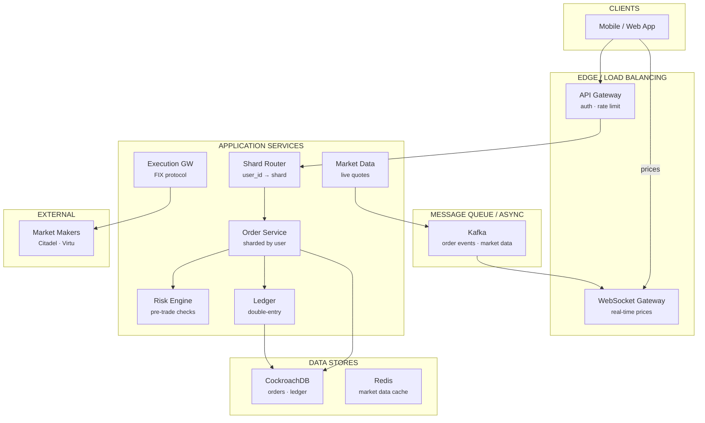
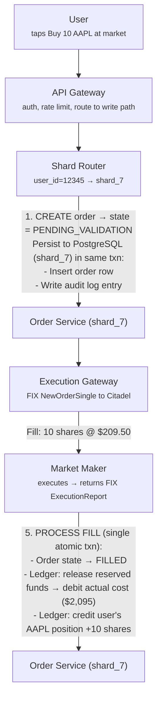
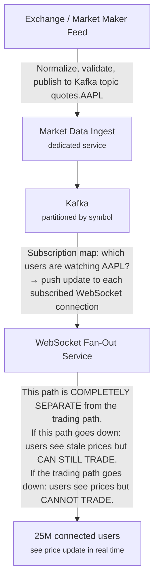

# Design Robinhood

Stock Trading Platform · 75 min

---

## Phase 1: Clarify the Problem & Scope *(5–7 min)*

> **Say:** "We're designing a retail stock brokerage platform like Robinhood. Critically, Robinhood is a BROKER, not an exchange — it doesn't match buyers and sellers. It accepts orders from users and ROUTES them to market makers (Citadel Securities, Virtu, etc.) for execution. Users see real-time market data, place orders, and track their portfolio. The system must handle real money with absolute correctness while serving consumer-scale traffic that spikes violently during market events."

### Questions I'd Ask

- **What outcome are we optimizing for?** — *Order execution quality: fill rate (% of orders that execute), price improvement (did the customer get a better price than the quoted spread?), and execution speed. Secondary: platform reliability during volatile markets (the system MUST NOT go down during a meme-stock spike — that's when customers need it most and when Robinhood has historically failed). This shapes priority ordering: CORRECTNESS > AVAILABILITY > SPEED.*
- **Core products?** — *Stocks, ETFs, options, and crypto trading. Commission-free. Revenue from payment for order flow (PFOF) and interest on uninvested cash.*
- **Order types?** — *Market orders (execute immediately at best price), limit orders (execute only at specified price or better), stop orders, stop-limit orders.*
- **Who executes trades?** — *NOT us. We route orders to external market makers via FIX protocol. They execute and report back fills.*
- **Settlement?** — *T+1 (trade date + 1 business day). Shares and cash settle through a clearinghouse. Robinhood self-clears via Robinhood Securities.*
- **Scale?** — *~25M funded accounts, ~750K requests/sec normal, ~5M req/sec during meme-stock events. ~5-10M orders/day.*
- **Regulatory?** — *SEC, FINRA regulated. Every order, fill, cancellation must be auditable. Pattern day trading rules, margin requirements, trading halts must be enforced.*

### Agreed Scope

| In Scope | Out of Scope |
|----------|-------------|
| Order placement & lifecycle (state machine) | Options pricing / Greeks computation |
| Order routing to market makers | Crypto wallet / blockchain internals |
| Real-time market data streaming | Tax lot optimization details |
| Portfolio & position tracking | Margin lending risk models |
| Double-entry ledger (cash & positions) | Customer support workflows |
| Risk checks (buying power, trading halts) | Regulatory reporting file formats |
| Sharding architecture for blast radius | Mobile app frontend |

### Core Use Cases

- **UC1 (View Market Data):** User opens app → sees real-time prices for watched stocks, updated every second via WebSocket. ~25M concurrent connections during market hours.
- **UC2 (Place Order):** User taps "Buy 10 shares of AAPL at market" → system validates buying power, reserves funds, routes to market maker, receives fill, updates positions. End-to-end: <500ms.
- **UC3 (Partial Fill):** Limit order for 1,000 shares → market maker fills 400, then 300, then 300 across 3 separate fill events. System must correctly update position after each partial fill.
- **UC4 (View Portfolio):** User sees: cash balance, buying power, total equity, positions with current market value, P&L per position, order history. Values must be EXACT — not eventually consistent.
- **UC5 (Meme Stock Spike):** GameStop event. Traffic jumps 7x in minutes. System must not drop orders, must enforce risk controls, may restrict trading if clearing deposit requirements spike.

### Non-Functional Requirements

- **Financial correctness above all:** Every cent must be accounted for. No phantom shares. No double-counted cash. The ledger is the source of truth, and it must balance at all times.
- **ACID for trades:** Order state transitions, balance updates, and position changes must be transactional. Partial updates are a regulatory violation.
- **Eventually consistent is OK for:** Market data quotes (advisory, not authoritative). Notifications. Leaderboards.
- **Availability during market hours:** 9:30 AM – 4:00 PM ET. Pre/after-hours: 7 AM – 8 PM ET. Downtime during market hours is catastrophic.
- **Auditability:** Every order, fill, cancellation, balance change is logged with timestamps. Regulators can request full reconstruction of any account's history.

> **Tip:** The defining tension: CONSUMER-SCALE TRAFFIC with INSTITUTIONAL-GRADE FINANCIAL CORRECTNESS. Prices can be fast and approximate (read path). Trades must be slow and exact (write path). Combining these two paths in the same system causes cascading failures during spikes. The architecture MUST separate them.

---

## Phase 2: Back-of-the-Envelope Estimation *(3–5 min)*

| Metric | Value | Detail |
|--------|-------|--------|
| Funded Accounts | ~25M | Each account: cash balance, positions, order history, tax lots. Strong consistency required. |
| Normal API Traffic | ~750K req/sec | ~80% reads (portfolio, quotes, watchlists). ~20% writes (orders, deposits). |
| Spike Traffic (Meme Events) | ~5M req/sec | 7x normal. Concentrated on a few tickers. Must survive without dropping orders. |
| Orders / Day | ~5-10M | Normal: ~5M. Meme-stock days: ~10M+. Each order: 3-5 state transitions. |
| Market Data Symbols | ~10K actively traded | Each symbol: price update every ~100ms. ~100K updates/sec total. Fanned out to millions of users. |
| WebSocket Connections | ~10-25M concurrent | Every user with the app open gets real-time prices. Massive fan-out problem. |
| Ledger Entries / Day | ~50-100M | Each order generates 2-6 ledger entries (reserve, fill, settle). Each deposit/withdrawal: 2 entries. |
| Assets Under Custody | ~$100B+ | Average account: ~$4K. Every cent tracked with double-entry accounting. |

> **Decision:** **Key insight #1:** The read:write asymmetry is extreme but the WRITE PATH is what matters most. A dropped read means a stale price quote (annoying). A dropped or duplicated write means a wrong trade (regulatory violation, financial loss). The entire architecture must prioritize write correctness even at the cost of read latency.

> **Decision:** **Key insight #2:** Traffic is NOT uniform. It's shaped by the market: 9:30 AM open → massive spike. Meme-stock events → 7x overnight. The system must handle 7x in minutes without pre-scaling. This argues for: pre-provisioned capacity for worst case, NOT auto-scaling (too slow for a 60-second spike).

> **Decision:** **Key insight #3:** 25M accounts x ACID requirements = sharding is inevitable. But unlike social media (shard by user, reads cross shards), financial sharding must ensure a user's ENTIRE financial state (cash + positions + orders) lives in ONE shard. Cross-shard transactions are not acceptable for financial correctness.

---

## Phase 3: High-Level Design *(8–12 min)*

> **Say:** "The cardinal rule: SEPARATE the read path (market data — fast, approximate, eventually consistent) from the write path (trading — slow, exact, ACID). These two systems must not share infrastructure, because a market data spike must never degrade order execution."

### Key Architecture Decisions

> **Say:** "Here's WHY I chose each technology — mapping requirements to tradeoffs. Every choice has a rejected alternative and a consequence."

| Requirement | Decision | Why (and what was rejected) | Consistency |
|------------|----------|----------------------------|-------------|
| Financial correctness: no phantom shares | CockroachDB with serializable isolation | Order state transitions + balance updates must be atomic. No eventual consistency for money. CockroachDB = distributed SQL with ACID. | CP |
| Need active-active for market hours DR | CockroachDB (not PostgreSQL) | Raft consensus across regions. If US-East fails during trading, US-West continues. PostgreSQL requires manual failover. | CP |
| Ledger must always balance | Double-entry bookkeeping in single transaction | Stored procedure inserts debit + credit atomically. CHECK constraint verifies sum = 0. Single-row updates could lose money. | CP |
| Live market data to 25M connected users | Kafka → WebSocket fan-out (not polling) | Price updates pushed instantly. Polling at 1s intervals = 25M requests/sec wasted. Fan-out by symbol allows independent scaling. | — |
| Blast radius isolation for incidents | Shard by user_id (not by symbol) | A bug affecting shard 7 impacts 1/N users, not all users trading AAPL. Symbol-based sharding would make hot stocks a single point of failure. | — |
| Regulatory: 7-year audit trail | Append-only Kafka log + immutable archive | Order events retained in Kafka (30 days) then archived to S3 (7 years). FINRA/SEC can examine any historical order. | — |

### Major Components



#### API Gateway [INGRESS]

- Auth (OAuth2 + MFA), rate limiting
- Routes: market data → read path, orders → write path
- WebSocket upgrade for real-time data

#### Market Data Service [READ PATH]

- Ingests real-time quotes from exchanges/market makers
- Publishes via Kafka → WebSocket fan-out
- Best-effort delivery. Stale quotes are OK.

#### Order Service [WRITE PATH]

- Accepts orders, validates, persists state machine
- Pre-trade risk checks (buying power, halts)
- Routes to market makers via FIX protocol

#### Shard Router [ROUTING]

- Maps user_id → shard_id
- Each shard: own app servers + own PostgreSQL
- Blast radius: shard failure affects only that shard's users

#### Ledger Service [FINANCE]

- Double-entry accounting for every money movement
- Source of truth for balances and positions
- Immutable append-only journal

#### Execution Gateway [EXTERNAL]

- FIX protocol connection to market makers
- Sends orders out, receives fill reports
- Handles partial fills, rejects, cancellations

#### Risk Engine [GUARD]

- Pre-trade: buying power, margin, pattern day trader
- Real-time: position limits, concentration risk
- Market-level: halt enforcement, circuit breakers

#### Settlement / Clearing [BACK OFFICE]

- T+1 settlement with DTCC / clearinghouse
- Reconciliation: match internal records with street-side
- Deposit/withdrawal (ACH transfers)

### Flow 1: Place a Market Order (Buy 10 AAPL)



### Flow 2: Real-Time Market Data (Read Path)



> **Say:** "The deep dives I want to cover: (1) The order state machine — the most critical piece of financial correctness. (2) Market data fan-out — the hardest scaling problem (25M WebSockets). (3) The double-entry ledger — how we guarantee every cent is accounted for. (4) Sharding architecture — how Robinhood scaled from a single DB to sharded PostgreSQL with blast radius isolation."

---

## Phase 4: Deep Dives *(25–30 min)*

### Deep Dive 1: Order Lifecycle & State Machine (~10 min)

> **Goal:** **The core challenge:** An order is NOT a single action. It's a multi-step process with possible failures at every step: validation might fail, funds might be insufficient, the market maker might reject, fills might be partial, the user might cancel mid-flight. Every state transition must be durable, auditable, and recoverable.

```sql
-- Order State Machine --

     ┌──────────────┐
     │   PENDING     │  ← User submitted order
     └──────┬───────┘
            │ validate
     ┌──────▼───────┐
     │  VALIDATED   │  ← Risk checks passed
     └──────┬───────┘
            │ reserve funds
     ┌──────▼───────┐
     │ FUNDS_HELD  │  ← Buying power locked in ledger
     └──────┬───────┘
            │ route to market maker
     ┌──────▼───────┐
     │   ROUTED     │  ← Sent via FIX, awaiting response
     └──────┬───────┘
            │ fill report(s)
     ┌──────▼───────┐     ┌──────────────┐
     │PARTIALLY_FILLED│────▶│   FILLED     │  ← All shares received
     └──────┬───────┘     └──────────────┘
            │
     (can receive more fills until fully filled)

  Exception paths (can occur from multiple states):
     ───▶ REJECTED     ← Market maker rejects (bad symbol, halted, etc.)
     ───▶ CANCELLED    ← User cancels (if not yet filled)
     ───▶ EXPIRED      ← Limit order expires at end of day
     ───▶ FAILED       ← System error (funds released, user notified)

  EVERY transition:
    1. Persisted atomically in PostgreSQL (same txn as ledger update)
    2. Audit log entry written (who, what, when, why)
    3. Event published to Kafka (for notifications, analytics)
```

> **Decision:** **Why model orders as an explicit state machine?** Financial systems fail in complex ways: the market maker might respond 30 seconds later, or not at all. Network partitions happen. Servers crash mid-transaction. A state machine with durable transitions means: on restart, the system can examine the order's current state and resume from EXACTLY where it left off. No guessing. No duplicates. A "stuck" order in ROUTED state triggers a timeout → cancel attempt → funds release. Without this explicitness, failure recovery becomes ad-hoc and error-prone.

**Idempotency**

- **Client-side:** Every order request includes a unique `idempotency_key` (UUID generated by the client). If the same key is sent twice (e.g., network retry), the server returns the same response without creating a duplicate order.
- **Market-maker side:** Each order sent to the market maker has a unique `clOrdID` (FIX protocol). Fill reports reference this ID. Duplicate fill reports (network retry from market maker) are deduplicated by checking if this fill was already processed.
- **Ledger side:** Every ledger entry has a unique `transaction_id` derived from the order event. Re-processing the same event produces the same transaction_id → no double-counting.

**Buying Power Calculation**

```sql
-- Buying Power (real-time, per user) --

buying_power = cash_balance
               + margin_available          // for margin accounts
               - pending_order_reserves    // funds locked for open orders
               - pending_withdrawals       // ACH withdrawals in flight

Computed from the ledger in real time.
MUST be checked atomically with fund reservation:
  BEGIN TRANSACTION
    SELECT buying_power FOR UPDATE  -- row-level lock
    IF buying_power >= estimated_cost THEN
      INSERT ledger_entry (debit cash, credit pending_orders)
      UPDATE order SET state = 'FUNDS_HELD'
    ELSE
      UPDATE order SET state = 'REJECTED', reason = 'insufficient_funds'
    END IF
  COMMIT

The SELECT FOR UPDATE prevents two concurrent orders from both
seeing the same buying power and both reserving (double-spending).
```

### Deep Dive 2: Market Data Pipeline (~6 min)

> **Goal:** **The core challenge:** Ingest ~100K price updates/sec from exchange feeds, and fan out to ~25M connected users via WebSocket. Each user watches a different set of symbols. This is a massive pub-sub fan-out problem — but correctness is relaxed (stale quotes are acceptable for a few seconds).

```sql
-- Market Data Architecture --

Tier 1: Ingest
  Exchange/market maker feeds → Market Data Ingest Service
  Normalize: different feeds use different formats
  Validate: reject obviously bad quotes (negative prices, stale timestamps)
  Publish to Kafka topic per symbol: quotes.AAPL, quotes.TSLA, ...
  Retention: very short (minutes). Only latest quote matters.

Tier 2: Aggregation
  Kafka consumers compute derived data:
  - OHLCV candles (1min, 5min, 1hr, 1day)
  - VWAP (volume-weighted average price)
  - Sparkline data for watchlists
  Published to Redis (latest quote per symbol) for REST API fallback.

Tier 3: Fan-Out (WebSocket)
  Fleet of WebSocket servers (~1,000+ nodes)
  Each server holds ~25K concurrent connections
  Each connection has a subscription set: {AAPL, TSLA, GOOG, ...}

  Fan-out approach: SYMBOL-BASED MULTICAST
  Kafka consumer per WS server reads quotes for all symbols.
  For each quote update:
    Look up local subscription map: which connections watch this symbol?
    Push update to those connections only.

  Why not user-based fan-out?
  If 5M users watch AAPL, publishing one Kafka message per user = 5M messages.
  Instead: each WS server has a LOCAL subscription map. One Kafka message
  per symbol per server. Server does the local fan-out in-memory.
  1,000 servers x 1 msg = 1,000 Kafka messages instead of 5,000,000.
```

> **Decision:** **Why Kafka + local fan-out over a dedicated pub-sub like Redis Pub/Sub?** At 100K updates/sec with 25M subscribers, Redis Pub/Sub would need to push every message to every subscriber — O(subscribers) per message. Kafka decouples: each WebSocket server is an independent consumer that reads ALL quotes and does local fan-out to its own connections. This scales horizontally by adding more WebSocket servers. Each server handles its own 25K connections independently. Tradeoff: every WebSocket server reads ALL symbols (even ones no local user watches). Mitigated by partitioning Kafka by symbol groups and having WebSocket servers only subscribe to partitions they need.

### Deep Dive 3: Ledger & Double-Entry Accounting (~5 min)

> **Goal:** **The core challenge:** Every financial movement — deposit, withdrawal, order reservation, fill, dividend, fee — must be recorded as a double-entry ledger transaction. The ledger must ALWAYS balance: total debits = total credits. This is not optional — it's a regulatory requirement and the foundation of financial integrity.

```sql
-- Double-Entry Ledger --

ledger_entries
  id               BIGINT PK (monotonically increasing)
  transaction_id   UUID (groups related entries — all entries in one txn share this)
  account_id       BIGINT (e.g., user_12345_cash, user_12345_aapl, clearing_house)
  entry_type       ENUM (debit, credit)
  amount           DECIMAL(18,8) — NEVER use float for money
  currency         VARCHAR (USD, AAPL shares, etc.)
  description      TEXT
  created_at       TIMESTAMP WITH TIMEZONE
  order_id         BIGINT NULL (link to originating order)

INVARIANT: For every transaction_id, SUM(debits) = SUM(credits)
INVARIANT: Account balance = SUM(credits) - SUM(debits) for that account

Example: User buys 10 AAPL @ $209.50 = $2,095

  txn_id: abc123
  ┌─────────────────────────────────┬──────────┬───────────┐
  │ Account                         │ Debit    │ Credit    │
  ├─────────────────────────────────┼──────────┼───────────┤
  │ user_12345_cash                 │ $2,095   │           │
  │ user_12345_aapl_position        │          │ 10 shares │
  │ clearing_cash_payable           │          │ $2,095    │
  │ clearing_aapl_receivable        │ 10 shares│           │
  └─────────────────────────────────┴──────────┴───────────┘

Cash left the user → went to clearing. Shares went from clearing → user.
Every debit has a matching credit. The system always balances.
```

- **Append-only:** Ledger entries are NEVER updated or deleted. A correction is a new entry that reverses the original (debit becomes credit and vice versa). This ensures full auditability — regulators can reconstruct any account's history from the ledger alone.
- **Balance computation:** Current balance = `SUM(credits) - SUM(debits)` for an account. For performance, we maintain a materialized `account_balances` table that's updated in the SAME transaction as new ledger entries. The raw ledger is the source of truth; the balance table is a cached aggregate.
- **Reconciliation:** End-of-day process computes balances from raw ledger entries and compares to the balance table. Any discrepancy is a critical alert. Separately, internal balances are reconciled against the clearinghouse's records (street-side reconciliation).

> **Decision:** **Why double-entry over a simple balance field?** A simple `UPDATE balance = balance - 2095` is fragile: if the process crashes after debiting cash but before crediting shares, money disappears. Double-entry in a single transaction ensures atomicity: BOTH sides of the entry are written together or neither is. The invariant (debits = credits) is a built-in consistency check — if it EVER doesn't balance, you know there's a bug. Simple balance fields have no such self-checking property.

### Deep Dive 4: Sharding & Blast Radius (~5 min)

> **Goal:** **The core challenge:** Robinhood scaled from a single PostgreSQL database to a sharded architecture after traffic grew 7x during the meme-stock era. The key insight: shard the ENTIRE application stack per user, not just the database. Each shard is an independent failure domain.

```sql
-- Sharding Architecture --

Before (monolith):
  All users → one app tier → one PostgreSQL
  Problem: one bad query, one DB lock → ALL users affected

After (sharded):
  Each shard = isolated unit:
    ┌─────────────────────────────────────┐
    │  Shard 7                             │
    │  ┌─────────────┐  ┌──────────────┐  │
    │  │ App Servers  │  │ PostgreSQL   │  │
    │  │ (dedicated)  │  │ (dedicated)  │  │
    │  └─────────────┘  └──────────────┘  │
    │  Own deployment pipeline             │
    │  Own monitoring & alerting            │
    │  ~500K users assigned to this shard   │
    └─────────────────────────────────────┘

Routing:
  Request → Shard Router → extract user_id → lookup shard_mapping
  shard_mapping: user_id → shard_id (stored in dedicated DB, cached in Redis)
  Route request to shard_7's app servers.

Aggregation Layer:
  Some API calls need data across shards (e.g., admin dashboards).
  Stateless aggregation service fans out to all shards, merges results.
  Custom cursor format encodes per-shard pagination state.

Kafka:
  Every shard consumes ALL messages, but only processes its own users.
  High-throughput topics get per-shard Kafka topics to reduce filtering.
```

> **Decision:** **Why application-level sharding over database-level sharding (Citus, CockroachDB)?** Application-level sharding gives: (1) Complete blast radius isolation — a shard's PostgreSQL can crash without affecting other shards. This is CRITICAL for a financial system where a stuck transaction on one shard must not block trading for all users. (2) Independent deployments — a risky migration can be rolled out to one shard first (canary). (3) No distributed transaction overhead — all of a user's data (orders, ledger, positions) is colocated in one PostgreSQL, so ACID transactions stay local. Tradeoff: operational complexity (50 shards = 50 PostgreSQL clusters to manage). But Robinhood decided this was worth it for the isolation guarantees.

- **Shard count:** Started with ~10 shards, grown to ~50+. Each shard serves ~500K users. Can add shards indefinitely — just assign new users to new shards.
- **Shard migration:** Moving a user between shards requires: (1) halt trading for that user briefly, (2) copy all data (orders, ledger, positions) to new shard, (3) update shard_mapping, (4) resume. Rare operation — only for rebalancing.
- **Cross-shard queries:** The aggregation layer handles these, but they're slow (fan-out + merge). The architecture avoids cross-shard queries on the hot path. Portfolio view = one shard only (all user data colocated).

---

## Phase 5: Cross-Cutting Concerns *(10–12 min)*

### Storage Architecture Summary

> **Goal:** **What goes where and why.** Each data store is chosen for its access pattern — not by default. The question isn't "which database?" but "what are the read/write patterns, consistency requirements, and scale characteristics?"

| Data | Store | Why This Store |
|------|-------|---------------|
| Orders & positions | CockroachDB (sharded) | Serializable isolation for order state transitions. Sharded by user_id. Geo-distributed for DR. ACID required — no eventual consistency for money. |
| Ledger (double-entry) | CockroachDB | Every transaction = debit + credit entry. Append-only. Sum of all entries must equal zero. Audit trail is immutable. |
| Market data (live) | Redis | Latest quotes per symbol. Updated by market data ingest service. TTL-based expiration. Read by WebSocket fan-out. |
| Market data (historical) | PostgreSQL / TimescaleDB | OHLCV candles for charts. Time-series partitioned. Queried for sparklines and full charts. |
| Order events | Kafka | order.placed, order.filled, order.cancelled. Consumed by ledger, notifications, compliance, analytics. |
| User accounts & KYC | PostgreSQL | PII, SSN (encrypted at rest), KYC status, account type. Relational integrity with orders. |

### Failure Scenarios

| Scenario | Mitigation |
|----------|-----------|
| Market maker doesn't respond (order stuck in ROUTED) | Timeout after 30 seconds → attempt cancel via FIX CancelRequest. If no cancel ack: mark as PENDING_CANCEL, alert operations team. DO NOT release funds until confirmed cancelled or filled — the market maker may still fill. This is a "stuck order" and requires human review in extreme cases. |
| Server crash mid-order (after FUNDS_HELD, before ROUTED) | On restart, scan orders in FUNDS_HELD state older than X seconds. Re-attempt routing or roll back (release funds). State machine ensures we know exactly where we left off. Idempotency keys prevent duplicate routing. |
| Duplicate fill report from market maker | Each fill has a unique execID (FIX protocol). Deduplicated at the execution gateway: store processed execIDs in a set. If seen before → ignore. Without this, user would get double shares. |
| Shard PostgreSQL goes down | ~500K users on that shard cannot trade. Other shards completely unaffected. PostgreSQL replica promoted to primary (automated failover). Users may see ~30-60 second interruption. Blast radius: 2% of users (1 of 50 shards), not 100%. |
| Meme-stock traffic spike (7x in minutes) | Pre-provisioned capacity for 10x steady state. Shard architecture distributes load. If capacity is exceeded: queue orders (don't drop), degrade market data updates (reduce frequency), circuit breaker on non-essential features (leaderboards, news). NEVER drop or lose an order. |
| ACH deposit fails after funds credited | User deposits $1,000 via ACH → funds credited provisionally → user buys stock → ACH bounces 3 days later. Ledger: reverse the deposit entry (debit user_cash $1,000). If user has insufficient cash: negative balance, margin call, forced liquidation of positions. This is why deposits are marked "provisional" until ACH settles. |
| Ledger imbalance detected in reconciliation | CRITICAL alert. All trading potentially halted for investigation. Find the offending transaction, create correcting entries. Report to compliance. This should NEVER happen if the double-entry system is implemented correctly — its occurrence indicates a serious bug. |

### Scalability

> **Tip:** The system is sharded by user_id — each user's orders, positions, and balances live on the same CockroachDB shard. This means a single user's "Buy AAPL" transaction is a single-shard operation (fast), while cross-user operations (settlement batches) are cross-shard (slower, but run nightly). The Shard Router hashes user_id to determine the target shard, ensuring consistent routing. Market data is the broadcast scaling challenge: every price update for AAPL must reach every user watching AAPL. The WebSocket fan-out service subscribes to Kafka partitioned by symbol and maintains in-memory subscriber lists. At 25M connected users during market hours, the fan-out layer needs ~50 servers, each holding 500K connections. During meme-stock events (GameStop), specific symbols generate 100x normal load — we handle this by pre-scaling fan-out partitions for trending symbols.

### Settlement & Clearing (T+1)

- **Trade date (T):** Order is filled. User sees shares in portfolio and reduced cash. Internally, the ledger shows shares as "pending settlement."
- **T+1 (next business day):** Actual settlement. DTCC (clearinghouse) transfers shares from seller's broker to buyer's broker. Cash moves in the opposite direction. Robinhood's clearing arm reconciles with DTCC.
- **Deposit requirement:** Between T and T+1, Robinhood must deposit collateral with DTCC proportional to unsettled trades. During the GME event, DTCC increased this requirement dramatically → Robinhood had to restrict buying to manage deposit requirements. This is a LIQUIDITY RISK, not a technology failure.
- **Netting:** At end of day, buys and sells in the same stock are netted. If 1M shares of AAPL were bought and 900K sold across all users, only the NET 100K shares actually settle. Reduces capital requirements.

### Regulatory Compliance

- **Audit trail:** Every order, fill, cancellation, account change stored permanently. Immutable append-only log. SEC/FINRA can request records for any time period.
- **Pattern Day Trader (PDT):** If account has <$25K and executes 4+ day trades in 5 business days → account flagged, trading restricted. Enforced by the risk engine before every order.
- **Trading halts:** Exchange can halt trading on a symbol (circuit breaker). Risk engine subscribes to halt feeds and blocks orders on halted symbols. Must be enforced within milliseconds of the halt announcement.
- **Best execution:** SEC Rule 606 requires brokers to demonstrate they route orders to get the best price for users. Robinhood must track and report execution quality metrics by market maker.
- **KYC/AML:** Know Your Customer / Anti-Money Laundering checks at account opening. Suspicious activity monitoring on transactions (large deposits, rapid trading patterns).

### Observability

- **Order pipeline metrics:** Orders per second, fill latency (time from ROUTED to FILLED), rejection rate, stuck order count (ROUTED for >30s).
- **Ledger health:** Balance reconciliation status, transaction rate, any imbalance alerts.
- **Per-shard health:** DB connection pool usage, query latency p99, replication lag. Dashboard showing all 50 shards at a glance.
- **Market data pipeline:** Quote staleness (time since last update per symbol), WebSocket connection count, fan-out latency.

### Security & Access Control

> **Decision:** Financial regulatory compliance drives the security architecture. PCI DSS for payment card handling — card numbers never stored, only tokenized references. SOX compliance requires immutable audit trails for every financial transaction — the ledger is append-only by design. All PII (SSN, address, bank account numbers) encrypted at rest with AES-256 and in transit with TLS 1.3. Key management via HSM (Hardware Security Module). Access control is RBAC with principle of least privilege — the market data service cannot access user PII. API authentication uses OAuth 2.0 with short-lived JWTs (15-minute expiry). Rate limiting per user: 10 orders/second (prevents algorithmic trading on a retail platform). FINRA/SEC reporting: all order events are archived for 7 years in immutable storage for regulatory examination.

---

## Phase 6: Wrap-Up & Evolution *(3–5 min)*

> **Say:** "To summarize: Robinhood's architecture is defined by ONE cardinal rule — separate the read path (market data, fast and approximate) from the write path (trading, slow and exact). The read path ingests ~100K quotes/sec and fans out to 25M WebSocket connections via Kafka and local subscription maps. The write path processes orders through a deterministic state machine with durable transitions, ACID transactions against a sharded PostgreSQL cluster, and a double-entry ledger that guarantees every cent is accounted for. Sharding is at the APPLICATION level — each shard is an independent failure domain with its own app servers, database, and deployment pipeline, giving blast radius isolation where one shard's failure affects only 2% of users. Orders are routed to external market makers via FIX protocol, and fills are processed idempotently to prevent double-counting. The ledger's dual invariants (debits = credits per transaction, balance = sum of entries per account) provide a self-checking system that catches errors before they become regulatory violations."

### What I'd Build Next

| Extension | Architecture Impact |
|-----------|-------------------|
| Options Trading | Far more complex order types (spreads, straddles). Greeks computation requires real-time pricing models. Position tracking becomes multi-dimensional (strike, expiry, underlying). Risk engine complexity increases dramatically. |
| Crypto Trading (24/7) | Markets never close — no "overnight" for maintenance. Settlement is blockchain-based (not T+1). Wallet management adds custody complexity. Price feeds from decentralized sources with varying reliability. |
| Fractional Shares | User buys 0.37 shares of AAPL. Exchange only trades whole shares → Robinhood must aggregate fractional orders into whole-share orders, execute, and allocate fills proportionally. A "mini-exchange" within the broker. |
| Real-Time P&L Streaming | Portfolio value changes every time any held stock's price changes. With 25M users x avg 5 positions x ~100K price updates/sec, this is a massive computation: recalculate and push P&L for every affected user. Requires a streaming computation engine (Flink/Kafka Streams). |
| Smart Order Routing | Route to the market maker offering the best price improvement, not just the default. Requires real-time comparison of execution quality across market makers. Regulatory pressure to demonstrate best execution. |

> **Tip:** **Closing framing:** This system is defined by a tension that doesn't exist in most other designs: MONEY. Every architectural decision filters through the question "what happens if this fails and real money is involved?" The answer is always: make it recoverable, auditable, and self-checking. State machines give recoverability. Double-entry ledgers give self-checking. Append-only audit logs give auditability. Shard isolation gives blast radius control. The prices on the screen can be wrong for a second — annoying but harmless. A single duplicated fill or phantom share is a regulatory incident. CORRECTNESS > SPEED > AVAILABILITY. That ordering defines every tradeoff in the system.

---

## Phase 7: Interview Q&A *(Practice)*

> **Say:** "Here are the hardest questions an interviewer would ask about this design, and how to answer them. Each answer demonstrates deep understanding of the tradeoffs, not just surface knowledge."

**Q:** Why CockroachDB instead of PostgreSQL for the order service?

**A:** Two reasons: geographic distribution and serializable isolation at scale. Robinhood needs active-active in at least two regions for disaster recovery — if US-East goes down during market hours, orders must still process. CockroachDB provides this natively with consensus-based replication across regions. PostgreSQL would require complex leader-follower replication with manual failover. Second, order state transitions need serializable isolation — when we go from PENDING → FILLED and update the user's cash balance, no other transaction should see an intermediate state. CockroachDB provides serializable by default without the performance cliff that PostgreSQL experiences under serializable isolation. The tradeoff: CockroachDB has higher write latency than single-node PostgreSQL (~10-20ms vs ~2ms) due to consensus rounds, but that's acceptable for order processing where correctness matters more than speed.

**Q:** How do you ensure the ledger always balances?

**A:** By making it physically impossible to create an unbalanced entry. Every ledger write is a single database transaction that inserts exactly two rows: a debit and a credit of equal amounts. The application code doesn't INSERT individual rows — it calls a stored procedure that takes (from_account, to_account, amount) and atomically creates both entries. The procedure has a CHECK constraint: it queries the running sum of all entries, and if the result isn't zero, the transaction aborts. Additionally, a nightly batch job independently recalculates all account balances by summing all ledger entries per account and compares against the cached balance. Any discrepancy triggers a P1 alert. This belt-and-suspenders approach means: the application layer CAN'T create imbalances (procedural enforcement), and even if a bug somehow did, the nightly reconciliation catches it within hours.

**Q:** What happens if a market maker fills an order but the acknowledgment is lost?

**A:** This is the FIX protocol's bread and butter. Every order has a unique ClOrdID (client order ID) that's generated by Robinhood's Execution Gateway. The market maker returns an ExecutionReport referencing this ClOrdID. If the acknowledgment is lost, the Execution Gateway resends a StatusRequest with the same ClOrdID. The market maker responds with the current status of that order — either filled, rejected, or pending. Crucially, the order's state in our system doesn't change until we receive a confirmed ExecutionReport. If we sent the order and got no response, the order stays in SENT state. A reconciliation process runs every minute: for any order in SENT state for >30 seconds, it queries the market maker. If the query also fails, we escalate to the manual operations desk. We NEVER assume an order was filled without confirmation — assuming a fill and updating the user's portfolio with phantom shares would be a regulatory violation.

**Q:** How do you handle the GameStop scenario — extreme load on a single stock?

**A:** The system is sharded by user_id, not by symbol, so a single hot stock doesn't create a database hotspot. However, it creates three other hotspots: (1) Market data: AAPL price updates need to reach everyone watching it. We pre-partition the WebSocket fan-out by symbol, so we can scale the GME partition independently — add more fan-out servers for that specific symbol. (2) Order volume: 50x normal order rate for one stock. The Shard Router distributes these across all user shards (since different users are on different shards), so no single shard is overwhelmed. (3) Execution Gateway: all GME orders route to the same market makers. We maintain multiple FIX sessions per market maker and load-balance across them. The circuit breaker pattern applies: if a market maker stops responding within SLA, we fail fast and try alternate venues. The controversial aspect: Robinhood can also restrict trading on specific symbols as a business decision (with proper disclosure), which is what happened with GME.
