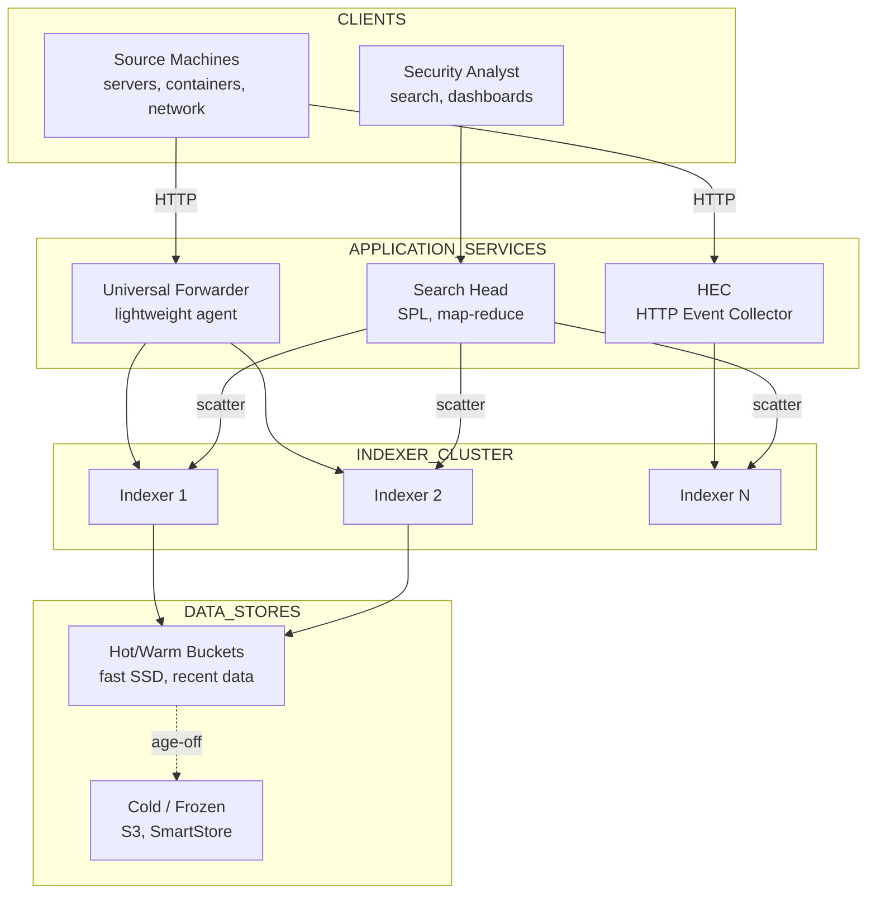
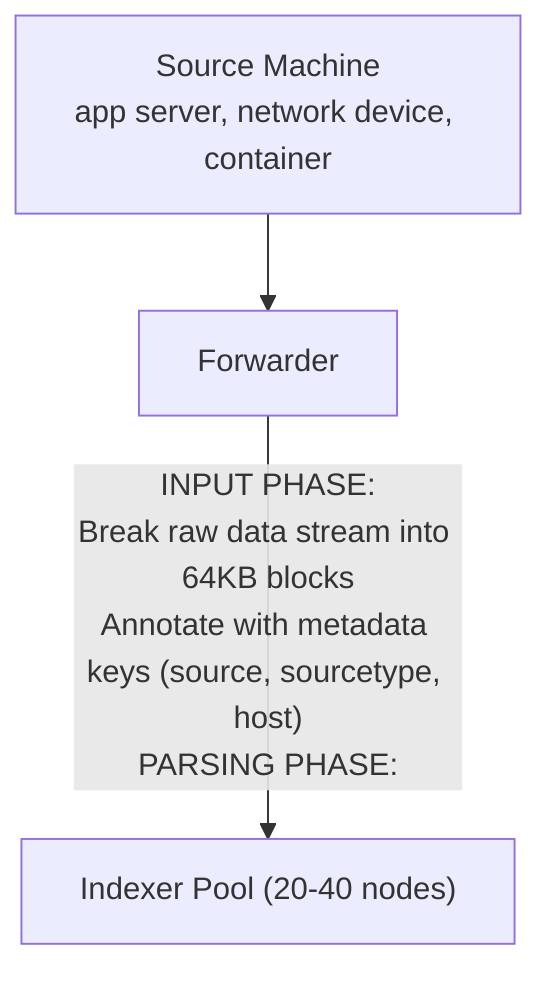
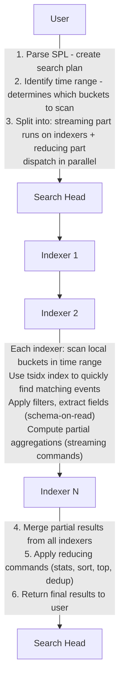

# Design: Splunk
*Log Analytics Platform -- 75 min*

---

## Phase 1: Clarify the Problem & Scope *(5--7 min)*

> **Say:** "We're designing a distributed log analytics platform like Splunk. The system collects machine-generated data from thousands of sources -- servers, applications, network devices, cloud services -- ingests and indexes terabytes per day, then enables real-time search, alerting, dashboards, and historical analysis over that data. The fundamental proposition: index EVERYTHING, search ANYTHING, in SECONDS."

### Questions I'd Ask

- **What outcome does the customer measure?** *-- Mean Time to Detect (MTTD) and Mean Time to Resolve (MTTR) for production incidents. Splunk exists to make those numbers smaller. This means: ingestion latency matters (faster data in -- faster detection), query speed matters (faster search -- faster root cause), and alert reliability matters (fewer false positives -- faster human response).*
- **Data sources?** *-- Any machine data: application logs, syslogs, metrics, API events, network flows, security events. Schema-on-read -- no predefined schema required.*
- **Query model?** *-- Ad-hoc full-text search with a custom query language (SPL-like). Supports filtering, aggregation, statistical functions, time-range scoping. Results in seconds even over TB of data.*
- **Real-time vs. batch?** *-- Both. Real-time alerting (detect anomaly within seconds of ingestion) AND historical search (query data from months ago).*
- **Retention?** *-- Hot (searchable, fast): 30-90 days. Warm/Cold (searchable, slower): up to years. Frozen (archived, restore-on-demand): unlimited.*
- **Scale?** *-- ~10 TB/day ingestion, ~50K search queries/day, retention of ~1 PB searchable, ~50K forwarder agents.*

### Agreed Scope

| In Scope | Out of Scope |
|---|---|
| Data collection (forwarders, HEC) | SIEM correlation rules engine |
| Parsing & event extraction | Machine learning toolkit internals |
| Indexing engine & storage tiers | Visualization / dashboard rendering |
| Distributed search | Billing / license management |
| Alerting & scheduled searches | App marketplace |
| Data replication & high availability | User authentication (RBAC exists, not deep-dived) |

### Core Use Cases

- **UC1:** SRE searches `index=web status=500 | stats count by host | sort -count` -- within 5 seconds, sees which hosts are throwing the most 500 errors in the last 24 hours.
- **UC2:** Security analyst creates alert: "If more than 100 failed login attempts from the same IP in 5 minutes, fire PagerDuty." Alert evaluates in real-time as data is ingested.
- **UC3:** Compliance team searches 6 months of access logs for a specific user's activity. Searches across warm/cold data tiers, takes ~30 seconds.
- **UC4:** 50K forwarder agents continuously stream data -- system must never drop events, even during spikes.

### Non-Functional Requirements

- **Ingest reliability:** ZERO data loss. Every log event that enters the system must be indexed and searchable. Data is the product.
- **Time-to-search:** Event should be searchable within 1-5 seconds of ingestion (near-real-time).
- **Search speed:** Ad-hoc queries over 24 hours of data (<5 seconds). Queries over 30 days (<30 seconds). Queries over 1 year (minutes, acceptable).
- **Schema-on-read:** Data is indexed WITHOUT a predefined schema. Structure (fields, key-value pairs) is extracted at SEARCH TIME, not ingest time. This is the fundamental difference from structured databases.
- **Horizontal scalability:** Add more indexers for more throughput, more search heads for more concurrent queries.

> **Tip:** The defining tension: WRITE-OPTIMIZED ingestion (append-only, schema-free, 10 TB/day sustained) vs. READ-OPTIMIZED search (ad-hoc queries over unstructured text returning in seconds). Most databases optimize for one or the other. Splunk's bucket-based indexing + inverted index + time-partitioning is the architectural answer to both.

---

## Phase 2: Back-of-the-Envelope Estimation *(3--5 min)*

| Metric | Value | Detail |
|---|---|---|
| **Daily Ingestion** | **~10 TB/day** | ~120 MB/sec sustained, ~500 MB/sec peak. ~100B events/day (avg 100 bytes/event). |
| **Forwarder Agents** | **~50K** | Deployed on servers, containers, network devices. Each sends ~200 MB/day avg. |
| **Indexer Nodes** | **~20-40** | Each handles ~300-500 GB/day. Scales linearly with volume. |
| **Searchable Data** | **~1 PB** | 90 days hot (900 TB) + 1 year warm (3.65 PB compressed to ~1 PB). |
| **Search Queries / Day** | **~50K** | Mix of ad-hoc (~10K), scheduled alerts (~30K), dashboard panels (~10K). |
| **Compression Ratio** | **~10:1** | Log data compresses well. 10 TB raw -- ~1 TB on disk. Critical for storage cost. |
| **Index Overhead** | **~10-15%** | Inverted index (tsidx) adds ~10-15% storage on top of compressed raw data. |
| **Replication Factor** | **3x** | 3 copies of data across indexer cluster. 1 TB compressed -- 3 TB on disk. |

> **Decision:** **Key insight #1:** 10 TB/day ingestion is fundamentally a WRITE THROUGHPUT problem. At 120 MB/sec sustained, this requires an append-only storage engine with minimal write amplification. No B-tree updates, no random I/O -- pure sequential writes.

> **Decision:** **Key insight #2:** Search speed over 1 PB of data requires TIME-BASED PARTITIONING. Every query has a time range ("last 24 hours," "last 7 days"). By organizing data into time-bounded buckets, the search engine skips 99% of data that's outside the query's time range.

> **Decision:** **Key insight #3:** Schema-on-read means the inverted index must be GENERAL PURPOSE -- index all tokens, not just predefined fields. At query time, fields like `status=500` are extracted from raw events using configurable extraction rules. This trades query-time CPU for ingest-time simplicity.

---

## Phase 3: High-Level Design *(8--12 min)*

> **Say:** "The architecture has three tiers matching the data pipeline: Collection (forwarders gather data), Indexing (indexers parse, index, and store), and Search (search heads coordinate distributed queries). Let me draw all three."

### Key Architecture Decisions

> **Say:** "Here's WHY I chose each technology -- mapping requirements to tradeoffs. Every choice has a rejected alternative and a consequence."

| Requirement | Decision | Why (and what was rejected) | Consistency |
|---|---|---|---|
| 100K+ events/sec ingest with zero data loss | Custom bucket-based storage (not standard DB) | Append-only buckets with TSIDX index. Bloom filters skip non-matching buckets. Standard DB would need full-text index + time partitioning -- slower. | -- |
| Search across distributed indexers | MapReduce: scatter to indexers, gather at Search Head | Each indexer searches its local data. Search Head merges results. Parallelism scales with indexer count. | -- |
| Long-term retention at reasonable cost | SmartStore: hot (SSD) -- warm (SSD) -- cold (S3) | Recent data on fast SSD for real-time search. Aged-off data on S3 (10x cheaper). Transparently thawed on search. | -- |
| Schema-less data (logs have unpredictable fields) | Schema-on-read (not schema-on-write) | Extract fields at search time, not ingest time. Any log format works without pre-defining columns. Tradeoff: search-time extraction is slower than pre-indexed fields. | -- |
| Multi-tenant: each index isolated | Role-based access per index | Analyst sees their indexes only. Raw data stored once, access policies applied at query time. No data duplication per role. | -- |

### Three-Tier Architecture



#### Universal Forwarder [COLLECTION]
- Lightweight agent on source machines
- Monitors log files, collects metrics
- Forwards raw data to indexers
- Load-balances across indexer pool
- ~1-2% CPU overhead on host

#### Heavy Forwarder [COLLECTION]
- Full parsing pipeline at the source
- Can filter, mask, route data
- Used for: data masking (PII), API collection
- Higher resource usage than UF

#### HTTP Event Collector (HEC) [COLLECTION]
- REST API endpoint for event ingestion
- Applications POST JSON events directly
- Token-based auth, no agent needed
- Ideal for cloud-native / container workloads

#### Indexer [INDEXING]
- THE core component. Receives, parses, indexes, stores.
- Breaks raw data into events (line breaking, timestamp extraction)
- Builds inverted index (tsidx) for fast search
- Stores in time-bucketed directories
- Responds to search queries from search heads

#### Search Head [SEARCH]
- User interface + search coordinator
- Parses SPL query, creates search plan
- Dispatches search jobs to indexers in parallel
- Merges results from all indexers
- Runs scheduled searches and alerts

#### Cluster Manager [MANAGEMENT]
- Manages indexer cluster membership
- Coordinates data replication
- Handles bucket fixup (repair under-replicated data)
- Distributes configuration to indexers

### Flow 1: Data Ingestion Pipeline



### Flow 2: Distributed Search



> **Say:** "The deep dives I want to cover: (1) How the indexing engine achieves 10 TB/day sustained writes with the bucket + inverted index model. (2) How distributed search parallelizes queries across indexers to search a PB in seconds. (3) How storage tiering (hot/warm/cold/frozen + SmartStore) balances cost and performance."

---

## Phase 4: Deep Dives *(25--30 min)*

### Deep Dive 1: Ingestion & Parsing Pipeline (~8 min)

> **Goal:** The core challenge: Ingest 10 TB/day of arbitrary machine data -- logs, JSON, XML, custom formats -- without a predefined schema. Parse each event to extract a timestamp, break multi-line logs correctly, and assign metadata. Never drop an event.

**The Data Pipeline (4 phases)**

| Phase | Where It Runs | What It Does |
|---|---|---|
| 1. Input | Forwarder | Read data from source (file tail, TCP/UDP listen, API poll). Break into 64KB blocks. Annotate with metadata: source, sourcetype, host. Forward to indexer. |
| 2. Parsing | Indexer (or Heavy Forwarder) | Line breaking: split block into individual log events (newline-delimited, or multi-line patterns like Java stack traces). Timestamp extraction: parse timestamp from event text, assign `_time`. Character encoding normalization. |
| 3. Indexing | Indexer | Tokenize event text -- add tokens to inverted index (tsidx). Compress raw event -- write to journal. Assign event to current "hot" bucket based on `_time`. |
| 4. Replication | Indexer Cluster | Replicate bucket data to peer indexers for HA. Replication factor (RF) = number of copies. Search factor (SF) = number of searchable copies. |

> **Decision:** **Why "sourcetype" matters so much:** The sourcetype tells the parser HOW to parse. `sourcetype=apache:access` -- parse as Apache combined log format, extract timestamp from position 1, line break on newline. `sourcetype=log4j` -- multi-line, look for timestamp pattern `yyyy-MM-dd HH:mm:ss`. Getting sourcetype wrong means wrong timestamps, wrong events, wrong search results. Best practice: ALWAYS configure sourcetype explicitly rather than relying on auto-detection.

**Forwarder Load Balancing**

- **Auto-balancing:** Each forwarder distributes data across the indexer pool. Uses a round-robin or volume-based strategy. If an indexer goes down, forwarder automatically redirects to surviving indexers.
- **Even distribution is critical:** If indexer A has 2x the data of indexer B, searches over time ranges where A has data will be 2x slower (more data to scan on A). The search head waits for the SLOWEST indexer. Even distribution = even search performance.
- **Persistent queue:** Forwarder has an on-disk queue. If all indexers are unreachable, events queue locally until connectivity is restored. Zero data loss.

> **Decision:** **Why Universal Forwarder over direct API ingestion?** UF handles: file tailing (with bookmarking -- knows where it left off after restart), reliable delivery (persistent queue), load balancing, and SSL transport. HEC (HTTP Event Collector) is simpler for cloud-native apps that can POST directly, but lacks the file-tailing and OS-level collection capabilities. Tradeoff: UF requires agent deployment (50K installations to manage), but provides the most reliable, feature-rich collection.

### Deep Dive 2: Indexing & Storage Engine (~10 min)

> **Goal:** The core challenge: Store 10 TB/day in a format that supports sub-second full-text search. Traditional databases (B-tree, LSM) are designed for structured data with predefined schemas. We need an engine optimized for UNSTRUCTURED TIME-SERIES TEXT data.

**The Bucket Model**

```sql
-- Bucket: The fundamental storage unit --

A bucket is a directory containing all events within a TIME RANGE:

bucket/
  rawdata/        // Compressed raw events (journal.gz)
                    // Append-only. Sequential writes. ~10:1 compression.
  Hosts.data      // Bloom filter: "does this bucket contain events from host X?"
  Sources.data    // Bloom filter: "does this bucket contain source Y?"
  SourceTypes.data// Bloom filter: "does this bucket contain sourcetype Z?"
  index.data      // tsidx: inverted index mapping tokens -> event offsets
                    // "status" -> [event_7, event_42, event_891, ...]
                    // "500"    -> [event_42, event_103, ...]
                    // "error"  -> [event_7, event_42, event_567, ...]

Each bucket covers a specific time range:
  bucket_1: events from 2024-01-15T00:00 to 2024-01-15T06:00
  bucket_2: events from 2024-01-15T06:00 to 2024-01-15T12:00
  ...

Bucket lifecycle: hot -> warm -> cold -> frozen -> deleted
```

**Bucket Lifecycle**

| State | Storage | Writable? | Searchable? | Typical Duration |
|---|---|---|---|---|
| Hot | SSD (local) | Yes -- actively receiving new events | Full speed | Minutes to hours |
| Warm | SSD or HDD (local) | No -- closed, no new writes | Full speed | Days to weeks |
| Cold | HDD or network storage | No | Slower (disk seek) | Weeks to months |
| Frozen | S3 / object store (SmartStore) | No | Restore-on-demand | Months to years |
| Deleted | -- | -- | -- | After retention policy |

- **Hot bucket:** One per index per indexer. Actively written to. When it exceeds a size limit or time range, it "rolls" to warm.
- **Rolling:** Hot -- warm: bucket is closed (no more writes), tsidx is finalized and optimized. This is a local operation, very fast.
- **Warm -- cold:** Bucket moved to cheaper storage. Searchable but slower (HDD random access instead of SSD sequential).
- **SmartStore (frozen/archive):** Bucket data moved to S3. Only the tsidx metadata stays local (tiny). On search, the cache manager fetches the bucket from S3 to local SSD. LRU eviction of local cache.

> **Decision:** **Why this bucket model instead of a standard LSM tree (like ClickHouse or Elasticsearch)?** The bucket model is uniquely optimized for time-series log data: (1) Time-partitioning means queries with time ranges skip entire buckets -- a 24-hour query only opens ~4 buckets, not the entire dataset. (2) Append-only writes to the hot bucket means zero write amplification (no compaction like LSM). (3) Each bucket is self-contained -- can be replicated, moved, archived, or deleted as a unit. (4) Bloom filters give O(1) "does this bucket have what I need?" checks before reading any data. Tradeoff: no real-time updates or deletes of individual events. Events are immutable once indexed. This is fine for log data (you never edit a log line).

**The Inverted Index (tsidx)**

- **Tokenization:** Every event is broken into tokens at major delimiters (spaces, punctuation, special chars). `2024-01-15 10:30:22 ERROR [auth] login failed for user=admin ip=10.0.0.1` produces tokens: `2024, 01, 15, 10, 30, 22, ERROR, auth, login, failed, user, admin, ip, 10.0.0.1`
- **Inverted index maps:** token -- list of event offsets within the bucket. `"ERROR" -> [offset_42, offset_891]`, `"admin" -> [offset_42, offset_1203]`.
- **Search for `"ERROR admin"`:** Intersect posting lists -- `[offset_42]`. One matching event. No need to scan all events in the bucket.
- **Schema-on-read:** The tsidx indexes ALL tokens, not just predefined fields. At search time, if user queries `user=admin`, the search engine: (a) uses tsidx to find events containing "admin," then (b) applies a field extraction regex to determine if "admin" is the value of the "user" field. This is slower than pre-extracted fields but infinitely more flexible.

> **Tip:** **Indexed fields vs. search-time fields:** By default, all fields are extracted at search time (flexible, no ingest overhead). For very frequently queried fields (e.g., `status`, `host`), you can configure "indexed extraction" which creates a dedicated field index at ingest time. This makes queries on those fields 10-100x faster but increases storage and reduces ingest throughput. The tradeoff: index the fields you search constantly, leave everything else as search-time.

### Deep Dive 3: Distributed Search (~7 min)

> **Goal:** The core challenge: A query like `index=web status=500 | stats count by host` must scan potentially 1 PB of data across 40 indexers and return results in seconds. The search must parallelize across indexers AND within each indexer.

**Map-Reduce Search Architecture**

```sql
-- Query: index=web status=500 | stats count by host --

Search Head decomposes into:

STREAMING PHASE (runs on each indexer in parallel -- the "map"):
  1. Identify buckets in time range for index=web
  2. For each bucket: check Bloom filter -- does it contain "500"?
     If NO -> skip entire bucket (huge optimization)
     If YES -> open tsidx, look up "500" -> get event offsets
  3. For each matching event: extract raw event from journal
  4. Apply field extraction: parse "status" field
  5. Filter: status == 500? If yes, include.
  6. Compute partial aggregation: count per host (on this indexer)
  7. Return partial results to search head

REDUCING PHASE (runs on search head -- the "reduce"):
  1. Receive partial counts from all 40 indexers
  2. Merge: sum counts per host across all indexers
  3. Sort by count descending
  4. Return top results to user

Why this is fast:
  - Time range eliminates ~95% of buckets (never opened)
  - Bloom filters eliminate ~80% of remaining buckets
  - tsidx inverted index narrows to matching events (no full scan)
  - Parallel across 40 indexers: each scans 1/40th of data
  - Partial aggregation at indexer reduces data sent to search head
```

> **Decision:** **Why map-reduce over a centralized query engine?** With 1 PB across 40 nodes, shipping all raw events to a central query engine would be 25 TB of network I/O (for a 1-day query). Map-reduce pushes computation TO the data -- each indexer filters and partially aggregates locally, then sends only the small result set (KBs) to the search head. Tradeoff: complex queries that require global ordering or joins are harder to distribute. For most log analytics queries (filter + aggregate), map-reduce is optimal.

**Search Head Cluster**

- **Problem:** A single search head can coordinate ~50-100 concurrent searches. With 50K queries/day (~30K scheduled), one search head isn't enough.
- **Solution:** Search Head Cluster (SHC) -- 3+ search heads behind a load balancer. Searches are distributed across members. Scheduled searches and dashboards are replicated so any member can run them.
- **Captain election:** Majority-based protocol. Odd number of members (3, 5, 7) to prevent split-brain. Captain assigns scheduled searches to members evenly.
- **Artifact replication:** Search results (for dashboards, saved searches) replicated across SHC members for HA.

### Deep Dive 4: Storage Tiering & SmartStore (~5 min)

> **Goal:** The core challenge: Storing 1 PB on local SSDs is prohibitively expensive (~$100K/month). But search performance demands fast storage. SmartStore decouples compute from storage by using S3 for persistence and local SSDs as a cache.

| Tier | Storage | Cost (approx) | Search Latency | Use Case |
|---|---|---|---|---|
| Hot/Warm | Local SSD | $$$$ | <1 sec | Recent data. Actively queried. Last 7-30 days. |
| SmartStore Cache | Local SSD (cache) | $$ | <5 sec (cache hit) / ~30s (fetch from S3) | Older data. Cache recently searched buckets. |
| SmartStore Remote | S3 / GCS | $ | ~30-60 sec (fetch + search) | Bulk of retained data. Pay only for storage. |
| Frozen Archive | S3 Glacier / equivalent | cents | Minutes to hours (restore) | Compliance data. Rarely accessed. |

```sql
-- SmartStore Data Flow --

Ingest:
  Events -> hot bucket (local SSD) -> tsidx built locally
  When hot rolls to warm -> bucket uploaded to S3 (remote store)
  Local copy remains in cache (recently indexed data is frequently searched)

Search:
  Search head dispatches query to indexer
  Indexer checks: is the bucket in local cache?
    YES -> search locally, fast
    NO  -> cache manager fetches bucket from S3 to local SSD
           -> search locally
           -> bucket stays in cache (LRU eviction)

Cache Management:
  Cache manager tracks bucket access frequency
  Hot/frequently-searched buckets stay in cache
  Cold/rarely-searched buckets evicted (LRU)
  If cache is full, oldest/least-searched buckets evicted first

Key benefit: indexer COMPUTE scales independently of STORAGE.
Add indexers for throughput. Add S3 for retention. Decouple the two.
```

> **Decision:** **Why SmartStore over traditional coupled storage?** Traditional Splunk: each indexer stores data on its own disks. Replication factor 3 means 3x storage cost. Adding retention requires adding indexers (expensive -- you're paying for compute you don't need). SmartStore: S3 provides durability and replication (11 nines). No need for Splunk-level replication of remote data. Indexers become stateless compute nodes with a cache. Tradeoff: first search against uncached data takes ~30s (S3 fetch). Mitigated by pre-warming caches for commonly queried time ranges and by the LRU cache keeping recently searched data local.

---

## Phase 5: Cross-Cutting Concerns *(10--12 min)*

### Storage Architecture Summary

> **Goal:** What goes where and why. Each data store is chosen for its access pattern -- not by default. The question isn't "which database?" but "what are the read/write patterns, consistency requirements, and scale characteristics?"

| Data | Store | Why This Store |
|---|---|---|
| Hot buckets | Local SSD | Currently being written. One per index per indexer. Raw + TSIDX (time-series index). <24 hours of data typically. |
| Warm buckets | Local SSD | Closed for writing, still on fast storage. Searchable. Rolled from hot when size/time threshold hit. |
| Cold buckets | Cheap disk / NFS | Aged-off from warm. Still searchable but slower. Retention policy driven (30-90 days typical). |
| Frozen / archived | S3 (SmartStore) | Long-term archive. Not searchable without thawing. Compliance retention (1-7 years). Cheapest storage tier. |
| Search artifacts | Local disk | Search job results cached for re-display. TTL-based cleanup. Per-user isolation. |
| Configuration | Filesystem | Splunk configs (.conf files) replicated across cluster. Props, transforms, indexes, inputs. |

### Failure Scenarios

| Scenario | Mitigation |
|---|---|
| Indexer node crashes | Replication factor ensures data exists on peer indexers. Cluster manager detects failure, initiates "bucket fixup" to re-replicate under-replicated buckets to healthy nodes. Forwarders auto-redirect to surviving indexers. Zero data loss if RF >= 2. |
| Search head crashes | SHC captain detects member failure. Scheduled searches reassigned to surviving members. Users connect through load balancer, routed to healthy member. Active search jobs on crashed member must be re-run. |
| Forwarder can't reach indexers | Forwarder's persistent on-disk queue buffers events. Default queue size: 500MB-5GB. When connectivity restores, queued events are forwarded. If queue fills (extended outage), oldest events can be dropped or written to local emergency file. |
| Ingestion spike (10x normal volume) | Indexers queue incoming data. Parsing backlog grows but data is not dropped. Search latency may increase (indexers busy with ingestion). Horizontal scaling: add indexers. Forwarder load balancing distributes the spike. |
| Search "of death" (unbounded query) | Search time limits: default 10 minute timeout. Resource quotas per user/role. Expensive queries (no time range, no filters) are flagged. Search scheduler has concurrency limits -- won't allow one user's queries to starve others. |
| S3 outage (SmartStore) | Hot/warm data on local SSD is unaffected. Searches over cached buckets work normally. Searches over uncached cold data fail until S3 recovers. New data continues to ingest to local hot buckets -- uploaded to S3 when available. |

### Scalability

| Dimension | How It Scales | Bottleneck |
|---|---|---|
| Ingest throughput | Add indexers. Linear scaling: 40 indexers -- 10 TB/day. 80 -- 20 TB/day. | Forwarder connection limits, network bandwidth to indexer tier. |
| Search concurrency | Add search heads (SHC). Each member handles ~50-100 concurrent searches. | Indexer CPU -- every search head dispatches to the SAME indexer pool. Too many searches saturate indexers. |
| Storage retention | SmartStore: add S3 capacity. Elastic, pay-per-GB. No indexer changes needed. | S3 fetch latency for uncached searches (~30s). |
| Data diversity | Separate indexes for different data types (security, app, infra). Independent retention policies per index. | Index proliferation increases search head overhead. |

### Data Integrity & Compliance

- **Immutable events:** Once indexed, events cannot be modified or deleted individually. Only entire buckets can be deleted (by retention policy). This is a feature for compliance -- audit logs can't be tampered with.
- **Role-based access:** Users see only indexes they have permission to search. Data masking at search time for sensitive fields (PII).
- **Data masking at ingest:** Heavy forwarders can mask fields before data leaves the customer's network. Credit card numbers replaced with `XXXX-XXXX-XXXX-1234` before reaching indexers.
- **Chain of custody:** Bucket metadata tracks: when ingested, from what source, on which indexer, replicated to which peers. Enables forensic verification of log integrity.

### Observability (of the observability platform)

- **Monitoring Console:** Dedicated search head that monitors the Splunk deployment itself. Tracks: ingestion rate per indexer, search concurrency, queue depths, replication status, license usage.
- **Key alerts:** Ingestion lag > 60s, indexer queue depth > 100K events, search concurrency at limit, replication factor violation (under-replicated buckets), license approaching limit.

### Security & Access Control

> **Decision:** As a SIEM (Security Information and Event Management) platform, Splunk ingests the most sensitive data in an organization: authentication logs, firewall logs, endpoint detection events, and potentially PII. Access control is role-based: an analyst can search their assigned indexes but not the HR payroll index. Search-time field extraction means raw data is stored once and access policies are applied at query time -- no need to create separate copies for different teams. All data is encrypted at rest (AES-256). In multi-tenant deployments (Splunk Cloud), customer data is isolated by index with tenant-specific encryption keys. The audit log tracks every search query -- who searched for what, when -- which is critical for insider threat investigations (you need to know if someone is inappropriately searching for coworker data). Forwarder-to-indexer communication uses TLS with mutual certificate authentication. For compliance: Splunk supports FIPS 140-2 mode for government deployments and has FedRAMP authorization.

---

## Phase 6: Wrap-Up & Evolution *(3--5 min)*

> **Say:** "To summarize: the architecture is a three-tier distributed system -- Collection (forwarders), Indexing (indexers), and Search (search heads) -- designed around one fundamental data structure: the time-bucketed inverted index. Ingestion is append-only into hot buckets with zero write amplification, achieving 10 TB/day sustained. Search parallelizes across indexers in a map-reduce pattern: each indexer scans its local buckets (using Bloom filters and tsidx inverted indexes to skip irrelevant data), computes partial aggregations, and returns small result sets to the search head for final merge. Time-partitioning is the single biggest optimization -- every query has a time range, and buckets outside that range are never opened. SmartStore decouples compute from storage by using S3 for persistence and local SSD as a hot cache, enabling petabyte-scale retention without petabyte-scale compute. Schema-on-read means data is indexed without a predefined schema -- fields are extracted at query time, trading search CPU for ingest flexibility."

### What I'd Build Next

| Extension | Architecture Impact |
|---|---|
| Federated Search (across clusters) | Search head dispatches to indexers in multiple independent clusters. Requires cross-cluster auth, result merge across WAN. |
| Metrics Store (beyond logs) | Dedicated time-series store for numeric metrics (CPU, memory, latency). Different storage format than text logs -- columnar, compressed, downsampled. Much more efficient for numeric aggregations. |
| SIEM Correlation Engine | Complex event processing: correlate events across multiple indexes and time windows. "If failed login on index=auth AND file access on index=fileserver within 5 minutes, alert." Requires streaming correlation, not just batch search. |
| AI/ML Anomaly Detection | Train models on historical patterns. Score incoming events in real-time. Requires feature extraction at ingest time (departure from pure schema-on-read). |
| Edge Processor | Filter, transform, and route data at the collection tier before it reaches indexers. Reduces ingest volume (and license cost) by dropping noise at the source. Requires a processing engine on/near forwarders. |

> **Tip:** **Closing framing:** This system is defined by ONE architectural choice that cascades through everything: schema-on-read with time-bucketed inverted indexes. This choice means: (1) Any data can be ingested without upfront schema design. (2) Any question can be asked at search time, even questions that weren't anticipated at ingest time. (3) Storage is organized by time, making time-bounded queries dramatically faster. (4) The tradeoff is search-time CPU for field extraction -- accepted because most log queries are time-bounded and filtered, hitting only a fraction of the data. Every other design decision -- the three-tier pipeline, the bucket lifecycle, SmartStore, map-reduce search -- follows from this foundational choice.

---

## Phase 7: Interview Q&A *(Practice)*

> **Say:** "Here are the hardest questions an interviewer would ask about this design, and how to answer them. Each answer demonstrates deep understanding of the tradeoffs, not just surface knowledge."

**Q:** Why does Splunk use its own storage format instead of a standard database?

**A:** Because log data has a unique access pattern that databases aren't optimized for. Log events are (1) write-once, never updated, (2) always queried by time range, (3) need full-text search across arbitrary fields, (4) arrive at extremely high throughput (100K+ events/second per indexer). A traditional database would need: a time-partitioned table (for range queries), a full-text index (for search), and high write throughput -- and it would struggle with all three simultaneously. Splunk's format is purpose-built: each "bucket" is a time-bounded directory containing the raw compressed data plus a TSIDX (time-series index) file that's essentially a bloom filter + sorted term dictionary. Searches first narrow by time range (skip entire buckets), then by term (bloom filter eliminates non-matching buckets), then scan only the matching segments. This means a search for "error" in the last 1 hour might read 0.1% of the data on disk. A general-purpose database would likely need to scan more because it can't exploit the time-partitioned bloom filter architecture.

**Q:** How does MapReduce-style distributed search work across indexers?

**A:** The Search Head is the coordinator, indexers are the workers. When a user runs `search index=web status=500 | stats count by host`, the Search Head: (1) parses the SPL (Search Processing Language), (2) splits it into a "map" phase (filtering + partial aggregation) that runs on each indexer, and (3) a "reduce" phase (final aggregation) that runs on the Search Head. The map phase is parallelized: each indexer searches its local buckets for `status=500` events and computes partial counts by host. The Search Head collects these partial results and merges them. For simple stats (count, sum), the merge is trivial. For complex operations (dedup, sort, transaction), the Search Head may need to process more data. The key optimization: "search-time field extraction" means the filter `status=500` can be applied at the indexer without the Search Head seeing raw events -- only matching events are sent back. This reduces network transfer dramatically. For very large result sets, the Search Head can become a bottleneck, which is why Splunk offers Search Head Clustering for horizontal scaling of the reduce phase.
