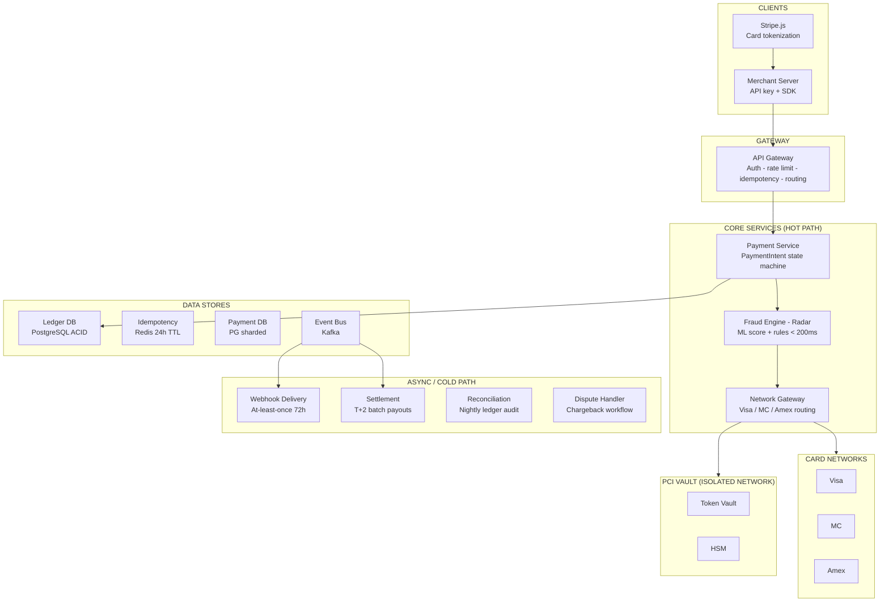
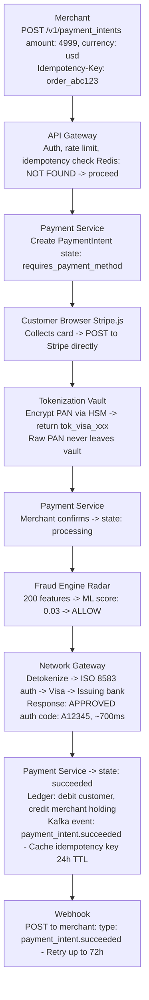

# Design: Stripe
> Payment Processing -- 75 min

---

## Phase 1: Clarify the Problem & Scope *(5--7 min)*

> **Say:** "We're designing Stripe -- a global payment processing platform. The core job: accept a credit card number from a merchant's customer, move money from the customer's bank to the merchant's bank, and make the entire process feel like seven lines of code. Under the hood: tokenization vaults, card network orchestration, double-entry ledgers, real-time fraud detection, idempotent APIs, and multi-currency settlement across 40+ countries."

### Questions I'd Ask

- **What's the core payment flow?** *-> PaymentIntent API: merchant creates a PaymentIntent with amount + currency, client-side collects card details and confirms, Stripe authorizes with card network, then captures. Two-step (auth + capture) or one-step (immediate charge).*
- **Which payment methods?** *-> Cards (Visa, Mastercard, Amex), bank debits (ACH, SEPA), wallets (Apple Pay, Google Pay), BNPL (Klarna, Affirm). Cards are the primary flow.*
- **PCI compliance?** *-> Critical. Raw card numbers (PAN) never touch merchant servers. Stripe.js collects card details client-side, tokenizes directly with Stripe's PCI-certified vault. Merchants only see tokens.*
- **Settlement?** *-> Stripe holds funds after capture, batches payouts to merchant bank accounts (T+2 standard). Multi-currency: accept in EUR, settle in USD with FX conversion.*
- **Fraud detection?** *-> Stripe Radar: ML model scoring every transaction in real-time. Rules engine for merchant-specific policies. 3D Secure for high-risk transactions (SCA/PSD2 in Europe).*
- **Exactly-once semantics?** *-> Idempotency keys on every mutating API call. Client retries with same key -> server returns cached result. No double charges, ever.*

### Agreed Scope

| In Scope | Out of Scope |
|----------|-------------|
| PaymentIntent lifecycle: create -> confirm -> authorize -> capture | Stripe Connect (marketplace payouts) |
| Tokenization vault (PCI-DSS Level 1) | Stripe Billing / Subscriptions engine |
| Double-entry ledger & settlement | Stripe Terminal (in-person POS) |
| Fraud detection (Radar ML + rules) | Issuing (Stripe-issued cards) |
| Idempotency & exactly-once processing | Treasury / Banking-as-a-service |
| Webhook delivery for async events | Tax calculation engine |
| Multi-currency with FX conversion | Identity verification (Stripe Identity) |

### Core Use Cases

- **UC1: One-time card payment** -- Customer buys a $49.99 item. Merchant creates PaymentIntent, customer enters card in Stripe Elements, Stripe authorizes + captures. Merchant receives webhook `payment_intent.succeeded`. Funds settle T+2.
- **UC2: Auth + capture (hotel/rental)** -- Hotel authorizes $500 at check-in. At checkout, captures actual amount $420. Difference released. Auth expires after 7 days.
- **UC3: Refund** -- Merchant issues full or partial refund. Stripe reverses ledger entry, submits refund to card network, customer's bank credits 5-10 business days.
- **UC4: 3D Secure** -- European payment triggers SCA. Customer redirected to bank's 3DS page, authenticates, payment completes. On failure, PaymentIntent enters `requires_action`.
- **UC5: Failed payment with retry** -- Card declined. PaymentIntent moves to `requires_payment_method`. Customer retries with different card.

### Non-Functional Requirements

- **Correctness above all:** Money cannot be lost, duplicated, or misattributed. Financial invariant: total debits = total credits at all times. A missing cent triggers an audit failure.
- **Idempotency:** Every mutating API call safely retriable. Timeout during $10,000 charge must never result in two charges. Keys retained 24 hours.
- **Low latency:** Authorization in <2 seconds (customer waiting at checkout). Card network round-trip + fraud check + Stripe overhead.
- **High availability:** 99.999% for the payment path. Downtime = lost revenue for every merchant. Multi-region active-active.
- **PCI-DSS Level 1:** Raw card data only in isolated tokenization vault. Own network segment, separate access controls, annual audit.
- **Multi-tenancy:** Millions of merchants on shared infrastructure. One merchant's traffic spike must not degrade others.

> **Tip:** The defining tension in payment systems: **correctness vs. availability**. A social media post can be eventually consistent -- a payment cannot. If the authorization succeeded at the card network but your database write fails, you've charged the customer without recording it. The entire architecture is built around making financial state transitions atomic and recoverable.

---

## Phase 2: Back-of-the-Envelope Estimation *(3--5 min)*

| Metric | Value | Detail |
|--------|-------|--------|
| Total Payment Volume | ~$1T/year | ~$2.7B/day. Average transaction ~$65. Millions of businesses globally. |
| Transactions per Day | ~40M | $2.7B / $65 avg = 40M. ~460 TPS avg, ~5K TPS peak (Black Friday). |
| API Requests per Day | ~500M | Each payment triggers ~5-10 API calls. Plus non-payment APIs (customers, subscriptions). |
| Authorization Latency | <2 seconds | Card network: 500-1000ms. Fraud: 50-200ms. Stripe: <100ms. Total <2s. |
| Merchants | ~4M+ | Solo devs to Fortune 500. Shared infra with per-merchant isolation. |
| Idempotency Store | ~500M keys | 24h TTL. Key + cached response ~100 bytes. ~50GB in Redis. |

> **Decision:** Key insight #1: Payment processing is not a throughput problem -- 5K TPS peak is modest. The hard part is correctness under failure. Every transaction must be exactly-once, auditable, and consistent across distributed systems.

> **Decision:** Key insight #2: Latency is dominated by the card network round-trip (500-1000ms). Stripe's internal processing must be fast (<100ms) to stay within 2 seconds. Fraud check: real-time. Ledger writes: async. Tokenization: sub-50ms.

> **Decision:** Key insight #3: Money flows are asymmetric in time. Authorization is instant (customer waiting). Settlement is batch (T+2 days). Hot path (auth): low-latency, high availability. Cold path (settlement): batch overnight. Two different system profiles.

---

## Phase 3: High-Level Design *(8--12 min)*

### Key Architecture Decisions

| Requirement | Decision | Why | Consistency |
|-------------|----------|-----|-------------|
| Card data security (PCI-DSS L1) | Isolated tokenization vault | Raw PANs in separate hardened service with own network segment. All other systems use opaque tokens. Reduces PCI scope from entire platform to one service. | CP |
| No double charges on retry | Idempotency keys (24h TTL in Redis) | Client sends unique key per request. Server checks before processing, returns cached result on duplicate. Without: timeout -> retry -> double charge. | CP |
| Financial correctness | Double-entry ledger (PostgreSQL) | Every movement: debit + credit. Invariant: sum debits = sum credits. Enables point-in-time reconstruction. Simple balance updates lose audit trail. | CP (ACID) |
| Real-time fraud scoring | ML pipeline (Radar) inline on auth | Must complete in <200ms within auth latency budget. Cross-merchant signals. Async detection lets fraudulent charges through. | -- |
| Complex payment lifecycle | PaymentIntent state machine | Explicit states (created -> processing -> succeeded). Each transition atomic. Recoverable after crashes. Ad-hoc flags create inconsistent states. | CP |
| Async merchant notification | Webhooks (at-least-once, 72h retry) | Merchants need to know when payments succeed/fail/dispute. Retry with exponential backoff. Polling wastes API calls and delays. | Eventual |

### Architecture Topology



### Flow: Card Payment (Happy Path)



---

## Phase 4: Deep Dives *(25--30 min)*

### Deep Dive 1: PaymentIntent State Machine (~8 min)

> **Goal:** PaymentIntent is Stripe's central abstraction. It represents the lifecycle of a single payment from creation through authorization, capture, and settlement. The state machine makes the complex lifecycle explicit, recoverable, and auditable.

| State | Meaning | Transitions |
|-------|---------|-------------|
| requires_payment_method | Created, waiting for card/bank details | -> requires_confirmation |
| requires_confirmation | Method attached, awaiting merchant confirm | -> requires_action \| processing |
| requires_action | Customer must complete 3DS/redirect | -> processing \| requires_payment_method |
| processing | Authorizing with card network | -> requires_capture \| succeeded |
| requires_capture | Auth approved, funds held. Must capture. | -> succeeded \| canceled |
| succeeded | Payment complete. Funds captured. | (terminal) |
| canceled | Canceled by merchant or system | (terminal) |

> **Decision:** Why a state machine instead of status flags? (1) Recoverability: if system crashes mid-transition, the persisted state tells you exactly where to resume. "Processing" = auth sent to card network -- check for response. (2) Concurrency safety: you can't capture in "requires_action" state. Invalid operations are structurally impossible. (3) API clarity: the state IS the instruction. "requires_action" -> redirect to 3DS. "requires_capture" -> call capture. The next step is always unambiguous.

> **Decision:** Why separate auth and capture? Hotels, car rentals, restaurants authorize first (hold funds) then capture later (actual amount). Auth expires after 7 days. Two-step also enables fraud review before capture. One-step (auto-capture) is default for most e-commerce.

### Deep Dive 2: Idempotency & Exactly-Once (~8 min)

> **Goal:** The most important correctness guarantee: no double charges. Network failures are inevitable. Clients must retry safely. Idempotency keys ensure retrying produces the same result -- never processing the same payment twice.

```mermaid
graph TD
    subgraph FIRST["FIRST REQUEST"]
        F1["Client -> POST /v1/charges<br/>Idempotency-Key: idem_abc, amount: 4999"]
        F2["Redis: GET idem_abc -> NOT FOUND"]
        F3["Process -> Visa auth -> SUCCESS"]
        F4["Redis: SET idem_abc = status:200, body:charge:ch_xxx EX 86400"]
        F5["Return 200 charge: ch_xxx"]
        F1 --> F2 --> F3 --> F4 --> F5
    end

    subgraph RETRY["RETRY (same key, same params)"]
        R1["Client -> POST /v1/charges<br/>Idempotency-Key: idem_abc, amount: 4999"]
        R2["Redis: GET idem_abc -> FOUND, params match"]
        R3["Return cached 200 charge: ch_xxx<br/>No second charge!"]
        R1 --> R2 --> R3
    end

    subgraph MISMATCH["RETRY (same key, DIFFERENT params)"]
        M1["Client -> POST /v1/charges<br/>Idempotency-Key: idem_abc, amount: 9999"]
        M2["Redis: GET idem_abc -> FOUND, params MISMATCH"]
        M3["Return 400 Key reused with different params"]
        M1 --> M2 --> M3
    end
```



> **Decision:** Why 24h TTL? Long enough for extended outages and retries. Short enough to bound storage (~50GB). After 24h the key is pruned -- but the original transaction is already settled.

> **Decision:** Concurrent requests? Two identical requests arrive simultaneously. First acquires Redis lock (SET NX), processes, stores result. Second sees lock, waits briefly, returns stored result. Lock is ~30s -- covers card network round-trip.

> **Decision:** Defense in depth: Redis is the fast path. DB-level unique constraint on (merchant_id, idempotency_key) is the safety net. If Redis fails, fall back to DB check (slower but correct). Both layers enforce uniqueness.

### Deep Dive 3: Double-Entry Ledger (~7 min)

> **Goal:** Financial invariant: total debits = total credits, always. Every money movement creates two immutable ledger entries. The backbone of correctness -- enabling audits, reconciliation, and regulatory compliance.

```sql
-- Customer pays $49.99 to Merchant

Entry 1 (DEBIT)  -- Customer's card charged
  account: acct_customer_card   amount: -4999   txn: txn_abc

Entry 2 (CREDIT) -- Stripe holds funds
  account: acct_stripe_holding   amount: +4999   txn: txn_abc

-- Settlement (T+2): Stripe pays merchant

Entry 3 (DEBIT)  -- Stripe releases funds
  account: acct_stripe_holding   amount: -4854   -- $49.99 - $1.45 fee

Entry 4 (CREDIT) -- Merchant receives
  account: acct_merchant_balance  amount: +4854

Entry 5 (CREDIT) -- Stripe revenue
  account: acct_stripe_revenue    amount: +145    -- 2.9% + $0.30

-- INVARIANT: -4999 + 4999 - 4854 + 4854 + 145 - 145 = 0
```

> **Decision:** Why immutable append-only? (1) Audit trail: regulators require reconstructing any balance at any point. Mutable balances lose history. (2) Error detection: sum-of-all-entries = 0 verified with one query. Mutable balances drift silently. (3) Concurrency: append-only writes don't conflict. Two charges to same merchant create independent entries -- no lock contention on a balance row.

### Deep Dive 4: Fraud Detection -- Radar (~7 min)

> **Goal:** Every transaction scored in real-time. ML model (trained on billions of transactions across all merchants) + rules engine. Must complete in <200ms -- inline on the authorization path.

| Component | What | Latency |
|-----------|------|---------|
| Features | ~200 signals: card fingerprint, IP, velocity, device, cross-merchant patterns | ~20ms |
| ML Model | Gradient-boosted tree on billions of historical transactions. Outputs risk 0.0->1.0. Retrained daily. | ~30ms |
| Rules | Merchant-defined: "Block if amount >$5K and country!=US." Override or supplement ML. | ~10ms |
| 3DS Decision | Medium risk (0.3-0.75): trigger 3D Secure. Shifts liability to issuing bank. Required by PSD2/SCA. | ~5ms |
| Verdict | ALLOW (<0.3) - BLOCK (>0.75) - REVIEW (0.3-0.75: 3DS or queue) | ~5ms |

> **Tip:** Stripe's unfair advantage: Radar sees transactions across millions of merchants. A stolen card used at Merchant A can be blocked at Merchant B in real-time -- before B sees the charge. This cross-merchant signal is the most powerful fraud feature. Individual merchants can't replicate it. More merchants -> better model -> lower fraud -> more merchants. Network effect flywheel.

---

## Phase 5: Cross-Cutting Concerns *(10--12 min)*

### Data Model & Storage

| Store | Technology | What & Why |
|-------|-----------|-----------|
| Ledger | PostgreSQL (ACID) | Double-entry records. ACID non-negotiable. Sharded by merchant_id. |
| Payment DB | PostgreSQL (sharded) | PaymentIntents, Charges, Refunds, Customers. Sharded by merchant_id. |
| Token Vault | Isolated PG + HSM | Encrypted PANs. Separate network, access controls, annual PCI audit. |
| Idempotency | Redis Cluster | Keys -> cached responses. 24h TTL. ~50GB. Sub-ms lookup. |
| Event Bus | Kafka | State transitions as events. Consumers: webhooks, settlement, analytics. |
| Fraud Features | Redis + feature store | Pre-computed fraud signals. Real-time updates from transaction stream. |

```sql
PaymentIntent
  id: pi_3MtweE2eZvKYlo2C0   amount: 4999   currency: "usd"
  status: "succeeded"   payment_method: pm_card_visa  -- token, not PAN
  customer: cus_Nx9Xu...   merchant_id: acct_1Mt...  -- shard key
  idempotency_key: "order_abc123"   metadata: {"order_id": "12345"}

LedgerEntry
  id: le_uuid   transaction_id: txn_abc   account_id: acct_xxx
  type: DEBIT|CREDIT   amount: -4999   currency: "usd"  -- immutable

WebhookEvent
  id: evt_1Mt...   type: "payment_intent.succeeded"
  merchant_id: acct_1Mt...   delivery_status: delivered|pending|failed
```

### Failure Scenarios

| Scenario | Mitigation |
|----------|------------|
| Card network timeout | PaymentIntent stays "processing." Stripe queries card network for auth result (status inquiry). If approved: proceed. If no response after retries: move to "requires_payment_method." Idempotency key ensures card network auth is also idempotent. |
| DB write fails after auth | Scariest scenario: card charged but unrecorded. Defense: (1) WAL/Kafka log before auth request. (2) Nightly reconciliation vs card network settlement files. (3) Attempt void if DB write fails immediately. Every step has a recovery mechanism. |
| Double charge (Redis miss) | If Redis down, idempotency check skipped. Defense in depth: DB unique constraint on (merchant_id, idempotency_key). Slower but correct. Both Redis AND DB enforce uniqueness. |
| Webhook delivery failure | Retry exponential backoff: 1min, 5min, 30min... up to 72h. After exhaustion: "failed." Merchants fetch missed events via Events API. Webhooks are at-least-once -- merchants must handle duplicates. |
| Hot merchant shard | Large merchant overwhelms shard. Virtual sharding (sub-partition keys). Dedicated infra for enterprise tier. Per-merchant rate limits protect shared tenants. |
| Fraud false positive | Legit payment blocked -> lost revenue. 3DS fallback (authenticate instead of block). Merchant rule overrides. Model retrained when FP rate exceeds threshold. Revenue from FP often exceeds fraud losses. |

### Security & Compliance

> **Tip:** PCI-DSS. Vault is the PCI boundary. Stripe.js -> vault directly, never merchant server. Vault: separate VPC, separate DB, HSM keys, independent audit. Reduces PCI scope to one service.

> **Tip:** Multi-tenancy. All queries filter by merchant_id. Shard key = merchant_id. API keys scoped per merchant. Rate limits per merchant. Hot tenant can't degrade the platform.

### Monitoring & SLOs

> **Tip:** SLOs: Auth latency p99 <2s. API availability 99.999%. Webhook delivery p95 <30s. Settlement accuracy 100%. Alerts: Auth success <95% (network issue). Ledger imbalance (critical page). Redis latency >10ms. Webhook backlog >100K events.

---

## Phase 6: Wrap-Up & Evolution *(3--5 min)*

### What I'd Build Next

- **Intelligent payment routing:** ML-predicted approval rate per route (network + processor + region). 1% approval improvement = billions in recovered revenue across the platform.
- **Instant Payouts:** Push funds to merchant debit card in minutes via RTP/Visa Direct instead of T+2. Premium feature.
- **Adaptive 3DS:** Dynamically trigger 3DS based on issuer behavior and risk. Maximize conversion while meeting SCA requirements.
- **Network tokenization:** Card-network-issued tokens (Visa Token Service). Higher approval rates, survives card reissuance.
- **Multi-processor failover:** Auto-route to secondary processor on primary outage. Increases auth path availability to 99.999%+.
- **AI dispute management:** Auto-generate chargeback evidence packages. ML predicts win probability and recommends strategy.

> **Say:** "Stripe's architecture is built around one principle: financial correctness is non-negotiable. The tokenization vault isolates PCI scope. PaymentIntent state machine makes the lifecycle explicit and recoverable. Idempotency keys guarantee exactly-once. Double-entry ledger accounts for every cent. Radar's real-time ML leverages cross-merchant signals. Hot path (auth) optimized for latency; cold path (settlement) runs as batch. What feels like seven lines of code to the merchant is backed by one of the most sophisticated distributed financial systems on the internet."

---

## Phase 7: Interview Q&A *(Practice)*

**Q1: What happens if the card network approves but Stripe's DB write fails?**

**A:** The most dangerous failure in payments. Three defenses: (1) Write-ahead log: before sending auth to the card network, log a "pending auth" to Kafka/WAL. If DB fails, recovery reads the log. (2) Nightly reconciliation: card networks send settlement files listing all approved transactions. A reconciliation job compares against the ledger. Any mismatch triggers an alert and correction entry. (3) Void on failure: if DB write fails immediately, attempt to void the auth (release the hold). If void also fails, fall back to reconciliation. This is why payments engineers obsess about operation ordering: log first, authorize second, persist third. Every step has a recovery path.

**Q2: How does tokenization work? What's in the vault?**

**A:** Stripe.js runs in the customer's browser and sends card details directly to the vault -- never touching the merchant's server. The vault encrypts the PAN using HSM-managed keys, stores the encrypted PAN, and returns an opaque token (pm_card_visa). The token has no mathematical relationship to the PAN -- you cannot reverse it. When Stripe needs the actual PAN for authorization, the Network Gateway calls the vault's internal API, authenticates, receives the decrypted PAN for that specific transaction, uses it for the card network call, and immediately discards it from memory -- never written to logs. The vault is physically isolated: separate network segment, separate databases, separate access control lists, independently audited annually for PCI-DSS Level 1. This reduces PCI scope from the entire platform to one service.

**Q3: How do you handle Black Friday -- 10x normal volume?**

**A:** 5K TPS peak isn't a throughput challenge -- it's correctness-under-load. (1) Horizontal scaling of stateless services: API Gateway, Payment Service, Fraud Engine scale behind load balancers. (2) Pre-provisioned capacity based on historical patterns and merchant forecasts. (3) Per-merchant rate limiting: one merchant's flash sale doesn't degrade others. (4) Async offloading: only auth is latency-critical. Webhooks, settlement, analytics go through Kafka at their own pace -- Kafka absorbs the write spike. (5) The real bottleneck is the card networks. Visa handles 65K TPS globally. If every processor spikes simultaneously, networks constrain. Stripe can queue and retry, but card network latency may increase under global peak load.

**Q4: Why double-entry bookkeeping instead of just updating balances?**

**A:** Three non-negotiable reasons: (1) Auditability: regulators require reconstructing any balance at any point in time. Mutable balances only show current state. Double-entry replays from zero and proves every cent. Legally required. (2) Error detection: the invariant sum(debits) = sum(credits) is verified with a single query. Off by one cent? Something is broken. Mutable balances drift silently until a merchant complains. (3) Concurrency: balance-update requires locking the balance row -- contention. Double-entry appends independent entries -- no shared row, no lock contention on the hot path. The tradeoff: computing current balance requires summing entries (or maintaining a materialized view updated asynchronously). Worth it for correctness.

**Q5: Why is cross-merchant fraud detection Stripe's competitive moat?**

**A:** Radar sees every transaction across millions of merchants. A stolen card flagged at Merchant A can be blocked at Merchant B in real-time -- before B ever sees the charge. Standalone fraud tools only see one merchant's data. Stripe sees the global transaction graph: which cards appear at which merchants, velocity across the network, device fingerprints at multiple merchants, emails linked to past fraud. This compounds: more merchants -> more data -> better model -> lower fraud -> attracts more merchants. A new merchant on Day 1 gets protection trained on billions of historical transactions. They'd need years of solo data to match that. This is why Radar's false positive rate is dramatically lower than standalone tools -- more data means more precision in distinguishing fraud from legitimate edge cases.
