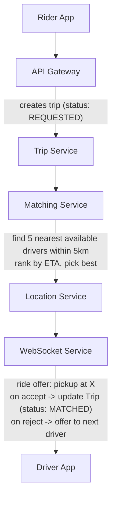
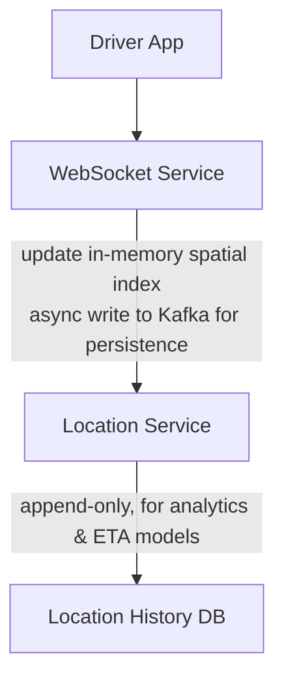
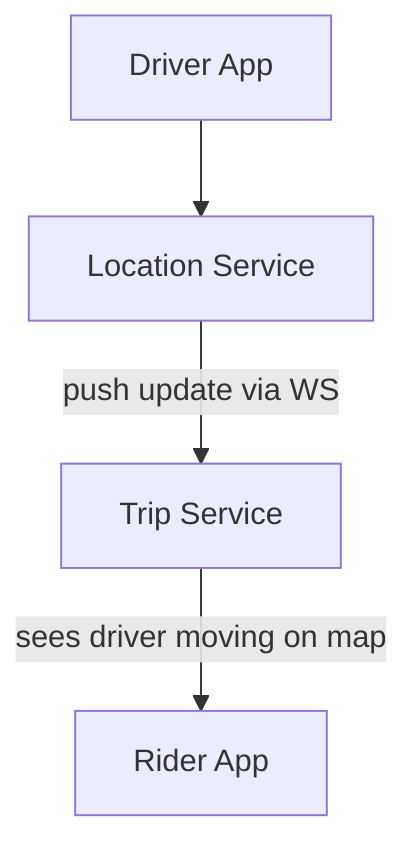

# Design Uber

*Worked Example -- 75 min*

---

## Phase 1: Clarify the Problem & Scope *(5--7 min)*

> **Say:** "Let me restate -- we're designing a ride-hailing platform like Uber. A rider requests a ride, the system matches them with a nearby driver, and we track the trip in real-time through pickup, ride, and drop-off. Let me ask a few scoping questions."

### Questions I'd Ask

- **What outcome are we optimizing for?** *-> Trip completion rate (rider requests a ride -> ride finishes successfully). Secondary: rider wait time, driver utilization, ETA accuracy. This tells us the system's job is MATCHING and RELIABILITY, not just speed. A fast match that leads to a cancelled trip is worse than a slower match that completes.*
- **Which side of the marketplace?** Both rider and driver, or just one? *-> Assume both.*
- **Ride types?** Just point-to-point, or also shared rides (UberPool), scheduled rides? *-> Start with point-to-point only. Mention pool as an extension.*
- **Geography?** Single city, single country, or global? *-> Design for multi-city, discuss global as evolution.*
- **Payment?** In scope or out of scope? *-> Out of scope for deep dive; acknowledge it exists.*
- **Scale?** Roughly how many concurrent riders/drivers? *-> ~100M riders, ~5M drivers globally, ~20M trips/day.*
- **Latency expectations?** How fast should matching happen? *-> Rider sees a driver within 5--10 seconds of requesting.*

### Agreed Scope (write on Excalidraw canvas)

| In Scope | Out of Scope |
|---|---|
| Rider requests a ride | Payment processing |
| Driver location tracking | Driver onboarding / identity verification |
| Matching rider -> driver | Shared rides (UberPool) |
| Real-time trip tracking | Scheduled rides |
| Pricing & surge | Ratings & reviews |
| ETA computation | Chat/calling between rider & driver |

### Core Use Cases (ranked by priority)

- **UC1:** Rider requests ride -> system matches to nearest available driver -> driver accepts
- **UC2:** Driver continuously reports location -> system tracks in real-time
- **UC3:** Both rider and driver see live trip progress (pickup -> in-ride -> drop-off)
- **UC4:** System computes fare estimate before ride and final fare after

### Non-Functional Requirements

- **Availability > Consistency** -- better to show a slightly stale driver location than to fail a ride request
- **Matching latency** -- <10 seconds from request to driver assignment
- **Location freshness** -- driver location updates every 3--5 seconds
- **Trip state must be durable** -- can't lose an in-progress trip (strongly consistent)
- **Surge pricing can be eventually consistent** -- a few seconds of staleness is fine

> **Tip:** Notice how I've already made tradeoff decisions: availability > consistency for location, but strong consistency for trip state. This sets up architectural decisions later.

---

## Phase 2: Back-of-the-Envelope Estimation *(3--5 min)*

> **Say:** "Let me run quick numbers to identify what drives our architecture."

| Metric | Value | Detail |
|---|---|---|
| **Trips / Day** | **20M** | ~230 trips/sec average, ~1K/sec peak |
| **Active Drivers** | **~2M concurrent** | 5M total, ~40% online at peak |
| **Location Updates** | **~500K/sec** | 2M drivers x 1 update every 4 sec |
| **Location Storage** | **~50 GB/day** | 500K/sec x 100 bytes x 86,400 sec |
| **Trip Records** | **~20 GB/day** | 20M trips x ~1KB each |
| **WebSocket Connections** | **~3M concurrent** | 2M drivers + ~1M active riders at peak |

> **Decision:** **Key insight:** The location update pipeline (500K writes/sec) is the hottest path in the system. This is what drives the architecture -- it needs a write-optimized, in-memory spatial index, not a traditional database on the write path.

> **Decision:** **Key insight:** 3M concurrent WebSocket connections means we need a horizontally scalable real-time layer. A single server can hold ~50K--100K connections, so we need 30--60 connection servers.

---

## Phase 3: High-Level Design *(8--12 min)*

> **Say:** "Let me sketch the major components and data flows. I'll walk through the ride request flow first, then the driver location tracking flow."

### Key Architecture Decisions

> **Say:** "Here's WHY I chose each technology -- mapping requirements to tradeoffs. Every choice has a rejected alternative and a consequence."

| Requirement | Decision | Why (and what was rejected) | Consistency |
|---|---|---|---|
| ACID for trip state (financial record) | PostgreSQL (sharded by city) | Trips involve payments + state machine transitions that must be atomic. DynamoDB lacks multi-row transactions. | CP |
| 125K location writes/sec, append-only | Cassandra (time-series) | Pure append, never updated. Linear write scaling. PostgreSQL would compete for IOPS with trips. | AP |
| Sub-ms spatial queries for matching | Redis Geospatial | GEORADIUS in <1ms, TTL auto-expires stale entries. PostGIS is 10-50ms -- too slow for real-time matching. | AP |
| Decouple billing, analytics, ML from hot path | Kafka event stream | Durable log with independent consumers. Direct service calls would create tight coupling + no replay. | -- |
| Handle 100K QPS surge without session affinity | Stateless services + API Gateway | Any pod handles any request. Stateful servers can't scale independently or fail over cleanly. | -- |
| Real-time push to rider/driver apps | WebSocket (not polling) | Server-initiated push for location + trip state updates. Polling at 4s intervals wastes bandwidth and adds latency. | -- |

### Major Components (what to draw on Excalidraw)

```mermaid
graph TD
    subgraph CLIENTS
        A["Rider App"]
        B["Driver App"]
    end

    subgraph EDGE / LOAD BALANCING
        C["API Gateway<br/>rate limit - auth - route"]
        D["WebSocket<br/>real-time push"]
    end

    subgraph APPLICATION SERVICES
        E["Trip Service<br/>state machine"]
        F["Matching<br/>spatial index"]
        G["Location<br/>geohash grid"]
        H["Pricing<br/>surge model"]
    end

    subgraph CACHING
        I["Redis<br/>sessions - geo - surge"]
    end

    subgraph MESSAGE QUEUE / ASYNC
        J["Kafka<br/>trip events - location stream"]
    end

    subgraph DATA STORES
        K["PostgreSQL<br/>trips - users - payments"]
        L["Cassandra<br/>location history"]
    end

    A --> C
    B --> C
    B --> D
    D -.->|push| A
    C --> E
    C --> H
    E --> F
    F --> G
    E --> J
    G --> I
    E --> K
    G --> L
    J -.-> K
    D -.->|location| B
end
```

#### Rider App [CLIENT]

- Request ride, see ETA, track trip
- WebSocket for real-time updates

#### Driver App [CLIENT]

- Send location, accept/reject rides
- WebSocket for dispatch & trip updates

#### API Gateway [EDGE]

- AuthN, rate limiting, routing
- REST for CRUD, WS upgrade for real-time

#### WebSocket Service [REAL-TIME]

- Holds 3M persistent connections
- Horizontally scaled (30--60 nodes)
- Pushes trip updates & dispatch offers

#### Location Service [HOT PATH]

- Ingests 500K loc updates/sec
- In-memory spatial index (geohash grid)
- "Find nearest drivers" queries

#### Matching / Dispatch Service [CORE]

- Queries Location Service for nearby drivers
- Ranks by ETA, rating, vehicle type
- Sends offer to best driver via WS

#### Trip Service [CORE]

- Trip state machine (requested -> matched -> pickup -> in_ride -> completed)
- Strongly consistent (PostgreSQL)

#### Pricing Service [CORE]

- Fare estimate before ride
- Surge multiplier computation
- Final fare calculation after ride

### Flow 1: Rider Requests a Ride



### Flow 2: Driver Location Tracking



### Flow 3: Live Trip Tracking



> **Say:** "That covers the three main flows. The hottest path is the location ingestion pipeline -- 500K writes/sec. The most critical path is the trip state machine -- we can't lose trip state. I'd like to deep-dive into the Location Service first since it's the most architecturally interesting. Sound good?"

---

## Phase 4: Deep Dives *(25--30 min)*

### Deep Dive 1: Location Service & Driver Matching (~10 min)

> **Goal:** **The core challenge:** Index 2M driver locations, handle 500K updates/sec, and answer "find nearest available drivers" queries in <50ms.

**Spatial Indexing Strategy -- Geohash Grid**

Divide the world into geohash cells (precision 6 = ~1.2km x 0.6km). Each cell maps to a set of driver IDs. When a rider requests a ride, compute their geohash and query that cell plus neighboring cells.

> **Decision:** **Why geohash over R-tree or quadtree?** Geohashes are strings, so they're trivially partitioned across a distributed in-memory store (Redis or custom). R-trees give better query precision but are harder to distribute. At our scale, the simplicity of geohash-based sharding wins. The tradeoff is edge-case inaccuracy at cell boundaries -- mitigated by always querying neighboring cells.

**In-Memory Architecture**

| Component | Tech | Rationale |
|---|---|---|
| Spatial Index | Redis Cluster (sorted sets per geohash) | In-memory, O(log N) updates, 500K writes/sec is feasible across a cluster |
| Driver State | Redis hash per driver | Status (available/busy/offline), current geohash, vehicle type |
| Persistence | Kafka -> Cassandra | Location history for ETA models and analytics. Async -- not on hot path |

```sql
-- Redis: Spatial Index --
SORTED SET  key: geohash:{cell_id}
              member: driver_id
              score: timestamp (for TTL-based eviction of stale drivers)

-- Redis: Driver State --
HASH  key: driver:{driver_id}
       status: available | on_trip | offline
       geohash: string
       lat/lng: float
       vehicle_type: economy | premium | xl
       last_updated: timestamp
```

**Matching Algorithm**

- **Step 1:** Compute rider's geohash -> query that cell + 8 neighbors -> get candidate driver IDs
- **Step 2:** Filter by status=available, vehicle_type match
- **Step 3:** Compute ETA for top candidates (call Maps/routing service)
- **Step 4:** Rank by ETA (primary), driver rating (secondary)
- **Step 5:** Send ride offer to top-ranked driver via WebSocket
- **Step 6:** If rejected or timeout (10s) -> offer to next driver. Max 3 attempts before expanding search radius.

> **Decision:** **Why not broadcast to all nearby drivers?** Broadcasting creates a thundering herd -- multiple drivers accept the same ride, then we cancel all but one, causing bad driver experience. Serial dispatch with timeout is simpler and more predictable. Tradeoff: slightly higher matching latency (potentially 10--30s if first drivers reject), but much better UX for drivers.

> **Tip:** Hot spot mitigation: In dense areas (airports, stadiums) a single geohash cell could have thousands of drivers. We can use finer-grained geohashes (precision 7 or 8) in high-density areas, or use a two-level index: coarse for initial lookup, fine for ranking.

### Deep Dive 2: Trip Service & State Machine (~8 min)

> **Goal:** **The core challenge:** Trip state must never be lost. Transitions must be atomic. Both rider and driver must see the same state.

**State Machine**


> **Decision:** **Storage: PostgreSQL** -- Trip state is our most critical data. It involves multi-field updates (status, driver_id, fare, timestamps) and we need ACID transactions. The write volume (~230 trips/sec average, ~1K peak) is well within Postgres capacity. We'd shard by city or region if we outgrow a single instance. Tradeoff vs. DynamoDB: we lose auto-scaling but gain transactional guarantees and query flexibility for operational dashboards.

```sql
trips
  id              UUID PK
  rider_id        UUID FK -> users
  driver_id       UUID FK -> users (nullable until matched)
  status          ENUM (requested, matched, arrived, in_progress, completed, cancelled)
  pickup_lat/lng  FLOAT
  dropoff_lat/lng FLOAT
  fare_estimate   DECIMAL
  fare_final      DECIMAL (null until completed)
  surge_mult      DECIMAL
  requested_at    TIMESTAMP
  matched_at      TIMESTAMP
  started_at      TIMESTAMP
  completed_at    TIMESTAMP
  city_id         INT (partition key for sharding)

-- Indexes: (rider_id, status), (driver_id, status), (city_id, requested_at)
```

**Event Publishing**

On every state transition, Trip Service publishes an event to Kafka: `trip.status_changed {trip_id, old_status, new_status, timestamp}`. Consumers include: WebSocket Service (push to rider/driver apps), Pricing Service (trigger fare calculation on COMPLETED), Analytics pipeline.

> **Decision:** **Why event-driven for updates instead of polling?** With 20M trips/day, polling from multiple consumers would create massive DB load. Publishing events on state transitions decouples consumers, allows fan-out, and keeps the Trip DB write-path clean. Tradeoff: we accept eventual consistency for the push updates (ms-level delay), but the source of truth (Postgres) is always strongly consistent.

### Deep Dive 3: Pricing & Surge (~7 min)

> **Goal:** **The core challenge:** Compute accurate fare estimates in <100ms. Dynamically adjust prices (surge) based on supply/demand without being stale or oscillating wildly.

**Fare Calculation**

```sql
-- Fare Formula --
fare = base_fare
     + (per_mile_rate x distance)
     + (per_minute_rate x duration)
     + booking_fee
     x surge_multiplier

-- Where --
distance, duration = from routing/maps service (precomputed ETA)
surge_multiplier   = from Surge Service (per geohash cell)
```

**Surge Pricing Design**

- **Input signals:** Demand (ride requests per cell per minute) and supply (available drivers per cell)
- **Computation:** A background job runs every 30--60 seconds per city. For each geohash cell, compute demand/supply ratio -> map to surge multiplier via a configurable curve.
- **Storage:** Redis hash -- `surge:{city}:{geohash} -> multiplier`. TTL of 2 minutes (auto-expire if job fails).
- **Smoothing:** Apply exponential moving average to prevent wild oscillation. Multiplier changes are capped at +/-0.5x per cycle.

> **Decision:** **Why precomputed + cached, not real-time per-request?** Computing supply/demand per request would require querying the Location Service for every fare estimate -- that's 1K QPS hitting the spatial index just for pricing. Precomputing every 30--60s and caching in Redis keeps the pricing path fast (<5ms lookup) and decouples it from the location hot path. Tradeoff: surge can be up to 60s stale, which is acceptable -- riders see the multiplier before confirming.

> **Tip:** **Fairness guard:** The fare shown at request time is what the rider pays. If surge drops during the ride, they pay the lower of estimate and actual. This is a product decision but it has architectural implications -- we need to store the surge_multiplier at request time on the trip record.

### Deep Dive 4: Data Model & Storage Summary (~5 min)

| Data | Store | Access Pattern | Consistency |
|---|---|---|---|
| Driver Location (live) | Redis Cluster | 500K writes/sec, spatial queries | Eventual (best-effort) |
| Driver Location (history) | Cassandra | Append-only, time-range queries for ETA/analytics | Eventual |
| Trip State | PostgreSQL | CRUD by trip_id, query by rider/driver + status | Strong (ACID) |
| User Profiles | PostgreSQL | Read by user_id, low write frequency | Strong |
| Surge Multipliers | Redis | Read by geohash, written every 30--60s | Eventual (TTL 2m) |
| Event Stream | Kafka | Pub/sub for trip events, location events | Ordered per partition |

> **Decision:** **Why not one database for everything?** Because the access patterns are radically different. Location needs in-memory spatial indexing at 500K/sec -- no traditional DB handles that. Trips need ACID -- Redis doesn't provide that. History is append-only at massive volume -- Cassandra's sweet spot. Each store is matched to its access pattern.

---

## API Design

### REST Endpoints

```http
POST /v1/rides/estimate
```

Get fare estimate + ETA before requesting

Request: `{pickup: {lat, lng}, dropoff: {lat, lng}, vehicle_type}`
Response: `{fare_estimate, surge_multiplier, eta_minutes, ride_token}`

```http
POST /v1/rides
```

Request a ride (rider)

Request: `{ride_token, pickup, dropoff, vehicle_type, payment_method_id}`
Response: `{trip_id, status: "REQUESTED"}` -- subsequent updates come via WebSocket

```http
PUT /v1/rides/{trip_id}/accept
```

Driver accepts ride offer

Response: `{trip_id, rider_info, pickup, dropoff}`

```http
PUT /v1/rides/{trip_id}/status
```

Transition trip state

Request: `{status: "ARRIVED" | "IN_PROGRESS" | "COMPLETED" | "CANCELLED"}`

```http
GET /v1/rides/{trip_id}
```

Get trip details

### WebSocket Channels

```http
WS /v1/ws/driver
```

Driver: send location, receive dispatch offers

Inbound: `{type: "location", lat, lng, timestamp}` (every 4s)
Outbound: `{type: "ride_offer", trip_id, pickup, rider_name, fare_estimate}`
Outbound: `{type: "trip_update", trip_id, status, ...}`

```http
WS /v1/ws/rider
```

Rider: receive trip updates & driver location

Outbound: `{type: "trip_update", trip_id, status, driver_location, eta}`
Outbound: `{type: "driver_location", lat, lng}` (every 4s during active trip)

---

## Phase 5: Cross-Cutting Concerns *(10--12 min)*

### Storage Architecture Summary

> **Goal:** **What goes where and why.** Each data store is chosen for its access pattern -- not by default. The question isn't "which database?" but "what are the read/write patterns, consistency requirements, and scale characteristics?"

| Data | Store | Why This Store |
|---|---|---|
| Trip state & history | PostgreSQL | ACID for state machine transitions. Sharded by city_id. Trips are financial records -- strong consistency required. |
| Driver locations (live) | Redis (Geospatial) | GEOADD/GEORADIUS for spatial queries. TTL=30s auto-expires stale locations. ~500K active drivers in memory. |
| Location history | Cassandra | Append-only time-series writes. Partitioned by driver_id + date. High write throughput, no updates needed. |
| Surge pricing zones | Redis | Precomputed per geohash cell. Updated every 30s by pricing service. Read-heavy, low latency required. |
| User profiles & payments | PostgreSQL | Relational data with foreign keys. PCI-compliant vault for payment tokens. Read-heavy, strong consistency. |
| Trip events stream | Kafka | Durable event log. trip.requested, trip.matched, trip.completed. Consumed by analytics, billing, ETA models. |

### Failure Scenarios & Mitigation

| Scenario | Mitigation |
|---|---|
| Location Service node dies | Redis Cluster auto-failover to replica. Drivers re-register location on reconnect. A few seconds of stale data -- acceptable per our consistency model. |
| WebSocket server crashes | Clients reconnect to a different node (sticky sessions via driver/rider ID). Trip state is in Postgres, so no data lost -- just a brief reconnection delay. |
| Driver accepts but goes offline | Trip Service has a heartbeat timeout. If no location update from driver for 30s after MATCHED, auto-reassign to next driver. Rider gets notified. |
| Matching Service can't find drivers | Expand search radius in concentric rings (5km -> 10km -> 15km). After 3 expansions, return NO_DRIVERS status. Trigger surge pricing increase for that area. |
| Kafka consumer lag | Location history writes fall behind but the real-time spatial index (Redis) is unaffected. Trip events: if WebSocket push is delayed, rider/driver can poll GET /rides/{id} as fallback. |
| PostgreSQL (Trip DB) down | This is our most critical failure. Primary-replica setup with automatic failover. If both are down, no new trips can be created -- we show "service temporarily unavailable." In-progress trips continue (driver has cached trip info) but state transitions queue until recovery. |

### Scalability Bottlenecks

| At Scale | What Breaks | Mitigation |
|---|---|---|
| 10x (200M trips/day) | Single-city Postgres shard gets hot. Redis spatial index memory pressure. | Shard Trip DB by city_id. Partition Redis by geo-region. |
| 100x (2B trips/day) | Matching Service becomes bottleneck -- ETA computation is expensive. WebSocket tier needs 300-600 nodes. | Pre-compute ETAs in a spatial grid. Move to gRPC between internal services. Regional deployments. |

### Observability

- **Golden signals per service:** Request rate, error rate (4xx/5xx), p50/p99 latency, saturation (CPU, memory, connections)
- **Business metrics:** Match rate (% of requests that get a driver), time-to-match, surge coverage, cancellation rate
- **Distributed tracing:** Trace from ride request -> matching -> dispatch -> acceptance. Critical for debugging "why did matching take 30 seconds?"
- **Alerting:** Match rate drops below 80%, time-to-match p99 > 30s, Trip DB replication lag > 5s, WebSocket reconnection spike

### Security Highlights

- **AuthN:** JWT tokens per session, short-lived (15 min) with refresh tokens. Separate tokens for rider and driver roles.
- **Location privacy:** Rider's exact location is only shared with matched driver. Never expose driver home address.
- **Rate limiting:** Ride requests capped per user (prevent abuse). Location updates capped per driver (prevent spoofing).
- **Fare tampering:** Surge multiplier is server-side only. `ride_token` is signed -- client can't modify fare estimate.

---

## Phase 6: Wrap-Up & Evolution *(3--5 min)*

> **Say:** "To summarize: the system is organized around three main concerns -- a write-heavy, in-memory location tracking pipeline using Redis with geohash-based spatial indexing; a strongly consistent trip state machine on PostgreSQL with event-driven updates via Kafka; and a decoupled pricing service with precomputed surge multipliers. The key tradeoff throughout is eventual consistency for location and surge data in exchange for low-latency reads, with strong consistency reserved for trip state where correctness matters most."

### What I'd Build Next

| Extension | Why It Matters | Architecture Impact |
|---|---|---|
| Shared Rides (Pool) | Higher utilization, lower fares | Matching becomes a combinatorial optimization problem. Needs a batch matching window instead of serial dispatch. |
| Scheduled Rides | Airport pickups, commute planning | New "scheduled" state in trip machine. Background scheduler that triggers matching N minutes before pickup. |
| Multi-Region | Latency for global users | Regional deployments with independent Location + Trip services per region. Cross-region user profile replication. |
| ML-based ETA | More accurate estimates | Train on Cassandra location history. Serve from a feature store. Replace simple routing API call. |
| Fraud Detection | Fake GPS, driver collusion | Stream processing on location events. Anomaly detection on speed/teleportation. Async -- doesn't block hot path. |

> **Tip:** **Closing framing:** This design optimizes for the two things that matter most for a ride-hailing platform -- fast matching (location + dispatch) and reliable trip state (never lose a ride). Everything else is built around supporting those two pillars.

---

## Phase 7: Interview Q&A *(Practice)*

> **Say:** "Here are the hardest questions an interviewer would ask about this design, and how to answer them. Each answer demonstrates deep understanding of the tradeoffs, not just surface knowledge."

**Q:** How would you handle a sudden 5x spike in ride requests during a concert ending?

**A:** This is exactly what surge pricing is designed for -- it's not just revenue, it's a load-shedding mechanism. The pricing service detects demand/supply imbalance per geohash cell and raises the multiplier, which does two things: (1) reduces demand by discouraging price-sensitive riders, and (2) increases supply by incentivizing drivers to move toward the surge zone. On the infrastructure side, the matching service is already sharded by city, so a local spike doesn't affect other cities. The WebSocket service scales horizontally -- each instance handles a partition of connected drivers. The real bottleneck would be the matching algorithm itself: with 5x requests but not 5x drivers, we'd want to increase the search radius gradually and batch match requests to avoid the thundering herd problem.

**Q:** Why Cassandra for location history instead of just using PostgreSQL?

**A:** Location history is a pure append workload -- we never update a past location, only write new ones. At 500K active drivers updating every 4 seconds, that's ~125K writes/sec sustained. PostgreSQL could handle this with partitioning, but Cassandra gives us: (1) linear write scalability -- just add nodes, (2) no single point of failure -- any node can accept writes, (3) natural time-series partitioning with driver_id + date as partition key, and (4) automatic TTL-based expiration for old data. The tradeoff is we can't do complex joins -- but we never need to. Location history queries are always "give me driver X's positions between time A and B," which is a single partition scan in Cassandra. PostgreSQL is the right choice for trips because trips have relational integrity requirements (rider, driver, payment, route all linked), but location is just a high-velocity stream.

**Q:** What happens if the Matching Service goes down mid-request?

**A:** The Trip Service is the source of truth, not the Matching Service. When a rider requests a ride, the Trip Service creates a trip record in state REQUESTED with a TTL. The Matching Service is called asynchronously -- if it fails, the trip stays in REQUESTED state. We have two safety nets: (1) a retry loop in the Trip Service that re-calls Matching every 5 seconds while the trip is in REQUESTED state, and (2) a timeout -- if no match after 60 seconds, the trip transitions to NO_DRIVERS and the rider is notified. Because matching is idempotent (it reads driver locations and returns the best match), retries are safe. If the entire Matching Service fleet is down, riders see "no drivers available" -- degraded but not broken. The worst failure mode would be matching succeeding but the response being lost -- which is why the Trip Service does the state transition, not the Matching Service.

**Q:** How do you ensure a driver doesn't get assigned to two rides simultaneously?

**A:** This is a distributed locking problem. When the Matching Service selects a driver, it must atomically mark that driver as "unavailable" before returning. We use Redis with a SET NX (set-if-not-exists) lock: `SET driver:{id}:trip trip_123 NX EX 30`. If the SET succeeds, the driver is ours. If it fails, someone else claimed them -- pick the next candidate. The 30-second TTL is a safety net if the Trip Service crashes after locking but before completing the match. The Matching Service returns a ranked list of candidates and tries them in order until one lock succeeds. This means we never double-assign, but we might occasionally skip an optimal match if there's contention -- which is fine, the second-best driver 200m away is nearly as good as the best driver 150m away.

**Q:** Why not use a single database for everything?

**A:** Because the access patterns are fundamentally different and a single database would force you to compromise on all of them. Trips need ACID transactions (state machine transitions must be atomic). Locations need 125K writes/sec with geographic queries. Surge zones need sub-millisecond reads. User sessions need TTL-based expiration. A single PostgreSQL instance could technically store all of this, but: (1) the location write volume would compete with trip transaction throughput, (2) geographic queries on Postgres require PostGIS extensions that don't scale horizontally as cleanly as Redis GEORADIUS, and (3) you'd need to over-provision for the union of all workload peaks. Polyglot persistence lets each store be optimized for its access pattern and scaled independently. The cost is operational complexity -- more systems to monitor and maintain -- which is why we only split when the access pattern genuinely demands it.
