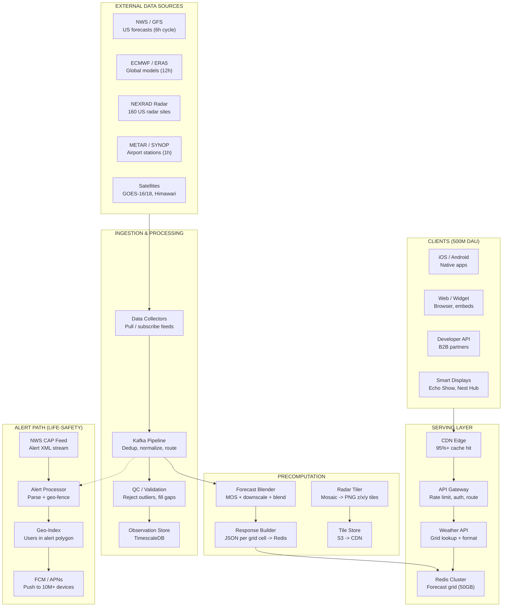
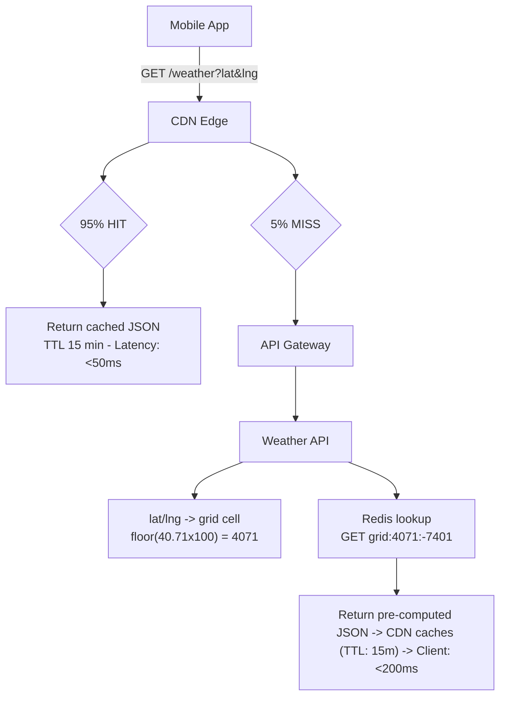
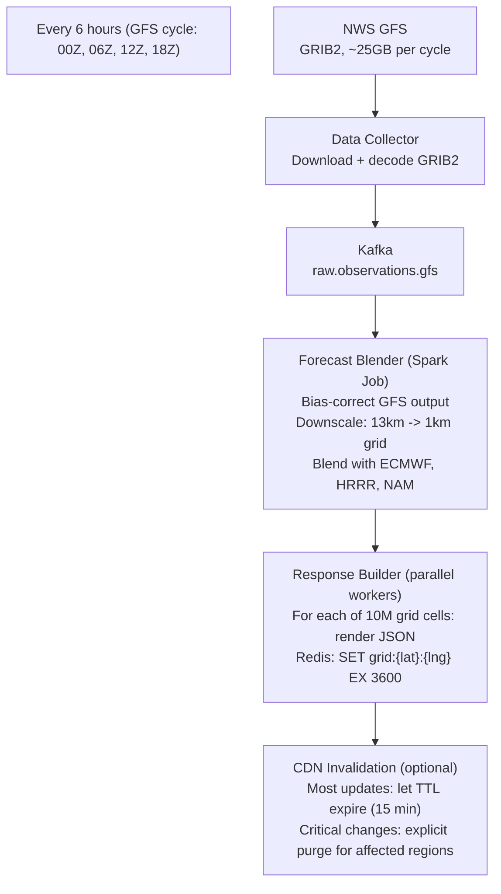
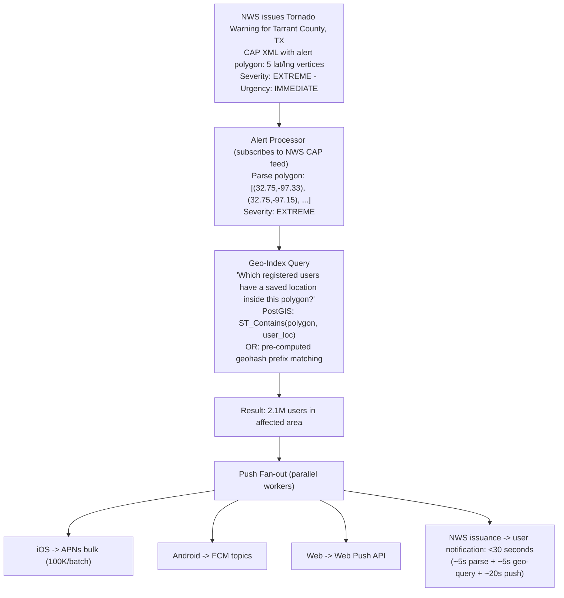

# Design a Weather App

*Worked Example -- 75 min*

---

## Phase 1: Clarify the Problem & Scope *(5--7 min)*

> **Say:** "We're designing a weather application like The Weather Channel, Dark Sky, or Apple Weather. There are three distinct subsystems: (1) a data ingestion pipeline that collects observations from stations, satellites, and radar, (2) a forecast computation layer that turns raw observations into predictions, and (3) a serving layer that delivers weather data to hundreds of millions of users with extreme read-heaviness and high cacheability."

### Questions I'd Ask

- **What data are we serving?** Current conditions, hourly forecast, 10-day forecast, radar maps, air quality? *-- All of these. Current conditions + hourly + daily forecasts are the core. Radar tiles and AQI are secondary.*
- **Do we run our own forecast models (NWP)?** Or consume forecasts from government agencies (NWS, ECMWF)? *-- We consume raw observations + model output from external sources (like NWS GFS/HRRR, ECMWF). We run a post-processing layer (bias correction, downscaling, blending) but not the physics simulation itself.*
- **Granularity?** City-level, zipcode-level, or point-level (lat/lng)? *-- Point-level at ~1km grid resolution. User sends lat/lng, we return the nearest grid point's data. This gives millions of unique "locations."*
- **Severe weather alerts?** *-- Yes -- push notifications for tornadoes, flash floods, hurricane warnings. These are life-safety critical and must be delivered within seconds.*
- **Scale?** *-- ~500M daily active users globally. Extreme read-heaviness. Weather data is highly cacheable -- it changes every 15-60 minutes, not every second.*
- **Monetization?** *-- Free tier with ads, premium tier with minute-level precipitation (hyper-local nowcasting), extended forecasts, no ads.*

### Agreed Scope

| In Scope | Out of Scope |
|----------|-------------|
| Current conditions (temp, humidity, wind, UV) | Running NWP physics models (GFS, ECMWF) |
| Hourly forecast (48h) + daily forecast (14d) | Historical weather data warehouse |
| Radar / precipitation map tiles | Agricultural / aviation-specific products |
| Severe weather alerts (push notifications) | IoT device ingestion (personal weather stations) |
| Location search (city, zipcode, lat/lng) | Social features (user-reported conditions) |
| Air quality index (AQI) | Climate modeling / long-range seasonal forecasts |

### Core Use Cases

- **UC1: "What's the weather right now?"** -- User opens app -> current conditions for their location in <200ms. Temp, feels-like, humidity, wind, UV index, condition icon.
- **UC2: "Will it rain this afternoon?"** -- Hourly forecast for next 48 hours. Precipitation probability per hour. Minute-level rain forecast for next 2 hours (premium).
- **UC3: "10-day outlook"** -- Daily high/low, condition summary, precipitation chance. Updated every 6 hours.
- **UC4: "Show me the radar"** -- Animated radar map tiles. Past 2 hours + 1 hour forecast. Pan/zoom map interaction.
- **UC5: "Tornado warning!"** -- Severe weather alert pushed to all affected users within 60 seconds of NWS issuance. Life-safety: zero message loss.

### Non-Functional Requirements

- **Extreme read-heaviness (100,000:1 read:write):** Weather data is produced by a handful of ingestion pipelines (writes) and consumed by 500M users (reads). This is the most read-heavy system you'll ever design. Caching is not an optimization -- it's the architecture.
- **High cacheability:** Current conditions update every 15 minutes. Hourly forecasts update every 1-6 hours. 10-day forecasts update every 6 hours. A response cached for 10 minutes is still fresh for 99.9% of requests.
- **API response <200ms p95:** Users expect instant weather. CDN cache hit should be <50ms. Cache miss (origin fetch) should be <200ms.
- **Alert delivery <60 seconds:** From NWS issuing a tornado warning to user seeing the push notification. This is the only latency-critical write path.
- **Availability > consistency:** Showing 15-minute-stale weather data is fine. Showing nothing (503 error) during a hurricane -- when people need weather most -- is catastrophic.
- **Global reach:** Users everywhere. CDN-first architecture. Data sources are mostly US/EU-centric (NWS, ECMWF), but serving is global.

> **Tip:** The key architectural insight: weather data is one of the most cacheable datasets on the internet. The same forecast serves every user in a ~1km grid cell. A city like NYC has ~800 grid cells, each updating every 15-60 minutes. That's a total of ~800 unique responses to cache -- and they serve millions of users. The entire architecture is a caching strategy with a data pipeline behind it.

---

## Phase 2: Back-of-the-Envelope Estimation *(3--5 min)*

> **Say:** "Let me separate the ingestion pipeline (low-volume, high-value data) from the serving layer (high-volume, highly cacheable)."

| Metric | Value | Detail |
|--------|-------|--------|
| Daily Active Users | ~500M | Global. ~3 app opens/day avg. Morning check, midday, evening. |
| API Requests / Day | ~5B | 500M x 3 opens x 3-4 API calls per open (current, hourly, daily, radar) |
| Peak QPS | ~200K | 5B / 86400 ~ 58K avg. Peak = 3-4x avg. Morning rush x severe weather. |
| Unique Grid Points | ~10M | Land surface at 1km resolution. ~150M total earth surface, but only populated land matters. |
| CDN Cache Hit Rate | >95% | 10M grid points x 15min TTL. Popular cities: 99%+ hit rate. Rural: lower but still high. |
| Forecast Data Size | ~5 KB / location | Current + 48h hourly + 14d daily ~ 5KB JSON. 10M locations = 50GB total. |

> **Decision:** **Key insight #1:** With a 95%+ CDN cache hit rate, only ~5% of 200K peak QPS actually hits origin servers: ~10K QPS to origin. That's a modest backend. The architecture IS the CDN -- origin servers are just the cache-miss path.

> **Decision:** **Key insight #2:** The entire forecast dataset (10M locations x 5KB) is ~50GB. This fits in memory. A single Redis cluster could hold every forecast for every location on earth. The "database" is essentially a pre-computed, in-memory grid that gets refreshed every 15-60 minutes by the ingestion pipeline.

> **Decision:** **Key insight #3:** Severe weather spikes correlate with the highest user demand. A hurricane approaching makes millions of users check weather simultaneously -- exactly when availability matters most. CDN absorbs the read spike. But the alert push path must scale independently (not compete with read traffic for resources).

---

## Phase 3: High-Level Design *(8--12 min)*

> **Say:** "The architecture has three planes: an ingestion pipeline (collect + process weather data), a precomputation layer (turn raw data into API-ready responses), and a serving layer (CDN + origin that delivers to users). Plus a separate alert path for severe weather push notifications."

### Key Architecture Decisions

> **Say:** "Here's WHY I chose each technology -- mapping requirements to tradeoffs."

| Requirement | Decision | Why (and what was rejected) | Consistency |
|-------------|----------|---------------------------|-------------|
| 200K QPS peak, 95%+ identical responses | CDN-first (CloudFront/Fastly) | Weather responses are identical for every user in the same grid cell. CDN serves from edge, <50ms. Without CDN, origin would need 200K QPS capacity -- 20x overprovisioned for normal traffic. | AP |
| Forecast data fits in memory (~50GB) | Redis cluster for origin data | Entire forecast grid in-memory. O(1) lookup by grid cell ID. PostgreSQL would add 5-10ms disk I/O on cache miss -- unnecessary when data fits in RAM. | AP |
| Ingest data from 10+ external sources | Kafka pipeline (not direct polling) | Each source has different format, frequency, reliability. Kafka decouples ingestion from processing. If ECMWF is late, NWS data still flows. Direct polling creates tight coupling. | -- |
| Pre-render 10M location responses every 15min | Batch precomputation (Spark/Flink) | Compute all forecasts in bulk, write to Redis. On-demand computation at 200K QPS would overload the forecast models. Precompute = O(1) serving latency regardless of query complexity. | -- |
| Tornado alert to 10M users in <60s | Geo-targeted push via FCM/APNs | Push, not pull. Users can't poll for alerts -- they need immediate notification. Geo-fenced: only affected users. Fan-out via mobile push platforms (FCM handles delivery at scale). | CP |
| Radar tiles: interactive map with pan/zoom | Pre-rendered tile pyramid (z/x/y) | Standard slippy map tiles at zoom levels 2-12. Pre-rendered PNGs stored in S3, served via CDN. Dynamic rendering on each request would be 100x more expensive. | AP |

### Major Components



#### Data Collectors [INGEST]
- Poll NWS/ECMWF APIs on schedule (GRIB2, BUFR)
- Subscribe to METAR/SYNOP feeds (decoded text)
- Download NEXRAD Level-II radar data (binary)
- Normalize all sources to internal schema

#### Forecast Blender [COMPUTE]
- Model Output Statistics (MOS): bias-correct NWP output
- Downscale: 13km GFS grid -> 1km local grid
- Blend: weighted average of GFS, ECMWF, HRRR, NAM
- Output: best-estimate forecast per grid cell

#### Response Builder [PRECOMPUTE]
- Renders API-ready JSON per grid cell (current + forecast)
- Writes to Redis with grid_cell_id as key
- Runs every 15 min for current, every 6h for extended
- ~10M writes per cycle (parallelized across workers)

#### CDN + Weather API [SERVE]
- CDN edge caches responses by grid cell ID (15min TTL)
- Cache miss -> API server -> Redis lookup -> respond
- Lat/lng -> grid cell mapping: floor(lat x 100), floor(lng x 100)
- Cache key: /weather/{grid_id}?units=metric

#### Radar Tiler [PRECOMPUTE]
- Mosaics 160 NEXRAD sites into single composite
- Renders PNG tiles at zoom levels 2-12 (slippy map)
- Stores to S3 -> CDN. ~500K tiles per radar frame
- New frame every 5 minutes, ~12 frames for animation

#### Alert Processor [ALERTS]
- Subscribes to NWS CAP (Common Alerting Protocol) feed
- Parses alert polygon (lat/lng vertices)
- Queries geo-index: "which users are inside this polygon?"
- Fans out push notifications via FCM/APNs

### Flow 1: User Opens App -- Read Path



### Flow 2: Forecast Update Cycle -- Write Path



---

## Phase 4: Deep Dives *(25--30 min)*

### Deep Dive 1: Data Ingestion & Forecast Pipeline (~10 min)

> **Goal:** **The weather data supply chain.** Multiple external sources with different formats, frequencies, and reliability levels feed into a single unified pipeline that produces a "best estimate" forecast per grid cell.

| Source | Format | Update Frequency | Coverage | Resolution |
|--------|--------|-----------------|----------|------------|
| GFS (NWS) | GRIB2 | Every 6 hours | Global | ~13km (0.25 deg) |
| HRRR (NWS) | GRIB2 | Every hour | CONUS only | ~3km |
| ECMWF IFS | GRIB2 | Every 12 hours | Global | ~9km |
| METAR | Text (decoded) | Every hour | Airports worldwide | Point observations |
| NEXRAD Radar | Binary Level-II | Every 5 minutes | 160 US sites | ~250m |
| GOES-16/18 | NetCDF | Every 5-15 minutes | Western Hemisphere | ~2km |

> **Decision:** **Why blend multiple models instead of using just one?** No single model is best everywhere. GFS has global coverage but only 13km resolution -- it misses local effects (sea breezes, mountain valleys). HRRR is 3km but only covers the US and only forecasts 18 hours ahead. ECMWF is often the most accurate globally but updates only every 12 hours. Blending: use HRRR for 0-18h over the US (highest resolution), GFS/ECMWF for 18h-14 days (longer range), and bias-correct all of them against actual station observations. The weights adapt: if ECMWF has been more accurate than GFS in a region recently, it gets higher weight. This is called Model Output Statistics (MOS) and is the core of the forecast quality differentiation.

> **Decision:** **Why precompute forecasts instead of computing on-demand?** The forecast blending computation (interpolation, bias correction, downscaling) is CPU-intensive -- ~10ms per grid cell. At 200K QPS with 10% cache miss rate, that's 20K computations/sec. Precomputing all 10M grid cells every 15 minutes costs ~100K compute-seconds (parallelized to minutes). The result is O(1) serving: a single Redis GET per request. The tradeoff: 15-minute staleness. But weather changes slowly enough that this is imperceptible to users.

### Deep Dive 2: API Serving & Caching Strategy (~8 min)

> **Goal:** **The serving layer is a three-tier cache.** CDN edge (95%+ of requests), Redis cluster (cache miss + precomputed data), and the forecast pipeline (generates new data). The goal: most requests never reach your origin servers.

| Tier | Cache TTL | Hit Rate | Latency | What It Serves |
|------|-----------|----------|---------|----------------|
| CDN Edge | 15 min (current), 1h (forecast), 5min (radar) | 95%+ | <50ms | All users in the same grid cell get the same cached response. |
| Redis Cluster | Until next precompute cycle | 99.9% | <5ms | Pre-computed JSON per grid cell. Full forecast grid in memory. |
| Forecast Pipeline | N/A (writes to Redis) | N/A | Minutes | Batch computes all grid cells. Not on the serving path. |

> **Tip:** **Cache key design is critical.** The cache key must be deterministic from the request. A lat/lng like 40.7128, -74.0060 maps to grid cell `grid:4071:-7401` (floor at 0.01 deg resolution ~ 1km). Every user at Times Square hits the exact same cache key. This is why weather is so cacheable: the data is inherently spatial, and users cluster in the same cells. NYC has ~800 grid cells. Even if each is cached separately, that's 800 entries serving millions of users. Cache key: `/v1/weather/{grid_id}?units={metric|imperial}&lang={en}`. Units and language are part of the key because they change the response body.

> **Decision:** **Why not compute on demand and cache the result?** This is the "cache-aside" pattern -- compute on first request, cache for subsequent ones. The problem: weather events cause correlated cache misses. When a hurricane approaches, millions of users check weather simultaneously for the same region. If the CDN TTL just expired, all those requests hit origin at once (thundering herd). Precomputation avoids this entirely: the data is already in Redis before anyone asks for it. The CDN TTL expiring just means the next request fetches from Redis (sub-5ms), not from a computation pipeline.

### Deep Dive 3: Severe Weather Alerts (~7 min)

> **Goal:** **Alerts are the one latency-critical path.** A tornado warning must reach affected users in under 60 seconds. This is a completely separate system from the read-heavy forecast serving path -- it's a geo-targeted push fan-out.



> **Decision:** **Why geo-index users ahead of time instead of computing at alert time?** Computing "which of 500M users are inside this polygon?" at alert time is too slow. Instead, users register their locations at app install and when they add saved cities. These locations are indexed by geohash in PostgreSQL (PostGIS) or a dedicated geo-index (Redis Geospatial). At alert time, the query is: "which geohash prefixes overlap this polygon?" -- a fast index scan, not a full table scan. The tradeoff: users who travel (their current location differs from saved location) might miss a hyper-local alert. Mitigation: also use the user's last-known GPS location (updated when the app is open).

> **Decision:** **Why push instead of pull for alerts?** Users don't constantly poll for alerts. The app might be backgrounded. A tornado gives 10-15 minutes of warning -- the user can't be expected to open the app at just the right time. Push notifications wake the device and display immediately. FCM/APNs handle the delivery complexity (device offline? queued. Battery saver? high priority bypasses Doze). The alert path is completely independent from the forecast serving path -- it has its own infrastructure, scaling, and SLOs.

### Deep Dive 4: Data Model & Storage (~5 min)

```sql
grid_forecasts -- Redis: pre-computed JSON per grid cell
  key     "grid:{lat100}:{lng100}"   -- e.g., "grid:4071:-7401"
  value   JSON
  {
    "location": {"lat": 40.71, "lng": -74.01, "name": "New York, NY"},
    "current": {
      "temp_c": 22, "feels_like_c": 24,
      "humidity": 65, "wind_kph": 18, "wind_dir": "SW",
      "condition": "Partly Cloudy", "icon": "partly-cloudy-day",
      "uv_index": 6, "visibility_km": 16,
      "observed_at": "2026-02-15T14:00:00Z"
    },
    "hourly": [  -- 48 entries
      {"time": "2026-02-15T15:00:00Z", "temp_c": 23, "precip_pct": 10, "condition": "Partly Cloudy"},
      ...
    ],
    "daily": [  -- 14 entries
      {"date": "2026-02-15", "high_c": 24, "low_c": 14, "precip_pct": 20, "condition": "Scattered Showers"},
      ...
    ],
    "alerts": [],  -- active NWS alerts for this grid cell
    "aqi": {"value": 42, "category": "Good"},
    "astronomy": {"sunrise": "06:48", "sunset": "17:32"},
    "updated_at": "2026-02-15T14:05:00Z"
  }

users -- PostgreSQL: registered users with saved locations
  id              UUID
  device_tokens   JSONB         -- {apns: "...", fcm: "..."}
  saved_locations JSONB[]       -- [{lat, lng, name, geohash}]
  last_known_loc  GEOGRAPHY     -- PostGIS point (last app open)
  preferences     JSONB         -- {units: "metric", alerts: true}
  tier            TEXT          -- "free" | "premium"
  created_at      TIMESTAMPTZ

observations -- TimescaleDB: raw station observations (time-series)
  time            TIMESTAMPTZ
  station_id      TEXT          -- "KJFK", "KLAX"
  temp_c          FLOAT
  humidity_pct    FLOAT
  wind_kph        FLOAT
  pressure_hpa    FLOAT
  condition_code  INT
```

### API Design

```http
GET /v1/weather?lat=40.71&lng=-74.01&units=metric
  Full weather for location
  Returns: current + hourly (48h) + daily (14d) + alerts + AQI. Cache: CDN 15 min. Lat/lng snapped to nearest grid cell (1km).

GET /v1/weather/current?lat=...&lng=...
  Current conditions only
  Lightweight: temp, humidity, wind, condition. ~500 bytes. Cache: CDN 10 min.

GET /v1/radar/{z}/{x}/{y}.png?timestamp=...
  Radar map tile
  Standard slippy map tile. Pre-rendered PNG, 256x256px. S3 -> CDN. Cache: 5 min (refreshes with new radar scan).

GET /v1/alerts?lat=...&lng=...
  Active alerts for location
  Returns NWS alerts affecting this grid cell. Low TTL (2 min) for freshness. Alerts also embedded in /weather response.

GET /v1/locations/search?q=New+York
  Location autocomplete
  Fuzzy search over city names, zipcodes, airport codes. Returns lat/lng + display name. Powered by Elasticsearch with geo-biased ranking.
```

---

## Phase 5: Cross-Cutting Concerns *(10--12 min)*

### Storage Architecture Summary

| Data | Store | Why This Store |
|------|-------|---------------|
| Pre-computed forecasts | Redis Cluster (~50GB) | Entire forecast grid in-memory. O(1) lookup by grid cell ID. Sub-5ms reads on cache miss from CDN. |
| Radar tiles | S3 + CDN | ~500K PNG tiles per frame x 12 frames = 6M objects. Immutable, content-addressed. CDN-native. |
| Raw observations | TimescaleDB | Time-series optimized. Auto-partitioned by time. Used for bias correction and quality control, not serving. |
| User profiles + locations | PostgreSQL + PostGIS | ACID for user accounts. PostGIS for geo-spatial queries (alert polygon containment). ~500M rows. |
| Location search | Elasticsearch | Fuzzy text search + geo-biased ranking. "New Y" -> "New York, NY" with distance-based boost. |
| Alert queue | Kafka (separate cluster) | Dedicated topic for alerts. Independent from forecast pipeline. At-least-once delivery guaranteed. |

### Failure Scenarios

| Scenario | Mitigation |
|----------|-----------|
| GFS model run delayed (happens ~5% of runs) | Stale forecast is still valid -- GFS runs every 6 hours, so a 6-hour-old forecast is still the "current" one. The precompute job simply doesn't run until new data arrives. CDN serves cached responses. Users see "Updated 6 hours ago" -- slightly stale but functional. ECMWF and HRRR are independent, so if GFS is late, other models still update. |
| Redis cluster node failure | Redis Cluster with 3 replicas per shard. Automatic failover in <10 seconds. During failover, CDN serves cached responses (TTL not yet expired for 95%+ of keys). Worst case: 5% of requests see slightly stale data for 10 seconds. Acceptable for weather. |
| CDN edge outage (regional) | Multi-CDN strategy: CloudFront primary, Fastly secondary. DNS-based failover. If one CDN's edge PoP is down, traffic routes to another. Origin servers can handle 10K QPS (the 5% cache miss volume) but cannot handle the full 200K QPS if CDN fails entirely -- this is a known single point of failure mitigated by multi-CDN. |
| Thundering herd (CDN TTL expires during peak) | Stale-while-revalidate: CDN serves stale response while fetching fresh data from origin in the background. Only ONE request per cache key goes to origin -- all concurrent requests get the stale-but-valid response. This eliminates thundering herd entirely. Redis also serves pre-computed data, so origin "computation" is just a Redis GET. |
| NWS CAP feed down during severe weather | Multi-source alerts: subscribe to NWS CAP, IPAWS, and Weather Underground alerts. If primary feed is down, secondary feeds still deliver. Alert dedup by NWS alert ID. Alert processor monitors feed health and pages on-call if no alerts received for >15 minutes during active severe weather. |
| Push notification delivery failure (FCM/APNs down) | Retry with exponential backoff. For life-safety alerts: also display in-app (polled on app open), update the /alerts API endpoint (low TTL), and send SMS for premium users. Multiple delivery channels ensure at least one reaches the user. FCM/APNs SLAs are 99.95%+ but not 100%. |

### Security & Access Control

> **Decision:** **Security.** API keys for developer tier (rate-limited per key: 1000 req/min free, 60K/min paid). CDN-level DDoS protection (CloudFront Shield). No sensitive user data in weather responses -- they're public data. User profiles (push tokens, saved locations) are PII: encrypted at rest, accessed only by the alert system. Location data is sensitive: never logged in analytics. Radar tiles and forecasts are public data -- no auth required for read-only endpoints. Write endpoints (user registration, saved locations) require JWT authentication.

### Scalability

> **Tip:** **Scalability.** The serving path scales via CDN -- adding capacity means adding CDN PoPs, not origin servers. Origin scales horizontally behind a load balancer, but rarely needs more than a few dozen instances (only serves cache misses). The ingestion pipeline scales by adding Kafka partitions and Spark workers. The bottleneck is data sources, not our infrastructure -- NWS publishes at a fixed rate regardless of demand. Alert push scales via FCM/APNs fan-out: these platforms handle billions of pushes daily. Our alert processor needs to handle the geo-query and fan-out coordination, not the actual delivery. For international expansion: add more data sources (JMA for Japan, DWD for Germany) and more CDN PoPs. The architecture is identical -- just more grid cells and more cache keys.

### Monitoring & SLOs

> **Tip:** **Monitoring & SLOs.** Key SLOs: API p95 latency <200ms (CDN miss path), CDN cache hit rate >95%, alert delivery p95 <60 seconds, forecast freshness <30 minutes (no grid cell should have data older than 30 min). Metrics: CDN hit/miss ratio by region (detect stale TTLs), Redis memory usage (detect memory pressure), ingestion pipeline lag (detect delayed model runs), alert delivery latency histogram. Alerting: CDN hit rate drops below 90% (cache key misconfig), Redis memory >80% (needs scaling), no new forecast data in 2 hours (pipeline stuck), alert delivery p95 >60s (push infrastructure degraded). Dashboard: global map showing forecast freshness by region -- any region showing >30min staleness is immediately visible.

---

## Phase 6: Wrap-Up & Evolution *(3--5 min)*

### What I'd Build Next

- **Hyper-local nowcasting (minute-level precipitation):** ML model using radar + satellite to predict precipitation at 1-minute resolution for the next 2 hours. Dark Sky's killer feature. Requires real-time radar ingestion and GPU inference. Premium-only feature.
- **AI weather foundation model (GenCast, GraphCast):** Replace or augment traditional NWP with ML-based forecast models. Google's GenCast beats ECMWF on 15-day forecasts at a fraction of the compute cost. Train on decades of reanalysis data (ERA5). GPU inference instead of supercomputer simulation.
- **Personalized weather intelligence:** "It'll rain during your commute" -- combine user calendar, commute route, and minute-level precipitation. "Bad running weather this afternoon" -- learn user's outdoor activity patterns. Requires per-user context beyond just location.
- **Crowd-sourced observations:** Users report current conditions ("It's raining here"). Aggregate thousands of reports to improve real-time accuracy between official station observations. Apple Weather does this with iPhone barometer data.
- **Climate adaptation dashboard:** Historical trends: "This summer was 2.3 deg C hotter than the 30-year average." Extreme weather frequency: "Your city had 15 more days above 35 deg C than a decade ago." Enterprise version for agriculture, insurance, energy.
- **Offline-first mobile app:** Cache the next 48h forecast on-device. App works without connectivity -- critical during severe weather when cell networks are overloaded. Delta sync: only download changed grid cells.

> **Say:** "The weather app architecture is defined by one property: extreme cacheability. The same 5KB JSON response serves every user in a 1km grid cell. That makes it a CDN-first design where origin servers handle <5% of traffic. The ingestion pipeline (ingest -> blend -> precompute -> Redis -> CDN) runs on a fixed schedule, completely decoupled from user demand. The alert path is the exception: life-safety push notifications must be delivered in seconds, using a separate geo-targeted push system. The key tradeoff: precomputation adds 15-minute staleness but eliminates the thundering herd problem and enables O(1) serving at any scale."

---

## Phase 7: Interview Q&A *(Practice)*

**Q1: Why precompute all forecasts instead of computing on demand with caching?**

> **A:** Three reasons: (1) Thundering herd elimination: when a CDN TTL expires during a hurricane, thousands of users hit the same cache key simultaneously. With on-demand computation, all of those requests cascade to your compute tier. With precomputation, they all hit Redis -- a simple GET, not a computation. (2) Predictable load: the precompute job runs on a fixed schedule (every 15 min) regardless of user traffic. Origin capacity planning is trivial. (3) Cold start: an on-demand system has no cached data when it first deploys or after a cache flush. With precomputation, Redis always has the full forecast grid -- there's no "cold" state. The tradeoff is 15-minute staleness, but weather changes on hourly timescales, so 15-minute-old data is effectively fresh.

**Q2: How do you handle a tornado warning reaching 10 million users in under 60 seconds?**

> **A:** The alert path is completely independent from forecast serving. Step 1 (~5s): Alert processor receives NWS CAP XML, parses the alert polygon. Step 2 (~5s): Geo-index query finds all users with saved locations or last-known positions inside the polygon. Users are pre-indexed by geohash -- the query is a prefix scan, not a full table scan. Step 3 (~20s): Fan out push notifications via FCM (Android) and APNs (iOS). These platforms are built for millions of concurrent pushes. We batch 100K tokens per API call. 10M users / 100K per batch = 100 API calls, parallelized across workers. The key design choice: push, not pull. Users can't poll for alerts -- their app might be closed. Push notifications wake the device and display immediately. For redundancy, we also update the in-app alert banner and send SMS to premium users.

**Q3: Your CDN goes down during a hurricane -- the exact moment when traffic spikes 10x. What happens?**

> **A:** This is the nightmare scenario -- and it's a known single point of failure. Mitigations: (1) Multi-CDN: CloudFront primary, Fastly secondary. DNS-based failover. If CloudFront degrades, Route 53 health checks detect it and shift traffic to Fastly within 60 seconds. (2) Origin can't absorb full CDN traffic (200K QPS vs 10K QPS origin capacity), so if BOTH CDNs fail, we degrade gracefully: serve a simplified response (current conditions only, no hourly), shed low-priority endpoints (radar tiles, location search), and activate an emergency static page with regional weather summaries. (3) The alert path is independent -- push notifications don't go through the CDN at all, so tornado warnings still reach users even if the forecast API is degraded. The honest answer: if both CDNs fail simultaneously during peak, some users will see errors. But the life-safety alert path survives.

**Q4: How do you handle the lat/lng to grid cell mapping efficiently at scale?**

> **A:** The mapping is pure math, no database lookup required: grid_lat = floor(lat x 100), grid_lng = floor(lng x 100). This snaps any lat/lng to the nearest 0.01 deg grid cell (~1.1km at the equator). The cache key becomes deterministic: grid:{grid_lat}:{grid_lng}. This means the CDN can cache by URL path -- no query-string normalization needed. The 0.01 deg resolution gives ~10M unique land-surface grid cells. At the equator, 0.01 deg ~ 1.1km. At 60 deg latitude, it's ~550m (longitude cells shrink with latitude). For higher fidelity near population centers, we could use a variable-resolution grid (finer in cities, coarser in oceans), but the uniform grid is simpler and 1km is sufficient for consumer weather. The key property: every user at the same 1km patch gets the identical response, making CDN caching trivially effective.

**Q5: How do you make the forecast more accurate than just serving raw NWS data?**

> **A:** Three techniques compound accuracy: (1) Model blending: GFS, ECMWF, HRRR, and NAM each have different strengths. We maintain a rolling accuracy score per model per region (comparing past forecasts to actual observations). The blender assigns weights proportional to recent accuracy -- if ECMWF has been beating GFS in the Pacific Northwest this week, it gets higher weight there. (2) Statistical downscaling (MOS -- Model Output Statistics): NWP models output at 9-13km resolution and have systematic biases ("GFS is always 2 deg C warm in Denver in January"). We train regression models that correct these biases using years of forecast-vs-observation pairs. (3) Observation assimilation: between NWP model runs (every 6-12 hours), we blend real-time station observations to keep "current conditions" fresh. If a METAR station reports 28 deg C but the GFS forecast said 25 deg C, we adjust the nearby grid cells toward the observation. This is the secret sauce that differentiates weather apps -- everyone gets the same raw NWP data, but the post-processing is proprietary.
