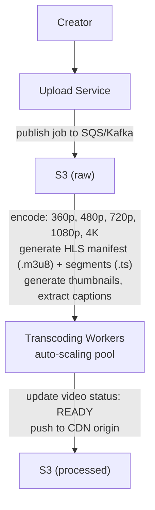
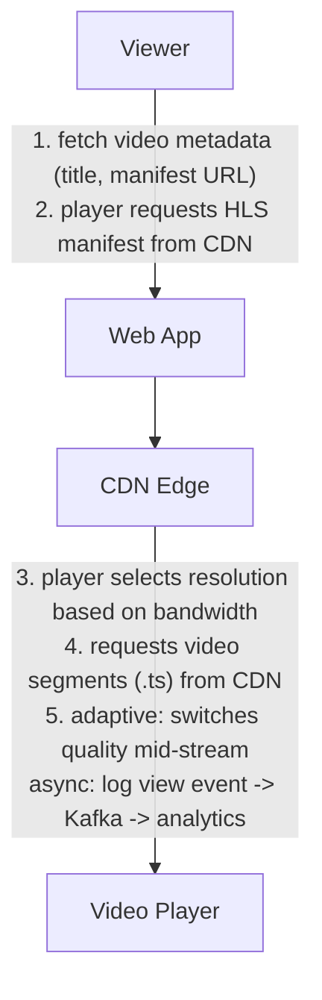

# Design YouTube

*Worked Example -- 75 min*

---

## Phase 1: Clarify the Problem & Scope *(5--7 min)*

> **Say:** "We're designing a video sharing platform. Creators upload videos, the system transcodes them into multiple resolutions, and viewers stream them with adaptive bitrate. Users also get a personalized home feed of recommended videos."

### Questions I'd Ask

- **What outcome are we optimizing for?** *-> Watch time (total minutes viewed), not views. A 10-minute video watched to completion is worth more than a clickbait video abandoned after 5 seconds. Secondary: creator ecosystem health (upload rate, creator revenue). This shapes the recommendation engine (optimize for predicted watch time, not clicks) and the transcoding pipeline (quality must be good enough that users don't abandon due to buffering).*
- **Upload vs. streaming priority?** *-> Streaming is 1000:1 more frequent than uploads. But upload reliability matters for creators -- a failed upload of a 2-hour video is devastating. Design both, optimize for streaming.*
- **Live streaming in scope?** *-> Out of scope for now. Fundamentally different pipeline (real-time transcoding vs. batch).*

### Agreed Scope

| In Scope | Out of Scope |
|---|---|
| Video upload & transcoding pipeline | Live streaming |
| Video streaming (adaptive bitrate) | Shorts / vertical video |
| Home feed / recommendations | Monetization / ads |
| Likes, comments, subscriptions | Content moderation (mention only) |
| Search | Creator Studio / analytics dashboard |

### Non-Functional Requirements

- **Video start time <2s** -- users abandon if buffering takes too long. CDN + adaptive bitrate are essential.
- **Upload processing within 10--30 min** -- creator sees "processing" then "published." Async pipeline.
- **Massive storage** -- petabytes of video. Cost optimization is a first-class concern.
- **Global** -- users everywhere. CDN with multi-region origin.
- **Read-heavy** -- ~1000:1 watch-to-upload ratio. System optimized for streaming reads.

> **Tip:** The defining tension: the UPLOAD path is a heavyweight async pipeline (transcode, process, store), while the WATCH path must be ultra-low-latency (CDN-served, adaptive bitrate). These are almost two different systems sharing a storage layer.

---

## Phase 2: Back-of-the-Envelope Estimation *(3--5 min)*

| Metric | Value | Detail |
|---|---|---|
| **Daily Active Users** | **~800M** | 2B+ registered, ~40% DAU |
| **Videos Watched / Day** | **~5B** | ~800M users x ~6 videos/day. ~58K plays/sec. |
| **Videos Uploaded / Day** | **~500K** | ~6/sec. Average duration: 7 min. Total: ~58K hours/day of new content. |
| **Ingestion per Day** | **~1.5 PB** | 500K x avg 3GB raw file. After transcoding to 5 resolutions: ~5x = 7.5 PB stored. |
| **Total Storage** | **~1 Exabyte** | Years of accumulated video. Tiered: hot (CDN) -> warm (S3) -> cold (Glacier). |
| **Egress Bandwidth** | **~100 Tbps peak** | 58K concurrent streams x avg 5 Mbps bitrate = ~290 Gbps base, 100 Tbps at global peak with CDN. |

> **Decision:** **Key insight #1:** Storage and bandwidth are THE cost drivers. Every optimization (better compression, smarter CDN caching, tiered storage) directly impacts the bottom line by millions of dollars.

> **Decision:** **Key insight #2:** The transcoding pipeline must handle 500K videos/day = ~6/sec. Each transcode to 5 resolutions takes 10-30 min of compute. This requires a massive, auto-scaling worker pool.

---

## Phase 3: High-Level Design *(8--12 min)*

### Major Components

```mermaid
graph TD
    subgraph CLIENTS
        A["Creator"]
        B["Viewer"]
    end

    subgraph EDGE / LOAD BALANCING
        C["CDN Edge<br/>video segments - thumbnails"]
        D["API Gateway<br/>auth - route"]
    end

    subgraph APPLICATION SERVICES
        E["Upload Service<br/>resumable - tus"]
        F["Transcode Pipeline<br/>FFmpeg - 360p-4K"]
        G["Streaming<br/>HLS/DASH - ABR"]
        H["Feed / Rec<br/>ML ranking"]
        I["Search<br/>Elasticsearch"]
    end

    subgraph MESSAGE QUEUE / ASYNC
        J["Kafka / SQS<br/>transcode jobs - events"]
    end

    subgraph DATA STORES
        K["PostgreSQL<br/>metadata - users"]
        L["S3<br/>raw + transcoded video"]
        M["Elasticsearch<br/>video search index"]
        N["ClickHouse<br/>analytics - view counts"]
    end

    A --> D
    B --> C
    B --> D
    D --> E
    D --> G
    D --> H
    D --> I
    E --> L
    E --> J
    J --> F
    F --> L
    G -.-> C
    I --> M
    H --> K
end
```

#### Upload Service [WRITE]

- Resumable upload (tus protocol)
- Store raw video to S3
- Publish transcode job to queue

#### Transcoding Pipeline [ASYNC HEAVY]

- FFmpeg workers (auto-scaling pool)
- Encode to 5 resolutions (360p--4K)
- Generate HLS/DASH manifests

#### Streaming Service [HOT PATH]

- Serve video manifest + segments
- Adaptive bitrate selection
- CDN-first, origin fallback

#### Feed / Rec Service [READ]

- Personalized home feed
- ML ranking model
- Precomputed candidate lists

#### Search Service [READ]

- Elasticsearch for video metadata
- Title, description, tags, captions

#### Video Metadata Service [CORE]

- Video info, channel, view counts
- Likes, comments
- Heavily cached

### Key Architecture Decisions

> **Say:** "Here's WHY I chose each technology -- mapping requirements to tradeoffs. Every choice has a rejected alternative and a consequence."

| Requirement | Decision | Why (and what was rejected) | Consistency |
|---|---|---|---|
| Transcoding takes 15-30 min -- can't block upload | Kafka/SQS queue -> worker pool | Acknowledge upload in seconds (file in S3). Transcode async with auto-scaling workers. Synchronous would timeout HTTP connections. | -- |
| Video storage at petabyte/month scale | S3 with lifecycle tiering | Hot (CDN) -> Warm (S3 Standard) -> Cold (Glacier). 80% of videos have <1K views -- tiered storage saves millions/month. | -- |
| Analytics: "views per country per hour" over billions | ClickHouse (not PostgreSQL) | Columnar store scans 1B+ rows/sec reading only needed columns. PostgreSQL reads full rows -- 10-100x slower for aggregations. | AP |
| Video start time <2s globally | CDN + Adaptive Bitrate Streaming (HLS) | CDN edge caching + client-side ABR means first segment loads from nearest PoP at optimal quality. Origin rarely hit. | -- |
| Metadata needs relational integrity | PostgreSQL for video metadata | Videos belong to channels, have tags, comments, playlists -- relational. Search index (ES) is secondary, derived from Postgres. | CP |
| Upload spikes after events (Super Bowl) | Auto-scaling worker pool, not fixed capacity | Workers scale 100->1000+ based on queue depth. Fixed capacity wastes money 99% of the time or fails during spikes. | -- |

### Flow 1: Video Upload & Processing



### Flow 2: Video Streaming



---

## Phase 4: Deep Dives *(25--30 min)*

### Deep Dive 1: Upload & Transcoding Pipeline (~10 min)

> **Goal:** **The core challenge:** Process 500K video uploads/day. Each requires transcoding to 5 resolutions, thumbnail generation, caption extraction. Total compute: millions of CPU-hours/day. Must be reliable (never lose an upload) and cost-efficient.

- **Resumable upload:** Large videos (multi-GB) need resumable uploads. Use the tus protocol or Google's resumable upload API. Client can resume from last byte on network failure. Upload directly to S3 via presigned multipart upload.
- **Transcoding DAG:** Not a single job -- it's a directed acyclic graph: (1) probe input format -> (2) transcode to 5 resolutions in parallel -> (3) generate HLS segments + manifests -> (4) generate thumbnails -> (5) extract/generate captions -> (6) content moderation scan -> (7) update metadata -> (8) push to CDN origin.
- **Worker pool:** Spot/preemptible instances for cost (60-80% savings). Jobs are idempotent and retryable -- if a spot instance is reclaimed, the job retries on another. Kubernetes with auto-scaling based on queue depth.

> **Decision:** **Why parallel transcode per resolution?** A 10-min 4K video takes ~30 min to transcode to 1080p on a single core. Doing 5 resolutions sequentially = 2.5 hours. In parallel = 30 min. We spin up 5 workers per video (one per resolution). The cost is the same (same total CPU), but time-to-publish drops 5x. Tradeoff: more orchestration complexity, but Step Functions / Temporal handles this cleanly.

> **Decision:** **Storage tiering:** Raw upload stored temporarily (deleted after 30 days). Transcoded versions in S3 Standard. Videos not accessed in 90 days -> S3 Infrequent Access. 1 year -> Glacier. This saves enormous storage costs since the long tail of videos has very few views.

```sql
-- HLS Output Structure (per video) --
s3://videos/{video_id}/
  master.m3u8           // master playlist (lists all resolutions)
  360p/
    playlist.m3u8       // resolution-specific playlist
    segment_000.ts      // 2-10 second video segments
    segment_001.ts
    ...
  720p/
    playlist.m3u8
    segment_000.ts
    ...
  1080p/ ...
  4k/ ...
  thumbnails/
    thumb_0.jpg, thumb_1.jpg, ...
  captions/
    en.vtt, es.vtt, ...  // WebVTT format
```

### Deep Dive 2: Streaming & CDN Architecture (~8 min)

> **Goal:** **The core challenge:** Serve 58K concurrent video streams globally with <2s start time. Bandwidth: 100 Tbps at peak. CDN hit ratio must be >95% to keep origin costs manageable.

- **Adaptive Bitrate Streaming (ABR):** Client player downloads the HLS master manifest, which lists all available resolutions. Player starts with a low resolution for fast start, then switches up as bandwidth estimate stabilizes. On bandwidth drop -> seamlessly drops to lower quality. This is the standard HLS/DASH behavior.
- **CDN strategy:** Multi-CDN (CloudFront + Akamai + Fastly) for redundancy and geo optimization. Popular videos cached at edge (thousands of PoPs). Long-tail videos cached at regional PoPs. Cache key: `{video_id}/{resolution}/segment_{n}`.
- **Prewarming:** When a video is published, pre-push the first few segments of each resolution to CDN edges in the creator's region. For viral videos, aggressively pre-warm globally.

> **Decision:** **Why HLS over DASH?** Both work, but HLS has broader device support (native on iOS/Safari, well-supported everywhere else). DASH is technically more flexible. At YouTube's scale, you'd support both. For this design, HLS as the primary with DASH as secondary. Tradeoff: maintaining two manifest formats, but the video segments themselves are the same.

> **Decision:** **View counting at scale:** 5B views/day can't be counted synchronously. Click -> Kafka event -> consumer increments counter in Redis. Periodically flush Redis counters to the Videos DB. Accept that the displayed count is ~30s stale. For "is this view legitimate?" filtering (bot detection, replay attacks), a separate fraud detection pipeline processes view events async.

### Deep Dive 3: Home Feed & Recommendations (~7 min)

> **Goal:** **The core challenge:** From a catalog of ~1B videos, select and rank the best 20--50 to show each of 800M users on their home page.

- **Two-stage architecture:** (1) **Candidate generation** -- narrow 1B videos down to ~1000 using lightweight models (collaborative filtering, content-based, subscription-based). (2) **Ranking** -- score the 1000 candidates with a heavier ML model (deep neural net) that predicts engagement probability. Return top 20.
- **Candidate sources:** Subscribed channels (recent uploads), watch history similarity (collaborative filtering), topic/category affinity, trending videos, and "explore" candidates for diversity.
- **Ranking features:** Video age, view velocity, user's watch history, user-channel affinity, video length preference, time of day, device type.
- **Serving:** Pre-generate candidate lists offline (batch, hourly). Ranking is online (per request) but fast (~50ms with model serving via TensorFlow Serving / TorchServe).

> **Decision:** **Why two-stage?** Running a deep ranking model over 1B videos per request is computationally impossible. The two-stage funnel (lightweight filter -> heavy ranker) is the standard industry approach. Tradeoff: the candidate generation stage might miss some relevant videos, but the ranking quality on the candidates it does find makes up for it.

### Deep Dive 4: Data Model & Storage Summary

| Data | Store | Access Pattern | Consistency |
|---|---|---|---|
| Video Files | S3 (tiered) + CDN | Write once, read many. CDN-first. ~1 EB total. | Eventual (CDN) |
| Video Metadata | PostgreSQL + Redis cache | Read by video_id. Heavily cached for watch page. | Strong write, eventual read |
| View / Like Counts | Redis (counter) -> flush to DB | 5B increments/day. Approximate display. | Eventual (30s stale) |
| Comments | PostgreSQL (sharded by video_id) | Append-heavy. Read paginated by video_id. | Strong |
| Subscriptions | PostgreSQL + Redis cache | "Who does user X subscribe to?" for feed. Graph-like. | Strong |
| Search Index | Elasticsearch | Video title, description, tags, auto-captions. | Near-real-time |
| Rec Candidates | Feature Store (Redis/Bigtable) | Pre-generated per user. Read at feed load. | Stale (hourly batch) |
| Transcode Jobs | SQS / Kafka | Job queue for transcoding workers. | At-least-once |
| View Events | Kafka -> ClickHouse | Streaming analytics. 58K events/sec. | Eventual |

---

## Phase 5: Cross-Cutting Concerns *(10--12 min)*

### Storage Architecture Summary

> **Goal:** **What goes where and why.** Each data store is chosen for its access pattern -- not by default. The question isn't "which database?" but "what are the read/write patterns, consistency requirements, and scale characteristics?"

| Data | Store | Why This Store |
|---|---|---|
| Raw uploads | S3 | Original video files. Write-once, read by transcoding pipeline. Lifecycle policy -> Glacier after 90 days. |
| Transcoded segments | S3 + CDN | HLS/DASH segments at 5 resolutions. CDN-first serving. Origin fallback for cold videos (<10 views/day). |
| Video metadata | PostgreSQL | Title, description, upload date, channel, privacy settings. Relational joins for channel pages. |
| View counts & analytics | ClickHouse | Columnar store for time-series analytics. "Views per country per hour" queries across billions of rows. |
| Search index | Elasticsearch | Video metadata + auto-generated captions. Full-text search with relevance scoring. |
| Transcode job queue | Kafka / SQS | Durable queue for upload -> transcode pipeline. Dead-letter queue for failed transcodes. |
| Recommendation features | Redis | Precomputed candidate lists per user. Refreshed hourly by ML pipeline. ~1000 video_ids per user. |

### Failure Scenarios

| Scenario | Mitigation |
|---|---|
| Transcode worker crashes mid-job | Job stays in queue with visibility timeout. On timeout, another worker picks it up. Jobs are idempotent -- re-running produces same output. Spot instance reclaims handled the same way. |
| CDN origin overloaded | Stale-while-revalidate. Multi-origin failover. Shield/mid-tier caching to reduce origin load. Popular videos never need origin after initial cache fill. |
| Viral video (10M views in 1 hour) | CDN absorbs the read load. Pre-warm globally when velocity exceeds threshold. View counter handled via Redis batch incrementing. Metadata cached aggressively. |
| S3 region outage | Cross-region replication for hot videos. CDN has cached content. Cold videos may be temporarily unavailable. Rebuild from other regions. |

### Scalability

> **Tip:** **Scalability.** Video storage is the dominant cost: at ~500 hours uploaded per minute, each generating 5 resolution variants, storage grows at ~2PB/month. The CDN absorbs 95%+ of read traffic -- origin servers only handle cache misses for cold videos. Transcoding scales horizontally with an auto-scaling worker pool: during upload surges (post-event uploads), workers scale from 100 to 1000+ within minutes. The recommendation service is pre-computed: ML models generate candidate lists offline, and the serving layer is a simple Redis lookup. The real scalability challenge is the long tail: 80% of videos have <1000 total views but still need to be stored, indexed, and servable. This is why tiered storage (hot CDN -> warm S3 -> cold Glacier) is essential for cost management.

### Cost Optimization (unique to video platforms)

- **Storage tiering:** ~90% of videos get <1% of total views. Move to Glacier after inactivity. Saves ~70% storage cost.
- **Codec optimization:** AV1 encoding reduces bandwidth ~30% vs. H.264 at same quality. Encode popular videos in AV1; long-tail stays H.264 (not worth the encode cost).
- **CDN cost:** Multi-CDN bidding -- route traffic to cheapest CDN per region. Peer-to-peer assist for live events.

### Security & Access Control

> **Decision:** **Security & Access Control.** Content moderation is the primary security concern: uploaded videos are scanned by ML classifiers (nudity, violence, copyright via Content ID) before being made public. Videos flagged by automated systems go into a human review queue. Copyright uses audio/video fingerprinting against a database of registered content. For user security: OAuth 2.0 for API access, session tokens with short TTLs, and rate limiting on uploads (prevent spam). CDN content is served over HTTPS with signed URLs for private/unlisted videos -- the URL includes a time-limited HMAC token, so sharing the URL only works within the validity window. Creator accounts with >100K subscribers require 2FA.

### Monitoring & SLOs

> **Tip:** **Monitoring & SLOs.** Key SLOs: video start time <2s (p95), rebuffering ratio <0.1%, upload-to-published <30 minutes. Monitored per-CDN-region: if a specific edge PoP degrades, traffic is rerouted to the next nearest. Transcoding pipeline has per-stage latency metrics: if "720p encoding" stage exceeds 5 minutes, alert fires. View count pipeline has an end-to-end latency SLO of <60 seconds (view event -> reflected in analytics dashboard). Creator Studio metrics (revenue, watch time) have separate freshness SLOs. Error budget: 99.95% availability on video playback -- roughly 22 minutes of allowed downtime per month, measured as "successful segment fetches / total segment requests."

---

## Phase 6: Wrap-Up & Evolution *(3--5 min)*

> **Say:** "This system is defined by the asymmetry between the upload path and the watch path. Uploading is a heavyweight async pipeline -- resumable uploads, a DAG of transcoding jobs on spot instances, multi-resolution HLS output. Watching is ultra-low-latency -- CDN-served adaptive bitrate streaming with <2s start time. The bridge is S3: uploads write to it, CDN pulls from it. Cost is the dominant concern at scale -- storage tiering, codec optimization, and multi-CDN routing are as architecturally important as any service design."

| Extension | Architecture Impact |
|---|---|
| Live Streaming | Completely different pipeline: ingest (RTMP) -> real-time transcode -> low-latency HLS (LL-HLS) -> CDN. No pre-processing possible. |
| Shorts | Vertical video format. Different transcoding profiles. Feed is swipe-based (infinite scroll of short videos), preloading next 3-5 videos. |
| Content Moderation | ML pipeline on upload: nudity, violence, copyright (Content ID fingerprinting). Block before publish or flag for human review. |
| Offline Downloads | DRM-encrypted video stored on device. License server controls access. Separate download manifest from streaming manifest. |

> **Tip:** **Closing framing:** YouTube's architecture is defined by COST at scale. When you're storing an exabyte and serving 100 Tbps, every percentage point of CDN hit ratio, every codec efficiency gain, every storage tier decision translates to millions of dollars. The technical design serves the economics.

---

## Phase 7: Interview Q&A *(Practice)*

> **Say:** "Here are the hardest questions an interviewer would ask about this design, and how to answer them. Each answer demonstrates deep understanding of the tradeoffs, not just surface knowledge."

**Q:** Why not transcode on upload instead of queueing?

**A:** Because transcoding is CPU-intensive and variable-duration. A 10-minute 4K video takes ~15-30 minutes to transcode into all 5 resolutions. If we did this synchronously, the upload API would need to hold the connection open for 30+ minutes -- HTTP timeouts would kill it. More importantly, upload traffic is spiky: after a major event (Super Bowl, product launch), thousands of creators upload simultaneously. A synchronous model would require provisioning for peak transcoding capacity at all times. The queue-based model lets us: (1) acknowledge the upload in seconds (file is in S3), (2) transcode at our own pace with backpressure (workers pull from queue), (3) auto-scale workers based on queue depth, (4) retry failed transcodes without re-uploading. The creator sees "Processing..." for 10-30 minutes, which is an accepted UX pattern. We do prioritize: verified creators and scheduled premieres get higher queue priority.

**Q:** How would you handle a video that suddenly gets 100M views in an hour?

**A:** The CDN handles this naturally -- that's its entire purpose. The video segments are cached at edge PoPs worldwide. After the first few thousand views, the segments are cached at every major PoP, and 99.9% of requests never hit origin. The real challenges are: (1) view counting -- 100M Kafka events/hour needs partitioning by video_id so a single consumer isn't overwhelmed, (2) comment section -- this becomes a write hotspot, so we use the same approach as Facebook likes: Redis INCR for the counter, Kafka for the event stream, batch flush to PostgreSQL, (3) recommendation cascade -- the video appears in many users' "Trending" feeds, which increases load on the recommendation serving layer. But since recs are pre-computed in Redis, this is just more cache reads. The one thing we'd actively do is ensure the video's origin copy is replicated to additional S3 regions in case the primary region's CDN connectivity degrades.

**Q:** Why ClickHouse for analytics instead of PostgreSQL?

**A:** YouTube analytics queries are almost always "aggregate X over time window, grouped by dimension." Example: "total watch time per country per day for the last 90 days." This is a columnar workload: you're scanning billions of rows but only reading 3-4 columns (watch_time, country, date, video_id). ClickHouse is purpose-built for this: columnar storage means it only reads the columns needed, compression ratios are 10-20x better than row-based stores, and it can scan 1B+ rows/second on a modest cluster. PostgreSQL would need to read entire rows, can't compress as effectively, and aggregate queries would take minutes instead of seconds. The tradeoff: ClickHouse has no transactions, limited UPDATE support, and no foreign keys. But analytics data is append-only (events are immutable), so we don't need any of those features.

**Q:** How do you decide which resolution to serve during adaptive bitrate streaming?

**A:** The client decides, not the server -- that's the key insight. We use HLS (HTTP Live Streaming) where the manifest file lists all available resolutions with their bandwidth requirements. The video player measures its actual download speed by timing how long each 2-second segment takes to fetch. If the last segment downloaded at 5Mbps, the player selects the highest resolution that requires <=5Mbps. If speed drops (user enters a tunnel), the player transparently switches to a lower resolution -- the next segment is fetched at 480p instead of 1080p. The server's job is just to have all segments pre-transcoded and available. The CDN serves whatever resolution the client requests. This client-side ABR is why we transcode into 5 resolutions upfront: 360p (0.5Mbps), 480p (1Mbps), 720p (2.5Mbps), 1080p (5Mbps), 4K (20Mbps). Each is independently cached at the CDN.

**Q:** What's your content moderation pipeline?

**A:** It's a multi-stage funnel designed to catch harmful content before it reaches viewers while minimizing false positives. Stage 1 (upload time): lightweight ML classifiers check thumbnail and first 30 seconds for NSFW content, known CSAM hashes (PhotoDNA), and Copyright ID audio fingerprints. Takes <60 seconds. If flagged with high confidence (>95%), the video is blocked and queued for human review. Stage 2 (pre-publish): full-video analysis runs during transcoding -- scene classification, speech-to-text for hate speech detection, frame-by-frame nudity detection. If flagged, the video stays in "processing" state (creator doesn't know it's flagged). Stage 3 (post-publish): community reports trigger re-review. Viral videos (>10K views/hour) get automatic re-scan with higher-sensitivity models. Stage 4: human reviewers handle appeals and ambiguous cases. The key tension: aggressive moderation catches bad content but also blocks legitimate content (false positives). We tune for high precision on auto-blocks and high recall on "queue for human review."
