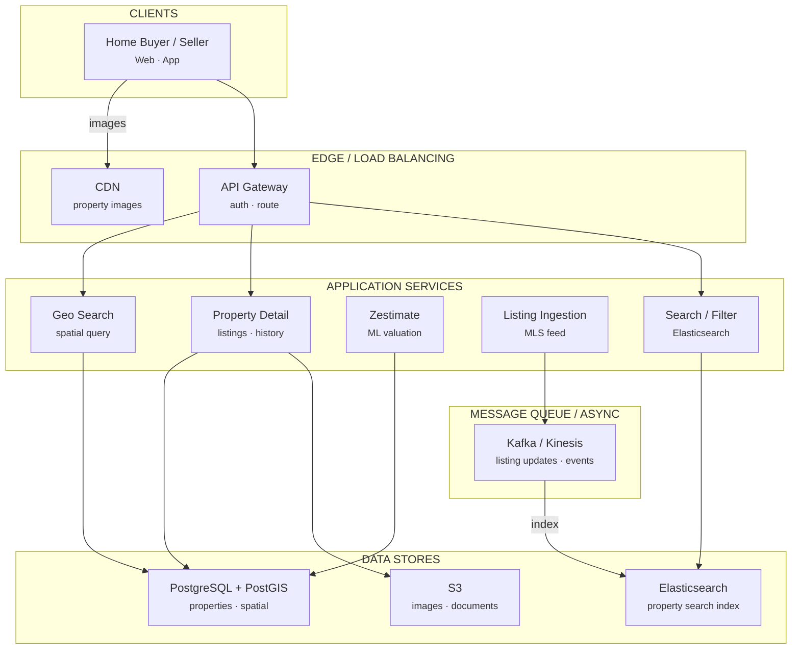
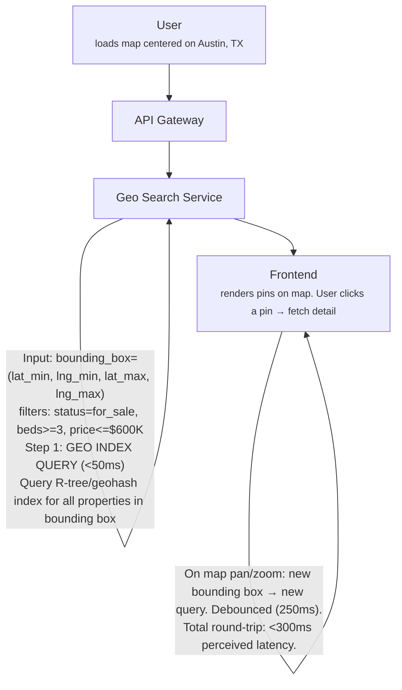
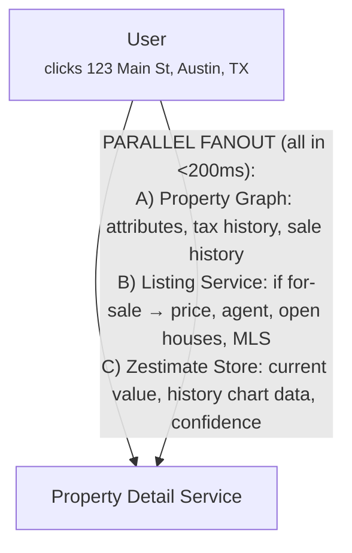

# Design Zillow

Real Estate Data Platform · 75 min

---

## Phase 1: Clarify the Problem & Scope *(5–7 min)*

> **Say:** "We're designing a real estate data platform like Zillow. The critical thing to understand: Zillow is NOT primarily a listings marketplace. It's a DATA COMPANY that knows about EVERY home in America — not just the ~2M currently for sale, but all ~110M residential properties. It knows their address, square footage, bedrooms, tax history, sale history, and most importantly, their estimated value (the Zestimate). This comprehensive property database is what draws 240M+ monthly visitors, which Zillow monetizes by selling leads to real estate agents (Premier Agent program). The fundamental challenge: ingest property data from hundreds of heterogeneous sources (MLS feeds, county records, user edits), resolve it into a single canonical record per property, score all 110M properties with an ML valuation model, and serve geo-spatial search over this massive dataset in real time."

### Questions I'd Ask

- **What outcome are we optimizing for?** — *Two linked outcomes: (1) Audience size — unique monthly visitors, driven by Zestimate accuracy (homeowners checking their value) and listing completeness (buyers searching). (2) Lead conversion — "Contact Agent" clicks that result in a home sale. These form the FLYWHEEL: more accurate data → more visitors → more leads → more agent revenue → fund more data. This tells us: Zestimate accuracy ISN'T a vanity metric — it directly drives the business model.*
- **What does Zillow actually know about?** — *Every residential property in the US (~110M). For each: physical attributes (beds, baths, sqft, lot size, year built), tax assessment history, sale transaction history, current listing status (for sale, for rent, off-market), photos, and the Zestimate.*
- **Data sources?** — *~800+ MLS feeds (active listings), county assessor/recorder offices (tax records, deeds), user-submitted updates ("I remodeled my kitchen"), agent-submitted data, satellite/aerial imagery.*
- **Revenue model?** — *Primarily Premier Agent: agents pay for leads (buyer inquiries) in specific zip codes. Secondary: rental advertising, mortgage marketplace, display ads. NOT transaction commissions.*
- **Scale?** — *~240M monthly visits, ~110M property records, ~2M active for-sale listings, ~1M rental listings, ~5M home sales/year in the US.*
- **What's the Zestimate?** — *ML-predicted market value for every home. Neural network model. Median error: ~6.9% for off-market homes, ~2% for on-market. Updated daily for all 110M homes.*

### Agreed Scope

| In Scope | Out of Scope |
|----------|-------------|
| Property database (110M homes) | Zillow Offers (iBuying — now discontinued) |
| Multi-source data ingestion & dedup | Mortgage origination / Zillow Home Loans |
| Zestimate ML pipeline | Rental application processing |
| Geo-spatial search & map UI | 3D home tour hosting |
| Listing display & detail pages | Construction marketplace |
| Agent lead marketplace (Premier Agent) | International markets |
| Saved searches & alerts | ShowingTime scheduling internals |

### Core Use Cases

- **UC1 (Map Search):** User drags map to a neighborhood → system queries all properties visible in the bounding box → shows pins for for-sale listings with prices, overlays Zestimates for off-market homes. Filters: price range, beds, baths, sqft, home type. Must update in <500ms as the map pans.
- **UC2 (Property Detail):** User clicks a property → full page: 30+ photos, Zestimate with history chart, tax history, sale history, school ratings, nearby comps, estimated mortgage payment, neighborhood stats, and "Contact Agent" button.
- **UC3 (Zestimate Computation):** Every night, the ML pipeline scores all 110M homes with updated data (new sales, new listings, tax assessments) → each home gets a fresh Zestimate and confidence interval.
- **UC4 (Agent Lead):** User clicks "Contact Agent" on a $500K listing in Austin → system routes the lead to the Premier Agent who bought that zip code → agent receives lead instantly (email + app notification) → lead tracked through CRM.
- **UC5 (Saved Search Alert):** User saves "3-bed homes in Brooklyn under $800K" → when a new listing matches, send push notification + email within minutes of listing appearing.

### Non-Functional Requirements

- **Comprehensive coverage:** Zillow's value proposition depends on having data for EVERY home, not just those for sale. A missing property = a homeowner who can't check their Zestimate = lost traffic.
- **Data freshness:** New MLS listings should appear on Zillow within 15 minutes of being posted. Zestimates updated daily. Tax/sale records: within days of recording.
- **Geo-spatial performance:** Map interactions must feel instantaneous. Bounding box query across 110M properties → return results in <200ms. This requires specialized geo-indexing.
- **Zestimate accuracy:** Median error of ~2% for on-market, ~7% for off-market. Model must handle geographic variation (NYC condo vs. rural Montana ranch) and temporal trends (hot/cold markets).
- **SEO performance:** Property detail pages are a MAJOR traffic source (Google searches for addresses). Pages must be server-rendered, fast-loading, and structured-data rich. ~110M unique URLs.

> **Tip:** The defining tension: EVERY HOME vs. JUST LISTINGS. Most real estate platforms only track active listings (~2M). Zillow tracks ALL 110M homes — including the 108M that are NOT for sale. This 50x larger dataset is what makes the Zestimate possible, what draws homeowners (not just buyers), and what makes Zillow the starting point for any real estate journey. But ingesting, deduplicating, and maintaining accurate data for 110M properties from hundreds of heterogeneous sources is the hardest data engineering problem in real estate.

---

## Phase 2: Back-of-the-Envelope Estimation *(3–5 min)*

| Metric | Value | Detail |
|--------|-------|--------|
| Total Properties | ~110M | Every residential property in the US. ~2M for sale, ~1M for rent, ~107M off-market. |
| Monthly Visits | ~240M | ~8M/day. Average session: 10 minutes, ~15 page views. Strong weekend and evening peaks. |
| Search Queries / Sec | ~3K (peak ~10K) | Each map pan/zoom = a new geo-spatial query. Users interact frequently while browsing. |
| Data Sources | 800+ MLS feeds | Plus ~3,000 county recorder offices, tax assessors, user edits, agent submissions. |
| Listing Updates / Day | ~500K | New listings, price changes, status changes (pending, sold), photo updates across all MLS feeds. |
| Zestimate Computation | 110M daily | Every home re-scored nightly. ~1,300 homes/sec sustained over 24 hours. |
| Property Record Size | ~5-10 KB each | Attributes + history. Total: ~1 TB structured data. Plus ~50 TB photos (avg 20 photos × 500KB). |
| Premier Agent Revenue | ~$1.5B/year | Agents pay per lead in their target zip codes. ~80% of Zillow's revenue. |

> **Decision:** **Key insight #1 — The entity resolution problem:** The same property appears in multiple data sources with different identifiers, formats, and even conflicting data. MLS says "3 bed / 2 bath." County records say "4 bed / 2 bath" (one bedroom was added in a remodel). User says "3 bed / 3 bath" (they finished the basement). Which is correct? Entity resolution — matching, merging, and resolving these conflicting records into one canonical property — is the core data engineering challenge.

> **Decision:** **Key insight #2 — Two very different query patterns:** (1) MAP SEARCH: bounding-box geo query returning MANY properties with minimal data (pin + price). Latency-critical (<200ms). Read-heavy. (2) DETAIL PAGE: single-property lookup returning EVERYTHING (photos, history, comps, Zestimate chart). Throughput-critical (handle 100K concurrent detail pages). These two patterns demand different storage/indexing strategies.

> **Decision:** **Key insight #3 — The Zestimate is a batch ML pipeline, not a real-time model:** Scoring 110M homes daily is a ~24-hour sustained computation, not a millisecond inference. It reads from the property database, joins with recent sales (comps), and outputs a new Zestimate per home. This is a data-parallel batch job (Spark), not an online serving system. The Zestimate is PRE-COMPUTED and stored, not computed on request.

---

## Phase 3: High-Level Design *(8–12 min)*

> **Say:** "I'll organize Zillow's architecture around its three layers: DATA INGESTION (getting property data in from hundreds of sources), the PROPERTY GRAPH (the canonical database of every home), and SERVING (search, detail pages, Zestimates, and leads). The Zestimate ML pipeline sits alongside as a massive batch job that reads from and writes back to the property graph."

### Key Architecture Decisions

> **Say:** "Here's WHY I chose each technology — mapping requirements to tradeoffs. Every choice has a rejected alternative and a consequence."

| Requirement | Decision | Why (and what was rejected) | Consistency |
|------------|----------|----------------------------|-------------|
| Spatial queries: "homes in this map viewport" | PostgreSQL + PostGIS (GiST spatial index) | ST_MakeEnvelope + GiST index = O(log n) spatial lookup. Returns 500-5K properties in <50ms even with 150M total properties. | — |
| Complex faceted search: price + beds + baths + location | Elasticsearch for search (PostGIS for spatial-only) | ES handles combined geo + attribute filters natively. PostGIS struggles at >100 concurrent faceted queries/sec. | AP |
| Zestimate for 150M properties (weekly refresh) | Batch ML pipeline on Spark (not real-time) | Recomputing 150M valuations is a distributed computing problem. Real-time per-request inference would cost 1000x more and not improve accuracy. | — |
| MLS listings must appear near-real-time | Kafka/Kinesis → Elasticsearch index update | Listing changes stream through Kafka, consumed by ES indexer. New listing searchable within 5 minutes. Batch import would mean hours of staleness. | AP |
| Property images at millions of photos | S3 + CDN (not database BLOBs) | Average listing has 20 photos. 1.5M active listings × 20 = 30M images. S3 + CDN handles this with zero DB overhead. | — |
| Data from dozens of MLS boards with different schemas | Entity resolution pipeline (deduplicate + normalize) | Same property appears in multiple MLS feeds with different formats. Address normalization + fuzzy matching to create single canonical record. | — |

### Major Components



#### Data Ingestion Pipeline [INGEST]

- 800+ MLS feeds (RETS/RESO Web API)
- County public records (tax, deeds, permits)
- User/agent edits (home facts)
- Entity resolution & deduplication

#### Property Graph [CORE]

- Canonical record for every US home (110M)
- Physical attributes, tax history, sale history
- Current listing status, photos, agent
- Pre-computed Zestimate + confidence interval

#### Zestimate Pipeline [ML BATCH]

- Neural network trained on sale transactions
- Features: physical, geographic tiling, temporal
- Daily batch scoring: 110M homes
- Outputs: Zestimate, confidence range, rent Zestimate

#### Geo Search Service [SEARCH]

- Bounding-box & polygon queries
- Geo-spatial index (R-tree / geohash)
- Filters: price, beds, baths, type, status
- Returns pin data for map rendering

#### Property Detail Service [DETAIL]

- Full property page: all attributes + history
- Comparable sales (comps) computation
- School ratings, neighborhood stats
- SEO-optimized server-rendered pages

#### Premier Agent Service [REVENUE]

- Lead routing: buyer inquiry → matched agent
- Agent inventory: which zips does each agent own?
- Lead delivery: email, SMS, CRM push
- Performance tracking: response time, conversion

#### Alert Engine [NOTIFY]

- Saved searches → new listing alerts
- Price change notifications
- Zestimate change alerts for homeowners
- Must fire within 15 min of listing change

#### Media Service [CDN]

- ~2B+ property photos
- Multiple resolutions (thumbnail, detail, gallery)
- CDN-served, aggressively cached
- Satellite/aerial imagery layer

### Flow 1: Map Search ("Homes for sale in Austin, TX")



### Flow 2: Property Detail Page



> **Say:** "Deep dives: (1) The Zestimate ML pipeline — how to value 110M homes daily. (2) Data ingestion — merging 800+ MLS feeds and county records into one canonical property. (3) Geo-spatial search — indexing 110M properties for sub-200ms bounding-box queries. (4) The Premier Agent lead marketplace — how Zillow's primary revenue engine works."

---

## Phase 4: Deep Dives *(25–30 min)*

### Deep Dive 1: Zestimate — Home Valuation ML Pipeline (~10 min)

> **Goal:** **The core challenge:** Predict the market value of every home in America — including the 98% that are NOT currently for sale and have no asking price. The model must handle enormous geographic variation (a $200K home in Iowa vs. a $5M condo in Manhattan), temporal trends (housing booms and busts), and data quality issues (incomplete/incorrect property attributes). Median error target: ~7% for off-market, ~2% for on-market homes.

```sql
-- Zestimate: Neural Network Architecture --

Input Features (per property):

  Physical attributes:
    beds, baths, sqft, lot_size, year_built, stories, garage_spaces,
    pool (y/n), property_type (single-family, condo, townhouse, etc.)
    basement_sqft, roof_type, heating_source, architectural_style

  Geographic features (multi-resolution tiling):
    Discretized geographic tiles at multiple scales:
    - Coarse tile (~county level): captures regional market trends
    - Medium tile (~zip code level): captures neighborhood character
    - Fine tile (~block level): captures hyper-local effects
    Each tile → learned EMBEDDING (the model learns that "tile X" means
    "expensive waterfront neighborhood" without being told explicitly)
    Also: Uber H3 hex cells at resolutions 5, 7, 9

  Temporal features:
    - Trend component: numerical feature spanning full training window
    - Seasonal component: cyclical features (month-of-year, quarter)
    - Market condition: recent price changes in the tile

  Comparable sales (comps):
    - Recent sales of similar homes nearby
    - Aggregated: median $/sqft in tile, days-on-market in tile
    - These are the STRONGEST predictive features

  Tax/assessment data:
    - Most recent tax assessed value
    - Assessment year (how stale?)

  On-market signal (when available):
    - Listing price (extremely predictive when present — ~2% error)
    - Days on market (longer = more likely to sell below asking)

Model Architecture:
  Deep neural network (the "Neural Zestimate")
  - Categorical features → learned embeddings (especially geo tiles)
  - Numerical features → batch normalization → dense layers
  - Multiple hidden layers with ReLU activation
  - Output: predicted sale price + confidence interval

Training Data:
  ~5M home sales/year in the US. Each sale: known price + property features.
  Training window: ~5-10 years of historical sales.
  Label: actual sale price. Features: property attributes at time of sale.

Scoring (daily batch):
  1. Load trained model
  2. Read all 110M property records + latest comp data
  3. Score each property → Zestimate + confidence range
  4. Write results to Zestimate Store
  5. Compare to previous day's Zestimate → flag large changes for review
  6. Update Zillow Home Value Index (ZHVI) aggregates

  Infrastructure: Apache Spark on AWS EMR
  Throughput: ~110M homes / ~20 hours = ~1,500 homes/sec
  Cost: ~$10-20K/day in compute (GPU/CPU cluster)
```

> **Decision:** **Why neural network over gradient-boosted trees (XGBoost)?** The previous Zestimate versions used ensemble methods (gradient-boosted trees). The Neural Zestimate switched to deep learning for three reasons: (1) GEOGRAPHIC EMBEDDINGS — the model needs to learn what "location X" means for pricing, and deep learning can learn rich embeddings for high-cardinality categorical features (millions of geographic tiles) far better than tree methods. (2) TEMPORAL DECOMPOSITION — the neural network can learn trend + seasonality components jointly with property features, allowing it to generalize across time. (3) COMPOSABILITY — additional models (time-to-sell prediction, rent estimation) can be layered on top of shared embeddings, sharing learned representations. Tradeoff: less interpretable than trees. Mitigated by computing feature importance and providing the Zestimate's confidence range to users.

**Zestimate Accuracy by Segment**

| Segment | Median Error | Why |
|---------|-------------|-----|
| On-market (listing price available) | ~2% | Listing price is an extremely strong signal. Model mostly predicts "close to asking." |
| Off-market, recent sale (<2 yr) | ~5% | Recent sale price + market trend. Good data quality. |
| Off-market, no recent sale | ~7-10% | Must rely on comps, physical attributes, tax assessment. More uncertainty. |
| Rural / unique properties | ~15%+ | Few comps, unique features (100-acre ranch). Model struggles with sparse data. |

### Deep Dive 2: Property Data Ingestion & Entity Resolution (~7 min)

> **Goal:** **The core challenge:** The same property appears in many data sources with DIFFERENT identifiers, DIFFERENT attribute values, and NO common key. County says "123 Main Street" with parcel_id=APN-12345. MLS says "123 Main St, Unit #" with mls_id=TX-98765. User says "123 Main st." — different address format, no ID at all. We must determine that these all refer to the SAME physical property, merge their data (preferring the most authoritative source for each attribute), and produce ONE canonical record.

```sql
-- Data Ingestion Pipeline --

Source Adapters (similar to Expedia's supplier adapters):
  ┌─────────────┐  ┌────────────┐  ┌──────────────┐  ┌──────────┐
  │ MLS Feed #1  │  │ County Tax  │  │ Deed Records │  │ User Edit│
  │ (RETS/RESO)  │  │ (CSV/FTP)   │  │ (XML/PDF)    │  │ (API)    │
  └──────┬───────┘  └──────┬──────┘  └──────┬───────┘  └────┬─────┘
         │                 │                 │                │
         ▼                 ▼                 ▼                ▼
  ┌──────────────────────────────────────────────────────────────┐
  │  Normalization Layer                                         │
  │  - Standardize address format (USPS standards)               │
  │  - Parse: "123 N Main St Apt 2B" → structured components     │
  │  - Normalize units: acres→sqft, fields→canonical schema       │
  │  - Validate: reject obviously bad data (0 beds, $0 price)    │
  └──────────────────────────┬───────────────────────────────────┘
                             │
                             ▼
  ┌──────────────────────────────────────────────────────────────┐
  │  Entity Resolution Engine                                    │
  │                                                              │
  │  INPUT: normalized record with address + attributes           │
  │                                                              │
  │  Step 1: ADDRESS MATCHING                                     │
  │    Standardize → geocode → match to existing property by:     │
  │    (a) Exact address match (90% of cases)                     │
  │    (b) Fuzzy match + geocode proximity (<50m, same parcel)    │
  │    (c) Parcel ID (APN) cross-reference                        │
  │                                                              │
  │  Step 2: CONFLICT RESOLUTION (when sources disagree)          │
  │    Source priority hierarchy:                                  │
  │    1. User/agent (most recent, but verify)                    │
  │    2. MLS feed (from listing agent, current)                  │
  │    3. County records (authoritative but often stale)          │
  │    4. Tax assessment (official but updated annually)          │
  │                                                              │
  │    Rule example: beds/baths → prefer MLS > county             │
  │    Rule example: lot_size → prefer county (surveyed)          │
  │    Rule example: year_built → prefer county (from permits)    │
  │                                                              │
  │  Step 3: MERGE → update canonical property record              │
  │    Publish event: "property_updated" → Kafka                   │
  └──────────────────────────────────────────────────────────────┘
                             │
                             ▼
                    Property Graph (canonical record)
                             │
                  ┌──────────┼──────────┐
                  ▼          ▼          ▼
            Geo Index    Search Index  Zestimate Pipeline
```

> **Decision:** **Why is entity resolution so hard?** Consider: "123 Main St" and "123 Main Street" — obviously the same. But what about "123 N Main St" vs "123 Main St N"? What about a condo building where the county has one record for the building but the MLS has individual listings per unit? What about a lot that was subdivided — the county still has the old single parcel, but MLS has two new addresses? What about a teardown and rebuild — same address, completely different house? Each of these cases requires specific handling. ML-based matching catches most cases, but a human review queue handles ambiguous matches (~1% of records). Getting entity resolution wrong means: duplicate listings, wrong Zestimate (applied to the wrong property), or missing properties entirely.

- **Address geocoding:** Every address → (latitude, longitude). Used for both entity resolution and geo-search. Geocoder must handle non-standard addresses, new construction (not yet in Google/USPS), and rural addresses ("County Road 42, 3rd mailbox on left").
- **MLS data freshness:** Zillow receives listing updates via RETS/RESO feeds. Most MLS feeds push updates every 15 minutes. Some smaller MLSs only update hourly. The ingestion pipeline must handle: new listings, price changes, status changes (active → pending → sold), photo additions, and listing withdrawals.
- **Streaming architecture:** Zillow moved from batch SQL Server processing to streaming (Kinesis Firehose → S3 Data Lake → Spark). Every property change is an event in a stream. Downstream consumers (search index, Zestimate, alerts) subscribe to relevant events.

### Deep Dive 3: Geo-Spatial Search (~5 min)

> **Goal:** **The core challenge:** When a user pans a map, the frontend sends a bounding box (SW corner lat/lng, NE corner lat/lng). The backend must return all matching properties within that box, filtered by price/beds/baths/status, in <200ms. The dataset is 110M properties. A city like Los Angeles contains ~1.5M properties. The index must support both coarse queries (entire state) and fine queries (a single block).

```sql
-- Geo-Spatial Indexing Strategy --

Option A: Geohash-based sharding (chosen)

  Geohash encodes (lat, lng) into a string: "9q8yyk" (6 chars = ~1.2km × 0.6km)
  Properties stored in partitions keyed by geohash prefix.

  Bounding box query:
    1. Compute all geohash cells that overlap the bounding box
    2. Query each cell's partition for matching properties
    3. Merge results, filter by precise lat/lng (cells are rectangular approximations)

  Advantages:
    - Natural spatial locality (nearby properties share geohash prefix)
    - Easy to shard: each geohash prefix = a partition
    - Prefix-based range queries on a B-tree index

  Disadvantage:
    - Geohash cells have edge effects (neighboring cells may have different prefixes)
    - Must query multiple cells for boundary-crossing bounding boxes

Option B: R-tree (alternative)
  Minimum bounding rectangle tree. Excellent for range queries.
  Used by PostGIS. Less natural for distributed sharding.

Option C: Elasticsearch with geo_point (pragmatic choice)
  Index each property as a document with a geo_point field.
  Built-in geo_bounding_box query.
  Handles filtering (price, beds) and geo simultaneously.
  Scales horizontally via sharding.
  Most practical for Zillow's use case.

Implementation (Elasticsearch):

  Index: properties
  Mapping:
    property_id:     keyword
    location:        geo_point    // {lat: 30.267, lon: -97.743}
    listing_status:  keyword      // for_sale, for_rent, off_market, sold
    price:           integer
    beds:            integer
    baths:           float
    sqft:            integer
    property_type:   keyword      // single_family, condo, townhouse
    zestimate:       integer
    thumbnail_url:   keyword

  Query:
    {
      "query": {
        "bool": {
          "filter": [
            {"geo_bounding_box": {"location": {"top_left": ..., "bottom_right": ...}}},
            {"term": {"listing_status": "for_sale"}},
            {"range": {"price": {"lte": 600000}}},
            {"range": {"beds": {"gte": 3}}}
          ]
        }
      },
      "size": 500,
      "_source": ["property_id", "location", "price", "beds", "baths", "thumbnail_url"]
    }

  Response time: <100ms for typical metro-area bounding boxes.
  Shard count: ~20-50 shards, distributed by geohash prefix.
```

> **Decision:** **Why Elasticsearch over PostGIS?** PostGIS (PostgreSQL with spatial extensions) is excellent for small-to-medium datasets. But at 110M properties with 10K queries/sec, PostGIS struggles because: (1) single-node PostgreSQL can't handle this read throughput, (2) read replicas help but don't scale horizontally, (3) complex multi-filter geo queries are expensive. Elasticsearch naturally shards across nodes, handles compound queries (geo + numeric filters + text search) in one pass, and scales horizontally by adding nodes. Tradeoff: Elasticsearch is eventually consistent (writes visible after ~1 second). Acceptable for search — we're not doing financial transactions.

### Deep Dive 4: Agent Lead Marketplace (Premier Agent) (~5 min)

> **Goal:** **The core challenge:** Premier Agent generates ~80% of Zillow's $1.5B+ revenue. Agents pay to "own" leads in specific zip codes. When a buyer clicks "Contact Agent" on a listing, the lead must be routed to the correct agent in <5 seconds. The marketplace must be fair (agents get leads proportional to spend), fast (agents who respond first win), and measurable (track every lead from click to closed sale).

```sql
-- Premier Agent Lead Flow --

How Agents Buy Leads:
  Agent registers for Premier Agent in target zip codes.
  Pricing: cost-per-impression model (share-of-voice in a zip code).
  Higher spend → agent's photo appears on more listings in that zip.
  Multiple agents can buy into the same zip code.
  "Share of voice" = agent's spend / total agent spend in that zip.

Lead Generation (user clicks "Contact Agent"):

  Step 1: User views listing at 123 Main St (zip 78704, Austin)
  Step 2: "Contact Agent" widget shows Premier Agent(s) for zip 78704
           Agent selection: round-robin weighted by share-of-voice
           Also may show the listing agent (if they participate)
  Step 3: User fills in: name, phone, email, "I'd like to see this home"
  Step 4: Lead routed to selected agent via:
           - Push notification (Zillow Premier Agent app)
           - Email
           - CRM integration (Salesforce, Follow Up Boss, etc.)
           - SMS alert
  Step 5: Agent contacts buyer (target: within 5 minutes)

Lead Quality & Attribution:
  Track lead lifecycle:
    GENERATED → DELIVERED → VIEWED → CONTACTED → SHOWING → OFFER → CLOSED

  Agent response time tracked (industry: agents who respond in <5 min
  are 10x more likely to convert than those who respond in 30 min).

  Connection rate, showing rate, and close rate computed per agent.
  Low-performing agents lose priority in lead routing.

  Attribution: if buyer who clicked "Contact Agent" eventually buys
  a home (tracked via public records sale data), attribute the sale
  to the Premier Agent program → compute ROI per agent.

Revenue Optimization:
  Dynamic pricing: zip codes with higher home values and more traffic
  cost more per impression. 78704 (Austin downtown) costs more than
  a rural zip code.

  Yield management: if a zip has unsold lead inventory, lower the price.
  If demand exceeds supply, auction-style pricing among agents.
```

> **Decision:** **Why share-of-voice over cost-per-lead?** Cost-per-lead seems fairer (agent pays only for leads received), but creates a problem: agents game the system by collecting leads without responding, hurting user experience. Share-of-voice (agent pays for visibility) aligns incentives: the agent is motivated to respond quickly because they've already paid. It also makes revenue more predictable for Zillow (monthly spend vs. variable CPL). Tradeoff: agents bear more risk (they pay even if leads don't convert). Mitigated by: Zillow provides performance dashboards, and agents can adjust spend monthly. Note: Zillow has been evolving this model — considering connection-based pricing where agents pay only for leads they actually connect with.

---

## Phase 5: Cross-Cutting Concerns *(10–12 min)*

### Storage Architecture Summary

> **Goal:** **What goes where and why.** Each data store is chosen for its access pattern — not by default. The question isn't "which database?" but "what are the read/write patterns, consistency requirements, and scale characteristics?"

| Data | Store | Why This Store |
|------|-------|---------------|
| Property records | PostgreSQL + PostGIS | Address, lat/lng, attributes, tax records. PostGIS for spatial queries. ~150M properties in the US. |
| Listing data (active) | PostgreSQL + Elasticsearch | MLS feed data: price, photos, status, agent. ES for search/filter. Updated near-real-time from MLS. |
| Zestimate model inputs | S3 + feature store | ML features: tax assessments, comparable sales, neighborhood stats. Refreshed weekly per property. |
| Property images | S3 + CDN | MLS photos + satellite/street view. CDN-first serving. ~20 images per listing. |
| Search index | Elasticsearch | Geo-spatial + faceted search. Filters: price, beds, baths, sqft, year built. Updated via Kafka on listing change. |
| User saved searches | PostgreSQL | Saved search criteria + notification preferences. Matched against new listings for email alerts. |
| Event stream | Kafka / Kinesis | listing.created, listing.updated, price.changed. Consumed by search index, Zestimate pipeline, alerts. |

### Failure Scenarios

| Scenario | Mitigation |
|----------|-----------|
| MLS feed goes down (no new listings from a region) | Detect: monitor listing update rate per MLS. If Dallas MLS goes silent for 30+ min → alert. Impact: new listings in Dallas won't appear. Existing listings remain visible (search index not cleared). Mitigation: show banner "Listings may not reflect latest changes in this area." Auto-recover when feed resumes. Backfill missed updates. |
| Zestimate pipeline fails mid-run | Zestimates are computed daily but don't EXPIRE — yesterday's Zestimate is still valid (home values don't change overnight). Pipeline is idempotent: restart from checkpoint. If pipeline can't complete by morning: serve previous day's Zestimates. Users won't notice a 1-day-old valuation. Alert ML team. |
| Entity resolution creates duplicate property | Same home appears twice in search results with different Zestimates. Detected by: (a) user reports "duplicate listing," (b) automated scan for properties within 10m with similar attributes. Resolution: merge records, picking best data from each. Redirect old property_id URLs to canonical. These are caught in days, not real-time. |
| Elasticsearch cluster degraded (slow search) | Search latency spikes from 100ms to 2 seconds. Mitigation: (1) reduce results per query (show 100 pins instead of 500), (2) increase clustering aggressiveness (fewer individual pins), (3) serve from read replicas, (4) add nodes. Search is fully horizontally scalable. Meanwhile, property detail pages (served from different store) are unaffected. |
| Agent lead delivery fails (email/SMS down) | Lead is the primary revenue event — must not be lost. Queue-based delivery: lead persisted to durable queue (SQS) BEFORE attempting delivery. If email fails → retry. If SMS fails → fallback to email. If all fail → queue for manual follow-up. Agent CRM integration has its own retry. Lead marked "undelivered" triggers operations alert. |
| Zestimate is wildly wrong for a prominent property | Public embarrassment risk (news articles: "Zillow says my home is worth $50K — it's worth $500K"). Caused by: missing data (model doesn't know about recent renovation), misidentified property (entity resolution error), or model limitation (unique property with no comps). Mitigation: confidence interval displayed alongside Zestimate. Homeowner can update home facts. Support escalation path for high-visibility errors. |

### Scalability

> **Tip:** Zillow's traffic is extremely location-dependent and seasonal. Austin, TX during a housing boom might generate 100x the traffic of a small town. The geo-search path uses PostGIS spatial indexes with bounding-box pre-filtering: a map viewport query first finds all properties within the visible rectangle (fast B-tree on lat/lng), then applies filters (price, beds, baths) on the smaller result set. Elasticsearch handles the more complex faceted searches. The scaling challenge unique to Zillow: they must have data on EVERY US property (~150M), not just active listings (~1.5M). This means the property database is 100x larger than the listing database. Zestimate computation is the heavy workload: re-estimating 150M property values weekly requires a distributed ML pipeline (Spark) that runs offline and writes results back to the property store. The website traffic scales with the real estate market — during low-rate periods, traffic can surge 3x, which is handled by auto-scaling the stateless search/API tier.

### SEO — The Silent Revenue Engine

- **110M unique URLs:** Every property has a permanent detail page URL. Google indexes these pages. When someone Googles "123 Main St Austin TX," Zillow's page ranks #1 → free traffic → lead opportunity.
- **Server-side rendering (SSR):** Property pages must be fully rendered HTML for Googlebot (not client-side React that Googlebot might not execute). SSR adds server cost but is critical for SEO.
- **Structured data (Schema.org):** Property pages emit JSON-LD structured data: address, price, beds, baths, photos. Google uses this for rich search results (price, photo in the SERP).
- **Page speed:** Core Web Vitals directly affect Google ranking. LCP (Largest Contentful Paint) target: <2.5 seconds. Photos (the heaviest element) served from CDN with lazy loading and responsive srcset.
- **Content freshness signal:** Active listings update frequently (price changes, status) → Google re-crawls often. Off-market pages update less → crawl budget managed carefully to prioritize active listings.

### Saved Search Alerts

- **Volume:** Tens of millions of saved searches. Each defined by: geo boundary + filters (price, beds, status).
- **Matching:** When a new listing appears (or price changes), evaluate against all saved searches that overlap the listing's location and match its attributes. This is an INVERTED problem: instead of "find listings matching a search," it's "find searches matching a listing."
- **Implementation:** Publish listing_change events to Kafka → saved-search matcher service consumes events → evaluates each against a spatial index of saved searches → generates notifications. Target: alert within 15 minutes of listing change.
- **Deduplication:** Don't alert the same user for the same listing twice (if price changes after initial alert). Dedup key: (user_id, property_id, alert_type).

### Data Licensing & Compliance

- **MLS data rules:** Each of the 800+ MLSs has its own rules about how data can be displayed. Some require Zillow to show the listing broker's name. Some restrict showing sold-price data. Some require data to be removed within 24 hours of expiration. Compliance is enforced per-MLS.
- **Fair Housing Act:** Search results cannot discriminate based on race, religion, national origin, family status, etc. Zillow must NOT allow targeting ads by protected characteristics. Personalization models must be audited for bias.
- **CCPA/privacy:** User search behavior and lead submissions contain personal data. Users can request deletion. Agent CRM integration must respect user opt-out preferences.

### Security & Access Control

> **Decision:** Property data involves multiple privacy concerns: homeowner names and addresses are public record (accessible via county assessor databases), but Zillow aggregates this with estimated values and recent sale prices, which some homeowners consider sensitive. CCPA compliance: users can request deletion of their data, including claimed home profiles. MLS data has contractual restrictions — some MLS boards require that listings be removed within 24 hours of going off-market (DMCA-like enforcement). Agent contact information is subject to TCPA regulations. API security: partner APIs (for real estate agents and brokerages) use OAuth 2.0 with scope restrictions — an agent can only access their own listings and leads, not competitors'. Rate limiting prevents scraping: residential IP detection and CAPTCHA for suspicious access patterns. Zestimate values are a legal sensitivity: Zillow includes disclaimers that Zestimates are estimates, not appraisals, to avoid liability claims from homeowners who feel their property is undervalued.

### Monitoring & SLOs

> **Tip:** SLOs: map search p95 <500ms, property detail page p95 <300ms, Zestimate freshness <7 days (recomputed weekly), MLS listing ingestion <15 minutes (new listing appears on Zillow). Search relevance measured by click-through rate on top-3 results — a ranking change that drops CTR is rolled back. MLS feed health monitored per-board: if a feed stops updating, alert fires within 30 minutes (stale listings damage user trust). Zestimate pipeline has per-metro accuracy tracking — if a metro's median error rate exceeds 5%, the model is flagged for retraining. Geographic hotspot detection: if a specific city generates 10x normal traffic (viral listing, market event), CDN and API capacity is pre-scaled for that region.

---

## Phase 6: Wrap-Up & Evolution *(3–5 min)*

> **Say:** "To summarize: Zillow is a DATA PLATFORM, not a listings marketplace. Its moat is the comprehensive PROPERTY GRAPH — a canonical record for every one of 110M US homes, assembled by ingesting data from 800+ MLS feeds and thousands of county offices through an entity resolution pipeline that matches, merges, and resolves conflicting records into one truth per property. On top of this graph sits the ZESTIMATE — a neural network trained on millions of historical sales, using geographic tile embeddings at multiple resolutions and temporal decomposition to predict every home's market value daily. This batch-computed valuation is what draws 240M monthly visitors (homeowners checking their value + buyers comparison shopping), which Zillow monetizes through PREMIER AGENT — a lead marketplace where agents pay for share-of-voice in target zip codes and receive buyer inquiries routed within seconds. GEO-SPATIAL SEARCH uses Elasticsearch with geohash-based sharding to serve sub-200ms bounding-box queries over the full 110M properties, with zoom-dependent clustering to keep the map readable. SEO is the silent engine: 110M server-rendered property URLs capture organic Google traffic for every address search in America."

### What I'd Build Next

| Extension | Architecture Impact |
|-----------|-------------------|
| AI Home Shopping Assistant | Conversational interface: "Find me a 3-bed near good schools in Austin under $500K with a pool." Requires: natural language → structured query translation, multi-turn refinement, integration with search service, and recommendation model that understands taste (not just filters). |
| Touring & Offers (full transaction) | Move beyond leads into facilitating the actual transaction: schedule tours (ShowingTime integration), submit offers digitally, manage escrow/closing. Creates a transaction platform, not just a media company. Requires: real-time availability for tours, offer management workflow, digital signature integration. |
| Renovation Value Estimator | "If I add a bathroom, how much would my home value increase?" Requires: training a model on before/after renovation data (permit records + sale prices), understanding renovation costs by market, and presenting ROI estimates per improvement type. |
| Climate Risk Layer | Show flood, fire, heat, and storm risk per property. Increasingly important for buyers and insurers. Requires: integrating FEMA flood maps, wildfire risk models, climate projection data. Serve as a layer on the property detail page and search filters ("exclude flood zone"). |
| Real-Time Zestimate (streaming) | Today the Zestimate is batch-computed daily. A streaming version would update within minutes of a nearby sale closing. Requires: streaming pipeline (Kafka + Flink) that detects new sale events, identifies affected properties (same neighborhood), and incrementally updates their Zestimates. Much harder than batch but enables "your home value just changed" push notifications. |

> **Tip:** **Closing framing:** Zillow's genius is a FLYWHEEL that starts with data, not transactions. Step 1: Build the most comprehensive property database (110M homes, not just 2M listings). Step 2: Compute a value for EVERY home (the Zestimate) — this draws homeowners who aren't even buying or selling, just curious. Step 3: This massive audience (240M visits/month) makes Zillow the place agents MUST be to find buyers. Step 4: Agent spend funds more data collection and engineering. The Zestimate is the flywheel's engine — it's why a homeowner visits Zillow on a random Tuesday ("what's my home worth today?"), which makes Zillow the #1 traffic source for real estate, which makes Premier Agent worth $1.5B/year. Architecturally, everything serves the property graph: ingestion enriches it, the Zestimate leverages it, search queries it, and leads monetize it.

---

## Phase 7: Interview Q&A *(Practice)*

> **Say:** "Here are the hardest questions an interviewer would ask about this design, and how to answer them. Each answer demonstrates deep understanding of the tradeoffs, not just surface knowledge."

**Q:** How does PostGIS handle "show me all homes for sale in this map viewport" efficiently?

**A:** When a user pans the map to a viewport (say, Austin downtown), the frontend sends the bounding box coordinates: (SW_lat, SW_lng, NE_lat, NE_lng). PostGIS uses a GiST (Generalized Search Tree) spatial index to find all properties within that rectangle in O(log n) time. The query is: `WHERE location && ST_MakeEnvelope(sw_lng, sw_lat, ne_lng, ne_lat, 4326)`. The && operator uses the spatial index — it doesn't scan all 150M properties. For a typical viewport showing a neighborhood, this returns 500-5000 properties in <50ms. The frontend then clusters nearby pins to avoid rendering thousands of markers. As the user zooms in, the cluster expands. The tricky part is combining spatial with attribute filters: "homes in this viewport under $500K with 3+ bedrooms." PostGIS handles the spatial part, but for complex faceted queries, we route to Elasticsearch, which maintains a geo-point index alongside the attribute indices. The choice between PostGIS and ES depends on query complexity.

**Q:** How accurate is the Zestimate, and what's the ML pipeline?

**A:** The Zestimate has a median error rate of ~2-3% for on-market homes and ~7% for off-market homes. The ML pipeline runs weekly: (1) feature engineering: for each of 150M properties, compute features from public records (tax assessment, lot size, year built, recent renovations), comparable sales (similar homes sold within 1 mile in the last 6 months), neighborhood stats (school ratings, crime rates, walkability), and macro factors (interest rates, local employment). (2) Model training: gradient-boosted trees (XGBoost) trained on the last 12 months of actual sale prices vs. features. Separate models per metro area because real estate is hyperlocal. (3) Inference: apply the model to all 150M properties and write results to the property store. This runs on a Spark cluster — feature computation is the bottleneck (joining across 20+ data sources per property). The accuracy limitation is fundamentally about data: interior condition (renovated kitchen vs. original) isn't in public records. This is why on-market homes (with listing photos and descriptions that imply condition) have better estimates.
